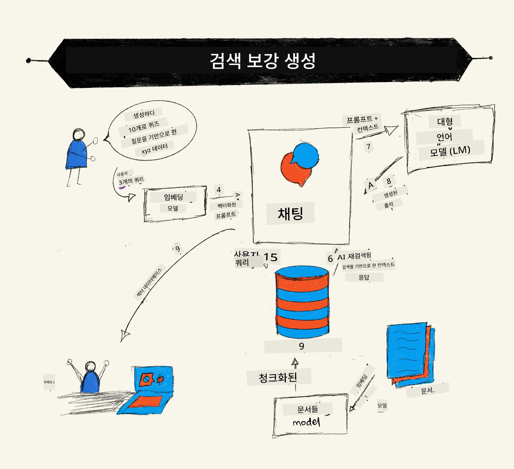
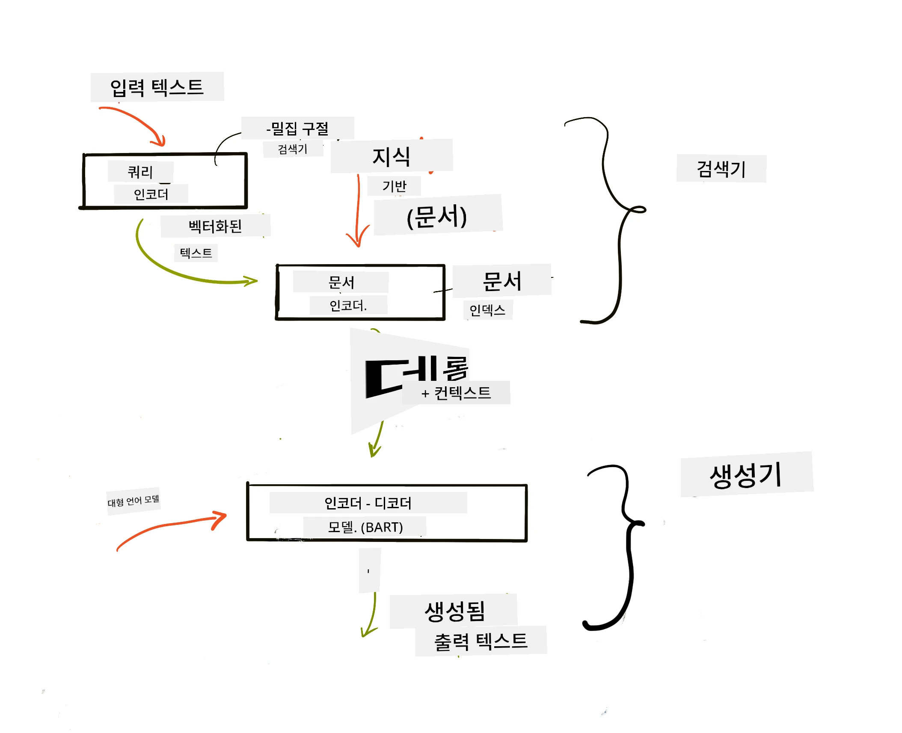
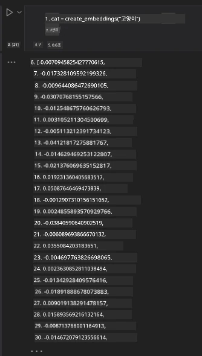

# 검색 증강 생성(RAG) 및 벡터 데이터베이스

[](https://youtu.be/4l8zhHUBeyI?si=BmvDmL1fnHtgQYkL)

검색 애플리케이션 수업에서, LLM(대형 언어 모델)에 자신의 데이터를 통합하는 법을 간략히 배웠습니다. 이번 수업에서는 LLM 애플리케이션에서 데이터를 기반으로 하는 개념, 그 프로세스의 메커니즘과 임베딩과 텍스트 모두를 포함한 데이터 저장 방법에 대해 더 깊이 다루겠습니다.

> **영상 곧 공개 예정**

## 소개

이번 수업에서는 다음 내용을 다룹니다:

- RAG의 소개, 무엇인지 그리고 AI(인공지능)에서 왜 사용되는지.

- 벡터 데이터베이스가 무엇인지 이해하고 애플리케이션용으로 벡터 데이터베이스 생성하기.

- 애플리케이션에 RAG를 통합하는 실용적인 예제.

## 학습 목표

이번 수업을 마치면 다음을 할 수 있습니다:

- 데이터 검색 및 처리에서 RAG의 중요성을 설명할 수 있습니다.

- RAG 애플리케이션을 설정하고 데이터를 LLM에 기반시킬 수 있습니다.

- LLM 애플리케이션에서 RAG와 벡터 데이터베이스를 효과적으로 통합할 수 있습니다.

## 시나리오: 우리만의 데이터로 LLM 향상시키기

이번 수업에서는 교육 스타트업에 자체 노트를 추가하여 챗봇이 다양한 주제에 대해 더 많은 정보를 얻을 수 있도록 하려 합니다. 우리가 가진 노트를 사용해 학습자들이 더 잘 공부하고 여러 주제를 이해하여 시험 준비를 더 쉽게 할 수 있게 할 것입니다. 시나리오를 만들기 위해 다음을 사용할 것입니다:

- `Azure OpenAI:` 챗봇 생성에 사용할 LLM

- `AI for beginners' lesson on Neural Networks:` LLM에 기반할 데이터

- `Azure AI Search` 및 `Azure Cosmos DB:` 데이터를 저장하고 검색 인덱스를 생성하기 위한 벡터 데이터베이스

사용자들은 자신의 노트에서 연습 퀴즈를 만들고 복습 플래시 카드를 만들며, 요약된 개요를 얻을 수 있을 것입니다. 시작하기 전에 RAG가 무엇이며 어떻게 작동하는지 살펴봅시다:

## 검색 증강 생성(RAG)

LLM 기반 챗봇은 사용자 프롬프트를 처리하여 응답을 생성합니다. 다양한 주제에 대해 상호작용하며 사용자와 대화할 수 있도록 설계되었습니다. 그러나 응답은 제공된 문맥과 근간 데이터에 한정됩니다. 예를 들어, GPT-4의 지식 컷오프는 2021년 9월로, 그 이후 사건에 대해서는 알지 못합니다. 또한 LLM 훈련에 사용된 데이터는 개인 노트나 회사 제품 매뉴얼 같은 기밀 정보를 제외합니다.

### RAG가 작동하는 방식



노트에서 퀴즈를 생성하는 챗봇을 배포하려면 지식 기반과 연결해야 합니다. 이때 RAG가 도움을 줍니다. RAG는 다음과 같이 작동합니다:

- **지식 기반:** 검색 전에 문서들을 수집 및 전처리해야 하며, 보통 큰 문서를 작은 단위로 쪼갠 뒤 텍스트 임베딩으로 변환해 데이터베이스에 저장합니다.

- **사용자 쿼리:** 사용자가 질문을 합니다.

- **검색:** 사용자가 질문하면 임베딩 모델이 지식 기반에서 관련 정보를 검색해 프롬프트에 반영할 수 있도록 합니다.

- **증강 생성:** LLM이 검색된 데이터를 바탕으로 응답을 향상시킵니다. 즉, 사전에 훈련된 데이터뿐 아니라 추가된 문맥 내의 관련 정보를 활용해 답변을 생성합니다. LLM은 사용자 질문에 대한 답변을 반환합니다.



RAG 아키텍처는 인코더와 디코더 두 부분으로 구성된 트랜스포머를 사용해 구현됩니다. 예를 들어, 사용자가 질문하면 입력 텍스트가 단어 뜻을 담는 벡터로 '인코딩'되고, 그 벡터가 문서 인덱스에 의해 '디코딩'되어 사용자 쿼리에 기초한 새 텍스트가 생성됩니다. LLM은 인코더-디코더 모델을 모두 활용해 출력을 만듭니다.

제안된 논문 [Retrieval-Augmented Generation for Knowledge intensive NLP (natural language processing software) Tasks](https://arxiv.org/pdf/2005.11401.pdf?WT.mc_id=academic-105485-koreyst)에 따르면 RAG 구현에는 두 가지 접근법이 있습니다:

- **_RAG-Sequence_**: 검색된 문서를 활용해 사용자 질문에 최적의 답변 예측

- **RAG-Token**: 문서를 사용해 다음 토큰 생성 후 이를 바탕으로 사용자 질문에 답변

### 왜 RAG를 사용할까요?

- **정보 풍부성:** 응답이 최신이며 현재 정보를 반영하도록 보장합니다. 전문 분야 작업 수행 능력을 향상시키기 위해 내부 지식 기반에 접근합니다.

- **허위 정보 감소:** **검증 가능한 데이터**를 활용해 사용자 질문에 문맥을 제공합니다.

- **비용 효율적:** LLM 전체 미세조정보다 더 경제적입니다.

## 지식 기반 생성

이번 애플리케이션은 개인 데이터, 즉 AI 초보자용 커리큘럼의 신경망 강의에 기반합니다.

### 벡터 데이터베이스

벡터 데이터베이스는 전통적인 데이터베이스와 달리 임베딩된 벡터를 저장, 관리, 검색하는 특수 데이터베이스입니다. 문서의 수치화된 표현을 저장합니다. 데이터를 수치 임베딩으로 분해하면 AI 시스템이 데이터를 더 쉽게 이해하고 처리할 수 있습니다.

임베딩은 LLM이 입력으로 허용하는 토큰 수에 제한이 있어 벡터 데이터베이스에 저장합니다. 전체 임베딩을 LLM에 통째로 전달할 수 없기에 이를 작은 덩어리로 분할해, 사용자가 질문할 때 질문과 가장 유사한 임베딩을 프롬프트와 함께 반환합니다. 덩어리 나누기는 LLM으로 전달되는 토큰 수를 줄여 비용도 줄입니다.

대표적인 벡터 데이터베이스로는 Azure Cosmos DB, Clarifyai, Pinecone, Chromadb, ScaNN, Qdrant, DeepLake 등이 있습니다. Azure CLI를 사용해 Azure Cosmos DB 모델을 다음 명령어로 생성할 수 있습니다:

```bash
az login
az group create -n <resource-group-name> -l <location>
az cosmosdb create -n <cosmos-db-name> -r <resource-group-name>
az cosmosdb list-keys -n <cosmos-db-name> -g <resource-group-name>
```

### 텍스트를 임베딩으로 변환하기

데이터를 저장하기 전에 벡터 임베딩으로 변환해야 합니다. 긴 문서나 긴 텍스트라면 예상 질문에 따라 문장을 쪼갤 수 있습니다. 문장 또는 단락 단위로 나눌 수 있으며, 임베딩은 주변 단어의 의미를 반영하므로 문서 제목이나 일부 앞뒤 텍스트를 추가해 컨텍스트를 보강할 수 있습니다. 다음과 같이 데이터를 쪼갭니다:

```python
def split_text(text, max_length, min_length):
    words = text.split()
    chunks = []
    current_chunk = []

    for word in words:
        current_chunk.append(word)
        if len(' '.join(current_chunk)) < max_length and len(' '.join(current_chunk)) > min_length:
            chunks.append(' '.join(current_chunk))
            current_chunk = []

    # 마지막 청크가 최소 길이에 도달하지 못했더라도 어쨌든 추가하세요
    if current_chunk:
        chunks.append(' '.join(current_chunk))

    return chunks
```

덩어리로 나눈 뒤에는 여러 임베딩 모델을 사용해 텍스트를 임베딩할 수 있습니다. 사용 가능한 모델로는 word2vec, OpenAI의 ada-002, Azure Computer Vision 등이 있습니다. 어떤 모델을 쓸지는 사용하는 언어, 인코딩하는 콘텐츠 종류(텍스트/이미지/오디오), 인코딩 가능한 입력 크기, 임베딩 출력 길이에 따라 다릅니다.

OpenAI의 `text-embedding-ada-002` 모델로 임베딩한 예시는 다음과 같습니다:


## 검색과 벡터 탐색

사용자가 질문하면, 검색자는 쿼리 인코더를 사용해 질문을 벡터로 변환하고, 문서 검색 인덱스에서 입력과 관련된 벡터를 찾습니다. 완료되면 입력 벡터와 문서 벡터를 텍스트로 변환해 LLM에 전달합니다.

### 검색

검색은 시스템이 검색 조건에 맞는 문서를 신속히 찾는 과정을 의미합니다. 검색자의 목표는 맥락 제공과 LLM에 데이터를 기반으로 하는 데 사용할 문서를 찾는 것입니다.

데이터베이스 내에서 검색하는 방법은 여러 가지가 있습니다:

- **키워드 검색** - 텍스트 검색에 사용

- **벡터 검색** - 임베딩 모델을 사용해 문서를 텍스트에서 벡터 표현으로 변환하여 단어 의미를 기반으로 **의미 검색** 수행. 사용자 질문과 가장 가까운 벡터를 가진 문서를 쿼리합니다.

- **하이브리드** - 키워드 검색과 벡터 검색을 결합한 방식

검색 시 데이터베이스에 유사한 답변이 없으면 시스템이 최적의 정보를 제공하지만, 관련성 최대 거리를 설정하거나 키워드와 벡터 검색을 결합한 하이브리드 검색을 사용할 수 있습니다. 이 수업에서는 하이브리드 검색을 사용할 것이며, 덩어리와 임베딩이 포함된 데이터프레임에 데이터를 저장합니다.

### 벡터 유사도

검색자는 지식 데이터베이스에서 서로 가까운 임베딩(가장 가까운 이웃)을 찾습니다. 유사한 텍스트들이기 때문입니다. 사용자가 질문하면 먼저 임베딩 한 후 유사한 임베딩과 매칭합니다. 서로 다른 벡터가 얼마나 유사한지 측정하는 일반적인 방법은 두 벡터 사이의 각도를 이용한 코사인 유사도입니다.

다른 방법으로는 벡터 끝점 간 직선 거리를 나타내는 유클리드 거리, 두 벡터 대응 요소 곱의 합을 측정하는 내적(dot product)이 있습니다.

### 검색 인덱스

검색 전에 지식 기반용 검색 인덱스를 구축해야 합니다. 인덱스는 임베딩을 저장하며 대용량 데이터베이스에서도 가장 유사한 덩어리를 빠르게 검색합니다. 로컬에서 인덱스를 생성할 수 있습니다:

```python
from sklearn.neighbors import NearestNeighbors

embeddings = flattened_df['embeddings'].to_list()

# 검색 인덱스 생성
nbrs = NearestNeighbors(n_neighbors=5, algorithm='ball_tree').fit(embeddings)

# 인덱스를 쿼리하려면 kneighbors 메서드를 사용할 수 있습니다
distances, indices = nbrs.kneighbors(embeddings)
```

### 재순위 매기기

데이터베이스를 쿼리한 후에는 결과를 관련성 순으로 정렬해야 할 수 있습니다. 재순위 매기는 기계 학습을 적용해 검색 결과를 가장 관련성 높은 항목부터 정렬합니다. Azure AI Search에서는 의미(relevance) 재순위 기능이 자동으로 수행됩니다. 근접 이웃 기반 재순위 예시는 다음과 같습니다:

```python
# 가장 유사한 문서 찾기
distances, indices = nbrs.kneighbors([query_vector])

index = []
# 가장 유사한 문서 출력하기
for i in range(3):
    index = indices[0][i]
    for index in indices[0]:
        print(flattened_df['chunks'].iloc[index])
        print(flattened_df['path'].iloc[index])
        print(flattened_df['distances'].iloc[index])
    else:
        print(f"Index {index} not found in DataFrame")
```

## 종합하기

마지막 단계로 LLM을 통합해 우리 데이터를 기반으로 답변을 받을 수 있도록 합니다. 다음과 같이 구현할 수 있습니다:

```python
user_input = "what is a perceptron?"

def chatbot(user_input):
    # 질문을 쿼리 벡터로 변환합니다
    query_vector = create_embeddings(user_input)

    # 가장 유사한 문서를 찾습니다
    distances, indices = nbrs.kneighbors([query_vector])

    # 문서를 쿼리에 추가하여 컨텍스트를 제공합니다
    history = []
    for index in indices[0]:
        history.append(flattened_df['chunks'].iloc[index])

    # 히스토리와 사용자 입력을 결합합니다
    history.append(user_input)

    # 메시지 객체를 생성합니다
    messages=[
        {"role": "system", "content": "You are an AI assistant that helps with AI questions."},
        {"role": "user", "content": "\n\n".join(history) }
    ]

    # 채팅 완성 기능을 사용하여 응답을 생성합니다
    response = openai.chat.completions.create(
        model="gpt-4",
        temperature=0.7,
        max_tokens=800,
        messages=messages
    )

    return response.choices[0].message

chatbot(user_input)
```

## 애플리케이션 평가

### 평가 지표

- 응답 품질: 자연스럽고 유창하며 인간다운지 평가

- 기반 데이터 신뢰성: 응답이 제공된 문서에서 기인했는지 평가

- 관련성: 응답이 질문과 일치하고 관련 있는지 평가

- 유창성: 답변이 문법적으로 의미 있는지 평가

## RAG(검색 증강 생성) 및 벡터 데이터베이스 활용 사례

다음과 같은 다양한 사례에서 함수 호출이 애플리케이션을 개선할 수 있습니다:

- 질문 응답: 회사 데이터를 기반으로 직원이 질문할 수 있는 채팅 구축

- 추천 시스템: 영화, 음식점 등 가장 유사한 값을 매칭하는 시스템 제작

- 챗봇 서비스: 채팅 기록 저장과 사용자 데이터를 바탕으로 대화 개인화

- 이미지 검색: 벡터 임베딩 기반으로 이미지 인식 및 이상 징후 탐지에 활용

## 요약

이번 수업에서 RAG의 기본 영역을 다뤘습니다: 데이터 추가, 사용자 쿼리, 출력. RAG 생성 간소화를 위해 Semanti Kernel, Langchain, Autogen 등의 프레임워크를 사용할 수 있습니다.

## 과제

검색 증강 생성(RAG) 학습을 이어가려면 다음을 구축해보세요:

- 원하는 프레임워크로 애플리케이션 프런트엔드 제작

- LangChain이나 Semantic Kernel 같은 프레임워크 활용해 애플리케이션 재구현

수업 완료를 축하합니다 👏.

## 학습은 여기서 끝나지 않습니다, 여정을 계속하세요

이번 수업 이후에는 [Generative AI Learning 컬렉션](https://aka.ms/genai-collection?WT.mc_id=academic-105485-koreyst)을 확인해 생성형 AI 지식을 계속 쌓아가세요!

---

<!-- CO-OP TRANSLATOR DISCLAIMER START -->
**면책 조항**:  
이 문서는 AI 번역 서비스 [Co-op Translator](https://github.com/Azure/co-op-translator)를 사용하여 번역되었습니다. 정확성을 위해 노력하고 있으나, 자동 번역에는 오류나 부정확한 부분이 있을 수 있음을 유의해 주시기 바랍니다. 원문은 해당 언어로 작성된 문서가 권위 있는 출처로 간주되어야 합니다. 중요한 정보의 경우, 전문적인 인간 번역을 권장합니다. 본 번역 사용으로 인한 오해나 잘못된 해석에 대해 당사는 책임을 지지 않습니다.
<!-- CO-OP TRANSLATOR DISCLAIMER END -->