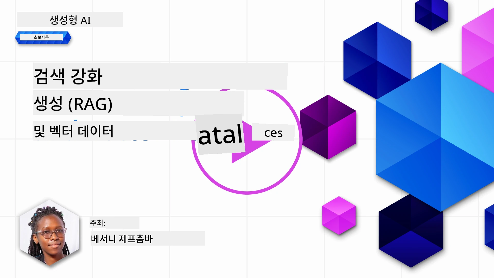
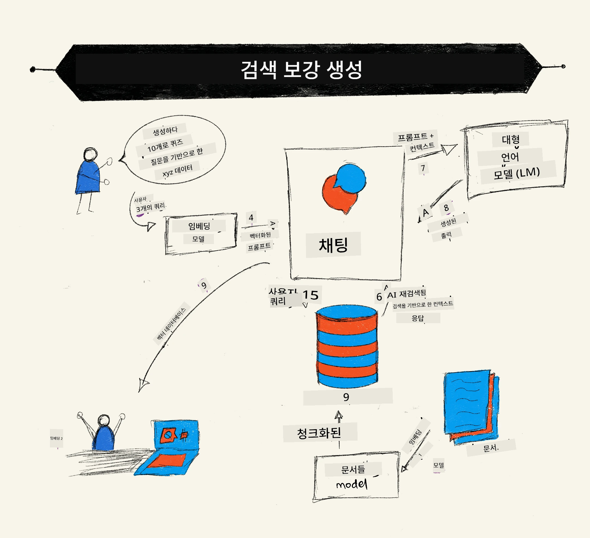
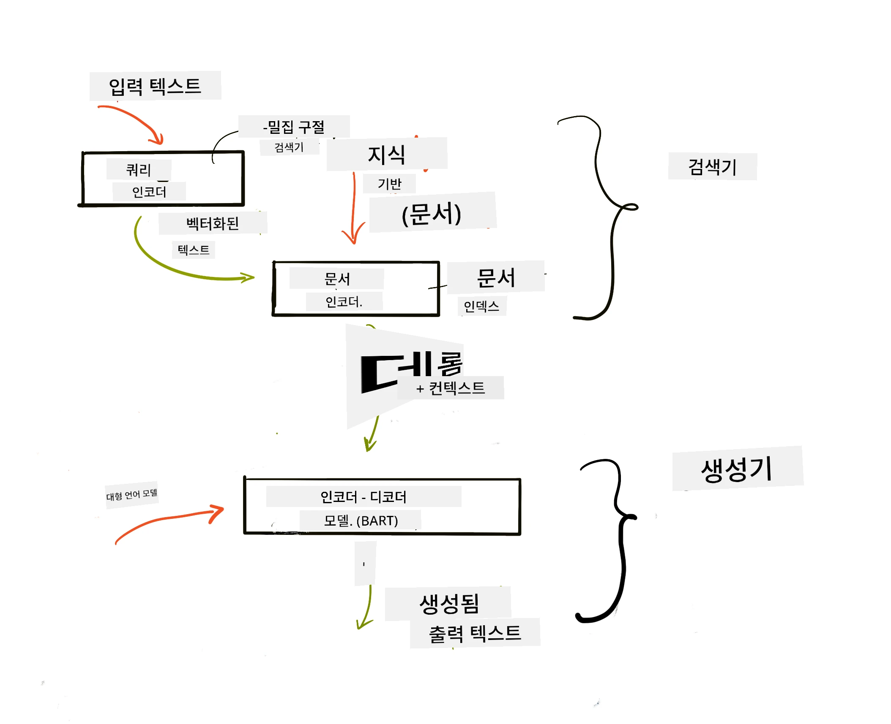
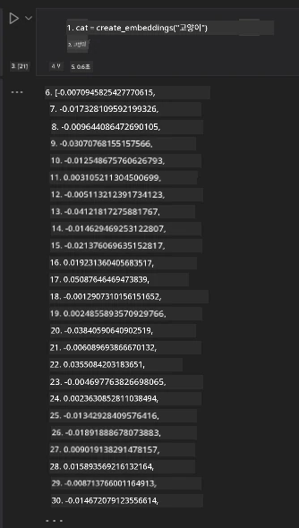

# 검색 증강 생성(RAG) 및 벡터 데이터베이스

[](https://youtu.be/4l8zhHUBeyI?si=BmvDmL1fnHtgQYkL)

검색 애플리케이션 수업에서는 자신의 데이터를 대형 언어 모델(LLM)에 통합하는 방법을 간단히 배웠습니다. 이번 수업에서는 LLM 애플리케이션에 데이터를 기반으로 하는 개념, 프로세스의 메커니즘 및 임베딩과 텍스트를 포함한 데이터 저장 방법에 대해 더 깊이 탐구할 것입니다.

> **동영상 곧 제공 예정**

## 소개

이 수업에서 다룰 내용은 다음과 같습니다:

- RAG 소개, RAG가 무엇인지 및 AI(인공지능)에서 사용되는 이유

- 벡터 데이터베이스가 무엇인지 이해하고 애플리케이션용 벡터 데이터베이스 생성하기

- RAG를 애플리케이션에 통합하는 실용적인 예제

## 학습 목표

이 수업을 완료하면 다음을 할 수 있습니다:

- 데이터 검색 및 처리에서 RAG의 중요성을 설명할 수 있습니다.

- RAG 애플리케이션을 설정하고 데이터를 LLM에 기반할 수 있습니다.

- LLM 애플리케이션에서 RAG 및 벡터 데이터베이스를 효과적으로 통합할 수 있습니다.

## 우리 시나리오: 자체 데이터를 활용해 LLM 강화하기

이번 수업에서는 교육 스타트업에 자체 메모를 추가하여 챗봇이 다양한 주제에 대해 더 많은 정보를 얻을 수 있도록 하고자 합니다. 우리가 가진 노트를 활용하여 학습자들이 더 잘 공부하고 다양한 주제를 이해하여 시험 준비를 더 쉽게 할 수 있도록 합니다. 시나리오를 만들기 위해 다음을 사용할 것입니다:

- `Azure OpenAI:` 챗봇을 생성하는 데 사용할 LLM

- `AI for beginners' lesson on Neural Networks`: LLM에 기반할 데이터

- `Azure AI Search` 및 `Azure Cosmos DB:` 데이터를 저장하고 검색 인덱스를 생성하는 벡터 데이터베이스

사용자는 노트에서 연습 퀴즈를 만들고, 복습용 플래시 카드 요약을 작성하고 간결한 개요로 요약할 수 있습니다. 시작하기 전에 RAG가 무엇이고 어떻게 작동하는지 살펴봅시다:

## 검색 증강 생성(RAG)

LLM 기반 챗봇은 사용자 프롬프트를 처리하여 응답을 생성합니다. 이 챗봇은 대화형이며 다양한 주제에 대해 사용자와 상호작용하도록 설계되었습니다. 하지만 응답은 제공된 컨텍스트와 기반 학습 데이터에 한정됩니다. 예를 들어, GPT-4의 지식 컷오프는 2021년 9월로, 이 기간 이후의 사건에 대해서는 알지 못합니다. 또한 LLM을 학습하는 데 사용된 데이터에는 개인 노트나 회사의 제품 매뉴얼과 같은 기밀 정보가 포함되지 않습니다.

### RAG(검색 증강 생성)의 작동 원리



예를 들어, 노트에서 퀴즈를 생성하는 챗봇을 배포하려면 지식 기반과 연결해야 합니다. 이때 RAG가 도움을 줍니다. RAG는 다음과 같이 작동합니다:

- **지식 기반:** 검색 전에 문서들을 수집하여 전처리해야 하며, 보통 큰 문서를 작은 단위로 나누고 텍스트 임베딩으로 변환 후 데이터베이스에 저장합니다.

- **사용자 질문:** 사용자가 질문을 합니다.

- **검색:** 사용자가 질문하면, 임베딩 모델이 지식 기반에서 관련 정보를 검색하여 프롬프트에 통합될 추가 컨텍스트를 제공합니다.

- **증강 생성:** LLM이 검색된 데이터를 기반으로 응답을 개선합니다. 이는 미리 학습된 데이터뿐 아니라 추가된 컨텍스트에서 관련 정보를 함께 사용하여 응답을 생성함을 의미합니다. LLM은 사용자의 질문에 대해 답변을 반환합니다.



RAG 아키텍처는 인코더와 디코더 두 부분으로 구성된 트랜스포머를 사용하여 구현됩니다. 사용자가 질문하면 입력 텍스트는 단어 의미를 포착하는 벡터로 '인코딩'되고, 벡터들은 문서 인덱스로 '디코딩'되어 사용자 질문을 기반으로 새 텍스트를 생성합니다. LLM은 인코더-디코더 모델을 활용해 출력을 생성합니다.

제안된 논문 [Retrieval-Augmented Generation for Knowledge intensive NLP (자연어 처리 소프트웨어) Tasks](https://arxiv.org/pdf/2005.11401.pdf?WT.mc_id=academic-105485-koreyst)에 따르면 RAG 구현 접근법 두 가지는 다음과 같습니다:

- **_RAG-Sequence_**: 검색된 문서를 사용하여 사용자 질문에 최적의 답변 예측

- **RAG-Token**: 문서를 사용해 다음 토큰을 생성한 후 사용자 질문에 답변하기 위해 검색 수행

### 왜 RAG를 사용하는가?

- **정보 충실성:** 텍스트 응답을 최신 상태로 유지하여 도메인 특화 작업의 성능을 높임

- 사용자 질문에 맥락을 제공하기 위해 <strong>검증 가능한 데이터</strong>를 활용하여 허위 생성 감소

- LLM 미세조정에 비해 <strong>비용 효율적</strong>임

## 지식 기반 만들기

우리의 애플리케이션은 개인 데이터, 즉 AI 초보자를 위한 신경망 수업 과정을 기반으로 합니다.

### 벡터 데이터베이스

벡터 데이터베이스는 전통적 데이터베이스와 달리 임베딩된 벡터를 저장, 관리 및 검색하도록 설계된 특수한 데이터베이스입니다. 이는 문서의 수치적 표현을 저장합니다. 데이터를 수치적 임베딩으로 분해하면 AI 시스템이 데이터를 더 쉽게 이해하고 처리할 수 있습니다.

LLM은 입력으로 허용하는 토큰 수에 제한이 있어 임베딩 전체를 넘길 수 없으므로, 임베딩을 청크로 쪼개야 하며 사용자가 질문할 때 가장 유사한 임베딩을 프롬프트와 함께 반환합니다. 청크 분할은 LLM에 전달되는 토큰 수를 줄여 비용도 절감합니다.

인기 있는 벡터 데이터베이스로는 Azure Cosmos DB, Clarifyai, Pinecone, Chromadb, ScaNN, Qdrant, DeepLake 등이 있습니다. Azure CLI로 Azure Cosmos DB 모델을 생성할 수 있습니다:

```bash
az login
az group create -n <resource-group-name> -l <location>
az cosmosdb create -n <cosmos-db-name> -r <resource-group-name>
az cosmosdb list-keys -n <cosmos-db-name> -g <resource-group-name>
```

### 텍스트를 임베딩으로 변환하기

데이터를 저장하기 전에, 데이터베이스에 저장될 벡터 임베딩으로 변환해야 합니다. 큰 문서나 긴 텍스트라면 예상 질문에 따라 청크로 나눌 수 있습니다. 청크 분할은 문장 단위나 단락 단위로 할 수 있으며, 단어 주변 문맥에 기반해 의미를 파악하기 위해 문서 제목을 추가하거나 청크 전후 텍스트를 첨가할 수도 있습니다. 청크 분할 방법은 다음과 같습니다:

```python
def split_text(text, max_length, min_length):
    words = text.split()
    chunks = []
    current_chunk = []

    for word in words:
        current_chunk.append(word)
        if len(' '.join(current_chunk)) < max_length and len(' '.join(current_chunk)) > min_length:
            chunks.append(' '.join(current_chunk))
            current_chunk = []

    # 마지막 청크가 최소 길이에 도달하지 못했더라도 어쨌든 추가합니다
    if current_chunk:
        chunks.append(' '.join(current_chunk))

    return chunks
```

청크로 나눈 후 여러 임베딩 모델을 사용해 텍스트를 임베딩할 수 있습니다. 예를 들어 word2vec, OpenAI의 ada-002, Azure Computer Vision 등이 있습니다. 사용할 모델 선택은 지원하는 언어, 인코딩하는 콘텐츠 종류(텍스트/이미지/오디오), 인코딩 가능한 입력 크기와 임베딩 출력 길이에 따라 달라집니다.

OpenAI의 `text-embedding-ada-002` 모델을 사용한 임베딩 텍스트 예시는 다음과 같습니다:


## 검색 및 벡터 검색

사용자가 질문하면, 리트리버가 쿼리 인코더를 사용해 이를 벡터로 변환하고, 문서 검색 인덱스에서 입력과 관련된 벡터를 검색합니다. 그런 다음 입력 벡터와 문서 벡터를 텍스트로 변환해 LLM에 전달합니다.

### 검색

검색은 시스템이 인덱스에서 검색 기준에 맞는 문서를 빠르게 찾는 과정입니다. 리트리버의 목표는 LLM에 컨텍스트를 제공하고 데이터를 기반으로 응답하도록 문서를 확보하는 것입니다.

데이터베이스 내 검색 방식으로는 다음이 있습니다:

- **키워드 검색** - 텍스트 검색에 활용

- **벡터 검색** - 문서를 텍스트에서 벡터 표현으로 변환해 단어 의미를 활용하는 **의미 기반 검색** 수행. 벡터 표현이 사용자 질문에 가장 가까운 문서를 쿼리합니다.

- <strong>하이브리드</strong> - 키워드 검색과 벡터 검색의 결합

검색 도중 질의와 유사한 응답이 데이터베이스에 없을 경우, 시스템은 가능한 최선의 정보를 반환합니다. 하지만 적절도 최대 거리 설정이나 키워드와 벡터 검색을 결합한 하이브리드 검색 같은 기법을 사용해 성능을 높일 수 있습니다. 이번 교육에서는 벡터와 키워드 검색을 결합한 하이브리드 검색을 사용합니다. 데이터는 청크와 임베딩을 포함한 데이터프레임에 저장합니다.

### 벡터 유사도

리트리버는 지식 데이터베이스에서 서로 가까운 임베딩, 즉 유사한 텍스트를 찾아냅니다. 사용자가 쿼리를 하면 임베딩한 후 유사한 임베딩과 매치합니다. 두 벡터의 유사성을 측정하는 일반적인 방법은 코사인 유사도로, 두 벡터 간의 각도를 기반으로 합니다.

유사도 측정 대안으로는 벡터 끝점 간 직선 거리인 유클리드 거리나 두 벡터 요소별 곱의 합을 측정하는 내적도 사용할 수 있습니다.

### 검색 인덱스

검색을 수행하려면, 검색 전에 지식 기반을 위한 검색 인덱스를 구축해야 합니다. 인덱스는 임베딩을 저장해 큰 데이터베이스에서도 가장 유사한 청크들을 빠르게 검색할 수 있도록 합니다. 인덱스는 로컬에서 다음과 같이 생성할 수 있습니다:

```python
from sklearn.neighbors import NearestNeighbors

embeddings = flattened_df['embeddings'].to_list()

# 검색 인덱스 생성
nbrs = NearestNeighbors(n_neighbors=5, algorithm='ball_tree').fit(embeddings)

# 인덱스를 쿼리하려면 kneighbors 메서드를 사용할 수 있습니다
distances, indices = nbrs.kneighbors(embeddings)
```

### 재순위화

데이터베이스 쿼리 후, 가장 관련성 높은 결과부터 정렬해야 할 수 있습니다. 재순위화 LLM은 머신러닝을 활용하여 검색 결과의 적합도를 개선하며 가장 관련성 높은 순으로 정렬합니다. Azure AI Search에서는 의미 기반 재순위화 도구가 자동으로 재순위화를 수행합니다. 최근접 이웃을 사용한 재순위화 예시는 다음과 같습니다:

```python
# 가장 유사한 문서 찾기
distances, indices = nbrs.kneighbors([query_vector])

index = []
# 가장 유사한 문서 출력하기
for i in range(3):
    index = indices[0][i]
    for index in indices[0]:
        print(flattened_df['chunks'].iloc[index])
        print(flattened_df['path'].iloc[index])
        print(flattened_df['distances'].iloc[index])
    else:
        print(f"Index {index} not found in DataFrame")
```

## 모두 통합하기

마지막 단계는 LLM을 통합하여 데이터 기반 응답을 얻는 것입니다. 구현 방법은 다음과 같습니다:

```python
user_input = "what is a perceptron?"

def chatbot(user_input):
    # 질문을 쿼리 벡터로 변환
    query_vector = create_embeddings(user_input)

    # 가장 유사한 문서 찾기
    distances, indices = nbrs.kneighbors([query_vector])

    # 문서를 쿼리에 추가하여 문맥 제공
    history = []
    for index in indices[0]:
        history.append(flattened_df['chunks'].iloc[index])

    # 히스토리와 사용자 입력 결합
    history.append(user_input)

    # 메시지 객체 생성
    messages=[
        {"role": "system", "content": "You are an AI assistant that helps with AI questions."},
        {"role": "user", "content": "\n\n".join(history) }
    ]

    # 응답 API를 사용하여 응답 생성
    response = client.responses.create(
        model="gpt-5-mini",
        max_output_tokens=800,
        input=messages,
        store=False,
    )

    return response.output_text

chatbot(user_input)
```

## 애플리케이션 평가

### 평가 지표

- 응답의 품질: 자연스럽고 유창하며 인간과 같은지 평가

- 데이터 기반성: 제공된 문서에서 나온 응답인지 평가

- 관련성: 응답이 질문과 일치하고 관련 있는지 평가

- 유창성: 문법적으로 올바른지 평가

## RAG(검색 증강 생성) 및 벡터 데이터베이스 사용 사례

함수 호출이 애플리케이션을 향상시킬 수 있는 다양한 사용 사례가 있습니다:

- 질문 및 답변: 회사 데이터를 기반으로 직원들이 질문할 수 있는 채팅 구축

- 추천 시스템: 영화, 식당 등 가장 유사한 항목을 매칭하는 시스템 만들기

- 챗봇 서비스: 채팅 기록 저장 및 사용자 데이터를 기반으로 대화 개인화

- 벡터 임베딩 기반 이미지 검색: 이미지 인식 및 이상 탐지에 유용

## 요약

이번 수업에서는 데이터 추가부터 사용자 쿼리, 출력까지 RAG의 기본 영역을 다뤘습니다. RAG 생성 간소화를 위해 Semanti Kernel, Langchain, Autogen과 같은 프레임워크를 사용할 수 있습니다.

## 과제

검색 증강 생성(RAG) 학습을 이어가기 위해 다음을 구축해 보세요:

- 원하는 프레임워크를 사용해 애플리케이션 프론트엔드 구축

- LangChain이나 Semantic Kernel 중 하나의 프레임워크를 활용해 애플리케이션 재구성

수업을 완료하신 것을 축하드립니다 👏.

## 학습은 여기서 끝나지 않습니다, 여정을 계속하세요

이 수업을 완료한 후에는 [생성 AI 학습 모음](https://aka.ms/genai-collection?WT.mc_id=academic-105485-koreyst)을 확인해 생성 AI 지식을 계속 향상시키세요!

---

<!-- CO-OP TRANSLATOR DISCLAIMER START -->
**면책 조항**:
이 문서는 AI 번역 서비스 [Co-op Translator](https://github.com/Azure/co-op-translator)를 사용하여 번역되었습니다. 정확성을 기하기 위해 노력하고 있으나, 자동 번역은 오류나 부정확한 부분이 있을 수 있음을 유의하시기 바랍니다. 원본 문서의 원어본이 권위 있는 자료로 간주되어야 합니다. 중요한 정보의 경우, 전문가의 인간 번역을 권장합니다. 이 번역 사용으로 인해 발생하는 오해나 잘못된 해석에 대해 당사는 책임을 지지 않습니다.
<!-- CO-OP TRANSLATOR DISCLAIMER END -->