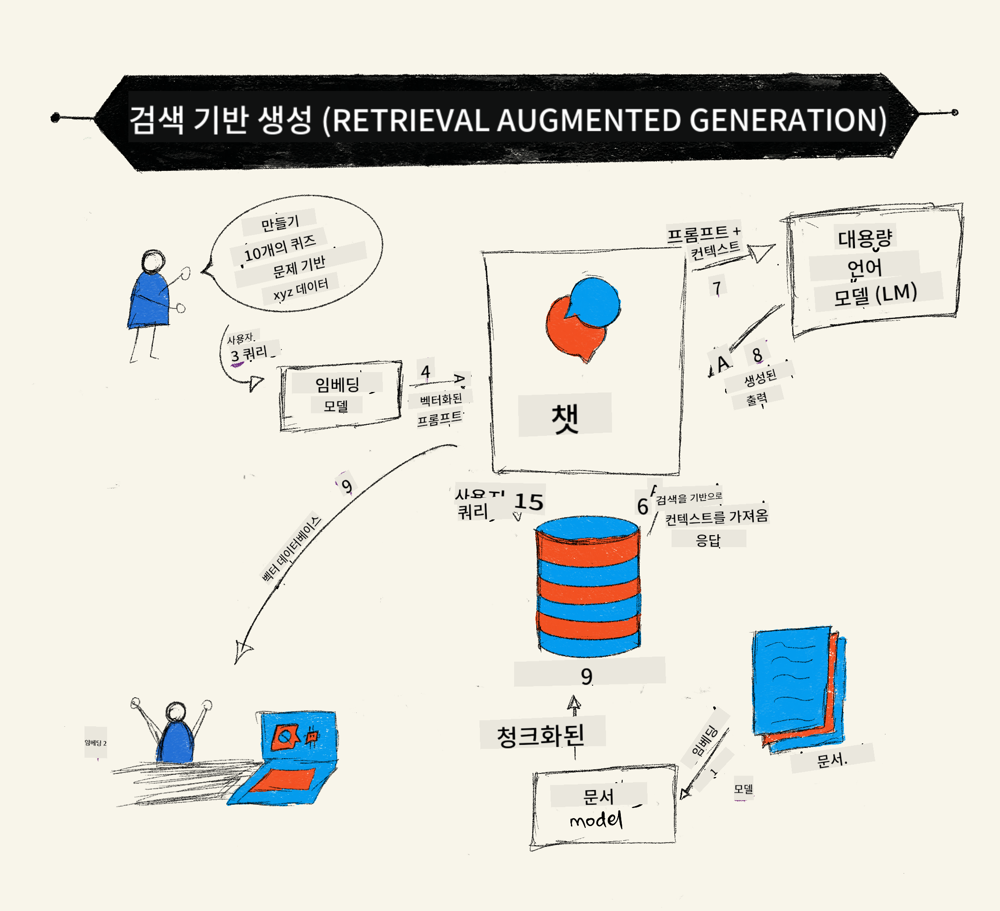
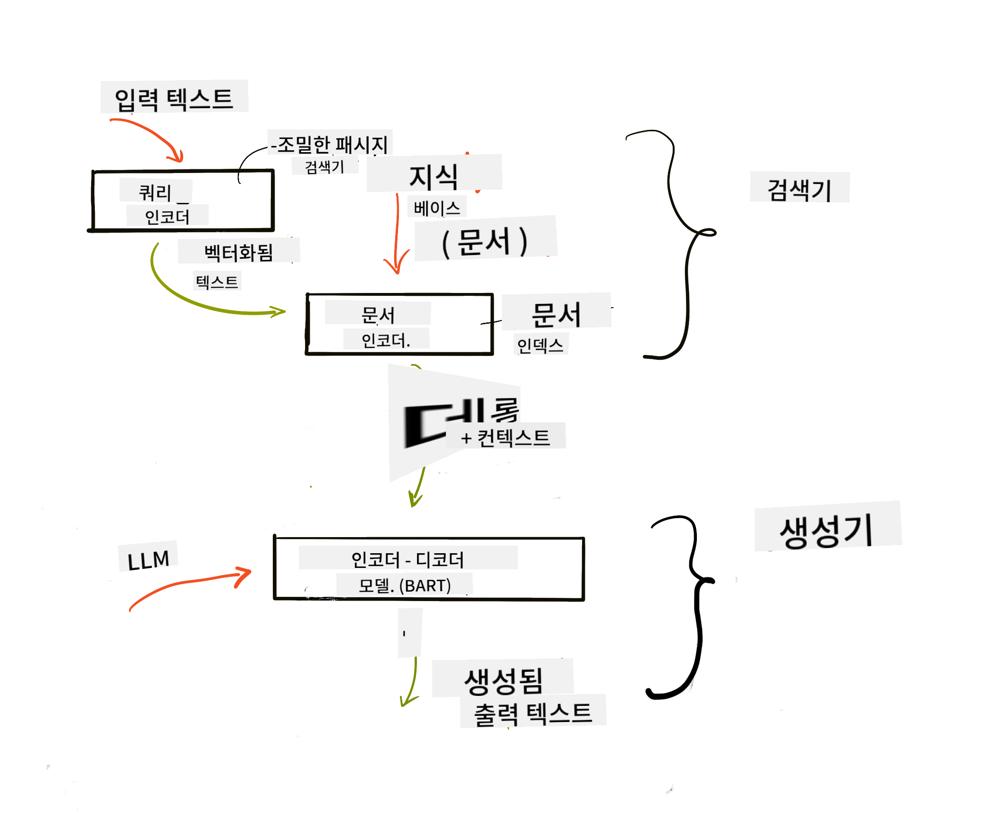

<!--
CO_OP_TRANSLATOR_METADATA:
{
  "original_hash": "e2861bbca91c0567ef32bc77fe054f9e",
  "translation_date": "2025-07-09T16:06:38+00:00",
  "source_file": "15-rag-and-vector-databases/README.md",
  "language_code": "ko"
}
-->
# Retrieval Augmented Generation (RAG) 및 벡터 데이터베이스

[](https://aka.ms/gen-ai-lesson15-gh?WT.mc_id=academic-105485-koreyst)

검색 애플리케이션 수업에서, 우리는 간단히 자신의 데이터를 대형 언어 모델(LLM)에 통합하는 방법을 배웠습니다. 이번 수업에서는 LLM 애플리케이션에 데이터를 기반으로 하는 개념, 그 과정의 작동 원리, 임베딩과 텍스트를 포함한 데이터 저장 방법에 대해 더 깊이 다뤄보겠습니다.

> **영상 곧 공개 예정**

## 소개

이번 수업에서 다룰 내용은 다음과 같습니다:

- RAG가 무엇인지, 그리고 AI(인공지능)에서 왜 사용되는지에 대한 소개

- 벡터 데이터베이스가 무엇인지 이해하고, 애플리케이션을 위한 벡터 데이터베이스 생성

- RAG를 애플리케이션에 통합하는 실습 예제

## 학습 목표

이 수업을 마치면 다음을 할 수 있습니다:

- 데이터 검색 및 처리에서 RAG의 중요성을 설명할 수 있습니다.

- RAG 애플리케이션을 설정하고 데이터를 LLM에 기반할 수 있습니다.

- LLM 애플리케이션에서 RAG와 벡터 데이터베이스를 효과적으로 통합할 수 있습니다.

## 시나리오: 우리 데이터로 LLM 강화하기

이번 수업에서는 교육 스타트업에 우리만의 노트를 추가하여 챗봇이 다양한 주제에 대해 더 많은 정보를 얻을 수 있도록 하려 합니다. 우리가 가진 노트를 활용해 학습자들이 더 잘 공부하고 다양한 주제를 이해하여 시험 준비를 더 쉽게 할 수 있도록 하는 것이 목표입니다. 시나리오를 만들기 위해 다음을 사용합니다:

- `Azure OpenAI:` 챗봇을 만들기 위해 사용할 LLM

- `AI for beginners' lesson on Neural Networks:` LLM에 기반할 데이터

- `Azure AI Search` 및 `Azure Cosmos DB:` 데이터를 저장하고 검색 인덱스를 생성할 벡터 데이터베이스

사용자는 노트에서 연습 퀴즈를 만들고, 복습용 플래시카드를 생성하며, 내용을 간결하게 요약할 수 있습니다. 시작하기 전에 RAG가 무엇이고 어떻게 작동하는지 살펴보겠습니다:

## Retrieval Augmented Generation (RAG)

LLM 기반 챗봇은 사용자 프롬프트를 처리해 응답을 생성합니다. 다양한 주제에 대해 상호작용하며 대화할 수 있도록 설계되었지만, 응답은 제공된 컨텍스트와 기본 학습 데이터에 한정됩니다. 예를 들어, GPT-4의 지식 컷오프는 2021년 9월로, 그 이후 발생한 사건에 대한 지식이 없습니다. 또한 LLM 학습에 사용된 데이터에는 개인 노트나 회사 제품 매뉴얼 같은 기밀 정보는 포함되지 않습니다.

### RAG(검색 증강 생성)의 작동 원리



노트에서 퀴즈를 생성하는 챗봇을 배포하려면 지식 기반과 연결이 필요합니다. 이때 RAG가 도움을 줍니다. RAG는 다음과 같이 작동합니다:

- **지식 기반:** 검색 전에 문서를 수집하고 전처리합니다. 보통 큰 문서를 작은 조각으로 나누고, 텍스트 임베딩으로 변환한 후 데이터베이스에 저장합니다.

- **사용자 쿼리:** 사용자가 질문을 합니다.

- **검색:** 사용자가 질문하면 임베딩 모델이 지식 기반에서 관련 정보를 찾아 프롬프트에 포함할 추가 컨텍스트를 제공합니다.

- **증강 생성:** LLM이 검색된 데이터를 바탕으로 응답을 향상시킵니다. 이렇게 하면 사전 학습된 데이터뿐 아니라 추가된 컨텍스트의 관련 정보도 반영된 응답을 생성할 수 있습니다. LLM은 사용자 질문에 대한 답변을 반환합니다.



RAG 아키텍처는 인코더와 디코더 두 부분으로 구성된 트랜스포머를 사용해 구현됩니다. 예를 들어, 사용자가 질문하면 입력 텍스트가 단어의 의미를 담은 벡터로 '인코딩'되고, 이 벡터는 문서 인덱스와 '디코딩'되어 사용자 쿼리에 기반한 새 텍스트를 생성합니다. LLM은 인코더-디코더 모델을 사용해 출력을 만듭니다.

논문 [Retrieval-Augmented Generation for Knowledge intensive NLP Tasks](https://arxiv.org/pdf/2005.11401.pdf?WT.mc_id=academic-105485-koreyst)에 따르면 RAG 구현에는 두 가지 접근법이 있습니다:

- **_RAG-Sequence_**: 검색된 문서를 사용해 사용자 쿼리에 가장 적합한 답변을 예측

- **RAG-Token**: 문서를 사용해 다음 토큰을 생성하고, 이를 반복해 사용자 쿼리에 답변

### 왜 RAG를 사용할까요?

- **정보의 풍부함:** 텍스트 응답이 최신 정보를 반영하도록 하여 특정 도메인 작업에서 성능을 향상시킵니다.

- **검증 가능한 데이터**를 활용해 허위 정보를 줄이고, 사용자 질문에 신뢰할 수 있는 컨텍스트를 제공합니다.

- LLM을 미세 조정하는 것보다 **비용 효율적**입니다.

## 지식 기반 만들기

우리 애플리케이션은 개인 데이터, 즉 AI 초보자를 위한 신경망 수업 내용을 기반으로 합니다.

### 벡터 데이터베이스

벡터 데이터베이스는 전통적인 데이터베이스와 달리 임베딩된 벡터를 저장, 관리, 검색하도록 특화된 데이터베이스입니다. 문서의 수치적 표현을 저장합니다. 데이터를 수치 임베딩으로 분해하면 AI 시스템이 데이터를 더 쉽게 이해하고 처리할 수 있습니다.

LLM은 입력으로 받을 수 있는 토큰 수에 제한이 있으므로 임베딩 전체를 한 번에 전달할 수 없습니다. 따라서 임베딩을 여러 조각으로 나누고, 사용자가 질문할 때 질문과 가장 유사한 임베딩을 프롬프트와 함께 반환합니다. 조각화는 LLM에 전달되는 토큰 수를 줄여 비용 절감에도 도움이 됩니다.

대표적인 벡터 데이터베이스로는 Azure Cosmos DB, Clarifyai, Pinecone, Chromadb, ScaNN, Qdrant, DeepLake 등이 있습니다. Azure CLI를 사용해 Azure Cosmos DB 모델을 생성할 수 있습니다:

```bash
az login
az group create -n <resource-group-name> -l <location>
az cosmosdb create -n <cosmos-db-name> -r <resource-group-name>
az cosmosdb list-keys -n <cosmos-db-name> -g <resource-group-name>
```

### 텍스트를 임베딩으로 변환하기

데이터를 저장하기 전에 벡터 임베딩으로 변환해야 합니다. 큰 문서나 긴 텍스트를 다룰 때는 예상되는 쿼리를 기준으로 조각화할 수 있습니다. 문장 단위나 단락 단위로 나누기도 합니다. 조각은 주변 단어의 의미를 파악하므로, 문서 제목이나 조각 전후의 텍스트를 추가해 컨텍스트를 보완할 수 있습니다. 데이터 조각화 예시는 다음과 같습니다:

```python
def split_text(text, max_length, min_length):
    words = text.split()
    chunks = []
    current_chunk = []

    for word in words:
        current_chunk.append(word)
        if len(' '.join(current_chunk)) < max_length and len(' '.join(current_chunk)) > min_length:
            chunks.append(' '.join(current_chunk))
            current_chunk = []

    # If the last chunk didn't reach the minimum length, add it anyway
    if current_chunk:
        chunks.append(' '.join(current_chunk))

    return chunks
```

조각화가 끝나면 다양한 임베딩 모델을 사용해 텍스트를 임베딩할 수 있습니다. 예를 들어 word2vec, OpenAI의 ada-002, Azure Computer Vision 등이 있습니다. 사용할 모델은 사용하는 언어, 인코딩할 콘텐츠 유형(텍스트/이미지/오디오), 입력 크기, 임베딩 출력 길이에 따라 달라집니다.

OpenAI의 `text-embedding-ada-002` 모델로 임베딩한 예시는 다음과 같습니다:


## 검색 및 벡터 검색

사용자가 질문하면 검색기는 쿼리 인코더를 사용해 질문을 벡터로 변환하고, 문서 검색 인덱스에서 관련 벡터를 찾아냅니다. 이후 입력 벡터와 문서 벡터를 텍스트로 변환해 LLM에 전달합니다.

### 검색

검색은 시스템이 인덱스에서 검색 조건에 맞는 문서를 빠르게 찾는 과정입니다. 검색기의 목표는 LLM에 컨텍스트를 제공하고 데이터를 기반으로 삼을 문서를 찾는 것입니다.

데이터베이스 내 검색 방법에는 다음이 있습니다:

- **키워드 검색** - 텍스트 검색에 사용

- **의미 기반 검색(semantic search)** - 단어의 의미를 활용

- **벡터 검색** - 문서를 임베딩 모델로 벡터 표현으로 변환 후, 사용자 질문과 가장 가까운 벡터를 가진 문서를 검색

- **하이브리드** - 키워드 검색과 벡터 검색을 결합

검색 시 데이터베이스에 유사한 응답이 없으면 시스템은 가능한 최선의 정보를 반환합니다. 이때 관련성 최대 거리 설정이나 키워드와 벡터 검색을 결합한 하이브리드 검색 같은 전략을 사용할 수 있습니다. 이번 수업에서는 하이브리드 검색을 사용하며, 데이터는 조각과 임베딩을 포함한 데이터프레임에 저장합니다.

### 벡터 유사도

검색기는 지식 데이터베이스에서 서로 가까운 임베딩, 즉 가장 유사한 이웃을 찾습니다. 사용자가 질문하면 먼저 임베딩되고, 유사한 임베딩과 매칭됩니다. 벡터 간 유사도를 측정하는 일반적인 방법은 두 벡터 사이 각도를 기반으로 하는 코사인 유사도입니다.

다른 유사도 측정 방법으로는 벡터 끝점 간 직선 거리인 유클리드 거리, 두 벡터 대응 요소 곱의 합을 구하는 내적(dot product) 등이 있습니다.

### 검색 인덱스

검색을 수행하기 전에 지식 기반에 대한 검색 인덱스를 만들어야 합니다. 인덱스는 임베딩을 저장하고, 큰 데이터베이스에서도 가장 유사한 조각을 빠르게 찾아냅니다. 로컬에서 인덱스를 생성하는 방법은 다음과 같습니다:

```python
from sklearn.neighbors import NearestNeighbors

embeddings = flattened_df['embeddings'].to_list()

# Create the search index
nbrs = NearestNeighbors(n_neighbors=5, algorithm='ball_tree').fit(embeddings)

# To query the index, you can use the kneighbors method
distances, indices = nbrs.kneighbors(embeddings)
```

### 재정렬

데이터베이스 쿼리 후 결과를 가장 관련성 높은 순으로 정렬해야 할 수 있습니다. 재정렬 LLM은 머신러닝을 활용해 검색 결과의 관련성을 높이고 가장 적합한 순서로 정렬합니다. Azure AI Search에서는 시맨틱 재정렬기가 자동으로 이 작업을 수행합니다. 최근접 이웃을 이용한 재정렬 예시는 다음과 같습니다:

```python
# Find the most similar documents
distances, indices = nbrs.kneighbors([query_vector])

index = []
# Print the most similar documents
for i in range(3):
    index = indices[0][i]
    for index in indices[0]:
        print(flattened_df['chunks'].iloc[index])
        print(flattened_df['path'].iloc[index])
        print(flattened_df['distances'].iloc[index])
    else:
        print(f"Index {index} not found in DataFrame")
```

## 모든 것을 통합하기

마지막 단계는 LLM을 추가해 데이터에 기반한 응답을 얻는 것입니다. 다음과 같이 구현할 수 있습니다:

```python
user_input = "what is a perceptron?"

def chatbot(user_input):
    # Convert the question to a query vector
    query_vector = create_embeddings(user_input)

    # Find the most similar documents
    distances, indices = nbrs.kneighbors([query_vector])

    # add documents to query  to provide context
    history = []
    for index in indices[0]:
        history.append(flattened_df['chunks'].iloc[index])

    # combine the history and the user input
    history.append(user_input)

    # create a message object
    messages=[
        {"role": "system", "content": "You are an AI assistant that helps with AI questions."},
        {"role": "user", "content": history[-1]}
    ]

    # use chat completion to generate a response
    response = openai.chat.completions.create(
        model="gpt-4",
        temperature=0.7,
        max_tokens=800,
        messages=messages
    )

    return response.choices[0].message

chatbot(user_input)
```

## 애플리케이션 평가

### 평가 지표

- 자연스럽고 유창하며 인간다운 응답 품질

- 데이터 기반성: 응답이 제공된 문서에서 나온 것인지 평가

- 관련성: 응답이 질문과 일치하고 관련 있는지 평가

- 유창성: 문법적으로 의미가 통하는지 평가

## RAG 및 벡터 데이터베이스 활용 사례

함수 호출이 앱을 개선할 수 있는 다양한 사례가 있습니다:

- 질문과 답변: 회사 데이터를 기반으로 직원들이 질문할 수 있는 채팅 구축

- 추천 시스템: 영화, 음식점 등 가장 유사한 항목을 매칭하는 시스템 생성

- 챗봇 서비스: 채팅 기록 저장 및 사용자 데이터 기반 맞춤 대화 제공

- 벡터 임베딩 기반 이미지 검색: 이미지 인식 및 이상 탐지에 유용

## 요약

이번 수업에서는 RAG의 기본 개념부터 데이터 추가, 사용자 쿼리, 출력까지 다뤘습니다. RAG 생성 작업을 간소화하려면 Semanti Kernel, Langchain, Autogen 같은 프레임워크를 활용할 수 있습니다.

## 과제

Retrieval Augmented Generation(RAG) 학습을 이어가려면 다음을 만들어 보세요:

- 원하는 프레임워크를 사용해 애플리케이션 프론트엔드 구축

- LangChain 또는 Semantic Kernel 같은 프레임워크를 활용해 애플리케이션 재구현

수업을 완료하신 것을 축하드립니다 👏.

## 학습은 여기서 끝나지 않습니다, 여정을 계속하세요

이번 수업을 마친 후에는 [Generative AI Learning collection](https://aka.ms/genai-collection?WT.mc_id=academic-105485-koreyst)을 확인해 생성형 AI 지식을 계속 확장해 보세요!

**면책 조항**:  
이 문서는 AI 번역 서비스 [Co-op Translator](https://github.com/Azure/co-op-translator)를 사용하여 번역되었습니다. 정확성을 위해 노력하고 있으나, 자동 번역에는 오류나 부정확한 부분이 있을 수 있음을 유의하시기 바랍니다. 원문은 해당 언어의 원본 문서가 권위 있는 출처로 간주되어야 합니다. 중요한 정보의 경우 전문적인 인간 번역을 권장합니다. 본 번역 사용으로 인해 발생하는 오해나 잘못된 해석에 대해 당사는 책임을 지지 않습니다.