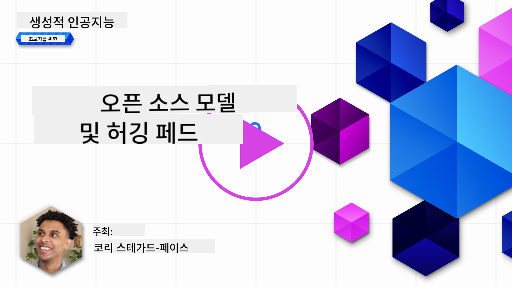
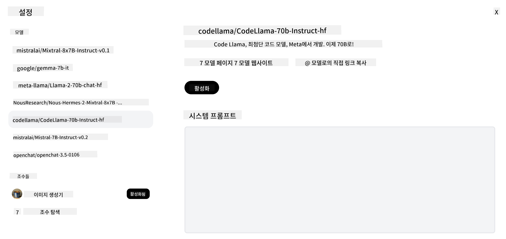

<!--
CO_OP_TRANSLATOR_METADATA:
{
  "original_hash": "0bba96e53ab841d99db731892a51fab8",
  "translation_date": "2025-05-20T06:50:20+00:00",
  "source_file": "16-open-source-models/README.md",
  "language_code": "ko"
}
-->

## 소개

오픈 소스 LLM의 세계는 흥미롭고 끊임없이 진화하고 있습니다. 이 강의는 오픈 소스 모델에 대한 깊이 있는 통찰을 제공하는 것을 목표로 합니다. 독점 모델이 오픈 소스 모델과 어떻게 비교되는지에 대한 정보를 찾고 있다면 ["다양한 LLM 탐색 및 비교" 강의](../02-exploring-and-comparing-different-llms/README.md?WT.mc_id=academic-105485-koreyst)를 참조하세요. 이 강의는 또한 미세 조정 주제를 다루지만, 더 자세한 설명은 ["LLM 미세 조정" 강의](../18-fine-tuning/README.md?WT.mc_id=academic-105485-koreyst)에서 찾을 수 있습니다.

## 학습 목표

- 오픈 소스 모델에 대한 이해를 얻기
- 오픈 소스 모델과 작업하는 것의 이점 이해하기
- Hugging Face와 Azure AI Studio에서 사용할 수 있는 오픈 모델 탐색하기

## 오픈 소스 모델이란 무엇인가?

오픈 소스 소프트웨어는 다양한 분야에서 기술의 발전에 중요한 역할을 해왔습니다. 오픈 소스 이니셔티브 (OSI)는 소프트웨어가 오픈 소스로 분류되기 위한 [10가지 기준](https://web.archive.org/web/20241126001143/https://opensource.org/osd?WT.mc_id=academic-105485-koreyst)을 정의했습니다. 소스 코드는 OSI에서 승인한 라이센스 하에 공개적으로 공유되어야 합니다.

LLM 개발은 소프트웨어 개발과 유사한 요소를 가지고 있지만, 과정이 완전히 동일하지는 않습니다. 이는 LLM의 맥락에서 오픈 소스의 정의에 대한 커뮤니티 내 많은 논의를 가져왔습니다. 전통적인 오픈 소스 정의와 일치하기 위해 모델은 다음 정보를 공개적으로 제공해야 합니다:

- 모델을 훈련하는 데 사용된 데이터셋.
- 훈련의 일환으로서의 전체 모델 가중치.
- 평가 코드.
- 미세 조정 코드.
- 전체 모델 가중치와 훈련 메트릭.

현재 이 기준을 충족하는 모델은 몇 개 밖에 없습니다. [Allen Institute for Artificial Intelligence (AllenAI)에서 만든 OLMo 모델](https://huggingface.co/allenai/OLMo-7B?WT.mc_id=academic-105485-koreyst)이 이 범주에 맞는 모델 중 하나입니다.

이 강의에서는 작성 시점에 위의 기준을 충족하지 않을 수 있으므로 앞으로 "오픈 모델"이라고 언급하겠습니다.

## 오픈 모델의 이점

**높은 맞춤화 가능성** - 오픈 모델은 상세한 훈련 정보를 포함하여 공개되기 때문에, 연구자와 개발자가 모델의 내부를 수정할 수 있습니다. 이는 특정 작업이나 연구 분야에 맞게 미세 조정된 고도로 전문화된 모델을 생성할 수 있게 합니다. 코드 생성, 수학적 연산 및 생물학이 그 예입니다.

**비용** - 이러한 모델을 사용하고 배포하는 데 드는 비용은 독점 모델보다 낮습니다. 생성적 AI 애플리케이션을 구축할 때, 이러한 모델을 사용하여 성능과 가격을 비교하는 것이 중요합니다.

출처: Artificial Analysis

**유연성** - 오픈 모델과 작업하면 다양한 모델을 사용하거나 결합하는 데 있어 유연성을 가질 수 있습니다. 사용자 인터페이스에서 직접 사용되는 모델을 선택할 수 있는 [HuggingChat Assistants](https://huggingface.co/chat?WT.mc_id=academic-105485-koreyst)가 그 예입니다:

## 다양한 오픈 모델 탐색

### Llama 2

Meta에서 개발한 [LLama2](https://huggingface.co/meta-llama?WT.mc_id=academic-105485-koreyst)는 채팅 기반 애플리케이션에 최적화된 오픈 모델입니다. 이는 대화와 인간의 피드백을 많이 포함한 미세 조정 방법 덕분입니다. 이 방법으로 모델은 인간의 기대에 더 부합하는 결과를 생성하여 더 나은 사용자 경험을 제공합니다.

Llama의 미세 조정된 버전의 예로는 일본어에 특화된 [Japanese Llama](https://huggingface.co/elyza/ELYZA-japanese-Llama-2-7b?WT.mc_id=academic-105485-koreyst)와 기본 모델을 개선한 [Llama Pro](https://huggingface.co/TencentARC/LLaMA-Pro-8B?WT.mc_id=academic-105485-koreyst)가 있습니다.

### Mistral

[Mistral](https://huggingface.co/mistralai?WT.mc_id=academic-105485-koreyst)은 고성능과 효율성에 중점을 둔 오픈 모델입니다. Mixture-of-Experts 접근법을 사용하여 전문화된 전문가 모델 그룹을 하나의 시스템으로 결합하여 입력에 따라 특정 모델을 선택하여 사용합니다. 이는 모델이 전문화된 입력만 처리하기 때문에 계산을 더 효과적으로 만듭니다.

Mistral의 미세 조정된 버전의 예로는 의료 분야에 초점을 맞춘 [BioMistral](https://huggingface.co/BioMistral/BioMistral-7B?text=Mon+nom+est+Thomas+et+mon+principal?WT.mc_id=academic-105485-koreyst)과 수학적 계산을 수행하는 [OpenMath Mistral](https://huggingface.co/nvidia/OpenMath-Mistral-7B-v0.1-hf?WT.mc_id=academic-105485-koreyst)이 있습니다.

### Falcon

[Falcon](https://huggingface.co/tiiuae?WT.mc_id=academic-105485-koreyst)은 기술 혁신 연구소 (**TII**)에서 만든 LLM입니다. Falcon-40B는 400억 개의 매개변수로 훈련되어 더 적은 계산 예산으로 GPT-3보다 더 나은 성능을 보입니다. 이는 FlashAttention 알고리즘과 다중 쿼리 주의를 사용하여 추론 시간의 메모리 요구를 줄이기 때문입니다. 이 줄어든 추론 시간으로 Falcon-40B는 채팅 애플리케이션에 적합합니다.

Falcon의 미세 조정된 버전의 예로는 오픈 모델을 기반으로 구축된 어시스턴트인 [OpenAssistant](https://huggingface.co/OpenAssistant/falcon-40b-sft-top1-560?WT.mc_id=academic-105485-koreyst)와 기본 모델보다 더 높은 성능을 제공하는 [GPT4ALL](https://huggingface.co/nomic-ai/gpt4all-falcon?WT.mc_id=academic-105485-koreyst)이 있습니다.

## 선택 방법

오픈 모델을 선택하는 데 있어 하나의 정답은 없습니다. 시작하기 좋은 방법은 Azure AI Studio의 작업별 필터 기능을 사용하는 것입니다. 이는 모델이 어떤 유형의 작업에 대해 훈련되었는지 이해하는 데 도움이 됩니다. Hugging Face는 특정 메트릭을 기반으로 가장 성능이 좋은 모델을 보여주는 LLM 리더보드를 유지합니다.

다양한 유형의 LLM을 비교할 때 [Artificial Analysis](https://artificialanalysis.ai/?WT.mc_id=academic-105485-koreyst)는 또 다른 훌륭한 리소스입니다:

출처: Artificial Analysis

특정 사용 사례에 대해 작업할 때, 동일한 영역에 초점을 맞춘 미세 조정된 버전을 찾는 것이 효과적일 수 있습니다. 여러 오픈 모델을 실험하여 사용자와 사용자의 기대에 따라 어떻게 성능을 발휘하는지 보는 것도 좋은 방법입니다.

## 다음 단계

오픈 모델의 가장 좋은 점은 비교적 빨리 작업을 시작할 수 있다는 것입니다. 여기서 논의한 모델을 포함한 특정 Hugging Face 컬렉션을 특징으로 하는 [Azure AI Studio 모델 카탈로그](https://ai.azure.com?WT.mc_id=academic-105485-koreyst)를 확인하세요.

## 학습은 여기서 멈추지 않습니다, 여정을 계속하세요

이 강의를 완료한 후, [Generative AI Learning 컬렉션](https://aka.ms/genai-collection?WT.mc_id=academic-105485-koreyst)을 확인하여 생성적 AI 지식을 계속 향상시키세요!

**면책 조항**:  
이 문서는 AI 번역 서비스 [Co-op Translator](https://github.com/Azure/co-op-translator)를 사용하여 번역되었습니다. 우리는 정확성을 위해 노력하지만 자동 번역에는 오류나 부정확성이 있을 수 있음을 유의하시기 바랍니다. 원본 문서는 해당 언어로 작성된 것이 권위 있는 자료로 간주되어야 합니다. 중요한 정보의 경우 전문적인 인간 번역을 권장합니다. 이 번역 사용으로 인해 발생하는 오해나 잘못된 해석에 대해서는 책임을 지지 않습니다.