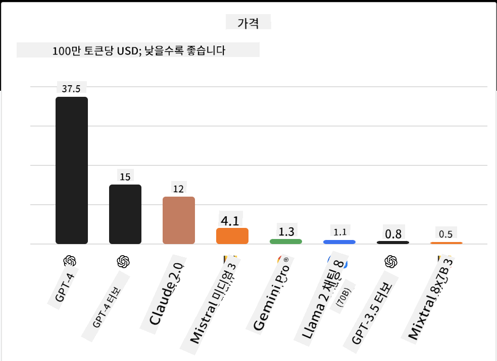
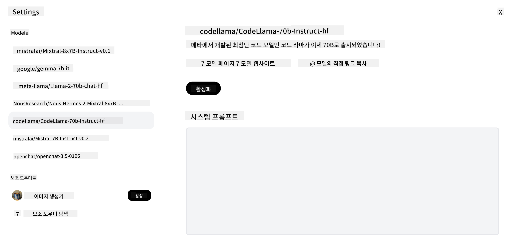
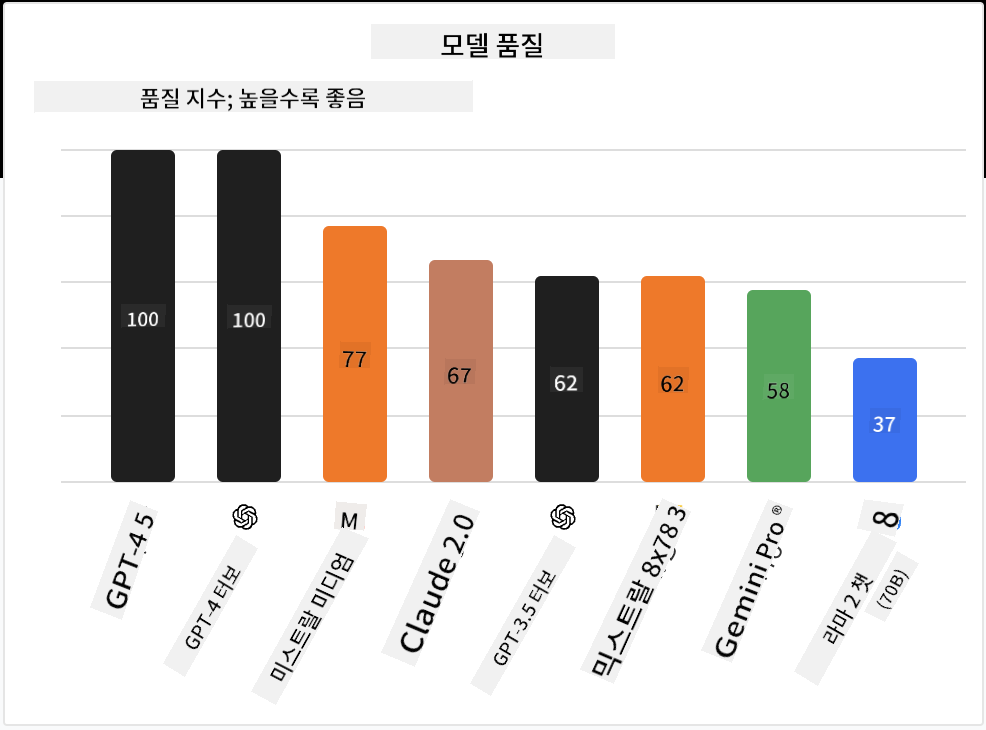

<!--
CO_OP_TRANSLATOR_METADATA:
{
  "original_hash": "0bba96e53ab841d99db731892a51fab8",
  "translation_date": "2025-07-09T17:06:27+00:00",
  "source_file": "16-open-source-models/README.md",
  "language_code": "ko"
}
-->

## 소개

오픈 소스 LLM의 세계는 흥미롭고 끊임없이 발전하고 있습니다. 이 강의는 오픈 소스 모델에 대해 깊이 있게 살펴보는 것을 목표로 합니다. 만약 독점 모델과 오픈 소스 모델의 비교에 대한 정보를 찾고 있다면, ["다양한 LLM 탐색 및 비교" 강의](../02-exploring-and-comparing-different-llms/README.md?WT.mc_id=academic-105485-koreyst)를 참고하세요. 이 강의에서는 파인튜닝 주제도 다루지만, 더 자세한 설명은 ["LLM 파인튜닝" 강의](../18-fine-tuning/README.md?WT.mc_id=academic-105485-koreyst)에서 확인할 수 있습니다.

## 학습 목표

- 오픈 소스 모델에 대한 이해
- 오픈 소스 모델 사용의 장점 이해
- Hugging Face와 Azure AI Studio에서 제공하는 오픈 모델 탐색

## 오픈 소스 모델이란?

오픈 소스 소프트웨어는 다양한 분야에서 기술 발전에 중요한 역할을 해왔습니다. Open Source Initiative(OSI)는 [소프트웨어가 오픈 소스로 분류되기 위한 10가지 기준](https://web.archive.org/web/20241126001143/https://opensource.org/osd?WT.mc_id=academic-105485-koreyst)을 정의했습니다. 소스 코드는 OSI가 승인한 라이선스 하에 공개되어야 합니다.

LLM 개발은 소프트웨어 개발과 유사한 요소가 있지만, 완전히 동일한 과정은 아닙니다. 이로 인해 LLM 맥락에서 오픈 소스의 정의에 대한 논의가 활발히 이루어지고 있습니다. 전통적인 오픈 소스 정의에 부합하려면 다음 정보가 공개되어야 합니다:

- 모델 학습에 사용된 데이터셋
- 학습에 사용된 전체 모델 가중치
- 평가 코드
- 파인튜닝 코드
- 전체 모델 가중치와 학습 지표

현재 이 기준을 충족하는 모델은 몇 안 됩니다. [Allen Institute for Artificial Intelligence(AllenAI)에서 만든 OLMo 모델](https://huggingface.co/allenai/OLMo-7B?WT.mc_id=academic-105485-koreyst)이 이 범주에 속합니다.

이 강의에서는 작성 시점에 위 기준을 완전히 충족하지 않을 수 있으므로, 앞으로 이 모델들을 "오픈 모델"이라고 부르겠습니다.

## 오픈 모델의 장점

**높은 맞춤화 가능성** - 오픈 모델은 상세한 학습 정보와 함께 공개되기 때문에, 연구자와 개발자가 모델 내부를 수정할 수 있습니다. 이를 통해 특정 작업이나 연구 분야에 맞게 세밀하게 조정된 전문화된 모델을 만들 수 있습니다. 예를 들어 코드 생성, 수학 연산, 생물학 분야 등이 있습니다.

**비용** - 이러한 모델을 사용하고 배포하는 토큰당 비용이 독점 모델보다 낮습니다. 생성형 AI 애플리케이션을 구축할 때, 사용 사례에 맞춰 성능과 가격을 비교하는 것이 중요합니다.

  
출처: Artificial Analysis

**유연성** - 오픈 모델을 사용하면 다양한 모델을 활용하거나 결합하는 데 유연성을 가질 수 있습니다. 예를 들어, [HuggingChat Assistants](https://huggingface.co/chat?WT.mc_id=academic-105485-koreyst)에서는 사용자 인터페이스에서 직접 사용할 모델을 선택할 수 있습니다:

## 다양한 오픈 모델 탐색

### Llama 2

[Meta에서 개발한 Llama 2](https://huggingface.co/meta-llama?WT.mc_id=academic-105485-koreyst)는 채팅 기반 애플리케이션에 최적화된 오픈 모델입니다. 이는 대량의 대화 데이터와 인간 피드백을 포함한 파인튜닝 방식 덕분입니다. 이 방법으로 모델은 인간 기대에 더 부합하는 결과를 생성하여 더 나은 사용자 경험을 제공합니다.

Llama의 파인튜닝 버전 예로는 일본어에 특화된 [Japanese Llama](https://huggingface.co/elyza/ELYZA-japanese-Llama-2-7b?WT.mc_id=academic-105485-koreyst)와 기본 모델을 향상시킨 [Llama Pro](https://huggingface.co/TencentARC/LLaMA-Pro-8B?WT.mc_id=academic-105485-koreyst)가 있습니다.

### Mistral

[Mistral](https://huggingface.co/mistralai?WT.mc_id=academic-105485-koreyst)은 고성능과 효율성에 중점을 둔 오픈 모델입니다. Mixture-of-Experts 방식을 사용하여 여러 전문 모델을 하나의 시스템으로 결합하고, 입력에 따라 특정 모델만 선택해 사용합니다. 이를 통해 계산 효율성이 높아집니다.

Mistral의 파인튜닝 버전 예로는 의료 분야에 집중한 [BioMistral](https://huggingface.co/BioMistral/BioMistral-7B?text=Mon+nom+est+Thomas+et+mon+principal?WT.mc_id=academic-105485-koreyst)과 수학 연산을 수행하는 [OpenMath Mistral](https://huggingface.co/nvidia/OpenMath-Mistral-7B-v0.1-hf?WT.mc_id=academic-105485-koreyst)이 있습니다.

### Falcon

[Falcon](https://huggingface.co/tiiuae?WT.mc_id=academic-105485-koreyst)은 Technology Innovation Institute(**TII**)에서 만든 LLM입니다. Falcon-40B는 400억 개의 파라미터로 학습되었으며, GPT-3보다 적은 컴퓨팅 자원으로 더 나은 성능을 보입니다. 이는 FlashAttention 알고리즘과 멀티쿼리 어텐션 덕분에 추론 시 메모리 요구량을 줄였기 때문입니다. 추론 시간이 단축되어 Falcon-40B는 채팅 애플리케이션에 적합합니다.

Falcon의 파인튜닝 버전 예로는 오픈 모델 기반의 어시스턴트인 [OpenAssistant](https://huggingface.co/OpenAssistant/falcon-40b-sft-top1-560?WT.mc_id=academic-105485-koreyst)와 기본 모델보다 높은 성능을 제공하는 [GPT4ALL](https://huggingface.co/nomic-ai/gpt4all-falcon?WT.mc_id=academic-105485-koreyst)이 있습니다.

## 선택 방법

오픈 모델을 선택하는 데 정답은 없습니다. 시작점으로 Azure AI Studio의 작업별 필터 기능을 활용해 보세요. 이를 통해 모델이 어떤 작업에 맞게 학습되었는지 알 수 있습니다. Hugging Face는 특정 지표를 기반으로 성능이 우수한 모델을 보여주는 LLM 리더보드도 운영합니다.

다양한 유형의 LLM을 비교할 때는 [Artificial Analysis](https://artificialanalysis.ai/?WT.mc_id=academic-105485-koreyst)도 좋은 자료입니다:

  
출처: Artificial Analysis

특정 사용 사례에 집중한다면, 해당 분야에 맞게 파인튜닝된 버전을 찾아보는 것이 효과적입니다. 여러 오픈 모델을 실험해 보고, 본인과 사용자 기대에 맞는 성능을 확인하는 것도 좋은 방법입니다.

## 다음 단계

오픈 모델의 가장 큰 장점은 빠르게 시작할 수 있다는 점입니다. 여기서 다룬 모델들이 포함된 Hugging Face 컬렉션을 제공하는 [Azure AI Studio 모델 카탈로그](https://ai.azure.com?WT.mc_id=academic-105485-koreyst)를 확인해 보세요.

## 학습은 여기서 끝나지 않습니다, 여정을 계속하세요

이 강의를 마친 후에는 [Generative AI 학습 컬렉션](https://aka.ms/genai-collection?WT.mc_id=academic-105485-koreyst)을 통해 생성형 AI 지식을 계속해서 향상시켜 보세요!

**면책 조항**:  
이 문서는 AI 번역 서비스 [Co-op Translator](https://github.com/Azure/co-op-translator)를 사용하여 번역되었습니다. 정확성을 위해 최선을 다하고 있으나, 자동 번역에는 오류나 부정확한 부분이 있을 수 있음을 유의하시기 바랍니다. 원문은 해당 언어의 원본 문서가 권위 있는 출처로 간주되어야 합니다. 중요한 정보의 경우 전문적인 인간 번역을 권장합니다. 본 번역 사용으로 인해 발생하는 오해나 잘못된 해석에 대해 당사는 책임을 지지 않습니다.