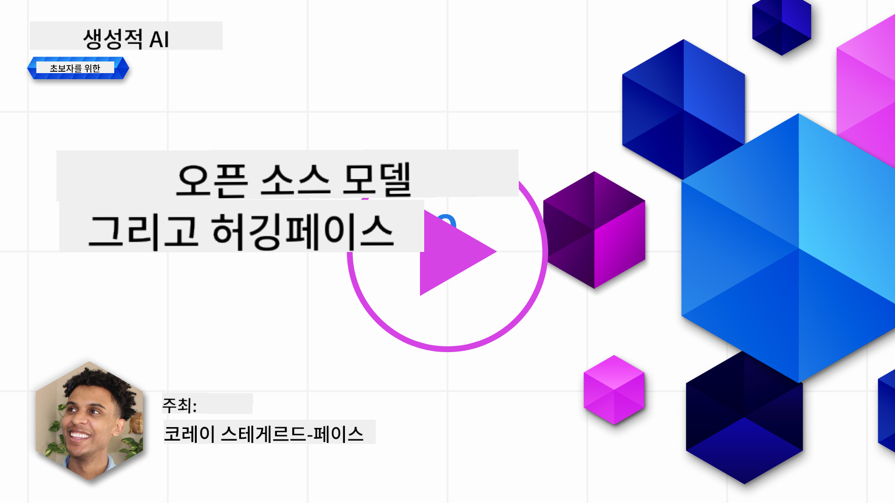
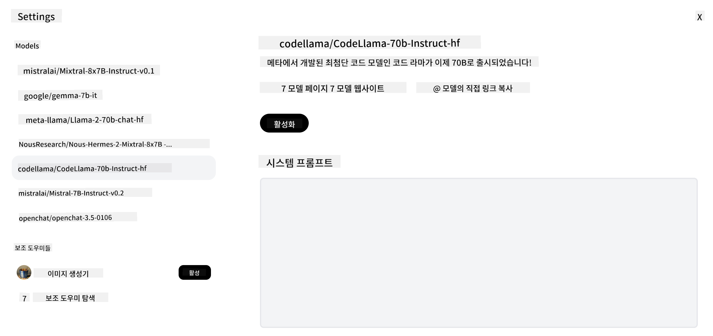
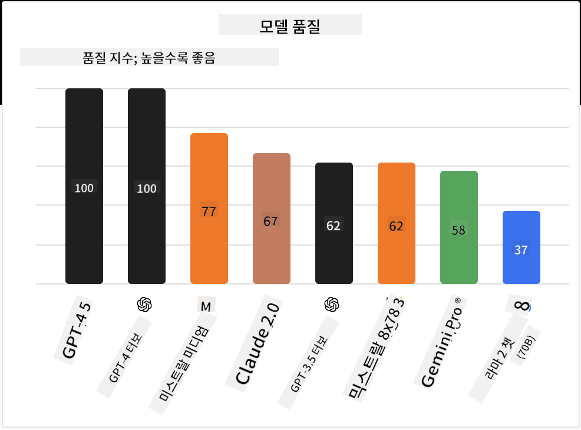

<!--
CO_OP_TRANSLATOR_METADATA:
{
  "original_hash": "0bba96e53ab841d99db731892a51fab8",
  "translation_date": "2025-06-25T23:51:48+00:00",
  "source_file": "16-open-source-models/README.md",
  "language_code": "ko"
}
-->

## 소개

오픈 소스 LLM의 세계는 흥미롭고 끊임없이 변화하고 있습니다. 이 레슨은 오픈 소스 모델에 대한 깊이 있는 이해를 제공하는 것을 목표로 합니다. 독점 모델과 오픈 소스 모델의 비교에 대한 정보를 찾고 있다면 ["다양한 LLM 탐색 및 비교" 레슨](../02-exploring-and-comparing-different-llms/README.md?WT.mc_id=academic-105485-koreyst)을 참조하세요. 이 레슨에서는 미세 조정에 대한 주제도 다루지만, 보다 자세한 설명은 ["LLM 미세 조정" 레슨](../18-fine-tuning/README.md?WT.mc_id=academic-105485-koreyst)에서 찾을 수 있습니다.

## 학습 목표

- 오픈 소스 모델에 대한 이해
- 오픈 소스 모델을 활용하는 것의 이점 이해
- Hugging Face와 Azure AI Studio에서 제공되는 오픈 모델 탐색

## 오픈 소스 모델이란 무엇인가?

오픈 소스 소프트웨어는 다양한 분야에서 기술의 발전에 중요한 역할을 해왔습니다. 오픈 소스 이니셔티브(OSI)는 소프트웨어를 오픈 소스로 분류하기 위한 [10가지 기준](https://web.archive.org/web/20241126001143/https://opensource.org/osd?WT.mc_id=academic-105485-koreyst)을 정의했습니다. 소스 코드는 OSI에서 승인한 라이센스 하에 공개적으로 공유되어야 합니다.

LLM의 개발은 소프트웨어 개발과 유사한 요소를 가지고 있지만, 과정은 정확히 동일하지 않습니다. 이는 LLM의 맥락에서 오픈 소스의 정의에 대한 커뮤니티 내 많은 논의를 가져왔습니다. 모델이 전통적인 오픈 소스 정의에 맞추려면 다음 정보가 공개적으로 제공되어야 합니다:

- 모델을 훈련시키는 데 사용된 데이터셋.
- 훈련의 일부로서의 전체 모델 가중치.
- 평가 코드.
- 미세 조정 코드.
- 전체 모델 가중치와 훈련 메트릭.

현재 이 기준을 충족하는 모델은 몇 개밖에 없습니다. Allen Institute for Artificial Intelligence (AllenAI)가 만든 [OLMo 모델](https://huggingface.co/allenai/OLMo-7B?WT.mc_id=academic-105485-koreyst)이 이 범주에 속합니다.

이 레슨에서는, 작성 시점에 위의 기준에 맞지 않을 수 있으므로 앞으로 모델을 "오픈 모델"이라고 언급할 것입니다.

## 오픈 모델의 이점

**높은 맞춤화 가능성** - 오픈 모델은 상세한 훈련 정보를 제공하므로, 연구자와 개발자는 모델의 내부를 수정할 수 있습니다. 이는 특정 작업이나 연구 분야에 맞춰 미세 조정된 고도로 전문화된 모델을 생성할 수 있게 합니다. 코드 생성, 수학적 연산 및 생물학과 같은 예시가 있습니다.

**비용** - 이러한 모델을 사용하고 배포하는 비용은 독점 모델보다 낮습니다. 생성 AI 애플리케이션을 구축할 때, 사용 사례에서 성능과 가격을 비교하는 것이 필요합니다.

출처: Artificial Analysis

**유연성** - 오픈 모델을 사용하면 다양한 모델을 사용하거나 결합하는 데 유연성을 가질 수 있습니다. [HuggingChat Assistants](https://huggingface.co/chat?WT.mc_id=academic-105485-koreyst)에서는 사용자가 사용자 인터페이스에서 직접 사용되는 모델을 선택할 수 있습니다:

## 다양한 오픈 모델 탐색

### Llama 2

Meta에서 개발한 [LLama2](https://huggingface.co/meta-llama?WT.mc_id=academic-105485-koreyst)는 채팅 기반 애플리케이션에 최적화된 오픈 모델입니다. 이는 대량의 대화와 인간 피드백을 포함한 미세 조정 방법 덕분입니다. 이 방법으로 모델은 인간의 기대에 맞춘 결과를 더 많이 생성하여 더 나은 사용자 경험을 제공합니다.

Llama의 미세 조정 버전의 예시로는 일본어에 특화된 [Japanese Llama](https://huggingface.co/elyza/ELYZA-japanese-Llama-2-7b?WT.mc_id=academic-105485-koreyst)와 기본 모델의 향상된 버전인 [Llama Pro](https://huggingface.co/TencentARC/LLaMA-Pro-8B?WT.mc_id=academic-105485-koreyst)가 있습니다.

### Mistral

[Mistral](https://huggingface.co/mistralai?WT.mc_id=academic-105485-koreyst)은 높은 성능과 효율성에 중점을 둔 오픈 모델입니다. Mixture-of-Experts 접근법을 사용하여 전문화된 전문가 모델 그룹을 하나의 시스템으로 결합하여 입력에 따라 특정 모델이 선택됩니다. 이는 모델이 전문화된 입력만 처리하기 때문에 계산을 더욱 효과적으로 만듭니다.

Mistral의 미세 조정 버전의 예시로는 의료 분야에 초점을 맞춘 [BioMistral](https://huggingface.co/BioMistral/BioMistral-7B?text=Mon+nom+est+Thomas+et+mon+principal?WT.mc_id=academic-105485-koreyst)과 수학적 계산을 수행하는 [OpenMath Mistral](https://huggingface.co/nvidia/OpenMath-Mistral-7B-v0.1-hf?WT.mc_id=academic-105485-koreyst)이 있습니다.

### Falcon

[Falcon](https://huggingface.co/tiiuae?WT.mc_id=academic-105485-koreyst)은 기술 혁신 연구소(**TII**)에서 만든 LLM입니다. Falcon-40B는 400억 개의 파라미터로 훈련되어 적은 컴퓨팅 예산으로 GPT-3보다 더 나은 성능을 보여줍니다. 이는 FlashAttention 알고리즘과 멀티쿼리 주의력을 사용하여 추론 시 메모리 요구 사항을 줄일 수 있기 때문입니다. 이로 인해 추론 시간이 단축되어 Falcon-40B는 채팅 애플리케이션에 적합합니다.

Falcon의 미세 조정 버전의 예시로는 오픈 모델에 기반한 어시스턴트인 [OpenAssistant](https://huggingface.co/OpenAssistant/falcon-40b-sft-top1-560?WT.mc_id=academic-105485-koreyst)와 기본 모델보다 높은 성능을 제공하는 [GPT4ALL](https://huggingface.co/nomic-ai/gpt4all-falcon?WT.mc_id=academic-105485-koreyst)이 있습니다.

## 선택 방법

오픈 모델을 선택하는 데 있어 하나의 정답은 없습니다. 시작하기 좋은 곳은 Azure AI Studio의 작업별 필터 기능을 사용하는 것입니다. 이를 통해 모델이 어떤 유형의 작업에 대해 훈련되었는지 이해할 수 있습니다. Hugging Face는 특정 메트릭에 기반하여 최고의 성능을 보여주는 모델을 보여주는 LLM 리더보드를 유지 관리합니다.

다양한 유형의 LLM을 비교할 때 [Artificial Analysis](https://artificialanalysis.ai/?WT.mc_id=academic-105485-koreyst)는 또 다른 훌륭한 자원입니다:

출처: Artificial Analysis

특정 사용 사례에 대해 작업할 때, 동일한 분야에 초점을 맞춘 미세 조정 버전을 검색하는 것이 효과적일 수 있습니다. 여러 오픈 모델을 실험하여 사용자와 사용자의 기대에 따라 어떻게 성능을 발휘하는지 보는 것이 또 다른 좋은 방법입니다.

## 다음 단계

오픈 모델의 가장 좋은 점은 빠르게 작업을 시작할 수 있다는 것입니다. 여기서 논의한 모델이 포함된 특정 Hugging Face 컬렉션을 특징으로 하는 [Azure AI Studio 모델 카탈로그](https://ai.azure.com?WT.mc_id=academic-105485-koreyst)를 확인해보세요.

## 학습은 여기서 멈추지 않습니다, 여정을 계속하세요

이 레슨을 완료한 후, [Generative AI Learning 컬렉션](https://aka.ms/genai-collection?WT.mc_id=academic-105485-koreyst)을 확인하여 생성 AI 지식을 계속해서 향상시키세요!

**면책 조항**:  
이 문서는 AI 번역 서비스 [Co-op Translator](https://github.com/Azure/co-op-translator)를 사용하여 번역되었습니다. 우리는 정확성을 위해 노력하지만 자동 번역은 오류나 부정확성을 포함할 수 있음을 유의하십시오. 원본 문서는 해당 언어로 작성된 것이 권위 있는 자료로 간주되어야 합니다. 중요한 정보에 대해서는 전문적인 인간 번역을 권장합니다. 이 번역 사용으로 인해 발생하는 오해나 오역에 대해서는 책임을 지지 않습니다.