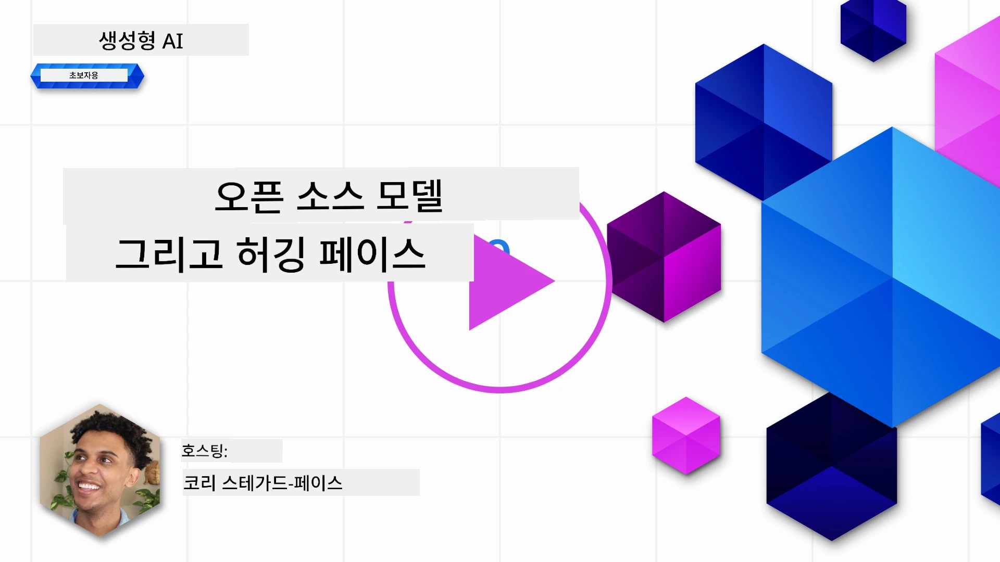
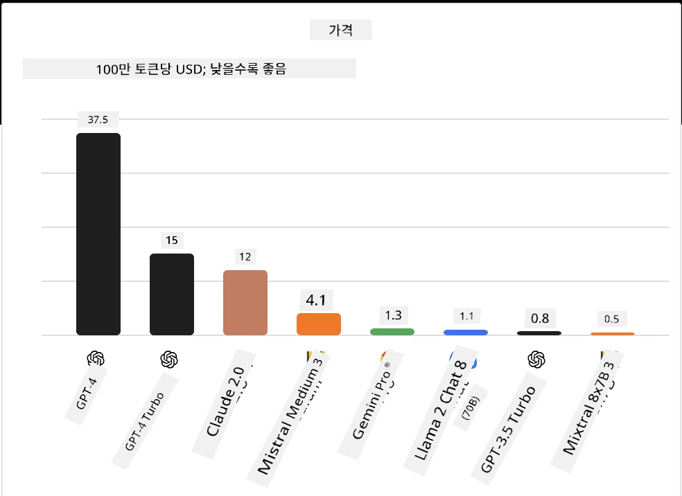
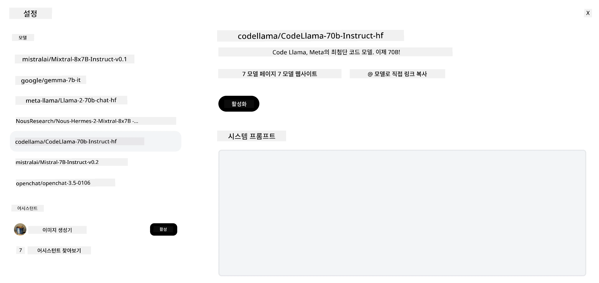
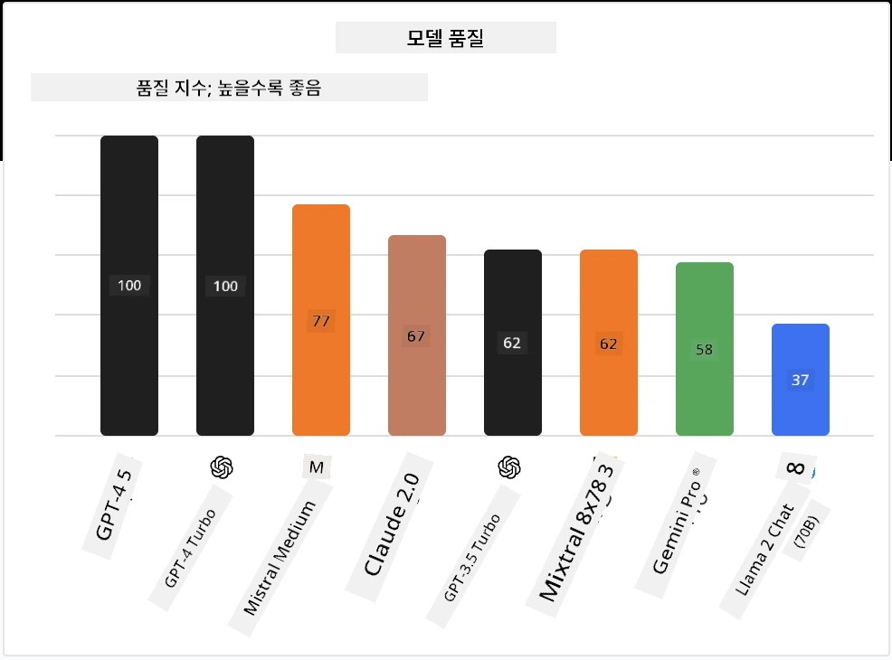

## 소개

오픈 소스 LLM의 세계는 흥미롭고 끊임없이 진화하고 있습니다. 이 강의는 오픈 소스 모델을 깊이 있게 살펴보는 것을 목표로 합니다. 독점 모델이 오픈 소스 모델과 어떻게 비교되는지에 대한 정보를 찾고 있다면 ["다양한 LLM 탐색 및 비교" 강의](../02-exploring-and-comparing-different-llms/README.md?WT.mc_id=academic-105485-koreyst)로 이동하세요. 이 강의에서는 미세 조정 주제도 다루지만, 더 자세한 설명은 ["LLM 미세 조정" 강의](../18-fine-tuning/README.md?WT.mc_id=academic-105485-koreyst)에서 확인할 수 있습니다.

## 학습 목표

- 오픈 소스 모델에 대한 이해 습득
- 오픈 소스 모델 작업의 장점 이해
- Hugging Face와 Microsoft Foundry 모델 카탈로그에서 사용 가능한 오픈 모델 탐색

## 오픈 소스 모델이란?

오픈 소스 소프트웨어는 다양한 분야에서 기술 발전에 중요한 역할을 해왔습니다. Open Source Initiative (OSI)는 [소프트웨어 오픈 소스 분류를 위한 10가지 기준](https://web.archive.org/web/20241126001143/https://opensource.org/osd?WT.mc_id=academic-105485-koreyst)을 정의했습니다. 소스 코드는 OSI가 승인한 라이선스 아래에서 공개되어야 합니다.

LLM 개발은 소프트웨어 개발과 비슷한 요소를 가지고 있지만, 과정이 완전히 동일하지는 않습니다. 이로 인해 커뮤니티에서는 LLM 맥락에서 오픈 소스의 정의에 대한 많은 논의가 있었습니다. 모델이 전통적인 오픈 소스 정의에 부합하려면 다음 정보가 공개되어야 합니다:

- 모델 학습에 사용된 데이터셋.
- 학습의 일부로서의 전체 모델 가중치.
- 평가 코드.
- 미세 조정 코드.
- 전체 모델 가중치 및 학습 지표.

현재 이 기준을 만족하는 모델은 몇 안 됩니다. [Allen Institute for Artificial Intelligence(AllenAI)가 만든 OLMo 모델](https://huggingface.co/allenai/OLMo-7B?WT.mc_id=academic-105485-koreyst)이 이 범주에 속합니다.

이 강의에서는, 작성 시점에 위 기준을 완전히 충족하지 않을 수 있으므로 앞으로 모델을 "오픈 모델"이라 부르겠습니다.

## 오픈 모델의 장점

**높은 맞춤성** - 오픈 모델은 상세한 학습 정보와 함께 공개되기 때문에, 연구원과 개발자가 모델 내부를 수정할 수 있습니다. 이는 특정 작업이나 연구 분야에 맞춰 미세 조정된 고도로 전문화된 모델 제작을 가능하게 합니다. 예로는 코드 생성, 수학 연산, 생물학 등이 있습니다.

<strong>비용</strong> - 이러한 모델을 사용 및 배포하는 토큰당 비용은 독점 모델보다 낮습니다. 생성형 AI 애플리케이션을 구축할 때, 해당 모델을 사용한 성능 대 비용을 고려하는 것이 중요합니다.

출처: Artificial Analysis

<strong>유연성</strong> - 오픈 모델을 사용하면 다양한 모델을 이용하거나 결합할 때 유연성을 가질 수 있습니다. 예로 [HuggingChat Assistants](https://huggingface.co/chat?WT.mc_id=academic-105485-koreyst)는 사용자가 인터페이스 내에서 직접 사용할 모델을 선택할 수 있게 합니다:

## 다양한 오픈 모델 탐색

### Llama 2

Meta가 개발한 [LLama2](https://huggingface.co/meta-llama?WT.mc_id=academic-105485-koreyst)는 챗 기반 애플리케이션에 최적화된 오픈 모델입니다. 이는 대량의 대화 및 인간 피드백을 포함한 미세 조정 방법 덕분입니다. 이 방법 덕분에 모델은 인간 기대와 더 일치하는 결과를 생성하여 더 나은 사용자 경험을 제공합니다.

미세 조정된 Llama 버전의 예로는 일본어에 특화된 [Japanese Llama](https://huggingface.co/elyza/ELYZA-japanese-Llama-2-7b?WT.mc_id=academic-105485-koreyst)와 기본 모델의 향상된 버전인 [Llama Pro](https://huggingface.co/TencentARC/LLaMA-Pro-8B?WT.mc_id=academic-105485-koreyst)가 있습니다.

### Mistral

[Mistral](https://huggingface.co/mistralai?WT.mc_id=academic-105485-koreyst)는 고성능 및 효율성에 중점을 둔 오픈 모델입니다. Mixture-of-Experts 접근법을 사용해 여러 전문 모델을 하나의 시스템으로 결합하며, 입력에 따라 특정 모델이 선택되어 사용됩니다. 이는 모델이 전문 분야에 맞는 입력만 처리해 계산을 더 효율적으로 만듭니다.

미세 조정된 Mistral 버전 예로는 의료 분야에 집중한 [BioMistral](https://huggingface.co/BioMistral/BioMistral-7B?text=Mon+nom+est+Thomas+et+mon+principal?WT.mc_id=academic-105485-koreyst)과 수학 계산을 수행하는 [OpenMath Mistral](https://huggingface.co/nvidia/OpenMath-Mistral-7B-v0.1-hf?WT.mc_id=academic-105485-koreyst)가 있습니다.

### Falcon

Technology Innovation Institute(**TII**)가 만든 LLM인 [Falcon](https://huggingface.co/tiiuae?WT.mc_id=academic-105485-koreyst)는 400억 개 매개변수로 학습된 Falcon-40B가 GPT-3보다 더 적은 컴퓨팅 자원으로 더 나은 성능을 보입니다. 이는 FlashAttention 알고리즘과 멀티쿼리 어텐션을 사용해 추론 시 메모리 요구량을 줄였기 때문입니다. 이로 인해 Falcon-40B는 챗 애플리케이션에 적합합니다.

Falcon의 미세 조정 버전 예로는 오픈 모델을 기반으로 한 어시스턴트 [OpenAssistant](https://huggingface.co/OpenAssistant/falcon-40b-sft-top1-560?WT.mc_id=academic-105485-koreyst)와 기본 모델보다 더 높은 성능을 제공하는 [GPT4ALL](https://huggingface.co/nomic-ai/gpt4all-falcon?WT.mc_id=academic-105485-koreyst)가 있습니다.

## 어떻게 선택할까

오픈 모델 선택에 대한 정답은 없습니다. 좋은 출발점은 Microsoft Foundry 모델 카탈로그의 작업(task)별 필터 기능을 사용하는 것입니다. 이를 통해 모델이 학습된 작업 유형을 이해할 수 있습니다. Hugging Face는 또한 특정 지표 기준으로 최고의 성능을 보이는 모델을 보여주는 LLM 리더보드를 유지하고 있습니다.

다양한 유형별로 LLM을 비교하려면 [Artificial Analysis](https://artificialanalysis.ai/?WT.mc_id=academic-105485-koreyst)도 훌륭한 자료입니다:

출처: Artificial Analysis

특정 사용 사례에 집중한다면, 동일 분야에 초점 맞춘 미세 조정 버전을 찾는 것이 효과적입니다. 여러 오픈 모델을 실험해 보면서 본인과 사용자 기대에 맞는 성능을 확인하는 것도 좋은 방법입니다.

## 다음 단계

오픈 모델의 가장 좋은 점은 빠르게 작업을 시작할 수 있다는 것입니다. Microsoft Foundry 모델 카탈로그를 확인해 보세요. 여기에는 우리가 이 강의에서 논의한 모델을 포함한 특별한 Hugging Face 컬렉션이 있습니다.

## 학습은 여기서 멈추지 않는다, 여정을 계속하세요

이 강의를 마친 후, [Generative AI Learning 컬렉션](https://aka.ms/genai-collection?WT.mc_id=academic-105485-koreyst)을 확인하여 생성형 AI 지식을 계속 향상시키세요!

---

<!-- CO-OP TRANSLATOR DISCLAIMER START -->
**면책 조항**:
이 문서는 AI 번역 서비스 [Co-op Translator](https://github.com/Azure/co-op-translator)를 사용하여 번역되었습니다. 정확성을 기하기 위해 노력하고 있으나, 자동 번역은 오류나 부정확한 부분이 있을 수 있음을 유의하시기 바랍니다. 원본 문서의 원어본이 권위 있는 자료로 간주되어야 합니다. 중요한 정보의 경우, 전문가의 인간 번역을 권장합니다. 이 번역 사용으로 인해 발생하는 오해나 잘못된 해석에 대해 당사는 책임을 지지 않습니다.
<!-- CO-OP TRANSLATOR DISCLAIMER END -->