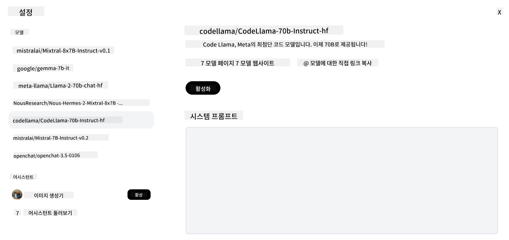

<!--
CO_OP_TRANSLATOR_METADATA:
{
  "original_hash": "a8b2d4bb727c877ebf9edff8623d16b9",
  "translation_date": "2025-09-06T10:13:44+00:00",
  "source_file": "16-open-source-models/README.md",
  "language_code": "ko"
}
-->

## 소개

오픈소스 LLM의 세계는 흥미롭고 끊임없이 진화하고 있습니다. 이 강의는 오픈소스 모델에 대한 심층적인 이해를 제공하는 것을 목표로 합니다. 독점 모델과 오픈소스 모델을 비교하는 방법에 대한 정보를 찾고 있다면 ["다양한 LLM 탐색 및 비교" 강의](../02-exploring-and-comparing-different-llms/README.md?WT.mc_id=academic-105485-koreyst)를 참조하세요. 또한 이 강의에서는 모델의 세부 조정(fine-tuning)에 대해 다루지만, 더 자세한 설명은 ["LLM 세부 조정" 강의](../18-fine-tuning/README.md?WT.mc_id=academic-105485-koreyst)에서 확인할 수 있습니다.

## 학습 목표

- 오픈소스 모델에 대한 이해를 얻는다.
- 오픈소스 모델을 활용하는 데 따른 이점을 이해한다.
- Hugging Face와 Azure AI Studio에서 제공되는 오픈 모델을 탐색한다.

## 오픈소스 모델이란?

오픈소스 소프트웨어는 다양한 분야에서 기술 발전에 중요한 역할을 해왔습니다. 오픈소스 이니셔티브(OSI)는 소프트웨어가 오픈소스로 분류되기 위한 [10가지 기준](https://web.archive.org/web/20241126001143/https://opensource.org/osd?WT.mc_id=academic-105485-koreyst)을 정의했습니다. 소스 코드는 OSI에서 승인한 라이선스 하에 공개적으로 공유되어야 합니다.

LLM 개발은 소프트웨어 개발과 유사한 요소를 포함하지만, 과정이 완전히 동일하지는 않습니다. 이로 인해 LLM의 맥락에서 오픈소스의 정의에 대한 커뮤니티 내 많은 논의가 이루어졌습니다. 전통적인 오픈소스 정의에 부합하려면 다음 정보가 공개적으로 제공되어야 합니다:

- 모델을 훈련하는 데 사용된 데이터셋.
- 훈련의 일부로서의 전체 모델 가중치.
- 평가 코드.
- 세부 조정 코드.
- 전체 모델 가중치와 훈련 메트릭.

현재 이러한 기준을 충족하는 모델은 몇 개뿐입니다. [Allen Institute for Artificial Intelligence (AllenAI)가 만든 OLMo 모델](https://huggingface.co/allenai/OLMo-7B?WT.mc_id=academic-105485-koreyst)이 그 중 하나입니다.

이 강의에서는 작성 시점에 위 기준을 충족하지 않을 수 있으므로 앞으로 "오픈 모델"이라는 용어를 사용하겠습니다.

## 오픈 모델의 이점

**높은 커스터마이징 가능성** - 오픈 모델은 상세한 훈련 정보를 제공하므로 연구자와 개발자가 모델 내부를 수정할 수 있습니다. 이를 통해 특정 작업이나 연구 분야에 맞게 세부 조정된 고도로 전문화된 모델을 만들 수 있습니다. 예를 들어 코드 생성, 수학적 연산, 생물학 등이 있습니다.

**비용** - 이러한 모델을 사용하고 배포하는 데 드는 토큰당 비용이 독점 모델보다 낮습니다. 생성형 AI 애플리케이션을 구축할 때, 사용 사례에 따라 성능과 가격을 비교하는 것이 중요합니다.

  
출처: Artificial Analysis

**유연성** - 오픈 모델을 사용하면 다양한 모델을 사용하거나 결합하는 데 있어 유연성을 가질 수 있습니다. 예를 들어 [HuggingChat Assistants](https://huggingface.co/chat?WT.mc_id=academic-105485-koreyst)에서는 사용자가 사용자 인터페이스에서 직접 사용 중인 모델을 선택할 수 있습니다:

## 다양한 오픈 모델 탐색

### Llama 2

[LLama2](https://huggingface.co/meta-llama?WT.mc_id=academic-105485-koreyst)는 Meta가 개발한 오픈 모델로, 채팅 기반 애플리케이션에 최적화되어 있습니다. 이는 대량의 대화와 인간 피드백을 포함한 세부 조정 방법 덕분입니다. 이 방법을 통해 모델은 인간의 기대에 더 부합하는 결과를 생성하여 더 나은 사용자 경험을 제공합니다.

Llama의 세부 조정 버전 예로는 일본어에 특화된 [Japanese Llama](https://huggingface.co/elyza/ELYZA-japanese-Llama-2-7b?WT.mc_id=academic-105485-koreyst)와 기본 모델을 개선한 [Llama Pro](https://huggingface.co/TencentARC/LLaMA-Pro-8B?WT.mc_id=academic-105485-koreyst)가 있습니다.

### Mistral

[Mistral](https://huggingface.co/mistralai?WT.mc_id=academic-105485-koreyst)은 높은 성능과 효율성에 중점을 둔 오픈 모델입니다. Mixture-of-Experts 접근법을 사용하여 여러 전문 모델을 하나의 시스템으로 결합하고 입력에 따라 특정 모델이 선택됩니다. 이를 통해 모델은 자신이 전문화된 입력만 처리하므로 계산이 더 효율적입니다.

Mistral의 세부 조정 버전 예로는 의료 분야에 초점을 맞춘 [BioMistral](https://huggingface.co/BioMistral/BioMistral-7B?text=Mon+nom+est+Thomas+et+mon+principal?WT.mc_id=academic-105485-koreyst)과 수학적 계산을 수행하는 [OpenMath Mistral](https://huggingface.co/nvidia/OpenMath-Mistral-7B-v0.1-hf?WT.mc_id=academic-105485-koreyst)이 있습니다.

### Falcon

[Falcon](https://huggingface.co/tiiuae?WT.mc_id=academic-105485-koreyst)은 기술 혁신 연구소(**TII**)에서 개발한 LLM입니다. Falcon-40B는 400억 개의 매개변수로 훈련되었으며, 더 적은 계산 예산으로 GPT-3보다 더 나은 성능을 보여줍니다. 이는 FlashAttention 알고리즘과 다중 쿼리 주의 메커니즘을 사용하여 추론 시 메모리 요구 사항을 줄였기 때문입니다. 이러한 감소된 추론 시간 덕분에 Falcon-40B는 채팅 애플리케이션에 적합합니다.

Falcon의 세부 조정 버전 예로는 오픈 모델을 기반으로 구축된 어시스턴트인 [OpenAssistant](https://huggingface.co/OpenAssistant/falcon-40b-sft-top1-560?WT.mc_id=academic-105485-koreyst)와 기본 모델보다 높은 성능을 제공하는 [GPT4ALL](https://huggingface.co/nomic-ai/gpt4all-falcon?WT.mc_id=academic-105485-koreyst)이 있습니다.

## 선택 방법

오픈 모델을 선택하는 데 정답은 없습니다. 시작점으로 Azure AI Studio의 작업별 필터 기능을 사용하는 것이 좋습니다. 이를 통해 모델이 어떤 작업에 대해 훈련되었는지 이해할 수 있습니다. Hugging Face는 특정 메트릭을 기준으로 최고의 성능을 보여주는 모델을 확인할 수 있는 LLM 리더보드를 유지 관리합니다.

다양한 유형의 LLM을 비교하려면 [Artificial Analysis](https://artificialanalysis.ai/?WT.mc_id=academic-105485-koreyst)도 훌륭한 리소스입니다:

  
출처: Artificial Analysis

특정 사용 사례에 대해 작업할 때, 동일한 분야에 초점을 맞춘 세부 조정 버전을 검색하는 것이 효과적일 수 있습니다. 여러 오픈 모델을 실험하여 사용자와 사용자의 기대에 따라 어떻게 성능을 발휘하는지 확인하는 것도 좋은 방법입니다.

## 다음 단계

오픈 모델의 가장 좋은 점은 빠르게 작업을 시작할 수 있다는 것입니다. [Azure AI Foundry Model Catalog](https://ai.azure.com?WT.mc_id=academic-105485-koreyst)를 확인해 보세요. 여기에는 이 강의에서 논의한 모델이 포함된 Hugging Face 컬렉션이 있습니다.

## 학습은 여기서 멈추지 않습니다. 여정을 계속하세요

이 강의를 완료한 후, [Generative AI Learning collection](https://aka.ms/genai-collection?WT.mc_id=academic-105485-koreyst)을 확인하여 생성형 AI 지식을 계속 향상시키세요!

---

**면책 조항**:  
이 문서는 AI 번역 서비스 [Co-op Translator](https://github.com/Azure/co-op-translator)를 사용하여 번역되었습니다. 정확성을 위해 최선을 다하고 있으나, 자동 번역에는 오류나 부정확성이 포함될 수 있습니다. 원본 문서의 원어 버전이 권위 있는 출처로 간주되어야 합니다. 중요한 정보의 경우, 전문적인 인간 번역을 권장합니다. 이 번역 사용으로 인해 발생하는 오해나 잘못된 해석에 대해 책임을 지지 않습니다.