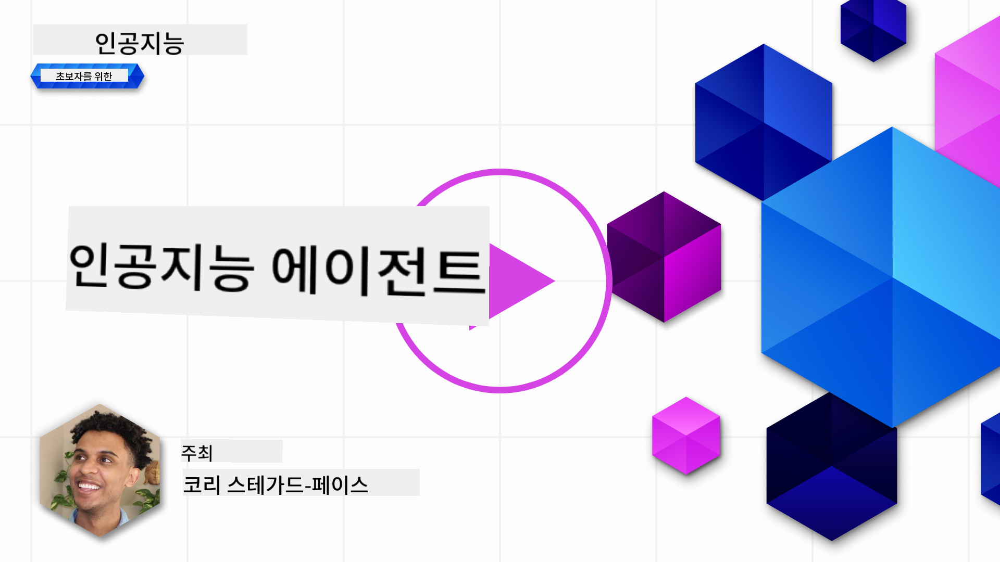
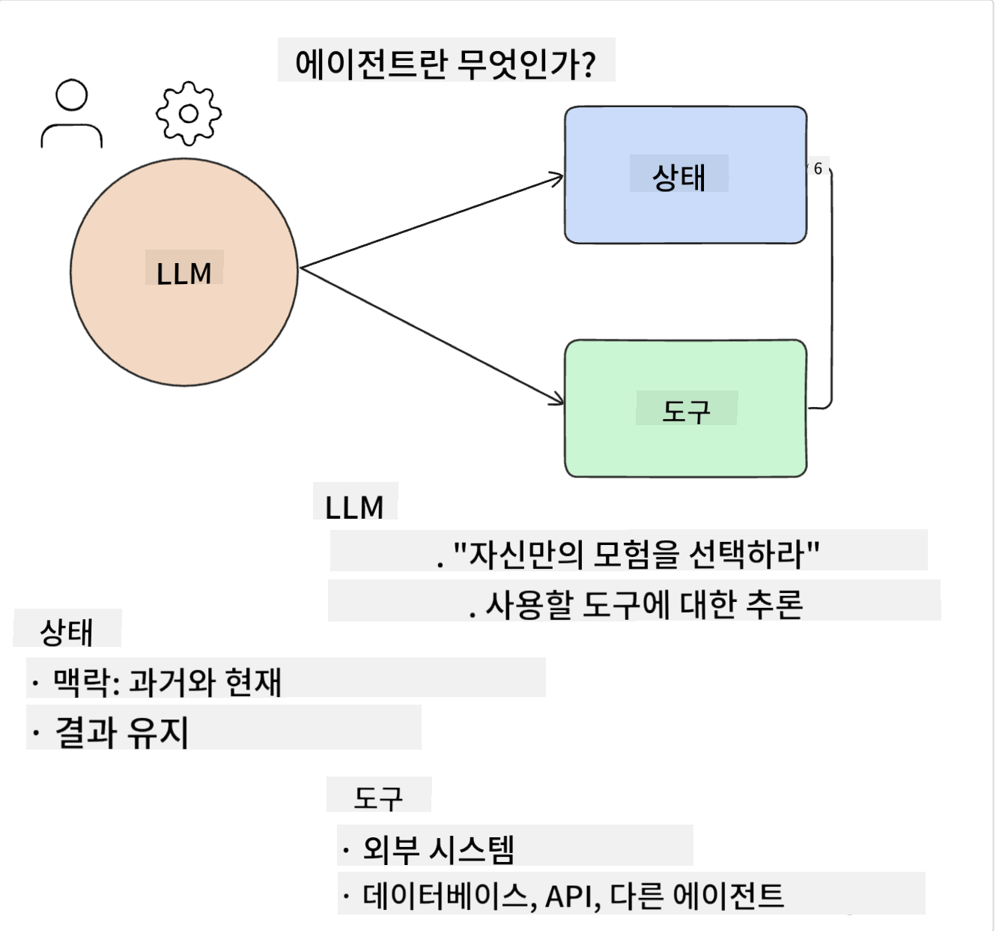
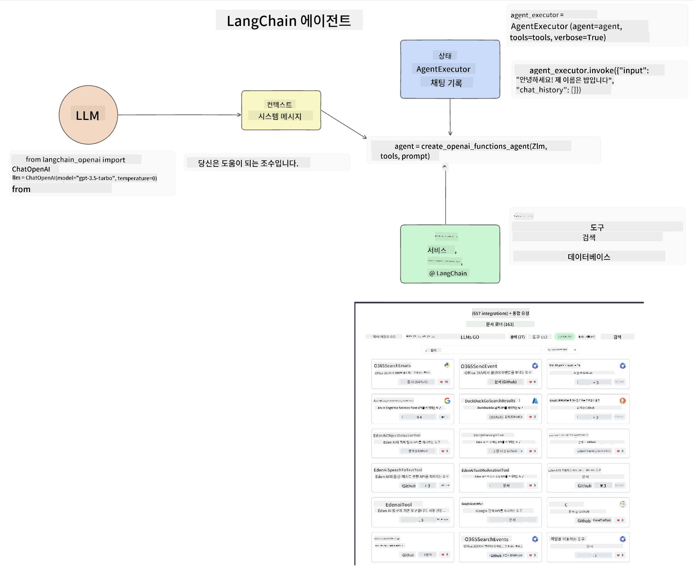
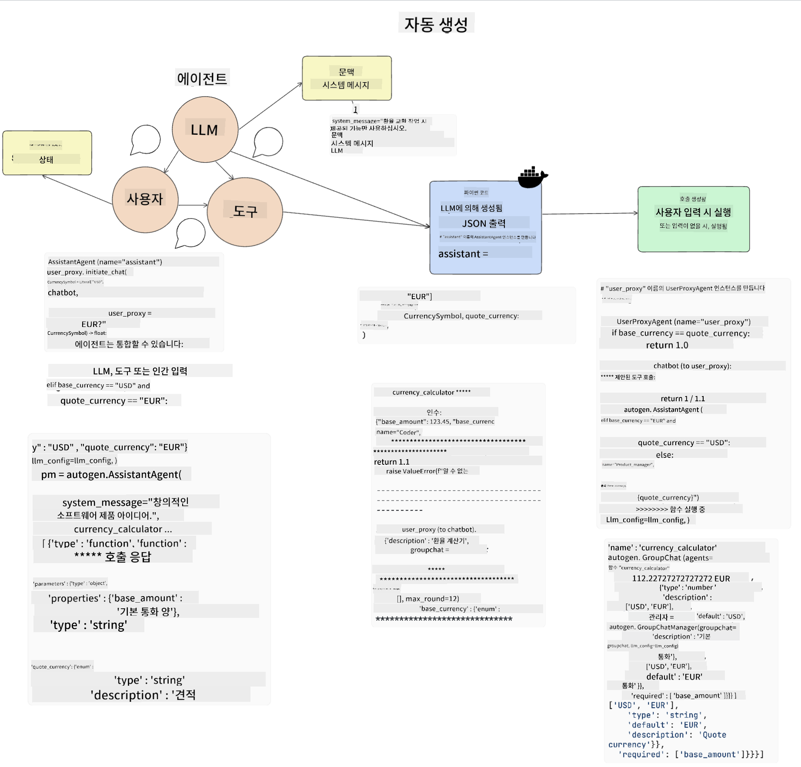
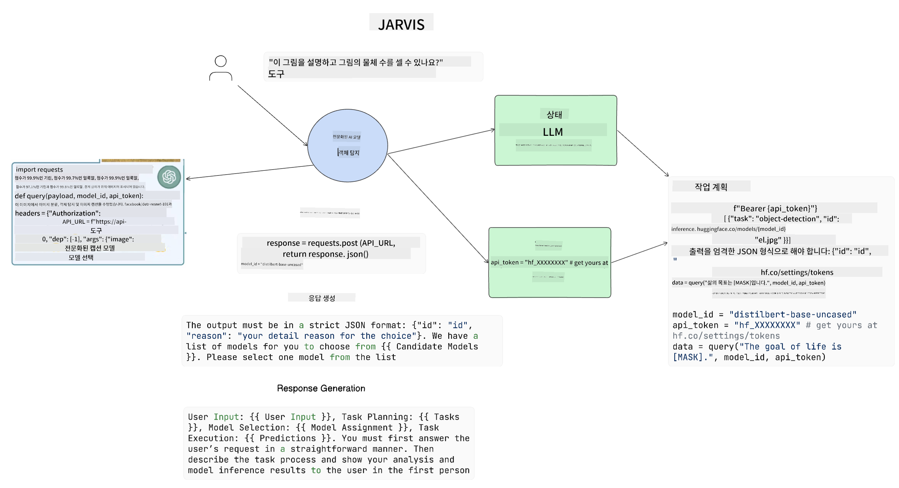

<!--
CO_OP_TRANSLATOR_METADATA:
{
  "original_hash": "11f03c81f190d9cbafd0f977dcbede6c",
  "translation_date": "2025-05-20T07:12:11+00:00",
  "source_file": "17-ai-agents/README.md",
  "language_code": "ko"
}
-->
[](https://aka.ms/gen-ai-lesson17-gh?WT.mc_id=academic-105485-koreyst)

## 소개

AI 에이전트는 생성 AI에서 흥미로운 발전을 나타내며, 대형 언어 모델(LLM)이 조수에서 행동을 취할 수 있는 에이전트로 진화할 수 있도록 합니다. AI 에이전트 프레임워크는 개발자가 LLM에 도구와 상태 관리를 제공하는 애플리케이션을 만들 수 있게 해줍니다. 이러한 프레임워크는 사용자와 개발자가 LLM이 계획한 행동을 모니터링할 수 있게 하여 경험 관리를 개선합니다.

이 강의에서는 다음과 같은 내용을 다룹니다:

- AI 에이전트란 무엇인가 - AI 에이전트는 정확히 무엇인가?
- 네 가지 다른 AI 에이전트 프레임워크 탐색 - 이들의 독특한 점은 무엇인가?
- 다양한 사용 사례에 AI 에이전트 적용 - 언제 AI 에이전트를 사용해야 하는가?

## 학습 목표

이 강의를 마치면 다음을 할 수 있습니다:

- AI 에이전트가 무엇인지 그리고 어떻게 사용될 수 있는지 설명할 수 있습니다.
- 인기 있는 AI 에이전트 프레임워크 간의 차이점을 이해하고, 이들이 어떻게 다른지 설명할 수 있습니다.
- AI 에이전트가 어떻게 작동하는지 이해하여 이들과 함께 애플리케이션을 구축할 수 있습니다.

## AI 에이전트란 무엇인가?

AI 에이전트는 생성 AI 세계에서 매우 흥미로운 분야입니다. 이 흥미로움은 때때로 용어와 그 적용에 대한 혼란을 가져옵니다. 대부분의 AI 에이전트를 지칭하는 도구를 포함하도록 단순하게 유지하기 위해, 우리는 다음과 같은 정의를 사용할 것입니다:

AI 에이전트는 대형 언어 모델(LLM)이 **상태**와 **도구**에 접근하여 작업을 수행할 수 있게 합니다.



이 용어들을 정의해 보겠습니다:

**대형 언어 모델** - 이 강의 전반에 걸쳐 참조되는 모델로, GPT-3.5, GPT-4, Llama-2 등이 있습니다.

**상태** - 이것은 LLM이 작업하는 컨텍스트를 의미합니다. LLM은 과거 행동의 컨텍스트와 현재 컨텍스트를 사용하여 이후 행동에 대한 의사결정을 안내합니다. AI 에이전트 프레임워크는 개발자가 이 컨텍스트를 더 쉽게 유지할 수 있도록 합니다.

**도구** - 사용자가 요청한 작업을 완료하고 LLM이 계획한 작업을 수행하기 위해, LLM은 도구에 접근해야 합니다. 도구의 예로는 데이터베이스, API, 외부 애플리케이션 또는 다른 LLM이 있을 수 있습니다.

이 정의들은 앞으로 구현을 살펴볼 때 좋은 기초가 될 것입니다. 몇 가지 다른 AI 에이전트 프레임워크를 탐색해 봅시다:

## LangChain 에이전트

[LangChain 에이전트](https://python.langchain.com/docs/how_to/#agents?WT.mc_id=academic-105485-koreyst)는 우리가 제공한 정의의 구현입니다.

**상태**를 관리하기 위해, 내장 함수 `AgentExecutor`를 사용합니다. 이는 정의된 `agent`과 사용할 수 있는 `tools`를 수용합니다.

`Agent Executor`은 또한 채팅 기록을 저장하여 채팅의 컨텍스트를 제공합니다.



LangChain은 LLM이 접근할 수 있는 애플리케이션에 가져올 수 있는 [도구 카탈로그](https://integrations.langchain.com/tools?WT.mc_id=academic-105485-koreyst)를 제공합니다. 이들은 커뮤니티와 LangChain 팀에 의해 만들어졌습니다.

그런 다음 이 도구들을 정의하고 `Agent Executor`에 전달할 수 있습니다.

가시성은 AI 에이전트를 논의할 때 또 다른 중요한 측면입니다. 애플리케이션 개발자가 LLM이 어떤 도구를 사용하고 있는지 그리고 왜 사용하고 있는지 이해하는 것이 중요합니다. 이를 위해 LangChain 팀은 LangSmith를 개발했습니다.

## AutoGen

다음으로 논의할 AI 에이전트 프레임워크는 [AutoGen](https://microsoft.github.io/autogen/?WT.mc_id=academic-105485-koreyst)입니다. AutoGen의 주요 초점은 대화입니다. 에이전트는 **대화 가능**하고 **맞춤화 가능**합니다.

**대화 가능 -** LLM은 작업을 완료하기 위해 다른 LLM과 대화를 시작하고 계속할 수 있습니다. 이는 `AssistantAgents`을 생성하고 특정 시스템 메시지를 제공함으로써 이루어집니다.

```python

autogen.AssistantAgent( name="Coder", llm_config=llm_config, ) pm = autogen.AssistantAgent( name="Product_manager", system_message="Creative in software product ideas.", llm_config=llm_config, )

```

**맞춤화 가능** - 에이전트는 LLM뿐만 아니라 사용자 또는 도구로 정의될 수 있습니다. 개발자로서, 작업을 완료하기 위한 피드백을 위해 사용자와 상호작용하는 `UserProxyAgent`를 정의할 수 있습니다. 이 피드백은 작업의 실행을 계속하거나 중지할 수 있습니다.

```python
user_proxy = UserProxyAgent(name="user_proxy")
```

### 상태와 도구

상태를 변경하고 관리하기 위해, 보조 에이전트는 작업을 완료하기 위해 Python 코드를 생성합니다.

다음은 그 과정의 예입니다:



#### 시스템 메시지로 정의된 LLM

```python
system_message="For weather related tasks, only use the functions you have been provided with. Reply TERMINATE when the task is done."
```

이 시스템 메시지는 특정 LLM에게 그 작업에 관련된 기능을 지시합니다. AutoGen을 사용하면 서로 다른 시스템 메시지를 가진 여러 AssistantAgents를 가질 수 있음을 기억하세요.

#### 사용자가 채팅을 시작함

```python
user_proxy.initiate_chat( chatbot, message="I am planning a trip to NYC next week, can you help me pick out what to wear? ", )

```

사용자 프록시(인간)로부터의 이 메시지는 에이전트가 실행해야 할 가능성이 있는 기능을 탐색하는 과정을 시작합니다.

#### 기능이 실행됨

```bash
chatbot (to user_proxy):

***** Suggested tool Call: get_weather ***** Arguments: {"location":"New York City, NY","time_periond:"7","temperature_unit":"Celsius"} ******************************************************** --------------------------------------------------------------------------------

>>>>>>>> EXECUTING FUNCTION get_weather... user_proxy (to chatbot): ***** Response from calling function "get_weather" ***** 112.22727272727272 EUR ****************************************************************

```

초기 채팅이 처리되면, 에이전트는 호출할 도구를 제안합니다. 이 경우, `get_weather`. Depending on your configuration, this function can be automatically executed and read by the Agent or can be executed based on user input.

You can find a list of [AutoGen code samples](https://microsoft.github.io/autogen/docs/Examples/?WT.mc_id=academic-105485-koreyst) to further explore how to get started building.

## Taskweaver

The next agent framework we will explore is [Taskweaver](https://microsoft.github.io/TaskWeaver/?WT.mc_id=academic-105485-koreyst). It is known as a "code-first" agent because instead of working strictly with `strings` , it can work with DataFrames in Python. This becomes extremely useful for data analysis and generation tasks. This can be things like creating graphs and charts or generating random numbers.

### State and Tools

To manage the state of the conversation, TaskWeaver uses the concept of a `Planner`. The `Planner` is a LLM that takes the request from the users and maps out the tasks that need to be completed to fulfill this request.

To complete the tasks the `Planner` is exposed to the collection of tools called `Plugins`라는 함수입니다. 이는 Python 클래스 또는 일반 코드 인터프리터일 수 있습니다. 이 플러그인은 LLM이 올바른 플러그인을 더 잘 검색할 수 있도록 임베딩으로 저장됩니다.


다음은 이상 탐지를 처리하는 플러그인의 예입니다:

```python
class AnomalyDetectionPlugin(Plugin): def __call__(self, df: pd.DataFrame, time_col_name: str, value_col_name: str):
```

코드는 실행 전에 검증됩니다. Taskweaver에서 컨텍스트를 관리하는 또 다른 기능은 대화의 `experience`. Experience allows for the context of a conversation to be stored over to the long term in a YAML file. This can be configured so that the LLM improves over time on certain tasks given that it is exposed to prior conversations.

## JARVIS

The last agent framework we will explore is [JARVIS](https://github.com/microsoft/JARVIS?tab=readme-ov-file?WT.mc_id=academic-105485-koreyst). What makes JARVIS unique is that it uses an LLM to manage the `state`입니다. `tools`은 다른 AI 모델입니다. 각 AI 모델은 객체 탐지, 전사 또는 이미지 캡션 생성과 같은 특정 작업을 수행하는 전문 모델입니다.



LLM은 범용 모델로서 사용자로부터 요청을 받고 특정 작업 및 작업을 완료하는 데 필요한 인수/데이터를 식별합니다.

```python
[{"task": "object-detection", "id": 0, "dep": [-1], "args": {"image": "e1.jpg" }}]
```

그런 다음 LLM은 요청을 JSON과 같이 전문 AI 모델이 해석할 수 있는 방식으로 포맷합니다. AI 모델이 작업에 기반한 예측을 반환하면 LLM은 응답을 받습니다.

작업을 완료하는 데 여러 모델이 필요한 경우, LLM은 이러한 모델의 응답을 해석한 후 이를 결합하여 사용자에게 응답을 생성합니다.

아래 예시는 사용자가 그림의 객체에 대한 설명과 개수를 요청할 때 이 작업이 어떻게 작동하는지를 보여줍니다:

## 과제

AI 에이전트에 대한 학습을 계속하기 위해 AutoGen을 사용하여 다음을 구축할 수 있습니다:

- 교육 스타트업의 다양한 부서와의 비즈니스 회의를 시뮬레이션하는 애플리케이션.
- LLM이 다양한 페르소나와 우선순위를 이해하도록 안내하는 시스템 메시지를 생성하고, 사용자가 새로운 제품 아이디어를 제안할 수 있도록 합니다.
- LLM은 각 부서에서 피치와 제품 아이디어를 개선하고 구체화하기 위한 후속 질문을 생성해야 합니다.

## 학습은 여기서 멈추지 않습니다, 여정을 계속하세요

이 강의를 완료한 후, [Generative AI Learning collection](https://aka.ms/genai-collection?WT.mc_id=academic-105485-koreyst)을 확인하여 생성 AI 지식을 계속 향상시키세요!

