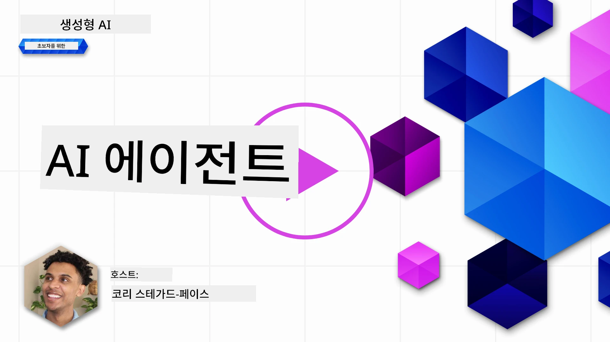
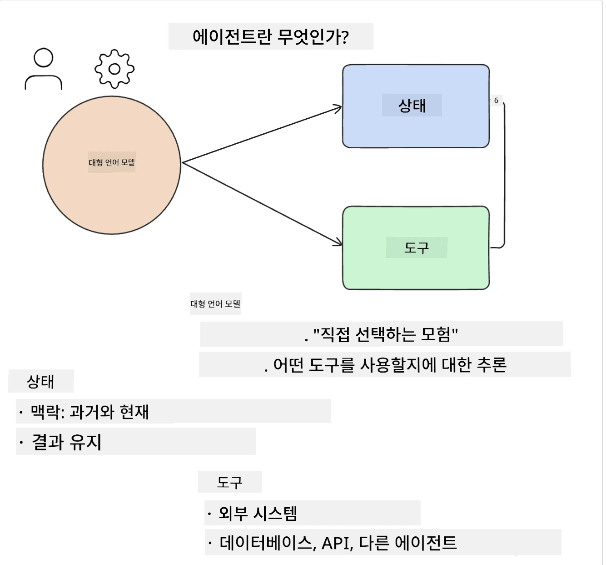
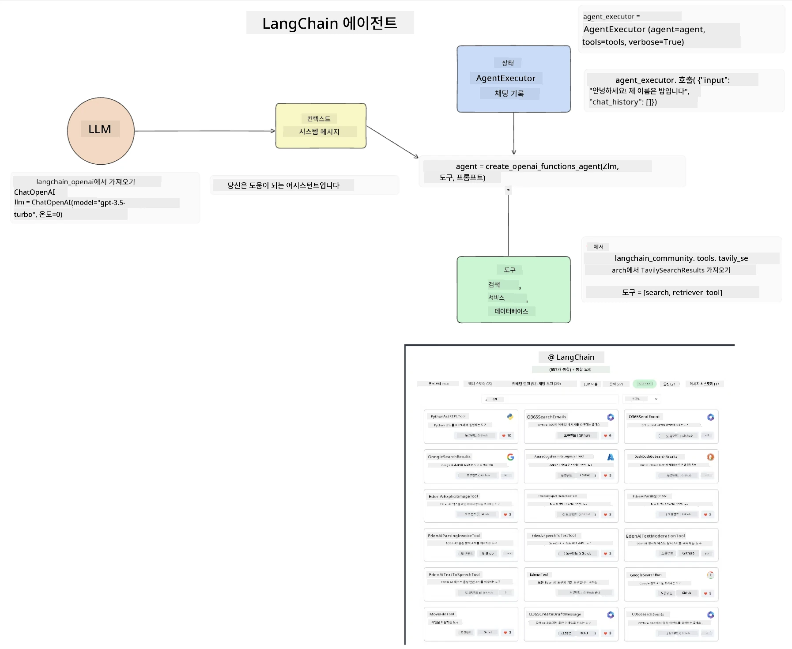
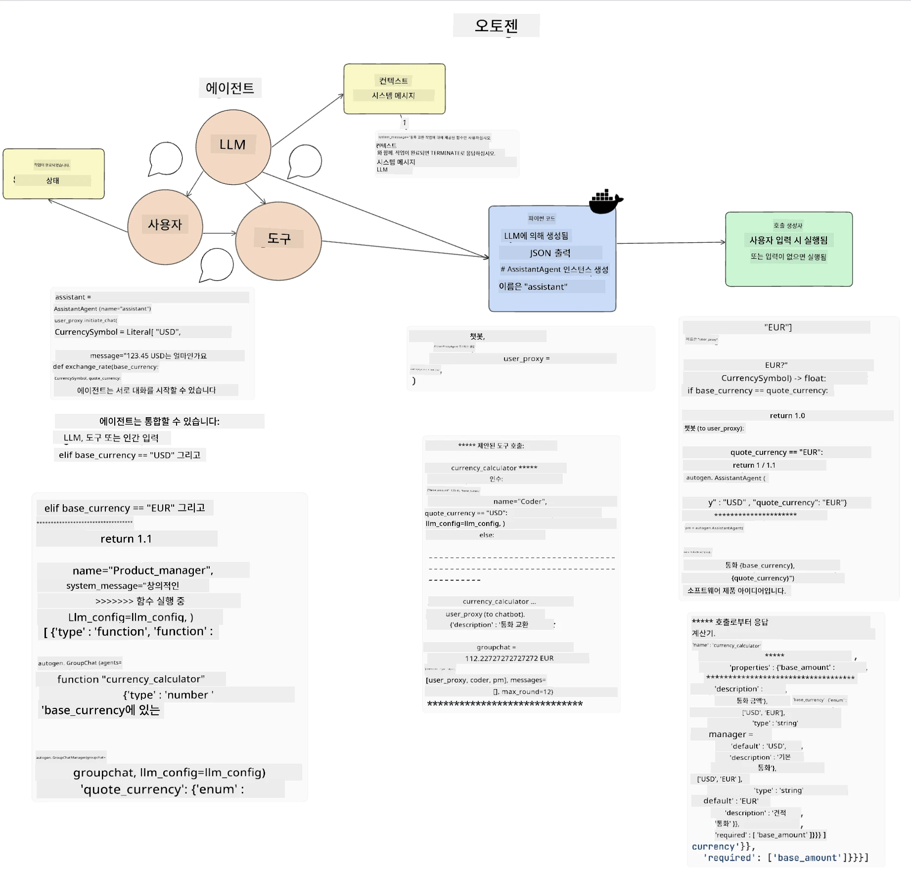
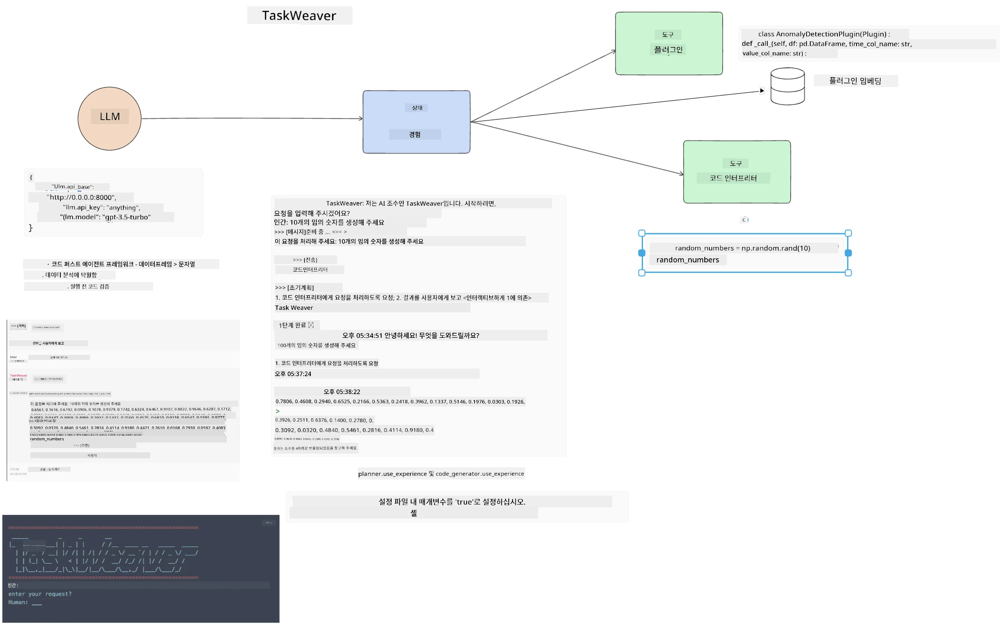
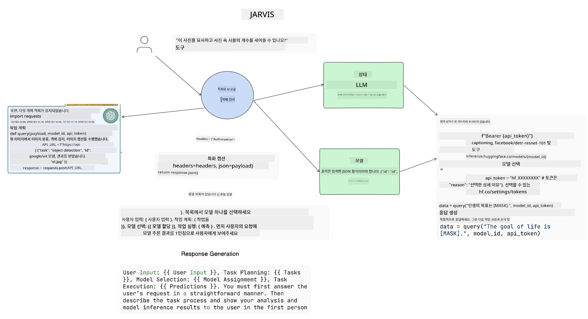

[](https://youtu.be/yAXVW-lUINc?si=bOtW9nL6jc3XJgOM)

## 소개

AI 에이전트는 생성 AI 분야에서 흥미로운 발전을 나타내며, LLM(대형 언어 모델)이 단순한 조수 역할을 넘어서 행동을 수행할 수 있는 에이전트로 진화할 수 있도록 합니다. AI 에이전트 프레임워크는 개발자가 LLM에 도구와 상태 관리를 제공하는 애플리케이션을 만들 수 있게 합니다. 이러한 프레임워크는 사용자가 LLM이 계획한 행동을 모니터링할 수 있도록 가시성을 향상시켜 경험 관리를 개선합니다.

이번 강의에서는 다음 영역을 다룹니다:

- AI 에이전트가 무엇인지 이해하기 - AI 에이전트란 정확히 무엇인가?
- 네 가지 다른 AI 에이전트 프레임워크 탐구 - 각각의 고유한 점은 무엇인가?
- 다양한 사용 사례에 AI 에이전트 적용하기 - 언제 AI 에이전트를 사용해야 하는가?

## 학습 목표

이 강의를 수강한 후, 다음을 할 수 있게 됩니다:

- AI 에이전트가 무엇이며 어떻게 사용할 수 있는지 설명할 수 있다.
- 인기 있는 AI 에이전트 프레임워크 간의 차이점과 그 차별성을 이해한다.
- AI 에이전트가 어떻게 동작하는지 이해하여 이들을 활용한 애플리케이션을 구축할 수 있다.

## AI 에이전트란 무엇인가?

AI 에이전트는 생성 AI 세계에서 매우 흥미로운 분야입니다. 이 흥미로움과 함께 때때로 용어와 적용에 혼동이 따르기도 합니다. 대부분의 AI 에이전트 도구를 포괄하도록 간단하게 정의하면 다음과 같습니다:

AI 에이전트는 LLM(대형 언어 모델)이 **상태(state)** 와 **도구(tools)** 에 접근할 수 있도록 하여 작업을 수행하게 합니다.



용어를 정의해 보겠습니다:

**대형 언어 모델** - 이 코스에서 언급하는 모델들로, GPT-3.5, GPT-4, Llama-2 등이 있습니다.

**상태(state)** - LLM이 작업하는 문맥을 의미합니다. LLM은 과거 행동과 현재 문맥을 사용하여 다음 행동을 결정합니다. AI 에이전트 프레임워크는 개발자가 이 문맥 관리를 쉽게 하도록 돕습니다.

**도구(tools)** - 사용자가 요청하고 LLM이 계획한 작업을 완수하기 위해 LLM이 접근할 수 있는 도구입니다. 예를 들면 데이터베이스, API, 외부 애플리케이션 또는 또 다른 LLM 등이 있습니다!

이 정의들이 앞으로 이들이 어떻게 구현되는지 살펴볼 때 좋은 기반이 될 것입니다. 이제 몇 가지 AI 에이전트 프레임워크를 탐구해 보겠습니다:

## LangChain 에이전트

[LangChain Agents](https://python.langchain.com/docs/how_to/#agents?WT.mc_id=academic-105485-koreyst)는 우리가 위에서 정의한 내용을 구현한 방식입니다.

**상태(state)** 관리를 위해 `AgentExecutor`라는 내장 기능을 사용합니다. 이 기능은 정의된 `agent`와 사용 가능한 `tools`를 받습니다.

`AgentExecutor`는 또한 대화 기록을 저장하여 대화의 문맥을 제공합니다.



LangChain은 LLM이 접근할 수 있는 도구들을 가져올 수 있는 [도구 카탈로그](https://integrations.langchain.com/tools?WT.mc_id=academic-105485-koreyst)를 제공합니다. 이 도구들은 커뮤니티와 LangChain 팀이 만듭니다.

이후 이러한 도구들을 정의하고 `AgentExecutor`에 넘겨 줄 수 있습니다.

가시성도 AI 에이전트에 대해 이야기할 때 중요한 측면입니다. 애플리케이션 개발자가 LLM이 어떤 도구를 왜 사용하고 있는지 이해하는 것이 중요합니다. 이를 위해 LangChain 팀은 LangSmith를 개발했습니다.

## AutoGen

다음으로 살펴볼 AI 에이전트 프레임워크는 [AutoGen](https://microsoft.github.io/autogen/?WT.mc_id=academic-105485-koreyst)입니다. AutoGen의 주요 초점은 대화입니다. 에이전트는 **대화할 수 있으며** 그리고 **사용자 정의 가능**합니다.

**대화 가능(conversable)** - LLM들은 작업 수행을 위해 다른 LLM과 대화를 시작하고 계속할 수 있습니다. 이는 특정 시스템 메시지를 부여한 `AssistantAgents`를 생성함으로써 이루어집니다.

```python

autogen.AssistantAgent( name="Coder", llm_config=llm_config, ) pm = autogen.AssistantAgent( name="Product_manager", system_message="Creative in software product ideas.", llm_config=llm_config, )

```

**사용자 정의 가능(customizable)** - 에이전트는 LLM뿐만 아니라 사용자나 도구로도 정의할 수 있습니다. 개발자로서, 작업 완료를 위한 피드백을 위해 사용자와 상호작용하는 `UserProxyAgent`를 정의할 수 있습니다. 이 피드백은 작업을 계속 진행하거나 중단할 수도 있습니다.

```python
user_proxy = UserProxyAgent(name="user_proxy")
```

### 상태와 도구

상태를 변경하고 관리하기 위해, Assistant Agent는 작업 완수를 위한 파이썬 코드를 생성합니다.

아래는 그 과정의 예시입니다:



#### 시스템 메시지로 정의된 LLM

```python
system_message="For weather related tasks, only use the functions you have been provided with. Reply TERMINATE when the task is done."
```

이 시스템 메시지는 특정 LLM이 작업에 관련된 기능을 알도록 지시합니다. AutoGen에서는 서로 다른 시스템 메시지를 가진 여러 AssistantAgent를 정의할 수 있습니다.

#### 사용자가 대화를 시작함

```python
user_proxy.initiate_chat( chatbot, message="I am planning a trip to NYC next week, can you help me pick out what to wear? ", )

```

user_proxy(사람)로부터 온 이 메시지가 에이전트가 실행해야 할 가능성 있는 기능들을 탐색하기 시작합니다.

#### 기능이 실행됨

```bash
chatbot (to user_proxy):

***** Suggested tool Call: get_weather ***** Arguments: {"location":"New York City, NY","time_periond:"7","temperature_unit":"Celsius"} ******************************************************** --------------------------------------------------------------------------------

>>>>>>>> EXECUTING FUNCTION get_weather... user_proxy (to chatbot): ***** Response from calling function "get_weather" ***** 112.22727272727272 EUR ****************************************************************

```

초기 대화가 처리되면, 에이전트는 호출할 도구를 제안합니다. 이 경우 `get_weather`라는 기능입니다. 구성에 따라 이 기능은 자동으로 실행되어 에이전트가 읽거나, 사용자 입력에 따라 실행될 수 있습니다.

더 자세히 시작하는 법을 배우려면 [AutoGen 코드 샘플](https://microsoft.github.io/autogen/docs/Examples/?WT.mc_id=academic-105485-koreyst) 목록을 참고하세요.

## Taskweaver

다음 탐구할 에이전트 프레임워크는 [Taskweaver](https://microsoft.github.io/TaskWeaver/?WT.mc_id=academic-105485-koreyst)입니다. Taskweaver는 ‘코드 중심(code-first)’ 에이전트로, `문자열`만 엄격히 다루는 것이 아니라 파이썬 DataFrame과 함께 작업할 수 있습니다. 이는 데이터 분석 및 생성 작업에서 매우 유용하며, 그래프나 차트 생성, 랜덤 숫자 생성 같은 작업을 할 때 활용됩니다.

### 상태와 도구

대화의 상태 관리를 위해 Taskweaver는 `Planner`라는 개념을 사용합니다. `Planner`는 사용자의 요청을 받고, 이를 완수하기 위해 완료해야 할 작업을 계획하는 LLM입니다.

작업을 완수하기 위해 `Planner`는 `Plugins`라는 도구 모음에 접근할 수 있습니다. 이는 파이썬 클래스이거나 일반 코드 인터프리터일 수 있습니다. 이 플러그인들은 임베딩으로 저장되어 LLM이 정확한 플러그인을 더 잘 탐색할 수 있게 합니다.



아래는 이상 탐지를 처리하는 플러그인 예시입니다:

```python
class AnomalyDetectionPlugin(Plugin): def __call__(self, df: pd.DataFrame, time_col_name: str, value_col_name: str):
```

코드는 실행 전에 검증됩니다. Taskweaver에서 문맥 관리를 위한 또 다른 특징은 `experience`입니다. Experience는 대화의 문맥을 장기적으로 YAML 파일에 저장할 수 있도록 하며, 이전 대화에 노출됨에 따라 특정 작업에서 LLM이 시간이 지남에 따라 향상되도록 구성할 수 있습니다.

## JARVIS

마지막으로 탐구할 에이전트 프레임워크는 [JARVIS](https://github.com/microsoft/JARVIS?tab=readme-ov-file&WT.mc_id=academic-105485-koreyst)입니다. JARVIS의 독특한 특징은 대화의 `상태`를 관리하는 데 LLM을 사용하고, `도구`로는 다른 AI 모델들을 사용하는 점입니다. 각각의 AI 모델들은 객체 탐지, 전사, 이미지 캡셔닝 같은 특정 작업을 수행하는 전문화된 모델들입니다.



범용 모델인 LLM은 사용자의 요청을 받아 특정 작업과 작업 완료에 필요한 인자/데이터를 식별합니다.

```python
[{"task": "object-detection", "id": 0, "dep": [-1], "args": {"image": "e1.jpg" }}]
```

LLM은 요청을 특화된 AI 모델이 해석할 수 있는 형태(예: JSON)로 포맷합니다. AI 모델이 작업에 따른 예측을 반환하면 LLM이 이를 받습니다.

작업 완료를 위해 여러 모델이 필요한 경우, 이들 모델의 응답을 해석한 후 함께 조합하여 사용자에게 응답을 생성합니다.

아래 예시는 사용자가 사진 내 객체의 설명과 개수를 요청할 때 어떻게 작동하는지 보여줍니다:

## 과제

AI 에이전트 학습을 이어가며 AutoGen을 활용해 다음을 만들어 보세요:

- 교육 스타트업의 다양한 부서들과의 비즈니스 회의를 시뮬레이션하는 애플리케이션.
- LLM이 다양한 페르소나와 우선순위를 이해하도록 안내하는 시스템 메시지를 만들고, 사용자가 새 제품 아이디어를 발표할 수 있게 함.
- LLM이 각 부서로부터 후속 질문을 생성하여 발표와 제품 아이디어를 다듬고 개선하도록 함.

## 학습은 여기서 끝나지 않습니다, 계속 여정을 이어가세요

이 강의를 완료한 후, 우리의 [생성 AI 학습 모음](https://aka.ms/genai-collection?WT.mc_id=academic-105485-koreyst)을 확인하여 생성 AI 지식을 계속해서 향상시키세요!

---

<!-- CO-OP TRANSLATOR DISCLAIMER START -->
**면책 조항**:  
이 문서는 AI 번역 서비스 [Co-op Translator](https://github.com/Azure/co-op-translator)를 사용하여 번역되었습니다. 정확성을 위해 노력하고 있으나, 자동 번역에는 오류나 부정확한 내용이 포함될 수 있음을 유의하시기 바랍니다. 원문의 원어 문서가 권위 있는 출처로 간주되어야 합니다. 중요한 정보의 경우, 전문적인 인간 번역을 권장합니다. 본 번역 사용으로 인해 발생하는 오해나 잘못된 해석에 대해 당사는 책임을 지지 않습니다.
<!-- CO-OP TRANSLATOR DISCLAIMER END -->