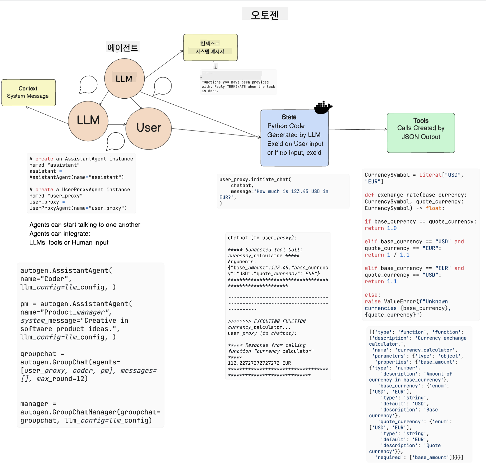

<!--
CO_OP_TRANSLATOR_METADATA:
{
  "original_hash": "11f03c81f190d9cbafd0f977dcbede6c",
  "translation_date": "2025-07-09T17:21:27+00:00",
  "source_file": "17-ai-agents/README.md",
  "language_code": "ko"
}
-->
[](https://aka.ms/gen-ai-lesson17-gh?WT.mc_id=academic-105485-koreyst)

## 소개

AI 에이전트는 생성 AI 분야에서 흥미로운 발전을 의미하며, 대형 언어 모델(LLM)이 단순한 조수에서 행동을 수행할 수 있는 에이전트로 진화할 수 있게 합니다. AI 에이전트 프레임워크는 개발자가 LLM에 도구와 상태 관리를 제공하는 애플리케이션을 만들 수 있도록 지원합니다. 또한 이러한 프레임워크는 LLM이 계획한 행동을 사용자와 개발자가 모니터링할 수 있게 하여 경험 관리를 향상시킵니다.

이번 수업에서는 다음 내용을 다룹니다:

- AI 에이전트란 무엇인가 - AI 에이전트의 정확한 정의는?
- 네 가지 AI 에이전트 프레임워크 탐구 - 각각의 특징은 무엇인가?
- 다양한 사용 사례에 AI 에이전트 적용하기 - 언제 AI 에이전트를 사용해야 할까?

## 학습 목표

이 수업을 마치면 다음을 할 수 있습니다:

- AI 에이전트가 무엇이며 어떻게 활용할 수 있는지 설명할 수 있습니다.
- 인기 있는 AI 에이전트 프레임워크 간의 차이점을 이해할 수 있습니다.
- AI 에이전트가 어떻게 작동하는지 이해하여 이를 활용한 애플리케이션을 개발할 수 있습니다.

## AI 에이전트란?

AI 에이전트는 생성 AI 분야에서 매우 흥미로운 영역입니다. 이 흥미로움과 함께 용어와 적용에 대한 혼란도 종종 발생합니다. 대부분의 AI 에이전트 도구를 포괄할 수 있도록 간단하게 다음과 같이 정의하겠습니다:

AI 에이전트는 대형 언어 모델(LLM)이 **상태(state)** 와 **도구(tools)** 에 접근할 수 있게 하여 작업을 수행할 수 있도록 합니다.


용어를 정의해 보겠습니다:

**대형 언어 모델** - 이 과정에서 다루는 GPT-3.5, GPT-4, Llama-2 등과 같은 모델들입니다.

**상태** - LLM이 작업하는 맥락을 의미합니다. LLM은 과거 행동과 현재 맥락을 참고하여 이후 행동을 결정합니다. AI 에이전트 프레임워크는 개발자가 이 맥락을 더 쉽게 관리할 수 있도록 돕습니다.

**도구** - 사용자가 요청하고 LLM이 계획한 작업을 완료하기 위해 필요한 도구들입니다. 예를 들어 데이터베이스, API, 외부 애플리케이션 또는 다른 LLM 등이 될 수 있습니다.

이 정의들이 앞으로 AI 에이전트가 어떻게 구현되는지 이해하는 데 도움이 되길 바랍니다. 이제 몇 가지 AI 에이전트 프레임워크를 살펴보겠습니다:

## LangChain Agents

[LangChain Agents](https://python.langchain.com/docs/how_to/#agents?WT.mc_id=academic-105485-koreyst)는 위에서 설명한 정의를 구현한 예입니다.

**상태** 관리를 위해 `AgentExecutor`라는 내장 기능을 사용합니다. 이 기능은 정의된 `agent`와 사용 가능한 `tools`를 인자로 받습니다.

`AgentExecutor`는 대화 기록도 저장하여 대화의 맥락을 제공합니다.


LangChain은 LLM이 접근할 수 있는 [도구 카탈로그](https://integrations.langchain.com/tools?WT.mc_id=academic-105485-koreyst)를 제공합니다. 이 도구들은 커뮤니티와 LangChain 팀이 제작한 것입니다.

이 도구들을 정의한 후 `AgentExecutor`에 전달할 수 있습니다.

가시성도 AI 에이전트에서 중요한 요소입니다. 애플리케이션 개발자가 LLM이 어떤 도구를 왜 사용하는지 이해하는 것이 중요합니다. 이를 위해 LangChain 팀은 LangSmith를 개발했습니다.

## AutoGen

다음으로 살펴볼 AI 에이전트 프레임워크는 [AutoGen](https://microsoft.github.io/autogen/?WT.mc_id=academic-105485-koreyst)입니다. AutoGen의 주요 초점은 대화입니다. 에이전트는 **대화 가능(conversable)** 하면서도 **사용자 정의(customizable)** 가능합니다.

**대화 가능(conversable)** - LLM들이 작업을 완료하기 위해 다른 LLM과 대화를 시작하고 이어갈 수 있습니다. 이는 `AssistantAgents`를 생성하고 특정 시스템 메시지를 부여함으로써 이루어집니다.

```python

autogen.AssistantAgent( name="Coder", llm_config=llm_config, ) pm = autogen.AssistantAgent( name="Product_manager", system_message="Creative in software product ideas.", llm_config=llm_config, )

```

**사용자 정의(customizable)** - 에이전트는 LLM뿐 아니라 사용자나 도구로도 정의할 수 있습니다. 개발자는 작업 완료를 위한 피드백을 사용자와 주고받는 역할을 하는 `UserProxyAgent`를 정의할 수 있습니다. 이 피드백은 작업을 계속 진행하거나 중단할 수 있습니다.

```python
user_proxy = UserProxyAgent(name="user_proxy")
```

### 상태와 도구

상태를 변경하고 관리하기 위해, 어시스턴트 에이전트는 작업을 완료하는 파이썬 코드를 생성합니다.

과정 예시는 다음과 같습니다:



#### 시스템 메시지로 정의된 LLM

```python
system_message="For weather related tasks, only use the functions you have been provided with. Reply TERMINATE when the task is done."
```

이 시스템 메시지는 특정 LLM에게 작업에 관련된 함수를 안내합니다. AutoGen에서는 서로 다른 시스템 메시지를 가진 여러 AssistantAgents를 정의할 수 있다는 점을 기억하세요.

#### 사용자가 대화를 시작함

```python
user_proxy.initiate_chat( chatbot, message="I am planning a trip to NYC next week, can you help me pick out what to wear? ", )

```

user_proxy(사람)로부터 온 이 메시지가 에이전트가 실행할 함수들을 탐색하는 과정을 시작합니다.

#### 함수 실행

```bash
chatbot (to user_proxy):

***** Suggested tool Call: get_weather ***** Arguments: {"location":"New York City, NY","time_periond:"7","temperature_unit":"Celsius"} ******************************************************** --------------------------------------------------------------------------------

>>>>>>>> EXECUTING FUNCTION get_weather... user_proxy (to chatbot): ***** Response from calling function "get_weather" ***** 112.22727272727272 EUR ****************************************************************

```

초기 대화가 처리되면, 에이전트는 호출할 도구(이 경우 `get_weather` 함수)를 제안합니다. 설정에 따라 이 함수는 자동으로 실행되어 에이전트가 결과를 읽거나, 사용자 입력에 따라 실행될 수 있습니다.

더 자세한 시작 방법은 [AutoGen 코드 샘플](https://microsoft.github.io/autogen/docs/Examples/?WT.mc_id=academic-105485-koreyst)을 참고하세요.

## Taskweaver

다음으로 살펴볼 에이전트 프레임워크는 [Taskweaver](https://microsoft.github.io/TaskWeaver/?WT.mc_id=academic-105485-koreyst)입니다. 이 프레임워크는 "코드 우선(code-first)" 에이전트로 알려져 있는데, 문자열(`strings`) 대신 파이썬의 DataFrame을 다룰 수 있습니다. 이는 데이터 분석 및 생성 작업에 매우 유용합니다. 예를 들어 그래프나 차트 생성, 무작위 수 생성 등이 가능합니다.

### 상태와 도구

대화 상태 관리를 위해 TaskWeaver는 `Planner` 개념을 사용합니다. `Planner`는 사용자의 요청을 받아 이를 수행하기 위한 작업들을 계획하는 LLM입니다.

작업을 완료하기 위해 `Planner`는 `Plugins`라 불리는 도구 모음에 접근합니다. 이 도구들은 파이썬 클래스나 일반 코드 인터프리터일 수 있습니다. 이 플러그인들은 임베딩으로 저장되어 LLM이 적절한 플러그인을 더 잘 검색할 수 있게 합니다.


다음은 이상 탐지를 처리하는 플러그인 예시입니다:

```python
class AnomalyDetectionPlugin(Plugin): def __call__(self, df: pd.DataFrame, time_col_name: str, value_col_name: str):
```

코드는 실행 전에 검증됩니다. Taskweaver에서 맥락 관리를 위한 또 다른 기능은 `experience`입니다. experience는 대화 맥락을 장기적으로 YAML 파일에 저장할 수 있게 하며, 이를 통해 LLM이 이전 대화를 학습하여 특정 작업에서 점차 성능을 향상시킬 수 있습니다.

## JARVIS

마지막으로 살펴볼 에이전트 프레임워크는 [JARVIS](https://github.com/microsoft/JARVIS?tab=readme-ov-file?WT.mc_id=academic-105485-koreyst)입니다. JARVIS의 독특한 점은 대화의 `state`를 관리하는 데 LLM을 사용하고, `tools`로는 다른 AI 모델들을 활용한다는 것입니다. 각 AI 모델은 객체 감지, 전사, 이미지 캡션 생성 등 특정 작업에 특화되어 있습니다.


범용 모델인 LLM은 사용자로부터 요청을 받고, 수행할 특정 작업과 필요한 인자/데이터를 식별합니다.

```python
[{"task": "object-detection", "id": 0, "dep": [-1], "args": {"image": "e1.jpg" }}]
```

LLM은 요청을 JSON과 같이 특화된 AI 모델이 해석할 수 있는 형식으로 변환합니다. AI 모델이 작업에 대한 예측을 반환하면, LLM이 그 응답을 받습니다.

작업 완료에 여러 모델이 필요할 경우, LLM은 각 모델의 응답을 해석한 후 이를 종합하여 사용자에게 최종 응답을 생성합니다.

아래 예시는 사용자가 사진 속 객체의 설명과 개수를 요청할 때 어떻게 작동하는지 보여줍니다:

## 과제

AI 에이전트 학습을 이어가기 위해 AutoGen으로 다음을 만들어 보세요:

- 교육 스타트업의 여러 부서가 참여하는 비즈니스 미팅을 시뮬레이션하는 애플리케이션
- LLM이 다양한 페르소나와 우선순위를 이해하도록 안내하는 시스템 메시지 생성, 사용자가 새로운 제품 아이디어를 제안할 수 있도록 지원
- 각 부서가 제안과 제품 아이디어를 다듬고 개선할 수 있도록 후속 질문을 생성하는 LLM

## 학습은 여기서 끝나지 않습니다, 여정을 계속하세요

이 수업을 마친 후에는 [Generative AI Learning collection](https://aka.ms/genai-collection?WT.mc_id=academic-105485-koreyst)을 확인하여 생성 AI 지식을 계속 확장해 보세요!

**면책 조항**:  
이 문서는 AI 번역 서비스 [Co-op Translator](https://github.com/Azure/co-op-translator)를 사용하여 번역되었습니다. 정확성을 위해 노력하고 있으나, 자동 번역에는 오류나 부정확한 부분이 있을 수 있음을 유의해 주시기 바랍니다. 원문은 해당 언어의 원본 문서가 권위 있는 출처로 간주되어야 합니다. 중요한 정보의 경우 전문적인 인간 번역을 권장합니다. 본 번역 사용으로 인해 발생하는 오해나 잘못된 해석에 대해 당사는 책임을 지지 않습니다.