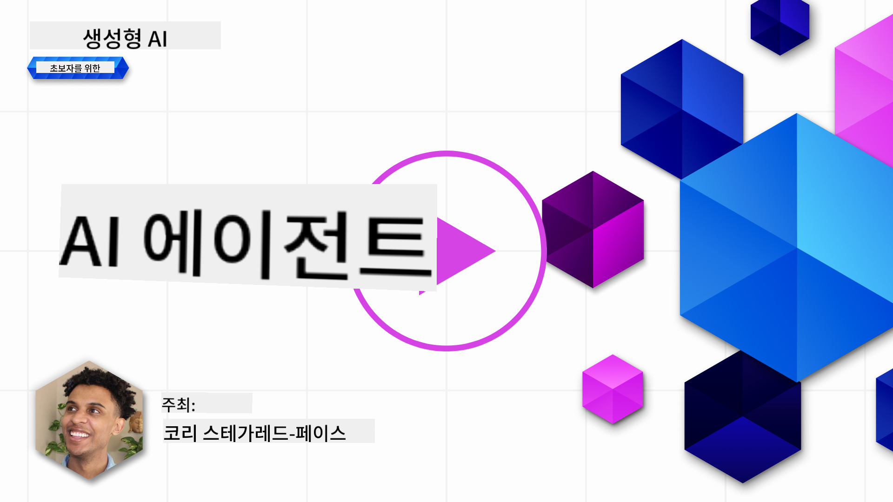
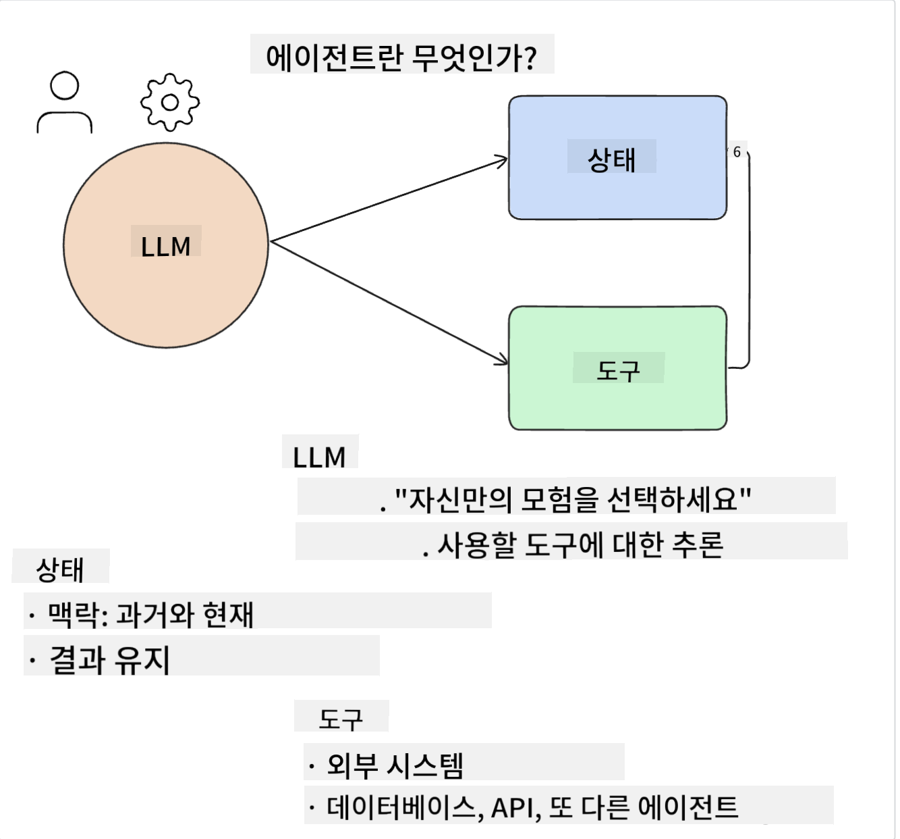
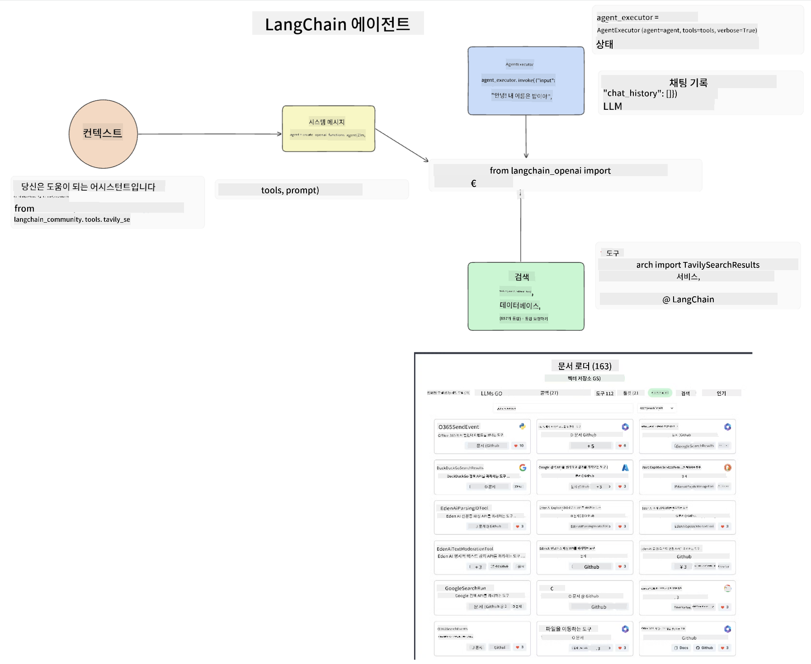

<!--
CO_OP_TRANSLATOR_METADATA:
{
  "original_hash": "8e8d1f6a63da606af7176a87ff8e92b6",
  "translation_date": "2025-10-18T00:07:36+00:00",
  "source_file": "17-ai-agents/README.md",
  "language_code": "ko"
}
-->
[](https://youtu.be/yAXVW-lUINc?si=bOtW9nL6jc3XJgOM)

## 소개

AI 에이전트는 생성형 AI의 흥미로운 발전을 대표하며, 대규모 언어 모델(LLM)이 단순한 보조 역할에서 벗어나 행동을 수행할 수 있는 에이전트로 진화할 수 있도록 합니다. AI 에이전트 프레임워크는 개발자가 LLM에 도구와 상태 관리를 제공하는 애플리케이션을 만들 수 있도록 하며, 사용자와 개발자가 LLM이 계획한 행동을 모니터링할 수 있는 가시성을 높여 경험 관리를 개선합니다.

이번 강의에서는 다음과 같은 내용을 다룹니다:

- AI 에이전트란 무엇인가? - AI 에이전트는 정확히 무엇인가?
- 네 가지 다른 AI 에이전트 프레임워크 탐구 - 각각의 독특한 점은 무엇인가?
- 다양한 사용 사례에 AI 에이전트 적용하기 - 언제 AI 에이전트를 사용해야 하는가?

## 학습 목표

이 강의를 수강한 후, 여러분은 다음을 할 수 있습니다:

- AI 에이전트가 무엇인지, 그리고 어떻게 사용할 수 있는지 설명할 수 있습니다.
- 인기 있는 AI 에이전트 프레임워크의 차이점을 이해하고, 그 차이점을 파악할 수 있습니다.
- AI 에이전트가 어떻게 작동하는지 이해하여 이를 활용한 애플리케이션을 구축할 수 있습니다.

## AI 에이전트란 무엇인가?

AI 에이전트는 생성형 AI 세계에서 매우 흥미로운 분야입니다. 이 흥미로움과 함께 용어와 그 적용에 대한 혼란이 종종 따릅니다. 대부분의 AI 에이전트를 지칭하는 도구를 간단하고 포괄적으로 이해하기 위해 다음과 같은 정의를 사용하겠습니다:

AI 에이전트는 대규모 언어 모델(LLM)이 **상태**와 **도구**에 접근하여 작업을 수행할 수 있도록 합니다.



이 용어들을 정의해 보겠습니다:

**대규모 언어 모델** - 이 강의에서 다루는 모델로 GPT-3.5, GPT-4, Llama-2 등이 있습니다.

**상태** - 이는 LLM이 작업하는 컨텍스트를 의미합니다. LLM은 과거 행동의 컨텍스트와 현재 컨텍스트를 사용하여 이후 행동을 결정하는 데 도움을 받습니다. AI 에이전트 프레임워크는 개발자가 이 컨텍스트를 더 쉽게 유지할 수 있도록 합니다.

**도구** - 사용자가 요청한 작업을 완료하고 LLM이 계획한 작업을 수행하려면 LLM이 도구에 접근할 수 있어야 합니다. 도구의 예로는 데이터베이스, API, 외부 애플리케이션 또는 다른 LLM 등이 있습니다.

이 정의는 앞으로 우리가 이들이 어떻게 구현되는지 살펴보는 데 있어 좋은 기초를 제공할 것입니다. 이제 몇 가지 다른 AI 에이전트 프레임워크를 살펴보겠습니다:

## LangChain 에이전트

[LangChain 에이전트](https://python.langchain.com/docs/how_to/#agents?WT.mc_id=academic-105485-koreyst)는 위에서 제공한 정의를 구현한 사례입니다.

**상태**를 관리하기 위해 `AgentExecutor`라는 내장 함수를 사용합니다. 이는 정의된 `agent`와 사용 가능한 `tools`를 수락합니다.

`AgentExecutor`는 또한 채팅 기록을 저장하여 채팅의 컨텍스트를 제공합니다.



LangChain은 LLM이 접근할 수 있는 [도구 카탈로그](https://integrations.langchain.com/tools?WT.mc_id=academic-105485-koreyst)를 제공합니다. 이는 커뮤니티와 LangChain 팀이 제작한 것입니다.

이 도구들을 정의한 후 `AgentExecutor`에 전달할 수 있습니다.

AI 에이전트에 대해 이야기할 때 가시성은 또 다른 중요한 측면입니다. 애플리케이션 개발자가 LLM이 어떤 도구를 사용하고 있는지, 그리고 그 이유를 이해하는 것이 중요합니다. 이를 위해 LangChain 팀은 LangSmith를 개발했습니다.

## AutoGen

다음으로 논의할 AI 에이전트 프레임워크는 [AutoGen](https://microsoft.github.io/autogen/?WT.mc_id=academic-105485-koreyst)입니다. AutoGen의 주요 초점은 대화입니다. 에이전트는 **대화 가능**하고 **맞춤화 가능**합니다.

**대화 가능 -** LLM은 작업을 완료하기 위해 다른 LLM과 대화를 시작하고 계속할 수 있습니다. 이는 `AssistantAgents`를 생성하고 특정 시스템 메시지를 제공함으로써 이루어집니다.

```python

autogen.AssistantAgent( name="Coder", llm_config=llm_config, ) pm = autogen.AssistantAgent( name="Product_manager", system_message="Creative in software product ideas.", llm_config=llm_config, )

```

**맞춤화 가능** - 에이전트는 LLM뿐만 아니라 사용자나 도구로 정의될 수 있습니다. 개발자는 `UserProxyAgent`를 정의하여 작업을 완료하기 위한 피드백을 사용자와 상호작용하며 받을 수 있습니다. 이 피드백은 작업 실행을 계속하거나 중단할 수 있습니다.

```python
user_proxy = UserProxyAgent(name="user_proxy")
```

### 상태와 도구

상태를 변경하고 관리하기 위해, AssistantAgent는 작업을 완료하기 위해 Python 코드를 생성합니다.

다음은 그 과정의 예입니다:


#### 시스템 메시지로 정의된 LLM

```python
system_message="For weather related tasks, only use the functions you have been provided with. Reply TERMINATE when the task is done."
```

이 시스템 메시지는 특정 LLM에게 작업에 적합한 기능을 지시합니다. AutoGen을 사용하면 서로 다른 시스템 메시지를 가진 여러 AssistantAgent를 정의할 수 있습니다.

#### 사용자에 의해 채팅 시작

```python
user_proxy.initiate_chat( chatbot, message="I am planning a trip to NYC next week, can you help me pick out what to wear? ", )

```

user_proxy(사람)로부터의 이 메시지는 에이전트가 실행해야 할 가능한 기능을 탐색하는 과정을 시작합니다.

#### 기능 실행

```bash
chatbot (to user_proxy):

***** Suggested tool Call: get_weather ***** Arguments: {"location":"New York City, NY","time_periond:"7","temperature_unit":"Celsius"} ******************************************************** --------------------------------------------------------------------------------

>>>>>>>> EXECUTING FUNCTION get_weather... user_proxy (to chatbot): ***** Response from calling function "get_weather" ***** 112.22727272727272 EUR ****************************************************************

```

초기 채팅이 처리되면 에이전트는 호출할 도구를 제안합니다. 이 경우, `get_weather`라는 함수입니다. 설정에 따라 이 함수는 에이전트에 의해 자동으로 실행되거나 사용자 입력에 따라 실행될 수 있습니다.

[AutoGen 코드 샘플](https://microsoft.github.io/autogen/docs/Examples/?WT.mc_id=academic-105485-koreyst)을 확인하여 빌드 시작 방법을 더 탐구할 수 있습니다.

## Taskweaver

다음으로 탐구할 에이전트 프레임워크는 [Taskweaver](https://microsoft.github.io/TaskWeaver/?WT.mc_id=academic-105485-koreyst)입니다. Taskweaver는 "코드 우선" 에이전트로 알려져 있으며, `문자열` 대신 Python의 DataFrame과 작업할 수 있습니다. 이는 데이터 분석 및 생성 작업에 매우 유용합니다. 예를 들어 그래프와 차트를 생성하거나 랜덤 숫자를 생성하는 작업 등이 있습니다.

### 상태와 도구

대화의 상태를 관리하기 위해 Taskweaver는 `Planner`라는 개념을 사용합니다. `Planner`는 사용자의 요청을 받아 이를 충족하기 위해 완료해야 할 작업을 매핑합니다.

작업을 완료하기 위해 `Planner`는 `Plugins`라는 도구 모음에 노출됩니다. 이는 Python 클래스나 일반 코드 인터프리터일 수 있습니다. 이 플러그인은 임베딩으로 저장되어 LLM이 올바른 플러그인을 더 잘 검색할 수 있도록 합니다.


다음은 이상 탐지를 처리하는 플러그인의 예입니다:

```python
class AnomalyDetectionPlugin(Plugin): def __call__(self, df: pd.DataFrame, time_col_name: str, value_col_name: str):
```

코드는 실행 전에 검증됩니다. Taskweaver에서 컨텍스트를 관리하는 또 다른 기능은 `experience`입니다. 경험은 대화의 컨텍스트를 YAML 파일에 장기적으로 저장할 수 있도록 합니다. 이를 구성하여 LLM이 이전 대화에 노출됨으로써 특정 작업에서 시간이 지남에 따라 개선될 수 있습니다.

## JARVIS

마지막으로 탐구할 에이전트 프레임워크는 [JARVIS](https://github.com/microsoft/JARVIS?tab=readme-ov-file?WT.mc_id=academic-105485-koreyst)입니다. JARVIS의 독특한 점은 대화의 `상태`를 관리하는 데 LLM을 사용하고, `도구`는 다른 AI 모델이라는 점입니다. 각 AI 모델은 객체 감지, 전사 또는 이미지 캡션 생성과 같은 특정 작업을 수행하는 전문 모델입니다.


LLM은 범용 모델로서 사용자의 요청을 받아 특정 작업과 이를 완료하는 데 필요한 인수/데이터를 식별합니다.

```python
[{"task": "object-detection", "id": 0, "dep": [-1], "args": {"image": "e1.jpg" }}]
```

LLM은 요청을 전문 AI 모델이 해석할 수 있는 형식(예: JSON)으로 포맷합니다. AI 모델이 작업에 따라 예측을 반환하면 LLM은 응답을 받습니다.

작업을 완료하기 위해 여러 모델이 필요한 경우, LLM은 해당 모델들의 응답을 해석한 후 이를 통합하여 사용자에게 응답을 생성합니다.

아래 예시는 사용자가 사진 속 객체의 설명과 개수를 요청했을 때의 작동 방식을 보여줍니다:

## 과제

AI 에이전트 학습을 계속하기 위해 AutoGen을 사용하여 다음을 구축할 수 있습니다:

- 교육 스타트업의 다양한 부서가 참여하는 비즈니스 회의를 시뮬레이션하는 애플리케이션.
- LLM이 서로 다른 페르소나와 우선순위를 이해하도록 안내하는 시스템 메시지를 생성하고, 사용자가 새로운 제품 아이디어를 제안할 수 있도록 합니다.
- LLM은 각 부서에서 후속 질문을 생성하여 제안과 제품 아이디어를 개선하고 정제합니다.

## 학습은 여기서 멈추지 않습니다, 여정을 계속하세요

이 강의를 완료한 후, [생성형 AI 학습 컬렉션](https://aka.ms/genai-collection?WT.mc_id=academic-105485-koreyst)을 확인하여 생성형 AI 지식을 계속 향상시키세요!

---

**면책 조항**:  
이 문서는 AI 번역 서비스 [Co-op Translator](https://github.com/Azure/co-op-translator)를 사용하여 번역되었습니다. 정확성을 위해 최선을 다하고 있지만, 자동 번역에는 오류나 부정확성이 포함될 수 있습니다. 원본 문서의 원어 버전을 권위 있는 출처로 간주해야 합니다. 중요한 정보의 경우, 전문적인 인간 번역을 권장합니다. 이 번역 사용으로 인해 발생하는 오해나 잘못된 해석에 대해 책임을 지지 않습니다.