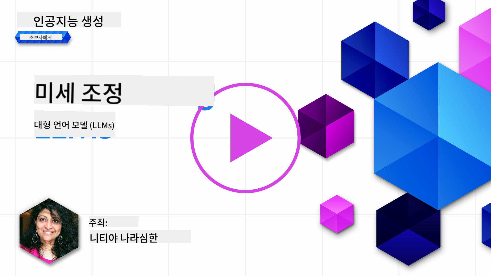
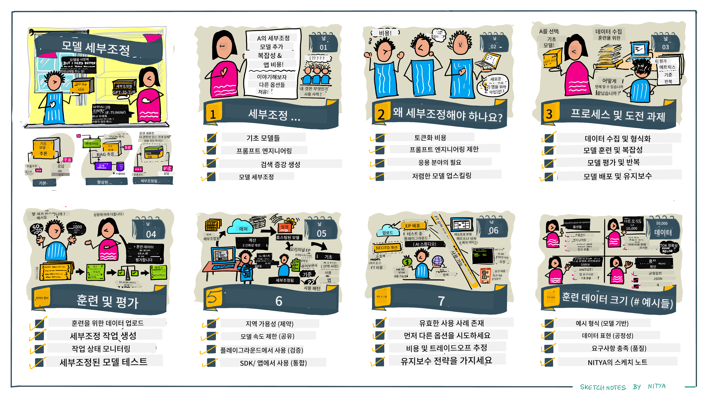

<!--
CO_OP_TRANSLATOR_METADATA:
{
  "original_hash": "68664f7e754a892ae1d8d5e2b7bd2081",
  "translation_date": "2025-05-20T07:40:58+00:00",
  "source_file": "18-fine-tuning/README.md",
  "language_code": "ko"
}
-->

# LLM 세부 조정하기

대형 언어 모델을 사용하여 생성적 AI 애플리케이션을 구축하는 데는 새로운 과제가 따릅니다. 핵심 문제는 주어진 사용자 요청에 대해 모델이 생성한 콘텐츠의 응답 품질(정확성 및 관련성)을 보장하는 것입니다. 이전 수업에서는 프롬프트 엔지니어링과 검색 증강 생성과 같은 기술을 논의했으며, 이는 기존 모델의 프롬프트 입력을 수정하여 문제를 해결하려고 합니다.

오늘 수업에서는 세 번째 기술인 **세부 조정**에 대해 논의합니다. 이는 추가 데이터를 사용하여 모델 자체를 재교육하여 문제를 해결하려고 합니다. 자세히 알아보겠습니다.

## 학습 목표

이 수업에서는 사전 훈련된 언어 모델에 대한 세부 조정의 개념을 소개하고, 이 접근 방식의 이점과 과제를 탐구하며, 생성적 AI 모델의 성능을 향상시키기 위해 세부 조정을 언제, 어떻게 사용할지에 대한 지침을 제공합니다.

이 수업이 끝날 때까지 다음 질문에 답할 수 있어야 합니다:

- 언어 모델에 대한 세부 조정이란 무엇인가요?
- 세부 조정이 언제, 왜 유용한가요?
- 사전 훈련된 모델을 어떻게 세부 조정할 수 있나요?
- 세부 조정의 한계는 무엇인가요?

준비되셨나요? 시작해봅시다.

## 삽화 가이드

본격적으로 시작하기 전에 다룰 내용을 전체적으로 파악하고 싶으신가요? 이 수업의 학습 여정을 설명하는 삽화 가이드를 확인하세요. 세부 조정의 핵심 개념과 동기를 배우는 것부터 세부 조정 작업을 수행하는 과정과 모범 사례를 이해하는 것까지. 탐구하기에 흥미로운 주제이니 [리소스](./RESOURCES.md?WT.mc_id=academic-105485-koreyst) 페이지를 확인하여 자기주도 학습 여정을 지원하는 추가 링크를 꼭 확인하세요!

## 언어 모델의 세부 조정이란 무엇인가요?

대형 언어 모델은 인터넷을 포함한 다양한 출처에서 가져온 대량의 텍스트로 _사전 훈련_됩니다. 이전 수업에서 배웠듯이, 우리는 사용자 질문("프롬프트")에 대한 모델 응답의 품질을 개선하기 위해 _프롬프트 엔지니어링_과 _검색 증강 생성_과 같은 기술이 필요합니다.

인기 있는 프롬프트 엔지니어링 기술은 모델에게 응답에서 기대되는 내용을 더 많이 안내하는 것으로, _명시적 지침_을 제공하거나 _몇 가지 예시를 제공_하는 것입니다. 이것은 _소수 샷 학습_이라고 하지만 두 가지 제한이 있습니다:

- 모델 토큰 제한은 제공할 수 있는 예시의 수를 제한하고 효과성을 제한할 수 있습니다.
- 모델 토큰 비용은 매 프롬프트에 예시를 추가하는 것을 비싸게 만들고 유연성을 제한할 수 있습니다.

세부 조정은 사전 훈련된 모델을 가져와 새로운 데이터로 재훈련하여 특정 작업에서 성능을 향상시키는 기계 학습 시스템의 일반적인 관행입니다. 언어 모델의 맥락에서 우리는 사전 훈련된 모델을 _특정 작업이나 애플리케이션 도메인에 대한 큐레이션된 예시 세트로_ 세부 조정하여 해당 작업이나 도메인에 대해 더 정확하고 관련성이 높은 **맞춤형 모델**을 만들 수 있습니다. 세부 조정의 부수적 이점은 소수 샷 학습에 필요한 예시 수를 줄여 토큰 사용량과 관련 비용을 줄일 수 있다는 것입니다.

## 언제 그리고 왜 모델을 세부 조정해야 할까요?

_이_ 맥락에서 세부 조정에 대해 이야기할 때, 우리는 **새로운 데이터 추가**로 **재교육**하는 **감독된** 세부 조정을 의미합니다. 이는 모델이 원래 데이터로 재교육되지만 다른 하이퍼파라미터를 사용하는 비감독 세부 조정 접근 방식과는 다릅니다.

기억해야 할 중요한 점은 세부 조정이 원하는 결과를 얻기 위해 일정 수준의 전문성이 필요한 고급 기술이라는 것입니다. 잘못 수행되면 기대되는 개선을 제공하지 않을 수 있으며, 목표 도메인에 대한 모델 성능을 저하시킬 수 있습니다.

따라서 언어 모델을 "어떻게" 세부 조정할지 배우기 전에 "왜" 이 경로를 선택해야 하는지, "언제" 세부 조정 과정을 시작해야 하는지 알아야 합니다. 다음 질문을 스스로에게 해보세요:

- **사용 사례**: 세부 조정의 _사용 사례_는 무엇인가요? 현재 사전 훈련된 모델의 어떤 측면을 개선하고 싶으신가요?
- **대안**: 원하는 결과를 달성하기 위해 _다른 기술_을 시도해 보셨나요? 비교를 위한 기준을 만들기 위해 사용하세요.
  - 프롬프트 엔지니어링: 관련 프롬프트 응답 예시로 소수 샷 프롬프트 기술을 시도하세요. 응답 품질을 평가하세요.
  - 검색 증강 생성: 데이터를 검색하여 얻은 쿼리 결과로 프롬프트를 증강해 보세요. 응답 품질을 평가하세요.
- **비용**: 세부 조정 비용을 파악하셨나요?
  - 조정 가능성 - 사전 훈련된 모델이 세부 조정 가능합니까?
  - 노력 - 훈련 데이터 준비, 모델 평가 및 세부 조정에 필요한 노력.
  - 컴퓨팅 - 세부 조정 작업 실행 및 세부 조정 모델 배포에 필요한 컴퓨팅.
  - 데이터 - 세부 조정 영향에 충분한 품질의 예시 접근 가능성.
- **이점**: 세부 조정의 이점을 확인하셨나요?
  - 품질 - 세부 조정된 모델이 기준 모델을 능가했나요?
  - 비용 - 프롬프트 간소화로 토큰 사용량을 줄일 수 있나요?
  - 확장성 - 기본 모델을 새로운 도메인에 재사용할 수 있나요?

이 질문에 답함으로써 세부 조정이 사용 사례에 적합한 접근 방식인지 결정할 수 있어야 합니다. 이상적으로, 접근 방식은 비용보다 이점이 클 때만 유효합니다. 진행하기로 결정했다면, 사전 훈련된 모델을 _어떻게_ 세부 조정할 수 있을지 생각해볼 때입니다.

결정 과정에 대한 더 많은 통찰을 얻고 싶으신가요? [세부 조정할지 말지](https://www.youtube.com/watch?v=0Jo-z-MFxJs)를 시청하세요.

## 사전 훈련된 모델을 어떻게 세부 조정할 수 있나요?

사전 훈련된 모델을 세부 조정하려면 다음이 필요합니다:

- 세부 조정할 사전 훈련된 모델
- 세부 조정에 사용할 데이터셋
- 세부 조정 작업을 실행할 훈련 환경
- 세부 조정된 모델을 배포할 호스팅 환경

## 세부 조정 실행

다음 리소스는 선택된 모델과 큐레이션된 데이터셋을 사용하여 실제 예제를 단계별로 안내하는 튜토리얼을 제공합니다. 이러한 튜토리얼을 진행하려면 특정 공급자에 계정이 필요하며, 관련 모델과 데이터셋에 대한 접근이 필요합니다.

| 공급자      | 튜토리얼                                                                                                                                                                        | 설명                                                                                                                                                                                                                                                                                                                                                                                                                         |
| ----------- | ------------------------------------------------------------------------------------------------------------------------------------------------------------------------------ | --------------------------------------------------------------------------------------------------------------------------------------------------------------------------------------------------------------------------------------------------------------------------------------------------------------------------------------------------------------------------------------------------------------------------- |
| OpenAI      | [챗 모델 세부 조정 방법](https://github.com/openai/openai-cookbook/blob/main/examples/How_to_finetune_chat_models.ipynb?WT.mc_id=academic-105485-koreyst)                      | 훈련 데이터를 준비하고, 세부 조정 작업을 실행하며, 세부 조정된 모델을 추론에 사용하는 특정 도메인("레시피 어시스턴트")에 대해 `gpt-35-turbo`을 세부 조정하는 방법을 배우세요.                                                                                                                                                                                                                                             |
| Azure OpenAI | [GPT 3.5 터보 세부 조정 튜토리얼](https://learn.microsoft.com/azure/ai-services/openai/tutorials/fine-tune?tabs=python-new%2Ccommand-line?WT.mc_id=academic-105485-koreyst) | 훈련 데이터를 생성 및 업로드하고, 세부 조정 작업을 실행하는 단계별로 **Azure에서** `gpt-35-turbo-0613` 모델을 세부 조정하는 방법을 배우세요. 새 모델을 배포하고 사용하세요.                                                                                                                                                                                                                                                 |
| Hugging Face | [Hugging Face로 LLM 세부 조정하기](https://www.philschmid.de/fine-tune-llms-in-2024-with-trl?WT.mc_id=academic-105485-koreyst)                                                 | 이 블로그 게시물은 [transformers](https://huggingface.co/docs/transformers/index?WT.mc_id=academic-105485-koreyst) 라이브러리 및 [Transformer Reinforcement Learning (TRL)](https://huggingface.co/docs/trl/index?WT.mc_id=academic-105485-koreyst])을 사용하여 Hugging Face의 오픈 [datasets](https://huggingface.co/docs/datasets/index?WT.mc_id=academic-105485-koreyst)에서 _오픈 LLM_ (예: `CodeLlama 7B`)을 세부 조정하는 과정을 안내합니다. |
|             |                                                                                                                                                                                |                                                                                                                                                                                                                                                                                                                                                                                                                             |
| 🤗 AutoTrain | [AutoTrain으로 LLM 세부 조정하기](https://github.com/huggingface/autotrain-advanced/?WT.mc_id=academic-105485-koreyst)                                                         | AutoTrain(또는 AutoTrain Advanced)는 Hugging Face에서 개발한 파이썬 라이브러리로, LLM 세부 조정을 포함한 다양한 작업에 대한 세부 조정을 허용합니다. AutoTrain은 코드 없는 솔루션이며, 세부 조정은 자체 클라우드, Hugging Face Spaces 또는 로컬에서 수행할 수 있습니다. 웹 기반 GUI, CLI 및 yaml 구성 파일을 통한 훈련을 모두 지원합니다.                                                                                   |
|             |                                                                                                                                                                                |                                                                                                                                                                                                                                                                                                                                                                                                                             |

## 과제

위의 튜토리얼 중 하나를 선택하여 진행하세요. _이 튜토리얼의 버전을 Jupyter 노트북에서 참조용으로 복제할 수 있습니다. 최신 버전을 얻으려면 원본 소스를 직접 사용하세요_.

## 훌륭한 작업! 학습을 계속하세요.

이 수업을 완료한 후, [Generative AI Learning 컬렉션](https://aka.ms/genai-collection?WT.mc_id=academic-105485-koreyst)을 확인하여 생성적 AI 지식을 계속 향상시키세요!

축하합니다!! 이 과정의 v2 시리즈의 마지막 수업을 완료했습니다! 학습과 구축을 멈추지 마세요. \*\*[리소스](RESOURCES.md?WT.mc_id=academic-105485-koreyst) 페이지를 확인하여 이 주제에 대한 추가 제안을 확인하세요.

v1 시리즈의 수업도 더 많은 과제와 개념으로 업데이트되었습니다. 지식을 새로고침하고 커뮤니티를 위해 이러한 수업을 개선하는 데 도움을 주시기 위해 [질문과 피드백](https://github.com/microsoft/generative-ai-for-beginners/issues?WT.mc_id=academic-105485-koreyst)을 공유해 주세요.

**면책 조항**:  
이 문서는 AI 번역 서비스 [Co-op Translator](https://github.com/Azure/co-op-translator)를 사용하여 번역되었습니다. 우리는 정확성을 위해 노력하지만, 자동 번역에는 오류나 부정확성이 있을 수 있음을 유의하시기 바랍니다. 원본 문서는 해당 언어로 작성된 문서를 권위 있는 자료로 간주해야 합니다. 중요한 정보에 대해서는 전문적인 인간 번역을 권장합니다. 이 번역 사용으로 인해 발생하는 오해나 잘못된 해석에 대해 책임을 지지 않습니다.