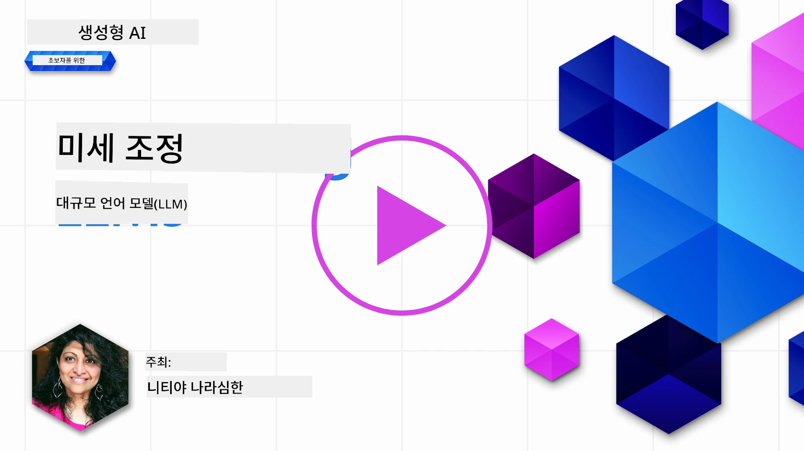
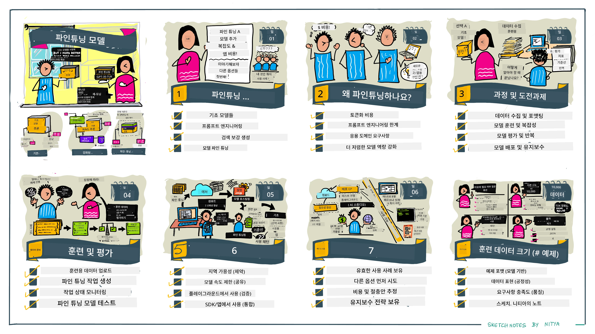

# LLM 미세 조정하기

대형 언어 모델을 사용해 생성 AI 애플리케이션을 구축할 때는 새로운 과제가 생깁니다. 핵심 문제는 모델이 주어진 사용자 요청에 대해 생성하는 내용의 응답 품질(정확성과 관련성)을 보장하는 것입니다. 이전 강의에서는 기존 모델에 대한 _프롬프트 입력 수정_을 통해 문제를 해결하려는 프롬프트 엔지니어링 및 검색 기반 생성 같은 기술을 다루었습니다.

오늘 강의에서는 세 번째 기술인 **미세 조정**을 논의합니다. 이는 _추가 데이터로 모델 자체를 재학습_함으로써 이 문제를 해결하려는 방법입니다. 자세히 살펴보겠습니다.

## 학습 목표

이 강의에서는 사전 학습된 언어 모델의 미세 조정 개념을 소개하고, 이 접근법의 이점과 과제를 탐구하며, 생성 AI 모델의 성능을 향상시키기 위해 언제 어떻게 미세 조정을 사용해야 하는지에 대한 지침을 제공합니다.

이 강의가 끝나면 다음 질문에 답할 수 있어야 합니다:

- 언어 모델 미세 조정이란 무엇인가?
- 언제, 왜 미세 조정이 유용한가?
- 사전 학습된 모델을 어떻게 미세 조정할 수 있는가?
- 미세 조정의 한계는 무엇인가?

준비됐나요? 시작해봅시다.

## 시각 안내서

본격적으로 시작하기 전에 전체 개요를 보고 싶나요? 이 시각 안내서는 미세 조정의 핵심 개념과 동기를 배우는 것부터, 미세 조정 작업을 수행하는 과정과 모범 사례를 이해하는 과정까지의 학습 여정을 설명합니다. 흥미로운 주제이니 꼭 [리소스](./RESOURCES.md?WT.mc_id=academic-105485-koreyst) 페이지도 확인해 추가 자료를 참고하며 자율 학습을 이어가세요!

## 언어 모델 미세 조정이란?

대형 언어 모델은 인터넷을 포함한 다양한 출처에서 수집한 대량의 텍스트로 _사전 학습_됩니다. 이전 강의에서 배웠듯, 사용자의 질문("프롬프트")에 대한 모델 응답 품질을 향상시키기 위해 _프롬프트 엔지니어링_과 _검색 보강 생성_과 같은 기술이 필요합니다.

대중적인 프롬프트 엔지니어링 기법 중 하나는 모델에게 명확한 _지침_ (명시적 안내)이나 _몇 가지 예시를 제공_ (암묵적 안내)해 응답에 대한 기대를 더 자세히 안내하는 것입니다. 이를 _Few-shot learning_이라 부르지만 두 가지 한계가 있습니다:

- 모델 토큰 제한으로 인해 제공 가능한 예시 수가 제한되어 효과가 떨어질 수 있습니다.
- 예시 추가로 인한 토큰 비용이 증가해 모든 프롬프트에 예시를 추가하는 데 비용과 유연성에 제약이 발생할 수 있습니다.

미세 조정은 사전 학습된 모델을 특정 작업에서 더 좋은 성능을 내도록 새로운 데이터로 다시 학습시키는 기계 학습에서 흔한 방법입니다. 언어 모델의 경우, 주어진 작업이나 응용 도메인에 맞는 _선별된 예시 집합_으로 사전 학습된 모델을 미세 조정하여 해당 작업이나 도메인에 더 정확하고 관련성 높은 **맞춤 모델**을 만들 수 있습니다. 부수적 이점으로, 미세 조정은 Few-shot learning에 필요한 예시 수를 줄여 토큰 사용량과 비용도 줄일 수 있습니다.

## 언제, 왜 모델을 미세 조정해야 하나요?

여기서 말하는 미세 조정은 원래 학습 데이터셋에 포함되지 않은 **새 데이터**를 추가하여 다시 학습하는 **감독(supervised) 미세 조정**을 의미합니다. 이는 원래 데이터에 대해 하이퍼파라미터만 다르게 설정해 재학습하는 비감독 미세 조정과 다릅니다.

중요한 점은 미세 조정이 원하는 결과를 얻기 위해 일정 수준의 전문 지식이 필요한 고급 기술이라는 것입니다. 잘못 수행하면 예상한 개선 효과가 없거나, 대상 도메인에서 모델 성능이 나빠질 수도 있습니다.

따라서 "언제"와 "왜" 미세 조정할지 명확히 알고 시작하는 것이 중요합니다. 우선 아래 질문들에 답해보세요:

- **사용 사례**: 미세 조정을 하려는 _사용 사례_는 무엇인가요? 현재 사전 학습 모델에서 어떤 점을 개선하고 싶은가요?
- **대안**: 원하는 결과를 얻기 위해 _다른 기술_을 시도해 보았나요? 이를 비교 기준으로 삼으세요.
  - 프롬프트 엔지니어링: 관련 응답 예시를 포함한 few-shot prompting 같은 기법 시도 후 응답 품질 평가
  - 검색 보강 생성: 데이터에서 검색 결과를 프롬프트에 추가해 응답 품질 평가
- **비용**: 미세 조정에 따른 비용을 파악했나요?
  - 조정 가능성 - 사전 학습 모델이 미세 조정 가능한가?
  - 노력 - 학습 데이터 준비, 모델 평가 및 개선에 필요한 노력
  - 연산 자원 - 미세 조정 작업 실행 및 조정된 모델 배포에 필요한 컴퓨팅 자원
  - 데이터 - 미세 조정 효과를 낼 충분한 양질의 예시에 접근 가능 여부
- **이점**: 미세 조정의 이점을 확인했나요?
  - 품질 - 미세 조정된 모델이 기준선을 뛰어넘었나?
  - 비용 - 프롬프트 단순화로 토큰 사용이 줄었는가?
  - 확장성 - 기저 모델을 새로운 도메인에 재사용할 수 있는가?

이 질문들에 답해 미세 조정이 사용 사례에 적합한지 판단하세요. 이상적으로는 이점이 비용을 넘어서야 합니다. 미세 조정을 하기로 결정했다면, 이제 _어떻게_ 미세 조정할지를 고민할 차례입니다.

결정 과정에 대해 더 알아보고 싶다면 [To fine-tune or not to fine-tune](https://www.youtube.com/watch?v=0Jo-z-MFxJs)를 시청하세요.

## 사전 학습 모델은 어떻게 미세 조정하나요?

사전 학습 모델을 미세 조정하려면 다음이 필요합니다:

- 미세 조정할 사전 학습 모델
- 미세 조정에 사용할 데이터셋
- 미세 조정 작업을 실행할 훈련 환경
- 미세 조정된 모델을 배포할 호스팅 환경

## 미세 조정 실습

아래 리소스들은 선별된 모델과 데이터셋을 사용한 실제 예제를 단계별로 안내하는 튜토리얼입니다. 튜토리얼을 따라 하려면 해당 제공자의 계정과 모델 및 데이터셋 접근 권한이 필요합니다.

| 공급자       | 튜토리얼                                                                                                                                                                                 | 설명                                                                                                                                                                                                                                                                                                                                                                                                                              |
| ------------ | ---------------------------------------------------------------------------------------------------------------------------------------------------------------------------------------- | --------------------------------------------------------------------------------------------------------------------------------------------------------------------------------------------------------------------------------------------------------------------------------------------------------------------------------------------------------------------------------------------------------------------------------- |
| OpenAI       | [챗 모델 미세 조정 방법](https://github.com/openai/openai-cookbook/blob/main/examples/How_to_finetune_chat_models.ipynb?WT.mc_id=academic-105485-koreyst)                                   | 특정 도메인("레시피 보조")에 맞춰 `gpt-35-turbo`를 미세 조정하는 방법 학습. 학습 데이터 준비, 미세 조정 작업 실행, 미세 조정 모델 추론에 활용하는 과정을 포함.                                                                                                                                                                                                                                                                    |
| Azure OpenAI | [GPT 3.5 Turbo 미세 조정 튜토리얼](https://learn.microsoft.com/azure/ai-services/openai/tutorials/fine-tune?tabs=python-new%2Ccommand-line&WT.mc_id=academic-105485-koreyst)                | **Azure에서** `gpt-35-turbo-0613` 모델을 미세 조정하는 방법 학습. 학습 데이터 생성 및 업로드, 미세 조정 작업 실행, 모델 배포 및 활용 과정 포함.                                                                                                                                                                                                                                                                                   |
| Hugging Face | [Hugging Face로 LLM 미세 조정](https://www.philschmid.de/fine-tune-llms-in-2024-with-trl?WT.mc_id=academic-105485-koreyst)                                                                 | [transformers](https://huggingface.co/docs/transformers/index?WT.mc_id=academic-105485-koreyst) 라이브러리와 [Transformer Reinforcement Learning (TRL)](https://huggingface.co/docs/trl/index?WT.mc_id=academic-105485-koreyst)을 사용해 오픈 LLM(예: `CodeLlama 7B`)을 미세 조정하는 블로그 게시물. 오픈 [데이터셋](https://huggingface.co/docs/datasets/index?WT.mc_id=academic-105485-koreyst) 활용.                                                                                                                                         |
|              |                                                                                                                                                                                          |                                                                                                                                                                                                                                                                                                                                                                                                                                   |
| 🤗 AutoTrain | [AutoTrain을 이용한 LLM 미세 조정](https://github.com/huggingface/autotrain-advanced/?WT.mc_id=academic-105485-koreyst)                                                                  | Hugging Face가 개발한 파이썬 라이브러리 AutoTrain (또는 AutoTrain Advanced)은 다양한 작업에 대해 미세 조정이 가능하며, LLM 미세 조정도 지원. 코드 작성 없이 미세 조정할 수 있고, 자체 클라우드, Hugging Face Spaces 또는 로컬 환경에서 실행 가능. 웹 GUI, CLI, yaml 구성 파일 방식 모두 지원.                                                                                                                                                                   |
|              |                                                                                                                                                                                          |                                                                                                                                                                                                                                                                                                                                                                                                                                   |
| 🦥 Unsloth    | [Unsloth를 이용한 LLM 미세 조정](https://github.com/unslothai/unsloth)                                                                                                                   | Unsloth는 LLM 미세 조정과 강화 학습(RL)을 지원하는 오픈 소스 프레임워크. 로컬 훈련, 평가, 배포를 위한 [노트북](https://github.com/unslothai/notebooks)을 제공하며, TTS, BERT, 멀티모달 모델도 지원. 시작하려면 [미세 조정 가이드](https://docs.unsloth.ai/get-started/fine-tuning-llms-guide)를 단계별로 읽어보세요.                                                                                                                                                        |
|              |                                                                                                                                                                                          |                                                                                                                                                                                                                                                                                                                                                                                                                                   |
## 과제

위 튜토리얼 중 하나를 선택해 따라 해보세요. _참고용으로 이 저장소 내 Jupyter Notebook에 일부 튜토리얼 버전을 복제할 수 있으나, 최신 버전을 위해 원본 소스를 직접 활용하시기 바랍니다_.

## 훌륭해요! 학습을 이어가세요.

이 강의를 마쳤으면 [생성 AI 학습 컬렉션](https://aka.ms/genai-collection?WT.mc_id=academic-105485-koreyst)을 확인해 생성 AI 지식을 계속 향상시키세요!

축하합니다!! 이 과정의 v2 시리즈 마지막 강의를 완료했습니다! 학습과 개발을 멈추지 마세요. \*\*[리소스](RESOURCES.md?WT.mc_id=academic-105485-koreyst) 페이지에서 이 주제에 대한 추가 제안 목록을 확인할 수 있습니다.

v1 시리즈 강의도 과제와 개념이 업데이트 되어 있으니, 잠깐 시간을 내어 복습해 보세요. 그리고 [질문과 피드백](https://github.com/microsoft/generative-ai-for-beginners/issues?WT.mc_id=academic-105485-koreyst)을 공유해주시어 이 강의를 커뮤니티를 위해 더 나은 방향으로 개선하는 데 도움을 주세요.

---

<!-- CO-OP TRANSLATOR DISCLAIMER START -->
**면책 조항**:  
이 문서는 AI 번역 서비스 [Co-op Translator](https://github.com/Azure/co-op-translator)를 사용하여 번역되었습니다. 정확성을 위해 최선을 다하고 있으나, 자동 번역에는 오류나 부정확한 내용이 포함될 수 있음을 알려드립니다. 원본 문서가 권위 있는 출처로 간주되어야 합니다. 중요한 정보의 경우, 전문 인간 번역을 권장합니다. 본 번역 사용으로 인해 발생하는 어떠한 오해나 오해석에 대해서도 당사는 책임을 지지 않습니다.
<!-- CO-OP TRANSLATOR DISCLAIMER END -->