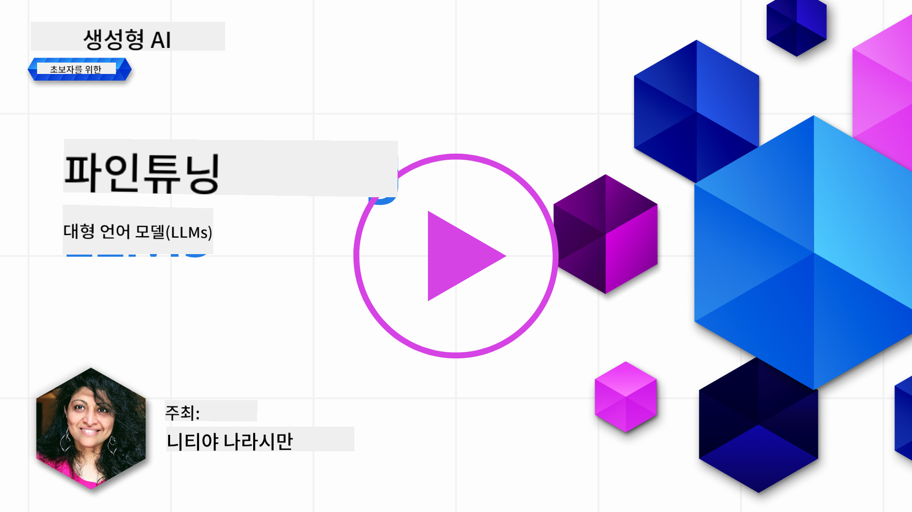

<!--
CO_OP_TRANSLATOR_METADATA:
{
  "original_hash": "68664f7e754a892ae1d8d5e2b7bd2081",
  "translation_date": "2025-07-09T17:38:32+00:00",
  "source_file": "18-fine-tuning/README.md",
  "language_code": "ko"
}
-->

# LLM 미세 조정하기

대형 언어 모델을 사용해 생성 AI 애플리케이션을 구축할 때는 새로운 도전 과제가 생깁니다. 핵심 문제는 주어진 사용자 요청에 대해 모델이 생성하는 콘텐츠의 응답 품질(정확성과 적합성)을 보장하는 것입니다. 이전 강의에서는 기존 모델에 대한 _프롬프트 입력을 수정하는_ 방식으로 문제를 해결하려는 프롬프트 엔지니어링과 검색 보강 생성 같은 기법을 다뤘습니다.

오늘 강의에서는 세 번째 기법인 **미세 조정(fine-tuning)** 에 대해 이야기합니다. 이는 _추가 데이터를 사용해 모델 자체를 재학습_ 시켜 문제를 해결하려는 방법입니다. 자세히 살펴보겠습니다.

## 학습 목표

이번 강의에서는 사전 학습된 언어 모델의 미세 조정 개념을 소개하고, 이 접근법의 장점과 한계를 탐구하며, 생성 AI 모델의 성능을 향상시키기 위해 언제 어떻게 미세 조정을 활용할지 안내합니다.

강의를 마치면 다음 질문에 답할 수 있어야 합니다:

- 언어 모델의 미세 조정이란 무엇인가?
- 언제, 왜 미세 조정이 유용한가?
- 사전 학습된 모델을 어떻게 미세 조정할 수 있나?
- 미세 조정의 한계는 무엇인가?

준비되었나요? 시작해봅시다.

## 그림으로 보는 가이드

본격적으로 시작하기 전에 이번 강의에서 다룰 내용을 한눈에 보고 싶나요? 미세 조정의 핵심 개념과 동기부터 미세 조정 작업의 과정과 모범 사례까지 학습 여정을 설명하는 그림 가이드를 확인해보세요. 흥미로운 주제이니, 자기 주도 학습을 지원하는 추가 링크가 있는 [Resources](./RESOURCES.md?WT.mc_id=academic-105485-koreyst) 페이지도 꼭 참고하세요!

## 언어 모델의 미세 조정이란?

대형 언어 모델은 인터넷을 포함한 다양한 출처에서 수집한 방대한 텍스트로 _사전 학습_ 되어 있습니다. 이전 강의에서 배웠듯이, 사용자의 질문("프롬프트")에 대한 모델 응답 품질을 높이기 위해 _프롬프트 엔지니어링_과 _검색 보강 생성_ 같은 기법이 필요합니다.

프롬프트 엔지니어링의 인기 기법 중 하나는 모델에게 응답에 기대하는 바를 더 명확히 안내하는 것입니다. 이는 _명시적 지침_을 제공하거나 _몇 가지 예시_를 보여주는(암묵적 지침) 방식으로, 이를 _few-shot learning_이라 부릅니다. 하지만 두 가지 한계가 있습니다:

- 모델의 토큰 제한 때문에 제공할 수 있는 예시 수가 제한되고, 효과가 떨어질 수 있습니다.
- 매 프롬프트마다 예시를 추가하면 토큰 비용이 높아져 비용 부담과 유연성 제한이 생깁니다.

미세 조정은 머신러닝 시스템에서 흔히 쓰이는 방법으로, 사전 학습된 모델을 특정 작업에 맞게 새로운 데이터로 재학습시켜 성능을 개선하는 것입니다. 언어 모델의 경우, 특정 작업이나 응용 분야에 맞춘 _선별된 예시 집합_으로 사전 학습 모델을 미세 조정해, 해당 작업이나 분야에 더 정확하고 적합한 **맞춤형 모델**을 만들 수 있습니다. 부가적으로, 미세 조정은 few-shot learning에 필요한 예시 수를 줄여 토큰 사용량과 비용을 절감하는 효과도 있습니다.

## 언제, 왜 모델을 미세 조정해야 할까?

여기서 말하는 미세 조정은 원래 학습 데이터에 포함되지 않은 **새로운 데이터를 추가해 재학습하는 감독 학습(supervised) 미세 조정**을 의미합니다. 이는 원본 데이터로 하이퍼파라미터만 바꿔 재학습하는 비감독 학습(unsupervised) 미세 조정과는 다릅니다.

중요한 점은 미세 조정이 원하는 결과를 얻기 위해 일정 수준의 전문 지식이 필요한 고급 기법이라는 것입니다. 잘못 수행하면 기대한 개선 효과가 없거나, 오히려 대상 도메인에서 모델 성능이 저하될 수 있습니다.

따라서 "어떻게" 미세 조정할지 배우기 전에, 왜 이 방법을 선택해야 하는지, 언제 미세 조정을 시작해야 하는지 먼저 알아야 합니다. 다음 질문을 스스로에게 던져보세요:

- **사용 사례**: 미세 조정을 하려는 _사용 사례_는 무엇인가? 현재 사전 학습 모델의 어떤 부분을 개선하고 싶은가?
- **대안**: 원하는 결과를 얻기 위해 _다른 기법_을 시도해봤는가? 이를 기준선으로 삼아 비교해보자.
  - 프롬프트 엔지니어링: 관련 예시를 포함한 few-shot 프롬프트 기법을 시도해보고 응답 품질을 평가해보자.
  - 검색 보강 생성: 데이터 검색 결과를 프롬프트에 추가해보고 응답 품질을 평가해보자.
- **비용**: 미세 조정에 드는 비용을 파악했는가?
  - 조정 가능성 - 사전 학습 모델이 미세 조정 가능한가?
  - 노력 - 학습 데이터 준비, 모델 평가 및 개선에 필요한 노력
  - 컴퓨팅 - 미세 조정 작업 실행과 미세 조정 모델 배포에 필요한 자원
  - 데이터 - 미세 조정 효과를 낼 수 있는 충분한 품질의 예시 확보 여부
- **이점**: 미세 조정의 이점을 확인했는가?
  - 품질 - 미세 조정 모델이 기준선 모델보다 성능이 뛰어난가?
  - 비용 - 프롬프트를 단순화해 토큰 사용량을 줄일 수 있는가?
  - 확장성 - 기본 모델을 새로운 도메인에 재활용할 수 있는가?

이 질문들에 답하면 미세 조정이 적합한지 판단할 수 있습니다. 이상적으로는 이점이 비용을 상회할 때만 미세 조정이 타당합니다. 진행하기로 결정했다면, 이제 사전 학습 모델을 _어떻게_ 미세 조정할지 고민할 차례입니다.

결정 과정에 대한 더 많은 인사이트가 필요하다면 [To fine-tune or not to fine-tune](https://www.youtube.com/watch?v=0Jo-z-MFxJs) 영상을 참고하세요.

## 사전 학습 모델을 어떻게 미세 조정할 수 있나?

사전 학습 모델을 미세 조정하려면 다음이 필요합니다:

- 미세 조정할 사전 학습 모델
- 미세 조정에 사용할 데이터셋
- 미세 조정 작업을 실행할 학습 환경
- 미세 조정된 모델을 배포할 호스팅 환경

## 미세 조정 실습

아래 리소스들은 선별된 데이터셋과 특정 모델을 사용해 실제 예제를 단계별로 안내하는 튜토리얼입니다. 이 튜토리얼을 따라 하려면 해당 제공자의 계정과 관련 모델 및 데이터셋에 대한 접근 권한이 필요합니다.

| 제공자       | 튜토리얼                                                                                                                                                                       | 설명                                                                                                                                                                                                                                                                                                                                                                                                                              |
| ------------ | ------------------------------------------------------------------------------------------------------------------------------------------------------------------------------ | --------------------------------------------------------------------------------------------------------------------------------------------------------------------------------------------------------------------------------------------------------------------------------------------------------------------------------------------------------------------------------------------------------------------------------- |
| OpenAI       | [How to fine-tune chat models](https://github.com/openai/openai-cookbook/blob/main/examples/How_to_finetune_chat_models.ipynb?WT.mc_id=academic-105485-koreyst)                | `gpt-35-turbo` 모델을 특정 도메인("레시피 어시스턴트")에 맞게 미세 조정하는 방법을 배웁니다. 학습 데이터 준비, 미세 조정 작업 실행, 미세 조정 모델을 사용한 추론 과정을 다룹니다.                                                                                                                                                                                                                                            |
| Azure OpenAI | [GPT 3.5 Turbo fine-tuning tutorial](https://learn.microsoft.com/azure/ai-services/openai/tutorials/fine-tune?tabs=python-new%2Ccommand-line?WT.mc_id=academic-105485-koreyst) | Azure 환경에서 `gpt-35-turbo-0613` 모델을 미세 조정하는 방법을 배웁니다. 학습 데이터 생성 및 업로드, 미세 조정 작업 실행, 새 모델 배포 및 사용 단계를 포함합니다.                                                                                                                                                                                                                                                             |
| Hugging Face | [Fine-tuning LLMs with Hugging Face](https://www.philschmid.de/fine-tune-llms-in-2024-with-trl?WT.mc_id=academic-105485-koreyst)                                               | 오픈 LLM(예: `CodeLlama 7B`)을 [transformers](https://huggingface.co/docs/transformers/index?WT.mc_id=academic-105485-koreyst) 라이브러리와 [Transformer Reinforcement Learning (TRL)](https://huggingface.co/docs/trl/index?WT.mc_id=academic-105485-koreyst)으로 미세 조정하는 과정을 다룹니다. Hugging Face의 공개 [데이터셋](https://huggingface.co/docs/datasets/index?WT.mc_id=academic-105485-koreyst)도 활용합니다. |
|              |                                                                                                                                                                                |                                                                                                                                                                                                                                                                                                                                                                                                                                   |
| 🤗 AutoTrain | [Fine-tuning LLMs with AutoTrain](https://github.com/huggingface/autotrain-advanced/?WT.mc_id=academic-105485-koreyst)                                                         | AutoTrain(또는 AutoTrain Advanced)은 Hugging Face에서 개발한 파이썬 라이브러리로, 다양한 작업에 대해 LLM 미세 조정을 지원합니다. 코드 작성 없이도 미세 조정이 가능하며, 클라우드, Hugging Face Spaces, 로컬 환경에서 실행할 수 있습니다. 웹 기반 GUI, CLI, yaml 구성 파일을 통한 학습도 지원합니다.                                                                                                                        |
|              |                                                                                                                                                                                |                                                                                                                                                                                                                                                                                                                                                                                                                                   |

## 과제

위 튜토리얼 중 하나를 선택해 따라 해보세요. _이 저장소 내 Jupyter Notebook 버전으로 참고용 복제본을 제공할 수 있으나, 최신 버전은 반드시 원본 소스를 직접 이용하시기 바랍니다_.

## 수고하셨습니다! 학습을 계속하세요.

이번 강의를 마친 후에는 [Generative AI Learning collection](https://aka.ms/genai-collection?WT.mc_id=academic-105485-koreyst)에서 생성 AI 지식을 계속 확장해보세요!

축하합니다!! 이 과정의 v2 시리즈 마지막 강의를 완료하셨습니다! 학습과 개발을 멈추지 마세요. \*\*이번 주제에 관한 추가 제안 목록은 [RESOURCES](RESOURCES.md?WT.mc_id=academic-105485-koreyst) 페이지에서 확인할 수 있습니다.

또한 v1 시리즈 강의도 과제와 개념이 업데이트되었습니다. 잠시 시간을 내어 지식을 새롭게 다져보시고, [질문과 피드백](https://github.com/microsoft/generative-ai-for-beginners/issues?WT.mc_id=academic-105485-koreyst)을 공유해 주시면 커뮤니티를 위한 강의 개선에 큰 도움이 됩니다.

**면책 조항**:  
이 문서는 AI 번역 서비스 [Co-op Translator](https://github.com/Azure/co-op-translator)를 사용하여 번역되었습니다. 정확성을 위해 최선을 다하고 있으나, 자동 번역에는 오류나 부정확한 부분이 있을 수 있음을 유의해 주시기 바랍니다. 원문은 해당 언어의 원본 문서가 권위 있는 출처로 간주되어야 합니다. 중요한 정보의 경우 전문적인 인간 번역을 권장합니다. 본 번역 사용으로 인해 발생하는 오해나 잘못된 해석에 대해 당사는 책임을 지지 않습니다.