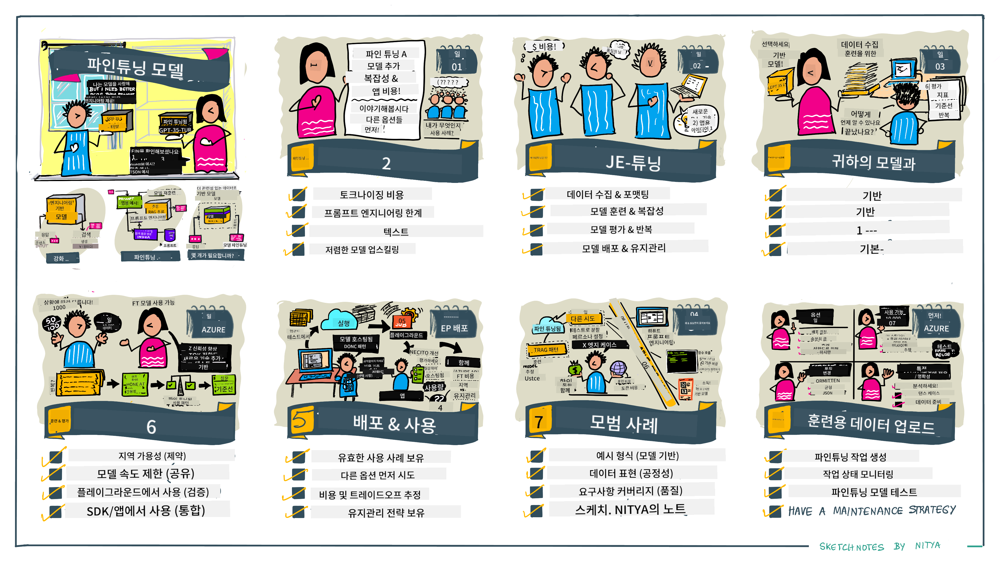

<!--
CO_OP_TRANSLATOR_METADATA:
{
  "original_hash": "807f0d9fc1747e796433534e1be6a98a",
  "translation_date": "2025-10-18T00:05:06+00:00",
  "source_file": "18-fine-tuning/README.md",
  "language_code": "ko"
}
-->

# LLM 미세 조정하기

대규모 언어 모델을 사용하여 생성형 AI 애플리케이션을 구축하는 데는 새로운 과제가 따릅니다. 주요 문제는 특정 사용자 요청에 대해 모델이 생성한 콘텐츠의 응답 품질(정확성과 관련성)을 보장하는 것입니다. 이전 강의에서는 기존 모델의 프롬프트 입력을 수정하여 문제를 해결하려는 프롬프트 엔지니어링 및 검색 증강 생성과 같은 기술에 대해 논의했습니다.

오늘 강의에서는 세 번째 기술인 **미세 조정**에 대해 논의합니다. 이는 추가 데이터를 사용하여 모델 자체를 재훈련함으로써 문제를 해결하려는 접근 방식입니다. 자세히 알아보겠습니다.

## 학습 목표

이 강의에서는 사전 학습된 언어 모델에 대한 미세 조정 개념을 소개하고, 이 접근 방식의 이점과 과제를 탐구하며, 생성형 AI 모델의 성능을 개선하기 위해 미세 조정을 언제, 어떻게 사용할지에 대한 지침을 제공합니다.

이 강의를 마치면 다음 질문에 답할 수 있어야 합니다:

- 언어 모델의 미세 조정이란 무엇인가요?
- 미세 조정이 언제, 왜 유용한가요?
- 사전 학습된 모델을 어떻게 미세 조정할 수 있나요?
- 미세 조정의 한계는 무엇인가요?

준비되셨나요? 시작해봅시다.

## 그림으로 보는 가이드

본격적으로 시작하기 전에 다룰 내용을 한눈에 보고 싶으신가요? 이 강의의 학습 여정을 설명하는 그림 가이드를 확인해보세요. 미세 조정의 핵심 개념과 동기를 배우는 것부터, 미세 조정 작업을 실행하기 위한 프로세스와 모범 사례를 이해하는 것까지 다룹니다. 탐구하기에 흥미로운 주제이니, [리소스](./RESOURCES.md?WT.mc_id=academic-105485-koreyst) 페이지를 확인하여 자기 주도 학습 여정을 지원하는 추가 링크를 놓치지 마세요!

## 언어 모델의 미세 조정이란 무엇인가요?

대규모 언어 모델은 정의상 인터넷을 포함한 다양한 출처에서 대량의 텍스트로 _사전 학습_됩니다. 이전 강의에서 배운 것처럼, 사용자의 질문("프롬프트")에 대한 모델 응답의 품질을 개선하기 위해 _프롬프트 엔지니어링_ 및 _검색 증강 생성_과 같은 기술이 필요합니다.

프롬프트 엔지니어링의 인기 있는 기술은 모델에 명시적 지침을 제공하거나 몇 가지 예제를 제공하여 응답에서 기대되는 내용을 더 잘 이해하도록 돕는 것입니다. 이를 _few-shot 학습_이라고 하지만, 두 가지 한계가 있습니다:

- 모델 토큰 제한으로 인해 제공할 수 있는 예제 수가 제한되고 효과가 제한됩니다.
- 모델 토큰 비용으로 인해 모든 프롬프트에 예제를 추가하는 것이 비싸고 유연성이 제한됩니다.

미세 조정은 사전 학습된 모델을 가져와 새로운 데이터로 재훈련하여 특정 작업에서 성능을 개선하는 머신 러닝 시스템에서 일반적인 관행입니다. 언어 모델의 경우, 특정 작업이나 애플리케이션 도메인에 대한 예제를 신중히 선별하여 사전 학습된 모델을 _재훈련_함으로써 해당 작업이나 도메인에 대해 더 정확하고 관련성이 높은 **맞춤형 모델**을 만들 수 있습니다. 미세 조정의 부수적인 이점은 few-shot 학습에 필요한 예제 수를 줄여 토큰 사용량과 관련 비용을 줄일 수 있다는 점입니다.

## 모델을 언제, 왜 미세 조정해야 하나요?

이 문맥에서 우리가 말하는 미세 조정은 **지도 학습** 미세 조정을 의미하며, 이는 원래 학습 데이터 세트에 포함되지 않은 **새로운 데이터 추가**를 통해 재훈련을 수행하는 것입니다. 이는 원래 데이터를 사용하지만 다른 하이퍼파라미터로 모델을 재훈련하는 비지도 학습 미세 조정 접근 방식과는 다릅니다.

기억해야 할 핵심은 미세 조정이 원하는 결과를 얻기 위해 일정 수준의 전문 지식이 필요한 고급 기술이라는 점입니다. 잘못 수행되면 기대했던 개선을 제공하지 못할 수 있으며, 목표 도메인에 대한 모델 성능을 저하시킬 수도 있습니다.

따라서 언어 모델을 "어떻게" 미세 조정할지 배우기 전에 "왜" 이 방법을 선택해야 하는지, "언제" 미세 조정 프로세스를 시작해야 하는지 알아야 합니다. 다음 질문을 스스로에게 던져보세요:

- **사용 사례**: 미세 조정의 _사용 사례_는 무엇인가요? 현재 사전 학습된 모델의 어떤 측면을 개선하고 싶으신가요?
- **대안**: 원하는 결과를 얻기 위해 _다른 기술_을 시도해 보셨나요? 이를 비교 기준으로 사용하세요.
  - 프롬프트 엔지니어링: 관련 프롬프트 응답 예제를 사용한 few-shot 프롬프트 기술을 시도해보세요. 응답 품질을 평가하세요.
  - 검색 증강 생성: 데이터를 검색하여 쿼리 결과로 프롬프트를 보강하는 방법을 시도해보세요. 응답 품질을 평가하세요.
- **비용**: 미세 조정 비용을 확인하셨나요?
  - 조정 가능성 - 사전 학습된 모델이 미세 조정 가능한가요?
  - 노력 - 학습 데이터 준비, 모델 평가 및 개선에 필요한 노력은 어느 정도인가요?
  - 컴퓨팅 - 미세 조정 작업 실행 및 미세 조정된 모델 배포에 필요한 컴퓨팅 비용은 얼마인가요?
  - 데이터 - 미세 조정 효과를 위한 충분한 품질의 예제에 접근할 수 있나요?
- **이점**: 미세 조정의 이점을 확인하셨나요?
  - 품질 - 미세 조정된 모델이 비교 기준보다 더 나은 성능을 보였나요?
  - 비용 - 프롬프트를 간소화하여 토큰 사용량을 줄일 수 있나요?
  - 확장성 - 기본 모델을 새로운 도메인에 재사용할 수 있나요?

이 질문에 답함으로써 미세 조정이 사용 사례에 적합한 접근 방식인지 결정할 수 있습니다. 이상적으로는 이 접근 방식이 비용보다 이점이 클 때 유효합니다. 진행을 결정한 후에는 사전 학습된 모델을 _어떻게_ 미세 조정할 수 있을지 생각해볼 때입니다.

결정 과정에 대한 더 많은 통찰을 얻고 싶으신가요? [미세 조정을 할 것인가, 하지 않을 것인가](https://www.youtube.com/watch?v=0Jo-z-MFxJs)를 시청해보세요.

## 사전 학습된 모델을 어떻게 미세 조정할 수 있나요?

사전 학습된 모델을 미세 조정하려면 다음이 필요합니다:

- 미세 조정할 사전 학습된 모델
- 미세 조정에 사용할 데이터 세트
- 미세 조정 작업을 실행할 학습 환경
- 미세 조정된 모델을 배포할 호스팅 환경

## 미세 조정 실습

다음 리소스는 선택된 모델과 신중히 선별된 데이터 세트를 사용하여 실제 예제를 단계별로 안내합니다. 이 튜토리얼을 진행하려면 특정 제공업체의 계정과 관련 모델 및 데이터 세트에 대한 액세스가 필요합니다.

| 제공업체      | 튜토리얼                                                                                                                                                                       | 설명                                                                                                                                                                                                                                                                                                                                                                                                                        |
| ------------ | ------------------------------------------------------------------------------------------------------------------------------------------------------------------------------ | ---------------------------------------------------------------------------------------------------------------------------------------------------------------------------------------------------------------------------------------------------------------------------------------------------------------------------------------------------------------------------------------------------------------------------------- |
| OpenAI       | [챗 모델을 미세 조정하는 방법](https://github.com/openai/openai-cookbook/blob/main/examples/How_to_finetune_chat_models.ipynb?WT.mc_id=academic-105485-koreyst)                | 학습 데이터를 준비하고, 미세 조정 작업을 실행하며, 추론을 위해 미세 조정된 모델을 사용하는 과정을 통해 특정 도메인("레시피 어시스턴트")에 대한 `gpt-35-turbo`를 미세 조정하는 방법을 배워보세요.                                                                                                                                                                                                                                              |
| Azure OpenAI | [GPT 3.5 Turbo 미세 조정 튜토리얼](https://learn.microsoft.com/azure/ai-services/openai/tutorials/fine-tune?tabs=python-new%2Ccommand-line?WT.mc_id=academic-105485-koreyst) | 학습 데이터를 생성 및 업로드하고, 미세 조정 작업을 실행하는 단계를 통해 **Azure에서** `gpt-35-turbo-0613` 모델을 미세 조정하는 방법을 배워보세요. 미세 조정된 모델을 배포하고 사용하는 방법도 포함됩니다.                                                                                                                                                                                                                                                                 |
| Hugging Face | [Hugging Face를 사용한 LLM 미세 조정](https://www.philschmid.de/fine-tune-llms-in-2024-with-trl?WT.mc_id=academic-105485-koreyst)                                               | 이 블로그 게시물은 Hugging Face의 [transformers](https://huggingface.co/docs/transformers/index?WT.mc_id=academic-105485-koreyst) 라이브러리와 [Transformer Reinforcement Learning (TRL)](https://huggingface.co/docs/trl/index?WT.mc_id=academic-105485-koreyst)를 사용하여 오픈 LLM(예: `CodeLlama 7B`)을 미세 조정하는 과정을 안내합니다. Hugging Face의 오픈 [데이터 세트](https://huggingface.co/docs/datasets/index?WT.mc_id=academic-105485-koreyst)를 사용합니다. |
|              |                                                                                                                                                                                |                                                                                                                                                                                                                                                                                                                                                                                                                                    |
| 🤗 AutoTrain | [AutoTrain을 사용한 LLM 미세 조정](https://github.com/huggingface/autotrain-advanced/?WT.mc_id=academic-105485-koreyst)                                                         | AutoTrain(또는 AutoTrain Advanced)은 Hugging Face에서 개발한 파이썬 라이브러리로, LLM 미세 조정을 포함한 다양한 작업에 대한 미세 조정을 지원합니다. AutoTrain은 코드가 필요 없는 솔루션으로, 자체 클라우드, Hugging Face Spaces 또는 로컬에서 미세 조정을 수행할 수 있습니다. 웹 기반 GUI, CLI 및 yaml 구성 파일을 통한 학습을 지원합니다.                                                                               |
|              |                                                                                                                                                                                |                                                                                                                                                                                                                                                                                                                                                                                                                                    |

## 과제

위의 튜토리얼 중 하나를 선택하여 진행해보세요. _이 저장소의 Jupyter Notebook에서 이러한 튜토리얼 버전을 참조용으로 복제할 수 있습니다. 최신 버전을 확인하려면 원본 소스를 직접 사용하세요._

## 훌륭합니다! 학습을 계속하세요.

이 강의를 마친 후, [Generative AI Learning collection](https://aka.ms/genai-collection?WT.mc_id=academic-105485-koreyst)을 확인하여 생성형 AI 지식을 계속 확장하세요!

축하합니다!! 이 강좌의 v2 시리즈의 마지막 강의를 완료하셨습니다! 학습과 구축을 멈추지 마세요. \*\*[리소스](RESOURCES.md?WT.mc_id=academic-105485-koreyst) 페이지에서 이 주제에 대한 추가 제안 목록을 확인하세요.

v1 시리즈 강의도 더 많은 과제와 개념으로 업데이트되었습니다. 그러니 지식을 새롭게 하고, 커뮤니티를 위해 이 강의를 개선할 수 있도록 [질문과 피드백을 공유](https://github.com/microsoft/generative-ai-for-beginners/issues?WT.mc_id=academic-105485-koreyst)해주세요.

---

**면책 조항**:  
이 문서는 AI 번역 서비스 [Co-op Translator](https://github.com/Azure/co-op-translator)를 사용하여 번역되었습니다. 정확성을 위해 최선을 다하고 있지만, 자동 번역에는 오류나 부정확성이 포함될 수 있습니다. 원본 문서의 원어 버전을 권위 있는 출처로 간주해야 합니다. 중요한 정보의 경우, 전문적인 인간 번역을 권장합니다. 이 번역 사용으로 인해 발생하는 오해나 잘못된 해석에 대해 책임지지 않습니다.