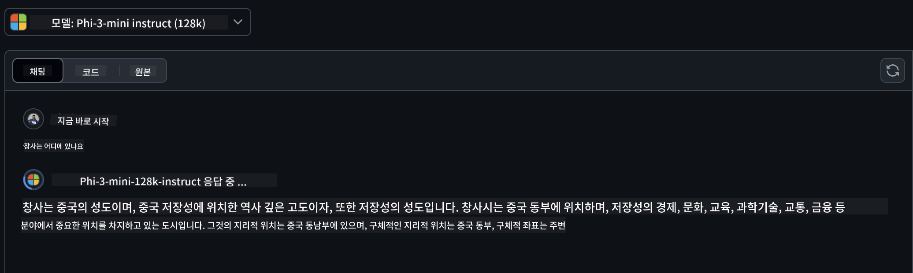
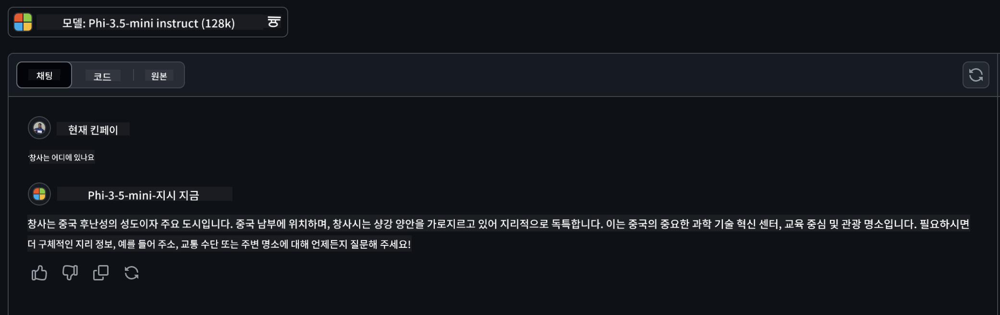

<!--
CO_OP_TRANSLATOR_METADATA:
{
  "original_hash": "124ad36cfe96f74038811b6e2bb93e9d",
  "translation_date": "2025-05-20T09:24:00+00:00",
  "source_file": "19-slm/README.md",
  "language_code": "ko"
}
-->
# 초보자를 위한 생성적 AI를 위한 소형 언어 모델 소개

생성적 AI는 새로운 콘텐츠를 생성할 수 있는 시스템을 만드는 데 중점을 둔 인공지능의 매력적인 분야입니다. 이 콘텐츠는 텍스트와 이미지에서 음악, 심지어 전체 가상 환경에 이르기까지 다양합니다. 생성적 AI의 가장 흥미로운 응용 중 하나는 언어 모델 분야입니다.

## 소형 언어 모델이란 무엇입니까?

소형 언어 모델(SLM)은 대형 언어 모델(LLM)의 축소된 변형을 나타내며, LLM의 많은 아키텍처 원리와 기술을 활용하면서도 상당히 줄어든 계산 발자국을 보여줍니다. SLM은 인간과 같은 텍스트를 생성하도록 설계된 언어 모델의 하위 집합입니다. GPT-4와 같은 더 큰 모델과 달리 SLM은 더 작고 효율적이며, 계산 자원이 제한된 응용 프로그램에 이상적입니다. 크기가 작음에도 불구하고 다양한 작업을 수행할 수 있습니다. 일반적으로 SLM은 LLM을 압축하거나 증류하여 구축되며, 원래 모델의 기능과 언어 능력의 상당 부분을 유지하는 것을 목표로 합니다. 모델 크기를 줄이면 전체 복잡성이 감소하여 SLM이 메모리 사용량과 계산 요구 사항 모두에서 더 효율적이 됩니다. 이러한 최적화에도 불구하고 SLM은 여전히 다양한 자연어 처리(NLP) 작업을 수행할 수 있습니다:

- 텍스트 생성: 일관되고 맥락적으로 관련 있는 문장이나 단락 생성
- 텍스트 완성: 주어진 프롬프트를 기반으로 문장 예측 및 완성
- 번역: 한 언어에서 다른 언어로 텍스트 변환
- 요약: 긴 텍스트를 더 짧고 소화하기 쉬운 요약으로 압축

더 큰 모델에 비해 성능이나 이해의 깊이에서 일부 트레이드오프가 있을 수 있습니다.

## 소형 언어 모델은 어떻게 작동합니까?

SLM은 방대한 양의 텍스트 데이터를 학습합니다. 학습 중에 언어의 패턴과 구조를 학습하여 문법적으로 올바르고 맥락에 적합한 텍스트를 생성할 수 있습니다. 학습 과정은 다음을 포함합니다:

- 데이터 수집: 다양한 출처에서 대규모 텍스트 데이터셋 수집
- 전처리: 데이터를 정리하고 정리하여 학습에 적합하게 만들기
- 학습: 기계 학습 알고리즘을 사용하여 모델이 텍스트를 이해하고 생성하는 방법을 학습
- 미세 조정: 특정 작업에서 성능을 향상시키기 위해 모델 조정

SLM의 개발은 모바일 장치나 엣지 컴퓨팅 플랫폼과 같은 자원 제한 환경에 배포할 수 있는 모델의 증가하는 필요성과 일치합니다. 이러한 환경에서는 전체 규모의 LLM이 무거운 자원 요구 때문에 실용적이지 않을 수 있습니다. 효율성에 중점을 둠으로써 SLM은 성능과 접근성을 균형 있게 유지하여 다양한 도메인에서 더 넓은 응용을 가능하게 합니다.


## 학습 목표

이 강의에서는 SLM에 대한 지식을 소개하고 Microsoft Phi-3과 결합하여 텍스트 콘텐츠, 비전 및 MoE의 다양한 시나리오를 학습하고자 합니다. 이 강의가 끝나면 다음 질문에 답할 수 있어야 합니다:

- SLM이란 무엇인가?
- SLM과 LLM의 차이점은 무엇인가?
- Microsoft Phi-3/3.5 패밀리는 무엇인가?
- Microsoft Phi-3/3.5 패밀리를 어떻게 추론하는가?

준비되셨나요? 시작해봅시다.

## 대형 언어 모델(LLM)과 소형 언어 모델(SLM)의 차이점

LLM과 SLM 모두 확률적 기계 학습의 기본 원칙을 기반으로 구축되며, 아키텍처 설계, 학습 방법론, 데이터 생성 프로세스 및 모델 평가 기술에서 유사한 접근 방식을 따릅니다. 그러나 이러한 두 유형의 모델을 구분하는 몇 가지 주요 요소가 있습니다.

## 소형 언어 모델의 응용

SLM은 다음을 포함한 다양한 응용 프로그램을 가지고 있습니다:

- 챗봇: 고객 지원을 제공하고 대화 방식으로 사용자와 상호작용
- 콘텐츠 생성: 작가가 아이디어를 생성하거나 전체 기사를 작성하는 데 도움
- 교육: 학생의 작문 과제나 새로운 언어 학습 지원
- 접근성: 텍스트 음성 변환 시스템과 같은 장애인을 위한 도구 생성

**크기**

LLM과 SLM의 주요 차이점은 모델의 규모에 있습니다. ChatGPT(GPT-4)와 같은 LLM은 약 1.76조 개의 매개변수를 포함할 수 있는 반면, Mistral 7B와 같은 오픈 소스 SLM은 약 7억 개의 매개변수로 설계되었습니다. 이러한 차이는 주로 모델 아키텍처 및 학습 프로세스의 차이에서 비롯됩니다. 예를 들어, ChatGPT는 인코더-디코더 프레임워크 내에서 자기 주의 메커니즘을 사용하는 반면, Mistral 7B는 디코더 전용 모델 내에서 더 효율적인 학습을 가능하게 하는 슬라이딩 윈도우 주의를 사용합니다. 이러한 아키텍처 차이는 모델의 복잡성과 성능에 심오한 영향을 미칩니다.

**이해**

SLM은 일반적으로 특정 도메인 내에서 성능을 최적화하여 고도로 전문화되지만 여러 지식 분야에서 광범위한 맥락적 이해를 제공하는 데 잠재적으로 제한될 수 있습니다. 반면에 LLM은 보다 포괄적인 수준에서 인간과 같은 지능을 시뮬레이션하는 것을 목표로 합니다. 방대한 다양한 데이터셋으로 학습된 LLM은 다양한 도메인에서 잘 수행하도록 설계되어 더 큰 다재다능함과 적응성을 제공합니다. 따라서 LLM은 자연어 처리 및 프로그래밍과 같은 더 넓은 범위의 다운스트림 작업에 더 적합합니다.

**컴퓨팅**

LLM의 학습 및 배포는 종종 대규모 GPU 클러스터를 포함한 상당한 계산 인프라를 필요로 하는 자원 집약적인 프로세스입니다. 예를 들어, ChatGPT와 같은 모델을 처음부터 학습하려면 수천 개의 GPU가 오랜 기간 필요할 수 있습니다. 반면에, SLM은 매개변수 수가 적어 계산 자원 측면에서 더 접근 가능합니다. Mistral 7B와 같은 모델은 중간 정도의 GPU 기능을 갖춘 로컬 머신에서 학습 및 실행할 수 있지만, 학습에는 여전히 여러 GPU에 걸쳐 몇 시간이 필요합니다.

**편향**

편향은 주로 학습 데이터의 특성 때문에 LLM에서 알려진 문제입니다. 이러한 모델은 종종 인터넷에서 공개적으로 사용할 수 있는 원시 데이터에 의존하며, 이 데이터는 특정 그룹을 과소 대표하거나 잘못 대표할 수 있고, 잘못된 레이블링을 도입하거나 방언, 지리적 변형 및 문법 규칙에 의해 영향을 받은 언어적 편향을 반영할 수 있습니다. 또한, LLM 아키텍처의 복잡성은 세심한 미세 조정 없이 눈에 띄지 않게 편향을 악화시킬 수 있습니다. 반면에, SLM은 더 제한되고 도메인별 데이터셋으로 학습되어 본질적으로 그러한 편향에 덜 취약하지만, 면역성이 있는 것은 아닙니다.

**추론**

SLM의 크기가 줄어들면 추론 속도 측면에서 상당한 이점을 제공하여 광범위한 병렬 처리가 필요 없이 로컬 하드웨어에서 효율적으로 출력을 생성할 수 있습니다. 반면에, LLM은 크기와 복잡성 때문에 허용 가능한 추론 시간을 달성하기 위해 상당한 병렬 계산 자원이 필요한 경우가 많습니다. 특히 대규모로 배포할 때 여러 동시 사용자가 존재하면 LLM의 응답 시간이 더욱 느려집니다.

요약하면, LLM과 SLM은 모두 기계 학습의 기본을 공유하지만, 모델 크기, 자원 요구 사항, 맥락적 이해, 편향에 대한 취약성 및 추론 속도 측면에서 크게 다릅니다. 이러한 차이점은 LLM이 더 다재다능하지만 자원 집약적이며, SLM은 더 적은 계산 요구로 도메인별 효율성을 제공하는 각각의 사용 사례에 대한 적합성을 반영합니다.

***참고: 이 장에서는 Microsoft Phi-3 / 3.5를 예로 들어 SLM을 소개할 것입니다.***

## Phi-3 / Phi-3.5 패밀리 소개

Phi-3 / 3.5 패밀리는 주로 텍스트, 비전 및 에이전트(MoE) 응용 시나리오를 대상으로 합니다:

### Phi-3 / 3.5 Instruct

주로 텍스트 생성, 채팅 완성, 콘텐츠 정보 추출 등을 위한 것입니다.

**Phi-3-mini**

3.8B 언어 모델은 Microsoft Azure AI Studio, Hugging Face 및 Ollama에서 사용할 수 있습니다. Phi-3 모델은 주요 벤치마크에서 동등하거나 더 큰 크기의 언어 모델보다 크게 우수합니다(아래 벤치마크 숫자를 참조, 숫자가 높을수록 좋습니다). Phi-3-mini는 그 크기의 두 배인 모델보다 우수하며, Phi-3-small 및 Phi-3-medium은 GPT-3.5를 포함한 더 큰 모델을 능가합니다.

**Phi-3-small & medium**

단지 7B 매개변수로, Phi-3-small은 다양한 언어, 추론, 코딩 및 수학 벤치마크에서 GPT-3.5T를 능가합니다. 14B 매개변수를 가진 Phi-3-medium은 이 추세를 계속하며 Gemini 1.0 Pro를 능가합니다.

**Phi-3.5-mini**

Phi-3-mini의 업그레이드로 생각할 수 있습니다. 매개변수는 변경되지 않았지만, 여러 언어를 지원하는 능력을 향상시키고(20개 이상의 언어 지원: 아랍어, 중국어, 체코어, 덴마크어, 네덜란드어, 영어, 핀란드어, 프랑스어, 독일어, 히브리어, 헝가리어, 이탈리아어, 일본어, 한국어, 노르웨이어, 폴란드어, 포르투갈어, 러시아어, 스페인어, 스웨덴어, 태국어, 터키어, 우크라이나어) 긴 문맥을 강력하게 지원합니다. 3.8B 매개변수를 가진 Phi-3.5-mini는 동일한 크기의 언어 모델을 능가하며, 두 배 크기의 모델과 동등합니다.

### Phi-3 / 3.5 Vision

Phi-3/3.5의 Instruct 모델을 Phi의 이해력으로 생각할 수 있으며, Vision은 Phi에게 세상을 이해할 수 있는 눈을 제공합니다.

**Phi-3-Vision**

단지 4.2B 매개변수로, Phi-3-vision은 일반 시각 추론 작업, OCR 및 표 및 다이어그램 이해 작업에서 Claude-3 Haiku 및 Gemini 1.0 Pro V와 같은 더 큰 모델을 능가합니다.

**Phi-3.5-Vision**

Phi-3.5-Vision은 Phi-3-Vision의 업그레이드로, 여러 이미지를 지원합니다. 사진뿐만 아니라 동영상도 볼 수 있는 시각적 개선으로 생각할 수 있습니다. Phi-3.5-vision은 OCR, 표 및 차트 이해 작업에서 Claude-3.5 Sonnet 및 Gemini 1.5 Flash와 같은 더 큰 모델을 능가하며, 일반 시각 지식 추론 작업에서는 동등합니다. 다중 프레임 입력을 지원하여 여러 입력 이미지에 대한 추론을 수행할 수 있습니다.

### Phi-3.5-MoE

***전문가 혼합(MoE)***은 모델이 훨씬 적은 계산으로 사전 학습될 수 있도록 하여, 밀집 모델과 동일한 계산 예산으로 모델 또는 데이터셋 크기를 크게 확장할 수 있음을 의미합니다. 특히, MoE 모델은 사전 학습 중에 밀집 모델과 동일한 품질을 훨씬 더 빨리 달성해야 합니다. Phi-3.5-MoE는 16x3.8B 전문가 모듈로 구성되어 있습니다. Phi-3.5-MoE는 단지 6.6B 활성 매개변수로 훨씬 더 큰 모델과 유사한 수준의 추론, 언어 이해 및 수학을 달성합니다.

Phi-3/3.5 패밀리 모델을 다양한 시나리오에 따라 사용할 수 있습니다. LLM과 달리, Phi-3/3.5-mini 또는 Phi-3/3.5-Vision을 엣지 장치에 배포할 수 있습니다.

## Phi-3/3.5 패밀리 모델 사용 방법

우리는 Phi-3/3.5를 다양한 시나리오에서 사용하고자 합니다. 다음으로, 우리는 다른 시나리오에 기반하여 Phi-3/3.5를 사용할 것입니다.


### 추론 차이

클라우드의 API

**GitHub 모델**

GitHub
모델은 가장 직접적인 방법입니다. GitHub 모델을 통해 Phi-3/3.5-Instruct 모델에 빠르게 액세스할 수 있습니다. Azure AI Inference SDK / OpenAI SDK와 결합하여 코드를 통해 API에 액세스하여 Phi-3/3.5-Instruct 호출을 완료할 수 있습니다. 또한 Playground를 통해 다양한 효과를 테스트할 수 있습니다. - 데모: 중국 시나리오에서 Phi-3-mini와 Phi-3.5-mini의 효과 비교   **Azure AI Studio** 또는 Vision 및 MoE 모델을 사용하고자 한다면, Azure AI Studio를 사용하여 호출을 완료할 수 있습니다. 관심이 있다면, Azure AI Studio를 통해 Phi-3/3.5 Instruct, Vision, MoE를 호출하는 방법을 배우기 위해 Phi-3 Cookbook을 읽어볼 수 있습니다 [이 링크를 클릭하세요](https://github.com/microsoft/Phi-3CookBook/blob/main/md/02.QuickStart/AzureAIStudio_QuickStart.md?WT.mc_id=academic-105485-koreyst) **NVIDIA NIM** Azure와 GitHub이 제공하는 클라우드 기반 모델 카탈로그 솔루션 외에도 [Nivida NIM](https://developer.nvidia.com/nim?WT.mc_id=academic-105485-koreyst)을 사용하여 관련 호출을 완료할 수 있습니다. NIVIDA NIM을 방문하여 Phi-3/3.5 패밀리의 API 호출을 완료할 수 있습니다. NVIDIA NIM(NVIDIA Inference Microservices)은 클라우드, 데이터 센터 및 워크스테이션을 포함한 다양한 환경에서 AI 모델을 효율적으로 배포할 수 있도록 돕기 위해 설계된 가속화된 추론 마이크로서비스 세트입니다. 여기 NVIDIA NIM의 주요 기능이 있습니다: - **배포 용이성:** NIM은 단일 명령으로 AI 모델을 배포할 수 있어 기존 워크플로에 쉽게 통합할 수 있습니다. - **최적화된 성능:** TensorRT 및 TensorRT-LLM과 같은 NVIDIA의 사전 최적화된 추론 엔진을 활용하여 낮은 지연 시간과 높은 처리량을 보장합니다. - **확장성:** NIM은 Kubernetes에서 자동 확장을 지원하여 다양한 작업 부하를 효과적으로 처리할 수 있습니다. - **보안 및 제어:** 조직은 자체 관리 인프라에서 NIM 마이크로서비스를 자체 호스팅하여 데이터 및 애플리케이션에 대한 제어를 유지할 수 있습니다. - **표준 API:** NIM은 산업 표준 API를 제공하여 챗봇, AI 어시스턴트 등과 같은 AI 애플리케이션을 쉽게 구축하고 통합할 수 있습니다. NIM은 NVIDIA AI Enterprise의 일부로, AI 모델의 배포 및 운영을 간소화하여 NVIDIA GPU에서 효율적으로 실행되도록 합니다. - 데모: Nividia NIM을 사용하여 Phi-3.5-Vision-API 호출 [[이 링크를 클릭하세요](../../../19-slm/python/Phi-3-Vision-Nividia-NIM.ipynb)] ### 로컬 환경에서 Phi-3/3.5 추론 Phi-3 또는 GPT-3과 같은 언어 모델과 관련된 추론은 입력을 기반으로 응답이나 예측을 생성하는 프로세스를 말합니다. Phi-3에 프롬프트나 질문을 제공하면, 훈련된 신경망을 사용하여 학습된 데이터의 패턴과 관계를 분석하여 가장 가능성 있고 관련성 있는 응답을 추론합니다. **Hugging Face Transformer** Hugging Face Transformers는 자연어 처리(NLP) 및 기타 기계 학습 작업을 위해 설계된 강력한 라이브러리입니다. 여기에 대한 몇 가지 주요 포인트가 있습니다: 1. **사전 훈련된 모델**: 텍스트 분류, 명명된 개체 인식, 질문 응답, 요약, 번역 및 텍스트 생성과 같은 다양한 작업에 사용할 수 있는 수천 개의 사전 훈련된 모델을 제공합니다. 2. **프레임워크 상호운용성**: PyTorch, TensorFlow 및 JAX를 포함한 여러 딥러닝 프레임워크를 지원하여 한 프레임워크에서 모델을 훈련하고 다른 프레임워크에서 사용할 수 있습니다. 3. **멀티모달 기능**: NLP 외에도 Hugging Face Transformers는 컴퓨터 비전(예: 이미지 분류, 객체 탐지) 및 오디오 처리(예: 음성 인식, 오디오 분류) 작업도 지원합니다. 4. **사용 용이성**: 라이브러리는 모델을 쉽게 다운로드하고 미세 조정할 수 있는 API 및 도구를 제공하여 초보자와 전문가 모두에게 접근 가능합니다. 5. **커뮤니티 및 리소스**: Hugging Face는 활발한 커뮤니티와 풍부한 문서, 튜토리얼 및 가이드를 제공하여 사용자가 시작하고 라이브러리를 최대한 활용할 수 있도록 돕습니다. [공식 문서](https://huggingface.co/docs/transformers/index?WT.mc_id=academic-105485-koreyst) 또는 [GitHub 저장소](https://github.com/huggingface/transformers?WT.mc_id=academic-105485-koreyst). 이것은 가장 일반적으로 사용되는 방법이지만, 또한 GPU 가속이 필요합니다. 결국 Vision 및 MoE와 같은 장면은 많은 계산이 필요하며, 양자화되지 않은 경우 CPU에서 매우 제한될 것입니다. - 데모: Transformer를 사용하여 Phi-3.5-Instuct 호출 [이 링크를 클릭하세요](../../../19-slm/python/phi35-instruct-demo.ipynb) - 데모: Transformer를 사용하여 Phi-3.5-Vision 호출[이 링크를 클릭하세요](../../../19-slm/python/phi35-vision-demo.ipynb) - 데모: Transformer를 사용하여 Phi-3.5-MoE 호출[이 링크를 클릭하세요](../../../19-slm/python/phi35_moe_demo.ipynb) **Ollama** [Ollama](https://ollama.com/?WT.mc_id=academic-105485-koreyst)는 대형 언어 모델(LLM)을 로컬에서 실행하기 쉽게 만들어주는 플랫폼입니다. Llama 3.1, Phi 3, Mistral, Gemma 2 등 다양한 모델을 지원합니다. 플랫폼은 모델 가중치, 구성 및 데이터를 단일 패키지로 번들링하여 사용자가 자신만의 모델을 사용자 정의하고 생성할 수 있도록 더 쉽게 만듭니다. Ollama는 macOS, Linux 및 Windows에서 사용할 수 있습니다. 클라우드 서비스를 의존하지 않고 LLM을 실험하거나 배포하려는 경우 훌륭한 도구입니다. Ollama는 가장 직접적인 방법으로, 다음 명령문을 실행하기만 하면 됩니다. ```bash

ollama run phi3.5

``` **ONNX Runtime for GenAI** [ONNX Runtime](https://github.com/microsoft/onnxruntime-genai?WT.mc_id=academic-105485-koreyst)은 플랫폼 간 추론 및 훈련 기계 학습 가속기입니다. ONNX Runtime for Generative AI (GENAI)는 다양한 플랫폼에서 생성 AI 모델을 효율적으로 실행할 수 있도록 도와주는 강력한 도구입니다. ## ONNX Runtime이란 무엇인가요? ONNX Runtime은 기계 학습 모델의 고성능 추론을 가능하게 하는 오픈 소스 프로젝트입니다. 기계 학습 모델을 나타내는 표준인 ONNX 형식의 모델을 지원합니다.ONNX Runtime 추론은 PyTorch 및 TensorFlow/Keras와 같은 딥러닝 프레임워크뿐만 아니라 scikit-learn, LightGBM, XGBoost 등과 같은 고전적인 기계 학습 라이브러리의 모델을 지원하여 더 빠른 고객 경험과 비용 절감을 가능하게 합니다. ONNX Runtime은 다양한 하드웨어, 드라이버 및 운영 체제와 호환되며, 그래프 최적화 및 변환과 함께 적용 가능한 하드웨어 가속기를 활용하여 최적의 성능을 제공합니다 ## 생성 AI란 무엇인가요? 생성 AI는 훈련된 데이터를 기반으로 텍스트, 이미지 또는 음악과 같은 새로운 콘텐츠를 생성할 수 있는 AI 시스템을 말합니다. 예로는 GPT-3과 같은 언어 모델 및 Stable Diffusion과 같은 이미지 생성 모델이 있습니다. ONNX Runtime for GenAI 라이브러리는 ONNX 모델에 대한 생성 AI 루프를 제공하며, ONNX Runtime을 통한 추론, 로짓 처리, 검색 및 샘플링, KV 캐시 관리 등을 포함합니다. ## ONNX Runtime for GENAI ONNX Runtime for GENAI는 ONNX Runtime의 기능을 확장하여 생성 AI 모델을 지원합니다. 여기 몇 가지 주요 기능이 있습니다: - **광범위한 플랫폼 지원:** Windows, Linux, macOS, Android, iOS 등 다양한 플랫폼에서 작동합니다. - **모델 지원:** LLaMA, GPT-Neo, BLOOM 등 많은 인기 있는 생성 AI 모델을 지원합니다. - **성능 최적화:** NVIDIA GPU, AMD GPU 등 다양한 하드웨어 가속기에 대한 최적화를 포함합니다. - **사용 용이성:** 애플리케이션에 쉽게 통합할 수 있는 API를 제공하여 최소한의 코드로 텍스트, 이미지 및 기타 콘텐츠를 생성할 수 있습니다 - 사용자는 고급 generate() 메서드를 호출하거나 모델의 각 반복을 루프에서 실행하여 한 번에 하나의 토큰을 생성하고 선택적으로 루프 내에서 생성 매개변수를 업데이트할 수 있습니다. - ONNX 런타임은 또한 탐욕적/빔 검색 및 TopP, TopK 샘플링을 지원하여 토큰 시퀀스를 생성하고 반복 페널티와 같은 내장된 로짓 처리를 제공합니다. 사용자 정의 스코어링도 쉽게 추가할 수 있습니다. ## 시작하기 ONNX Runtime for GENAI를 시작하려면 다음 단계를 따라야 합니다: ### ONNX Runtime 설치: ```Python
pip install onnxruntime
``` ### 생성 AI 확장 설치: ```Python
pip install onnxruntime-genai
``` ### 모델 실행: 여기 Python에서의 간단한 예제입니다: ```Python
import onnxruntime_genai as og

model = og.Model('path_to_your_model.onnx')

tokenizer = og.Tokenizer(model)

input_text = "Hello, how are you?"

input_tokens = tokenizer.encode(input_text)

output_tokens = model.generate(input_tokens)

output_text = tokenizer.decode(output_tokens)

print(output_text) 
``` ### 데모:ONNX Runtime GenAI를 사용하여 Phi-3.5-Vision 호출 ```python

import onnxruntime_genai as og

model_path = './Your Phi-3.5-vision-instruct ONNX Path'

img_path = './Your Image Path'

model = og.Model(model_path)

processor = model.create_multimodal_processor()

tokenizer_stream = processor.create_stream()

text = "Your Prompt"

prompt = "<|user|>\n"

prompt += "<|image_1|>\n"

prompt += f"{text}<|end|>\n"

prompt += "<|assistant|>\n"

image = og.Images.open(img_path)

inputs = processor(prompt, images=image)

params = og.GeneratorParams(model)

params.set_inputs(inputs)

params.set_search_options(max_length=3072)

generator = og.Generator(model, params)

while not generator.is_done():

    generator.compute_logits()
    
    generator.generate_next_token()

    new_token = generator.get_next_tokens()[0]
    
    code += tokenizer_stream.decode(new_token)
    
    print(tokenizer_stream.decode(new_token), end='', flush=True)

``` **기타** ONNX Runtime 및 Ollama 참조 방법 외에도 Apple Metal을 사용하는 Apple MLX 프레임워크, NPU를 사용하는 Qualcomm QNN, CPU/GPU를 사용하는 Intel OpenVINO 등 다양한 제조업체가 제공하는 모델 참조 방법을 기반으로 양자화 모델의 참조를 완료할 수 있습니다. [Phi-3 Cookbook](https://github.com/microsoft/phi-3cookbook?WT.mc_id=academic-105485-koreyst)에서 더 많은 내용을 확인할 수 있습니다. ## 추가 정보 우리는 Phi-3/3.5 패밀리의 기본을 배웠지만, SLM에 대해 더 배우기 위해서는 더 많은 지식이 필요합니다. Phi-3 Cookbook에서 답을 찾을 수 있습니다. 더 배우고 싶다면, [Phi-3 Cookbook](https://github.com/microsoft/phi-3cookbook?WT.mc_id=academic-105485-koreyst)을 방문하세요.

**면책 조항**:  
이 문서는 AI 번역 서비스 [Co-op Translator](https://github.com/Azure/co-op-translator)를 사용하여 번역되었습니다. 정확성을 위해 노력하고 있지만, 자동 번역에는 오류나 부정확성이 포함될 수 있음을 유의하시기 바랍니다. 원본 문서는 해당 언어로 작성된 문서를 권위 있는 출처로 간주해야 합니다. 중요한 정보의 경우, 전문적인 인간 번역을 권장합니다. 이 번역 사용으로 인해 발생하는 오해나 잘못된 해석에 대해 당사는 책임을 지지 않습니다.