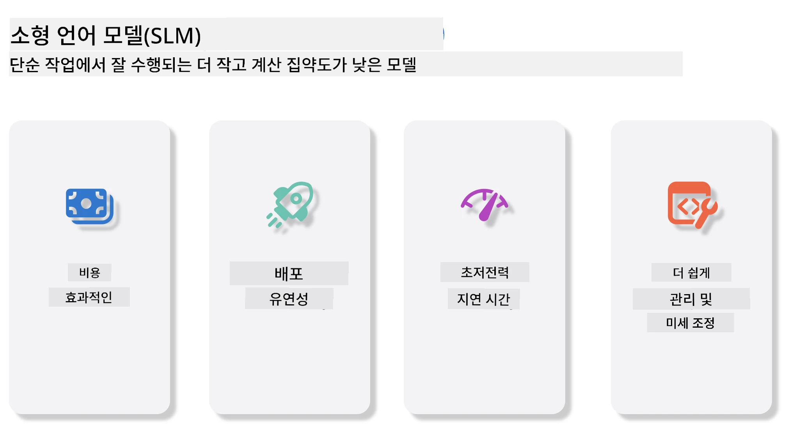
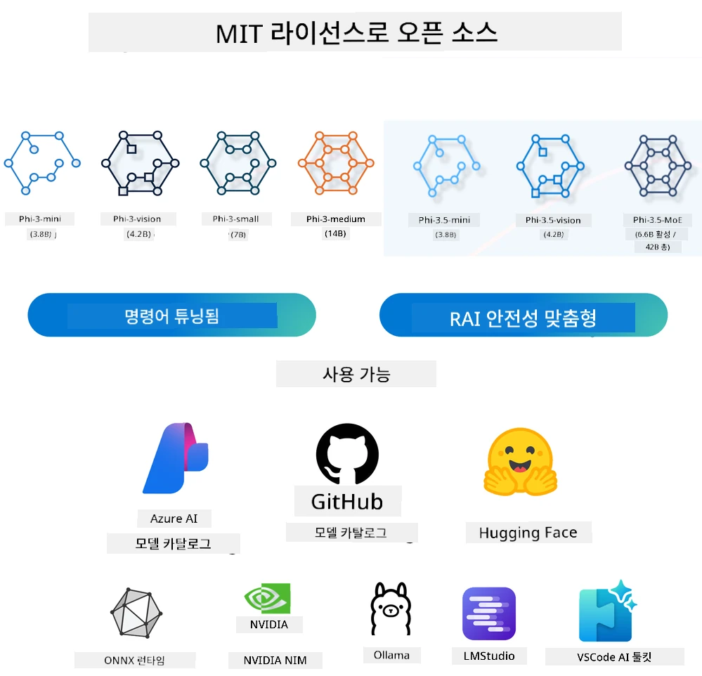
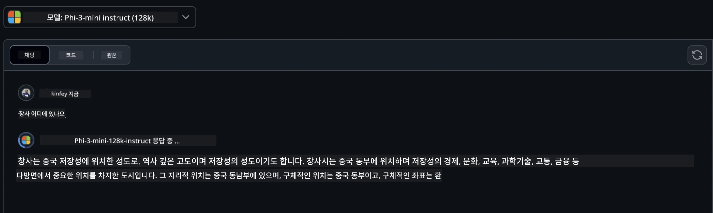
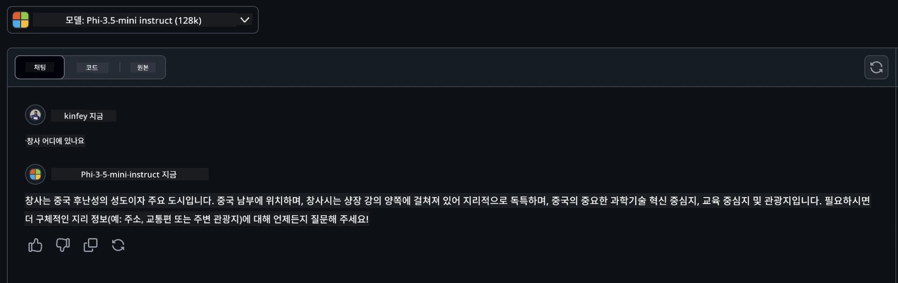

# 생성형 AI 초보자를 위한 소형 언어 모델 입문
생성형 AI는 새로운 콘텐츠를 생성할 수 있는 시스템을 만드는 데 초점을 맞춘 매혹적인 인공지능 분야입니다. 이 콘텐츠는 텍스트와 이미지에서 음악, 심지어 전체 가상 환경에 이르기까지 다양합니다. 생성형 AI의 가장 흥미로운 적용 분야 중 하나는 언어 모델 영역입니다.

## 소형 언어 모델이란 무엇인가?

소형 언어 모델(SLM)은 대형 언어 모델(LLM)의 축소형 변형으로, LLM의 많은 아키텍처 원리와 기술을 활용하면서도 계산적 발자국이 크게 줄어든 모델입니다.

SLM은 사람과 유사한 텍스트를 생성하도록 설계된 언어 모델의 하위 집합입니다. GPT-4와 같은 대형 모델과 달리, SLM은 더 작고 효율적이며, 계산 자원이 제한된 환경에 이상적입니다. 크기가 작음에도 불구하고 다양한 작업을 수행할 수 있습니다. 일반적으로 SLM은 LLM을 압축하거나 증류하여 구축되며, 원래 모델의 기능과 언어능력의 상당 부분을 유지하는 것을 목표로 합니다. 모델 크기의 감소는 전체 복잡성을 줄여 메모리 사용과 계산 요구 면에서 SLM이 더 효율적이 됩니다. 이러한 최적화에도 불구하고 SLM은 다음과 같은 다양한 자연어 처리(NLP) 작업을 수행할 수 있습니다:

- 텍스트 생성: 일관성 있고 문맥에 적합한 문장이나 단락 생성.
- 텍스트 완성: 주어진 프롬프트를 바탕으로 문장 예측 및 완성.
- 번역: 한 언어에서 다른 언어로 텍스트 변환.
- 요약: 긴 텍스트를 더 짧고 이해하기 쉬운 요약으로 압축.

이는 대형 모델과 비교할 때 일부 성능이나 이해 깊이에서의 절충을 수반합니다.

## 소형 언어 모델은 어떻게 작동하는가?
SLM은 방대한 텍스트 데이터를 바탕으로 학습됩니다. 훈련 과정에서 언어의 패턴과 구조를 학습하여 문법적으로 올바르고 문맥에 적절한 텍스트를 생성할 수 있게 됩니다. 훈련 과정은 다음 단계를 포함합니다:

- 데이터 수집: 다양한 출처에서 방대한 텍스트 데이터셋 수집.
- 전처리: 데이터를 정리하고 조직하여 학습에 적합하게 만듦.
- 훈련: 기계 학습 알고리즘을 사용해 모델이 텍스트를 이해하고 생성하는 법을 학습.
- 미세 조정: 특정 작업의 성능을 향상시키기 위해 모델 조정.

SLM 개발은 모바일 기기나 엣지 컴퓨팅 플랫폼과 같이 자원이 제한된 환경에 배포할 수 있는 모델 요구 증가와 맞물려 있습니다. 대규모 LLM이 무거운 자원 소모 때문에 사용이 어렵거나 불가능한 환경에서, 효율성에 중점을 둔 SLM은 성능과 접근성의 균형을 이루어 다양한 분야에 폭넓게 적용 가능합니다.



## 학습 목표

이번 강의에서는 SLM에 대한 지식을 소개하고 Microsoft Phi-3와 결합하여 텍스트 콘텐츠, 비전, MoE의 다양한 시나리오를 학습하고자 합니다.

본 강의가 끝나면 다음 질문에 답할 수 있어야 합니다:

- SLM이란 무엇인가?
- SLM과 LLM의 차이점은 무엇인가?
- Microsoft Phi-3/3.5 패밀리는 무엇인가?
- Microsoft Phi-3/3.5 패밀리로 추론(inference)을 어떻게 수행하는가?

준비되셨나요? 시작해봅시다.

## 대형 언어 모델(LLM)과 소형 언어 모델(SLM)의 구분점

LLM과 SLM 모두 확률적 기계 학습의 기본 원리를 바탕으로 하며, 비슷한 아키텍처 설계, 학습 방법론, 데이터 생성, 모델 평가 기법을 따릅니다. 그러나 다음과 같은 주요 요소들로 두 모델 유형이 구별됩니다.

## 소형 언어 모델의 적용 분야

SLM은 다음과 같은 넓은 적용 분야가 있습니다:

- 챗봇: 고객 지원 제공 및 사용자와 대화형 상호작용.
- 콘텐츠 생성: 작가를 돕기 위한 아이디어 생성 또는 기사 초안 작성.
- 교육: 학생들이 글쓰기 과제나 새로운 언어 학습을 지원.
- 접근성: 텍스트-음성 변환 시스템과 같이 장애인을 위한 도구 개발.

**크기**

LLM과 SLM의 가장 큰 차이점은 모델 규모에 있습니다. 예를 들어 ChatGPT(GPT-4)는 약 1.76조 개의 파라미터를 포함할 수 있지만, 오픈소스 SLM인 Mistral 7B는 약 70억 개 파라미터로 훨씬 적은 수를 가집니다. 이러한 차이는 주로 모델 아키텍처와 훈련 과정의 차이에서 기인합니다. 예를 들어 ChatGPT는 인코더-디코더 구조 내에서 셀프 어텐션 메커니즘을 사용하지만, Mistral 7B는 디코더 전용 모델 내에서 슬라이딩 윈도우 어텐션을 활용해 더 효율적인 훈련을 가능하게 합니다. 이러한 아키텍처 차이는 모델의 복잡성과 성능에 깊은 영향을 미칩니다.

**이해력**

SLM은 주로 특정 도메인 내 성능 최적화를 위해 설계되어 매우 전문화되어 있지만, 다수의 지식 분야에 걸친 폭넓은 문맥 이해에는 제한적일 수 있습니다. 반면 LLM은 인간과 유사한 지능을 보다 포괄적으로 모방하려 합니다. 방대한 다양하고 광범위한 데이터셋으로 학습된 LLM은 여러 도메인에서 뛰어난 성능을 내며, 높은 범용성과 적응성을 보입니다. 따라서 자연어 처리 및 프로그래밍과 같은 다양한 하위 작업에 LLM이 더 적합합니다.

**컴퓨팅**

LLM의 훈련과 배포는 대규모 GPU 클러스터 등 막대한 컴퓨팅 인프라를 필요로 하는 자원 집약적 작업입니다. 예를 들어 ChatGPT와 같은 모델을 처음부터 훈련하려면 수천 개의 GPU가 장기간 필요할 수 있습니다. 반면, 파라미터 수가 적은 SLM은 계산 자원 접근성이 높습니다. Mistral 7B와 같은 모델은 중간 수준 GPU가 장착된 로컬 머신에서도 훈련 및 실행 가능하지만, 훈련에는 여전히 다수 GPU에 걸친 수시간이 소요됩니다.

**편향**

편향은 LLM에서 자주 발견되는 문제이며, 주로 학습 데이터의 특성 때문입니다. 이들 모델은 인터넷에서 수집된 원시 공개 데이터를 주로 사용하기 때문에 특정 집단이 과소 대표되거나 잘못 표현될 가능성이 있고, 잘못된 라벨링이 포함되며, 방언, 지리적 차이, 문법 규칙에서 비롯된 언어적 편향도 반영될 수 있습니다. 또한 LLM 아키텍처의 복잡성은 편향을 더욱 악화시킬 수 있으며, 세심한 미세 조정 없이는 이를 감지하기 어렵습니다. 반면, SLM은 보다 제한되고 도메인 특화된 데이터셋으로 학습하기 때문에 이러한 편향에 상대적으로 덜 노출되지만 완전히 면역은 아닙니다.

**추론(inference)**

SLM은 크기가 감소됨에 따라 로컬 하드웨어에서 광범위한 병렬 처리 없이도 빠른 추론 속도를 제공합니다. 반면 LLM은 크기와 복잡성 때문에 수용 가능한 추론 시간 확보에 대량 병렬 컴퓨팅 자원을 필요로 합니다. 다수의 동시 사용자 존재 시 LLM의 응답 시간은 특히 대규모 배포 환경에서 느려질 수 있습니다.

요약하자면, LLM과 SLM은 모두 기계 학습 기반이라는 공통점을 가지나, 모델 크기, 자원 요구사항, 문맥 이해력, 편향 민감도, 추론 속도 측면에서 상당한 차이를 보입니다. 이러한 차이점은 각각의 사용 사례에 따른 적합성에 반영되어, LLM은 범용성은 높으나 자원 소모가 많고, SLM은 도메인 특화 효율성과 감소된 계산 필요성으로 차별화됩니다.

***참고: 이번 강의에서는 Microsoft Phi-3 / 3.5를 예시로 SLM을 소개합니다.***

## Phi-3 / Phi-3.5 패밀리 소개

Phi-3 / 3.5 패밀리는 주로 텍스트, 비전, 에이전트(MoE) 응용 시나리오를 대상으로 합니다:

### Phi-3 / 3.5 Instruct

주로 텍스트 생성, 채팅 완성, 콘텐츠 정보 추출 등에 사용됩니다.

**Phi-3-mini**

3.8B 파라미터 언어 모델은 Microsoft Azure AI Studio, Hugging Face, Ollama에서 이용 가능합니다. Phi-3 모델은 주요 벤치마크에서 같은 크기 혹은 더 큰 모델보다 월등한 성능을 보입니다(아래 벤치마크 수치를 참고하세요. 수치가 높을수록 우수). Phi-3-mini는 두 배 크기의 모델들도 능가하며, Phi-3-small 및 Phi-3-medium은 GPT-3.5를 포함한 더 큰 모델들을 능가합니다.

**Phi-3-small & medium**

7B 파라미터에 불과한 Phi-3-small은 다양한 언어, 추론, 코딩, 수학 벤치마크에서 GPT-3.5T를 앞섭니다.

14B 파라미터의 Phi-3-medium은 이 추세를 이어가며 Gemini 1.0 Pro를 능가합니다.

**Phi-3.5-mini**

Phi-3-mini의 업그레이드 버전으로 생각할 수 있습니다. 파라미터 수는 동일하지만 다중 언어 지원 능력이 향상되었습니다(20개 이상 언어 지원: 아랍어, 중국어, 체코어, 덴마크어, 네덜란드어, 영어, 핀란드어, 프랑스어, 독일어, 히브리어, 헝가리어, 이탈리아어, 일본어, 한국어, 노르웨이어, 폴란드어, 포르투갈어, 러시아어, 스페인어, 스웨덴어, 태국어, 터키어, 우크라이나어) 및 긴 문맥 지원 기능이 강화되었습니다.

3.8B 파라미터의 Phi-3.5-mini는 같은 크기의 다른 언어 모델을 능가하며 두 배 크기의 모델과 견줄 만한 성능을 가집니다.

### Phi-3 / 3.5 Vision

Phi-3/3.5 Instruct 모델은 Phi의 이해 능력으로 생각할 수 있고, Vision은 Phi가 세계를 눈으로 인식하는 능력입니다.

**Phi-3-Vision**

4.2B 파라미터에 불과한 Phi-3-vision은 일반 시각 추론 작업, OCR, 표 및 다이어그램 이해 작업에서 Claude-3 Haiku 및 Gemini 1.0 Pro 같은 더 큰 모델들을 능가합니다.

**Phi-3.5-Vision**

Phi-3.5-Vision은 Phi-3-Vision의 업그레이드 버전으로, 다중 이미지 지원을 추가했습니다. 사진뿐만 아니라 동영상도 볼 수 있는 비전 향상으로 생각할 수 있습니다.

Phi-3.5-vision은 OCR, 표 및 차트 이해 작업에서 Claude-3.5 Sonnet 및 Gemini 1.5 Flash 같은 더 큰 모델들을 능가하며, 일반 시각 지식 추론 작업에서는 대등한 성능을 보입니다. 다중 프레임 입력을 지원해 여러 입력 이미지에 대해 추론 가능.

### Phi-3.5-MoE

***Mixture of Experts(MoE)***는 훨씬 적은 계산으로 사전 훈련을 가능하게 하여, 동일한 계산 예산으로 모델이나 데이터셋 크기를 극적으로 확장할 수 있습니다. 특히, MoE 모델은 밀집형(dense) 모델과 동일한 품질을 훨씬 빠르게 사전학습할 수 있어야 합니다.

Phi-3.5-MoE는 16개의 3.8B 전문가모듈(expert modules)로 구성됩니다. 활성 파라미터가 6.6B에 불과한 Phi-3.5-MoE는 훨씬 더 큰 모델과 비슷한 수준의 추론, 언어 이해 및 수학 능력을 보여줍니다.

우리는 다양한 시나리오에 기반해 Phi-3/3.5 패밀리 모델을 사용할 수 있습니다. LLM과 달리 Phi-3/3.5-mini나 Phi-3/3.5-Vision을 엣지 장치에 배포할 수 있습니다.

## Phi-3/3.5 패밀리 모델 사용법

Phi-3/3.5를 다양한 시나리오에서 사용하는 것을 목표로 합니다. 다음으로, 여러 시나리오 기반으로 Phi-3/3.5를 활용해보겠습니다.



### 클라우드 API를 통한 추론

**GitHub Models**

GitHub Models는 가장 직접적인 방법입니다. GitHub Models를 통해 Phi-3/3.5-Instruct 모델에 빠르게 접근할 수 있습니다. Azure AI Inference SDK 또는 OpenAI SDK와 결합하여 코드로 API에 접속해 Phi-3/3.5-Instruct 호출을 실행할 수 있습니다. Playground에서 다양한 효과도 테스트할 수 있습니다.

- 데모: 중국어 시나리오에서 Phi-3-mini와 Phi-3.5-mini 효과 비교






**Azure AI Studio**

비전 및 MoE 모델을 사용하고자 하면 Azure AI Studio를 통해 호출할 수 있습니다. 관심 있다면 Phi-3 쿡북을 읽으며 Azure AI Studio를 이용한 Phi-3/3.5 Instruct, Vision, MoE 호출 방법을 배울 수 있습니다 [여기를 클릭하세요](https://github.com/microsoft/Phi-3CookBook/blob/main/md/02.QuickStart/AzureAIStudio_QuickStart.md?WT.mc_id=academic-105485-koreyst)


**NVIDIA NIM**

Azure와 GitHub에서 제공하는 클라우드 기반 모델 카탈로그 솔루션 외에도, [NVIDIA NIM](https://developer.nvidia.com/nim?WT.mc_id=academic-105485-koreyst)을 이용해 관련 호출을 완료할 수 있습니다. NVIDIA NIM(NVIDIA Inference Microservices)은 클라우드, 데이터 센터, 워크스테이션 등 다양한 환경에서 개발자가 AI 모델을 효율적으로 배포할 수 있도록 설계된 가속화된 추론 마이크로서비스 세트입니다.

아래는 NVIDIA NIM의 주요 특징입니다:
- **배포 용이성:** NIM은 한 번의 명령으로 AI 모델을 배포할 수 있어 기존 워크플로우에 쉽게 통합할 수 있습니다.
- **최적화된 성능:** TensorRT 및 TensorRT-LLM과 같은 NVIDIA의 사전 최적화된 추론 엔진을 활용하여 낮은 지연 시간과 높은 처리량을 보장합니다.
- **확장성:** NIM은 Kubernetes에서 자동 확장을 지원하여 다양한 작업 부하를 효과적으로 처리할 수 있습니다.
- **보안 및 제어:** 조직은 자체 관리 인프라에서 NIM 마이크로서비스를 자체 호스팅하여 데이터 및 애플리케이션에 대한 제어를 유지할 수 있습니다.
- **표준 API:** NIM은 업계 표준 API를 제공하여 챗봇, AI 어시스턴트 등과 같은 AI 응용 프로그램을 쉽게 구축하고 통합할 수 있습니다.

NIM은 NVIDIA AI Enterprise의 일부로, AI 모델의 배포 및 운영을 간소화하여 NVIDIA GPU에서 효율적으로 실행되도록 합니다.

- 데모: NVIDIA NIM을 사용하여 Phi-3.5-Vision-API 호출하기 [[이 링크 클릭](./python/Phi-3-Vision-Nividia-NIM.ipynb?WT.mc_id=academic-105485-koreyst)]


### Phi-3/3.5 로컬 실행하기
Phi-3 또는 GPT-3 같은 언어 모델과 관련된 추론이란 입력받은 내용을 바탕으로 응답이나 예측을 생성하는 과정을 의미합니다. Phi-3에 프롬프트나 질문을 제공하면, 학습된 신경망을 이용해 패턴과 관계를 분석해 가장 적절한 응답을 추론합니다.

**Hugging Face Transformer**  
Hugging Face Transformers는 자연어 처리(NLP) 및 기타 머신러닝 작업을 위해 설계된 강력한 라이브러리입니다. 주요 특징은 다음과 같습니다:

1. **사전 학습된 모델:** 텍스트 분류, 명명된 개체 인식, 질문 응답, 요약, 번역, 텍스트 생성 등 다양한 작업에 사용할 수 있는 수천 개의 사전 학습 모델을 제공합니다.

2. **프레임워크 호환성:** PyTorch, TensorFlow, JAX 등 여러 딥러닝 프레임워크를 지원하여 한 프레임워크에서 모델을 학습시키고 다른 프레임워크에서 사용할 수 있습니다.

3. **멀티모달 기능:** NLP 외에도 컴퓨터 비전(예: 이미지 분류, 객체 탐지) 및 오디오 처리(예: 음성 인식, 오디오 분류) 작업을 지원합니다.

4. **사용 편의성:** 모델을 쉽게 다운로드하고 미세 조정할 수 있는 API와 도구를 제공하여 초보자와 전문가 모두에게 접근성이 좋습니다.

5. **커뮤니티와 자료:** 활발한 커뮤니티와 광범위한 문서, 튜토리얼, 가이드가 있어 사용자가 라이브러리를 원활히 활용할 수 있도록 도와줍니다.  
[공식 문서](https://huggingface.co/docs/transformers/index?WT.mc_id=academic-105485-koreyst) 또는 [GitHub 저장소](https://github.com/huggingface/transformers?WT.mc_id=academic-105485-koreyst) 참조.

이 방식이 가장 많이 사용되지만 GPU 가속이 필요합니다. 특히 Vision과 MoE 같은 시나리오는 계산량이 많아 양자화하지 않으면 CPU에서 매우 느려질 수 있습니다.


- 데모: Transformer를 사용하여 Phi-3.5-Instruct 호출하기 [이 링크 클릭](./python/phi35-instruct-demo.ipynb?WT.mc_id=academic-105485-koreyst)

- 데모: Transformer를 사용하여 Phi-3.5-Vision 호출하기 [이 링크 클릭](./python/phi35-vision-demo.ipynb?WT.mc_id=academic-105485-koreyst)

- 데모: Transformer를 사용하여 Phi-3.5-MoE 호출하기 [이 링크 클릭](./python/phi35_moe_demo.ipynb?WT.mc_id=academic-105485-koreyst)

**Ollama**  
[Ollama](https://ollama.com/?WT.mc_id=academic-105485-koreyst)는 로컬 환경에서 대형 언어 모델(LLM)을 간편하게 실행할 수 있도록 만든 플랫폼입니다. Llama 3.1, Phi 3, Mistral, Gemma 2 등 다양한 모델을 지원합니다. 이 플랫폼은 모델 가중치, 구성, 데이터를 하나의 패키지로 묶어 사용자 맞춤형 모델 생성과 커스터마이징을 쉽게 합니다. macOS, Linux, Windows에서 사용할 수 있으며, 클라우드 서비스에 의존하지 않고 LLM을 실험하거나 배포하려는 사용자에게 적합한 도구입니다. Ollama는 가장 직관적인 방법으로, 다음 명령어만 실행하면 됩니다.

```bash

ollama run phi3.5

```


**GenAI용 ONNX Runtime**

[ONNX Runtime](https://github.com/microsoft/onnxruntime-genai?WT.mc_id=academic-105485-koreyst)은 크로스 플랫폼 추론 및 학습을 지원하는 머신러닝 가속기입니다. Generative AI용 ONNX Runtime(GENAI)은 다양한 플랫폼에서 생성 AI 모델을 효율적으로 실행할 수 있도록 돕는 강력한 도구입니다.

## ONNX Runtime이란?
ONNX Runtime은 머신러닝 모델의 고성능 추론을 가능하게 하는 오픈 소스 프로젝트입니다. Open Neural Network Exchange(ONNX) 형식의 모델을 지원하는데, ONNX는 머신러닝 모델 표현을 위한 표준입니다. ONNX Runtime 추론은 더 빠른 고객 경험과 낮은 비용을 가능하게 하며, PyTorch, TensorFlow/Keras 같은 딥러닝 프레임워크와 scikit-learn, LightGBM, XGBoost 등의 전통적 머신러닝 라이브러리 모델을 지원합니다. 다양한 하드웨어, 드라이버, 운영체제와 호환되며, 하드웨어 가속기 최적화와 그래프 최적화, 변환을 통해 최적의 성능을 제공합니다.

## 생성 AI란?
생성 AI는 학습한 데이터를 바탕으로 텍스트, 이미지, 음악 등 새 콘텐츠를 생성하는 AI 시스템을 말합니다. 예를 들어 GPT-3 같은 언어 모델과 Stable Diffusion 같은 이미지 생성 모델이 있습니다. ONNX Runtime for GenAI 라이브러리는 ONNX 모델을 위한 생성 AI 루프(ONNX Runtime 추론, 로짓 처리, 탐색 및 샘플링, KV 캐시 관리 등)를 제공합니다.

## ONNX Runtime for GENAI
ONNX Runtime for GENAI는 ONNX Runtime의 기능을 확장해 생성 AI 모델을 지원합니다. 주요 기능은 다음과 같습니다:

- **광범위한 플랫폼 지원:** Windows, Linux, macOS, Android, iOS 등 다양한 플랫폼에서 작동합니다.
- **모델 지원:** LLaMA, GPT-Neo, BLOOM 등 인기 있는 생성 AI 모델을 지원합니다.
- **성능 최적화:** NVIDIA GPU, AMD GPU 등 다양한 하드웨어 가속기에 대한 최적화를 포함합니다.
- **사용 편의성:** 애플리케이션에 쉽게 통합할 수 있는 API를 제공하여 최소한의 코드로 텍스트, 이미지 및 기타 콘텐츠를 생성할 수 있습니다.
- 사용자는 높은 수준의 generate() 메서드를 호출하거나 모델을 토큰 단위로 반복 실행하며 생성 매개변수를 동적으로 업데이트할 수 있습니다.
- ONNX Runtime은 반복 페널티 같은 로짓 처리, 탐욕/빔 탐색, TopP 및 TopK 샘플링을 지원하며, 사용자 정의 점수 기능도 손쉽게 추가할 수 있습니다.

## 시작하기
ONNX Runtime for GENAI를 시작하려면 다음 단계를 따르세요:

### ONNX Runtime 설치:
```Python
pip install onnxruntime
```


### 생성 AI 확장 설치:
```Python
pip install onnxruntime-genai
```


### 모델 실행: 아래는 Python 간단 예제입니다:
```Python
import onnxruntime_genai as og

model = og.Model('path_to_your_model.onnx')

tokenizer = og.Tokenizer(model)

input_text = "Hello, how are you?"

input_tokens = tokenizer.encode(input_text)

output_tokens = model.generate(input_tokens)

output_text = tokenizer.decode(output_tokens)

print(output_text) 
```


### 데모: ONNX Runtime GenAI를 사용하여 Phi-3.5-Vision 호출하기
```python

import onnxruntime_genai as og

model_path = './Your Phi-3.5-vision-instruct ONNX Path'

img_path = './Your Image Path'

model = og.Model(model_path)

processor = model.create_multimodal_processor()

tokenizer_stream = processor.create_stream()

text = "Your Prompt"

prompt = "<|user|>\n"

prompt += "<|image_1|>\n"

prompt += f"{text}<|end|>\n"

prompt += "<|assistant|>\n"

image = og.Images.open(img_path)

inputs = processor(prompt, images=image)

params = og.GeneratorParams(model)

params.set_inputs(inputs)

params.set_search_options(max_length=3072)

generator = og.Generator(model, params)

while not generator.is_done():

    generator.compute_logits()
    
    generator.generate_next_token()

    new_token = generator.get_next_tokens()[0]
    
    output = tokenizer_stream.decode(new_token)
    
    print(tokenizer_stream.decode(new_token), end='', flush=True)

```


**기타**

ONNX Runtime 및 Ollama 외에도, 다양한 제조사가 제공하는 모델 참고 방식을 기반으로 양자화 모델 참고도 구현할 수 있습니다. 예를 들면 Apple Metal과 함께 사용하는 Apple MLX 프레임워크, Qualcomm QNN의 NPU, Intel OpenVINO의 CPU/GPU 등이 있습니다. 더 많은 내용을 [Phi-3 Cookbook](https://github.com/microsoft/phi-3cookbook?WT.mc_id=academic-105485-koreyst)에서 확인할 수 있습니다.


## 더 알아보기

우리는 Phi-3/3.5 패밀리 기본을 배웠지만 SLM에 대해 더 배우려면 추가 지식이 필요합니다. 답을 찾고 싶다면 Phi-3 Cookbook에서 확인하세요. 더 자세히 알고 싶다면 [Phi-3 Cookbook](https://github.com/microsoft/phi-3cookbook?WT.mc_id=academic-105485-koreyst)을 방문해 주세요.

---

<!-- CO-OP TRANSLATOR DISCLAIMER START -->
**면책 조항**:  
본 문서는 AI 번역 서비스 [Co-op Translator](https://github.com/Azure/co-op-translator)를 사용하여 번역되었습니다. 정확성을 위해 최선을 다하고 있으나, 자동 번역은 오류나 부정확성이 있을 수 있음을 유의하시기 바랍니다. 원문 문서는 권위 있는 출처로 간주되어야 합니다. 중요한 정보의 경우, 전문적인 인간 번역을 권장합니다. 본 번역 사용으로 인한 오해나 잘못된 해석에 대해 당사는 책임을 지지 않습니다.
<!-- CO-OP TRANSLATOR DISCLAIMER END -->