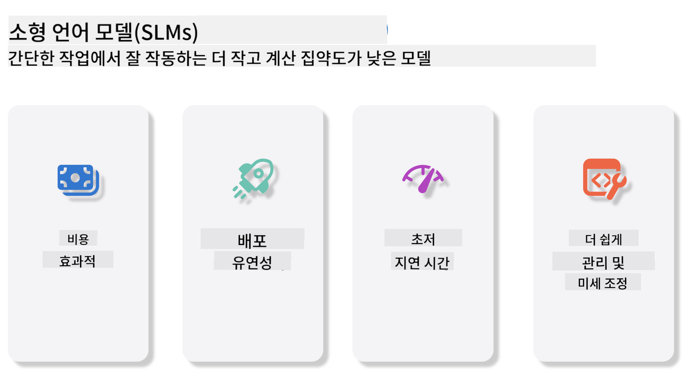
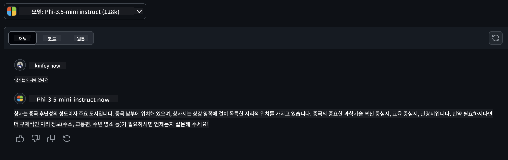

<!--
CO_OP_TRANSLATOR_METADATA:
{
  "original_hash": "124ad36cfe96f74038811b6e2bb93e9d",
  "translation_date": "2025-07-09T18:23:55+00:00",
  "source_file": "19-slm/README.md",
  "language_code": "ko"
}
-->
# 초보자를 위한 생성 AI용 소형 언어 모델 소개  
생성 AI는 새로운 콘텐츠를 생성할 수 있는 시스템을 만드는 데 중점을 둔 인공지능 분야로 매우 흥미롭습니다. 이 콘텐츠는 텍스트, 이미지, 음악부터 가상 환경 전체에 이르기까지 다양합니다. 생성 AI의 가장 흥미로운 응용 분야 중 하나는 언어 모델 영역입니다.

## 소형 언어 모델이란?  

소형 언어 모델(SLM)은 대형 언어 모델(LLM)의 축소 버전으로, LLM의 많은 아키텍처 원리와 기법을 활용하면서도 계산 자원 소모가 크게 줄어든 모델을 의미합니다.

SLM은 인간과 유사한 텍스트를 생성하도록 설계된 언어 모델의 하위 집합입니다. GPT-4와 같은 대형 모델과 달리, SLM은 더 작고 효율적이어서 계산 자원이 제한된 환경에 적합합니다. 크기는 작지만 다양한 작업을 수행할 수 있습니다. 일반적으로 SLM은 LLM을 압축하거나 증류하여 원래 모델의 기능과 언어 능력의 상당 부분을 유지하도록 만들어집니다. 모델 크기가 줄어들면서 복잡성이 감소해 메모리 사용량과 계산 요구량 면에서 효율성이 높아집니다. 이러한 최적화에도 불구하고 SLM은 다음과 같은 다양한 자연어 처리(NLP) 작업을 수행할 수 있습니다:

- 텍스트 생성: 일관성 있고 문맥에 맞는 문장이나 단락 생성  
- 텍스트 완성: 주어진 프롬프트를 바탕으로 문장 예측 및 완성  
- 번역: 한 언어에서 다른 언어로 텍스트 변환  
- 요약: 긴 텍스트를 짧고 이해하기 쉬운 요약으로 압축  

다만, 대형 모델에 비해 성능이나 이해 깊이에서 일부 타협이 있을 수 있습니다.

## 소형 언어 모델은 어떻게 작동하나요?  
SLM은 방대한 텍스트 데이터를 학습합니다. 학습 과정에서 언어의 패턴과 구조를 익혀 문법적으로 올바르고 문맥에 적합한 텍스트를 생성할 수 있게 됩니다. 학습 과정은 다음과 같습니다:

- 데이터 수집: 다양한 출처에서 대규모 텍스트 데이터 수집  
- 전처리: 학습에 적합하도록 데이터 정제 및 정리  
- 학습: 기계 학습 알고리즘을 사용해 텍스트 이해 및 생성 방법 학습  
- 미세 조정: 특정 작업에서 성능 향상을 위해 모델 조정  

SLM 개발은 모바일 기기나 엣지 컴퓨팅 플랫폼처럼 자원이 제한된 환경에 배포할 수 있는 모델에 대한 수요 증가와 맞물려 있습니다. 효율성에 중점을 둔 SLM은 성능과 접근성의 균형을 맞춰 다양한 분야에서 폭넓게 활용될 수 있습니다.



## 학습 목표  

이번 강의에서는 SLM에 대한 기본 지식을 소개하고 Microsoft Phi-3와 결합해 텍스트 콘텐츠, 비전, MoE의 다양한 시나리오를 학습하고자 합니다.

강의가 끝나면 다음 질문에 답할 수 있어야 합니다:

- SLM이란 무엇인가  
- SLM과 LLM의 차이점은 무엇인가  
- Microsoft Phi-3/3.5 Family란 무엇인가  
- Microsoft Phi-3/3.5 Family를 어떻게 추론하는가  

준비되셨나요? 시작해봅시다.

## 대형 언어 모델(LLM)과 소형 언어 모델(SLM)의 차이점  

LLM과 SLM 모두 확률적 기계 학습의 기본 원리에 기반하며, 아키텍처 설계, 학습 방법론, 데이터 생성 과정, 모델 평가 기법 등에서 유사한 접근 방식을 따릅니다. 하지만 두 모델을 구분하는 몇 가지 핵심 요소가 있습니다.

## 소형 언어 모델의 활용 분야  

SLM은 다음과 같은 다양한 분야에 활용됩니다:

- 챗봇: 고객 지원 제공 및 사용자와 대화형 상호작용  
- 콘텐츠 생성: 작가를 돕기 위한 아이디어 생성 또는 기사 초안 작성  
- 교육: 학생들의 글쓰기 과제 지원 및 새로운 언어 학습 보조  
- 접근성: 텍스트 음성 변환 시스템 등 장애인을 위한 도구 개발  

**크기**  

LLM과 SLM의 가장 큰 차이는 모델 규모에 있습니다. 예를 들어 ChatGPT(GPT-4)는 약 1.76조 개의 파라미터를 포함할 수 있지만, 오픈소스 SLM인 Mistral 7B는 약 70억 개의 파라미터로 훨씬 작습니다. 이러한 차이는 주로 모델 아키텍처와 학습 과정의 차이에서 비롯됩니다. 예를 들어 ChatGPT는 인코더-디코더 구조 내에서 자기 주의 메커니즘을 사용하는 반면, Mistral 7B는 디코더 전용 모델 내에서 슬라이딩 윈도우 어텐션을 사용해 더 효율적인 학습이 가능합니다. 이러한 아키텍처 차이는 모델의 복잡성과 성능에 큰 영향을 미칩니다.

**이해력**  

SLM은 특정 도메인 내에서 성능 최적화가 이루어져 전문화되어 있지만, 여러 분야에 걸친 폭넓은 문맥 이해 능력은 제한적일 수 있습니다. 반면 LLM은 방대한 다양성의 데이터로 학습되어 인간과 유사한 지능을 시뮬레이션하며, 다양한 도메인에서 뛰어난 적응력과 다재다능함을 보입니다. 따라서 LLM은 자연어 처리, 프로그래밍 등 광범위한 하위 작업에 더 적합합니다.

**계산 자원**  

LLM의 학습과 배포는 대규모 GPU 클러스터 등 막대한 계산 인프라를 필요로 합니다. 예를 들어 ChatGPT 같은 모델을 처음부터 학습하려면 수천 대의 GPU가 장기간 동원됩니다. 반면 SLM은 파라미터 수가 적어 상대적으로 적은 계산 자원으로도 접근이 가능합니다. Mistral 7B 같은 모델은 중간급 GPU가 장착된 로컬 머신에서도 학습 및 실행이 가능하지만, 학습에는 여전히 여러 GPU에서 수 시간이 소요됩니다.

**편향**  

LLM은 주로 인터넷에서 수집한 원시 데이터를 기반으로 학습하기 때문에 특정 집단이 과소 대표되거나 잘못 표현될 수 있으며, 잘못된 라벨링이나 방언, 지리적 차이, 문법 규칙에 따른 언어적 편향이 내재될 수 있습니다. 또한 복잡한 아키텍처가 편향을 악화시킬 수 있으며, 세심한 미세 조정 없이는 이를 발견하기 어렵습니다. 반면 SLM은 더 제한적이고 도메인 특화된 데이터로 학습되기 때문에 편향에 덜 민감하지만 완전히 자유로운 것은 아닙니다.

**추론 속도**  

SLM은 크기가 작아 추론 속도에서 큰 이점을 가지며, 로컬 하드웨어에서 효율적으로 결과를 생성할 수 있습니다. 반면 LLM은 크기와 복잡성 때문에 빠른 추론을 위해 대규모 병렬 계산 자원이 필요하며, 다수 사용자가 동시에 접근할 경우 응답 속도가 느려질 수 있습니다.

요약하자면, LLM과 SLM은 모두 기계 학습에 기반하지만 모델 크기, 자원 요구량, 문맥 이해력, 편향 민감도, 추론 속도에서 큰 차이를 보입니다. LLM은 다재다능하지만 자원 소모가 크고, SLM은 도메인 특화 효율성을 제공하며 계산 요구량이 적습니다.

***Note：이번 장에서는 Microsoft Phi-3 / 3.5를 예로 들어 SLM을 소개합니다.***

## Phi-3 / Phi-3.5 Family 소개  

Phi-3 / 3.5 Family는 주로 텍스트, 비전, 에이전트(MoE) 응용 시나리오를 대상으로 합니다:

### Phi-3 / 3.5 Instruct  

주로 텍스트 생성, 대화 완성, 콘텐츠 정보 추출 등에 사용됩니다.

**Phi-3-mini**  

3.8B 파라미터 언어 모델로 Microsoft Azure AI Studio, Hugging Face, Ollama에서 이용 가능합니다. Phi-3 모델은 주요 벤치마크에서 동급 또는 더 큰 모델을 크게 능가합니다(아래 벤치마크 수치 참고, 수치가 높을수록 우수). Phi-3-mini는 두 배 크기의 모델을 능가하며, Phi-3-small과 Phi-3-medium은 GPT-3.5를 포함한 더 큰 모델을 뛰어넘습니다.

**Phi-3-small & medium**  

7B 파라미터만으로도 Phi-3-small은 다양한 언어, 추론, 코딩, 수학 벤치마크에서 GPT-3.5T를 능가합니다.  
14B 파라미터의 Phi-3-medium은 이 추세를 이어가며 Gemini 1.0 Pro를 능가합니다.

**Phi-3.5-mini**  

Phi-3-mini의 업그레이드 버전으로, 파라미터 수는 동일하지만 다국어 지원 능력이 향상되었습니다(20개 이상의 언어 지원: 아랍어, 중국어, 체코어, 덴마크어, 네덜란드어, 영어, 핀란드어, 프랑스어, 독일어, 히브리어, 헝가리어, 이탈리아어, 일본어, 한국어, 노르웨이어, 폴란드어, 포르투갈어, 러시아어, 스페인어, 스웨덴어, 태국어, 터키어, 우크라이나어) 및 긴 문맥 지원이 강화되었습니다.  
3.8B 파라미터의 Phi-3.5-mini는 동급 모델을 능가하며 두 배 크기의 모델과도 비슷한 성능을 보입니다.

### Phi-3 / 3.5 Vision  

Phi-3/3.5의 Instruct 모델은 Phi의 이해 능력이라면, Vision은 Phi가 세상을 볼 수 있게 하는 눈과 같습니다.

**Phi-3-Vision**  

4.2B 파라미터만으로도 Claude-3 Haiku, Gemini 1.0 Pro V 같은 더 큰 모델을 일반 시각 추론, OCR, 표 및 도표 이해 작업에서 능가합니다.

**Phi-3.5-Vision**  

Phi-3-Vision의 업그레이드 버전으로 다중 이미지 지원이 추가되었습니다. 단순히 사진뿐 아니라 동영상도 볼 수 있는 향상된 비전 능력으로 생각할 수 있습니다.  
Phi-3.5-Vision은 OCR, 표 및 차트 이해 작업에서 Claude-3.5 Sonnet, Gemini 1.5 Flash 같은 더 큰 모델을 능가하며, 일반 시각 지식 추론 작업에서는 동등한 성능을 보입니다. 다중 프레임 입력을 지원해 여러 이미지에 대한 추론이 가능합니다.

### Phi-3.5-MoE  

***Mixture of Experts(MoE)***는 훨씬 적은 계산량으로 모델을 사전 학습할 수 있게 해주며, 동일한 계산 예산으로 모델이나 데이터셋 크기를 크게 확장할 수 있습니다. 특히 MoE 모델은 조밀한(dense) 모델과 동등한 품질을 훨씬 빠르게 사전 학습할 수 있습니다.

Phi-3.5-MoE는 16개의 3.8B 전문가 모듈로 구성되어 있으며, 활성 파라미터가 6.6B에 불과함에도 훨씬 큰 모델과 비슷한 수준의 추론, 언어 이해, 수학 능력을 달성합니다.

Phi-3/3.5 Family 모델은 다양한 시나리오에 맞게 사용할 수 있으며, LLM과 달리 Phi-3/3.5-mini 또는 Phi-3/3.5-Vision을 엣지 디바이스에 배포할 수 있습니다.

## Phi-3/3.5 Family 모델 사용법  

Phi-3/3.5를 다양한 시나리오에서 활용해보고자 합니다. 다음으로는 시나리오별로 Phi-3/3.5를 사용하는 방법을 살펴보겠습니다.


### 클라우드 API를 통한 추론 차이  

**GitHub Models**  

GitHub Models는 가장 직접적인 방법입니다. GitHub Models를 통해 Phi-3/3.5-Instruct 모델에 빠르게 접근할 수 있습니다. Azure AI Inference SDK 또는 OpenAI SDK와 결합하면 코드로 API를 호출해 Phi-3/3.5-Instruct를 사용할 수 있습니다. Playground를 통해 다양한 효과를 테스트할 수도 있습니다.

- 데모: 중국어 시나리오에서 Phi-3-mini와 Phi-3.5-mini 효과 비교




**Azure AI Studio**  

비전 및 MoE 모델을 사용하려면 Azure AI Studio를 통해 호출할 수 있습니다. 관심이 있다면 Phi-3 Cookbook을 참고해 Azure AI Studio를 통해 Phi-3/3.5 Instruct, Vision, MoE를 호출하는 방법을 배울 수 있습니다. [이 링크 클릭](https://github.com/microsoft/Phi-3CookBook/blob/main/md/02.QuickStart/AzureAIStudio_QuickStart.md?WT.mc_id=academic-105485-koreyst)

**NVIDIA NIM**  

Azure와 GitHub가 제공하는 클라우드 기반 모델 카탈로그 솔루션 외에도 [NVIDIA NIM](https://developer.nvidia.com/nim?WT.mc_id=academic-105485-koreyst)을 사용해 관련 호출을 수행할 수 있습니다. NVIDIA NIM(NVIDIA Inference Microservices)은 클라우드, 데이터 센터, 워크스테이션 등 다양한 환경에서 AI 모델을 효율적으로 배포할 수 있도록 돕는 가속화된 추론 마이크로서비스 세트입니다.

NVIDIA NIM의 주요 특징은 다음과 같습니다:

- **배포 용이성:** 단일 명령어로 AI 모델을 배포할 수 있어 기존 워크플로우에 쉽게 통합 가능  
- **최적화된 성능:** TensorRT, TensorRT-LLM 등 NVIDIA의 사전 최적화된 추론 엔진을 활용해 낮은 지연 시간과 높은 처리량 보장  
- **확장성:** Kubernetes에서 자동 확장을 지원해 다양한 작업 부하를 효과적으로 처리 가능
- **보안 및 제어:** 조직은 자체 관리 인프라에서 NIM 마이크로서비스를 자체 호스팅하여 데이터와 애플리케이션에 대한 통제권을 유지할 수 있습니다.
- **표준 API:** NIM은 업계 표준 API를 제공하여 챗봇, AI 어시스턴트 등과 같은 AI 애플리케이션을 쉽게 구축하고 통합할 수 있습니다.

NIM은 NVIDIA AI Enterprise의 일부로, AI 모델의 배포와 운영을 간소화하여 NVIDIA GPU에서 효율적으로 실행되도록 지원합니다.

- 데모: Nividia NIM을 사용하여 Phi-3.5-Vision-API 호출하기 [[이 링크 클릭](../../../19-slm/python/Phi-3-Vision-Nividia-NIM.ipynb)]


### 로컬 환경에서 Phi-3/3.5 추론하기
Phi-3 또는 GPT-3와 같은 언어 모델에서 추론이란, 입력받은 내용을 바탕으로 응답이나 예측을 생성하는 과정을 의미합니다. Phi-3에 프롬프트나 질문을 제공하면, 훈련된 신경망을 활용해 학습 데이터 내 패턴과 관계를 분석하여 가장 가능성 높고 적절한 응답을 도출합니다.

**Hugging Face Transformer**  
Hugging Face Transformers는 자연어 처리(NLP) 및 기타 머신러닝 작업을 위해 설계된 강력한 라이브러리입니다. 주요 특징은 다음과 같습니다:

1. **사전학습 모델:** 텍스트 분류, 개체명 인식, 질문 응답, 요약, 번역, 텍스트 생성 등 다양한 작업에 사용할 수 있는 수천 개의 사전학습 모델을 제공합니다.

2. **프레임워크 호환성:** PyTorch, TensorFlow, JAX 등 여러 딥러닝 프레임워크를 지원하여 한 프레임워크에서 모델을 학습시키고 다른 프레임워크에서 사용할 수 있습니다.

3. **멀티모달 기능:** NLP뿐만 아니라 컴퓨터 비전(예: 이미지 분류, 객체 탐지)과 오디오 처리(예: 음성 인식, 오디오 분류) 작업도 지원합니다.

4. **사용 편의성:** 모델 다운로드와 미세 조정을 쉽게 할 수 있는 API와 도구를 제공하여 초보자와 전문가 모두에게 접근성을 높였습니다.

5. **커뮤니티 및 자료:** 활발한 커뮤니티와 방대한 문서, 튜토리얼, 가이드가 있어 사용자가 쉽게 시작하고 라이브러리를 최대한 활용할 수 있도록 돕습니다.  
[공식 문서](https://huggingface.co/docs/transformers/index?WT.mc_id=academic-105485-koreyst) 또는 [GitHub 저장소](https://github.com/huggingface/transformers?WT.mc_id=academic-105485-koreyst) 참고.

가장 널리 사용되는 방법이지만 GPU 가속이 필요합니다. 특히 Vision과 MoE 같은 작업은 계산량이 많아 양자화하지 않으면 CPU에서 매우 제한적입니다.


- 데모: Transformer를 사용해 Phi-3.5-Instruct 호출하기 [이 링크 클릭](../../../19-slm/python/phi35-instruct-demo.ipynb)

- 데모: Transformer를 사용해 Phi-3.5-Vision 호출하기 [이 링크 클릭](../../../19-slm/python/phi35-vision-demo.ipynb)

- 데모: Transformer를 사용해 Phi-3.5-MoE 호출하기 [이 링크 클릭](../../../19-slm/python/phi35_moe_demo.ipynb)

**Ollama**  
[Ollama](https://ollama.com/?WT.mc_id=academic-105485-koreyst)는 대형 언어 모델(LLM)을 로컬에서 쉽게 실행할 수 있도록 설계된 플랫폼입니다. Llama 3.1, Phi 3, Mistral, Gemma 2 등 다양한 모델을 지원하며, 모델 가중치, 구성, 데이터를 하나의 패키지로 묶어 사용자 맞춤형 모델 생성과 실험을 간편하게 합니다. macOS, Linux, Windows에서 사용 가능하며, 클라우드 서비스에 의존하지 않고 LLM을 실험하거나 배포하려는 분들에게 적합한 도구입니다. Ollama는 가장 직접적인 방법으로, 다음 명령문만 실행하면 됩니다.


```bash

ollama run phi3.5

```


**ONNX Runtime for GenAI**

[ONNX Runtime](https://github.com/microsoft/onnxruntime-genai?WT.mc_id=academic-105485-koreyst)은 크로스 플랫폼 머신러닝 추론 및 학습 가속기입니다. ONNX Runtime for Generative AI(GENAI)는 다양한 플랫폼에서 생성 AI 모델을 효율적으로 실행할 수 있도록 돕는 강력한 도구입니다.

## ONNX Runtime이란?
ONNX Runtime은 머신러닝 모델의 고성능 추론을 가능하게 하는 오픈소스 프로젝트입니다. Open Neural Network Exchange(ONNX) 형식의 모델을 지원하며, PyTorch, TensorFlow/Keras 같은 딥러닝 프레임워크뿐 아니라 scikit-learn, LightGBM, XGBoost 등 전통적인 머신러닝 라이브러리의 모델도 지원합니다. 다양한 하드웨어, 드라이버, 운영체제와 호환되며, 하드웨어 가속기 활용과 그래프 최적화 및 변환을 통해 최적의 성능을 제공합니다.

## 생성 AI란?
생성 AI는 학습한 데이터를 바탕으로 텍스트, 이미지, 음악 등 새로운 콘텐츠를 생성하는 AI 시스템을 말합니다. 예를 들어 GPT-3 같은 언어 모델이나 Stable Diffusion 같은 이미지 생성 모델이 있습니다. ONNX Runtime for GenAI 라이브러리는 ONNX 모델을 위한 생성 AI 루프를 제공하며, ONNX Runtime을 통한 추론, 로짓 처리, 탐색 및 샘플링, KV 캐시 관리 등을 포함합니다.

## ONNX Runtime for GENAI
ONNX Runtime for GENAI는 ONNX Runtime의 기능을 확장하여 생성 AI 모델을 지원합니다. 주요 특징은 다음과 같습니다:

- **광범위한 플랫폼 지원:** Windows, Linux, macOS, Android, iOS 등 다양한 플랫폼에서 작동합니다.
- **모델 지원:** LLaMA, GPT-Neo, BLOOM 등 인기 있는 생성 AI 모델을 지원합니다.
- **성능 최적화:** NVIDIA GPU, AMD GPU 등 다양한 하드웨어 가속기를 위한 최적화를 포함합니다.
- **사용 편의성:** 애플리케이션에 쉽게 통합할 수 있는 API를 제공하여 최소한의 코드로 텍스트, 이미지 등 콘텐츠를 생성할 수 있습니다.
- 사용자는 고수준의 generate() 메서드를 호출하거나, 모델의 각 반복을 루프에서 실행해 한 번에 하나의 토큰을 생성하며, 필요에 따라 생성 파라미터를 루프 내에서 업데이트할 수 있습니다.
- ONNX Runtime은 탐욕적/빔 서치, TopP, TopK 샘플링을 지원하며, 반복 패널티 같은 내장 로짓 처리 기능도 제공합니다. 사용자 정의 점수화도 쉽게 추가할 수 있습니다.

## 시작하기
ONNX Runtime for GENAI를 시작하려면 다음 단계를 따르세요:

### ONNX Runtime 설치:
```Python
pip install onnxruntime
```
### 생성 AI 확장 설치:
```Python
pip install onnxruntime-genai
```

### 모델 실행: 간단한 Python 예제:
```Python
import onnxruntime_genai as og

model = og.Model('path_to_your_model.onnx')

tokenizer = og.Tokenizer(model)

input_text = "Hello, how are you?"

input_tokens = tokenizer.encode(input_text)

output_tokens = model.generate(input_tokens)

output_text = tokenizer.decode(output_tokens)

print(output_text) 
```
### 데모: ONNX Runtime GenAI를 사용해 Phi-3.5-Vision 호출하기


```python

import onnxruntime_genai as og

model_path = './Your Phi-3.5-vision-instruct ONNX Path'

img_path = './Your Image Path'

model = og.Model(model_path)

processor = model.create_multimodal_processor()

tokenizer_stream = processor.create_stream()

text = "Your Prompt"

prompt = "<|user|>\n"

prompt += "<|image_1|>\n"

prompt += f"{text}<|end|>\n"

prompt += "<|assistant|>\n"

image = og.Images.open(img_path)

inputs = processor(prompt, images=image)

params = og.GeneratorParams(model)

params.set_inputs(inputs)

params.set_search_options(max_length=3072)

generator = og.Generator(model, params)

while not generator.is_done():

    generator.compute_logits()
    
    generator.generate_next_token()

    new_token = generator.get_next_tokens()[0]
    
    code += tokenizer_stream.decode(new_token)
    
    print(tokenizer_stream.decode(new_token), end='', flush=True)

```


**기타**

ONNX Runtime과 Ollama 외에도, 다양한 제조사에서 제공하는 모델 참조 방식을 기반으로 양자화 모델을 완성할 수 있습니다. 예를 들어 Apple Metal과 함께 사용하는 Apple MLX 프레임워크, NPU와 함께하는 Qualcomm QNN, CPU/GPU용 Intel OpenVINO 등이 있습니다. 더 많은 내용은 [Phi-3 Cookbook](https://github.com/microsoft/phi-3cookbook?WT.mc_id=academic-105485-koreyst)에서 확인할 수 있습니다.


## 더 알아보기

Phi-3/3.5 패밀리의 기본을 배웠지만, SLM에 대해 더 깊이 이해하려면 추가 지식이 필요합니다. 답은 Phi-3 Cookbook에서 찾을 수 있습니다. 더 배우고 싶다면 [Phi-3 Cookbook](https://github.com/microsoft/phi-3cookbook?WT.mc_id=academic-105485-koreyst)을 방문해 주세요.

**면책 조항**:  
이 문서는 AI 번역 서비스 [Co-op Translator](https://github.com/Azure/co-op-translator)를 사용하여 번역되었습니다. 정확성을 위해 최선을 다하고 있으나, 자동 번역에는 오류나 부정확한 부분이 있을 수 있음을 유의하시기 바랍니다. 원문은 해당 언어의 원본 문서가 권위 있는 자료로 간주되어야 합니다. 중요한 정보의 경우 전문적인 인간 번역을 권장합니다. 본 번역 사용으로 인해 발생하는 오해나 잘못된 해석에 대해 당사는 책임을 지지 않습니다.