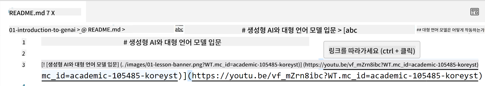
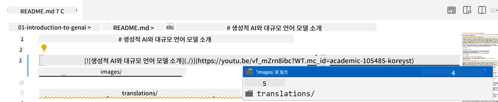
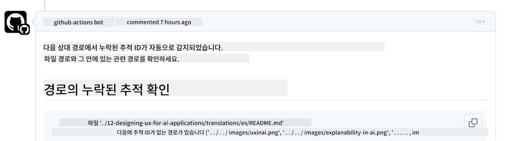
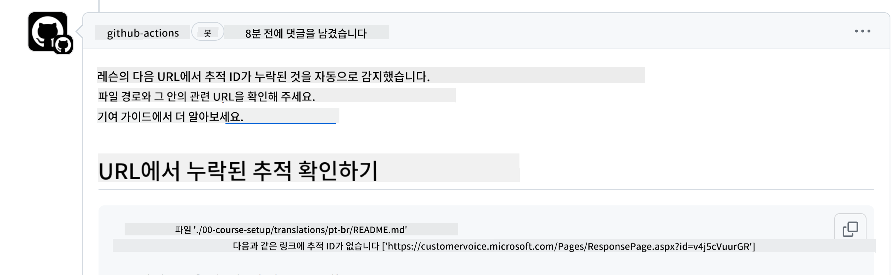
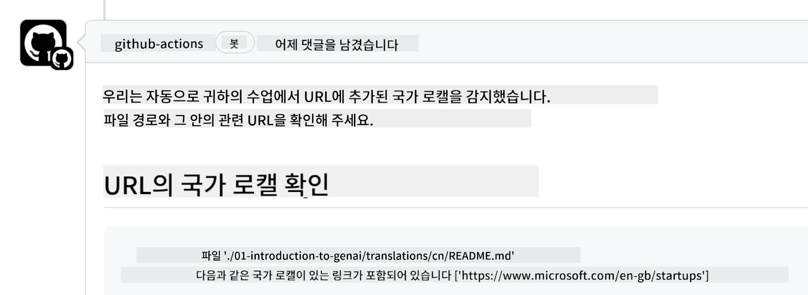

<!--
CO_OP_TRANSLATOR_METADATA:
{
  "original_hash": "57c41f2af71001a2cff9d8eb797cb843",
  "translation_date": "2025-06-25T07:04:35+00:00",
  "source_file": "CONTRIBUTING.md",
  "language_code": "ko"
}
-->
# 기여하기

이 프로젝트는 기여와 제안을 환영합니다. 대부분의 기여는 귀하가 기여자 라이선스 계약 (CLA)에 동의해야 합니다. 이는 귀하가 기여할 권리가 있으며, 실제로 귀하의 기여를 사용할 권리를 우리에게 부여한다는 것을 선언하는 것입니다. 자세한 내용은 <https://cla.microsoft.com>를 방문하십시오.

> 중요: 이 저장소의 텍스트를 번역할 때는 기계 번역을 사용하지 마십시오. 우리는 커뮤니티를 통해 번역을 검증할 것이므로, 귀하가 능숙한 언어에 대해서만 번역을 자원해 주시기 바랍니다.

풀 리퀘스트를 제출하면, CLA 봇이 자동으로 귀하가 CLA를 제공해야 하는지 여부를 결정하고 PR을 적절하게 장식합니다 (예: 레이블, 댓글). 봇이 제공하는 지침을 따르기만 하면 됩니다. 이는 우리 CLA를 사용하는 모든 저장소에 대해 한 번만 하면 됩니다.

## 행동 강령

이 프로젝트는 [Microsoft 오픈 소스 행동 강령](https://opensource.microsoft.com/codeofconduct/?WT.mc_id=academic-105485-koreyst)을 채택했습니다. 자세한 정보는 [행동 강령 FAQ](https://opensource.microsoft.com/codeofconduct/faq/?WT.mc_id=academic-105485-koreyst)를 읽거나 추가 질문이나 의견이 있으면 [opencode@microsoft.com](mailto:opencode@microsoft.com)으로 문의하십시오.

## 질문이나 문제?

일반적인 지원 질문에 대해 GitHub 이슈를 열지 마십시오. GitHub 목록은 기능 요청 및 버그 보고에 사용되어야 합니다. 이렇게 하면 실제 코드의 문제나 버그를 더 쉽게 추적하고 일반적인 논의를 실제 코드와 분리할 수 있습니다.

## 오타, 문제, 버그 및 기여

초보자를 위한 생성 AI 저장소에 변경 사항을 제출할 때는 다음 권장 사항을 따르십시오.

* 변경 사항을 만들기 전에 항상 저장소를 자신의 계정으로 포크하십시오.
* 여러 변경 사항을 하나의 풀 리퀘스트로 결합하지 마십시오. 예를 들어, 버그 수정 및 문서 업데이트는 별도의 PR을 사용하여 제출하십시오.
* 풀 리퀘스트에 병합 충돌이 표시되면, 수정하기 전에 로컬 메인을 메인 저장소와 동기화하십시오.
* 번역을 제출할 경우, 모든 번역된 파일에 대해 하나의 PR을 작성하십시오. 콘텐츠의 부분 번역은 허용하지 않습니다.
* 오타나 문서 수정을 제출할 경우, 적절한 경우 수정 사항을 하나의 PR로 결합할 수 있습니다.

## 작성에 대한 일반적인 지침

- 모든 URL이 대괄호로 묶여 있고 그 뒤에 괄호가 있으며, 그 주위에 여분의 공백이 없도록 하십시오 ``.
- 모든 상대 링크(즉, 저장소 내의 다른 파일 및 폴더에 대한 링크)가 현재 작업 디렉토리에 있는 파일이나 폴더를 참조하는 `./`로 시작하거나 상위 작업 디렉토리에 있는 파일이나 폴더를 참조하는 `../`로 시작하도록 하십시오.
- 모든 상대 링크(즉, 저장소 내의 다른 파일 및 폴더에 대한 링크)에 추적 ID(즉, `?` 또는 `&` 그리고 `wt.mc_id=` 또는 `WT.mc_id=`)가 끝에 있도록 하십시오.
- _github.com, microsoft.com, visualstudio.com, aka.ms, azure.com_ 도메인의 모든 URL에 추적 ID(즉, `?` 또는 `&` 그리고 `wt.mc_id=` 또는 `WT.mc_id=`)가 끝에 있도록 하십시오.
- 링크에 국가별 로케일이 포함되지 않도록 하십시오 (즉, `/en-us/` 또는 `/en/`).
- 모든 이미지는 `./images` 폴더에 저장되도록 하십시오.
- 이미지에는 영어 문자, 숫자, 대시를 사용하여 설명적인 이름이 있어야 합니다.

## GitHub 워크플로우

풀 리퀘스트를 제출하면, 이전 규칙을 검증하기 위해 네 가지 다른 워크플로우가 실행됩니다. 여기 나열된 지침을 따라 워크플로우 검사를 통과하십시오.

- [깨진 상대 경로 확인](../..)
- [경로에 추적이 있는지 확인](../..)
- [URL에 추적이 있는지 확인](../..)
- [URL에 로케일이 없는지 확인](../..)

### 깨진 상대 경로 확인

이 워크플로우는 파일의 상대 경로가 작동하는지 확인합니다. 이 저장소는 GitHub 페이지에 배포되므로 모든 링크가 올바른 위치로 연결되도록 주의해야 합니다.

링크가 제대로 작동하는지 확인하려면 VS 코드로 링크를 확인하십시오.

예를 들어, 파일의 링크 위로 마우스를 가져가면 **ctrl + click**으로 링크를 따라가도록 프롬프트가 표시됩니다.

링크를 클릭했는데 로컬에서 작동하지 않으면 워크플로우가 트리거되고 GitHub에서도 작동하지 않을 것입니다.

이 문제를 해결하려면 VS 코드의 도움으로 링크를 입력하십시오.

`./` 또는 `../`를 입력하면 VS 코드가 입력한 내용에 따라 사용 가능한 옵션을 선택하도록 프롬프트를 표시합니다.

원하는 파일이나 폴더를 클릭하여 경로를 따라가면 경로가 깨지지 않았음을 확인할 수 있습니다.

올바른 상대 경로를 추가한 후 저장하고 변경 사항을 푸시하면 워크플로우가 다시 트리거되어 변경 사항을 검증합니다. 검사를 통과하면 준비가 완료된 것입니다.

### 경로에 추적이 있는지 확인

이 워크플로우는 모든 상대 경로에 추적이 있는지 확인합니다. 이 저장소는 GitHub 페이지에 배포되므로 다른 파일과 폴더 간의 이동을 추적해야 합니다.

상대 경로에 추적이 있는지 확인하려면 경로 끝에 `?wt.mc_id=` 텍스트가 있는지 확인하십시오. 상대 경로에 추가되어 있으면 이 검사를 통과할 것입니다.

그렇지 않으면 다음과 같은 오류가 발생할 수 있습니다.

이 문제를 해결하려면 워크플로우가 강조 표시한 파일 경로를 열고 상대 경로 끝에 추적 ID를 추가하십시오.

추적 ID를 추가한 후 저장하고 변경 사항을 푸시하면 워크플로우가 다시 트리거되어 변경 사항을 검증합니다. 검사를 통과하면 준비가 완료된 것입니다.

### URL에 추적이 있는지 확인

이 워크플로우는 모든 웹 URL에 추적이 있는지 확인합니다. 이 저장소는 모든 사람에게 공개되어 있으므로 트래픽이 어디서 오는지 알 수 있도록 추적해야 합니다.

URL에 추적이 있는지 확인하려면 URL 끝에 `?wt.mc_id=` 텍스트가 있는지 확인하십시오. URL에 추가되어 있으면 이 검사를 통과할 것입니다.

그렇지 않으면 다음과 같은 오류가 발생할 수 있습니다.

이 문제를 해결하려면 워크플로우가 강조 표시한 파일 경로를 열고 URL 끝에 추적 ID를 추가하십시오.

추적 ID를 추가한 후 저장하고 변경 사항을 푸시하면 워크플로우가 다시 트리거되어 변경 사항을 검증합니다. 검사를 통과하면 준비가 완료된 것입니다.

### URL에 로케일이 없는지 확인

이 워크플로우는 모든 웹 URL에 국가별 로케일이 없는지 확인합니다. 이 저장소는 전 세계 모든 사람에게 공개되어 있으므로 URL에 국가 로케일을 포함하지 않도록 해야 합니다.

URL에 국가 로케일이 없는지 확인하려면 URL 어디에도 `/en-us/` 또는 `/en/` 또는 기타 언어 로케일이 없는지 확인하십시오. URL에 없다면 이 검사를 통과할 것입니다.

그렇지 않으면 다음과 같은 오류가 발생할 수 있습니다.

이 문제를 해결하려면 워크플로우가 강조 표시한 파일 경로를 열고 URL에서 국가 로케일을 제거하십시오.

국가 로케일을 제거한 후 저장하고 변경 사항을 푸시하면 워크플로우가 다시 트리거되어 변경 사항을 검증합니다. 검사를 통과하면 준비가 완료된 것입니다.

축하합니다! 귀하의 기여에 대한 피드백을 최대한 빨리 드리겠습니다.

**면책 조항**:  
이 문서는 AI 번역 서비스 [Co-op Translator](https://github.com/Azure/co-op-translator)를 사용하여 번역되었습니다. 정확성을 위해 노력하고 있지만, 자동 번역에는 오류나 부정확한 부분이 있을 수 있음을 유의하시기 바랍니다. 원본 문서의 원어가 권위 있는 자료로 간주되어야 합니다. 중요한 정보의 경우, 전문적인 인간 번역을 권장합니다. 이 번역 사용으로 인해 발생하는 오해나 잘못된 해석에 대해서는 책임을 지지 않습니다.