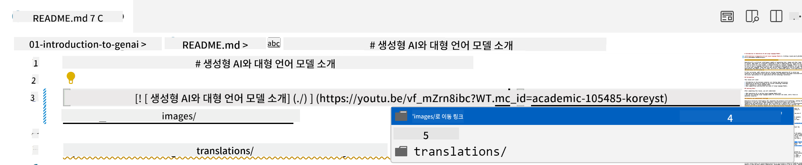
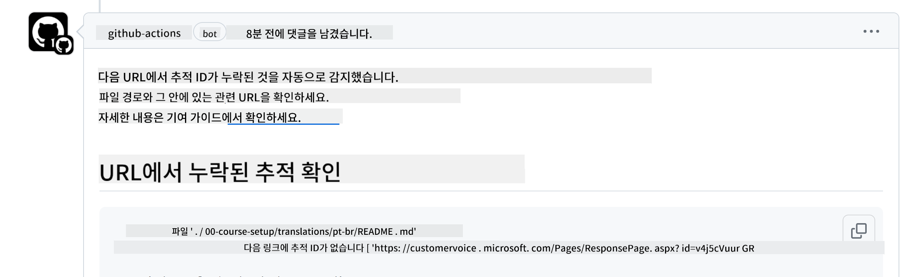
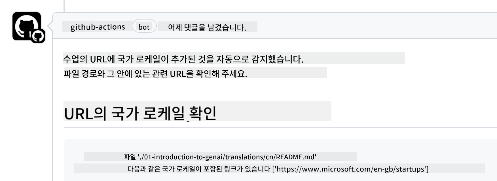

<!--
CO_OP_TRANSLATOR_METADATA:
{
  "original_hash": "57c41f2af71001a2cff9d8eb797cb843",
  "translation_date": "2025-07-09T05:51:06+00:00",
  "source_file": "CONTRIBUTING.md",
  "language_code": "ko"
}
-->
# 기여하기

이 프로젝트는 기여와 제안을 환영합니다. 대부분의 기여는 기여자가 자신의 기여물을 사용할 권리를 실제로 보유하고 있음을 선언하는 기여자 라이선스 계약(CLA)에 동의해야 합니다. 자세한 내용은 <https://cla.microsoft.com>을 참조하세요.

> 중요: 이 저장소의 텍스트를 번역할 때는 기계 번역을 사용하지 마세요. 커뮤니티를 통해 번역을 검증하므로, 능숙한 언어에 대해서만 번역 자원봉사를 해주시기 바랍니다.

풀 리퀘스트를 제출하면 CLA-bot이 자동으로 CLA 제출 필요 여부를 판단하고 PR에 적절한 표시(예: 라벨, 댓글)를 추가합니다. 봇의 안내에 따라 진행하면 되며, CLA는 모든 저장소에서 한 번만 제출하면 됩니다.

## 행동 강령

이 프로젝트는 [Microsoft Open Source Code of Conduct](https://opensource.microsoft.com/codeofconduct/?WT.mc_id=academic-105485-koreyst)를 채택하고 있습니다.  
자세한 내용은 [행동 강령 FAQ](https://opensource.microsoft.com/codeofconduct/faq/?WT.mc_id=academic-105485-koreyst)를 읽거나 추가 질문이나 의견이 있으면 [opencode@microsoft.com](mailto:opencode@microsoft.com)으로 연락해 주세요.

## 질문이나 문제 있나요?

일반적인 지원 질문은 GitHub 이슈로 열지 말아 주세요. GitHub 이슈는 기능 요청과 버그 보고용으로 사용됩니다. 이렇게 하면 실제 코드 문제나 버그를 더 쉽게 추적할 수 있고, 일반 토론과 코드를 분리할 수 있습니다.

## 오타, 문제, 버그 및 기여

Generative AI for Beginners 저장소에 변경 사항을 제출할 때는 다음 권장 사항을 따라 주세요.

* 수정하기 전에 항상 저장소를 자신의 계정으로 포크하세요.
* 여러 변경 사항을 한 PR에 합치지 마세요. 예를 들어, 버그 수정과 문서 업데이트는 별도의 PR로 제출하세요.
* PR에 병합 충돌이 발생하면, 수정하기 전에 로컬 main 브랜치를 원본 저장소의 main과 동기화하세요.
* 번역을 제출할 경우, 부분 번역은 받지 않으니 모든 번역 파일을 하나의 PR로 제출하세요.
* 오타나 문서 수정은 적절한 경우 한 PR에 여러 수정을 합쳐 제출할 수 있습니다.

## 작성 시 일반 지침

- 모든 URL은 대괄호로 감싸고 바로 뒤에 괄호를 붙여야 하며, 그 사이에 공백이 없어야 합니다 ``.
- 저장소 내 다른 파일이나 폴더로 연결되는 상대 링크는 현재 작업 디렉터리 내 파일이나 폴더를 가리키는 `./` 또는 상위 디렉터리를 가리키는 `../`로 시작해야 합니다.
- 모든 상대 링크는 끝에 추적 ID(예: `?` 또는 `&` 다음에 `wt.mc_id=` 또는 `WT.mc_id=`)가 포함되어야 합니다.
- _github.com, microsoft.com, visualstudio.com, aka.ms, azure.com_ 도메인의 모든 URL에도 추적 ID가 포함되어야 합니다.
- 링크에 국가별 로케일(예: `/en-us/` 또는 `/en/`)이 포함되어 있지 않은지 확인하세요.
- 모든 이미지는 `./images` 폴더에 저장되어야 합니다.
- 이미지 파일명은 영어 문자, 숫자, 대시(-)를 사용해 설명적으로 작성하세요.

## GitHub 워크플로우

풀 리퀘스트를 제출하면 네 가지 워크플로우가 실행되어 위 규칙들을 검증합니다.  
워크플로우 검증을 통과하려면 아래 안내를 따라 주세요.

- [손상된 상대 경로 확인](../..)
- [경로에 추적 정보 포함 여부 확인](../..)
- [URL에 추적 정보 포함 여부 확인](../..)
- [URL에 로케일 포함 여부 확인](../..)

### 손상된 상대 경로 확인

이 워크플로우는 파일 내 상대 경로가 올바른지 확인합니다.  
이 저장소는 GitHub Pages에 배포되므로, 링크를 잘못 입력하면 잘못된 위치로 연결될 수 있어 주의가 필요합니다.

링크가 제대로 작동하는지 확인하려면 VS Code를 사용하세요.

예를 들어, 파일 내 링크 위에 마우스를 올리면 **ctrl + 클릭**으로 링크를 따라갈 수 있다는 안내가 표시됩니다.

링크를 클릭했을 때 로컬에서 작동하지 않으면 워크플로우가 실패하고 GitHub에서도 작동하지 않습니다.

이 문제를 해결하려면 VS Code의 도움을 받아 링크를 입력해 보세요.

`./` 또는 `../`를 입력하면 VS Code가 가능한 경로 목록을 보여줍니다.

원하는 파일이나 폴더를 클릭해 경로를 선택하면 경로가 올바른지 확신할 수 있습니다.

올바른 상대 경로를 입력한 후 저장하고 변경 사항을 푸시하면 워크플로우가 다시 실행되어 검증합니다.  
검증을 통과하면 문제없이 진행할 수 있습니다.

### 경로에 추적 정보 포함 여부 확인

이 워크플로우는 모든 상대 경로에 추적 정보가 포함되어 있는지 확인합니다.  
GitHub Pages에 배포된 저장소이므로 파일과 폴더 간 이동을 추적해야 합니다.

상대 경로 끝에 `?wt.mc_id=`가 포함되어 있는지 확인하세요.  
포함되어 있으면 이 검사를 통과합니다.

포함되어 있지 않으면 다음과 같은 오류가 발생할 수 있습니다.

이 문제를 해결하려면 워크플로우가 지적한 파일 경로를 열고 상대 경로 끝에 추적 ID를 추가하세요.

추적 ID를 추가한 후 저장하고 변경 사항을 푸시하면 워크플로우가 다시 실행되어 검증합니다.  
검증을 통과하면 문제없이 진행할 수 있습니다.

### URL에 추적 정보 포함 여부 확인

이 워크플로우는 모든 웹 URL에 추적 정보가 포함되어 있는지 확인합니다.  
이 저장소는 누구나 접근할 수 있으므로 트래픽 출처를 파악하기 위해 추적이 필요합니다.

URL 끝에 `?wt.mc_id=`가 포함되어 있는지 확인하세요.  
포함되어 있으면 이 검사를 통과합니다.

포함되어 있지 않으면 다음과 같은 오류가 발생할 수 있습니다.

이 문제를 해결하려면 워크플로우가 지적한 파일 경로를 열고 URL 끝에 추적 ID를 추가하세요.

추적 ID를 추가한 후 저장하고 변경 사항을 푸시하면 워크플로우가 다시 실행되어 검증합니다.  
검증을 통과하면 문제없이 진행할 수 있습니다.

### URL에 로케일 포함 여부 확인

이 워크플로우는 모든 웹 URL에 국가별 로케일이 포함되어 있지 않은지 확인합니다.  
이 저장소는 전 세계 누구나 접근할 수 있으므로 URL에 특정 국가 로케일을 포함하지 않아야 합니다.

URL에 `/en-us/`, `/en/` 또는 기타 언어 로케일이 포함되어 있는지 확인하세요.  
포함되어 있지 않으면 이 검사를 통과합니다.

포함되어 있으면 다음과 같은 오류가 발생할 수 있습니다.

이 문제를 해결하려면 워크플로우가 지적한 파일 경로를 열고 URL에서 국가별 로케일을 제거하세요.

로케일을 제거한 후 저장하고 변경 사항을 푸시하면 워크플로우가 다시 실행되어 검증합니다.  
검증을 통과하면 문제없이 진행할 수 있습니다.

축하합니다! 기여에 대한 피드백을 최대한 빨리 드리겠습니다.

**면책 조항**:  
이 문서는 AI 번역 서비스 [Co-op Translator](https://github.com/Azure/co-op-translator)를 사용하여 번역되었습니다. 정확성을 위해 노력하고 있으나, 자동 번역에는 오류나 부정확한 부분이 있을 수 있음을 유의하시기 바랍니다. 원문은 해당 언어의 원본 문서가 권위 있는 출처로 간주되어야 합니다. 중요한 정보의 경우 전문적인 인간 번역을 권장합니다. 본 번역 사용으로 인해 발생하는 오해나 잘못된 해석에 대해 당사는 책임을 지지 않습니다.