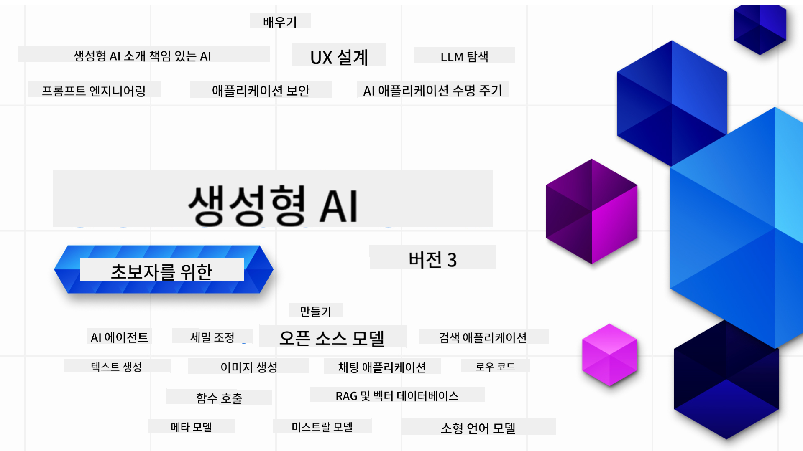

<!--
CO_OP_TRANSLATOR_METADATA:
{
  "original_hash": "c2ee25895ebbfa1a52868bb6eab686fc",
  "translation_date": "2025-05-19T10:57:17+00:00",
  "source_file": "README.md",
  "language_code": "ko"
}
-->

### 생성 AI 애플리케이션을 시작하는 데 필요한 모든 것을 가르치는 21개의 레슨

### 🌐 다국어 지원

#### GitHub Action을 통해 지원됨 (자동 및 항상 최신 상태)
[프랑스어](../fr/README.md) | [스페인어](../es/README.md) | [독일어](../de/README.md) | [러시아어](../ru/README.md) | [아랍어](../ar/README.md) | [페르시아어 (파르시)](../fa/README.md) | [우르두어](../ur/README.md) | [중국어 (간체)](../zh/README.md) | [중국어 (번체, 마카오)](../mo/README.md) | [중국어 (번체, 홍콩)](../hk/README.md) | [중국어 (번체, 대만)](../tw/README.md) | [일본어](../ja/README.md) | [한국어](./README.md) | [힌디어](../hi/README.md) | [벵골어](../bn/README.md) | [마라티어](../mr/README.md) | [네팔어](../ne/README.md) | [펀자브어 (구르무키)](../pa/README.md) | [포르투갈어 (포르투갈)](../pt/README.md) | [포르투갈어 (브라질)](../br/README.md) | [이탈리아어](../it/README.md) | [폴란드어](../pl/README.md) | [터키어](../tr/README.md) | [그리스어](../el/README.md) | [태국어](../th/README.md) | [스웨덴어](../sv/README.md) | [덴마크어](../da/README.md) | [노르웨이어](../no/README.md) | [핀란드어](../fi/README.md) | [네덜란드어](../nl/README.md) | [히브리어](../he/README.md) | [베트남어](../vi/README.md) | [인도네시아어](../id/README.md) | [말레이어](../ms/README.md) | [타갈로그어 (필리핀어)](../tl/README.md) | [스와힐리어](../sw/README.md) | [헝가리어](../hu/README.md) | [체코어](../cs/README.md) | [슬로바키아어](../sk/README.md) | [루마니아어](../ro/README.md) | [불가리아어](../bg/README.md) | [세르비아어 (키릴)](../sr/README.md) | [크로아티아어](../hr/README.md) | [슬로베니아어](../sl/README.md)
# 초보자를 위한 생성형 AI (버전 3) - 강좌

Microsoft Cloud Advocates의 21개 레슨 종합 강좌를 통해 생성형 AI 애플리케이션을 구축하는 기초를 배워보세요.

## 🌱 시작하기

이 강좌는 총 21개의 레슨으로 구성되어 있습니다. 각 레슨은 독립적인 주제를 다루고 있으니 원하는 곳에서 시작하세요!

레슨은 생성형 AI 개념을 설명하는 "Learn" 레슨과 가능한 경우 **Python** 및 **TypeScript** 코드 예제를 포함하여 개념을 설명하는 "Build" 레슨으로 나뉩니다.

.NET 개발자를 위해 [초보자를 위한 생성형 AI (.NET Edition)](https://github.com/microsoft/Generative-AI-for-beginners-dotnet?WT.mc_id=academic-105485-koreyst)를 확인하세요!

각 레슨에는 추가 학습 도구가 포함된 "계속 학습하기" 섹션도 포함되어 있습니다.

## 필요 사항
### 이 강좌의 코드를 실행하려면 다음을 사용할 수 있습니다:
 - [Azure OpenAI Service](https://aka.ms/genai-beginners/azure-open-ai?WT.mc_id=academic-105485-koreyst) - **레슨:** "aoai-assignment"
 - [GitHub Marketplace Model Catalog](https://aka.ms/genai-beginners/gh-models?WT.mc_id=academic-105485-koreyst) - **레슨:** "githubmodels"
 - [OpenAI API](https://aka.ms/genai-beginners/open-ai?WT.mc_id=academic-105485-koreyst) - **레슨:** "oai-assignment" 
   
- Python 또는 TypeScript의 기본 지식이 도움이 됩니다 - \*절대 초보자를 위해 이 [Python](https://aka.ms/genai-beginners/python?WT.mc_id=academic-105485-koreyst) 및 [TypeScript](https://aka.ms/genai-beginners/typescript?WT.mc_id=academic-105485-koreyst) 강좌를 확인하세요
- 자신의 GitHub 계정에 [이 전체 저장소를 포크](https://aka.ms/genai-beginners/github?WT.mc_id=academic-105485-koreyst)하려면 GitHub 계정이 필요합니다

개발 환경 설정에 도움이 되는 **[강좌 설정](./00-course-setup/README.md?WT.mc_id=academic-105485-koreyst)** 레슨을 준비했습니다.

나중에 쉽게 찾을 수 있도록 [이 저장소에 별표(🌟)를 추가](https://docs.github.com/en/get-started/exploring-projects-on-github/saving-repositories-with-stars?WT.mc_id=academic-105485-koreyst)하는 것을 잊지 마세요.

## 🧠 배포 준비 완료?

더 고급 코드 샘플을 찾고 있다면 **Python** 및 **TypeScript**로 작성된 [생성형 AI 코드 샘플 모음](https://aka.ms/genai-beg-code?WT.mc_id=academic-105485-koreyst)을 확인하세요.

## 🗣️ 다른 학습자 만나기, 지원 받기

이 강좌를 수강하는 다른 학습자들과 만나고 네트워크를 형성하며 지원을 받을 수 있는 [공식 Azure AI Foundry Discord 서버](https://aka.ms/genai-discord?WT.mc_id=academic-105485-koreyst)에 가입하세요.

GitHub의 [Azure AI Foundry Developer Forum](https://aka.ms/azureaifoundry/forum)에서 질문을 하거나 제품 피드백을 공유하세요.

## 🚀 스타트업을 구축 중이신가요?

[Microsoft for Startups Founders Hub](https://aka.ms/genai-foundershub?WT.mc_id=academic-105485-koreyst)에 가입하여 **무료 OpenAI 크레딧**과 **Azure OpenAI Services를 통해 OpenAI 모델에 액세스할 수 있는 Azure 크레딧 최대 $150k**를 받으세요.

## 🙏 도움을 주고 싶으신가요?

제안이 있거나 철자 또는 코드 오류를 발견하셨나요? [문제를 제기](https://github.com/microsoft/generative-ai-for-beginners/issues?WT.mc_id=academic-105485-koreyst)하거나 [풀 리퀘스트 생성](https://github.com/microsoft/generative-ai-for-beginners/pulls?WT.mc_id=academic-105485-koreyst)을 해주세요.

## 📂 각 레슨에는 다음이 포함됩니다:

- 주제에 대한 짧은 비디오 소개
- README에 위치한 작성된 레슨
- Azure OpenAI 및 OpenAI API를 지원하는 Python 및 TypeScript 코드 샘플
- 학습을 계속할 수 있는 추가 리소스 링크

## 🗃️ 레슨

| #   | **레슨 링크**                                                                                                                              | **설명**                                                                                 | **비디오**                                                                   | **추가 학습**                                                             |
| --- | -------------------------------------------------------------------------------------------------------------------------------------------- | ----------------------------------------------------------------------------------------------- | --------------------------------------------------------------------------- | ------------------------------------------------------------------------------ |
| 00  | [강좌 설정](./00-course-setup/README.md?WT.mc_id=academic-105485-koreyst)                                                                 | **학습:** 개발 환경 설정 방법                                            | 곧 비디오 제공                                                                 | [더 알아보기](https://aka.ms/genai-collection?WT.mc_id=academic-105485-koreyst) |
| 01  | [생성형 AI 및 LLM 소개](./01-introduction-to-genai/README.md?WT.mc_id=academic-105485-koreyst)                              | **학습:** 생성형 AI가 무엇인지와 대규모 언어 모델(LLM)이 어떻게 작동하는지 이해하기       | [비디오](https://aka.ms/gen-ai-lesson-1-gh?WT.mc_id=academic-105485-koreyst) | [더 알아보기](https://aka.ms/genai-collection?WT.mc_id=academic-105485-koreyst) |
| 02  | [다양한 LLM 탐색 및 비교](./02-exploring-and-comparing-different-llms/README.md?WT.mc_id=academic-105485-koreyst)             | **학습:** 사용 사례에 맞는 올바른 모델 선택 방법                                      | [비디오](https://aka.ms/gen-ai-lesson2-gh?WT.mc_id=academic-105485-koreyst)  | [더 알아보기](https://aka.ms/genai-collection?WT.mc_id=academic-105485-koreyst) |
| 03  | [책임감 있게 생성형 AI 사용하기](./03-using-generative-ai-responsibly/README.md?WT.mc_id=academic-105485-koreyst)                           | **학습:** 책임감 있게 생성형 AI 애플리케이션 구축하기                                  | [비디오](https://aka.ms/gen-ai-lesson3-gh?WT.mc_id=academic-105485-koreyst)  | [더 알아보기](https://aka.ms/genai-collection?WT.mc_id=academic-105485-koreyst) |
| 04  | [프롬프트 엔지니어링 기초 이해하기](./04-prompt-engineering-fundamentals/README.md?WT.mc_id=academic-105485-koreyst)             | **학습:** 프롬프트 엔지니어링 모범 사례 실습                                           | [비디오](https://aka.ms/gen-ai-lesson4-gh?WT.mc_id=academic-105485-koreyst)  | [더 알아보기](https://aka.ms/genai-collection?WT.mc_id=academic-105485-koreyst) |
| 05  | [고급 프롬프트 생성](./05-advanced-prompts/README.md?WT.mc_id=academic-105485-koreyst)                                                | **학습:** 프롬프트의 결과를 개선하는 프롬프트 엔지니어링 기술을 적용하는 방법 | [비디오](https://aka.ms/gen-ai-lesson5-gh?WT.mc_id=academic-105485-koreyst)  | [자세히 알아보기](https://aka.ms/genai-collection?WT.mc_id=academic-105485-koreyst) |
| 06  | [텍스트 생성 애플리케이션 구축](./06-text-generation-apps/README.md?WT.mc_id=academic-105485-koreyst)                                | **구축:** Azure OpenAI / OpenAI API를 사용한 텍스트 생성 앱                                | [비디오](https://aka.ms/gen-ai-lesson6-gh?WT.mc_id=academic-105485-koreyst)  | [자세히 알아보기](https://aka.ms/genai-collection?WT.mc_id=academic-105485-koreyst) |
| 07  | [채팅 애플리케이션 구축](./07-building-chat-applications/README.md?WT.mc_id=academic-105485-koreyst)                                     | **구축:** 효율적으로 채팅 애플리케이션을 구축하고 통합하는 기술               | [비디오](https://aka.ms/gen-ai-lessons7-gh?WT.mc_id=academic-105485-koreyst) | [자세히 알아보기](https://aka.ms/genai-collection?WT.mc_id=academic-105485-koreyst) |
| 08  | [검색 앱 벡터 데이터베이스 구축](./08-building-search-applications/README.md?WT.mc_id=academic-105485-koreyst)                        | **구축:** 임베딩을 사용하여 데이터를 검색하는 검색 애플리케이션                        | [비디오](https://aka.ms/gen-ai-lesson8-gh?WT.mc_id=academic-105485-koreyst)  | [자세히 알아보기](https://aka.ms/genai-collection?WT.mc_id=academic-105485-koreyst) |
| 09  | [이미지 생성 애플리케이션 구축](./09-building-image-applications/README.md?WT.mc_id=academic-105485-koreyst)                        | **구축:** 이미지 생성 애플리케이션                                                       | [비디오](https://aka.ms/gen-ai-lesson9-gh?WT.mc_id=academic-105485-koreyst)  | [자세히 알아보기](https://aka.ms/genai-collection?WT.mc_id=academic-105485-koreyst) |
| 10  | [로우 코드 AI 애플리케이션 구축](./10-building-low-code-ai-applications/README.md?WT.mc_id=academic-105485-koreyst)                       | **구축:** 로우 코드 도구를 사용한 생성 AI 애플리케이션                                     | [비디오](https://aka.ms/gen-ai-lesson10-gh?WT.mc_id=academic-105485-koreyst) | [자세히 알아보기](https://aka.ms/genai-collection?WT.mc_id=academic-105485-koreyst) |
| 11  | [함수 호출로 외부 애플리케이션 통합](./11-integrating-with-function-calling/README.md?WT.mc_id=academic-105485-koreyst) | **구축:** 함수 호출이란 무엇이며 애플리케이션에서의 사용 사례                          | [비디오](https://aka.ms/gen-ai-lesson11-gh?WT.mc_id=academic-105485-koreyst) | [자세히 알아보기](https://aka.ms/genai-collection?WT.mc_id=academic-105485-koreyst) |
| 12  | [AI 애플리케이션을 위한 UX 설계](./12-designing-ux-for-ai-applications/README.md?WT.mc_id=academic-105485-koreyst)                         | **학습:** 생성 AI 애플리케이션 개발 시 UX 설계 원칙 적용 방법         | [비디오](https://aka.ms/gen-ai-lesson12-gh?WT.mc_id=academic-105485-koreyst) | [자세히 알아보기](https://aka.ms/genai-collection?WT.mc_id=academic-105485-koreyst) |
| 13  | [생성 AI 애플리케이션 보안 강화](./13-securing-ai-applications/README.md?WT.mc_id=academic-105485-koreyst)                         | **학습:** AI 시스템에 대한 위협과 위험 및 이러한 시스템을 보호하는 방법             | [비디오](https://aka.ms/gen-ai-lesson13-gh?WT.mc_id=academic-105485-koreyst) | [자세히 알아보기](https://aka.ms/genai-collection?WT.mc_id=academic-105485-koreyst) |
| 14  | [생성 AI 애플리케이션 수명 주기](./14-the-generative-ai-application-lifecycle/README.md?WT.mc_id=academic-105485-koreyst)           | **학습:** LLM 수명 주기 및 LLMOps 관리를 위한 도구와 지표                         | [비디오](https://aka.ms/gen-ai-lesson14-gh?WT.mc_id=academic-105485-koreyst) | [자세히 알아보기](https://aka.ms/genai-collection?WT.mc_id=academic-105485-koreyst) |
| 15  | [검색 증강 생성(RAG)과 벡터 데이터베이스](./15-rag-and-vector-databases/README.md?WT.mc_id=academic-105485-koreyst) | **구축:** 벡터 데이터베이스에서 임베딩을 검색하기 위해 RAG 프레임워크를 사용하는 애플리케이션 | [비디오](https://aka.ms/gen-ai-lesson15-gh?WT.mc_id=academic-105485-koreyst) | [자세히 알아보기](https://aka.ms/genai-collection?WT.mc_id=academic-105485-koreyst) |
| 16  | [오픈 소스 모델과 허깅 페이스](./16-open-source-models/README.md?WT.mc_id=academic-105485-koreyst) | **구축:** 허깅 페이스에서 제공하는 오픈 소스 모델을 사용하는 애플리케이션 | [비디오](https://aka.ms/gen-ai-lesson16-gh?WT.mc_id=academic-105485-koreyst) | [자세히 알아보기](https://aka.ms/genai-collection?WT.mc_id=academic-105485-koreyst) |
| 17  | [AI 에이전트](./17-ai-agents/README.md?WT.mc_id=academic-105485-koreyst) | **구축:** AI 에이전트 프레임워크를 사용하는 애플리케이션 | [비디오](https://aka.ms/gen-ai-lesson17-gh?WT.mc_id=academic-105485-koreyst) | [자세히 알아보기](https://aka.ms/genai-collection?WT.mc_id=academic-105485-koreyst) |
| 18  | [LLMs 미세 조정](./18-fine-tuning/README.md?WT.mc_id=academic-105485-koreyst) | **학습:** LLMs 미세 조정의 필요성과 방법 | [비디오](https://aka.ms/gen-ai-lesson18-gh?WT.mc_id=academic-105485-koreyst) | [자세히 알아보기](https://aka.ms/genai-collection?WT.mc_id=academic-105485-koreyst) |
| 19  | [SLMs로 구축하기](./19-slm/README.md?WT.mc_id=academic-105485-koreyst) | **학습:** 작은 언어 모델로 구축하는 것의 이점 | 비디오 곧 공개 | [자세히 알아보기](https://aka.ms/genai-collection?WT.mc_id=academic-105485-koreyst) |
| 20  | [미스트랄 모델로 구축하기](./20-mistral/README.md?WT.mc_id=academic-105485-koreyst) | **학습:** 미스트랄 패밀리 모델의 기능과 차이점 | 비디오 곧 공개 | [자세히 알아보기](https://aka.ms/genai-collection?WT.mc_id=academic-105485-koreyst) |
| 21  | [메타 모델로 구축하기](./21-meta/README.md?WT.mc_id=academic-105485-koreyst) | **학습:** 메타 패밀리 모델의 기능과 차이점 | 비디오 곧 공개 | [자세히 알아보기](https://aka.ms/genai-collection?WT.mc_id=academic-105485-koreyst) |

### 🌟 특별 감사

모든 GitHub 액션과 워크플로를 만들어 주신 [**John Aziz**](https://www.linkedin.com/in/john0isaac/)에게 특별히 감사드립니다.

각 수업의 학습자와 코드 경험을 개선하기 위해 중요한 기여를 해주신 [**Bernhard Merkle**](https://www.linkedin.com/in/bernhard-merkle-738b73/)에게도 감사드립니다.

## 🎒 다른 강좌

우리 팀은 다른 강좌도 제작합니다! 확인해 보세요:

- [**NEW** 초보자를 위한 AI 에이전트](https://github.com/microsoft/ai-agents-for-beginners?WT.mc_id=academic-105485-koreyst)
- [**NEW** .NET을 사용한 초보자를 위한 생성 AI](https://github.com/microsoft/Generative-AI-for-beginners-dotnet?WT.mc_id=academic-105485-koreyst)
- [**NEW** JavaScript를 사용한 초보자를 위한 생성 AI](https://aka.ms/genai-js-course?WT.mc_id=academic-105485-koreyst)
- [초보자를 위한 ML](https://aka.ms/ml-beginners?WT.mc_id=academic-105485-koreyst)
- [초보자를 위한 데이터 과학](https://aka.ms/datascience-beginners?WT.mc_id=academic-105485-koreyst)
- [초보자를 위한 AI](https://aka.ms/ai-beginners?WT.mc_id=academic-105485-koreyst)
- [초보자를 위한 사이버 보안](https://github.com/microsoft/Security-101??WT.mc_id=academic-96948-sayoung)
- [초보자를 위한 웹 개발](https://aka.ms/webdev-beginners?WT.mc_id=academic-105485-koreyst)
- [초보자를 위한 IoT](https://aka.ms/iot-beginners?WT.mc_id=academic-105485-koreyst)
- [초보자를 위한 XR 개발](https://github.com/microsoft/xr-development-for-beginners?WT.mc_id=academic-105485-koreyst)
- [GitHub Copilot로 AI 페어 프로그래밍 마스터하기](https://aka.ms/GitHubCopilotAI?WT.mc_id=academic-105485-koreyst)
- [C#/.NET 개발자를 위한 GitHub Copilot 마스터하기](https://github.com/microsoft/mastering-github-copilot-for-dotnet-csharp-developers?WT.mc_id=academic-105485-koreyst)
- [나만의 Copilot 모험 선택하기](https://github.com/microsoft/CopilotAdventures?WT.mc_id=academic-105485-koreyst)

**면책 조항**:  
이 문서는 AI 번역 서비스 [Co-op Translator](https://github.com/Azure/co-op-translator)를 사용하여 번역되었습니다. 우리는 정확성을 위해 노력하지만, 자동 번역은 오류나 부정확성을 포함할 수 있음을 유의하십시오. 원본 문서는 해당 언어로 작성된 문서를 권위 있는 자료로 간주해야 합니다. 중요한 정보의 경우, 전문적인 인간 번역을 권장합니다. 이 번역을 사용하여 발생하는 오해나 오역에 대해 책임을 지지 않습니다.