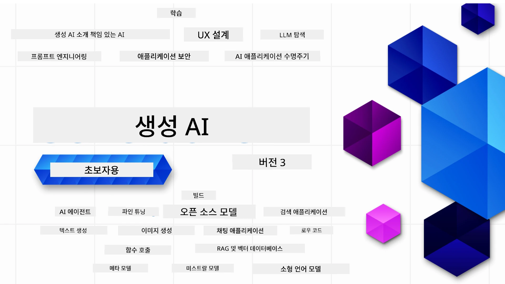

### 생성 AI 애플리케이션 구축을 시작하는 데 필요한 모든 것을 가르치는 21개의 강의

[](https://github.com/microsoft/Generative-AI-For-Beginners/blob/master/LICENSE?WT.mc_id=academic-105485-koreyst)
[](https://GitHub.com/microsoft/Generative-AI-For-Beginners/graphs/contributors/?WT.mc_id=academic-105485-koreyst)
[](https://GitHub.com/microsoft/Generative-AI-For-Beginners/issues/?WT.mc_id=academic-105485-koreyst)
[](https://GitHub.com/microsoft/Generative-AI-For-Beginners/pulls/?WT.mc_id=academic-105485-koreyst)
[](http://makeapullrequest.com?WT.mc_id=academic-105485-koreyst)

[](https://GitHub.com/microsoft/Generative-AI-For-Beginners/watchers/?WT.mc_id=academic-105485-koreyst)
[](https://GitHub.com/microsoft/Generative-AI-For-Beginners/network/?WT.mc_id=academic-105485-koreyst)
[](https://GitHub.com/microsoft/Generative-AI-For-Beginners/stargazers/?WT.mc_id=academic-105485-koreyst)

[](https://discord.gg/nTYy5BXMWG)

### 🌐 다국어 지원

#### GitHub 액션을 통해 지원 (자동화 및 항상 최신 상태 유지)

<!-- CO-OP TRANSLATOR LANGUAGES TABLE START -->
[아랍어](../ar/README.md) | [벵골어](../bn/README.md) | [불가리아어](../bg/README.md) | [버마어 (미얀마)](../my/README.md) | [중국어 (간체)](../zh-CN/README.md) | [중국어 (번체, 홍콩)](../zh-HK/README.md) | [중국어 (번체, 마카오)](../zh-MO/README.md) | [중국어 (번체, 대만)](../zh-TW/README.md) | [크로아티아어](../hr/README.md) | [체코어](../cs/README.md) | [덴마크어](../da/README.md) | [네덜란드어](../nl/README.md) | [에스토니아어](../et/README.md) | [핀란드어](../fi/README.md) | [프랑스어](../fr/README.md) | [독일어](../de/README.md) | [그리스어](../el/README.md) | [히브리어](../he/README.md) | [힌디어](../hi/README.md) | [헝가리어](../hu/README.md) | [인도네시아어](../id/README.md) | [이탈리아어](../it/README.md) | [일본어](../ja/README.md) | [칸나다어](../kn/README.md) | [크메르어](../km/README.md) | [한국어](./README.md) | [리투아니아어](../lt/README.md) | [말레이어](../ms/README.md) | [말라얄람어](../ml/README.md) | [마라티어](../mr/README.md) | [네팔어](../ne/README.md) | [나이지리아 피진어](../pcm/README.md) | [노르웨이어](../no/README.md) | [페르시아어 (파르시)](../fa/README.md) | [폴란드어](../pl/README.md) | [포르투갈어 (브라질)](../pt-BR/README.md) | [포르투갈어 (포르투갈)](../pt-PT/README.md) | [펀자브어 (구르무키)](../pa/README.md) | [루마니아어](../ro/README.md) | [러시아어](../ru/README.md) | [세르비아어 (키릴문자)](../sr/README.md) | [슬로바키아어](../sk/README.md) | [슬로베니아어](../sl/README.md) | [스페인어](../es/README.md) | [스와힐리어](../sw/README.md) | [스웨덴어](../sv/README.md) | [따갈로그어 (필리핀어)](../tl/README.md) | [타밀어](../ta/README.md) | [텔루구어](../te/README.md) | [태국어](../th/README.md) | [터키어](../tr/README.md) | [우크라이나어](../uk/README.md) | [우르두어](../ur/README.md) | [베트남어](../vi/README.md)

> **로컬에서 복제하는 걸 선호하나요?**
>
> 이 저장소는 50개 이상의 언어 번역본을 포함하여 다운로드 크기가 크게 증가합니다. 번역본 없이 복제하려면 스파스 체크아웃(sparse checkout)을 사용하세요:
>
> **Bash / macOS / Linux:**
> ```bash
> git clone --filter=blob:none --sparse https://github.com/microsoft/generative-ai-for-beginners.git
> cd generative-ai-for-beginners
> git sparse-checkout set --no-cone '/*' '!translations' '!translated_images'
> ```
>
> **CMD (Windows):**
> ```cmd
> git clone --filter=blob:none --sparse https://github.com/microsoft/generative-ai-for-beginners.git
> cd generative-ai-for-beginners
> git sparse-checkout set --no-cone "/*" "!translations" "!translated_images"
> ```
>
> 이 방법은 훨씬 빠른 다운로드로 코스 완료에 필요한 모든 것을 제공합니다.
<!-- CO-OP TRANSLATOR LANGUAGES TABLE END -->

# 초보자를 위한 생성 AI (버전 3) - 강의

Microsoft Cloud Advocates가 만든 21개의 강의를 통해 생성 AI 애플리케이션 구축의 기본을 배워보세요.

## 🌱 시작하기

이 강의는 21개의 수업으로 구성되어 있습니다. 각 강의는 독립적인 주제를 다루므로 원하는 곳에서 시작하세요!

강의는 "학습(Learn)" 강의 — 생성 AI 개념을 설명하는 강의와 "빌드(Build)" 강의 — 개념과 가능한 경우 **Python** 및 **TypeScript** 코드 예제를 함께 설명하는 강의로 구분됩니다.

.NET 개발자는 [Generative AI for Beginners (.NET Edition)](https://github.com/microsoft/Generative-AI-for-beginners-dotnet?WT.mc_id=academic-105485-koreyst)를 확인하세요!

각 강의에는 추가 학습 도구가 포함된 "계속 학습하기(Keep Learning)" 섹션도 있습니다.

## 필요한 것
### 이 강의의 코드를 실행하려면 다음 중 하나를 사용할 수 있습니다:
 - [Azure OpenAI Service](https://aka.ms/genai-beginners/azure-open-ai?WT.mc_id=academic-105485-koreyst) - **강의:** "aoai-assignment"
 - [GitHub Marketplace 모델 카탈로그](https://aka.ms/genai-beginners/gh-models?WT.mc_id=academic-105485-koreyst) - **강의:** "githubmodels"
 - [OpenAI API](https://aka.ms/genai-beginners/open-ai?WT.mc_id=academic-105485-koreyst) - **강의:** "oai-assignment"
   
- Python 또는 TypeScript 기본 지식이 도움이 됩니다 - \*완전 초보자는 이 [Python](https://aka.ms/genai-beginners/python?WT.mc_id=academic-105485-koreyst) 및 [TypeScript](https://aka.ms/genai-beginners/typescript?WT.mc_id=academic-105485-koreyst) 강의를 참고하세요
- [GitHub 계정]이 있어야 하며 이 저장소 전체를 자신의 GitHub 계정에 [포크](https://aka.ms/genai-beginners/github?WT.mc_id=academic-105485-koreyst) 할 수 있습니다

개발 환경 세팅을 도와주는 **[강의 설정](./00-course-setup/README.md?WT.mc_id=academic-105485-koreyst)** 강의를 만들었습니다.

나중에 더 쉽게 찾을 수 있도록 이 저장소에 [별(🌟) 표시하기](https://docs.github.com/en/get-started/exploring-projects-on-github/saving-repositories-with-stars?WT.mc_id=academic-105485-koreyst) 하는 것을 잊지 마세요.

## 🧠 배포 준비 완료?

더 고급 코드를 찾고 있나요? **Python** 및 **TypeScript** 버전의 [생성 AI 코드 샘플 모음](https://aka.ms/genai-beg-code?WT.mc_id=academic-105485-koreyst)을 확인하세요.

## 🗣️ 다른 학습자 만나기, 지원 받기

이 강의를 듣는 다른 학습자를 만나고 네트워킹하며 지원을 받으려면 [공식 Azure AI Foundry Discord 서버](https://aka.ms/genai-discord?WT.mc_id=academic-105485-koreyst)에 참여하세요.

Github의 [Azure AI Foundry 개발자 포럼](https://aka.ms/azureaifoundry/forum)에서 질문을 하거나 제품 피드백을 공유할 수 있습니다.

## 🚀 스타트업을 구축 중인가요?

오늘 바로 Azure 크레딧을 받아 빌드 시작하는 방법을 알아보려면 [Microsoft for Startups](https://www.microsoft.com/startups)를 방문하세요.

## 🙏 도움을 주고 싶나요?

제안 사항이 있거나 철자 또는 코드 오류를 발견했나요? [이슈 등록](https://github.com/microsoft/generative-ai-for-beginners/issues?WT.mc_id=academic-105485-koreyst) 또는 [풀 리퀘스트 생성](https://github.com/microsoft/generative-ai-for-beginners/pulls?WT.mc_id=academic-105485-koreyst)을 해주세요.

## 📂 각 강의에는 다음이 포함되어 있습니다:

- 주제에 대한 짧은 비디오 소개
- README에 위치한 서면 강의
- Azure OpenAI 및 OpenAI API를 지원하는 Python 및 TypeScript 코드 샘플
- 학습을 계속할 수 있는 추가 자료 링크

## 🗃️ 강의 목록

| #   | **강의 링크**                                                                                                                                | <strong>설명</strong>                                                                                     | <strong>비디오</strong>                                                                 | **추가 학습 자료**                                                             |
| --- | -------------------------------------------------------------------------------------------------------------------------------------------- | ------------------------------------------------------------------------------------------- | --------------------------------------------------------------------------- | ------------------------------------------------------------------------------ |
| 00  | [강의 설정](./00-course-setup/README.md?WT.mc_id=academic-105485-koreyst)                                                                     | **학습:** 개발 환경 설정 방법                                                                | 곧 비디오 공개 예정                                                             | [자세히 알아보기](https://aka.ms/genai-collection?WT.mc_id=academic-105485-koreyst) |
| 01  | [생성 AI 및 대형 언어 모델(LLMs) 소개](./01-introduction-to-genai/README.md?WT.mc_id=academic-105485-koreyst)                                 | **학습:** 생성 AI가 무엇인지, 대형 언어 모델(LLMs)이 어떻게 작동하는지 이해하기                   | [비디오](https://aka.ms/gen-ai-lesson-1-gh?WT.mc_id=academic-105485-koreyst) | [자세히 알아보기](https://aka.ms/genai-collection?WT.mc_id=academic-105485-koreyst) |
| 02  | [다양한 대형 언어 모델 탐색 및 비교](./02-exploring-and-comparing-different-llms/README.md?WT.mc_id=academic-105485-koreyst)                  | **학습:** 사용 사례에 맞는 적절한 모델을 선택하는 방법                                        | [비디오](https://aka.ms/gen-ai-lesson2-gh?WT.mc_id=academic-105485-koreyst)  | [자세히 알아보기](https://aka.ms/genai-collection?WT.mc_id=academic-105485-koreyst) |
| 03  | [책임감 있게 생성 AI 사용하기](./03-using-generative-ai-responsibly/README.md?WT.mc_id=academic-105485-koreyst)                              | **학습:** 생성 AI 애플리케이션을 책임감 있게 구축하는 방법                                     | [비디오](https://aka.ms/gen-ai-lesson3-gh?WT.mc_id=academic-105485-koreyst)  | [자세히 알아보기](https://aka.ms/genai-collection?WT.mc_id=academic-105485-koreyst) |
| 04  | [프롬프트 엔지니어링 기본 이해](./04-prompt-engineering-fundamentals/README.md?WT.mc_id=academic-105485-koreyst)             | **학습:** 실습 중심 프롬프트 엔지니어링 모범 사례                                           | [동영상](https://aka.ms/gen-ai-lesson4-gh?WT.mc_id=academic-105485-koreyst)  | [자세히 알아보기](https://aka.ms/genai-collection?WT.mc_id=academic-105485-koreyst) |
| 05  | [고급 프롬프트 작성](./05-advanced-prompts/README.md?WT.mc_id=academic-105485-koreyst)                                                | **학습:** 프롬프트 결과를 개선하는 프롬프트 엔지니어링 기법 적용 방법                         | [동영상](https://aka.ms/gen-ai-lesson5-gh?WT.mc_id=academic-105485-koreyst)  | [자세히 알아보기](https://aka.ms/genai-collection?WT.mc_id=academic-105485-koreyst) |
| 06  | [텍스트 생성 애플리케이션 구축](./06-text-generation-apps/README.md?WT.mc_id=academic-105485-koreyst)                                | **구축:** Azure OpenAI / OpenAI API를 사용한 텍스트 생성 앱                                | [동영상](https://aka.ms/gen-ai-lesson6-gh?WT.mc_id=academic-105485-koreyst)  | [자세히 알아보기](https://aka.ms/genai-collection?WT.mc_id=academic-105485-koreyst) |
| 07  | [채팅 애플리케이션 구축](./07-building-chat-applications/README.md?WT.mc_id=academic-105485-koreyst)                                     | **구축:** 효율적인 채팅 애플리케이션 구축 및 통합 기법                                      | [동영상](https://aka.ms/gen-ai-lessons7-gh?WT.mc_id=academic-105485-koreyst) | [자세히 알아보기](https://aka.ms/genai-collection?WT.mc_id=academic-105485-koreyst) |
| 08  | [벡터 데이터베이스 검색 앱 구축](./08-building-search-applications/README.md?WT.mc_id=academic-105485-koreyst)                        | **구축:** 임베딩을 이용한 데이터 검색 애플리케이션                                         | [동영상](https://aka.ms/gen-ai-lesson8-gh?WT.mc_id=academic-105485-koreyst)  | [자세히 알아보기](https://aka.ms/genai-collection?WT.mc_id=academic-105485-koreyst) |
| 09  | [이미지 생성 애플리케이션 구축](./09-building-image-applications/README.md?WT.mc_id=academic-105485-koreyst)                        | **구축:** 이미지 생성 애플리케이션                                                         | [동영상](https://aka.ms/gen-ai-lesson9-gh?WT.mc_id=academic-105485-koreyst)  | [자세히 알아보기](https://aka.ms/genai-collection?WT.mc_id=academic-105485-koreyst) |
| 10  | [로우코드 AI 애플리케이션 구축](./10-building-low-code-ai-applications/README.md?WT.mc_id=academic-105485-koreyst)                       | **구축:** 로우코드 도구를 사용한 생성형 AI 애플리케이션                                     | [동영상](https://aka.ms/gen-ai-lesson10-gh?WT.mc_id=academic-105485-koreyst) | [자세히 알아보기](https://aka.ms/genai-collection?WT.mc_id=academic-105485-koreyst) |
| 11  | [Function Calling으로 외부 애플리케이션 통합](./11-integrating-with-function-calling/README.md?WT.mc_id=academic-105485-koreyst) | **구축:** function calling이란 무엇이며 애플리케이션에서의 사용 사례                        | [동영상](https://aka.ms/gen-ai-lesson11-gh?WT.mc_id=academic-105485-koreyst) | [자세히 알아보기](https://aka.ms/genai-collection?WT.mc_id=academic-105485-koreyst) |
| 12  | [AI 애플리케이션 UX 설계](./12-designing-ux-for-ai-applications/README.md?WT.mc_id=academic-105485-koreyst)                         | **학습:** 생성형 AI 애플리케이션 개발 시 UX 설계 원칙 적용 방법                            | [동영상](https://aka.ms/gen-ai-lesson12-gh?WT.mc_id=academic-105485-koreyst) | [자세히 알아보기](https://aka.ms/genai-collection?WT.mc_id=academic-105485-koreyst) |
| 13  | [생성형 AI 애플리케이션 보안](./13-securing-ai-applications/README.md?WT.mc_id=academic-105485-koreyst)                         | **학습:** AI 시스템에 대한 위협과 위험, 그리고 이를 보호하는 방법                          | [동영상](https://aka.ms/gen-ai-lesson13-gh?WT.mc_id=academic-105485-koreyst) | [자세히 알아보기](https://aka.ms/genai-collection?WT.mc_id=academic-105485-koreyst) |
| 14  | [생성형 AI 애플리케이션 수명 주기](./14-the-generative-ai-application-lifecycle/README.md?WT.mc_id=academic-105485-koreyst)           | **학습:** LLM 수명 주기 및 LLMOps 관리를 위한 도구와 지표                                | [동영상](https://aka.ms/gen-ai-lesson14-gh?WT.mc_id=academic-105485-koreyst) | [자세히 알아보기](https://aka.ms/genai-collection?WT.mc_id=academic-105485-koreyst) |
| 15  | [검색 기반 생성(RAG) 및 벡터 데이터베이스](./15-rag-and-vector-databases/README.md?WT.mc_id=academic-105485-koreyst)        | **구축:** RAG 프레임워크를 사용해 벡터 데이터베이스에서 임베딩을 검색하는 애플리케이션       | [동영상](https://aka.ms/gen-ai-lesson15-gh?WT.mc_id=academic-105485-koreyst) | [자세히 알아보기](https://aka.ms/genai-collection?WT.mc_id=academic-105485-koreyst) |
| 16  | [오픈 소스 모델 및 Hugging Face](./16-open-source-models/README.md?WT.mc_id=academic-105485-koreyst)                                    | **구축:** Hugging Face에서 제공하는 오픈 소스 모델을 사용하는 애플리케이션                  | [동영상](https://aka.ms/gen-ai-lesson16-gh?WT.mc_id=academic-105485-koreyst) | [자세히 알아보기](https://aka.ms/genai-collection?WT.mc_id=academic-105485-koreyst) |
| 17  | [AI 에이전트](./17-ai-agents/README.md?WT.mc_id=academic-105485-koreyst)                                                                       | **구축:** AI 에이전트 프레임워크를 사용하는 애플리케이션                                   | [동영상](https://aka.ms/gen-ai-lesson17-gh?WT.mc_id=academic-105485-koreyst) | [자세히 알아보기](https://aka.ms/genai-collection?WT.mc_id=academic-105485-koreyst) |
| 18  | [LLM 파인 튜닝](./18-fine-tuning/README.md?WT.mc_id=academic-105485-koreyst)                                                              | **학습:** LLM 파인 튜닝의 개념, 이유 및 방법                                               | [동영상](https://aka.ms/gen-ai-lesson18-gh?WT.mc_id=academic-105485-koreyst) | [자세히 알아보기](https://aka.ms/genai-collection?WT.mc_id=academic-105485-koreyst) |
| 19  | [SLM으로 구축하기](./19-slm/README.md?WT.mc_id=academic-105485-koreyst)                                                              | **학습:** Small Language Models로 구축할 때의 이점                                       | 동영상 곧 제공 예정 | [자세히 알아보기](https://aka.ms/genai-collection?WT.mc_id=academic-105485-koreyst) |
| 20  | [Mistral 모델로 구축하기](./20-mistral/README.md?WT.mc_id=academic-105485-koreyst)                                                              | **학습:** Mistral 패밀리 모델의 특징과 차이점                                            | 동영상 곧 제공 예정 | [자세히 알아보기](https://aka.ms/genai-collection?WT.mc_id=academic-105485-koreyst) |
| 21  | [Meta 모델로 구축하기](./21-meta/README.md?WT.mc_id=academic-105485-koreyst)                                                              | **학습:** Meta 패밀리 모델의 특징과 차이점                                              | 동영상 곧 제공 예정 | [자세히 알아보기](https://aka.ms/genai-collection?WT.mc_id=academic-105485-koreyst) |

### 🌟 특별 감사

GitHub Actions와 워크플로우를 모두 제작해주신 [**John Aziz**](https://www.linkedin.com/in/john0isaac/)께 특별히 감사드립니다.

각 수업에 주요 기여를 하여 학습자 경험과 코드 경험을 향상시킨 [**Bernhard Merkle**](https://www.linkedin.com/in/bernhard-merkle-738b73/)께도 감사드립니다.

## 🎒 기타 강좌

저희 팀은 다른 강좌도 제작합니다! 확인해보세요:

<!-- CO-OP TRANSLATOR OTHER COURSES START -->
### LangChain
[](https://aka.ms/langchain4j-for-beginners)
[](https://aka.ms/langchainjs-for-beginners?WT.mc_id=m365-94501-dwahlin)
[](https://github.com/microsoft/langchain-for-beginners?WT.mc_id=m365-94501-dwahlin)
---

### Azure / Edge / MCP / Agents
[](https://github.com/microsoft/AZD-for-beginners?WT.mc_id=academic-105485-koreyst)
[](https://github.com/microsoft/edgeai-for-beginners?WT.mc_id=academic-105485-koreyst)
[](https://github.com/microsoft/mcp-for-beginners?WT.mc_id=academic-105485-koreyst)
[](https://github.com/microsoft/ai-agents-for-beginners?WT.mc_id=academic-105485-koreyst)

---
 
### 생성형 AI 시리즈
[](https://github.com/microsoft/generative-ai-for-beginners?WT.mc_id=academic-105485-koreyst)
[-9333EA?style=for-the-badge&labelColor=E5E7EB&color=9333EA)](https://github.com/microsoft/Generative-AI-for-beginners-dotnet?WT.mc_id=academic-105485-koreyst)
[-C084FC?style=for-the-badge&labelColor=E5E7EB&color=C084FC)](https://github.com/microsoft/generative-ai-for-beginners-java?WT.mc_id=academic-105485-koreyst)
[-E879F9?style=for-the-badge&labelColor=E5E7EB&color=E879F9)](https://github.com/microsoft/generative-ai-with-javascript?WT.mc_id=academic-105485-koreyst)

---
 
### 핵심 학습
[](https://aka.ms/ml-beginners?WT.mc_id=academic-105485-koreyst)
[](https://aka.ms/datascience-beginners?WT.mc_id=academic-105485-koreyst)
[](https://aka.ms/ai-beginners?WT.mc_id=academic-105485-koreyst)
[](https://github.com/microsoft/Security-101?WT.mc_id=academic-96948-sayoung)
[](https://aka.ms/webdev-beginners?WT.mc_id=academic-105485-koreyst)
[](https://aka.ms/iot-beginners?WT.mc_id=academic-105485-koreyst)
[](https://github.com/microsoft/xr-development-for-beginners?WT.mc_id=academic-105485-koreyst)

---
 
### 코파일럿 시리즈
[](https://aka.ms/GitHubCopilotAI?WT.mc_id=academic-105485-koreyst)
[](https://github.com/microsoft/mastering-github-copilot-for-dotnet-csharp-developers?WT.mc_id=academic-105485-koreyst)
[](https://github.com/microsoft/CopilotAdventures?WT.mc_id=academic-105485-koreyst)
<!-- CO-OP TRANSLATOR OTHER COURSES END -->

## 도움 받기

AI 애플리케이션 개발 중 막히거나 질문이 있을 경우, MCP에 대한 토론에 참여해 보세요. 질문을 환영하고 지식을 자유롭게 나누는 지원적인 커뮤니티입니다.

[](https://discord.gg/nTYy5BXMWG)

제품에 대한 피드백이나 오류가 있을 경우 다음을 방문하세요:

[](https://aka.ms/foundry/forum)

---

<!-- CO-OP TRANSLATOR DISCLAIMER START -->
**면책 조항**:  
이 문서는 AI 번역 서비스 [Co-op Translator](https://github.com/Azure/co-op-translator)를 사용하여 번역되었습니다. 정확성을 위해 최선을 다하고 있지만, 자동 번역에는 오류나 부정확성이 포함될 수 있음을 유의하시기 바랍니다. 원본 문서는 해당 언어의 원문이 권위 있는 출처로 간주되어야 합니다. 중요한 정보의 경우 전문가의 인간 번역을 권장합니다. 본 번역 사용으로 인한 오해나 잘못된 해석에 대해 당사는 책임지지 않습니다.
<!-- CO-OP TRANSLATOR DISCLAIMER END -->