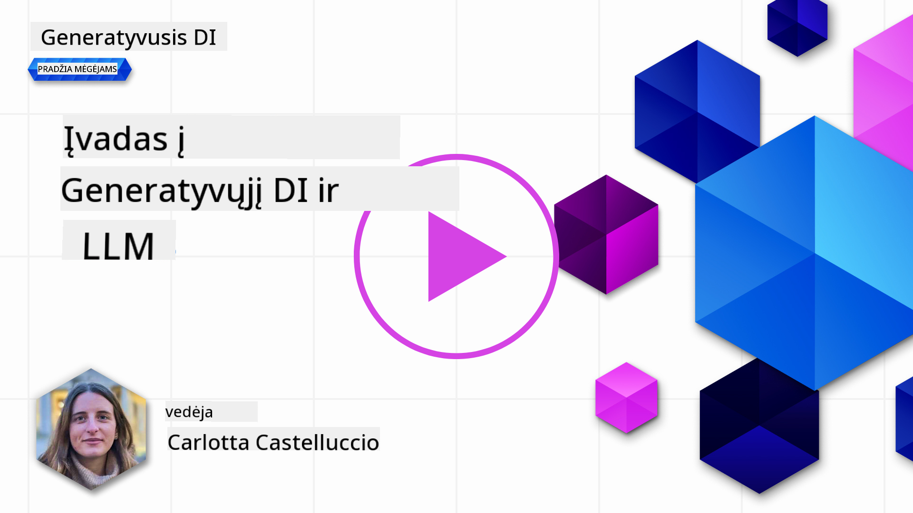
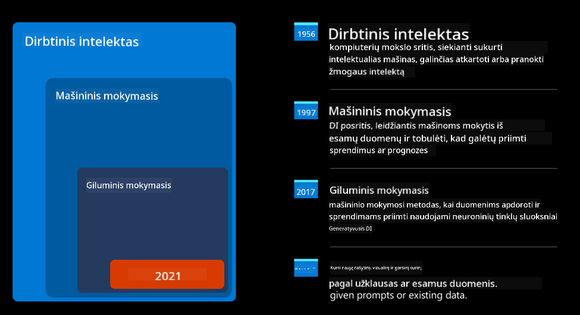
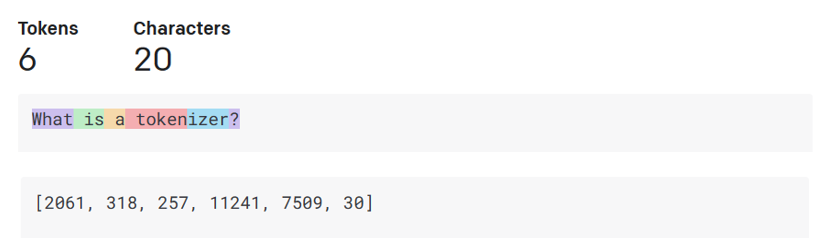
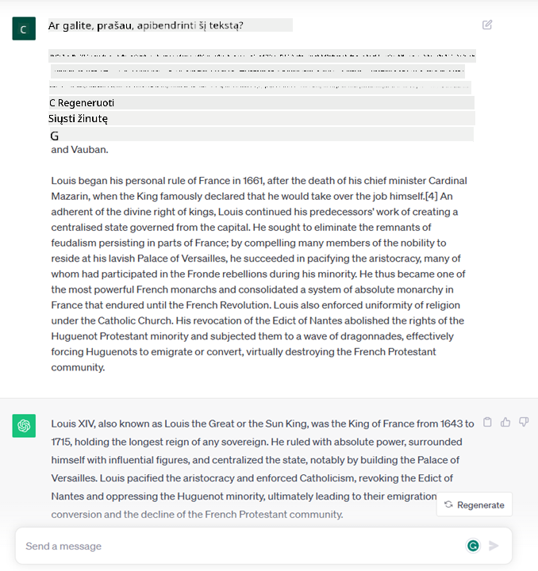
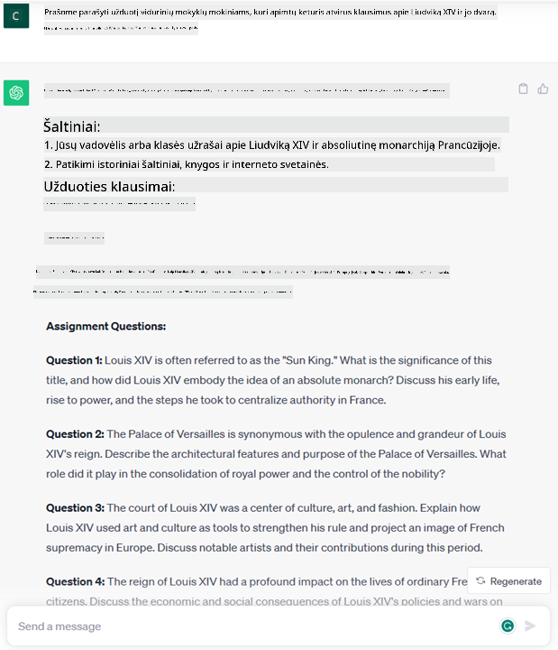
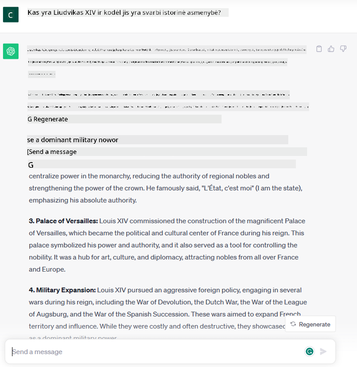
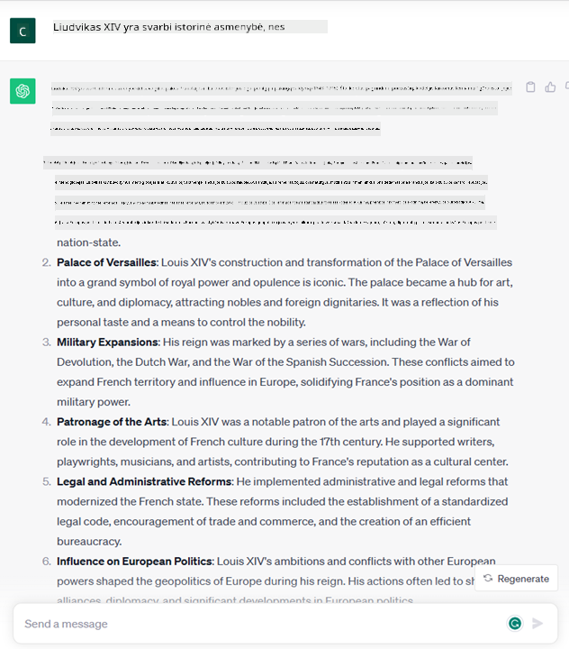
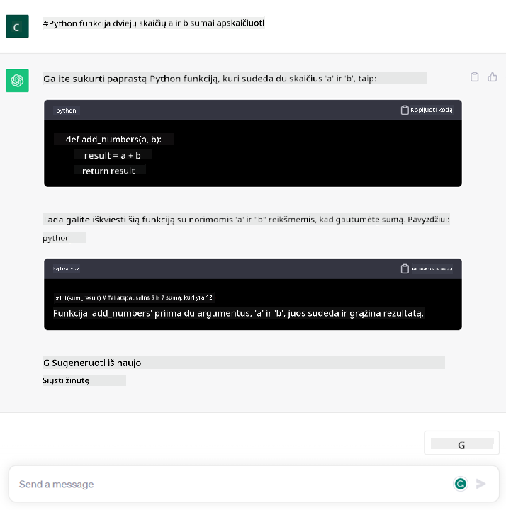

<!--
CO_OP_TRANSLATOR_METADATA:
{
  "original_hash": "f53ba0fa49164f9323043f1c6b11f2b1",
  "translation_date": "2025-08-25T12:22:31+00:00",
  "source_file": "01-introduction-to-genai/README.md",
  "language_code": "lt"
}
-->
# Įvadas į generatyvinį dirbtinį intelektą ir didelius kalbos modelius

_(Spauskite ant paveikslėlio aukščiau, kad peržiūrėtumėte šios pamokos vaizdo įrašą)_

Generatyvinis DI – tai dirbtinis intelektas, galintis generuoti tekstą, vaizdus ir kitokį turinį. Ši technologija nuostabi tuo, kad ji demokratizuoja DI – ja gali naudotis kiekvienas, tereikia parašyti tekstinę užklausą natūralia kalba. Nebereikia mokytis programavimo kalbų, tokių kaip Java ar SQL, kad pasiektum norimą rezultatą – užtenka išreikšti savo mintį ir DI modelis pasiūlys sprendimą. Taikymo galimybės ir poveikis milžiniški: gali rašyti ar suprasti ataskaitas, kurti programas ir dar daugiau – vos per kelias sekundes.

Šioje mokymų programoje nagrinėsime, kaip mūsų startuolis pasitelkia generatyvinį DI, kad atvertų naujas galimybes švietimo srityje, ir kaip sprendžiame neišvengiamus iššūkius, susijusius su socialiniu poveikiu ir technologiniais apribojimais.

## Įvadas

Šioje pamokoje aptarsime:

- Verslo scenarijaus pristatymą: mūsų startuolio idėją ir misiją.
- Generatyvinį DI ir dabartinę technologijų situaciją.
- Didelio kalbos modelio veikimo principus.
- Pagrindines galimybes ir praktinius didelių kalbos modelių taikymo pavyzdžius.

## Mokymosi tikslai

Baigę šią pamoką suprasite:

- Kas yra generatyvinis DI ir kaip veikia dideli kalbos modeliai.
- Kaip galima pritaikyti didelius kalbos modelius įvairiems poreikiams, ypač švietimo srityje.

## Scenarijus: mūsų švietimo startuolis

Generatyvinis dirbtinis intelektas (DI) – tai DI technologijų viršūnė, peržengianti anksčiau neįsivaizduotas ribas. Generatyviniai DI modeliai turi daug galimybių ir taikymo sričių, tačiau šioje programoje nagrinėsime, kaip jie keičia švietimą per išgalvotą startuolį, kurį vadinsime _mūsų startuoliu_. Mūsų startuolis veikia švietimo srityje ir turi ambicingą misiją:

> _gerinti mokymosi prieinamumą visame pasaulyje, užtikrinti lygias galimybes mokytis ir suteikti kiekvienam mokiniui individualią mokymosi patirtį pagal jo poreikius_.

Mūsų komanda supranta, kad šio tikslo nepasieksime be vieno galingiausių šiuolaikinių įrankių – didelių kalbos modelių (LLM).

Tikimasi, kad generatyvinis DI iš esmės pakeis mokymosi ir mokymo būdus: mokiniai turės virtualius mokytojus, prieinamus 24 valandas per parą, kurie pateiks daug informacijos ir pavyzdžių, o mokytojai galės naudotis inovatyviais įrankiais vertindami mokinius ir teikdami grįžtamąjį ryšį.

Pradėkime nuo pagrindinių sąvokų ir terminų, kuriuos naudosime visoje mokymų programoje.

## Kaip atsirado generatyvinis DI?

Nors pastaruoju metu generatyvinio DI modelių pristatymas sukėlė didžiulį _ažiotažą_, ši technologija vystoma jau dešimtmečius – pirmieji tyrimai prasidėjo dar 6-ajame dešimtmetyje. Dabar DI pasiekė žmogaus kognityvinius gebėjimus, pavyzdžiui, geba bendrauti, kaip rodo [OpenAI ChatGPT](https://openai.com/chatgpt) ar [Bing Chat](https://www.microsoft.com/edge/features/bing-chat?WT.mc_id=academic-105485-koreyst), kuris taip pat naudoja GPT modelį interneto paieškai Bing pokalbiuose.

Grįžtant atgal, pirmieji DI prototipai buvo tekstiniai pokalbių robotai, kurių žinių bazė buvo sudaryta iš ekspertų žinių ir perkelta į kompiuterį. Atsakymai buvo parenkami pagal įvestyje pasirodančius raktinius žodžius.
Tačiau greitai paaiškėjo, kad toks požiūris, naudojant tekstinius pokalbių robotus, nėra efektyvus didesniu mastu.

### Statistinis DI požiūris: Mašininis mokymasis

Lūžis įvyko 10-ajame dešimtmetyje, kai tekstų analizei pradėtas taikyti statistinis metodas. Taip atsirado nauji algoritmai – vadinami mašininiu mokymusi – kurie geba mokytis iš duomenų, neprogramuojant kiekvieno žingsnio. Šis metodas leidžia kompiuteriams imituoti žmogaus kalbos supratimą: statistinis modelis apmokomas su tekstų ir žymų poromis, todėl gali klasifikuoti nežinomą tekstą pagal iš anksto nustatytą žymą, atspindinčią žinutės intenciją.

### Neuroniniai tinklai ir šiuolaikiniai virtualūs asistentai

Pastaraisiais metais techninė pažanga, leidžianti apdoroti didesnius duomenų kiekius ir sudėtingesnius skaičiavimus, paskatino DI tyrimus ir lėmė pažangių mašininio mokymosi algoritmų – neuroninių tinklų arba giluminio mokymosi – atsiradimą.

Neuroniniai tinklai (ypač pasikartojantys neuroniniai tinklai – RNN) labai pagerino natūralios kalbos apdorojimą, leidžiant geriau suprasti teksto prasmę, įvertinant žodžio kontekstą sakinyje.

Ši technologija tapo pagrindu virtualiems asistentams, atsiradusiems naujojo amžiaus pirmąjį dešimtmetį, kurie puikiai supranta žmogaus kalbą, atpažįsta poreikį ir atlieka veiksmą – pavyzdžiui, atsako pagal iš anksto parengtą scenarijų arba naudoja trečiųjų šalių paslaugas.

### Šiandien: Generatyvinis DI

Taip ir atėjome iki šiandieninio generatyvinio DI, kuris laikomas giluminio mokymosi dalimi.

Po dešimtmečių DI tyrimų atsirado nauja modelių architektūra – _Transformer_ – kuri įveikė RNN apribojimus ir gali apdoroti daug ilgesnes tekstų sekas. Transformeriai veikia dėmesio mechanizmo principu, leidžiančiu modeliui skirti skirtingą svorį įvestims, „daugiau dėmesio“ skiriant svarbiausiai informacijai, nepriklausomai nuo jos vietos tekste.

Dauguma naujausių generatyvinio DI modelių – vadinamų dideliais kalbos modeliais (LLM), nes jie dirba su tekstiniais įvestimis ir išvestimis – sukurti būtent pagal šią architektūrą. Įdomu tai, kad šie modeliai, apmokyti su milžinišku kiekiu nepažymėtų duomenų iš įvairių šaltinių (knygų, straipsnių, svetainių), gali būti pritaikyti įvairioms užduotims ir generuoti gramatiškai taisyklingą, kūrybišką tekstą. Taigi, jie ne tik neįtikėtinai pagerino kompiuterio gebėjimą „suprasti“ tekstą, bet ir suteikė galimybę generuoti originalų atsakymą žmogaus kalba.

## Kaip veikia dideli kalbos modeliai?

Kitame skyriuje nagrinėsime skirtingus generatyvinio DI modelių tipus, o dabar pažiūrėkime, kaip veikia dideli kalbos modeliai, ypač OpenAI GPT (Generative Pre-trained Transformer) modeliai.

- **Tokenizatorius, tekstas į skaičius**: Dideli kalbos modeliai gauna tekstą kaip įvestį ir generuoja tekstą kaip išvestį. Tačiau, būdami statistiniai modeliai, jie daug geriau veikia su skaičiais nei su tekstu. Todėl kiekviena įvestis pirmiausia apdorojama tokenizatoriumi. Tokenas – tai teksto dalis, sudaryta iš kelių simbolių, tad pagrindinė tokenizatoriaus užduotis – suskaidyti įvestį į tokenų masyvą. Kiekvienas tokenas susiejamas su tokeno indeksu – tai originalaus teksto dalies skaitmeninis kodavimas.

- **Išvesties tokenų prognozavimas**: Gavęs n tokenų kaip įvestį (maksimalus n priklauso nuo modelio), modelis prognozuoja vieną tokeną kaip išvestį. Šis tokenas įtraukiamas į kitą iteraciją, taip plečiant langą ir leidžiant gauti vieną ar kelis sakinius kaip atsakymą. Todėl, jei naudojote ChatGPT, galėjote pastebėti, kad kartais jis sustoja viduryje sakinio.

- **Atrankos procesas, tikimybių pasiskirstymas**: Išvesties tokenas parenkamas pagal jo tikimybę pasirodyti po dabartinės teksto sekos. Modelis prognozuoja tikimybių pasiskirstymą visiems galimiems „kitam tokenui“, remdamasis mokymosi duomenimis. Tačiau ne visada parenkamas didžiausią tikimybę turintis tokenas – į šį pasirinkimą įtraukiama atsitiktinumo, kad modelis veiktų nedeterministiškai – t.y. gauname ne visada tą patį atsakymą su ta pačia įvestimi. Šis atsitiktinumo laipsnis imituoja kūrybinį mąstymą ir gali būti reguliuojamas modelio parametru, vadinamu temperatūra.

## Kaip mūsų startuolis gali pasinaudoti dideliais kalbos modeliais?

Dabar, kai geriau suprantame didelio kalbos modelio veikimą, pažiūrėkime keletą praktinių pavyzdžių, kokias užduotis jie atlieka geriausiai, ypač mūsų verslo scenarijuje.
Pagrindinė didelio kalbos modelio galimybė – _generuoti tekstą nuo nulio, remiantis tekstine įvestimi, parašyta natūralia kalba_.

Bet kokia gali būti tekstinė įvestis ir išvestis?
Didelio kalbos modelio įvestis vadinama užklausa (prompt), o išvestis – užbaigimu (completion), t.y. modelio mechanizmu generuoti kitą tokeną, kad užbaigtų dabartinę įvestį. Vėliau gilinsimės, kas yra užklausa ir kaip ją sukurti, kad gautume geriausią rezultatą. O dabar trumpai – užklausa gali apimti:

- **Instrukciją**, nurodančią, kokio tipo išvesties tikimės iš modelio. Instrukcija kartais gali apimti pavyzdžių ar papildomų duomenų.

  1. Straipsnio, knygos, produktų apžvalgų ir kt. santraukos, taip pat įžvalgų iš neapdorotų duomenų ištraukimas.
    
    
  
  2. Kūrybinės idėjos ir straipsnio, rašinio, užduoties ar kt. dizainas.
      
     

- **Klausimą**, užduotą pokalbio su agentu forma.
  
  

- **Teksto dalį, kurią reikia užbaigti**, kas iš esmės yra prašymas padėti rašyti.
  
  

- **Kodo dalį** kartu su prašymu paaiškinti ir dokumentuoti ją, arba komentarą, prašantį sugeneruoti kodą, atliekantį tam tikrą užduotį.
  
  

Aukščiau pateikti pavyzdžiai yra gana paprasti ir neparodo visų didelių kalbos modelių galimybių. Jie skirti parodyti generatyvinio DI potencialą, ypač, bet ne tik, švietimo kontekste.

Taip pat generatyvinio DI modelio išvestis nėra tobula, o kartais modelio kūrybiškumas gali pakišti koją – rezultatas gali būti žodžių kombinacija, kurią žmogus supras kaip tikrovės iškraipymą arba net įžeidžiančią. Generatyvinis DI nėra intelektualus – bent jau ne pagal išsamesnę intelekto apibrėžtį, apimančią kritinį ir kūrybinį mąstymą ar emocinį intelektą; jis nėra deterministinis ir nėra patikimas, nes klaidinga informacija, nuorodos, turinys ir teiginiai gali būti sumaišyti su teisinga informacija ir pateikti įtikinamai bei užtikrintai. Kitose pamokose nagrinėsime šiuos apribojimus ir ieškosime būdų, kaip juos sumažinti.

## Užduotis

Tavo užduotis – pasidomėti daugiau apie [generatyvinį DI](https://en.wikipedia.org/wiki/Generative_artificial_intelligence?WT.mc_id=academic-105485-koreyst) ir pabandyti rasti sritį, kurioje šiandien galėtum pritaikyti generatyvinį DI, nors ji dar jo neturi. Kaip poveikis skirtųsi, palyginti su „senaisiais“ metodais – ar galėtum padaryti tai, ko anksčiau neįmanoma, ar tiesiog greičiau? Parašyk 300 žodžių santrauką, kaip atrodytų tavo svajonių DI startuolis, ir įtrauk tokius antraštes kaip „Problema“, „Kaip naudočiau DI“, „Poveikis“ ir, jei nori, verslo planą.

Jei atliksi šią užduotį, galbūt būsi pasiruošęs kandidatuoti į Microsoft inkubatorių [Microsoft for Startups Founders Hub](https://www.microsoft.com/startups?WT.mc_id=academic-105485-koreyst) – siūlome kreditus Azure, OpenAI, mentorystę ir dar daugiau, būtinai pasidomėk!

## Žinių patikrinimas

Kas teisinga apie didelius kalbos modelius?

1. Kiekvieną kartą gauni visiškai tą patį atsakymą.
1. Jie viską atlieka tobulai, puikiai skaičiuoja, generuoja veikiantį kodą ir t.t.
1. Atsakymas gali skirtis net naudojant tą pačią užklausą. Jie puikiai tinka gauti pirmą juodraštį – tekstą ar kodą. Bet rezultatą reikia tobulinti.

A: 3, LLM yra nedeterministinis, atsakymas skiriasi, tačiau jo variaciją galima kontroliuoti temperatūros nustatymu. Taip pat nereikėtų tikėtis tobulų rezultatų – modelis skirtas atlikti sunkiausią darbą, dažnai tai reiškia, kad gauni gerą pirmą bandymą, kurį reikia palaipsniui tobulinti.

## Puikiai padirbėta! Tęsk kelionę

Baigęs šią pamoką, peržiūrėk mūsų [Generatyvinio DI mokymosi kolekciją](https://aka.ms/genai-collection?WT.mc_id=academic-105485-koreyst), kad dar labiau pagilintum žinias apie generatyvinį DI!
Eikite į 2 pamoką, kurioje nagrinėsime, kaip [ištirti ir palyginti skirtingus LLM tipus](../02-exploring-and-comparing-different-llms/README.md?WT.mc_id=academic-105485-koreyst)!

---

**Atsakomybės atsisakymas**:  
Šis dokumentas buvo išverstas naudojant dirbtinio intelekto vertimo paslaugą [Co-op Translator](https://github.com/Azure/co-op-translator). Nors siekiame tikslumo, prašome atkreipti dėmesį, kad automatiniai vertimai gali turėti klaidų ar netikslumų. Originalus dokumentas jo gimtąja kalba turėtų būti laikomas autoritetingu šaltiniu. Kritinei informacijai rekomenduojamas profesionalus žmogaus vertimas. Mes neatsakome už nesusipratimus ar neteisingą interpretavimą, kilusį dėl šio vertimo naudojimo.