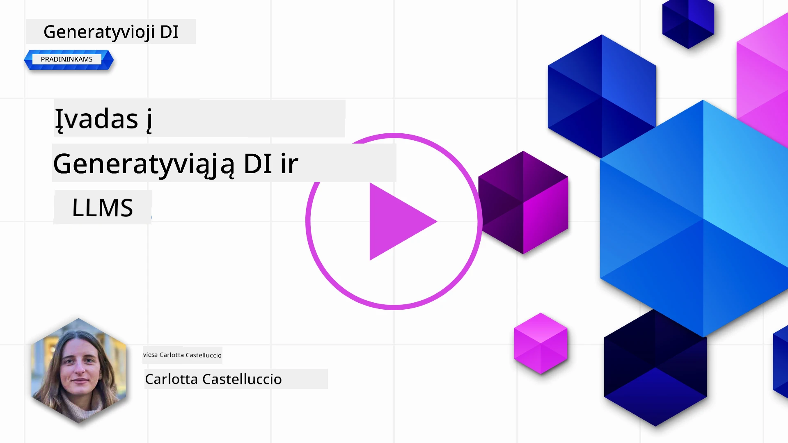
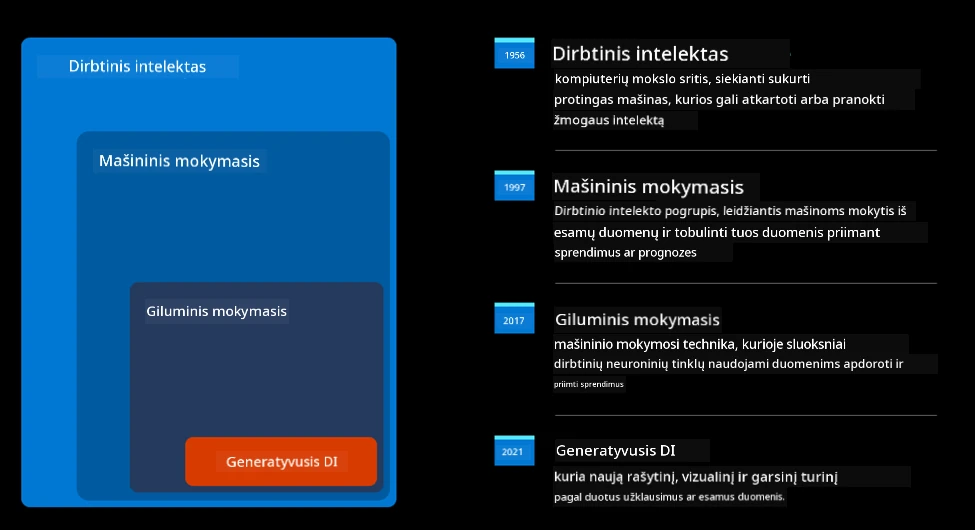
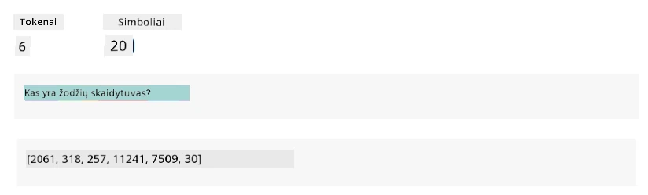
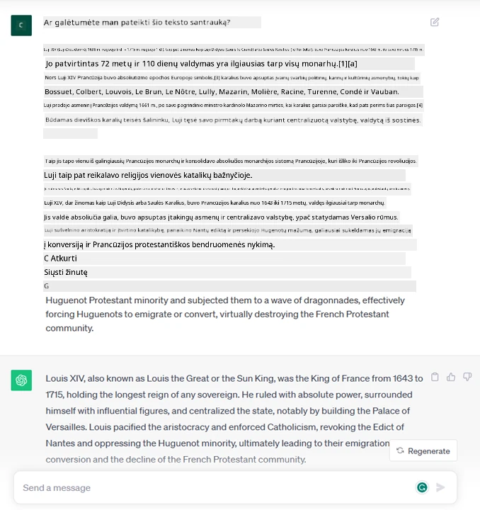
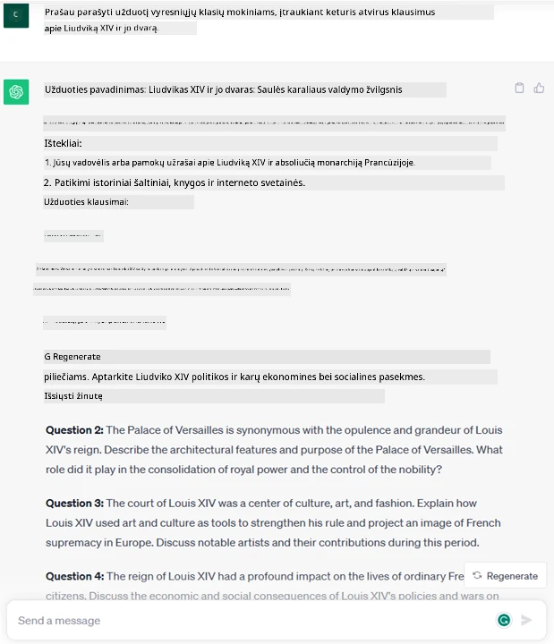
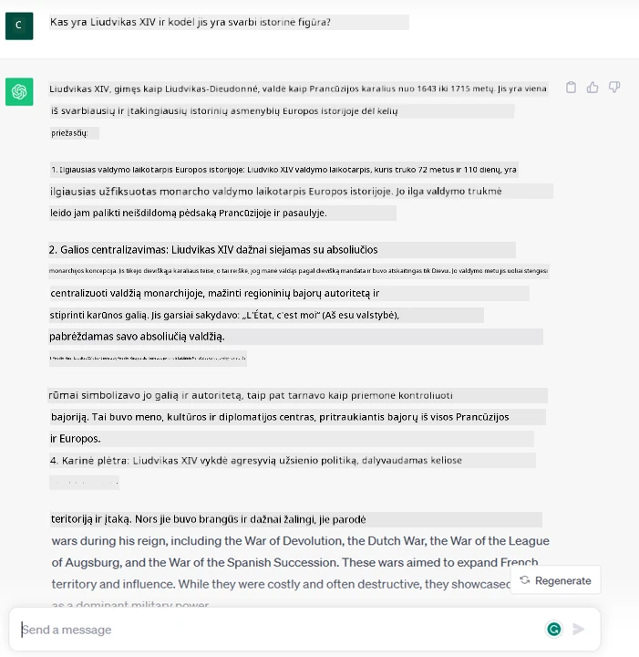
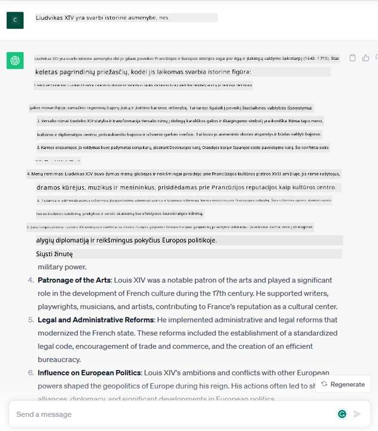
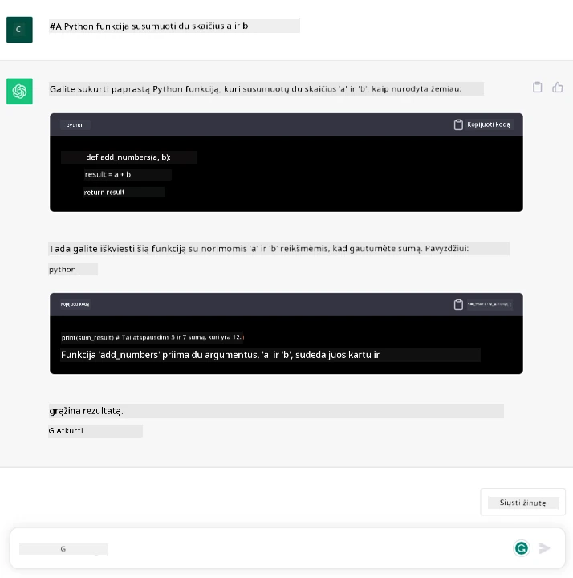

# Įvadas į generatyviąją DI ir didelius kalbos modelius

_(Paspauskite paveikslėlį aukščiau, kad peržiūrėtumėte šios pamokos vaizdo įrašą)_

Generatyvioji DI yra dirbtinis intelektas, galintis generuoti tekstą, vaizdus ir kitus turinio tipus. Ši technologija yra nuostabi, nes demokratizuoja DI – kiekvienas gali ją naudoti vos su teksto užklausa, sakiniu natūralia kalba. Jums nereikia išmokti tokių kalbų kaip Java ar SQL, kad pasiektumėte kažką vertingo – tereikia naudoti savo kalbą, išsakyti, ko norite, ir DI modelis pateikia pasiūlymą. Šios technologijos pritaikymas ir poveikis yra milžiniški: rašote ar suprantate ataskaitas, kuriate paraiškas ir dar daugiau, visa tai per kelias sekundes.

Šioje programoje nagrinėsime, kaip mūsų startuolis naudoja generatyviąją DI, kad atrastų naujus scenarijus švietimo srityje, ir kaip sprendžiame neišvengiamus su socialinėmis jos taikymo pasekmėmis bei technologijos ribotumais susijusius iššūkius.

## Įvadas

Šioje pamokoje aptarsime:

- Verslo scenarijaus pristatymas: mūsų startuolio idėja ir misija.
- Generatyvioji DI ir kaip patekomėme prie dabartinės technologinės aplinkos.
- Didelio kalbos modelio veikimo principai.
- Pagrindinės didelių kalbos modelių galimybės ir praktiniai panaudojimo atvejai.

## Mokymosi tikslai

Baigę šią pamoką suprasite:

- Kas yra generatyvioji DI ir kaip veikia dideli kalbos modeliai.
- Kaip galite panaudoti didelius kalbos modelius įvairiems atvejams, daugiausia susijusiems su švietimo scenarijais.

## Scenarijus: mūsų švietimo startuolis

Generatyvioji dirbtinė intelektas (DI) žymi aukščiausią DI technologijos lygį, tiesiantį ribas tam, kas anksčiau atrodė neįmanoma. Generatyvieji DI modeliai turi daug galimybių ir panaudojimo sričių, bet šioje programoje nagrinėsime, kaip jie revoliucionizuoja švietimą per fiktyvų startuolį. Šį startuolį vadinsime _mūsų startuoliu_. Mūsų startuolis veikia švietimo srityje su ambicingu misijos pareiškimu:

> _gerinti mokymosi prieinamumą pasauliniu mastu, užtikrinant lygiavertę prieigą prie švietimo ir siūlant personalizuotas mokymosi patirtis kiekvienam mokiniui pagal jų poreikius_.

Mūsų startuolio komanda žino, kad negalės pasiekti šio tikslo nesinaudodama vienu iš galingiausių šiandienos įrankių – dideliais kalbos modeliais (LLM).

Tikimasi, kad generatyvioji DI revoliucionuos šiandieninį mokymąsi ir mokymą, suteikdama studentams prieigą prie virtualių mokytojų 24 valandas per parą, kurie pateikia daug informacijos ir pavyzdžių, o mokytojai galės naudotis novatoriškais įrankiais, vertinti mokinius ir teikti grįžtamąjį ryšį.

Pradėkime nuo kelių pagrindinių sąvokų ir terminų apibrėžimo, kurie bus naudojami visos programos metu.

## Kaip atsirado generatyvioji DI?

Nepaisant pastaruoju metu sukeltos nepaprastos _antihipės_, susijusios su generatyviųjų DI modelių paskelbimu, ši technologija kuriama jau dešimtmečius, pirmieji moksliniai žingsniai siekia šeštąjį dešimtmetį. Šiandien DI turi žmonių pažinimo gebėjimus, tokius kaip pokalbiai, pavyzdžiui, kaip [OpenAI ChatGPT](https://openai.com/chatgpt) arba [Microsoft Copilot](https://copilot.microsoft.com/?WT.mc_id=academic-105485-koreyst), kuris naudoja GPT modelį savo pokalbių tinklo paieškos patirčiai.

Šiek tiek atsitraukę, pirmieji DI prototipai buvo parašytieji pokalbių robotai, remiantys žinių bazę, ištrauktą iš grupės ekspertų ir atvaizduotą kompiuteryje. Žinių bazės atsakymai buvo sužadinami raktažodžių, atsirandančių įvestame tekste.
Tačiau netrukus paaiškėjo, kad toks metodas, naudojant parašytuosius pokalbių robotus, nesiskalė gerai.

### Statistinis požiūris į DI: mašininis mokymasis

Lūžio taškas atėjo 90-aisiais, kai pradėta taikyti statistinė teksto analizės metodika. Tai nulėmė naujų algoritmų – žinomų kaip mašininis mokymasis – sukūrimą, galinčių mokytis iš duomenų modelių be tiesioginio programavimo. Šis metodas leidžia mašinoms simuliuoti žmogaus kalbos supratimą: statistinis modelis yra treniruojamas naudodamas tekstų ir žymų poras, leidžiančias modeliui klasifikuoti nežinomą įvestą tekstą su iš anksto apibrėžta žyma, atitinkančia žinutės intenciją.

### Neuroniniai tinklai ir modernūs virtualūs asistentai

Pastaraisiais metais techninė aparatūra, gebanti apdoroti didesnius duomenų kiekius ir sudėtingesnius skaičiavimus, skatino DI tyrimus, vedančius į pažangių mašininio mokymosi algoritmų, žinomų kaip neuroniniai tinklai ar gilus mokymasis, kūrimą.

Neuroniniai tinklai (ypač pasikartojantys neuroniniai tinklai – RNN) reikšmingai patobulino natūralios kalbos apdorojimą, leidžiant reprezentuoti teksto prasmę prasmingesniu būdu, įvertinant žodžio kontekstą sakinyje.

Ši technologija palaikė virtualius asistentus, gimusius pirmame naujojo amžiaus dešimtmetyje, kurie puikiai supranta žmogaus kalbą, identifikuoja poreikį ir atlieka veiksmą jam patenkinti – pavyzdžiui, atsako iš anksto paruoštu scenarijumi arba naudoja trečiųjų šalių paslaugą.

### Dabartinė būklė, generatyvioji DI

Taip pasiekėme šiandieninę generatyviąją DI, kurią galima laikyti giluminio mokymosi poaibiu.

Po dešimtmečių tyrimų DI srityje atsirado nauja modelio architektūra – vadinama _Transformer_ – kuri įveikė RNN ribotumus, galėdama priimti kur kas ilgesnes teksto sekas kaip įvestį. Transformeriai remiasi dėmesio mechanizmu, leidžiančiu modeliui skirti skirtingą svorį gaunamiems įvesties duomenims, „skirti daugiau dėmesio“ ten, kur sutelktas svarbiausias informacijos kiekis, nepaisant jų eiliškumo teksto sekoje.

Dauguma naujausių generatyviųjų DI modelių – dar vadinamų dideliais kalbos modeliais (LLM), nes jie dirba su tekstinėmis įvestimis ir išvestimis – iš tiesų remiasi šia architektūra. Įdomu tai, kad šie modeliai, apmokyti didžiuliu kiekiu nepažymėtų duomenų iš įvairių šaltinių, tokių kaip knygos, straipsniai ir svetainės, gali būti pritaikyti daugeliui užduočių ir generuoti gramatiškai taisyklingą tekstą su kūrybingumo požymiais. Todėl jie ne tik stipriai pagerino mašinos galimybę „suprasti“ įvestą tekstą, bet ir leido generuoti originalų atsakymą žmonių kalba.

## Kaip veikia dideli kalbos modeliai?

Kitame skyriuje nagrinėsime skirtingų tipų generatyviųjų DI modelius, bet kol kas pažvelkime, kaip veikia dideli kalbos modeliai, daugiausia dėmesio skirdami OpenAI GPT (Generative Pre-trained Transformer) modeliams.

- **Tokenizatorius, tekstas į skaičius**: dideli kalbos modeliai priima tekstą kaip įvestį ir generuoja tekstą kaip išvestį. Tačiau būdami statistiniais modeliais, jie geriau veikia su skaičiais nei tekstinėmis sekų eilėmis. Todėl kiekviena įvestis apdorojama tokenizatoriumi prieš pateikiant pagrindiniam modeliui. Tokenas yra teksto dalis – sudaryta iš kintamo simbolių skaičiaus, todėl tokenizatoriaus pagrindinė užduotis yra padalyti įvestį į tokenų masyvą. Tada kiekvienas tokenas priskiriamas tokeno indeksui, tai yra sveikojo skaičiaus kodavimas originaliai teksto daliai.

- **Išvesties tokenų prognozavimas**: turint n tokenų kaip įvestį (maksimalus n kinta priklausomai nuo modelio), modelis sugeba prognozuoti vieną tokeną kaip išvestį. Šis tokenas tuomet įtraukiamas į kitą iteracijos įvestį, plintančio lango principu, kas užtikrina geresnę naudotojo patirtį gaunant vieną (ar kelis) sakinius kaip atsakymą. Tai paaiškina, kodėl, jei žaidėte su ChatGPT, kartais galite pastebėti, kad jis sustoja sakinio viduryje.

- **Parinkimo procesas, tikimybių pasiskirstymas**: išvesties tokenas parenkamas modeliui pagal jo tikimybę pasirodyti po dabartinės teksto sekos. Modelis prognozuoja tikimybių pasiskirstymą visiems galimiems „kitiems tokenams“, apskaičiuotą remiantis treniruote. Tačiau ne visada pasirenkamas tokenas su didžiausia tikimybe. Prie šio pasirinkimo pridedama tam tikra atsitiktinumo dozė, taigi modelis veikia nedeterministiškai – gaunamas ne visada tas pats tikslus atsakymas į tą pačią įvestį. Šis atsitiktinumas pridedamas imituoti kūrybinio mąstymo procesą ir gali būti reguliuojamas modelio parametru temperatūra.

## Kaip mūsų startuolis gali pasinaudoti dideliais kalbos modeliais?

Dabar, kai geriau suprantame didelio kalbos modelio veikimą, pažvelkime į kai kuriuos praktinius pavyzdžius, kokias dažniausiai pasitaikančias užduotis jie gali gana gerai atlikti, atsižvelgiant į mūsų verslo scenarijų.
Pasakėme, kad pagrindinė didelio kalbos modelio galimybė yra _generuoti tekstą nuo nulio, pradedant nuo tekstinės įvesties, parašytos natūralia kalba_.

Bet kokio tipo tekstinė įvestis ir išvestis?
Didelio kalbos modelio įvestis vadinama užklausa (prompt), o išvestis – užbaigimu (completion), terminu, kuris reiškia modelio mechanizmą generuoti kitą tokeną, užbaigiantį esamą įvestį. Toliau gilinsimės, kas yra užklausa ir kaip ją suformuluoti, kad maksimaliai išnaudotume modelį. Bet kol kas tiesiog paminėsime, kad užklausa gali apimti:

- **Instrukciją**, nurodančią, kokio išvesties tipo tikimės iš modelio. Kartais ši instrukcija gali apimti pavyzdžius arba papildomus duomenis.

  1. Straipsnio, knygos, produkto atsiliepimų ir kt. santrauka, kartu ištraukiant įžvalgas iš nestruktūruotų duomenų.
    
    
  
  2. Kūrybinės idėjos ir straipsnio, esė, užduoties ar kt. parengimas.
      
     

- **Klausimą**, pateiktą kaip pokalbis su agentu.
  
  

- Teksto **užbaigimą**, kuris implicitškai yra prašymas pagalbos rašant.
  
  

- **Kodo** dalį kartu su prašymu ją paaiškinti ir dokumentuoti arba komentarą, prašantį sukurti kodą konkrečiai užduočiai atlikti.
  
  

Aukščiau pateikti pavyzdžiai yra gana paprasti ir nesiekia išsamiai parodyti didelių kalbos modelių galimybių. Jie skirti parodyti generatyviosios DI naudojimo potencialą, ypač, bet neapsiribojant, švietimo kontekste.

Be to, generatyviosios DI modelio išvestis nėra tobula ir kartais modelio kūrybingumas gali tapti priešingas – pateikti atsakymą, kuriame žodžiai sujungti taip, kad žmogus vartotojas gali interpretuoti kaip realybės mistifikaciją arba kuris gali būti įžeidžiantis. Generatyvioji DI nėra intelektuali – bent jau plačiąja prasme, apimančia kritinį ir kūrybinį mąstymą ar emocinį intelektą; ji nėra determinuojama ir nepatikima, nes klaidinga informacija, pvz., netikslūs paminėjimai, turinys ar teiginiai, gali būti sumaišyti su teisinga informacija ir pateikti įtikinamai bei užtikrintai. Tolimesnėse pamokose nagrinėsime visas šias ribotumus ir pažvelgsime, kaip galime jas sušvelninti.

## Užduotis

Jūsų užduotis – daugiau paskaityti apie [generatyviąją DI](https://en.wikipedia.org/wiki/Generative_artificial_intelligence?WT.mc_id=academic-105485-koreyst) ir pabandyti nustatyti sritį, kurioje šiandien būtų galima pridėti generatyviąją DI, bet jos dar nėra. Kaip pasikeistų poveikis, palyginti su “senuoju būdu”, ar galite daryti tai, ko negalėjote anksčiau, arba ar esate greitesni? Parašykite 300 žodžių santrauką apie tai, kaip atrodytų jūsų svajonių DI startuolis, įtraukdami antraštes kaip „Problema“, „Kaip naudotųsi DI“, „Poveikis“ ir, jei norite, verslo planą.

Jei atlikote šią užduotį, gal net esate pasiruošę teikti paraišką Microsoft inkubatoriuje, [Microsoft for Startups Founders Hub](https://www.microsoft.com/startups?WT.mc_id=academic-105485-koreyst) – siūlome kreditus Azure, OpenAI, mentorystę ir dar daugiau, pasižiūrėkite!

## Žinių patikra

Kas yra tiesa apie didelius kalbos modelius?

1. Visada gaunate tą patį tikslų atsakymą.
1. Jie daro viską tobulai, puikiai sumuoja skaičius, generuoja veikiantį kodą ir pan.
1. Atsakymas gali skirtis, nepaisant to, kad naudojama ta pati užklausa. Jie taip pat puikiai tinka pateikti pirmąją kažko versiją, nesvarbu, ar tai tekstas, ar kodas. Bet jums reikia patobulinti rezultatus.

A: 3, LLM veikia nedeterministiškai, atsakymas kinta, tačiau galite kontroliuoti jo kintamumą naudojant temperatūros nustatymą. Taip pat nereikėtų tikėtis, kad jie viską atliks tobamai – jie čia, kad atliktų sunkiąją dalį, kas dažnai reiškia, jog gaunate gerą pirmą bandymą, kurį turite palaipsniui tobulinti.

## Puikiai padirbėta! Tęskite kelionę

Baigę šią pamoką, apsilankykite mūsų [generatyviosios DI mokymosi kolekcijoje](https://aka.ms/genai-collection?WT.mc_id=academic-105485-koreyst), kad toliau keliate savo žinias apie generatyviąją DI!

Eikite į 2 pamoką, kurioje apžvelgsime, kaip [tirti ir palyginti skirtingus LLM tipus](../02-exploring-and-comparing-different-llms/README.md?WT.mc_id=academic-105485-koreyst)!

---

<!-- CO-OP TRANSLATOR DISCLAIMER START -->
**Atsakomybės apribojimas**:
Šis dokumentas buvo išverstas naudojant dirbtinio intelekto vertimo paslaugą [Co-op Translator](https://github.com/Azure/co-op-translator). Nors siekiame tikslumo, prašome atkreipti dėmesį, kad automatiniai vertimai gali turėti klaidų ar netikslumų. Originalus dokumentas jo gimtąja kalba laikomas autoritetingu šaltiniu. Svarbiai informacijai rekomenduojama naudoti profesionalų žmogiškąjį vertimą. Mes neatsakome už jokius nesusipratimus ar neteisingą interpretaciją, kilusią naudojantis šiuo vertimu.
<!-- CO-OP TRANSLATOR DISCLAIMER END -->