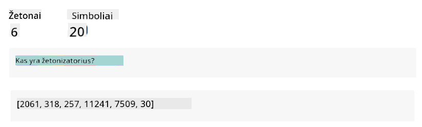
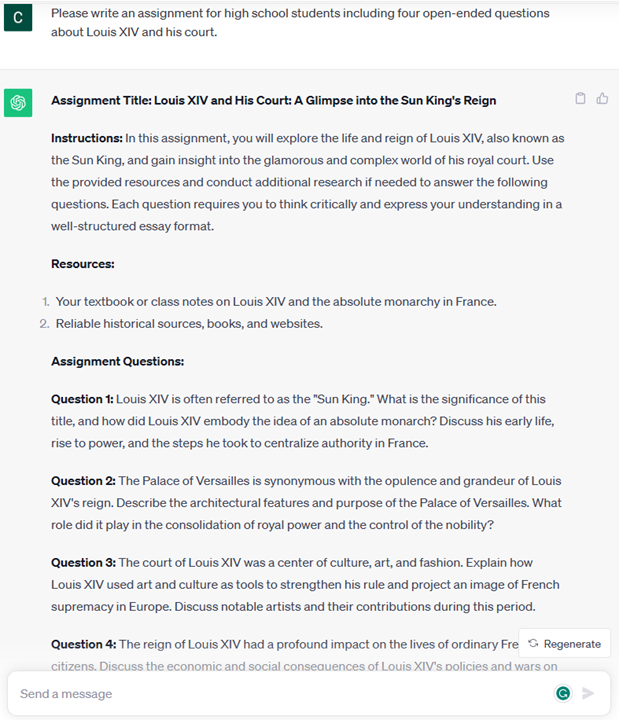

<!--
CO_OP_TRANSLATOR_METADATA:
{
  "original_hash": "bfb7901bdbece1ba3e9f35c400ca33e8",
  "translation_date": "2025-10-18T02:29:44+00:00",
  "source_file": "01-introduction-to-genai/README.md",
  "language_code": "lt"
}
-->
# Įvadas į generatyvinį dirbtinį intelektą ir didelius kalbos modelius

_(Spustelėkite aukščiau esančią nuotrauką, kad peržiūrėtumėte šios pamokos vaizdo įrašą)_

Generatyvinis dirbtinis intelektas yra dirbtinio intelekto forma, galinti generuoti tekstą, vaizdus ir kitokio tipo turinį. Ši technologija yra nuostabi, nes ji demokratizuoja dirbtinį intelektą – kiekvienas gali ja naudotis, tereikia parašyti tekstinį užklausą, natūralia kalba suformuluotą sakinį. Jums nereikia mokytis tokių programavimo kalbų kaip Java ar SQL, kad pasiektumėte vertingų rezultatų – užtenka naudoti savo kalbą, išreikšti, ko norite, ir dirbtinio intelekto modelis pateiks pasiūlymą. Šios technologijos taikymo galimybės ir poveikis yra milžiniški – galite rašyti ar suprasti ataskaitas, kurti programas ir dar daugiau, vos per kelias sekundes.

Šioje mokymo programoje nagrinėsime, kaip mūsų startuolis pasitelkia generatyvinį dirbtinį intelektą, kad atvertų naujas galimybes švietimo srityje, ir kaip sprendžiame neišvengiamus socialinius iššūkius, susijusius su šios technologijos taikymu, bei technologinius apribojimus.

## Įvadas

Šioje pamokoje aptarsime:

- Verslo scenarijaus pristatymą: mūsų startuolio idėją ir misiją.
- Generatyvinį dirbtinį intelektą ir kaip pasiekėme dabartinį technologijų lygį.
- Didelio kalbos modelio veikimo principus.
- Pagrindines didelių kalbos modelių galimybes ir praktinius panaudojimo atvejus.

## Mokymosi tikslai

Baigę šią pamoką, suprasite:

- Kas yra generatyvinis dirbtinis intelektas ir kaip veikia dideli kalbos modeliai.
- Kaip galite pasitelkti didelius kalbos modelius įvairiems panaudojimo atvejams, ypač švietimo srityje.

## Scenarijus: mūsų švietimo startuolis

Generatyvinis dirbtinis intelektas (DI) yra aukščiausias DI technologijos pasiekimas, peržengiantis tai, kas anksčiau buvo laikoma neįmanoma. Generatyviniai DI modeliai turi daugybę galimybių ir taikymo sričių, tačiau šioje mokymo programoje nagrinėsime, kaip jie revoliucionuoja švietimą per fiktyvų startuolį. Šį startuolį vadinsime _mūsų startuoliu_. Mūsų startuolis veikia švietimo srityje ir turi ambicingą misiją:

> _gerinti mokymosi prieinamumą pasauliniu mastu, užtikrinti lygiavertę prieigą prie švietimo ir teikti personalizuotas mokymosi patirtis kiekvienam mokiniui pagal jo poreikius_.

Mūsų startuolio komanda supranta, kad šio tikslo nepasieksime be vieno iš galingiausių šiuolaikinių įrankių – didelių kalbos modelių (LLM).

Generatyvinis DI turėtų revoliucionizuoti mokymosi ir mokymo būdus šiandien, suteikdamas studentams galimybę turėti virtualius mokytojus 24 valandas per parą, kurie teikia didžiulį kiekį informacijos ir pavyzdžių, o mokytojams – pasitelkti inovatyvius įrankius, kad galėtų vertinti savo mokinius ir teikti grįžtamąjį ryšį.

Pradėkime nuo pagrindinių sąvokų ir terminų, kuriuos naudosime visoje mokymo programoje.

## Kaip atsirado generatyvinis DI?

Nepaisant pastaruoju metu sukeltos nepaprastos _hype_ dėl generatyvinių DI modelių paskelbimo, ši technologija buvo kuriama dešimtmečius, o pirmieji tyrimai prasidėjo dar 60-aisiais. Dabar esame pasiekę tašką, kai DI turi žmogaus kognityvinius gebėjimus, tokius kaip pokalbis, kaip pavyzdžiui [OpenAI ChatGPT](https://openai.com/chatgpt) arba [Bing Chat](https://www.microsoft.com/edge/features/bing-chat?WT.mc_id=academic-105485-koreyst), kuris taip pat naudoja GPT modelį interneto paieškos Bing pokalbiams.

Grįžtant šiek tiek atgal, pirmieji DI prototipai buvo rašytiniai pokalbių robotai, kurie rėmėsi žinių baze, išgauta iš ekspertų grupės ir paversta kompiuterio duomenimis. Žinių bazėje esantys atsakymai buvo aktyvuojami pagal įvesties tekste pasirodančius raktinius žodžius. Tačiau greitai paaiškėjo, kad toks požiūris, naudojant rašytinius pokalbių robotus, nėra labai efektyvus.

### Statistinis požiūris į DI: mašininis mokymasis

Lūžis įvyko 90-aisiais, kai tekstų analizei buvo pritaikytas statistinis požiūris. Tai paskatino naujų algoritmų – vadinamų mašininio mokymosi – kūrimą, kurie galėjo mokytis iš duomenų šablonų, neturėdami aiškiai apibrėžtų programavimo taisyklių. Šis požiūris leido mašinoms imituoti žmogaus kalbos supratimą: statistinis modelis buvo apmokytas tekstų ir jų etikečių poromis, leidžiant modeliams klasifikuoti nežinomą įvesties tekstą pagal iš anksto apibrėžtą etiketę, atspindinčią pranešimo intenciją.

### Neuroniniai tinklai ir šiuolaikiniai virtualūs asistentai

Pastaraisiais metais technologinė aparatūros evoliucija, leidžianti apdoroti didesnius duomenų kiekius ir sudėtingesnius skaičiavimus, paskatino DI tyrimus, kurie atvedė prie pažangių mašininio mokymosi algoritmų, vadinamų neuroniniais tinklais arba giluminio mokymosi algoritmais, kūrimo.

Neuroniniai tinklai (ypač pasikartojantys neuroniniai tinklai – RNN) reikšmingai pagerino natūralios kalbos apdorojimą, leidžiant tekstų reikšmę atvaizduoti prasmingiau, vertinant žodžio kontekstą sakinyje.

Ši technologija tapo pagrindu virtualiems asistentams, atsiradusiems pirmąjį naujojo amžiaus dešimtmetį, kurie labai gerai interpretuoja žmogaus kalbą, nustato poreikį ir atlieka veiksmą, kad jį patenkintų – pavyzdžiui, atsako pagal iš anksto paruoštą scenarijų arba naudoja trečiųjų šalių paslaugas.

### Šiandien, generatyvinis DI

Taip mes pasiekėme generatyvinį DI šiandien, kuris gali būti laikomas giluminio mokymosi dalimi.

Po dešimtmečius trukusių DI srities tyrimų nauja modelio architektūra – vadinama _Transformer_ – įveikė RNN apribojimus, galėdama priimti daug ilgesnes teksto sekas kaip įvestį. Transformeriai yra pagrįsti dėmesio mechanizmu, leidžiančiu modeliui skirti skirtingą dėmesį gautiems įvesties duomenims, „daugiau dėmesio“ skiriant ten, kur koncentruojama svarbiausia informacija, nepriklausomai nuo jų tvarkos teksto sekoje.

Dauguma naujausių generatyvinių DI modelių – taip pat žinomų kaip dideli kalbos modeliai (LLM), nes jie dirba su tekstinėmis įvestimis ir išvestimis – iš tiesų yra pagrįsti šia architektūra. Įdomu tai, kad šie modeliai – apmokyti didžiuliu kiekiu nepažymėtų duomenų iš įvairių šaltinių, tokių kaip knygos, straipsniai ir interneto svetainės – gali būti pritaikyti įvairioms užduotims ir generuoti gramatiškai teisingą tekstą su tam tikru kūrybiškumo elementu. Taigi, jie ne tik nepaprastai pagerino mašinos gebėjimą „suprasti“ įvesties tekstą, bet ir suteikė galimybę generuoti originalų atsakymą žmogaus kalba.

## Kaip veikia dideli kalbos modeliai?

Kitame skyriuje nagrinėsime skirtingus generatyvinių DI modelių tipus, tačiau dabar pažvelkime, kaip veikia dideli kalbos modeliai, ypač sutelkdami dėmesį į OpenAI GPT (Generative Pre-trained Transformer) modelius.

- **Tokenizatorius, tekstas į skaičius**: Dideli kalbos modeliai gauna tekstą kaip įvestį ir generuoja tekstą kaip išvestį. Tačiau, būdami statistiniai modeliai, jie daug geriau veikia su skaičiais nei su tekstinėmis sekomis. Todėl kiekviena įvestis į modelį yra apdorojama tokenizatoriaus prieš naudojant pagrindinį modelį. Tokenas yra teksto dalis – sudaryta iš kintamo simbolių skaičiaus, todėl pagrindinė tokenizatoriaus užduotis yra padalinti įvestį į tokenų masyvą. Tada kiekvienas tokenas susiejamas su tokeno indeksu, kuris yra originalios teksto dalies sveikasis kodavimas.

- **Išvesties tokenų prognozavimas**: Turėdamas n tokenų kaip įvestį (maksimalus n skaičius skiriasi priklausomai nuo modelio), modelis gali prognozuoti vieną tokeną kaip išvestį. Šis tokenas tada įtraukiamas į kitos iteracijos įvestį, naudojant besiplečiančio lango modelį, leidžiantį geresnę vartotojo patirtį, gaunant vieną (ar kelis) sakinius kaip atsakymą. Tai paaiškina, kodėl, jei kada nors naudojotės ChatGPT, galėjote pastebėti, kad kartais jis atrodo sustojantis sakinio viduryje.

- **Atrankos procesas, tikimybių pasiskirstymas**: Išvesties tokenas pasirenkamas modelio pagal jo tikimybę atsirasti po dabartinės teksto sekos. Taip yra todėl, kad modelis prognozuoja tikimybių pasiskirstymą visiems galimiems „kitam tokenui“, apskaičiuotą remiantis jo mokymu. Tačiau ne visada iš pasiskirstymo pasirenkamas tokenas su didžiausia tikimybe. Šiam pasirinkimui pridedamas tam tikras atsitiktinumo laipsnis, kad modelis veiktų nedeterministiškai – mes negauname visiškai tokio paties išvesties kiekvieną kartą su ta pačia įvestimi. Šis atsitiktinumo laipsnis pridedamas siekiant imituoti kūrybinio mąstymo procesą ir jį galima reguliuoti naudojant modelio parametrą, vadinamą temperatūra.

## Kaip mūsų startuolis gali pasinaudoti dideliais kalbos modeliais?

Dabar, kai geriau suprantame didelio kalbos modelio veikimo principus, pažvelkime į keletą praktinių pavyzdžių, kokias dažniausiai atliekamas užduotis jie gali atlikti labai gerai, atsižvelgiant į mūsų verslo scenarijų. Mes sakėme, kad pagrindinė didelio kalbos modelio galimybė yra _generuoti tekstą nuo nulio, pradedant nuo tekstinės įvesties, parašytos natūralia kalba_.

Bet kokia gali būti tekstinė įvestis ir išvestis?
Didelio kalbos modelio įvestis vadinama užklausa, o išvestis – užbaigimu, terminu, kuris nurodo modelio mechanizmą generuoti kitą tokeną, kad užbaigtų dabartinę įvestį. Mes gilinsimės į tai, kas yra užklausa ir kaip ją sukurti, kad gautume kuo daugiau naudos iš mūsų modelio. Tačiau dabar tiesiog pasakysime, kad užklausa gali apimti:

- **Instrukciją**, nurodančią, kokio tipo išvesties tikimės iš modelio. Ši instrukcija kartais gali apimti pavyzdžius ar papildomus duomenis.

  1. Straipsnio, knygos, produktų apžvalgų ir kt. santrauka, kartu su įžvalgų iš neapdorotų duomenų išgavimu.
    
    
  
  2. Kūrybinės idėjos ir straipsnio, esė, užduoties ar kt. dizainas.
      
     

- **Klausimą**, užduotą pokalbio su agentu forma.
  
  

- Teksto **užbaigimo fragmentą**, kuris netiesiogiai yra prašymas padėti rašyti.
  
  

- Kodo fragmentą kartu su prašymu paaiškinti ir dokumentuoti jį arba komentarą, prašant sukurti kodo dalį, atliekančią konkrečią užduotį.
  
  

Aukščiau pateikti pavyzdžiai yra gana paprasti ir nėra skirti būti išsamia didelių kalbos modelių galimybių demonstracija. Jie skirti parodyti generatyvinio DI potencialą, ypač, bet ne tik, švietimo kontekste.

Taip pat generatyvinio DI modelio išvestis nėra tobula, ir kartais modelio kūrybiškumas gali veikti prieš jį, sukuriant išvestį, kurią žmogus gali interpretuoti kaip realybės iškraipymą arba kuri gali būti įžeidžianti. Generatyvinis DI nėra intelektualus – bent jau platesne intelekto apibrėžimo prasme, apimančia kritinį ir kūrybinį mąstymą ar emocinį intelektą; jis nėra deterministinis ir nėra patikimas, nes klaidingos nuorodos, turinys ir teiginiai gali būti derinami su teisinga informacija ir pateikiami įtikinamai bei užtikrintai. Kitose pamokose nagrinėsime visus šiuos apribojimus ir pamatysime, ką galime padaryti, kad juos sumažintume.

## Užduotis

Jūsų užduotis yra daugiau pasiskaityti apie [generatyvinį DI](https://en.wikipedia.org/wiki/Generative_artificial_intelligence?WT.mc_id=academic-105485-koreyst) ir pabandyti nustatyti sritį, kurioje šiandien galėtumėte pridėti generatyvinį DI, kur jo dar nėra. Kaip poveikis skirtųsi nuo to, kaip tai daroma „senais būdais“, ar galėtumėte padaryti tai, ko anksčiau negalėjote, arba ar tai būtų greičiau? Parašykite 300 žodžių santrauką apie tai, kaip atrodytų jūsų svajonių DI startuolis, ir įtraukite antraštes, tokias kaip „Problema“, „Kaip naudočiau DI“, „Poveikis“ ir, jei norite, verslo planą.

Jei atlikote šią užduotį, galbūt jau esate pasiruošę kreiptis į „Microsoft“ inkubatorių, [Microsoft for Startups Founders Hub](https://www.microsoft.com/startups?WT.mc_id=academic-105485-koreyst
Eikite į 2 pamoką, kurioje apžvelgsime, kaip [tyrinėti ir palyginti skirtingus LLM tipus](../02-exploring-and-comparing-different-llms/README.md?WT.mc_id=academic-105485-koreyst)!

---

**Atsakomybės apribojimas**:  
Šis dokumentas buvo išverstas naudojant AI vertimo paslaugą [Co-op Translator](https://github.com/Azure/co-op-translator). Nors siekiame tikslumo, prašome atkreipti dėmesį, kad automatiniai vertimai gali turėti klaidų ar netikslumų. Originalus dokumentas jo gimtąja kalba turėtų būti laikomas autoritetingu šaltiniu. Kritinei informacijai rekomenduojama naudoti profesionalų žmogaus vertimą. Mes neprisiimame atsakomybės už nesusipratimus ar neteisingus aiškinimus, atsiradusius dėl šio vertimo naudojimo.