<!--
CO_OP_TRANSLATOR_METADATA:
{
  "original_hash": "e2f686f2eb794941761252ac5e8e090b",
  "translation_date": "2025-08-25T12:23:23+00:00",
  "source_file": "02-exploring-and-comparing-different-llms/README.md",
  "language_code": "lt"
}
-->
# LLM tyrinėjimas ir palyginimas

[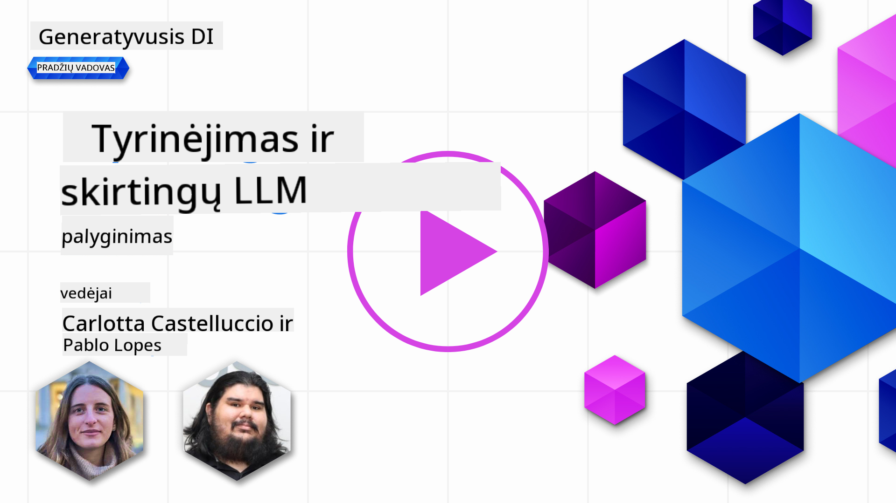](https://aka.ms/gen-ai-lesson2-gh?WT.mc_id=academic-105485-koreyst)

> _Spustelėkite paveikslėlį aukščiau, kad peržiūrėtumėte šios pamokos vaizdo įrašą_

Praeitoje pamokoje matėme, kaip generatyvusis dirbtinis intelektas keičia technologijų pasaulį, kaip veikia dideli kalbos modeliai (LLM) ir kaip verslas – kaip mūsų startuolis – gali juos pritaikyti savo poreikiams ir augti! Šiame skyriuje palyginsime skirtingus didelius kalbos modelius (LLM), kad suprastume jų privalumus ir trūkumus.

Kitas mūsų startuolio žingsnis – susipažinti su dabartine LLM aplinka ir suprasti, kurie modeliai tinkami mūsų atvejui.

## Įvadas

Šioje pamokoje aptarsime:

- Skirtingus LLM tipus dabartinėje aplinkoje.
- Modelių testavimą, iteravimą ir palyginimą Azure platformoje pagal jūsų poreikius.
- Kaip diegti LLM.

## Mokymosi tikslai

Baigę šią pamoką, galėsite:

- Pasirinkti tinkamą modelį savo atvejui.
- Suprasti, kaip testuoti, iteruoti ir gerinti modelio našumą.
- Žinoti, kaip verslai diegia modelius.

## Supraskite skirtingus LLM tipus

LLM galima skirstyti pagal architektūrą, mokymo duomenis ir paskirtį. Supratimas, kuo jie skiriasi, padės mūsų startuoliui pasirinkti tinkamą modelį ir suprasti, kaip testuoti, iteruoti ir gerinti našumą.

Yra daug skirtingų LLM modelių tipų, o pasirinkimas priklauso nuo to, kam juos naudosite, kokius duomenis turite, kiek esate pasiruošę investuoti ir kitų veiksnių.

Priklausomai nuo to, ar norite generuoti tekstą, garsą, vaizdą, video ir t.t., galite rinktis skirtingą modelio tipą.

- **Garsas ir kalbos atpažinimas**. Šiam tikslui puikiai tinka Whisper tipo modeliai – jie universalūs ir skirti kalbos atpažinimui. Jie apmokyti su įvairiais garso duomenimis ir geba atpažinti kalbą įvairiomis kalbomis. Daugiau apie Whisper tipo modelius skaitykite [čia](https://platform.openai.com/docs/models/whisper?WT.mc_id=academic-105485-koreyst).

- **Vaizdų generavimas**. Vaizdų generavimui labai žinomi DALL-E ir Midjourney modeliai. DALL-E siūlo Azure OpenAI. [Plačiau apie DALL-E skaitykite čia](https://platform.openai.com/docs/models/dall-e?WT.mc_id=academic-105485-koreyst) ir 9 skyriuje.

- **Teksto generavimas**. Dauguma modelių apmokyti teksto generavimui, ir turite platų pasirinkimą nuo GPT-3.5 iki GPT-4. Jie skiriasi kaina, GPT-4 yra brangiausias. Verta išbandyti [Azure OpenAI playground](https://oai.azure.com/portal/playground?WT.mc_id=academic-105485-koreyst), kad įvertintumėte, kurie modeliai geriausiai atitinka jūsų poreikius pagal galimybes ir kainą.

- **Daugiarūšiai modeliai**. Jei norite apdoroti įvairių tipų duomenis įvestyje ir išvestyje, verta pasidomėti tokiais modeliais kaip [gpt-4 turbo su vaizdu arba gpt-4o](https://learn.microsoft.com/azure/ai-services/openai/concepts/models#gpt-4-and-gpt-4-turbo-models?WT.mc_id=academic-105485-koreyst) – naujausi OpenAI modeliai, kurie sujungia natūralios kalbos apdorojimą su vaizdiniu suvokimu ir leidžia sąveikauti per daugiarūšes sąsajas.

Pasirinkus modelį, gaunate bazines galimybes, kurios dažnai nepakankamos. Dažnai turite įmonės specifinių duomenų, kuriuos reikia kažkaip „papasakoti“ LLM. Yra keli būdai, kaip tai padaryti – apie tai daugiau kitose dalyse.

### Pagrindiniai modeliai ir LLM

Pagrindinio modelio (Foundation Model) sąvoką [sukūrė Stanfordo tyrėjai](https://arxiv.org/abs/2108.07258?WT.mc_id=academic-105485-koreyst) ir apibrėžė kaip AI modelį, kuris atitinka tam tikrus kriterijus, pvz.:

- **Jie apmokomi naudojant nesupervizuotą arba savarankišką mokymąsi**, t.y. mokomi su nepažymėtais daugiarūšiais duomenimis, nereikalaujant žmogaus žymėjimo ar anotavimo.
- **Jie yra labai dideli modeliai**, paremti giliu neuroniniu tinklu, apmokytu su milijardais parametrų.
- **Jie dažniausiai skirti būti „pagrindu“ kitiems modeliams**, t.y. gali būti naudojami kaip atspirties taškas kitiems modeliams, kuriuos galima pritaikyti (fine-tuning).

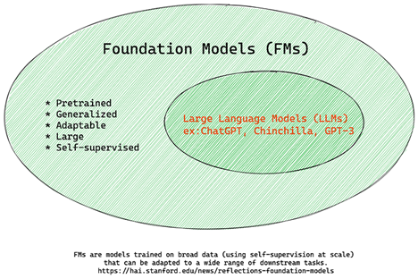

Paveikslėlio šaltinis: [Essential Guide to Foundation Models and Large Language Models | by Babar M Bhatti | Medium
](https://thebabar.medium.com/essential-guide-to-foundation-models-and-large-language-models-27dab58f7404)

Kad būtų aiškiau, paimkime ChatGPT pavyzdį. Pirmąją ChatGPT versiją sukūrė remiantis GPT-3.5 pagrindiniu modeliu. Tai reiškia, kad OpenAI panaudojo pokalbių duomenis, kad sukurtų pritaikytą GPT-3.5 versiją, kuri puikiai veikia pokalbių scenarijuose, pvz., chatbotuose.

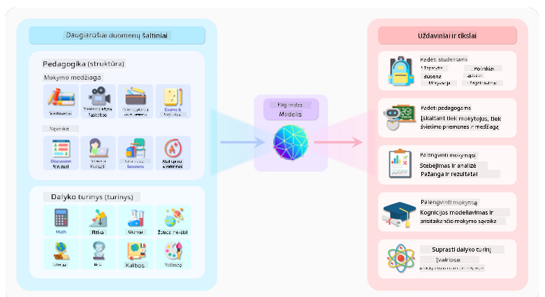

Paveikslėlio šaltinis: [2108.07258.pdf (arxiv.org)](https://arxiv.org/pdf/2108.07258.pdf?WT.mc_id=academic-105485-koreyst)

### Atviro kodo ir nuosavybiniai modeliai

Dar vienas LLM skirstymo būdas – ar jie atviro kodo, ar nuosavybiniai.

Atviro kodo modeliai yra viešai prieinami ir juos gali naudoti visi. Dažnai juos pateikia juos sukūrusi įmonė arba mokslininkų bendruomenė. Šiuos modelius galima analizuoti, keisti ir pritaikyti įvairiems LLM atvejams. Tačiau jie ne visada optimizuoti produkciniam naudojimui ir gali būti ne tokie našūs kaip nuosavybiniai modeliai. Be to, atviro kodo modelių finansavimas gali būti ribotas, jie gali būti neprižiūrimi ilgą laiką ar neatnaujinami pagal naujausius tyrimus. Populiarūs atviro kodo modeliai: [Alpaca](https://crfm.stanford.edu/2023/03/13/alpaca.html?WT.mc_id=academic-105485-koreyst), [Bloom](https://huggingface.co/bigscience/bloom) ir [LLaMA](https://llama.meta.com).

Nuosavybiniai modeliai priklauso įmonei ir nėra viešai prieinami. Jie dažnai optimizuoti produkciniam naudojimui. Tačiau jų negalima analizuoti, keisti ar pritaikyti skirtingiems atvejams. Be to, jie ne visada nemokami, gali reikėti prenumeratos ar mokėjimo. Taip pat naudotojai nekontroliuoja, kokie duomenys naudojami modelio mokymui, todėl reikia pasitikėti modelio savininku dėl duomenų privatumo ir atsakingo AI naudojimo. Populiarūs nuosavybiniai modeliai: [OpenAI modeliai](https://platform.openai.com/docs/models/overview?WT.mc_id=academic-105485-koreyst), [Google Bard](https://sapling.ai/llm/bard?WT.mc_id=academic-105485-koreyst) arba [Claude 2](https://www.anthropic.com/index/claude-2?WT.mc_id=academic-105485-koreyst).

### Embedding, vaizdų generavimas, teksto ir kodo generavimas

LLM galima skirstyti ir pagal generuojamą išvestį.

Embedding – tai modeliai, kurie tekstą paverčia skaitine forma, vadinama embedding, t.y. skaitmenine teksto reprezentacija. Embedding palengvina mašinoms suprasti žodžių ar sakinių tarpusavio ryšius ir gali būti naudojami kaip įvestis kitiems modeliams, pvz., klasifikavimo ar klasterizavimo, kurie geriau veikia su skaitiniais duomenimis. Embedding modeliai dažnai naudojami transfer learning, kai modelis apmokomas su gausiais duomenimis pagal kitą užduotį, o modelio svoriai (embedding) panaudojami kitoms užduotims. Pavyzdys – [OpenAI embeddings](https://platform.openai.com/docs/models/embeddings?WT.mc_id=academic-105485-koreyst).

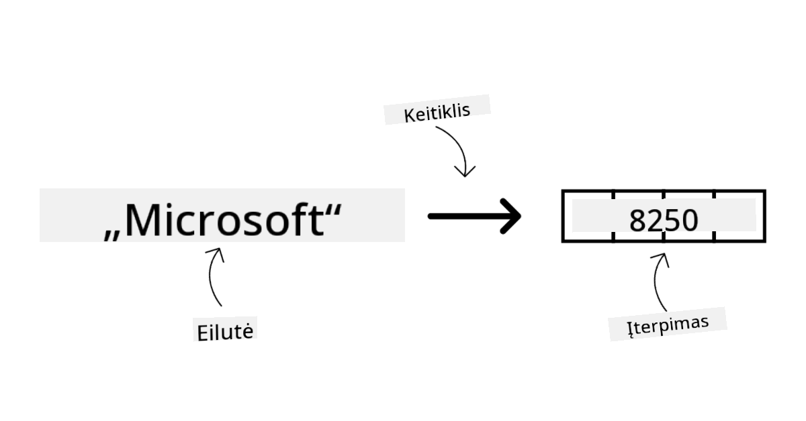

Vaizdų generavimo modeliai kuria vaizdus. Jie dažnai naudojami vaizdų redagavimui, sintezei ir vertimui. Tokie modeliai apmokyti su dideliais vaizdų duomenų rinkiniais, pvz., [LAION-5B](https://laion.ai/blog/laion-5b/?WT.mc_id=academic-105485-koreyst), ir gali generuoti naujus vaizdus arba redaguoti esamus, taikant inpainting, superrezoliucijos ir spalvinimo technikas. Pavyzdžiai: [DALL-E-3](https://openai.com/dall-e-3?WT.mc_id=academic-105485-koreyst) ir [Stable Diffusion modeliai](https://github.com/Stability-AI/StableDiffusion?WT.mc_id=academic-105485-koreyst).

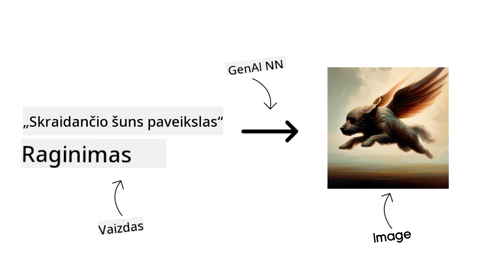

Teksto ir kodo generavimo modeliai kuria tekstą arba kodą. Jie dažnai naudojami teksto santraukai, vertimui, klausimų atsakymui. Teksto generavimo modeliai apmokyti su dideliais tekstų duomenų rinkiniais, pvz., [BookCorpus](https://www.cv-foundation.org/openaccess/content_iccv_2015/html/Zhu_Aligning_Books_and_ICCV_2015_paper.html?WT.mc_id=academic-105485-koreyst), ir gali generuoti naują tekstą ar atsakyti į klausimus. Kodo generavimo modeliai, kaip [CodeParrot](https://huggingface.co/codeparrot?WT.mc_id=academic-105485-koreyst), apmokyti su dideliais kodų duomenų rinkiniais, pvz., GitHub, ir gali generuoti naują kodą ar taisyti esamo kodo klaidas.

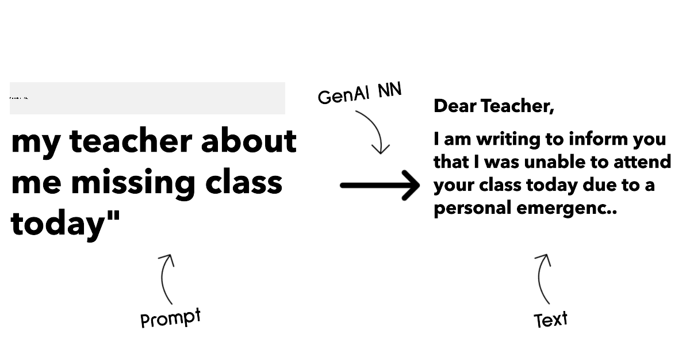

### Encoder-Decoder ir tik Decoder

Norint paaiškinti skirtingas LLM architektūras, pasitelkime analogiją.

Įsivaizduokite, kad vadovas jums paskyrė užduotį sukurti testą studentams. Turite du kolegas: vienas kuria turinį, kitas jį peržiūri.

Turinio kūrėjas – kaip tik Decoder modelis, jis gali pažiūrėti į temą ir tai, ką jau parašėte, ir sukurti kursą pagal tai. Jie puikiai rašo įdomų ir informatyvų turinį, bet ne itin gerai supranta temą ir mokymosi tikslus. Decoder modelių pavyzdžiai – GPT šeimos modeliai, pvz., GPT-3.

Recenzentas – kaip tik Encoder modelis, jis žiūri į parašytą kursą ir atsakymus, pastebi ryšius ir supranta kontekstą, bet nėra geras turinio kūrėjas. Encoder modelio pavyzdys – BERT.

Įsivaizduokite, kad turime žmogų, kuris ir kuria, ir peržiūri testą – tai Encoder-Decoder modelis. Pavyzdžiai: BART ir T5.

### Paslauga ir modelis

Dabar pakalbėkime apie skirtumą tarp paslaugos ir modelio. Paslauga – tai produktas, kurį siūlo debesų paslaugų tiekėjas, dažnai sudarytas iš modelių, duomenų ir kitų komponentų. Modelis – tai paslaugos pagrindas, dažnai pagrindinis modelis, pvz., LLM.

Paslaugos dažnai optimizuotos produkciniam naudojimui ir lengviau naudojamos nei modeliai, per grafinę sąsają. Tačiau paslaugos ne visada nemokamos, gali reikėti prenumeratos ar mokėjimo, mainais už paslaugos savininko įrangą ir resursus, išlaidų optimizavimą ir lengvą mastelio keitimą. Pavyzdys – [Azure OpenAI Service](https://learn.microsoft.com/azure/ai-services/openai/overview?WT.mc_id=academic-105485-koreyst), kuri siūlo „mokėk už naudojimą“ planą, t.y. mokate proporcingai naudojimui. Taip pat Azure OpenAI Service siūlo įmonės lygio saugumą ir atsakingo AI sistemą papildomai prie modelių galimybių.

Modeliai – tai tik neuroninis tinklas su parametrais, svoriais ir kt. Įmonės gali juos paleisti lokaliai, tačiau reikia įsigyti įrangą, sukurti infrastruktūrą mastelio keitimui ir nusipirkti licenciją arba naudoti atviro kodo modelį. Tokį modelį kaip LLaMA galima naudoti, jei turite pakankamai skaičiavimo resursų.

## Kaip testuoti ir iteruoti su skirtingais modeliais, kad suprastumėte našumą Azure

Kai komanda susipažino su dabartine LLM aplinka ir išsirinko keletą tinkamų kandidatų savo scenarijams, kitas žingsnis – juos testuoti su savo duomenimis ir darbo krūviu. Tai iteracinis procesas, vykdomas eksperimentuojant ir matuojant rezultatus.
Dauguma modelių, kuriuos minėjome ankstesniuose paragrafuose (OpenAI modeliai, atvirojo kodo modeliai kaip Llama2 ir Hugging Face transformeriai), yra prieinami [Modelių kataloge](https://learn.microsoft.com/azure/ai-studio/how-to/model-catalog-overview?WT.mc_id=academic-105485-koreyst) [Azure AI Studio](https://ai.azure.com/?WT.mc_id=academic-105485-koreyst).

[Azure AI Studio](https://learn.microsoft.com/azure/ai-studio/what-is-ai-studio?WT.mc_id=academic-105485-koreyst) yra debesijos platforma, sukurta kūrėjams, norintiems kurti generatyviosios AI programas ir valdyti visą kūrimo ciklą – nuo eksperimentavimo iki vertinimo – sujungiant visas Azure AI paslaugas į vieną patogų centrą su grafinė vartotojo sąsaja. Modelių katalogas Azure AI Studio leidžia vartotojui:

- Rasti dominančius bazinius modelius kataloge – tiek nuosavybinius, tiek atvirojo kodo, filtruojant pagal užduotį, licenciją ar pavadinimą. Kad paieška būtų patogesnė, modeliai suskirstyti į kolekcijas, tokias kaip Azure OpenAI kolekcija, Hugging Face kolekcija ir kt.

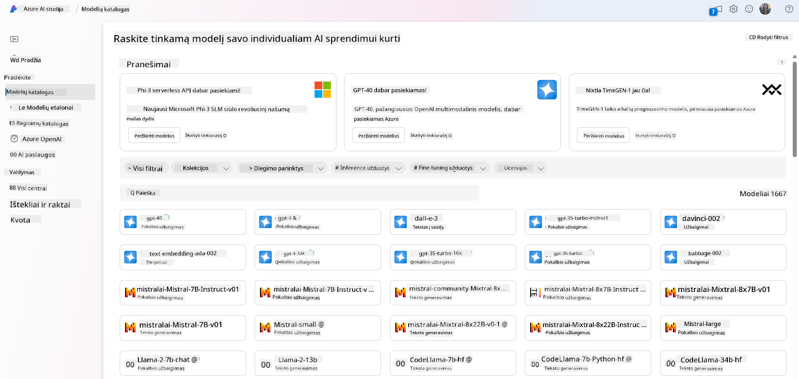

- Peržiūrėti modelio kortelę, kurioje pateikiamas išsamus aprašymas apie numatomą naudojimą ir mokymo duomenis, kodo pavyzdžiai ir vertinimo rezultatai vidinėje vertinimų bibliotekoje.

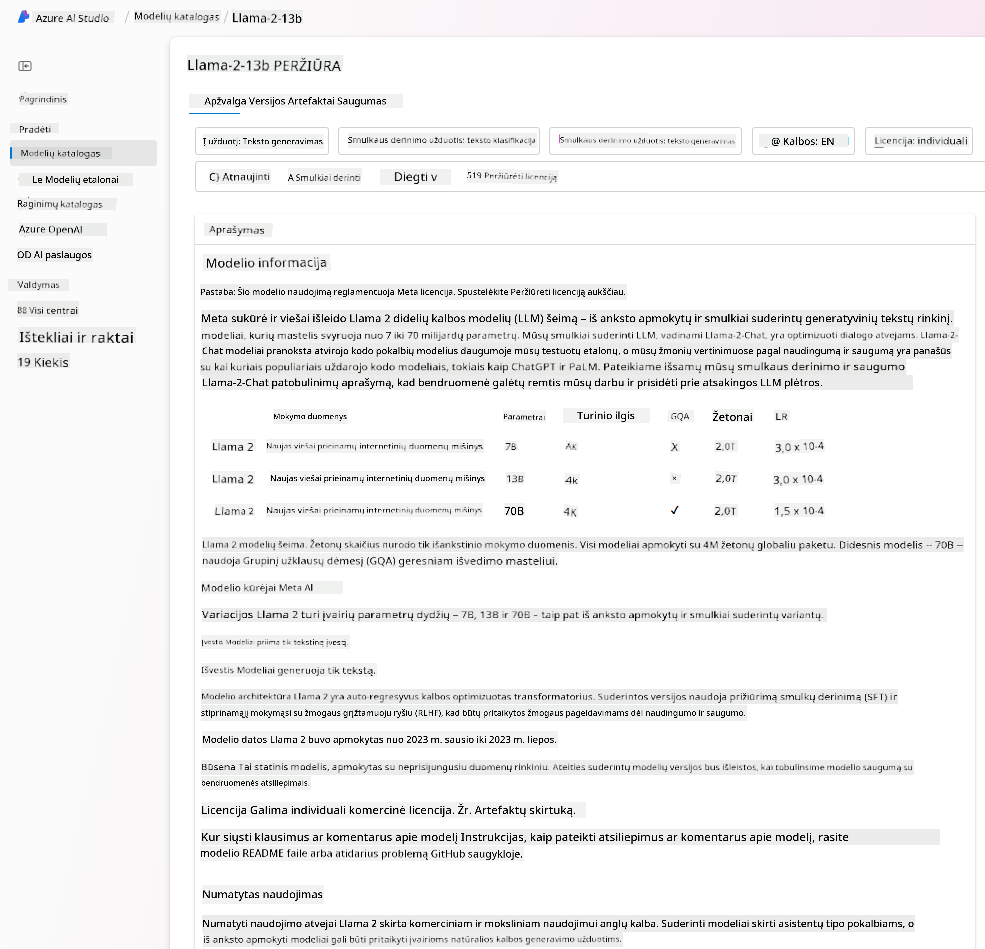

- Palyginti modelių ir duomenų rinkinių našumo rodiklius, kad įvertintumėte, kuris modelis geriausiai atitinka verslo scenarijų, naudojantis [Model Benchmarks](https://learn.microsoft.com/azure/ai-studio/how-to/model-benchmarks?WT.mc_id=academic-105485-koreyst) skiltimi.

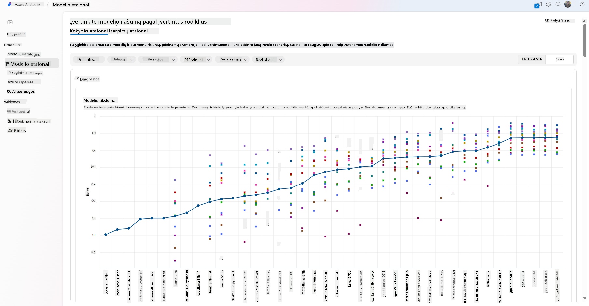

- Tobulinti modelį su individualiais mokymo duomenimis, kad pagerintumėte modelio našumą konkrečioje užduotyje, pasinaudojant Azure AI Studio eksperimentavimo ir stebėjimo galimybėmis.

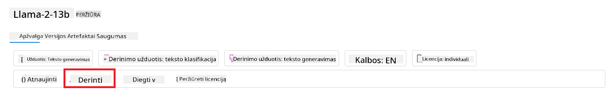

- Diegti originalų iš anksto apmokytą modelį arba patobulintą versiją nuotoliniam realaus laiko inferencijai – valdomoje skaičiavimo aplinkoje – arba serverless API galutiniame taške – [mokant tik už naudojimą](https://learn.microsoft.com/azure/ai-studio/how-to/model-catalog-overview#model-deployment-managed-compute-and-serverless-api-pay-as-you-go?WT.mc_id=academic-105485-koreyst) – kad programos galėtų jį naudoti.

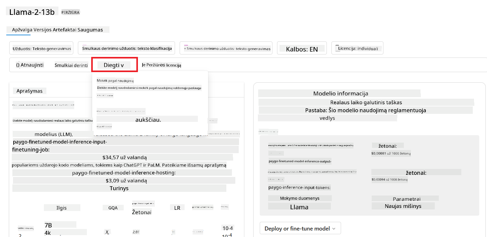

> [!NOTE]
> Ne visi kataloge esantys modeliai šiuo metu gali būti tobulinami ir/arba diegiami mokant tik už naudojimą. Patikrinkite modelio kortelę, kad sužinotumėte apie modelio galimybes ir apribojimus.

## LLM rezultatų gerinimas

Kartu su mūsų startuolio komanda išbandėme įvairius LLM tipus ir debesijos platformą (Azure Machine Learning), kuri leidžia palyginti skirtingus modelius, įvertinti juos su testiniais duomenimis, pagerinti našumą ir diegti juos inferencijos galutiniuose taškuose.

Bet kada verta rinktis modelio tobulinimą, o kada užtenka naudoti iš anksto apmokytą modelį? Ar yra kitų būdų pagerinti modelio našumą konkrečiose užduotyse?

Yra keletas būdų, kaip verslas gali pasiekti norimų rezultatų iš LLM. Galite pasirinkti skirtingų tipų modelius su skirtingu apmokymo lygiu, diegiant LLM gamyboje, priklausomai nuo sudėtingumo, kainos ir kokybės. Štai keletas skirtingų būdų:

- **Promptų inžinerija su kontekstu**. Svarbu pateikti pakankamai konteksto užklausoje, kad gautumėte norimus atsakymus.

- **Retrieval Augmented Generation, RAG**. Jūsų duomenys gali būti duomenų bazėje ar žiniatinklio taške, todėl, kad šie duomenys ar jų dalis būtų įtraukti į užklausą, galite surinkti aktualius duomenis ir įtraukti juos į vartotojo užklausą.

- **Tobulintas modelis**. Čia modelis papildomai apmokomas su jūsų duomenimis, todėl jis tampa tikslesnis ir geriau atitinka jūsų poreikius, tačiau tai gali būti brangu.

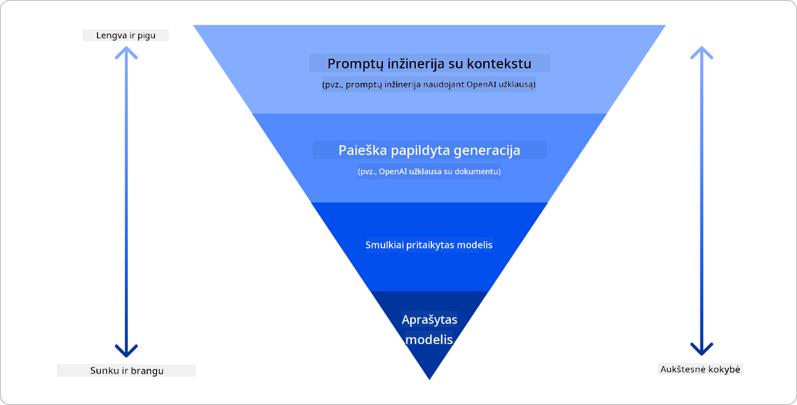

Paveikslėlio šaltinis: [Four Ways that Enterprises Deploy LLMs | Fiddler AI Blog](https://www.fiddler.ai/blog/four-ways-that-enterprises-deploy-llms?WT.mc_id=academic-105485-koreyst)

### Promptų inžinerija su kontekstu

Iš anksto apmokyti LLM puikiai veikia su bendromis natūralios kalbos užduotimis, net jei jiems pateikiama tik trumpa užklausa, pavyzdžiui, sakinys užbaigti ar klausimas – tai vadinama „zero-shot“ mokymusi.

Tačiau kuo detaliau vartotojas suformuluoja užklausą, pateikdamas išsamų prašymą ir pavyzdžius – t. y. kontekstą – tuo tikslesnis ir artimesnis lūkesčiams bus atsakymas. Jei užklausoje yra tik vienas pavyzdys, tai vadinama „one-shot“ mokymusi, o jei keli – „few-shot“ mokymusi.
Promptų inžinerija su kontekstu yra pats ekonomiškiausias būdas pradėti.

### Retrieval Augmented Generation (RAG)

LLM turi apribojimą – jie gali naudoti tik tuos duomenis, kurie buvo panaudoti jų mokyme, kad sugeneruotų atsakymą. Tai reiškia, kad jie nežino nieko apie įvykius po jų mokymo ir negali pasiekti neviešos informacijos (pvz., įmonės duomenų).
Tai galima išspręsti naudojant RAG – techniką, kuri papildo užklausą išoriniais duomenimis, pateiktais dokumentų fragmentais, atsižvelgiant į užklausos ilgio ribas. Tai palaiko vektorinės duomenų bazės įrankiai (pvz., [Azure Vector Search](https://learn.microsoft.com/azure/search/vector-search-overview?WT.mc_id=academic-105485-koreyst)), kurie suranda naudingus fragmentus iš įvairių iš anksto apibrėžtų duomenų šaltinių ir prideda juos prie užklausos konteksto.

Ši technika labai naudinga, kai verslas neturi pakankamai duomenų, laiko ar resursų LLM tobulinimui, bet vis tiek nori pagerinti našumą konkrečioje užduotyje ir sumažinti išgalvotų atsakymų, t. y. realybės iškraipymo ar žalingo turinio, riziką.

### Tobulintas modelis

Modelio tobulinimas – tai procesas, kai pasitelkiamas perkėlimo mokymasis, kad modelis būtų „pritaikytas“ konkrečiai užduočiai ar problemai spręsti. Skirtingai nei few-shot mokymasis ar RAG, šiuo atveju sukuriamas naujas modelis su atnaujintais svoriais ir poslinkiais. Tam reikia mokymo pavyzdžių rinkinio, sudaryto iš vienos užklausos (prompt) ir jai priskirto atsakymo (completion).
Šis būdas tinkamiausias, jei:

- **Naudojami tobulinti modeliai**. Verslas nori naudoti tobulintus, bet mažiau pajėgius modelius (pvz., embedding modelius), o ne aukštos kokybės modelius, taip gaunant ekonomiškesnį ir greitesnį sprendimą.

- **Svarbus vėlavimas**. Jei konkrečiam atvejui svarbus mažas vėlavimas, todėl negalima naudoti labai ilgų užklausų arba pavyzdžių kiekis, iš kurių modelis turi mokytis, netelpa į užklausos ilgio ribą.

- **Nuolatinis atnaujinimas**. Verslas turi daug aukštos kokybės duomenų ir teisingų žymų bei resursų, reikalingų šiuos duomenis nuolat atnaujinti.

### Apmokytas modelis

LLM apmokymas nuo nulio – be abejonės, sudėtingiausias ir daugiausiai resursų reikalaujantis būdas, kuriam reikia didžiulių duomenų kiekių, kvalifikuotų specialistų ir tinkamos skaičiavimo galios. Šią galimybę verta svarstyti tik tada, kai verslas turi labai specifinį srities atvejį ir daug srities duomenų.

## Žinių patikrinimas

Kuris būdas galėtų būti tinkamas LLM užbaigimo rezultatų gerinimui?

1. Promptų inžinerija su kontekstu
1. RAG
1. Tobulintas modelis

A:3, jei turite laiko, resursų ir aukštos kokybės duomenų, tobulinimas yra geriausias pasirinkimas norint išlikti aktualiems. Tačiau jei norite pagerinti rezultatus, bet trūksta laiko, verta pirmiausia apsvarstyti RAG.

## 🚀 Iššūkis

Plačiau pasidomėkite, kaip galite [naudoti RAG](https://learn.microsoft.com/azure/search/retrieval-augmented-generation-overview?WT.mc_id=academic-105485-koreyst) savo versle.

## Puikus darbas, tęskite mokymąsi

Baigę šią pamoką, peržiūrėkite mūsų [Generatyviosios AI mokymosi kolekciją](https://aka.ms/genai-collection?WT.mc_id=academic-105485-koreyst), kad dar labiau pagilintumėte žinias apie generatyviąją AI!

Eikite į 3 pamoką, kurioje aptarsime, kaip [atsakingai kurti su generatyviąja AI](../03-using-generative-ai-responsibly/README.md?WT.mc_id=academic-105485-koreyst)!

---

**Atsakomybės atsisakymas**:  
Šis dokumentas buvo išverstas naudojant dirbtinio intelekto vertimo paslaugą [Co-op Translator](https://github.com/Azure/co-op-translator). Nors siekiame tikslumo, prašome atkreipti dėmesį, kad automatiniai vertimai gali turėti klaidų ar netikslumų. Originalus dokumentas jo gimtąja kalba turėtų būti laikomas autoritetingu šaltiniu. Kritinei informacijai rekomenduojame profesionalų žmogaus vertimą. Mes neatsakome už nesusipratimus ar neteisingą interpretavimą, kilusį dėl šio vertimo naudojimo.