# Skirtumų tyrinėjimas ir palyginimas tarp skirtingų LLM

[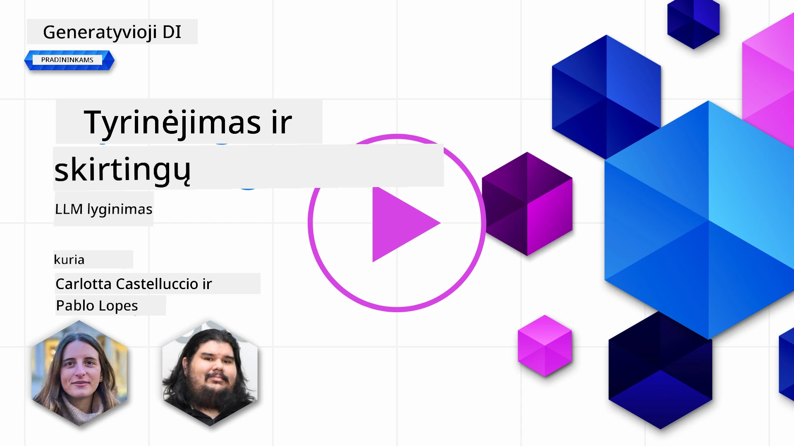](https://youtu.be/KIRUeDKscfI?si=8BHX1zvwzQBn-PlK)

> _Spustelėkite aukščiau esančią nuotrauką, kad peržiūrėtumėte pamokos vaizdo įrašą_

Ankstesnėje pamokoje matėme, kaip Generatyvioji AI keičia technologijų kraštovaizdį, kaip veikia dideli kalbos modeliai (LLM) ir kaip verslas – pavyzdžiui, mūsų startuolis – gali juos pritaikyti savo atvejams ir augti! Šiame skyriuje siekiame palyginti ir prieštarauti skirtingų tipų dideliems kalbos modeliams (LLM), kad suprastume jų privalumus ir trūkumus.

Kitas žingsnis mūsų startuolio kelionėje yra ištirti dabartinį LLM kraštovaizdį ir suprasti, kurie tinka mūsų atvejui.

## Įvadas

Ši pamoka apims:

- Dabartinio kraštovaizdžio skirtingų tipų LLM.
- Testavimą, iteravimą ir palyginimą skirtingų modelių jūsų atvejui Azure aplinkoje.
- Kaip įdiegti LLM.

## Mokymosi tikslai

Baigę šią pamoką galėsite:

- Pasirinkti tinkamą modelį jūsų atvejui.
- Suprasti, kaip testuoti, iteruoti ir gerinti modelio našumą.
- Žinoti, kaip verslai diegia modelius.

## Suprasti skirtingų tipų LLM

LLM galima skirtingai klasifikuoti pagal jų architektūrą, mokymosi duomenis ir panaudojimo atvejį. Šių skirtumų supratimas padės mūsų startuoliui pasirinkti tinkamą modelį scenarijui ir suprasti, kaip testuoti, iteruoti ir pagerinti našumą.

Yra daug skirtingų LLM modelių tipų, o jūsų modelio pasirinkimas priklauso nuo to, kam juos ketinate naudoti, jūsų duomenų, kiek esate pasiruošę mokėti ir kitų veiksnių.

Priklausomai nuo to, ar ketinate naudoti modelius tekstui, garsui, vaizdo įrašams, vaizdų generavimui ir panašiai, galite pasirinkti skirtingo tipo modelį.

- **Garsas ir kalbos atpažinimas**. Whisper tipo modeliai vis dar yra naudingi bendrojo paskyrimo kalbos atpažinimo modeliai, tačiau gamybos pasirinkimai dabar taip pat apima naujesnius kalbos į tekstą modelius, tokius kaip `gpt-4o-transcribe`, `gpt-4o-mini-transcribe` ir diarinimo variantus. Įvertinkite kalbų aprėptį, diarizaciją, realaus laiko palaikymą, delsą ir kainą jūsų scenarijui. Daugiau sužinokite [OpenAI kalbos į tekstą dokumentacijoje](https://platform.openai.com/docs/guides/speech-to-text?WT.mc_id=academic-105485-koreyst).

- **Vaizdų generavimas**. DALL-E ir Midjourney yra gerai žinomos vaizdų generavimo parinktys, tačiau dabartiniai OpenAI vaizdų API daugiausia orientuoti į GPT vaizdų modelius, tokius kaip `gpt-image-2`, o taip pat dažnai naudojamos ir Stable Diffusion, Imagen, Flux bei kitos modelių šeimos. Palyginkite prompto atitikimą, redagavimo palaikymą, stiliaus valdymą, saugumo reikalavimus ir licencijavimą. Daugiau sužinokite [OpenAI vaizdų generavimo gairėse](https://platform.openai.com/docs/guides/images?WT.mc_id=academic-105485-koreyst) ir šio mokymo plano 9 skyriuje.

- **Teksto generavimas**. Teksto modeliai dabar apima pažangius modelius, mąstymo modelius, mažesnius žemų delsos modelius ir atviro svorio modelius. Dabartiniai pavyzdžiai apima OpenAI GPT-5.x modelius, Anthropic Claude 4.x modelius, Google Gemini 3.x modelius, Meta Llama 4 modelius ir Mistral modelius. Nenaudokite tik išleidimo datos ar kainos; palyginkite užduoties kokybę, delsą, konteksto langą, priemonių naudojimą, saugumo elgesį, regioninį prieinamumą ir bendrą kainą. [Microsoft Foundry modelių katalogas](https://ai.azure.com/catalog?WT.mc_id=academic-105485-koreyst) yra gera vieta palyginti Azure prieinamus modelius.

- **Multi-modalumas**. Daugelis dabartinių modelių gali apdoroti daugiau kaip tik tekstą. Kai kurie priima vaizdo, garso ar vaizdo įrašo įvestis; kai kurie gali kviesti įrankius; o specializuoti modeliai gali generuoti vaizdus, garsus ar vaizdo įrašus. Pavyzdžiui, dabartiniai OpenAI modeliai palaiko tekstą ir vaizdo įvestį, Gemini modeliai gali palaikyti tekstą, kodą, vaizdą, garsą ir vaizdo įrašą priklausomai nuo varianto, o Llama 4 Scout ir Maverick yra atviro svorio natūraliai daugiamodaliai modeliai. Visada patikrinkite kiekvienos modelio kortelės palaikomus įvesties ir išvesties modalumus prieš kurdami darbo eigą.

Pasirinkus modelį jūs gaunate kai kurias pagrindines galimybes, kurios gali būti nepakankamos. Dažnai turite įmonės specifinius duomenis, kuriuos kažkaip turite pateikti LLM. Yra keletas skirtingų būdų tai padaryti – apie tai daugiau būsimame skyriuje.

### Pamatiniai modeliai prieš LLM

Terminas Pamatinis modelis buvo [sukurtas Stanfordo tyrėjų](https://arxiv.org/abs/2108.07258?WT.mc_id=academic-105485-koreyst) ir apibrėžiamas kaip AI modelis, kuris atitinka tam tikrus kriterijus, tokius kaip:

- **Jie yra mokomi naudojant nekontroliuojamo mokymosi arba savikontrolinio mokymosi metodus**, tai reiškia, kad jie mokomi iš nerūšiuotų daugiamodalių duomenų ir jų mokymuisi nereikia žmogaus anotacijų ar ženklinimo.
- **Tai labai dideli modeliai**, pagrįsti labai giliais neuroniniais tinklais, mokytais naudojant milijardus parametrų.
- **Dažniausiai jie yra skirti būti „pamatine“ baze kitiems modeliams**, tai reiškia, kad juos galima naudoti kaip pradinį tašką kitų modelių kūrimui, kuris gali būti atliekamas per smulkų pritaikymą.

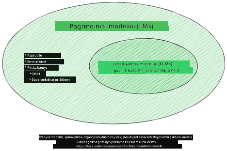

Vaizdo šaltinis: [Essential Guide to Foundation Models and Large Language Models | by Babar M Bhatti | Medium
](https://thebabar.medium.com/essential-guide-to-foundation-models-and-large-language-models-27dab58f7404)

Kad dar labiau paaiškintume šį skirtumą, paimkime ChatGPT kaip istorinį pavyzdį. Ankstyvos ChatGPT versijos naudojo GPT-3.5 kaip pamatinį modelį. OpenAI tada naudojo pokalbių specifinius duomenis ir suderinimo metodus, kad sukurtų optimizuotą versiją, kuri geriau veiktų pokalbių scenarijuose, pavyzdžiui, pokalbių robotuose. Šiuolaikinės AI paslaugos dažnai naudoja kelis modelių variantus, todėl paslaugos pavadinimas ir pagrindinio modelio pavadinimas ne visada yra tas pats.

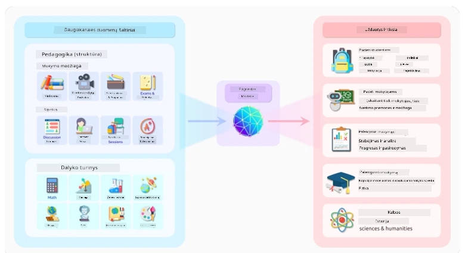

Vaizdo šaltinis: [2108.07258.pdf (arxiv.org)](https://arxiv.org/pdf/2108.07258.pdf?WT.mc_id=academic-105485-koreyst)

### Atviro svorio/atviro kodo prieš nuosavybinius modelius

Kita LLM kategorizavimo schema yra atviro svorio, atviro kodo ar nuosavybiniai modeliai.

Atviro kodo ir atviro svorio modeliai leidžia peržiūrėti, parsisiųsti ar suasmeninti modelio artefaktus, tačiau jų licencijos skiriasi. Kai kurie yra visiškai atviro kodo, o kiti – atviro svorio modeliai su naudojimo apribojimais. Jie gali būti naudingi, kai verslui reikia daugiau kontrolės diegimo, duomenų lokalumo, kaštų ar pritaikymo srityje. Tačiau komandos vis tiek turi peržiūrėti licencijos sąlygas, aptarnavimo išlaidas, priežiūrą, saugumo atnaujinimus ir vertinimo kokybę prieš naudodamos juos gamyboje. Pavyzdžiai yra [Meta Llama 4](https://ai.meta.com/blog/llama-4-multimodal-intelligence/?WT.mc_id=academic-105485-koreyst), kai kurie [Mistral modeliai](https://docs.mistral.ai/models/overview?WT.mc_id=academic-105485-koreyst) ir daugelis modelių esančių [Hugging Face](https://huggingface.co/models?WT.mc_id=academic-105485-koreyst).

Nuosavybiniai modeliai priklauso ir yra talpinami paslaugos teikėjo. Šie modeliai dažnai yra optimizuoti valdomam gamybiniam naudojimui ir gali pasiūlyti tvirtą palaikymą, saugumo sistemas, įrankių integraciją ir mastelį. Tačiau klientai paprastai negali tikrinti ar keisti modelio svorių, ir jie privalo peržiūrėti teikėjo sąlygas dėl privatumo, saugojimo, atitikties ir tinkamo naudojimo. Pavyzdžiai yra [OpenAI modeliai](https://platform.openai.com/docs/models?WT.mc_id=academic-105485-koreyst), [Google Gemini](https://deepmind.google/models/gemini/pro/?WT.mc_id=academic-105485-koreyst) ir [Anthropic Claude](https://platform.claude.com/docs/en/about-claude/models/overview?WT.mc_id=academic-105485-koreyst).

### Įterpimas prieš vaizdų generavimą prieš teksto ir kodo generavimą

LLM taip pat galima skirstyti pagal generuojamą išvestį.

Įterpimai yra modelių rinkinys, kurie gali transformuoti tekstą į skaitmeninę formą, vadinamą įterpimu, kuris yra tekstinės įvesties skaitmeninė reprezentacija. Įterpimai palengvina mašinoms suprasti žodžių ar sakinių tarpusavio ryšius ir gali būti naudojami kaip įvestys kitų modelių, tokių kaip klasifikavimo ar klasterizacijos modeliai, kurių našumas geresnis su skaitmeniniais duomenimis. Įterpimo modeliai dažnai naudojami perdavimo mokyme, kai modelis sukuriamas pakaitinei užduočiai, kuriai yra gausu duomenų, o tada modelio svoriai (įterpimai) pernaudojami kitoms vėlesnėms užduotims. Šios kategorijos pavyzdys yra [OpenAI įterpimai](https://platform.openai.com/docs/models/embeddings?WT.mc_id=academic-105485-koreyst).

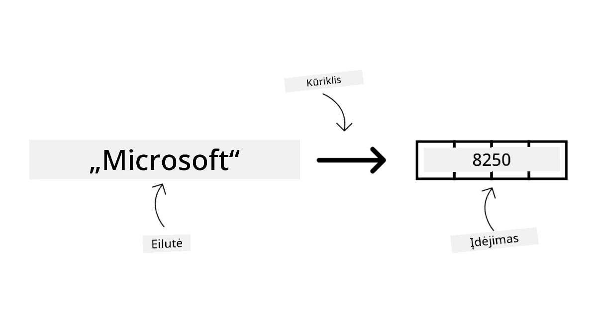

Vaizdų generavimo modeliai yra modeliai, kurie generuoja vaizdus. Šie modeliai dažnai naudojami vaizdų redagavimui, sintezei ir vertimui. Vaizdų generavimo modeliai dažnai yra mokomi didelėse vaizdų duomenų bazėse, tokiose kaip [LAION-5B](https://laion.ai/blog/laion-5b/?WT.mc_id=academic-105485-koreyst), ir gali būti naudojami naujų vaizdų generavimui arba esamų vaizdų redagavimui naudojant inpaintingo, aukštos skiriamosios gebos ir spalvinimo metodus. Pavyzdžiai: [GPT vaizdų modeliai](https://platform.openai.com/docs/guides/images?WT.mc_id=academic-105485-koreyst), [Stable Diffusion modeliai](https://github.com/Stability-AI/StableDiffusion?WT.mc_id=academic-105485-koreyst) ir Imagen modeliai.

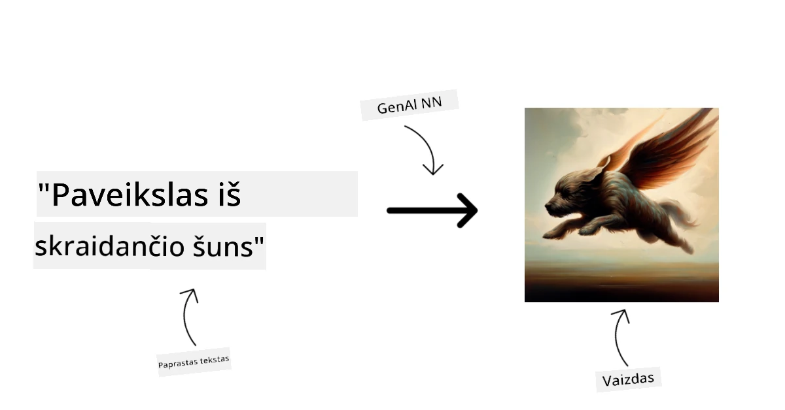

Teksto ir kodo generavimo modeliai yra modeliai, kurie generuoja tekstą arba kodą. Šie modeliai dažnai naudojami teksto santraukų kūrimui, vertimui ir klausimų atsakymui. Teksto generavimo modeliai dažnai mokomi didelėse tekstinėse duomenų bazėse, tokiose kaip [BookCorpus](https://www.cv-foundation.org/openaccess/content_iccv_2015/html/Zhu_Aligning_Books_and_ICCV_2015_paper.html?WT.mc_id=academic-105485-koreyst), ir gali būti naudojami naujo teksto generavimui arba klausimų atsakymui. Kodo generavimo modeliai, tokie kaip [CodeParrot](https://huggingface.co/codeparrot?WT.mc_id=academic-105485-koreyst), dažnai mokomi didelėse kodo duomenų bazėse, tokiose kaip GitHub, ir gali būti naudojami naujo kodo generavimui arba klaidų taisymui esamame kode.

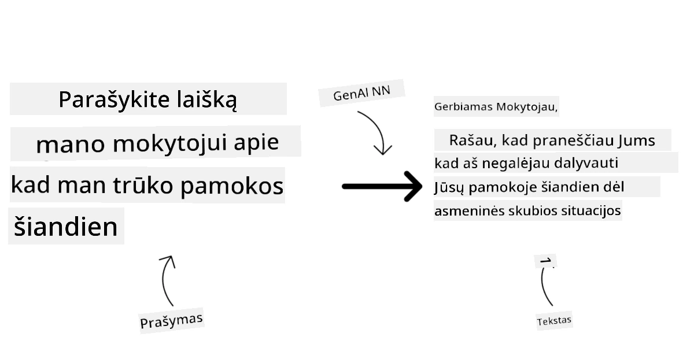

### Encoder-Decoder prieš tik Decoder

Kalbėdami apie skirtingų tipų LLM architektūras, naudokime analogiją.

Įsivaizduokite, kad jūsų vadovas jums davė užduotį parašyti viktoriną studentams. Turite du kolegas; vienas prižiūri turinio kūrimą, kitas – peržiūrą.

Turinio kūrėjas yra kaip tik Decoder modelis: jis gali pažvelgti į temą, matyti, ką jau parašėte, ir tada tęsti turinio generavimą pagal tą kontekstą. Jie labai gerai rašo įtraukiantį ir informatyvų turinį, tačiau ne visada yra geriausias pasirinkimas užduotims, kurios tik klasifikuoja, paima ar koduoja informaciją. Decoder modelių šeimos pavyzdžiai yra GPT ir Llama modeliai.

Peržiūrėjas yra kaip tik Encoder modelis: jis žiūri į parašytą kursą ir atsakymus, pastebėdamas ryšį tarp jų ir suprasdamas kontekstą, bet nėra geras turinio generavimui. Encoder modelių pavyzdys būtų BERT.

Įsivaizduokite, kad turime asmenį, kuris galėtų kurti ir tikrinti viktoriną – tai yra Encoder-Decoder modelis. Kai kurie pavyzdžiai yra BART ir T5.

### Paslauga prieš modelį

Dabar pakalbėkime apie skirtumą tarp paslaugos ir modelio. Paslauga yra produktas, kurį teikia debesų paslaugų teikėjas, dažnai tai yra modelių, duomenų ir kitų komponentų derinys. Modelis yra pagrindinis paslaugos komponentas, dažnai tai yra pamatinis modelis, pavyzdžiui, LLM.

Paslaugos dažnai yra optimizuotos gamybiniam naudojimui ir dažnai lengviau naudojamos nei modeliai, per grafinę vartotojo sąsają. Tačiau paslaugos ne visada yra nemokamos ir gali reikėti prenumeratos arba mokėjimo už naudojimąsi, mainais už paslaugos savininko įrangos ir išteklių naudojimą, optimizuojant išlaidas ir lengvą mastelio keitimą. Paslaugos pavyzdys yra [Azure OpenAI Service](https://learn.microsoft.com/azure/ai-foundry/openai/overview?WT.mc_id=academic-105485-koreyst), kuri siūlo mokėjimą pagal naudojimą, t.y., vartotojai moka proporcingai naudotos paslaugos apimčiai. Azure OpenAI Service taip pat siūlo įmonių lygio saugumą ir atsakingo AI lauko rėmus virš modelių galimybių.

Modeliai yra neuroninių tinklų artefaktai: parametrai, svoriai, architektūra, žodžių tvarkytojas ir palaikanti konfigūracija. Modelio paleidimas vietoje arba privačioje aplinkoje reikalauja tinkamos techninės įrangos, aptarnavimo infrastruktūros, stebėjimo ir arba suderinamos atviro kodo/atviro svorio licencijos, arba komercinės licencijos. Atviro svorio modelius, tokius kaip Llama 4 ar Mistral modelius, galima talpinti patiems, tačiau vis tiek reikia skaičiavimo galios ir operacinės patirties.

## Kaip testuoti ir iteruoti su skirtingais modeliais siekiant suprasti našumą Azure

Kai mūsų komanda ištyrė esamą LLM (didelių kalbinių modelių) kraštovaizdį ir identifikavo gerus kandidatus jų scenarijams, kitas žingsnis yra juos išbandyti su savo duomenimis ir darbuotojų apkrova. Tai iteracinis procesas, atliekamas eksperimentų ir matavimų būdu.
Dauguma ankstesniuose skyriuose minėtų modelių (OpenAI modeliai, atviro svorio modeliai, tokie kaip Llama 4 ir Mistral, bei Hugging Face modeliai) yra prieinami [Microsoft Foundry Models](https://learn.microsoft.com/azure/foundry/concepts/foundry-models-overview?WT.mc_id=academic-105485-koreyst).

[Microsoft Foundry](https://learn.microsoft.com/azure/foundry/what-is-foundry?WT.mc_id=academic-105485-koreyst), anksčiau žinomas kaip Azure AI Studio/Azure AI Foundry, yra integruota Azure platforma AI programoms ir agentams kurti. Ji padeda kūrėjams valdyti gyvavimo ciklą nuo eksperimentavimo ir vertinimo iki diegimo, stebėjimo ir valdymo. Modelių katalogas Microsoft Foundry leidžia vartotojui:

- Rasti dominantį pagrindinį modelį kataloge, įskaitant modelius, kuriuos parduoda Azure, bei partnerių ir bendruomenės tiekėjų modelius. Vartotojai gali filtruoti pagal užduotį, tiekėją, licenciją, diegimo parinktį ar pavadinimą.

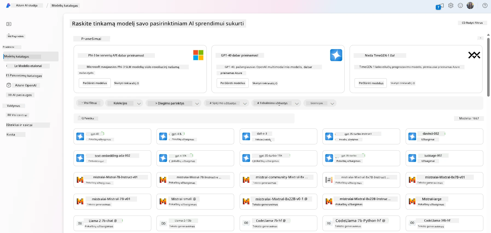

- Peržvelgti modelio kortelę, įskaitant išsamų aprašymą apie numatomą naudojimą ir mokymo duomenis, kodo pavyzdžius ir vertinimo rezultatus vidinėje vertinimo bibliotekoje.

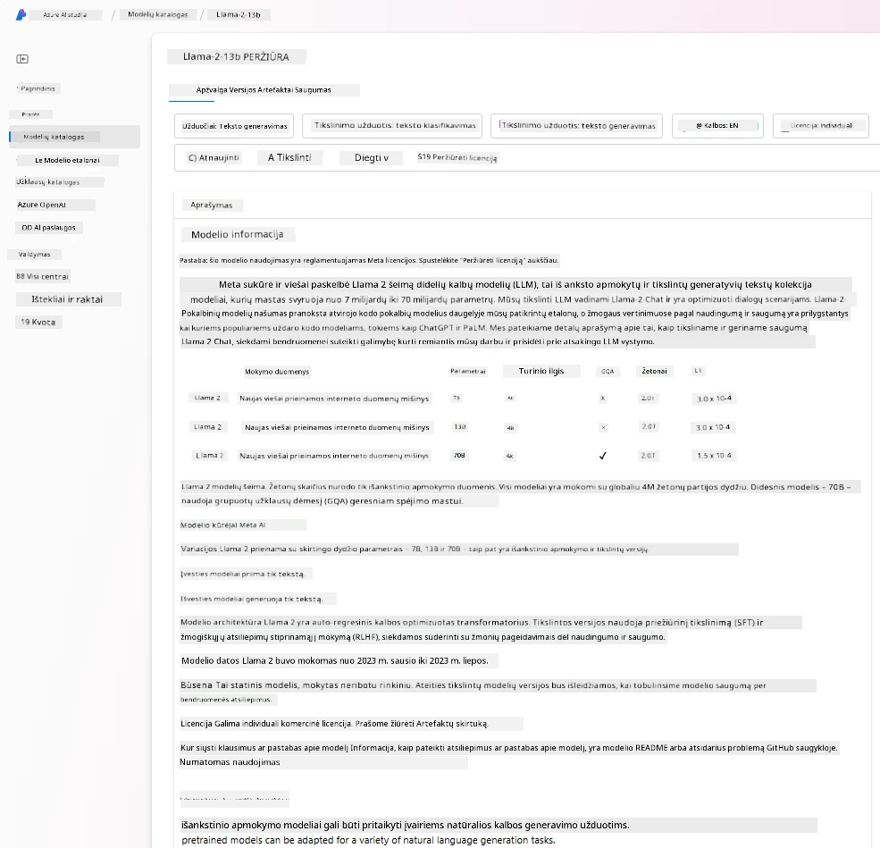

- Palyginti standartinius rodiklius tarp modelių ir pramonėje prieinamų duomenų rinkinių, kad įvertintumėte, kuris atitinka verslo scenarijų per [Model Benchmarks](https://learn.microsoft.com/azure/ai-foundry/concepts/model-benchmarks?WT.mc_id=academic-105485-koreyst) skiltį.

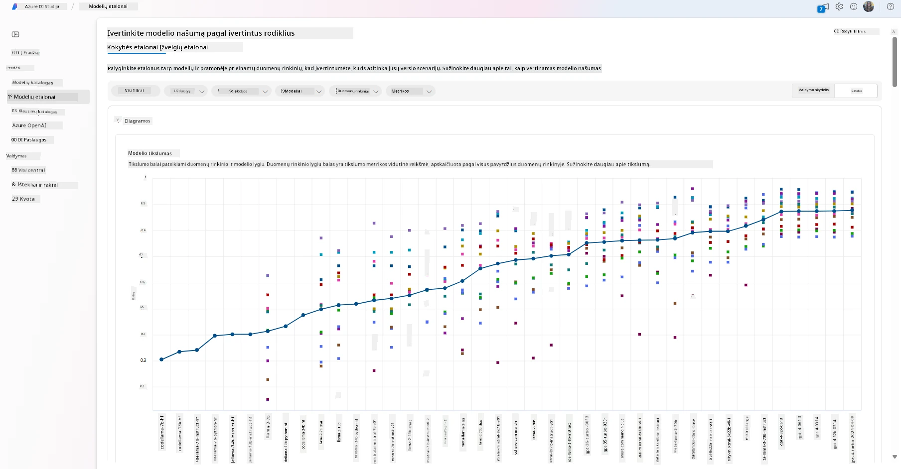

- Tobulinti palaikomus modelius su individualiais mokymo duomenimis, siekiant pagerinti modelio našumą specifinėje darbo apkrovoje, pasinaudojant Microsoft Foundry eksperimentavimo ir sekimo galimybėmis.

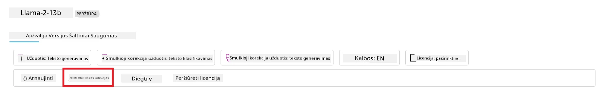

- Diegti originalų išankstinį mokytą modelį arba patobulintą versiją į nuotolinį realaus laiko spėjimo tašką, naudojant valdomas skaičiavimo ar serverless diegimo parinktis, kad programos galėtų jį naudoti.

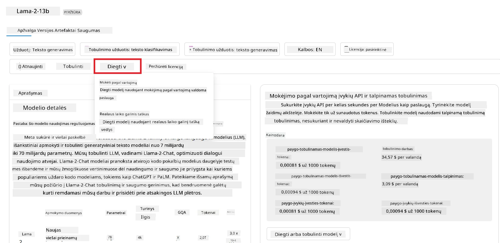

> [!NOTE]
> Ne visi katalogo modeliai šiuo metu yra prieinami fine-tuning (detaliai derinant) ir/arba pay-as-you-go (mokėti už naudojimą) diegimui. Patikrinkite modelio kortelę dėl išsamesnės informacijos apie modelio galimybes ir apribojimus.

## LLM rezultatų tobulinimas

Mūsų startuolio komanda išbandė įvairius LLM tipus ir debesų platformą (Microsoft Foundry), kuri leidžia palyginti skirtingus modelius, įvertinti juos pagal testinius duomenis, pagerinti našumą ir diegti spėjimo taškuose.

Tačiau kada reikėtų apsvarstyti modelio fine-tuning (detalų pritaikymą), o ne naudoti iš anksto apmokytą modelį? Ar yra kitų būdų pagerinti modelio našumą tam tikrose darbo aplinkose?

Yra keli būdai, kaip verslas gali pasiekti reikalingus LLM rezultatus. Diegiant LLM produkcijoje, galite rinktis skirtingų tipų modelius su skirtingu apmokymo laipsniu, turinčius skirtingą sudėtingumo, kainos ir kokybės lygį. Štai keletas skirtingų požiūrių:

- **Konteksto pagrindu sukurti užklausą (Prompt engineering with context)**. Idėja yra suteikti pakankamai konteksto užklausoje, kad gautumėte reikiamus atsakymus.

- **Retrieval Augmented Generation, RAG**. Jūsų duomenys gali būti duomenų bazėje arba žiniatinklio taške, pavyzdžiui, o norint užtikrinti, kad šie duomenys arba jų dalis būtų įtraukti užklausos metu, galite paimti aktualius duomenis ir įtraukti juos į vartotojo užklausą.

- **Fine-tuned modelis (detaliai pritaikytas modelis)**. Čia jūs tęstinate modelio mokymą savo duomenimis, dėl ko modelis tampa tikslesnis ir jautresnis jūsų poreikiams, tačiau tai gali būti brangu.

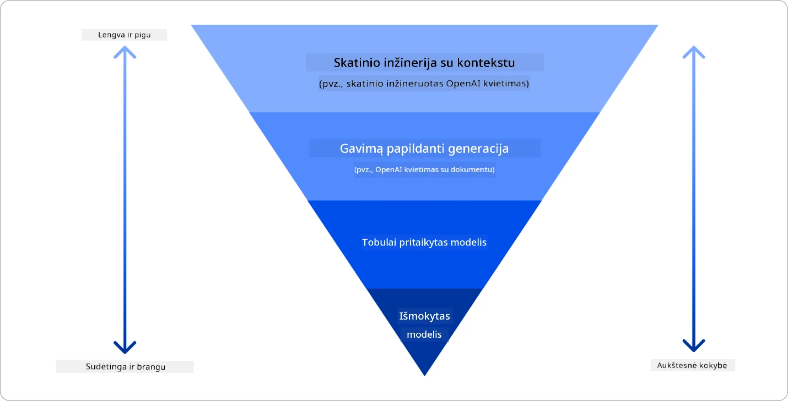

Paveikslėlio šaltinis: [Four Ways that Enterprises Deploy LLMs | Fiddler AI Blog](https://www.fiddler.ai/blog/four-ways-that-enterprises-deploy-llms?WT.mc_id=academic-105485-koreyst)

### Konteksto pagrindu kuriama užklausa

Iš anksto apmokyti LLM labai gerai atlieka bendrines natūralios kalbos užduotis, net jei jiems pateikiama trumpa užklausa, pavyzdžiui, sakinys užbaigti ar klausimas – vadinamasis „zero-shot“ mokymasis.

Tačiau kuo vartotojas gali labiau suformuluoti savo užklausą, pateikdamas išsamią užklausą ir pavyzdžius – Kontekstą – tuo tikslesnis ir arčiau vartotojo lūkesčių bus atsakymas. Tokiu atveju kalbame apie „one-shot“ mokymą, jei užklausoje yra tik vienas pavyzdys, ir „few-shot“ mokymą, jei yra keli pavyzdžiai.
Konteksto pagrindu kuriama užklausa yra ekonomiškiausias būdas pradėti.

### Retrieval Augmented Generation (RAG)

LLM turi ribotumą, nes jie gali naudoti tik mokymų metu panaudotus duomenis atsakymui sugeneruoti. Tai reiškia, kad jie nieko nežino apie faktus, įvykusius po mokymo proceso, ir neturi prieigos prie ne viešos informacijos (pvz., įmonės duomenų).
Tai galima išspręsti naudojant RAG, techniką, kuri papildo užklausą išoriniais duomenimis dokumentų gabalų pavidalu, atsižvelgiant į užklausos ilgio ribas. Tai remiama vektorinės duomenų bazės įrankiais (pvz., [Azure Vector Search](https://learn.microsoft.com/azure/search/vector-search-overview?WT.mc_id=academic-105485-koreyst)), kurie gauna naudingus gabalus iš įvairių iš anksto apibrėžtų duomenų šaltinių ir prideda juos prie užklausos konteksto.

Ši technika ypač naudinga, kai verslas neturi pakankamai duomenų, laiko ar išteklių detaliai fine-tuning LLM, bet vis tiek nori pagerinti našumą specifinėje darbo apkrovoje ir sumažinti išgalvotų, pasenusių ar nepalaikomų atsakymų riziką.

### Fine-tuned modelis

Fine-tuning yra procesas, kuris pasinaudoja perdavimo mokymusi, kad „pritaikytų“ modelį žemesnio lygio užduočiai ar konkrečios problemos sprendimui. Skirtingai nuo few-shot mokymosi ir RAG, tai sukuria naują modelį su atnaujintais svoriais ir posvoriais. Reikia rinkinio mokymo pavyzdžių, sudarytų iš vieno įėjimo (užklausos) ir atitinkamo jo išėjimo (užbaigimo).
Tai būtų pageidaujamas požiūris, jei:

- **Naudojami mažesni specifiniai užduočiai skirti modeliai**. Verslas norėtų detalizuoti mažesnį modelį siaurai užduočiai, o ne pakartotinai kviesti didesnį pagrindinį modelį, tai būtų ekonomiškesnis ir greitesnis sprendimas.

- **Svarstoma delsimo reikšmė**. Delsimas svarbus konkrečiu atveju, todėl negalima naudoti labai ilgų užklausų ar pavyzdžių kiekis, iš kurio modelis turėtų mokytis, nesutampa su užklausos ilgio limita.

- **Pritaikant stabilų elgesį**. Verslas turi daug aukštos kokybės pavyzdžių ir nori, kad modelis nuosekliai laikytųsi užduoties šablono, išėjimo formato, tono ar konkretaus domeno stiliaus. Jei pagrindinė problema yra šviežios žinios ar privataus pobūdžio informacija, kuri dažnai keičiasi, naudokite RAG vietoj vien fine-tuningo.

### Išmokytas modelis

Mokyti LLM nuo nulio neabejotinai yra pats sudėtingiausias ir sudėtingiausias būdas, reikalaujantis milžiniškų duomenų kiekių, kvalifikuotų resursų ir tinkamos kompiuterinės galios. Ši galimybė turėtų būti svarstoma tik tais atvejais, kai verslas turi specifinį domeno naudojimą ir didelį domeno centrinių duomenų kiekį.

## Žinių patikrinimas

Koks galėtų būti geras būdas pagerinti LLM užbaigimo rezultatus?

1. Konteksto pagrindu kuriama užklausa
1. RAG
1. Detaliai pritaikytas modelis

A: Visi trys gali padėti. Pradėkite nuo konteksto pagrindu kuriamos užklausos greitiems patobulinimams ir naudokite RAG, kai modeliui reikalingi dabartiniai faktai ar privatūs verslo duomenys. Pasirinkite fine-tuning, kai turite pakankamai aukštos kokybės pavyzdžių ir reikia, kad modelis nuosekliai laikytųsi užduoties, formato, tono ar domeno šablono.

## 🚀 Iššūkis

Perskaitykite daugiau, kaip galite [naudoti RAG](https://learn.microsoft.com/azure/search/retrieval-augmented-generation-overview?WT.mc_id=academic-105485-koreyst) savo verslui.

## Puikiai padirbėta, tęskite mokymąsi

Baigę šią pamoką, peržiūrėkite mūsų [Generative AI mokymosi kolekciją](https://aka.ms/genai-collection?WT.mc_id=academic-105485-koreyst), kad toliau tobulintumėte savo žinias apie generatyviąją dirbtinį intelektą!

Pereikite prie Pamokos 3, kur žiūrėsime, kaip [atsakingai kurti su Generative AI](../03-using-generative-ai-responsibly/README.md?WT.mc_id=academic-105485-koreyst)!

---

<!-- CO-OP TRANSLATOR DISCLAIMER START -->
**Atsakomybės apribojimas**:
Šis dokumentas buvo išverstas naudojant dirbtinio intelekto vertimo paslaugą [Co-op Translator](https://github.com/Azure/co-op-translator). Nors siekiame tikslumo, prašome atkreipti dėmesį, kad automatiniai vertimai gali turėti klaidų ar netikslumų. Originalus dokumentas jo gimtąja kalba laikomas autoritetingu šaltiniu. Svarbiai informacijai rekomenduojama naudoti profesionalų žmogiškąjį vertimą. Mes neatsakome už jokius nesusipratimus ar neteisingą interpretaciją, kilusią naudojantis šiuo vertimu.
<!-- CO-OP TRANSLATOR DISCLAIMER END -->