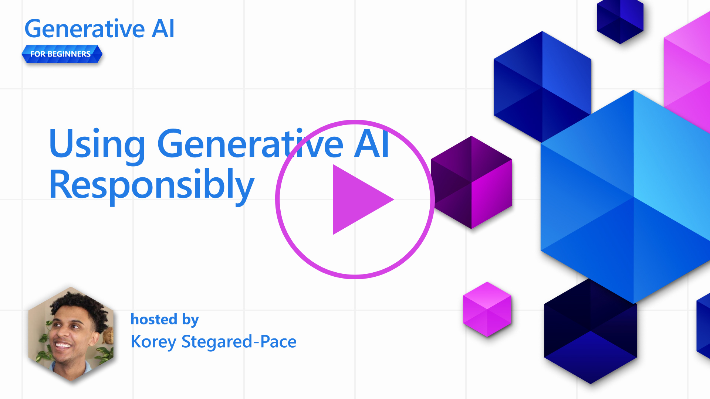
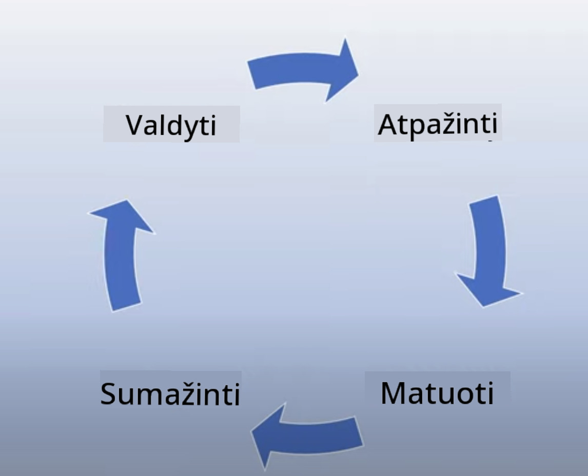
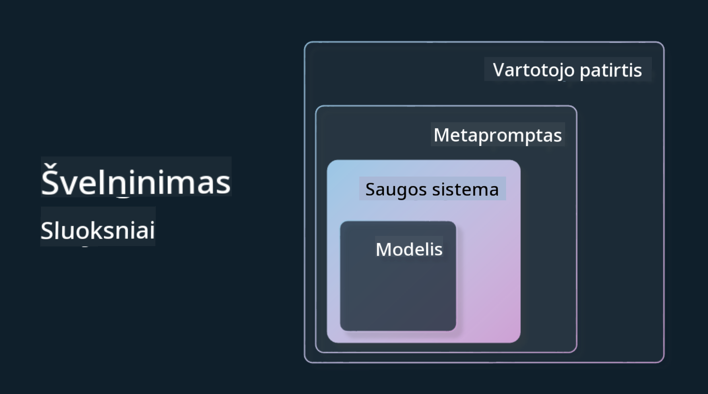

<!--
CO_OP_TRANSLATOR_METADATA:
{
  "original_hash": "7f8f4c11f8c1cb6e1794442dead414ea",
  "translation_date": "2025-08-25T12:24:27+00:00",
  "source_file": "03-using-generative-ai-responsibly/README.md",
  "language_code": "lt"
}
-->
# Atsakingas generatyvinio DI naudojimas

> _Spustelėkite paveikslėlį aukščiau, kad peržiūrėtumėte šios pamokos vaizdo įrašą_

Dirbtinis intelektas, ypač generatyvinis DI, gali labai sužavėti, tačiau svarbu pagalvoti, kaip jį naudoti atsakingai. Reikia įvertinti, kaip užtikrinti, kad rezultatai būtų teisingi, nekenksmingi ir t.t. Šiame skyriuje aptarsime, ką svarbu žinoti, į ką atkreipti dėmesį ir kokių veiksmų imtis, kad DI naudojimas būtų atsakingas.

## Įvadas

Šioje pamokoje aptarsime:

- Kodėl kuriant generatyvinio DI sprendimus svarbu teikti pirmenybę atsakingam DI.
- Pagrindinius atsakingo DI principus ir jų ryšį su generatyviniu DI.
- Kaip šiuos principus taikyti praktiškai pasitelkiant strategijas ir įrankius.

## Mokymosi tikslai

Baigę šią pamoką sužinosite:

- Kodėl atsakingas DI yra svarbus kuriant generatyvinio DI sprendimus.
- Kada verta galvoti apie atsakingo DI principus ir juos taikyti generatyvinio DI kūrimo procese.
- Kokius įrankius ir strategijas galite pasitelkti, kad atsakingo DI idėja taptų realybe.

## Atsakingo DI principai

Generatyvinio DI entuziazmas šiuo metu yra didžiausias per visą laiką. Tai pritraukė daug naujų kūrėjų, dėmesio ir investicijų. Nors tai puiku visiems, kurie nori kurti produktus ar verslus su generatyviniu DI, svarbu elgtis atsakingai.

Viso kurso metu kuriame savo startuolį ir DI mokymosi produktą. Vadovausimės atsakingo DI principais: teisingumu, įtrauktimi, patikimumu/saugumu, saugumu ir privatumu, skaidrumu ir atsakomybe. Remdamiesi šiais principais, nagrinėsime, kaip jie susiję su generatyvinio DI naudojimu mūsų produktuose.

## Kodėl verta teikti pirmenybę atsakingam DI

Kuriant produktą, orientacija į žmogų ir vartotojo interesų paisymas padeda pasiekti geriausių rezultatų.

Generatyvinio DI išskirtinumas – gebėjimas kurti naudingus atsakymus, informaciją, patarimus ir turinį vartotojams. Tai galima padaryti be daugybės rankinių žingsnių, o rezultatai gali būti įspūdingi. Tačiau be tinkamo planavimo ir strategijų, tai gali sukelti neigiamų pasekmių vartotojams, produktui ir visuomenei.

Pažvelkime į keletą (bet ne visus) galimų neigiamų pasekmių:

### Halucinacijos

Halucinacijos – tai terminas, apibūdinantis situaciją, kai LLM sukuria turinį, kuris yra visiškai nesąmoningas arba akivaizdžiai neteisingas, remiantis kitais informacijos šaltiniais.

Pavyzdžiui, kuriame funkciją savo startuoliui, leidžiančią studentams užduoti istorinius klausimus modeliui. Studentas klausia: `Kas buvo vienintelis Titaniko išgyvenęs žmogus?`

Modelis pateikia tokį atsakymą:

> _(Šaltinis: [Flying bisons](https://flyingbisons.com?WT.mc_id=academic-105485-koreyst))_

Atsakymas atrodo užtikrintas ir išsamus. Deja, jis neteisingas. Net minimaliai pasidomėjus, paaiškėja, kad Titaniko katastrofą išgyveno daugiau nei vienas žmogus. Pradedančiam studentui toks atsakymas gali pasirodyti įtikinamas ir būti priimtas kaip faktas. Tai gali lemti, kad DI sistema bus nepatikima ir pakenks mūsų startuolio reputacijai.

Kiekvienoje LLM versijoje matome, kad halucinacijų mažinimas gerėja. Tačiau net ir tobulėjant, kūrėjai ir vartotojai turi išlikti budrūs dėl šių ribotumų.

### Kenksmingas turinys

Anksčiau aptarėme, kai LLM pateikia neteisingus ar nesąmoningus atsakymus. Kita rizika – kai modelis pateikia kenksmingą turinį.

Kenksmingas turinys gali būti:

- Instrukcijos ar skatinimas žaloti save ar tam tikras grupes.
- Neapykantos ar žeminantis turinys.
- Patarimai, kaip planuoti atakas ar smurtinius veiksmus.
- Instrukcijos, kaip rasti neteisėtą turinį ar vykdyti neteisėtus veiksmus.
- Seksualiai atviras turinys.

Norime užtikrinti, kad mūsų startuolyje būtų tinkami įrankiai ir strategijos, apsaugantys studentus nuo tokio turinio.

### Teisingumo stoka

Teisingumas – tai „užtikrinimas, kad DI sistema būtų laisva nuo šališkumo ir diskriminacijos, ir kad visi būtų vertinami teisingai ir vienodai.“ Generatyvinio DI srityje svarbu, kad modelio rezultatai neįtvirtintų išskirtinių ar diskriminuojančių požiūrių į marginalizuotas grupes.

Tokie rezultatai ne tik kenkia teigiamai vartotojų patirčiai, bet ir daro žalos visuomenei. Kuriant generatyvinio DI sprendimus, visada verta galvoti apie platų ir įvairų vartotojų ratą.

## Kaip atsakingai naudoti generatyvinį DI

Dabar, kai supratome atsakingo generatyvinio DI svarbą, pažvelkime į 4 žingsnius, kaip kurti atsakingus DI sprendimus:

### Įvertinkite galimą žalą

Testuojant programinę įrangą, tikriname, kaip vartotojas elgsis su programa. Panašiai, testuojant įvairius vartotojų klausimus, galima įvertinti galimą žalą.

Kadangi mūsų startuolis kuria mokymosi produktą, verta paruošti sąrašą su mokymuisi aktualiais klausimais. Tai gali būti klausimai apie tam tikrą dalyką, istorinius faktus ar studentų gyvenimą.

### Mažinkite galimą žalą

Dabar metas ieškoti būdų, kaip sumažinti ar išvengti modelio ir jo atsakymų galimos žalos. Galime tai daryti 4 lygiais:

- **Modelis**. Pasirinkite tinkamą modelį pagal poreikį. Didesni ir sudėtingesni modeliai, tokie kaip GPT-4, gali kelti didesnę kenksmingo turinio riziką, jei naudojami siauresnėse srityse. Modelio pritaikymas su savo duomenimis taip pat sumažina kenksmingo turinio riziką.

- **Saugos sistema**. Saugos sistema – tai įrankių ir konfigūracijų rinkinys platformoje, kurioje veikia modelis, padedantis mažinti žalą. Pavyzdžiui, Azure OpenAI paslaugos turinio filtravimo sistema. Sistemos taip pat turėtų aptikti „jailbreak“ atakas ir nepageidaujamą veiklą, pvz., užklausas iš botų.

- **Metapromptas**. Metapromptai ir „grounding“ – tai būdai, kaip galime nukreipti ar apriboti modelį pagal tam tikrą elgesį ar informaciją. Tai gali būti sistemos įvestys, apibrėžiančios modelio ribas. Taip pat galima pateikti rezultatus, labiau atitinkančius sistemos sritį ar temą.

Galima naudoti ir tokius metodus kaip Retrieval Augmented Generation (RAG), kad modelis informaciją imtų tik iš patikimų šaltinių. Vėliau kurse yra pamoka apie [paieškos programų kūrimą](../08-building-search-applications/README.md?WT.mc_id=academic-105485-koreyst)

- **Vartotojo patirtis**. Paskutinis lygis – kai vartotojas tiesiogiai bendrauja su modeliu per mūsų programos sąsają. Galime sukurti UI/UX taip, kad apribotume vartotojo galimybes siųsti tam tikro tipo užklausas modeliui, taip pat kontroliuoti, kokį tekstą ar vaizdus vartotojas mato. Diegiant DI programą, svarbu aiškiai informuoti, ką generatyvinio DI sprendimas gali ir ko negali.

Turime atskirą pamoką apie [UX kūrimą DI programoms](../12-designing-ux-for-ai-applications/README.md?WT.mc_id=academic-105485-koreyst)

- **Modelio vertinimas**. Dirbant su LLM, iššūkis tas, kad ne visada kontroliuojame, su kokiais duomenimis modelis buvo apmokytas. Vis tiek svarbu nuolat vertinti modelio veikimą ir rezultatus. Reikia matuoti modelio tikslumą, panašumą, pagrįstumą ir rezultatų aktualumą. Tai padeda užtikrinti skaidrumą ir pasitikėjimą tarp suinteresuotų šalių ir vartotojų.

### Valdykite atsakingą generatyvinio DI sprendimą

Paskutinis etapas – sukurti veiklos praktiką savo DI programoms. Tai apima bendradarbiavimą su kitomis startuolio dalimis, pvz., teisine ir saugumo komandomis, kad būtų laikomasi visų reikalavimų. Prieš paleidžiant, verta parengti planus, kaip pristatyti sprendimą, kaip elgtis incidentų atveju ir kaip atšaukti pakeitimus, kad apsaugotume vartotojus nuo galimos žalos.

## Įrankiai

Nors atsakingo DI sprendimų kūrimas gali atrodyti sudėtingas, tai tikrai verta pastangų. Generatyvinio DI sritis sparčiai auga, todėl daugės ir įrankių, padedančių kūrėjams lengviau integruoti atsakomybę į savo darbo procesus. Pavyzdžiui, [Azure AI Content Safety](https://learn.microsoft.com/azure/ai-services/content-safety/overview?WT.mc_id=academic-105485-koreyst) gali padėti aptikti kenksmingą turinį ir vaizdus per API užklausas.

## Žinių patikrinimas

Į ką reikia atkreipti dėmesį, kad DI būtų naudojamas atsakingai?

1. Kad atsakymas būtų teisingas.
1. Kenksmingas naudojimas, kad DI nebūtų naudojamas nusikalstamiems tikslams.
1. Užtikrinti, kad DI būtų laisvas nuo šališkumo ir diskriminacijos.

A: Teisingi 2 ir 3. Atsakingas DI padeda apsvarstyti, kaip sumažinti kenksmingą poveikį, šališkumą ir kt.

## 🚀 Iššūkis

Perskaitykite apie [Azure AI Content Safety](https://learn.microsoft.com/azure/ai-services/content-safety/overview?WT.mc_id=academic-105485-koreyst) ir pagalvokite, ką galite pritaikyti savo sprendime.

## Puikus darbas, tęskite mokymąsi

Baigę šią pamoką, peržiūrėkite mūsų [Generatyvinio DI mokymosi kolekciją](https://aka.ms/genai-collection?WT.mc_id=academic-105485-koreyst), kad dar labiau pagilintumėte žinias!

Eikite į 4 pamoką, kurioje nagrinėsime [Prompt Engineering pagrindus](../04-prompt-engineering-fundamentals/README.md?WT.mc_id=academic-105485-koreyst)!

---

**Atsakomybės atsisakymas**:  
Šis dokumentas buvo išverstas naudojant dirbtinio intelekto vertimo paslaugą [Co-op Translator](https://github.com/Azure/co-op-translator). Nors siekiame tikslumo, prašome atkreipti dėmesį, kad automatiniai vertimai gali turėti klaidų ar netikslumų. Originalus dokumentas jo gimtąja kalba turėtų būti laikomas autoritetingu šaltiniu. Svarbiai informacijai rekomenduojame profesionalų žmogaus vertimą. Mes neatsakome už nesusipratimus ar neteisingą interpretavimą, kilusį dėl šio vertimo naudojimo.