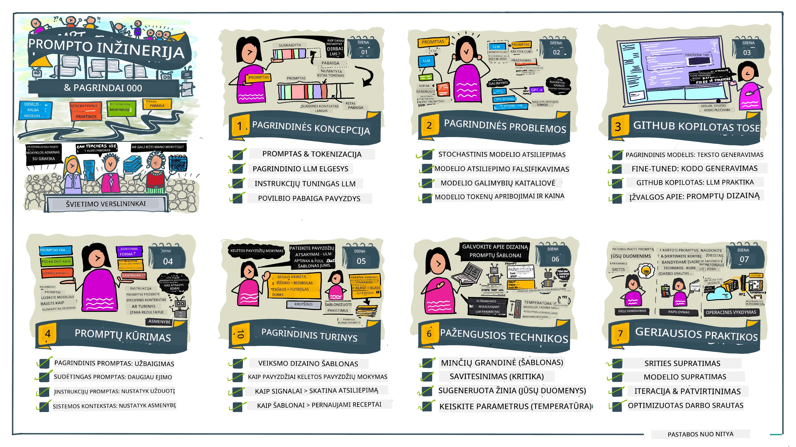
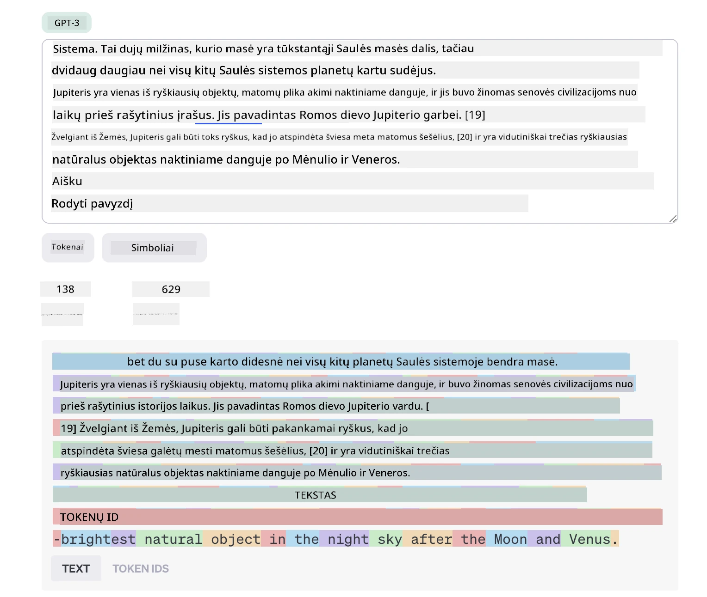
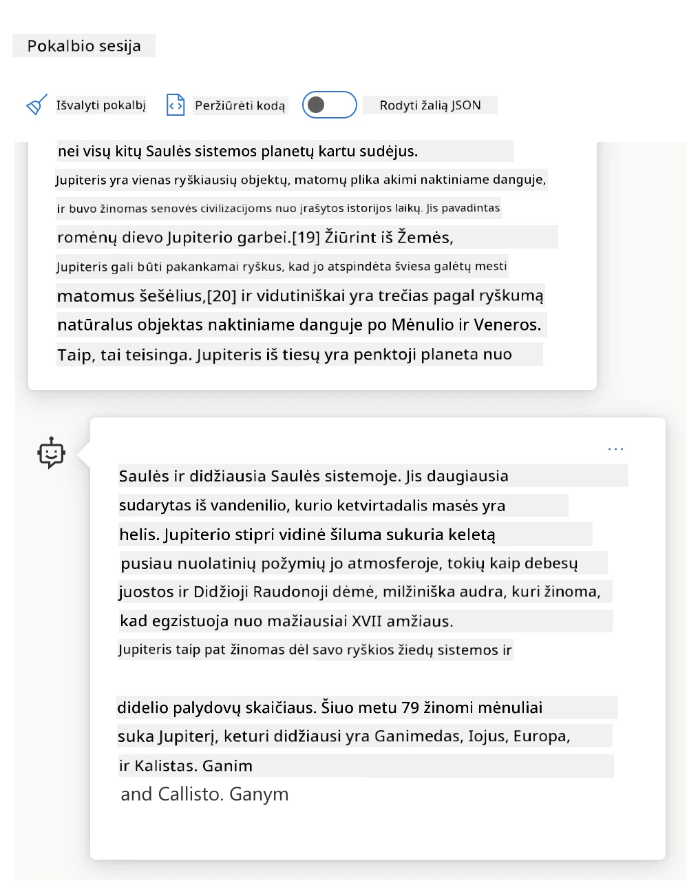
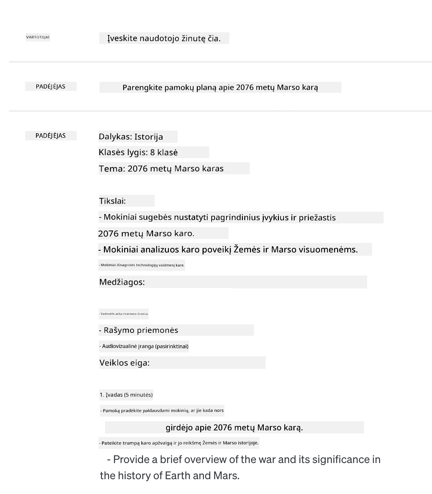
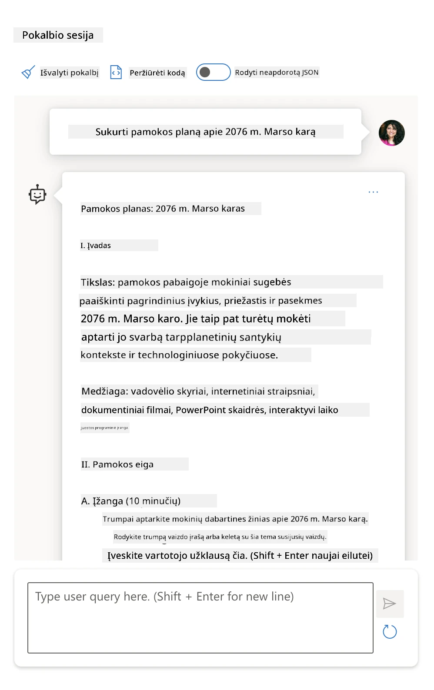
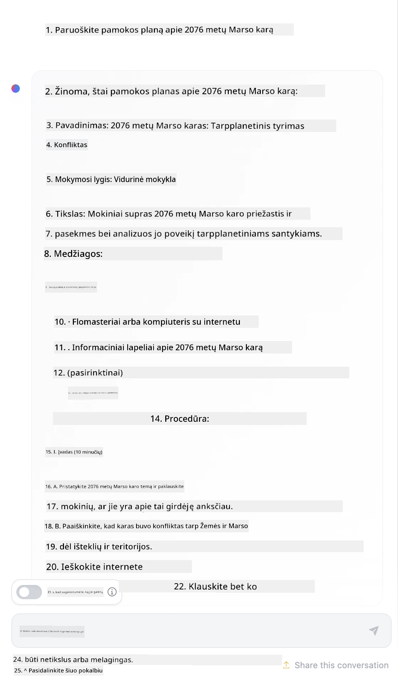

# Pagrindai apie užklausų (promptų) konstravimą

[](https://youtu.be/GElCu2kUlRs?si=qrXsBvXnCW12epb8)

## Įvadas
Šiame modulyje aptariamos esminės sąvokos ir metodai, kaip sukurti veiksmingus užklausų tekstus generatyviuose DI modeliuose. Svarbu, kaip rašote savo užklausą Dideliam kalbos modeliui (LLM). Kruopščiai sukurtas užklausos tekstas gali užtikrinti geresnės kokybės atsakymą. Bet ką tiksliai reiškia tokie terminai kaip _užklausa_ ir _užklausų inžinerija_? Ir kaip pagerinti užklausos _įvestį_, kurią siunčiu LLM? Tai klausimai, į kuriuos stengsimės atsakyti šiame ir kitame skyriuose.

_Generatyvus DI_ sugeba kurti naują turinį (pvz., tekstą, paveikslėlius, garsą, kodą ir pan.) atsakydamas į vartotojų užklausas. Tai pasiekiama naudojant _Didelius kalbos modelius_ kaip OpenAI GPT („Generatyvus iš anksto apmokytas transformerių modelis“) seriją, kurie yra apmokyti naudoti natūralią kalbą ir kodą.

Vartotojai dabar gali bendrauti su šiais modeliais naudodami įprastus pokalbio paradigma, nereikalaujant jokios techninės patirties ar mokymų. Modeliai yra _užklausomis pagrįsti_ – vartotojai pateikia užklausos tekstą (promptą) ir gauna DI atsakymą (užbaigimą). Jie gali „pokalbiauti su DI“ daugiapakopiuose pokalbiuose, pavyzdžiui, tobulindami užklausą, kol atsakymas atitinka jų lūkesčius.

„Užklausos“ dabar tampa pagrindine _programavimo sąsaja_ generatyvioms DI programėlėms, nurodant modeliams, ką daryti, ir įtakojant grąžinamų atsakymų kokybę. „Užklausų inžinerija“ yra sparčiai auganti sritis, kuri sutelkta į _užklausų projektavimą ir optimizavimą_, siekiant užtikrinti nuoseklius ir kokybiškus atsakymus plačiu mastu.

## Mokymosi tikslai

Šioje pamokoje sužinosime, kas yra užklausų inžinerija, kodėl ji svarbi ir kaip galime sukurti veiksmingesnes užklausas tam tikram modeliui ir programos tikslui. Suprasime pagrindines sąvokas ir geriausias praktikas užklausų inžinerijoje – bei išmokysime naudotis interaktyvia Jupyter užrašų knyga, kur galėsime matyti šias sąvokas pritaikytas realiems pavyzdžiams.

Pamokos pabaigoje galėsime:

1. Paaiškinti, kas yra užklausų inžinerija ir kodėl ji svarbi.
2. Aprašyti užklausos sudedamąsias dalis ir jų naudojimą.
3. Išmokti geriausią praktiką ir technikas užklausų inžinerijoje.
4. Pritaikyti išmoktas technikas realiems pavyzdžiams, naudojantis OpenAI galiniu tašku.

## Pagrindinės sąvokos

Užklausų inžinerija: Praktika projektuoti ir tobulinti įvestis, kad DI modeliai būtų nukreipti į pageidaujamų rezultatų generavimą.

Tokenizacija: Teksto skaidymo į mažesnes dalis – vadinamus žetonais, kuriuos modelis gali suprasti ir apdoroti – procesas.

Instrukcijomis paruošti LLM: Dideli kalbos modeliai, kurie yra patobulinti naudojant specifines instrukcijas, gerinančias jų atsakymų tikslumą ir aktualumą.

## Mokymosi aikštelė

Užklausų inžinerija šiuo metu labiau menas nei mokslas. Geriausias būdas pagerinti intuiciją – _daug praktikuotis_ ir taikyti bandymų ir klaidų metodą, jungiant taikymo srities žinias su rekomenduojamomis technikomis ir modelio specifiniais optimizavimais.

Kartu su šia pamoka pateikiama Jupyter užrašų knyga, kuri yra _aikštelės_ aplinka, kur galite išbandyti tai, ką išmokote – einant pamokoje ar atliekant užduotį pabaigoje. Norint vykdyti pratimus, jums reikės:

1. **Azure OpenAI API rakto** – paslaugos galo taško prie Didelio kalbos modelio.
2. **Python vykdymo aplinkos** – kurioje galima paleisti užrašų knygą.
3. **Vietinių aplinkos kintamųjų** – _užbaigkite [SETUP](./../00-course-setup/02-setup-local.md?WT.mc_id=academic-105485-koreyst) žingsnius dabar, kad būtumėte pasiruošę_.

Užrašų knygoje yra _pradinių_ pratimų, bet jūs skatinami pridėti savo _Markdown_ (aprašymo) ir _Kodo_ (užklausų) skyrius, kad išbandytumėte daugiau pavyzdžių ar idėjų – ir vystytumėte intuiciją užklausų kūrime.

## Iliustruota apžvalga

Norite iš esmės suprasti, ką ši pamoka apima, dar nepanirdami giliau? Peržiūrėkite šią iliustruotą apžvalgą, kuri suteikia idėją apie pagrindines temas ir svarbiausius dalykus, apie kuriuos verta pagalvoti kiekvienoje iš jų. Pamokos kelias veda nuo pagrindinių koncepcijų ir iššūkių supratimo iki jų sprendimo atitinkamomis užklausų konstravimo technikomis ir geriausiomis praktikomis. Atkreipkite dėmesį, kad šiame vadove „Pažangios technikos“ skyrius atitinka turinį, aprašytą _kitame_ šio mokymo plano skyriuje.



## Mūsų startuolis

Dabar pakalbėkime, kaip _ši tema_ susijusi su mūsų startuolio misija – [nešti DI inovacijas į švietimą](https://educationblog.microsoft.com/2023/06/collaborating-to-bring-ai-innovation-to-education?WT.mc_id=academic-105485-koreyst). Mes norime kurti DI pagrįstas programas, skirtas _personalizuotam mokymuisi_ – tad pagalvokime, kaip mūsų programos skirtingi naudotojai galėtų „kurti“ užklausas:

- **Administratoriai** galėtų prašyti DI _analizuoti mokymo programos duomenis, siekiant nustatyti spragas_. DI gali suvesti rezultatus arba juos vizualizuoti su kodu.
- **Mokytojai** galėtų paprašyti DI _parengti pamokos planą konkrečiai auditorijai ir temai_. DI gali parengti suasmenintą planą nurodytu formatu.
- **Mokiniai** galėtų paprašyti DI _vitraukti juos į sudėtingą dalyką_. DI dabar gali vadovauti mokiniams su pamokomis, patarimais ir pavyzdžiais, pritaikytais jų lygiui.

Tai tik aisbergo viršūnė. Peržiūrėkite [Užklausų biblioteką švietimui](https://github.com/microsoft/prompts-for-edu/tree/main?WT.mc_id=academic-105485-koreyst) – atvirą šaltinį, kurį sudarė švietimo ekspertai, kad geriau suvoktumėte galimybes! _Išbandykite kai kurias užklausas aikštelėje arba OpenAI Playground, kad pamatytumėte, kas nutinka!_

<!--
LESSON TEMPLATE:
This unit should cover core concept #1.
Reinforce the concept with examples and references.

CONCEPT #1:
Prompt Engineering.
Define it and explain why it is needed.
-->

## Kas yra užklausų inžinerija?

Pamoką pradėjome apibrėždami **užklausų inžineriją** kaip procesą, kai _kuriamos ir optimizuojamos_ teksto įvestys (užklausos), siekiant užtikrinti nuoseklius ir kokybiškus atsakymus (užbaigimus) konkrečiam programos tikslui ir modeliui. Galime į tai žiūrėti kaip į dviejų žingsnių procesą:

- _sukurti_ pradinę užklausą konkrečiam modeliui ir tikslui
- _tobulinti_ užklausą iteratyviai, gerinant atsakymo kokybę

Tai būtinas bandymų ir klaidų procesas, reikalaujantis vartotojo intuicijos ir pastangų, norint pasiekti optimalių rezultatų. Tai kodėl tai svarbu? Atsakymui reikėtų suprasti tris sąvokas:

- _Tokenizacija_ = kaip modelis „mato“ užklausą
- _Bazinis LLM_ = kaip pagrindinis modelis „apdoroja“ užklausą
- _Instrukcijomis paruošti LLM_ = kaip modelis dabar gali „matyti užduotis“

### Tokenizacija

Didelis kalbos modelis (LLM) mato užklausas kaip _žetonų seką_, kur skirtingi modeliai (ar modelio versijos) gali tą pačią užklausą tokenizuoti skirtingais būdais. Kad LLM yra treniruojami darbuotis su žetonais (o ne su žaliu tekstu), tai, kaip užklausos sudalijamos į žetonus, tiesiogiai veikia generuojamo atsakymo kokybę.

Kad susidarytumėte intuiciją, kaip veikia tokenizacija, išbandykite tokias priemones kaip [OpenAI Tokenizer](https://platform.openai.com/tokenizer?WT.mc_id=academic-105485-koreyst), parodytą žemiau. Įklijuokite savo užklausą – ir pamatykite, kaip ji paverčiama žetonais, atkreipdami dėmesį, kaip apdorojamos tarpo simboliai ir skyrybos ženklai. Atkreipkite dėmesį, kad šis pavyzdys naudoja senesnį LLM (GPT-3), tad išbandžius naujesnį modelį rezultatai gali skirtis.



### Sąvoka: Pagrindiniai modeliai

Kai užklausa yra tokenizuota, pagrindinė ["Bazinio LLM"](https://blog.gopenai.com/an-introduction-to-base-and-instruction-tuned-large-language-models-8de102c785a6?WT.mc_id=academic-105485-koreyst) (ar Pagrindinio modelio) funkcija yra numatyti paskesnį žetoną tų žetonų sekoje. Kadangi LLM mokomi didžiulėse teksto duomenų bazėse, jie gerai suvokia statistinius santykius tarp žetonų ir gali numatyti su tam tikru pasitikėjimu. Atkreipkite dėmesį, jog jie _nesupranta_ žodžių prasmės užklausoje ar žetonuose; mato tik modelį, kurį gali „užbaigti“ toliau spėdami kitą žetoną. Jie gali tęsti spėjimus iki tol, kol vartotojas nutraukia arba įvykdomos iš anksto nustatytos sąlygos.

Norite išbandyti, kaip veikia užklausomis pagrįstas užbaigimas? Įveskite aukščiau pateiktą užklausą Azure OpenAI Studio [_Chat Playground_](https://oai.azure.com/playground?WT.mc_id=academic-105485-koreyst) su numatytomis reikšmėmis. Sistema sukonfigūruota traktuoti užklausas kaip informacijos užklausas – todėl turėtumėte gauti atsakymą, kuris atitinka šį kontekstą.

Bet ką daryti, jei vartotojas nori matyti kažką konkretaus, kas tenkina tam tikrą kriterijų ar užduoties tikslą? Čia įsijungia _instrukcijomis paruošti_ LLM.



### Sąvoka: Instrukcijomis paruošti LLM

[Instrukcijomis paruoštas LLM](https://blog.gopenai.com/an-introduction-to-base-and-instruction-tuned-large-language-models-8de102c785a6?WT.mc_id=academic-105485-koreyst) pradeda nuo pagrindinio modelio ir papildomai tobulina jį pavyzdžiais arba įvesties/išvesties poromis (pvz., daugiažingsnių „žinutėmis“), kurios gali turėti aiškias instrukcijas – ir DI atsakymas bando šių instrukcijų laikytis.

Tai vyksta naudojant tokius metodus kaip sustiprinto mokymosi su žmogaus grįžtamuoju ryšiu (RLHF), kurie moko modelį _laukti instrukcijų_ ir _mokytis iš grįžtamojo ryšio_, kad jis generuotų atsakymus, labiau tinkamus praktinėms programoms ir geriau atitinkančius vartotojo tikslus.

Išbandykime – grįžkite prie aukščiau pateiktos užklausos ir pakeiskite _sistemos žinutę_ į šią instrukciją kaip kontekstą:

> _Apibendrinkite pateiktą turinį antrojoje klasėje besimokančiam mokiniui. Rezultatą pateikite vienu paragrafu su 3–5 svarbiais punktais._

Matote, kaip rezultatas dabar pritaikytas atitikti norimą tikslą ir formatą? Mokytojas gali tiesiogiai naudoti šį atsakymą savo klasės skaidrėse.


## Kodėl mums reikalinga užklausų inžinerija?

Dabar, kai žinome, kaip LLM apdoroja užklausas, pakalbėkime, _kodėl_ mums reikalinga užklausų inžinerija. Atsakymas slypi tame, kad dabartiniai LLM kelia keletą iššūkių, dėl kurių _patikimų ir nuoseklių atsakymų_ pasiekimas yra sudėtingesnis be pastangų kuriant ir optimizuojant užklausą. Pavyzdžiui:

1. **Modelių atsakymai yra stochastiški.** _Ta pati užklausa_ tikėtina duos skirtingus atsakymus su skirtingais modeliais ar modelio versijomis. Be to, gali būti skirtingi rezultatai ir naudojant _tą patį modelį_ skirtingu metu. _Užklausų inžinerijos metodai padeda sumažinti šiuos skirtumus suteikdami geresnes gaires_.

1. **Modeliai gali sukurti netikrus atsakymus.** Modeliai yra iš anksto mokyti su _dideliais, bet baigtiniais_ duomenų rinkiniais, todėl jiems trūksta informacijos apie už jų apmokymo ribų esančius dalykus. Dėl to jie gali generuoti atsakymus, kurie yra netikslūs, išgalvoti arba tiesiogiai prieštaraujantys žinomoms tiesoms. _Užklausų inžinerijos metodai padeda vartotojams aptikti ir sumažinti tokius išgalvojimus, pavyzdžiui, prašant DI pateikti šaltinius ar argumentaciją_.

1. **Modelių galimybės skirsis.** Naujesni modeliai ar jų kartos turi platesnes galimybes, bet taip pat kelia unikalių niuansų ir kompromisų sąnaudų bei sudėtingumo atžvilgiu. _Užklausų inžinerija padeda sukurti geriausias praktikas ir darbo eigas, kurios abstrahuoja skirtumus ir prisitaiko prie modelio reikalavimų skalėje ir be trukdžių_.

Pažiūrėkime tai praktiškai OpenAI arba Azure OpenAI Playground:

- Naudokite tą pačią užklausą su skirtingais LLM diegimais (pvz., OpenAI, Azure OpenAI, Hugging Face) – ar matėte skirtumus?
- Naudokite tą pačią užklausą kelis kartus su _ta pačia_ LLM versija (pvz., Azure OpenAI aikštelėje) – kaip skyrėsi atsakymai?

### Išgalvojimų pavyzdys

Šiame kurse vartojame terminą **„išgalvojimas“** apibūdinti reiškinį, kai LLM kartais sukuria faktinių klaidų turinčią informaciją dėl apribojimų jų apmokyme ar kitų veiksnių. Jūs taip pat galbūt esate girdėję, kad tai žmonių kalboje kartais vadinama _„haliucinacijomis“_, populiariuose straipsniuose ar tyrimuose. Visgi, mes tvirtai rekomenduojame vartoti būtent terminą _„išgalvojimas“_, kad netyčia neasmenintume mašinos elgesio priskirdami jam žmogaus savybes. Tai taip pat atitinka [Atsakingo DI gaires](https://www.microsoft.com/ai/responsible-ai?WT.mc_id=academic-105485-koreyst) terminologijos prasme, šalindami terminus, kurie kai kuriais atvejais gali būti laikomi įžeidžiančiais arba neįtraukiantys.

Norite susidaryti nuomonę, kaip veikia išgalvojimai? Pagalvokite apie užklausą, kuri nurodo DI generuoti turinį negyvajai temai (tam, kad užtikrintų, jog tokios temos nėra apmokymų duomenų rinkinyje). Pavyzdžiui – aš išbandžiau šią užklausą:

> **Užklausa:** sukurkite pamokos planą apie Marso karą 2076 metais.
Internetinė paieška parodė, kad buvo sugalvotų pasakojimų (pvz., televizijos serialų ar knygų) apie Marso karus – bet ne 2076 metais. Sveikas protas taip pat sako, kad 2076 metai yra _ateityje_ ir todėl negali būti susiję su realiu įvykiu.

Taigi, kas nutinka, kai šį užklausą siunčiame skirtingiems LLM tiekėjams?

> **Atsakymas 1**: OpenAI Playground (GPT-35)



> **Atsakymas 2**: Azure OpenAI Playground (GPT-35)



> **Atsakymas 3**: : Hugging Face Chat Playground (LLama-2)



Kaip ir buvo tikėtasi, kiekvienas modelis (ar modelio versija) šiek tiek skirtingai atsako dėl stokastinio elgesio ir modelio galimybių skirtumų. Pavyzdžiui, vienas modelis orientuojasi į 8 klasės mokinį, o kitas – į vidurinės mokyklos mokinį. Tačiau visi trys modeliai generavo atsakymus, kurie galėtų įtikinti neinformuotą vartotoją, kad tas įvykis yra tikras.

Promptų inžinerijos technikos, tokios kaip _metaklausimų_ naudojimas ir _temperatūros_ nustatymai, gali tam tikru mastu sumažinti modelio įsivaizdavimus. Naujos promptų inžinerijos _architektūros_ taip pat sklandžiai įterpia naujus įrankius ir metodus į promptų srautą, kad būtų sušvelninti arba sumažinti kai kurie iš šių efektų.

## Atvejo studija: GitHub Copilot

Užbaikime šį skyrių pažvelgdami, kaip promptų inžinerija naudojama realaus pasaulio sprendimuose, per vieną Atvejo studiją: [GitHub Copilot](https://github.com/features/copilot?WT.mc_id=academic-105485-koreyst).

GitHub Copilot yra jūsų „AI porinis programuotojas“ – jis paverčia tekstinius užklausimus į kodo pabaigas ir yra integruotas į jūsų kūrimo aplinką (pvz., Visual Studio Code), kad užtikrintų sklandžią vartotojo patirtį. Kaip aprašyta žemiau esančiuose tinklaraščių serijoje, ankstyviausia versija buvo paremta OpenAI Codex modeliu – inžinieriai greitai suprato, kad reikia tikslinti modelį ir kurti geresnes promptų inžinerijos metodikas, siekiant pagerinti kodo kokybę. Liepos mėnesį jie [pristatė patobulintą AI modelį, kuris žengia toliau nei Codex](https://github.blog/2023-07-28-smarter-more-efficient-coding-github-copilot-goes-beyond-codex-with-improved-ai-model/?WT.mc_id=academic-105485-koreyst) su dar greitesniais pasiūlymais.

Skaitykite įrašus nuosekliai, kad sektumėte jų mokymosi kelią.

- **2023 gegužė** | [GitHub Copilot vis geriau supranta jūsų kodą](https://github.blog/2023-05-17-how-github-copilot-is-getting-better-at-understanding-your-code/?WT.mc_id=academic-105485-koreyst)
- **2023 gegužė** | [Viduje GitHub: kaip dirbama su LLM modeliais už GitHub Copilot](https://github.blog/2023-05-17-inside-github-working-with-the-llms-behind-github-copilot/?WT.mc_id=academic-105485-koreyst).
- **2023 birželis** | [Kaip rašyti geresnius užklausimus GitHub Copilot](https://github.blog/2023-06-20-how-to-write-better-prompts-for-github-copilot/?WT.mc_id=academic-105485-koreyst).
- **2023 liepa** | [.. GitHub Copilot žengia žingsnį toliau už Codex su patobulintu AI modeliu](https://github.blog/2023-07-28-smarter-more-efficient-coding-github-copilot-goes-beyond-codex-with-improved-ai-model/?WT.mc_id=academic-105485-koreyst)
- **2023 liepa** | [Kūrėjo vadovas promptų inžinerijai ir LLM](https://github.blog/2023-07-17-prompt-engineering-guide-generative-ai-llms/?WT.mc_id=academic-105485-koreyst)
- **2023 rugsėjis** | [Kaip sukurti įmonės LLM programėlę: pamokos iš GitHub Copilot](https://github.blog/2023-09-06-how-to-build-an-enterprise-llm-application-lessons-from-github-copilot/?WT.mc_id=academic-105485-koreyst)

Taip pat galite peržiūrėti jų [Inžinerijos tinklaraštį](https://github.blog/category/engineering/?WT.mc_id=academic-105485-koreyst) su daugiau įrašų, panašių į [šį](https://github.blog/2023-09-27-how-i-used-github-copilot-chat-to-build-a-reactjs-gallery-prototype/?WT.mc_id=academic-105485-koreyst), kuris demonstruoja, kaip šie modeliai ir metodai yra _taikomi_ realių programų kūrimui.

---

<!--
LESSON TEMPLATE:
This unit should cover core concept #2.
Reinforce the concept with examples and references.

CONCEPT #2:
Prompt Design.
Illustrated with examples.
-->

## Užklausų konstravimas

Matėme, kodėl promptų inžinerija yra svarbi – dabar supraskime, kaip užklausos yra _konstruktuojamos_, kad galėtume įvertinti skirtingas technikas efektyvesniam promptų dizainui.

### Pagrindinė užklausa

Pradėkime nuo paprastos užklausos: tekstinės įvesties siunčiamos modeliui be jokio kito konteksto. Štai pavyzdys – kai OpenAI [Completion API](https://platform.openai.com/docs/api-reference/completions?WT.mc_id=academic-105485-koreyst) siunčiame pirmuosius JAV himno žodžius, jis akimirksniu _užbaigia_ atsakymą keliomis kitomis eilutėmis, parodydamas pagrindinį prognozavimo elgesį.

| Užklausa (Įvestis) | Užbaigimas (Išvestis)                                                                                                                        |
| :----------------- | :----------------------------------------------------------------------------------------------------------------------------------------- |
| Ar gali matyti     | Atrodo, kad pradedate „Žvaigždžių vėliavos“ („The Star-Spangled Banner“) žodžius, JAV himnų. Pilni žodžiai yra ... |

### Kompleksinė užklausa

Dabar pridėkime kontekstą ir instrukcijas prie tos pagrindinės užklausos. [Chat Completion API](https://learn.microsoft.com/azure/ai-services/openai/how-to/chatgpt?WT.mc_id=academic-105485-koreyst) leidžia kurti sudėtingą užklausą kaip žinučių rinkinį:

- Įvedimo/išvesties poros atspindinčios _vartotojo_ įvestį ir _asistento_ atsaką.
- Sistemos žinutė nustatanti kontekstą asistento elgesiui ar asmenybei.

Užklausa dabar turi žemiau pateiktą formą, kurioje _tokenezacija_ efektyviai išgauna aktualią informaciją iš konteksto ir pokalbio. Konteksto sistemos keitimas gali būti toks pat svarbus pabaigų kokybei, kaip ir pateikti vartotojo įvestys.

```python
response = openai.chat.completions.create(
    model="gpt-3.5-turbo",
    messages=[
        {"role": "system", "content": "You are a helpful assistant."},
        {"role": "user", "content": "Who won the world series in 2020?"},
        {"role": "assistant", "content": "The Los Angeles Dodgers won the World Series in 2020."},
        {"role": "user", "content": "Where was it played?"}
    ]
)
```

### Instrukcinė užklausa

Aukščiau pateiktuose pavyzdžiuose vartotojo užklausa buvo paprastas teksto klausimas, kurį galima interpretuoti kaip informacijos užklausą. Su _instrukcinėmis_ užklausomis galime naudoti tą tekstą detaliau nurodant užduotį, teikdami geresnes gaires dirbtiniam intelektui. Štai pavyzdys:

| Užklausa (Įvestis)                                                                                                                                                                                                                         | Užbaigimas (Išvestis)                                                                                                        | Instrukcijos tipas |
| :------------------------------------------------------------------------------------------------------------------------------------------------------------------------------------------------------------------------------------- | :------------------------------------------------------------------------------------------------------------------------- | :----------------- |
| Parašyk Civilinio karo aprašymą                                                                                                                                                                                                        | _grąžino paprastą pastraipą_                                                                                                 | Paprasta           |
| Parašyk Civilinio karo aprašymą. Pateik svarbias datas ir įvykius bei apibūdink jų reikšmę                                                                                                                                               | _grąžino pastraipą su sąrašu svarbių įvykių datų ir aprašymų_                                                                | Kompleksinė        |
| Parašyk Civilinio karo aprašymą vienoje pastraipoje. Pateik 3 punktus su svarbiomis datomis ir jų reikšme. Pateik dar 3 punktus su svarbiais istorijos veikėjais ir jų indėliu. Grąžink atsakymą kaip JSON failą | _grąžina išsamesnę informaciją teksto langelyje, suformatuotą JSON, kurią galite nukopijuoti ir prireikus patikrinti_           | Kompleksinė. Formatuota. |

## Pagrindinis turinys

Aukščiau pateiktuose pavyzdžiuose užklausa vis dar buvo gana atvira, leidžianti LLM nuspręsti, kuri jų iš anksto apmokyta duomenų dalis yra aktuali. Su _pagrindinio turinio_ dizaino šablonu įvestis yra padalinta į dvi dalis:

- instrukcija (veiksmas)
- susijęs turinys (veiksmo įtakai)

Štai pavyzdys, kai nurodyta „apibendrinti šį 2 sakiniais“.

| Užklausa (Įvestis)                                                                                                                                                                                                                                                                                                                                                                                                                                                                                                                                                                                                                                                                                   | Užbaigimas (Išvestis)                                                                                                                                                                                                                                                                              |
| :-------------------------------------------------------------------------------------------------------------------------------------------------------------------------------------------------------------------------------------------------------------------------------------------------------------------------------------------------------------------------------------------------------------------------------------------------------------------------------------------------------------------------------------------------------------------------------------------------------------------------------------------------------------------------------------------------- | :------------------------------------------------------------------------------------------------------------------------------------------------------------------------------------------------------------------------------------------------------------------------------------------------- |
| Jupiteris yra penktoji planeta nuo Saulės ir didžiausia Saulės sistemoje. Tai dujų milžinas, kurio masė yra tūkstantąji Saulės masės dalis, bet du su puse karto didesnė už visų kitų Saulės sistemos planetų masių sumą. Jupiteris yra vienas ryškiausių objektų, matomų plika akimi naktiniame danguje, ir jis buvo žinomas senovės civilizacijoms dar prieš įrašytąją istoriją. Planetą pavadino Romos dievo Jupiterio vardu.[19] Žiūrint iš Žemės, Jupiteris gali būti pakankamai ryškus, kad jo atspindėta šviesa kurtų matomas šešėlių formas,[20] ir vidutiniškai tai yra trečias ryškiausias natūralus objektas naktiniame danguje po Mėnulio ir Veneros. <br/> **Apibendrinkite tai 2 trumpais sakiniais**                                   | Jupiteris, penktoji planeta nuo Saulės, yra didžiausia Saulės sistemos planeta ir žinomas kaip vienas ryškiausių objektų naktiniame danguje. Pavadintas Romos dievo Jupiterio vardu, tai dujų milžinas, kurio masė yra du su puse karto didesnė už visų kitų Saulės sistemos planetų sumą. |

Pagrindinio turinio segmentas gali būti naudojamas įvairiais būdais efektyvesnėms instrukcijoms generuoti:

- **Pavyzdžiai** – vietoje tiesioginio modelio nurodymo naudoti patarimą, pateikite jam pavyzdžių, ką daryti, ir leiskite suprasti modelio šabloną.
- **Užuominos** – po instrukcijos pridėkite „užuominą“, kuri paruošia pabaigą, nukreipdama modelį į aktualiausius atsakymus.
- **Šablonai** – tai pasikartojantys užklausų „receptai“ su vietų žymomis (kintamaisiais), kuriuos galima pritaikyti duomenims konkrečioms naudojimo sritims.

Pažiūrėkime šiuos metodus veiksme.

### Pavyzdžių naudojimas

Tai metodas, kai naudojate pagrindinį turinį, kad „pamaitintumėte modelį“ keliais norimų rezultatų pavyzdžiais, o modelis pagal juos suvokia norimos išvesties šabloną. Pagal pateiktų pavyzdžių skaičių gali būti zero-shot, one-shot, few-shot užklausos ir kt.

Užklausa dabar susideda iš trijų dalių:

- užduoties aprašymas
- keletas norimos išvesties pavyzdžių
- naujo pavyzdžio pradžia (veikianti kaip netiesioginė užduoties aprašymo forma)

| Mokymosi tipas | Užklausa (Įvestis)                                                                                                                                | Užbaigimas (Išvestis)        |
| :------------- | :------------------------------------------------------------------------------------------------------------------------------------------------ | :---------------------------- |
| Zero-shot      | „Saulė šviečia“. Išversk į ispanų kalbą                                                                                                         | „El Sol está brillando“.      |
| One-shot       | „Saulė šviečia“ => „El Sol está brillando“. <br> „Šalta ir vėjuota diena“ =>                                                                    | „Es un día frío y ventoso“.  |
| Few-shot       | Žaidėjas bėgo bazių link => Beisbolas <br/> Žaidėjas laimėjo varžybas => Tenisas <br/> Žaidėjas mušė šešis => Kriketas <br/> Žaidėjas atliko slam-dunką => | Krepšinis                    |
|                |                                                                                                                                                   |                              |

Atkreipkite dėmesį, kad zero-shot pavyzdyje reikėjo aiškios instrukcijos („Išversk į ispanų“), o one-shot pavyzdyje ji jau išvedama. Few-shot pavyzdys rodo, kaip pridėję daugiau pavyzdžių modeliai sugeba tikslingiau suprasti užduotį be papildomų nurodymų.

### Užklausų užuominos

Kita pagrindinio turinio naudojimo technika – teikti _užuominas_ vietoje pavyzdžių. Tokiu atveju modelis gaunamas nedidelį postūmį teisinga linkme, _pradėdamas_ nuo fragmento, kuris atspindi norimą atsakymo formatą. Tada modelis „pritraukia užuominą“ ir tęsia tuo pačiu stiliumi.

| Užuominų skaičius | Užklausa (Įvestis)                                                                                                                                                                                                                                                                                                                                                                                                                                              | Užbaigimas (Išvestis)                                                                                                                                                                                                                                                               |
| :---------------- | :-------------------------------------------------------------------------------------------------------------------------------------------------------------------------------------------------------------------------------------------------------------------------------------------------------------------------------------------------------------------------------------------------------------------------------------------------------------- | :------------------------------------------------------------------------------------------------------------------------------------------------------------------------------------------------------------------------------------------------------------------------------------ |
| 0                 | Jupiteris yra penktoji planeta nuo Saulės ir didžiausia Saulės sistemoje. Tai dujų milžinas, kurio masė yra tūkstantąji Saulės masės dalis, bet du su puse karto daugiau už visų kitų planetų sistemose kartu. Jupiteris yra vienas ryškiausių objektų, matomų plika akimi naktiniame danguje, ir buvo žinomas senovės civilizacijoms dar prieš įrašytąją istoriją. <br/>**Apibendrinkite tai**                                       | Jupiteris yra didžiausia planeta Saulės sistemoje ir penktoji nuo Saulės. Tai dujų milžinas, kurio masė sudaro 1/1000 Saulės masės, tačiau jis yra sunkesnis už visas kitas planetas kartu. Senovės civilizacijos jau seniai žinojo Jupiterį, ir jį lengva pamatyti naktiniame danguje. |
| 1              | Jupiteris yra penktoji planeta nuo Saulės ir didžiausia Saulės sistemoje. Tai dujinė milžinė, kurios masė yra tūkstantąją Saulės masės dalis, tačiau dvigubai ir pusantro karto didesnė už visų kitų Saulės sistemos planetų masių sumą. Jupiteris yra viena iš ryškiausių naktinio dangaus objektų, matomų plika akimi, ir buvo žinomas senosioms civilizacijoms dar prieš rašytinę istoriją. <br/>**Apibendrinkite tai** <br/> Ką sužinojome, tai kad Jupiteris | yra penktoji planeta nuo Saulės ir didžiausia Saulės sistemoje. Tai dujinė milžinė, kurios masė yra tūkstantąją Saulės masės dalis, tačiau dvigubai ir pusantro karto didesnė už visų kitų planetų masių sumą. Ją lengva pamatyti plika akimi ir ji buvo žinoma nuo senovės laikų.                        |
| 2              | Jupiteris yra penktoji planeta nuo Saulės ir didžiausia Saulės sistemoje. Tai dujinė milžinė, kurios masė yra tūkstantąją Saulės masės dalis, tačiau dvigubai ir pusantro karto didesnė už visų kitų Saulės sistemos planetų masių sumą. Jupiteris yra viena iš ryškiausių naktinio dangaus objektų, matomų plika akimi, ir buvo žinomas senosioms civilizacijoms dar prieš rašytinę istoriją. <br/>**Apibendrinkite tai** <br/> 3 geriausios sužinotos faktai:         | 1. Jupiteris yra penktoji planeta nuo Saulės ir didžiausia Saulės sistemoje. <br/> 2. Tai dujinė milžinė, kurios masė yra tūkstantąją Saulės masės dalis...<br/> 3. Jupiteris buvo matomas plika akimi nuo senovės laikų ...                                                                       |
|                |                                                                                                                                                                                                                                                                                                                                                                                                                                                              |                                                                                                                                                                                                                                                                                                           |

### Promptų šablonai

Promptų šablonas yra _iš anksto apibrėžtas prompto receptas_, kurį galima išsaugoti ir naudoti pagal poreikį, siekiant užtikrinti nuoseklias vartotojo patirtis dideliu mastu. Paprasčiausiu formatu tai tiesiog rinkinys promptų pavyzdžių, kaip [šis iš OpenAI](https://platform.openai.com/examples?WT.mc_id=academic-105485-koreyst), kuris pateikia tiek interaktyvius prompto komponentus (vartotojo ir sistemos pranešimus), tiek API užklausos formatą – kad būtų lengviau pakartotinai naudoti.

Sudėtingesnėje formoje, kaip [šis pavyzdys iš LangChain](https://python.langchain.com/docs/concepts/prompt_templates/?WT.mc_id=academic-105485-koreyst), šablonas turi _vietų ženklus_, kuriuos galima pakeisti duomenimis iš įvairių šaltinių (vartotojo įvestis, sistemos kontekstas, išoriniai duomenų šaltiniai ir pan.), kad dinamiškai būtų sugeneruotas promptas. Tai leidžia kurti biblioteką pakartotinai naudojamų promptų, kurie gali **programiškai** užtikrinti nuoseklias vartotojo patirtis dideliu mastu.

Galiausiai, tikroji šablonų vertė yra galimybėje kurti ir publikuoti _promptų bibliotekas_ specifinėms taikymo sritims – kai promptų šablonas yra _optimizuotas_ atspindėti specifinį kontekstą ar pavyzdžius, padedančius atsakymams būti labiau aktualiems ir tiksliems tikslinėje vartotojų auditorijoje. [Prompts For Edu](https://github.com/microsoft/prompts-for-edu?WT.mc_id=academic-105485-koreyst) saugykla yra puikus šio požiūrio pavyzdys, kuriame renkama edukacinės srities promptų biblioteka, pabrėžiant pagrindinius tikslus, tokius kaip pamokų planavimas, ugdymo programų kūrimas, mokinių mokymas ir pan.

## Papildomas Turinys

Jei galvojame apie prompto konstravimą kaip instrukcijos (užduoties) ir turinio (pagrindinės informacijos) kombinaciją, tada _antrinis turinys_ yra tarsi papildomas kontekstas, kurį pateikiame, kad **kaip nors paveiktume atsakymą**. Tai gali būti parametrų nustatymai, formatavimo nurodymai, temų taksonomijos ir pan., kurie padeda modeliui _pritaikyti_ atsakymą, kad atitiktų norimus vartotojo tikslus ar lūkesčius.

Pavyzdžiui: turime kursų katalogą su plačia metaduomenų informacija (pavadinimas, aprašymas, lygis, žymos, dėstytojas ir pan.) apie visus galimus kursus:

- galime suformuluoti užduotį „sukurk suvestinę apie 2023 m. rudens kursų katalogą“
- galima naudoti pagrindinį turinį, pateikiant kelis pavyzdžius norimų rezultatų
- antriniu turiniu galime nurodyti 5 labiausiai dominančias „žymas“

Tada modelis gali pateikti santrauką pagal keliuose pavyzdžiuose parodytą formatą – o jei rezultatas turi kelias žymas, jis gali prioritetą suteikti 5 nurodytoms antrinio turinio žymoms.

---

<!--
LESSON TEMPLATE:
Ši dalis turėtų apimti pagrindinę sąvoką #1.
Sustiprinkite sąvoką su pavyzdžiais ir nuorodomis.

SĄVOKA #3:
Promptų inžinerijos metodai.
Kokie yra pagrindiniai promptų inžinerijos metodai?
Pateikite keletą pratimų.
-->

## Geriausios promptų taikymo praktikos

Dabar, kai žinome, kaip promptus _konstruktuoti_, galime pradėti mąstyti, kaip juos _projektuoti_, kad atitiktų geriausias praktikas. Galime tai skirstyti į dvi dalis – turėti tinkamą _požiūrį_ ir taikyti tinkamas _techniką_.

### Promptų inžinerijos požiūris

Promptų inžinerija yra bandomasis procesas, tad turėkite omenyje tris plačius pagrindinius principus:

1. **Svarbu suprasti sritį.** Atsakymų tikslumas ir aktualumas priklauso nuo _srities_, kurioje veikia programa ar vartotojas. Naudokite intuiciją ir srities ekspertizę, kad **tolesniam pritaikymui** būtų pritaikytos technikos. Pavyzdžiui, apibrėžkite _srities specifines asmenybes_ sistemos promptuose arba naudokite _srities specifinius šablonus_ vartotojo promptuose. Pateikite antrinį turinį, atitinkantį srities kontekstą, arba naudokite _srities specifinius užuominas ir pavyzdžius_, nukreipiančius modelį į pažįstamus naudojimo scenarijus.

2. **Svarbu suprasti modelį.** Žinome, kad modeliai iš esmės yra netikslūs (stochastiniai). Tačiau modelių diegimai taip pat gali skirtis pagal mokymo duomenų rinkinį (ankstesnės žinios), gebėjimus (pvz., per API ar SDK) ir optimizuotų turinio tipą (pvz., kodas, vaizdai, tekstas). Supraskite modelio stipriąsias ir silpnąsias puses ir naudokite šias žinias, kad _prioritetizuotumėte užduotis_ arba kurtumėte _optimizuotus šablonus_, pritaikytus konkretaus modelio gebėjimams.

3. **Svarbi iteracija ir patikra.** Modeliai greitai tobulėja, kaip ir promptų inžinerijos metodai. Kaip srities ekspertas, galite turėti ir kitokį kontekstą ar kriterijus _savo_ konkrečiai programai, kurie netaikytini platesnei bendruomenei. Naudokite promptų inžinerijos įrankius ir metodus pradžiai, tada iteruokite ir vertinkite rezultatus naudodami savo intuiciją ir srities ekspertizę. Fiksuokite savo įžvalgas ir kurkite **žinių bazę** (pvz., promptų bibliotekas), kurios gali tapti nauju atskaitos tašku kitiems, kad ateityje būtų greitesnės iteracijos.

## Geriausios praktikos

Dabar pažiūrėkime į dažnai rekomenduojamas geriausias praktikas, kurias siūlo [OpenAI](https://help.openai.com/en/articles/6654000-best-practices-for-prompt-engineering-with-openai-api?WT.mc_id=academic-105485-koreyst) ir [Azure OpenAI](https://learn.microsoft.com/azure/ai-services/openai/concepts/prompt-engineering#best-practices?WT.mc_id=academic-105485-koreyst) specialistai.

| Kas                              | Kodėl                                                                                                                                                                                                                                               |
| :-------------------------------- | :------------------------------------------------------------------------------------------------------------------------------------------------------------------------------------------------------------------------------------------------ |
| Įvertinkite naujausius modelius.       | Nauji modeliai greičiausiai turi patobulintas funkcijas ir kokybę — bet gali kainuoti brangiau. Įvertinkite juos pagal poveikį ir priimkite sprendimus dėl migracijos.                                                                                |
| Atskirkite instrukcijas ir kontekstą   | Pasitikrinkite, ar jūsų modelis / tiekėjas naudoja _ribas_, aiškiau atskiriančias instrukcijas, pagrindinį ir antrinį turinį. Tai padeda modeliams tiksliau svorinti žodžius (tokenus).                                                         |
| Būkite konkretūs ir aiškūs             | Pateikite daugiau detalių apie norimą kontekstą, rezultatus, ilgį, formatą, stilių ir pan. Tai pagerins atsakymų kokybę ir nuoseklumą. Užfiksuokite receptus pakartotinai naudojamuose šablonuose.                                                          |
| Būkite aprašomieji, naudokite pavyzdžius      | Modeliai geriau sureaguoja į „parodyk ir paaiškink“ metodą. Pradėkite nuo `zero-shot` metodo (duodant tik užduotį, bet be pavyzdžių), tada patobulinkite su `few-shot` metodu, pateikdami keletą norimų rezultatų pavyzdžių. Naudokite analogijas. |
| Naudokite signalus, kad paskatintumėte užbaigimą | Paskatinkite modelį norima linkme, pateikdami jam vedančius žodžius ar frazes, kuriuos jis galėtų naudoti kaip pradžią atsakymui.                                                                                                               |
| Kartokite instrukcijas                       | Kartais reikia pakartoti instrukciją modeliui. Teikite nurodymus prieš ir po pagrindinio turinio, naudokite instrukciją ir signalą, ir pan. Iteruokite ir tikrinkite, kas veikia geriau.                                                         |
| Tvarka svarbi                     | Informacijos pateikimo modeliu tvarka gali įtakoti atsakymą, net mokymosi pavyzdžiuose dėl naujesnės informacijos prioriteto. Išbandykite skirtingus variantus, kad pamatytumėte, kas veikia geriausiai.                                                               |
| Palikite modelio „išeitį“           | Pateikite modeliui _atsarginį_ atsakymą, kurį jis galėtų naudoti, jei negali užbaigti užduoties dėl kokių nors priežasčių. Tai sumažina netikrų ar sukonstruotų atsakymų tikimybę.                                                         |
|                                   |                                                                                                                                                                                                                                                   |

Kaip ir bet kurioje geriausioje praktikoje, prisiminkite, jog _jūsų situacija gali skirtis_ priklausomai nuo modelio, užduoties ir srities. Naudokite tai kaip pradžią ir iteruokite, kad rastumėte, kas jums geriausia. Nuolat peržiūrėkite savo promptų inžinerijos procesą, kai pasirodo nauji modeliai ir įrankiai, orientuodamiesi į proceso skalę ir atsakymų kokybę.

<!--
LESSON TEMPLATE:
Ši dalis turėtų pateikti kodo užduotį, jei taikoma.

UŽDUOTIS:
Nuoroda į Jupyter užrašų knygą, kurioje tik kodo komentarai nurodymuose (kodo dalys tuščios).

SPRENDIMAS:
Nuoroda į tą pačią užrašų knygą, bet su užpildytais promptais ir vykdoma, rodanti vieną pavyzdinį rezultatą.
-->

## Užduotis

Sveikiname! Jūs pasiekėte pamokos pabaigą! Dabar metas patikrinti kai kurias šias sąvokas ir technikas su tikrais pavyzdžiais!

Mūsų užduočiai naudosime Jupyter užrašų knygą su pratimais, kuriuos galėsite atlikti interaktyviai. Taip pat galėsite išplėsti užrašų knygą savo paties Markdown ir kodo celėmis, kad patyrinėtumėte idėjas ir technikas savarankiškai.

### Norėdami pradėti, atšakokite repozitoriją, tada

- (Rekomenduojama) Paleiskite GitHub Codespaces
- (Alternatyviai) Nuklonuokite repozitoriją į savo įrenginį ir naudokite su Docker Desktop
- (Alternatyviai) Atverkite užrašų knygą savo pasirinktoje užrašų aplinkoje.

### Tada sukonfigūruokite savo aplinkos kintamuosius

- Nukopijuokite failą `.env.copy` iš repozitorijos šaknies į `.env` ir užpildykite reikšmes `AZURE_OPENAI_API_KEY`, `AZURE_OPENAI_ENDPOINT` ir `AZURE_OPENAI_DEPLOYMENT`. Grįžkite į [Learning Sandbox sekciją](../../../04-prompt-engineering-fundamentals), kad sužinotumėte, kaip tai padaryti.

### Tada atidarykite Jupyter užrašų knygą

- Pasirinkite vykdymo branduolį. Jei naudojate pirmą arba antrą variantą, paprasčiausiai pasirinkite numatytąjį Python 3.10.x branduolį, kuris tiekiamas su kūrimo konteineriu.

Viskas paruošta atlikti pratimus. Atminkite, kad čia nėra _teisingų ar klaidingų_ atsakymų – tai tik bandymai ir klaidos bei intuicijos ugdymas, kas geriausiai veikia su konkrečiu modeliu ir programos sritimi.

_Dėl šios priežasties pamokoje nėra „Kodo sprendimo“ dalių. Vietoje to, užrašų knygoje yra Markdown celės pavadinimu „Mano sprendimas:“, kuriose pateikiamas vienas pavyzdinis atsakymas._

 <!--
LESSON TEMPLATE:
Apibendrinkite skirsnį su išvada ir savarankiško mokymosi ištekliais.
-->

## Žinių patikrinimas

Kurios iš šių parinkčių yra geras promptas, atitinkantis pagrįstas geriausias praktikas?

1. Parodyk man raudono automobilio paveikslėlį
2. Parodyk man raudono automobilio paveikslėlį, markės Volvo ir modelio XC90, pastatyto prie skardžio, su leidžiančia saule
3. Parodyk man raudono automobilio paveikslėlį, markės Volvo ir modelio XC90

A: 2, tai geriausias promptas, nes pateikia detales apie „ką“ ir eina į specifiką (ne bet kokį automobilį, o konkrečią markę ir modelį) bei aprašo bendrą aplinką. 3 yra antras geriausias, nes taip pat turi daug aprašymo.

## 🚀 Iššūkis

Pabandykite panaudoti „signalų“ techniką su promptu: Užbaik sakinį „Parodyk man raudono automobilio paveikslėlį, markės Volvo ir “. Koks yra atsakymas? Kaip pagerintumėte šį promptą?

## Puikiai padirbėta! Tęskite mokymąsi

Norite sužinoti daugiau apie skirtingas promptų inžinerijos sąvokas? Eikite į [tolimesnio mokymosi puslapį](https://aka.ms/genai-collection?WT.mc_id=academic-105485-koreyst), kad rastumėte kitus puikius šios temos išteklius.

Eikite į 5 pamoką, kurioje bus nagrinėjamos [pažangios promptų technikos](../05-advanced-prompts/README.md?WT.mc_id=academic-105485-koreyst)!

---

<!-- CO-OP TRANSLATOR DISCLAIMER START -->
**Atsakomybės apribojimas**:  
Šis dokumentas buvo išverstas naudojant dirbtinio intelekto vertimo paslaugą [Co-op Translator](https://github.com/Azure/co-op-translator). Nors stengiamės užtikrinti tikslumą, atkreipkite dėmesį, kad automatizuoti vertimai gali turėti klaidų ar netikslumų. Originalus dokumentas jo gimtąja kalba turi būti laikomas autoritetingu šaltiniu. Svarbiai informacijai rekomenduojamas profesionalus vertimas, atliekamas žmogaus. Mes neatsakome už jokius nesusipratimus ar neteisingą aiškinimą, kylantį dėl šio vertimo naudojimo.
<!-- CO-OP TRANSLATOR DISCLAIMER END -->