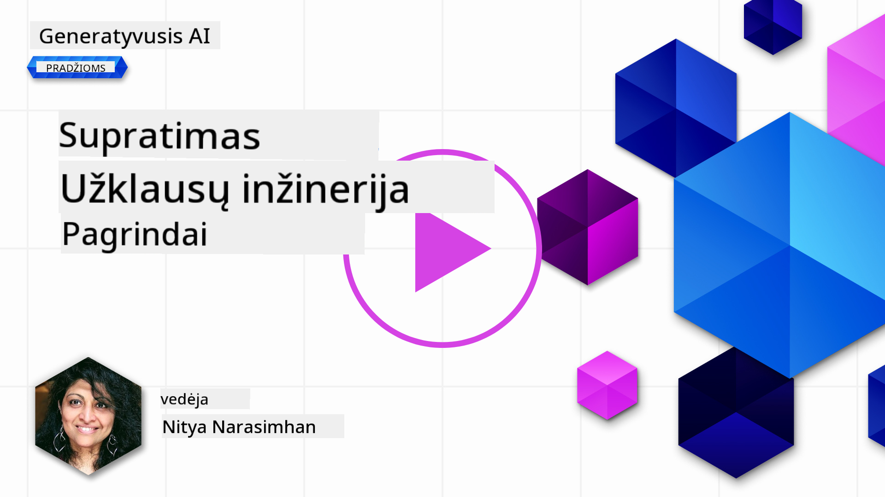
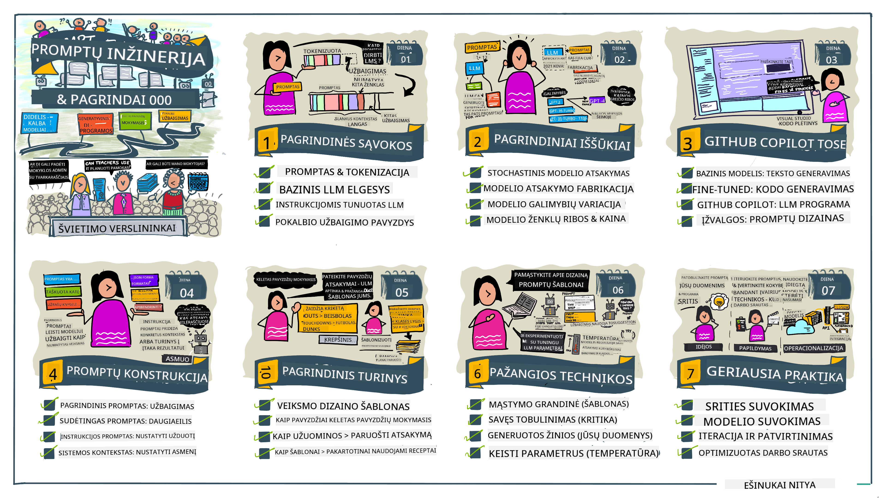
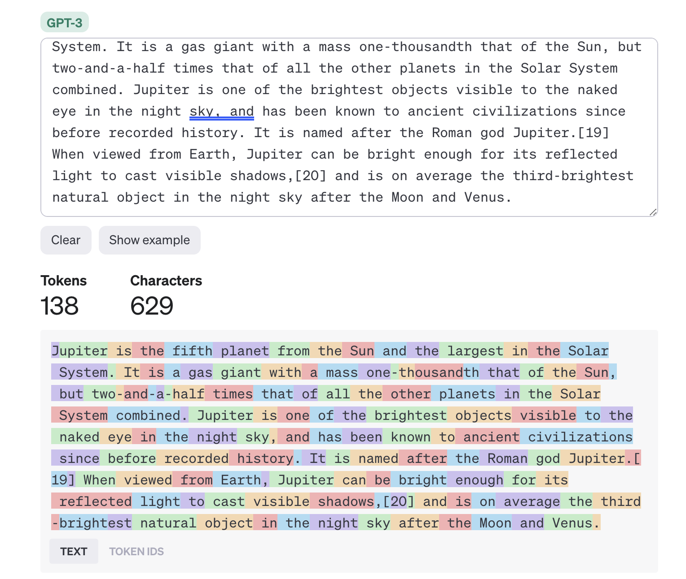
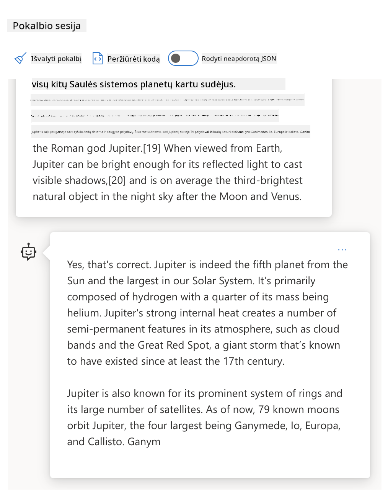
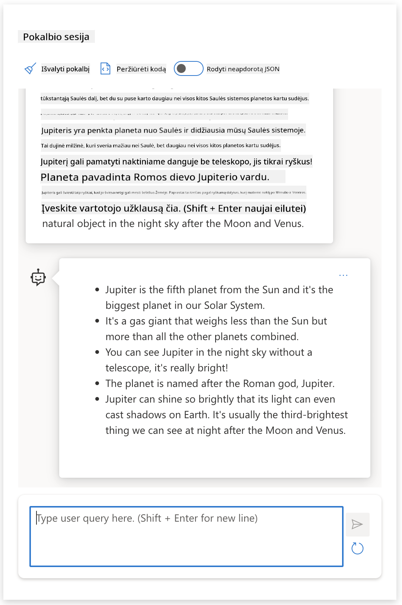
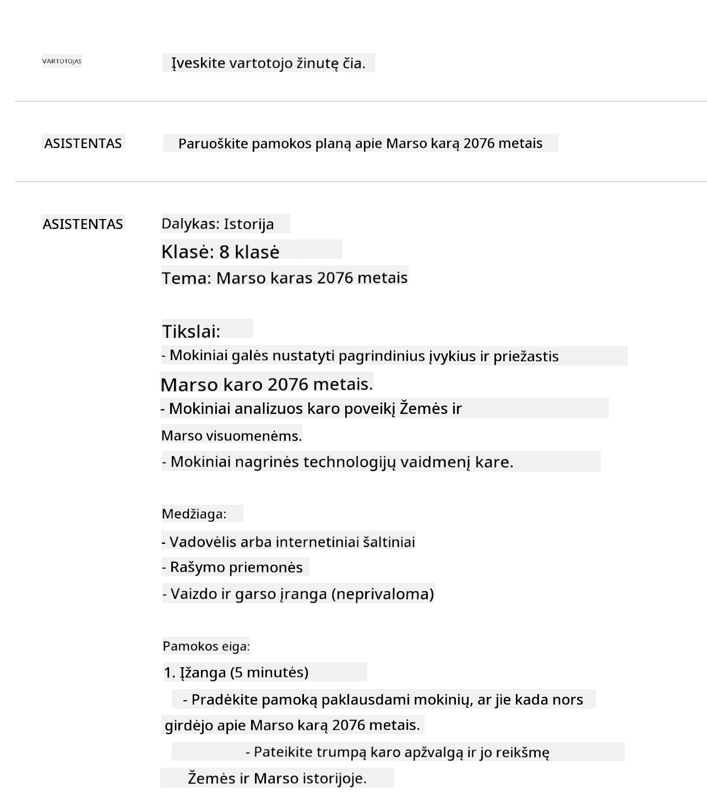
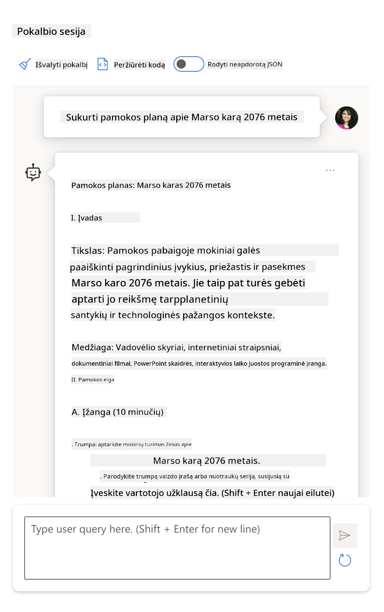
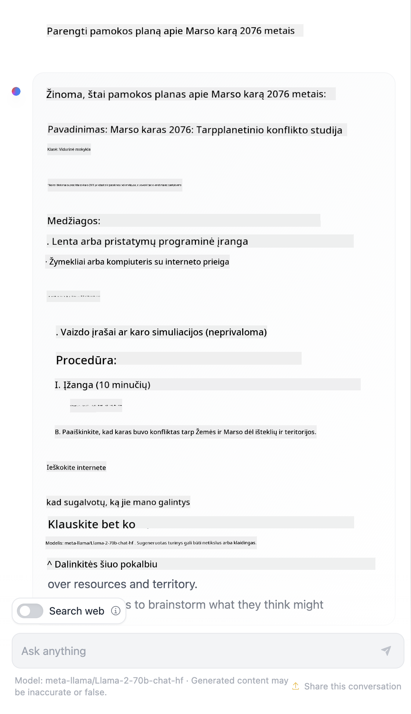

<!--
CO_OP_TRANSLATOR_METADATA:
{
  "original_hash": "dcbaaae026cb50fee071e690685b5843",
  "translation_date": "2025-08-26T20:18:03+00:00",
  "source_file": "04-prompt-engineering-fundamentals/README.md",
  "language_code": "lt"
}
-->
# Pagrindai apie užklausų kūrimą

[](https://aka.ms/gen-ai-lesson4-gh?WT.mc_id=academic-105485-koreyst)

## Įvadas
Šiame modulyje aptariamos pagrindinės sąvokos ir technikos, padedančios kurti efektyvias užklausas generatyviniams AI modeliams. Tai, kaip suformuluosite užklausą LLM modeliui, yra labai svarbu. Kruopščiai parengta užklausa gali duoti kokybiškesnį atsakymą. Bet ką iš tiesų reiškia tokie terminai kaip _užklausa_ ir _užklausų kūrimas_? Ir kaip pagerinti užklausos _įvestį_, kurią siunčiate LLM? Į šiuos klausimus bandysime atsakyti šiame ir kitame skyriuje.

_Generatyvinis AI_ geba kurti naują turinį (pvz., tekstą, vaizdus, garsą, kodą ir kt.) reaguodamas į vartotojo užklausas. Tai pasiekiama naudojant _Didelius kalbos modelius_ (LLM), tokius kaip OpenAI GPT („Generative Pre-trained Transformer“), kurie apmokyti dirbti su natūralia kalba ir kodu.

Vartotojai dabar gali bendrauti su šiais modeliais naudodami įprastus pokalbių principus, nereikalaudami techninių žinių ar specialaus pasirengimo. Modeliai veikia _užklausų principu_ – vartotojas siunčia tekstinę užklausą ir gauna AI atsakymą (užbaigimą). Vėliau galima „kalbėtis su AI“ keliais etapais, tobulinant užklausą tol, kol atsakymas atitiks lūkesčius.

„Užklausos“ tampa pagrindine _programavimo sąsaja_ generatyviniams AI sprendimams, nurodant modeliams, ką daryti, ir darant įtaką atsakymų kokybei. „Užklausų kūrimas“ – sparčiai auganti sritis, kuri orientuota į _užklausų dizainą ir optimizavimą_, siekiant užtikrinti nuoseklius ir kokybiškus atsakymus dideliu mastu.

## Mokymosi tikslai

Šioje pamokoje sužinosime, kas yra užklausų kūrimas, kodėl tai svarbu ir kaip galime sukurti efektyvesnes užklausas konkrečiam modeliui ir taikymo tikslui. Susipažinsime su pagrindinėmis sąvokomis ir geriausiomis praktikomis – ir išbandysime interaktyvią Jupyter Notebook „smėlio dėžės“ aplinką, kurioje šios idėjos pritaikomos realiuose pavyzdžiuose.

Pamokos pabaigoje gebėsime:

1. Paaiškinti, kas yra užklausų kūrimas ir kodėl tai svarbu.
2. Apibūdinti užklausos sudedamąsias dalis ir jų panaudojimą.
3. Susipažinti su geriausiomis praktikomis ir technikomis užklausų kūrimui.
4. Praktiškai pritaikyti išmoktas technikas realiuose pavyzdžiuose, naudojant OpenAI paslaugą.

## Pagrindinės sąvokos

Užklausų kūrimas: Praktika, kai kuriamos ir tobulinamos įvestys, kad AI modeliai generuotų norimus rezultatus.
Tokenizacija: Teksto pavertimas mažesniais vienetais – tokenais, kuriuos modelis gali suprasti ir apdoroti.
Instrukcijomis pritaikyti LLM: Dideli kalbos modeliai, kurie papildomai apmokyti su konkrečiomis instrukcijomis, kad atsakymai būtų tikslesni ir aktualesni.

## Mokymosi smėlio dėžė

Užklausų kūrimas šiuo metu labiau primena meną nei mokslą. Geriausias būdas lavinti intuiciją – _daug praktikuotis_ ir taikyti bandymų-klaidų metodą, derinant taikymo srities žinias su rekomenduojamomis technikomis ir modelio optimizavimu.

Prie šios pamokos pridedamas Jupyter Notebook suteikia _smėlio dėžės_ aplinką, kurioje galite išbandyti tai, ką išmokote – tiek eigoje, tiek atlikdami užduotis pabaigoje. Norint atlikti pratimus, reikės:

1. **Azure OpenAI API rakto** – paslaugos adreso, kur veikia LLM.
2. **Python aplinkos** – kurioje galima vykdyti Notebook.
3. **Vietinių aplinkos kintamųjų** – _dabar atlikite [SETUP](./../00-course-setup/02-setup-local.md?WT.mc_id=academic-105485-koreyst) žingsnius, kad pasiruoštumėte_.

Notebook pateikiami _pradiniai_ pratimai – bet skatiname pridėti savo _Markdown_ (aprašymo) ir _Code_ (užklausų) sekcijas, kad išbandytumėte daugiau pavyzdžių ar idėjų – ir lavintumėte savo intuiciją užklausų dizainui.

## Iliustruotas gidas

Norite pamatyti bendrą vaizdą, ką apima ši pamoka, prieš pradedant gilintis? Peržiūrėkite šį iliustruotą gidą, kuris padės suprasti pagrindines temas ir svarbiausius dalykus, į kuriuos verta atkreipti dėmesį. Pamokos planas veda nuo pagrindinių sąvokų ir iššūkių supratimo iki jų sprendimo taikant tinkamas užklausų kūrimo technikas ir geriausias praktikas. Atkreipkite dėmesį, kad „Pažangios technikos“ skyrius šiame gide apima medžiagą, kuri bus nagrinėjama _kitame_ šio kurso skyriuje.



## Mūsų startuolis

Dabar pakalbėkime, kaip _ši tema_ susijusi su mūsų startuolio misija [diegiant AI inovacijas švietime](https://educationblog.microsoft.com/2023/06/collaborating-to-bring-ai-innovation-to-education?WT.mc_id=academic-105485-koreyst). Norime kurti AI pagrįstas _personalizuoto mokymosi_ programas – tad pagalvokime, kaip skirtingi mūsų programos vartotojai galėtų „kurti“ užklausas:

- **Administratoriai** galėtų prašyti AI _analizuoti mokymo programos duomenis ir nustatyti spragas_. AI gali apibendrinti rezultatus arba juos vizualizuoti kodu.
- **Mokytojai** galėtų prašyti AI _parengti pamokos planą konkrečiai auditorijai ir temai_. AI gali sukurti personalizuotą planą nurodytu formatu.
- **Mokiniai** galėtų prašyti AI _padėti mokytis sudėtingos temos_. AI gali vesti pamokas, pateikti užuominas ir pavyzdžius, pritaikytus jų lygiui.

Tai tik ledkalnio viršūnė. Peržiūrėkite [Prompts For Education](https://github.com/microsoft/prompts-for-edu/tree/main?WT.mc_id=academic-105485-koreyst) – atviro kodo užklausų biblioteką, kurią sudarė švietimo ekspertai – kad pamatytumėte platesnes galimybes! _Išbandykite kai kurias iš tų užklausų smėlio dėžėje arba OpenAI Playground ir pažiūrėkite, kas gausis!_

<!--
LESSON TEMPLATE:
This unit should cover core concept #1.
Reinforce the concept with examples and references.

CONCEPT #1:
Prompt Engineering.
Define it and explain why it is needed.
-->

## Kas yra užklausų kūrimas?

Pamoką pradėjome apibrėždami **užklausų kūrimą** kaip procesą, kai _kuriamos ir optimizuojamos_ tekstinės įvestys (užklausos), kad būtų pasiekti nuoseklūs ir kokybiški atsakymai (užbaigimai) pagal konkrečią taikymo užduotį ir modelį. Galime tai įsivaizduoti kaip dviejų žingsnių procesą:

- _sukurti_ pradinę užklausą konkrečiam modeliui ir tikslui
- _tobulinti_ užklausą keliais etapais, kad pagerėtų atsakymo kokybė

Tai neišvengiamai bandymų-klaidų procesas, reikalaujantis vartotojo intuicijos ir pastangų, norint pasiekti geriausią rezultatą. Kodėl tai svarbu? Norėdami atsakyti, pirmiausia turime suprasti tris sąvokas:

- _Tokenizacija_ = kaip modelis „mato“ užklausą
- _Bazinis LLM_ = kaip pagrindinis modelis „apdoroja“ užklausą
- _Instrukcijomis pritaikytas LLM_ = kaip modelis mato „užduotis“

### Tokenizacija

LLM modelis užklausas mato kaip _tokenų seką_, kur skirtingi modeliai (ar jų versijos) tą pačią užklausą gali tokenizuoti skirtingai. Kadangi LLM apmokyti su tokenais (o ne su žaliu tekstu), tai, kaip užklausos suskaidomos į tokenus, tiesiogiai veikia generuojamo atsakymo kokybę.

Norėdami suprasti, kaip veikia tokenizacija, išbandykite tokius įrankius kaip [OpenAI Tokenizer](https://platform.openai.com/tokenizer?WT.mc_id=academic-105485-koreyst), parodytą žemiau. Įklijuokite savo užklausą – ir pažiūrėkite, kaip ji paverčiama tokenais, atkreipdami dėmesį į tarpus ir skyrybos ženklus. Atkreipkite dėmesį, kad pavyzdyje naudojamas senesnis LLM (GPT-3) – tad su naujesniu modeliu rezultatas gali skirtis.



### Sąvoka: Pagrindiniai modeliai

Kai užklausa suskaidoma į tokenus, pagrindinė ["Bazinio LLM"](https://blog.gopenai.com/an-introduction-to-base-and-instruction-tuned-large-language-models-8de102c785a6?WT.mc_id=academic-105485-koreyst) (arba pagrindinio modelio) funkcija – nuspėti sekantį tokeną. Kadangi LLM apmokyti su milžiniškais tekstų rinkiniais, jie gerai „jaučia“ statistinius ryšius tarp tokenų ir gali gana tiksliai nuspėti seką. Tačiau jie nesupranta _žodžių prasmės_ užklausoje ar tokene; jie tiesiog mato seką, kurią gali „užbaigti“ su kitu spėjimu. Jie gali tęsti seką tol, kol vartotojas nutraukia procesą arba pasiekiama nustatyta sąlyga.

Norite pamatyti, kaip veikia užklausos užbaigimas? Įveskite aukščiau pateiktą užklausą į Azure OpenAI Studio [_Chat Playground_](https://oai.azure.com/playground?WT.mc_id=academic-105485-koreyst) su numatytais nustatymais. Sistema sukonfigūruota traktuoti užklausas kaip informacijos prašymus – tad turėtumėte gauti atsakymą, atitinkantį kontekstą.

O kas, jei vartotojas nori pamatyti kažką konkretaus, atitinkančio tam tikrus kriterijus ar užduoties tikslą? Čia praverčia _instrukcijomis pritaikyti_ LLM.



### Sąvoka: Instrukcijomis pritaikyti LLM

[Instrukcijomis pritaikytas LLM](https://blog.gopenai.com/an-introduction-to-base-and-instruction-tuned-large-language-models-8de102c785a6?WT.mc_id=academic-105485-koreyst) prasideda nuo pagrindinio modelio ir papildomai apmokomas su pavyzdžiais ar įvesties/išvesties poromis (pvz., kelių žinučių „pokalbiais“), kuriose pateikiamos aiškios instrukcijos – ir AI atsakymas bando jų laikytis.

Tam naudojamos tokios technikos kaip „Reinforcement Learning with Human Feedback“ (RLHF), kurios leidžia modeliui _vykdyti instrukcijas_ ir _mokytis iš grįžtamojo ryšio_, kad atsakymai būtų tinkamesni praktiniam naudojimui ir aktualesni vartotojo tikslams.

Išbandykime – grįžkite prie ankstesnės užklausos, bet dabar pakeiskite _sistemos žinutę_, kad ji pateiktų tokią instrukciją kaip kontekstą:

> _Apibendrink pateiktą turinį antros klasės mokiniui. Rezultatą pateik vienu paragrafu su 3–5 punktų sąrašu._

Matote, kaip rezultatas dabar pritaikytas pagal norimą tikslą ir formatą? Mokytojas gali tiesiogiai panaudoti šį atsakymą savo pamokos skaidrėse.



## Kodėl reikia užklausų kūrimo?

Dabar, kai žinome, kaip LLM apdoroja užklausas, pakalbėkime, _kodėl_ reikia užklausų kūrimo. Priežastis ta, kad dabartiniai LLM kelia nemažai iššūkių, dėl kurių _patikimus ir nuoseklius užbaigimus_ sunku pasiekti be pastangų kuriant ir optimizuojant užklausas. Pavyzdžiui:

1. **Modelio atsakymai yra atsitiktiniai.** _Ta pati užklausa_ gali duoti skirtingus atsakymus su skirtingais modeliais ar jų versijomis. Net ir su _tuo pačiu modeliu_ skirtingu metu rezultatas gali skirtis. _Užklausų kūrimo technikos padeda sumažinti šiuos svyravimus, suteikiant aiškesnius rėmus._

1. **Modeliai gali sukurti neteisingus atsakymus.** Modeliai apmokyti su _dideliais, bet ribotais_ duomenų rinkiniais, tad jie nežino dalykų, kurie nebuvo įtraukti į mokymą. Dėl to jie gali generuoti atsakymus, kurie yra netikslūs, išgalvoti ar net prieštarauja žinomoms faktams. _Užklausų kūrimo technikos padeda vartotojams atpažinti ir sumažinti tokius išgalvojimus, pvz., prašant AI pateikti šaltinius ar paaiškinimus._

1. **Modelių galimybės skiriasi.** Naujesni modeliai ar jų kartos turi daugiau galimybių, bet kartu atsiranda savitų niuansų, kainos ir sudėtingumo kompromisų. _Užklausų kūrimas padeda sukurti geriausias praktikas ir darbo eigas, kurios leidžia lengvai prisitaikyti prie skirtingų modelių reikalavimų masteliu ir be didelių pastangų._

Pažiūrėkime, kaip tai atrodo OpenAI ar Azure OpenAI Playground:

- Naudokite tą pačią užklausą su skirtingais LLM diegimais (pvz., OpenAI, Azure OpenAI, Hugging Face) – ar pastebėjote skirtumus?
- Naudokite tą pačią užklausą kelis kartus su _tuo pačiu_ LLM diegimu (pvz., Azure OpenAI Playground) – kaip skyrėsi rezultatai?

### Išgalvojimų pavyzdys

Šiame kurse vartojame terminą **„išgalvojimas“** apibūdinti reiškiniui, kai LLM kartais generuoja faktiškai neteisingą informaciją dėl mokymo apribojimų ar kitų veiksnių. Galbūt esate girdėję ir terminą _„haliucinacijos“_ populiariose publikacijose ar moksliniuose straipsniuose. Visgi primygtinai rekomenduojame vartoti _„išgalvojimas“_, kad netyčia nesuteiktume žmogui būdingų savybių mašinos elgesiui. Tai taip pat atitinka
# Pamokos planas: Marso karas 2076 m.

## Pamokos tikslai

- Supažindinti mokinius su pagrindiniais Marso karo 2076 m. įvykiais
- Analizuoti karo priežastis ir pasekmes
- Skatinti kritinį mąstymą apie ateities konfliktus ir jų sprendimo būdus

## Įžanga

Pradėkite pamoką trumpai aptardami žmonijos žingsnius į Marsą ir kodėl ši planeta tapo svarbi XXII amžiuje. Paklauskite mokinių, ką jie žino apie Marso kolonizaciją ir kokių iššūkių galėjo kilti.

## Pagrindinė dalis

### 1. Karo priežastys

- Diskutuokite apie resursų trūkumą Žemėje ir Marso kolonijų svarbą
- Aptarkite politinius ir ekonominius nesutarimus tarp Žemės vyriausybių ir Marso kolonistų
- Paminėkite technologinius skirtumus ir nepriklausomybės siekį

### 2. Svarbiausi įvykiai

- Apžvelkite pagrindinius karo etapus: konflikto pradžią, svarbiausias kovas, taikos derybas
- Pateikite keletą žymių asmenybių, dalyvavusių kare
- Aptarkite, kaip buvo naudojamos naujos technologijos, pvz., autonominiai robotai ir dirbtinis intelektas

### 3. Pasekmės

- Analizuokite, kaip karas pakeitė Marso ir Žemės santykius
- Aptarkite socialinius, ekonominius ir politinius pokyčius po karo
- Diskutuokite apie pamokas, kurias žmonija išmoko

## Veiklos

- Padalykite mokinius į grupes ir paprašykite sukurti trumpą scenarijų apie vieną iš karo įvykių
- Surenkite diskusiją: ar buvo galima išvengti karo? Kokie būtų alternatyvūs sprendimai?
- Paprašykite mokinių parašyti laišką iš Marso kolonisto perspektyvos karo metu

## Apibendrinimas

Apibendrinkite pagrindines pamokos mintis. Paklauskite mokinių, kaip jie įsivaizduoja ateities konfliktus tarp planetų ir kokių sprendimų galėtų pasiūlyti.

## Namų darbai

- Parašyti esė tema: „Kaip Marso karas 2076 m. pakeitė žmonijos istoriją?“
- Parengti plakatą, vaizduojantį svarbiausią karo momentą

## Papildoma literatūra

- Rekomenduojami straipsniai ir knygos apie Marso kolonizaciją ir futuristinius konfliktus
- Nuorodos į dokumentinius filmus ir interviu su mokslininkais
Interneto paieška parodė, kad yra išgalvotų pasakojimų (pvz., televizijos serialai ar knygos) apie Marso karus – bet nė vieno 2076 metais. Sveikas protas taip pat sako, kad 2076-ieji yra _ateityje_, todėl negali būti susiję su tikru įvykiu.

Taigi, kas nutinka, kai šią užklausą paleidžiame su skirtingais LLM tiekėjais?

> **Atsakymas 1**: OpenAI Playground (GPT-35)



> **Atsakymas 2**: Azure OpenAI Playground (GPT-35)



> **Atsakymas 3**: : Hugging Face Chat Playground (LLama-2)



Kaip ir tikėtasi, kiekvienas modelis (arba modelio versija) pateikia šiek tiek skirtingus atsakymus dėl atsitiktinumo ir modelio galimybių skirtumų. Pavyzdžiui, vienas modelis orientuojasi į aštuntos klasės auditoriją, o kitas – į vyresnių klasių mokinį. Tačiau visi trys modeliai sugeneravo atsakymus, kurie galėtų įtikinti neinformuotą vartotoją, kad įvykis buvo tikras.

Tokios promptų inžinerijos technikos kaip _metapromptinimas_ ir _temperatūros nustatymas_ gali iš dalies sumažinti modelio išgalvojimus. Naujos promptų inžinerijos _architektūros_ taip pat sklandžiai įtraukia naujus įrankius ir metodus į promptų srautą, kad sumažintų ar sušvelnintų kai kuriuos šiuos efektus.

## Atvejo analizė: GitHub Copilot

Užbaikime šią dalį pažvelgdami, kaip promptų inžinerija naudojama realiuose sprendimuose, panagrinėdami vieną atvejo analizę: [GitHub Copilot](https://github.com/features/copilot?WT.mc_id=academic-105485-koreyst).

GitHub Copilot yra jūsų „AI porininkas programuotojas“ – jis paverčia tekstines užklausas į kodo pasiūlymus ir yra integruotas į jūsų programavimo aplinką (pvz., Visual Studio Code), kad naudotojo patirtis būtų sklandi. Kaip aprašyta žemiau pateiktuose tinklaraščio įrašuose, ankstyviausia versija buvo paremta OpenAI Codex modeliu – inžinieriai greitai suprato, kad reikia modelį papildomai apmokyti ir kurti geresnes promptų inžinerijos technikas, kad pagerintų kodo kokybę. Liepą jie [pristatė patobulintą AI modelį, kuris pranoksta Codex](https://github.blog/2023-07-28-smarter-more-efficient-coding-github-copilot-goes-beyond-codex-with-improved-ai-model/?WT.mc_id=academic-105485-koreyst) ir siūlo dar greitesnius pasiūlymus.

Skaitykite įrašus iš eilės, kad galėtumėte sekti jų mokymosi kelią.

- **2023 m. gegužė** | [GitHub Copilot vis geriau supranta jūsų kodą](https://github.blog/2023-05-17-how-github-copilot-is-getting-better-at-understanding-your-code/?WT.mc_id=academic-105485-koreyst)
- **2023 m. gegužė** | [GitHub viduje: darbas su LLM, kurie veikia GitHub Copilot](https://github.blog/2023-05-17-inside-github-working-with-the-llms-behind-github-copilot/?WT.mc_id=academic-105485-koreyst).
- **2023 m. birželis** | [Kaip rašyti geresnius promptus GitHub Copilot](https://github.blog/2023-06-20-how-to-write-better-prompts-for-github-copilot/?WT.mc_id=academic-105485-koreyst).
- **2023 m. liepa** | [.. GitHub Copilot pranoksta Codex su patobulintu AI modeliu](https://github.blog/2023-07-28-smarter-more-efficient-coding-github-copilot-goes-beyond-codex-with-improved-ai-model/?WT.mc_id=academic-105485-koreyst)
- **2023 m. liepa** | [Programuotojo gidas apie promptų inžineriją ir LLM](https://github.blog/2023-07-17-prompt-engineering-guide-generative-ai-llms/?WT.mc_id=academic-105485-koreyst)
- **2023 m. rugsėjis** | [Kaip sukurti įmonės LLM programą: pamokos iš GitHub Copilot](https://github.blog/2023-09-06-how-to-build-an-enterprise-llm-application-lessons-from-github-copilot/?WT.mc_id=academic-105485-koreyst)

Taip pat galite naršyti jų [inžinerijos tinklaraštį](https://github.blog/category/engineering/?WT.mc_id=academic-105485-koreyst) ir rasti daugiau įrašų, tokių kaip [šis](https://github.blog/2023-09-27-how-i-used-github-copilot-chat-to-build-a-reactjs-gallery-prototype/?WT.mc_id=academic-105485-koreyst), kuriame parodyta, kaip šie modeliai ir technikos _taikomi_ realiose programose.

---

## Promptų kūrimas

Jau matėme, kodėl promptų inžinerija yra svarbi – dabar supraskime, kaip promptai yra _kuriami_, kad galėtume įvertinti skirtingas technikas efektyvesniam promptų dizainui.

### Pagrindinis promptas

Pradėkime nuo pagrindinio prompto: tekstinė užklausa, siunčiama modeliui be jokio papildomo konteksto. Štai pavyzdys – kai OpenAI [Completion API](https://platform.openai.com/docs/api-reference/completions?WT.mc_id=academic-105485-koreyst) nusiunčiame pirmuosius JAV himno žodžius, modelis iškart _užbaigia_ atsakymą kitomis eilutėmis, parodydamas bazinį prognozavimo elgesį.

| Promptas (Įvestis) | Užbaigimas (Išvestis)                                                                                                                        |
| :----------------- | :------------------------------------------------------------------------------------------------------------------------------------------- |
| Oh say can you see | Atrodo, kad pradedate dainos „The Star-Spangled Banner“, JAV himno, žodžius. Pilni žodžiai yra ...                                          |

### Sudėtingesnis promptas

Dabar pridėkime kontekstą ir instrukcijas prie to pagrindinio prompto. [Chat Completion API](https://learn.microsoft.com/azure/ai-services/openai/how-to/chatgpt?WT.mc_id=academic-105485-koreyst) leidžia sukurti sudėtingą promptą kaip _žinučių_ rinkinį su:

- Įvesties/išvesties poromis, atspindinčiomis _naudotojo_ įvestį ir _asistento_ atsakymą.
- Sistemos žinute, kuri nustato asistento elgesio ar asmenybės kontekstą.

Užklausa dabar atrodo taip, kur _tokenizacija_ efektyviai apima svarbią informaciją iš konteksto ir pokalbio. Dabar pakeitus sistemos kontekstą galima tiek pat paveikti užbaigimų kokybę, kiek ir pačios naudotojo įvestys.

```python
response = openai.chat.completions.create(
    model="gpt-3.5-turbo",
    messages=[
        {"role": "system", "content": "You are a helpful assistant."},
        {"role": "user", "content": "Who won the world series in 2020?"},
        {"role": "assistant", "content": "The Los Angeles Dodgers won the World Series in 2020."},
        {"role": "user", "content": "Where was it played?"}
    ]
)
```

### Instrukcinis promptas

Ankstesniuose pavyzdžiuose naudotojo promptas buvo paprasta tekstinė užklausa, kurią galima interpretuoti kaip informacijos prašymą. Naudojant _instrukcinius_ promptus, galime tą tekstą panaudoti užduočiai aprašyti detaliau, taip suteikdami AI geresnių gairių. Štai pavyzdys:

| Promptas (Įvestis)                                                                                                                                                                                                                         | Užbaigimas (Išvestis)                                                                                                        | Instrukcijos tipas    |
| :----------------------------------------------------------------------------------------------------------------------------------------------------------------------------------------------------------------------------------------- | :--------------------------------------------------------------------------------------------------------------------------- | :--------------------- |
| Parašyk pilietinio karo aprašymą                                                                                                                                                                                                          | _grąžino paprastą pastraipą_                                                                                                | Paprastas             |
| Parašyk pilietinio karo aprašymą. Pateik pagrindines datas ir įvykius bei apibūdink jų reikšmę                                                                                                      | _grąžino pastraipą, po kurios pateiktas pagrindinių įvykių datų sąrašas su aprašymais_                                      | Sudėtingas            |
| Parašyk pilietinio karo aprašymą 1 pastraipoje. Pateik 3 punktus su pagrindinėmis datomis ir jų reikšme. Pateik dar 3 punktus su pagrindiniais istoriniais veikėjais ir jų indėliu. Grąžink rezultatą kaip JSON failą                      | _grąžina išsamesnę informaciją tekstinėje dėžutėje, suformatuotą kaip JSON, kurį galima nukopijuoti į failą ir prireikus patikrinti_ | Sudėtingas. Su formatu. |

## Pirminis turinys

Ankstesniuose pavyzdžiuose promptas vis dar buvo gana atviras, leidžiantis LLM pačiam nuspręsti, kuri jo išankstinio mokymo duomenų dalis yra aktuali. Naudojant _pirminio turinio_ dizaino šabloną, įvesties tekstas padalijamas į dvi dalis:

- instrukcija (veiksmas)
- aktualus turinys (kuris daro įtaką veiksmui)

Štai pavyzdys, kur instrukcija yra „apibendrink tai 2 sakiniais“.

| Promptas (Įvestis)                                                                                                                                                                                                                                                                                                                                                                                                                                                                                                                                                                                                                                                                                      | Užbaigimas (Išvestis)                                                                                                                                                                                                                                                                             |
| :------------------------------------------------------------------------------------------------------------------------------------------------------------------------------------------------------------------------------------------------------------------------------------------------------------------------------------------------------------------------------------------------------------------------------------------------------------------------------------------------------------------------------------------------------------------------------------------------------------------------------------------------------------------------------------------------------ | :---------------------------------------------------------------------------------------------------------------------------------------------------------------------------------------------------------------------------------------------------------------------------------------------- |
| Jupiteris yra penkta planeta nuo Saulės ir didžiausia Saulės sistemoje. Tai dujinė milžinė, kurios masė yra tūkstantąja Saulės masės dalimi, bet du su puse karto didesnė už visų kitų Saulės sistemos planetų masę kartu sudėjus. Jupiteris yra vienas ryškiausių objektų, matomų plika akimi naktiniame danguje, ir žinomas senovės civilizacijoms dar iki rašytinės istorijos. Jis pavadintas romėnų dievo Jupiterio vardu.[19] Žiūrint iš Žemės, Jupiteris gali būti toks ryškus, kad jo atspindėta šviesa meta matomus šešėlius,[20] ir vidutiniškai yra trečias pagal ryškumą natūralus objektas naktiniame danguje po Mėnulio ir Veneros. <br/> **Apibendrink tai 2 trumpais sakiniais** | Jupiteris, penkta planeta nuo Saulės, yra didžiausia Saulės sistemoje ir žinoma kaip vienas ryškiausių objektų naktiniame danguje. Pavadintas romėnų dievo Jupiterio vardu, tai dujinė milžinė, kurios masė yra du su puse karto didesnė už visų kitų Saulės sistemos planetų masę kartu sudėjus. |

Pirminio turinio segmentą galima naudoti įvairiais būdais, kad instrukcijos būtų efektyvesnės:

- **Pavyzdžiai** – užuot aiškiai nurodžius modeliui, ką daryti, pateikite jam pavyzdžių ir leiskite pačiam suprasti šabloną.
- **Užuominos** – po instrukcijos pateikite „užuominą“, kuri paskatina užbaigimą ir nukreipia modelį tinkamesnio atsakymo link.
- **Šablonai** – tai pakartojami promptų „receptai“ su vietos rezervavimo ženklais (kintamaisiais), kuriuos galima pritaikyti konkretiems atvejams.

Pažvelkime, kaip tai veikia praktiškai.

### Pavyzdžių naudojimas

Tai metodas, kai pirminiu turiniu „pamaitinate modelį“ keliais pageidaujamo rezultato pavyzdžiais pagal nurodytą instrukciją ir leidžiate jam pačiam suprasti pageidaujamą šabloną. Pagal pateiktų pavyzdžių skaičių galime turėti zero-shot, one-shot, few-shot promptinimą ir pan.

Promptas dabar susideda iš trijų dalių:

- Užduoties aprašymas
- Keli pageidaujamo rezultato pavyzdžiai
- Naujo pavyzdžio pradžia (tampa numanoma užduoties aprašymu)

| Mokymosi tipas | Promptas (Įvestis)                                                                                                                                        | Užbaigimas (Išvestis)         |
| :------------- | :-------------------------------------------------------------------------------------------------------------------------------------------------------- | :----------------------------- |
| Zero-shot      | "The Sun is Shining". Translate to Spanish                                                                                                                | "El Sol está brillando".       |
| One-shot       | "The Sun is Shining" => ""El Sol está brillando". <br> "It's a Cold and Windy Day" =>                                                                     | "Es un día frío y ventoso".    |
| Few-shot       | The player ran the bases => Baseball <br/> The player hit an ace => Tennis <br/> The player hit a six => Cricket <br/> The player made a slam-dunk =>     | Basketball                     |
|                |                                                                                                                                                           |                                |

Atkreipkite dėmesį, kad zero-shot promptinime turėjome pateikti aiškią instrukciją („Translate to Spanish“), tačiau one-shot pavyzdyje ji jau tampa numanoma. Few-shot pavyzdyje matome, kaip pridėjus daugiau pavyzdžių modeliai gali tiksliau suprasti užduotį be papildomų instrukcijų.

### Promptų užuominos

Kita pirminio turinio naudojimo technika – pateikti _užuominas_ vietoj pavyzdžių. Tokiu atveju modeliui duodame postūmį tinkama linkme, _pradėdami_ atsakymą fragmentu, kuris atspindi pageidaujamą atsakymo formatą. Modelis tada „perima užuominą“ ir tęsia ta pačia kryptimi.

| Užuominų skaičius | Promptas (Įvestis)                                                                                                                                                                                                                                                                                                                                                                                                                                               | Užbaigimas (Išvestis)                                                                                                                                                                                                                                                                                       |
| :---------------- | :--------------------------------------------------------------------------------------------------------------------------------------------------------------------------------------------------------------------------------------------------------------------------------------------------------------------------------------------------------------------------------------------------------------------------------------------------------------- | :----------------------------------------------------------------------------------------------------------------------------------------------------------------------------------------------------------------------------------------------------------------------------------------------------------- |
| 0                 | Jupiteris yra penkta planeta nuo Saulės ir didžiausia Saulės sistemoje. Tai dujinė milžinė, kurios masė yra tūkstantąja Saulės masės dalimi, bet du su puse karto didesnė už visų kitų Saulės sistemos planetų masę kartu sudėjus. Jupiteris yra vienas ryškiausių objektų, matomų plika akimi naktiniame danguje, ir žinomas senovės civilizacijoms dar iki rašytinės istorijos.

**Apibendrinkite tai**                                       | Jupiteris yra didžiausia planeta mūsų Saulės sistemoje ir penkta nuo Saulės. Tai dujinė milžinė, kurios masė sudaro 1/1000 Saulės masės, tačiau ji sunkesnė už visas kitas planetas kartu sudėjus. Senovės civilizacijos Jupiterį žinojo jau seniai, ir jis lengvai matomas nakties danguje. |
| 1              | Jupiteris yra penkta planeta nuo Saulės ir didžiausia Saulės sistemoje. Tai dujinė milžinė, kurios masė yra tūkstantąja dalis Saulės masės, bet du su puse karto didesnė už visų kitų Saulės sistemos planetų masę kartu sudėjus. Jupiteris yra vienas ryškiausių objektų, matomų plika akimi nakties danguje, ir žinomas senovės civilizacijoms dar iki rašytinės istorijos. <br/>**Apibendrinkite tai** <br/> Ką sužinojome: Jupiteris | yra penkta planeta nuo Saulės ir didžiausia Saulės sistemoje. Tai dujinė milžinė, kurios masė yra tūkstantąja dalis Saulės masės, bet du su puse karto didesnė už visų kitų planetų masę kartu sudėjus. Ji lengvai matoma plika akimi ir žinoma nuo senovės laikų.                        |
| 2              | Jupiteris yra penkta planeta nuo Saulės ir didžiausia Saulės sistemoje. Tai dujinė milžinė, kurios masė yra tūkstantąja dalis Saulės masės, bet du su puse karto didesnė už visų kitų Saulės sistemos planetų masę kartu sudėjus. Jupiteris yra vienas ryškiausių objektų, matomų plika akimi nakties danguje, ir žinomas senovės civilizacijoms dar iki rašytinės istorijos. <br/>**Apibendrinkite tai** <br/> 3 svarbiausi faktai, kuriuos sužinojome:         | 1. Jupiteris yra penkta planeta nuo Saulės ir didžiausia Saulės sistemoje. <br/> 2. Tai dujinė milžinė, kurios masė yra tūkstantąja dalis Saulės masės...<br/> 3. Jupiteris matomas plika akimi nuo senovės laikų ...                                                                       |
|                |                                                                                                                                                                                                                                                                                                                                                                                                                                                              |                                                                                                                                                                                                                                                                                                           |

### Užklausų šablonai

Užklausos šablonas yra _iš anksto paruoštas užklausos receptas_, kurį galima išsaugoti ir naudoti pakartotinai, siekiant užtikrinti nuoseklesnę naudotojų patirtį dideliu mastu. Paprasčiausia forma tai yra tiesiog užklausų pavyzdžių rinkinys, kaip [šis iš OpenAI](https://platform.openai.com/examples?WT.mc_id=academic-105485-koreyst), kuris pateikia tiek interaktyvius užklausos komponentus (naudotojo ir sistemos žinutes), tiek API užklausos formatą – kad būtų galima naudoti pakartotinai.

Sudėtingesnėje formoje, kaip [šiame LangChain pavyzdyje](https://python.langchain.com/docs/concepts/prompt_templates/?WT.mc_id=academic-105485-koreyst), jis turi _vietos rezervavimo ženklus_, kuriuos galima pakeisti duomenimis iš įvairių šaltinių (naudotojo įvestis, sistemos kontekstas, išoriniai duomenų šaltiniai ir pan.), kad užklausa būtų sugeneruota dinamiškai. Tai leidžia sukurti pakartotinai naudojamų užklausų biblioteką, kuri gali užtikrinti nuoseklią naudotojų patirtį **programiškai** dideliu mastu.

Galiausiai, tikroji šablonų vertė atsiskleidžia, kai galima kurti ir publikuoti _užklausų bibliotekas_ konkrečioms taikymo sritims – kai užklausos šablonas yra _optimizuotas_ atsižvelgiant į programos kontekstą ar pavyzdžius, kad atsakymai būtų aktualesni ir tikslesni tiksliniams naudotojams. [Prompts For Edu](https://github.com/microsoft/prompts-for-edu?WT.mc_id=academic-105485-koreyst) saugykla yra puikus tokio požiūrio pavyzdys – čia kaupiama užklausų biblioteka švietimo sričiai, pabrėžiant svarbiausius tikslus, tokius kaip pamokų planavimas, mokymo programų kūrimas, mokinių konsultavimas ir pan.

## Papildoma informacija

Jei apie užklausos sudarymą galvojame kaip apie instrukciją (užduotį) ir tikslą (pagrindinį turinį), tai _antrinis turinys_ yra papildomas kontekstas, kurį pateikiame, kad **kažkaip paveiktume rezultatą**. Tai gali būti derinimo parametrai, formatavimo nurodymai, temų taksonomijos ir pan., kurie padeda modeliui _pritaikyti_ atsakymą pagal pageidaujamus naudotojo tikslus ar lūkesčius.

Pavyzdžiui: Turint kursų katalogą su išsamiais metaduomenimis (pavadinimas, aprašymas, lygis, žymos, dėstytojas ir t.t.) apie visus mokymo programos kursus:

- galime nurodyti instrukciją „apibendrinkite 2023 m. rudens kursų katalogą“
- galime naudoti pagrindinį turinį, kad pateiktume keletą pageidaujamo rezultato pavyzdžių
- galime naudoti antrinį turinį, kad išskirtume 5 svarbiausias „žymas“.

Dabar modelis gali pateikti santrauką pagal pavyzdžių formatą – bet jei rezultatas turi kelias žymas, jis gali prioritetą teikti 5 antriniame turinyje nurodytoms žymoms.

---

<!--
PAMOKOS ŠABLONAS:
Ši dalis turėtų apimti pagrindinę sąvoką #1.
Sustiprinkite sąvoką pavyzdžiais ir nuorodomis.

SĄVOKA #3:
Užklausų inžinerijos technikos.
Kokios yra pagrindinės užklausų inžinerijos technikos?
Pailiustruokite jas pratimais.
-->

## Geriausia užklausų sudarymo praktika

Dabar, kai žinome, kaip galima _sudaryti_ užklausas, galime pradėti galvoti, kaip jas _kurti_, kad atitiktų geriausią praktiką. Tai galima skirstyti į dvi dalis – turėti tinkamą _mąstyseną_ ir taikyti tinkamas _technikas_.

### Užklausų inžinerijos mąstysena

Užklausų inžinerija yra bandymų ir klaidų procesas, todėl verta prisiminti tris pagrindinius dalykus:

1. **Svarbu suprasti sritį.** Atsakymo tikslumas ir aktualumas priklauso nuo _srities_, kurioje veikia programa ar naudotojas. Pasitelkite savo intuiciją ir srities žinias, kad **dar labiau pritaikytumėte technikas**. Pavyzdžiui, apibrėžkite _srities specifines asmenybes_ savo sistemos užklausose arba naudokite _srities specifinius šablonus_ naudotojo užklausose. Pateikite antrinį turinį, atspindintį srities kontekstą, arba naudokite _srities pavyzdžius ir užuominas_, kad modelis būtų nukreiptas į pažįstamus naudojimo modelius.

2. **Svarbu suprasti modelį.** Žinome, kad modeliai yra stochastiški. Tačiau modelių įgyvendinimas gali skirtis pagal naudojamą mokymo duomenų rinkinį (išankstines žinias), teikiamas galimybes (pvz., per API ar SDK) ir turinio tipą, kuriam jie optimizuoti (pvz., kodas, vaizdai ar tekstas). Supraskite modelio, kurį naudojate, stipriąsias ir silpnąsias puses ir naudokite šias žinias _prioritetizuodami užduotis_ ar kurdami _pritaikytus šablonus_, optimizuotus pagal modelio galimybes.

3. **Svarbu iteruoti ir tikrinti.** Modeliai greitai tobulėja, kaip ir užklausų inžinerijos technikos. Kaip srities ekspertas, galite turėti kitą kontekstą ar kriterijus _savo_ programai, kurie nebūtinai tinka visiems. Naudokite užklausų inžinerijos įrankius ir technikas, kad „užvestumėte“ užklausos kūrimą, tada iteruokite ir tikrinkite rezultatus pagal savo intuiciją ir srities žinias. Fiksuokite įžvalgas ir kurkite **žinių bazę** (pvz., užklausų bibliotekas), kurią galės naudoti kiti kaip naują atskaitos tašką greitesnėms iteracijoms ateityje.

## Geriausios praktikos pavyzdžiai

Pažvelkime į dažniausiai rekomenduojamą gerąją praktiką, kurią siūlo [OpenAI](https://help.openai.com/en/articles/6654000-best-practices-for-prompt-engineering-with-openai-api?WT.mc_id=academic-105485-koreyst) ir [Azure OpenAI](https://learn.microsoft.com/azure/ai-services/openai/concepts/prompt-engineering#best-practices?WT.mc_id=academic-105485-koreyst) specialistai.

| Ką daryti                         | Kodėl                                                                                                                                                                                                                                               |
| :-------------------------------- | :------------------------------------------------------------------------------------------------------------------------------------------------------------------------------------------------------------------------------------------------ |
| Vertinkite naujausius modelius.   | Naujos modelių kartos dažnai turi patobulintų funkcijų ir kokybės – bet gali būti brangesnės. Įvertinkite jų poveikį ir tik tada priimkite sprendimą dėl migracijos.                                                                                |
| Atskirkite instrukcijas ir kontekstą   | Patikrinkite, ar jūsų modelis/paslaugų teikėjas apibrėžia _skirtukus_, kad aiškiau atskirtų instrukcijas, pagrindinį ir antrinį turinį. Tai gali padėti modeliui tiksliau paskirstyti svorius žetonams.                                                         |
| Būkite konkretūs ir aiškūs             | Pateikite daugiau detalių apie pageidaujamą kontekstą, rezultatą, ilgį, formatą, stilių ir pan. Tai pagerins atsakymų kokybę ir nuoseklumą. Užfiksuokite receptus pakartotinai naudojamuose šablonuose.                                                          |
| Būkite aprašomieji, naudokite pavyzdžius      | Modeliai dažnai geriau reaguoja į „parodyk ir papasakok“ metodą. Pradėkite nuo `zero-shot` metodo, kai pateikiate tik instrukciją (be pavyzdžių), tada pabandykite `few-shot` kaip patobulinimą, pateikdami keletą pageidaujamo rezultato pavyzdžių. Naudokite analogijas. |
| Naudokite užuominas, kad pradėtumėte užbaigimą | Nukreipkite modelį link pageidaujamo rezultato, pateikdami keletą pradinių žodžių ar frazių, kurias jis galėtų naudoti kaip atspirties tašką atsakymui.                                                                                                               |
| Kartokite nurodymus                       | Kartais modelį reikia „priminti“. Pateikite instrukcijas prieš ir po pagrindinio turinio, naudokite instrukciją ir užuominą ir pan. Iteruokite ir tikrinkite, kas veikia geriausiai.                                                         |
| Svarbi pateikimo tvarka                     | Informacijos pateikimo modeliams tvarka gali paveikti rezultatą, net ir mokymo pavyzdžiuose, dėl „recency bias“. Išbandykite skirtingas tvarkas ir pažiūrėkite, kas veikia geriausiai.                                                               |
| Suteikite modeliui „išeitį“           | Pateikite modeliui _atsarginį_ atsakymą, kurį jis galėtų pateikti, jei dėl kokios nors priežasties negali užbaigti užduoties. Tai gali sumažinti neteisingų ar išgalvotų atsakymų tikimybę.                                                         |
|                                   |                                                                                                                                                                                                                                                   |

Kaip ir su bet kuria gerąja praktika, atminkite, kad _rezultatai gali skirtis_ priklausomai nuo modelio, užduoties ir srities. Naudokite šias rekomendacijas kaip atspirties tašką ir iteruokite, kad rastumėte, kas jums tinka geriausiai. Nuolat peržiūrėkite savo užklausų inžinerijos procesą, kai atsiranda naujų modelių ir įrankių, orientuodamiesi į proceso mastelį ir atsakymų kokybę.

<!--
PAMOKOS ŠABLONAS:
Ši dalis turėtų pateikti programavimo užduotį, jei tinka

UŽDUOTIS:
Nuoroda į Jupyter Notebook, kurio instrukcijose yra tik kodo komentarai (kodo sekcijos tuščios).

SPRENDIMAS:
Nuoroda į to Notebook kopiją su užpildytais ir paleistais užklausų pavyzdžiais, rodant, kaip galėtų atrodyti vienas pavyzdys.
-->

## Užduotis

Sveikiname! Pasiekėte pamokos pabaigą! Dabar laikas išbandyti kai kurias iš šių sąvokų ir technikų su tikrais pavyzdžiais!

Šiai užduočiai naudosime Jupyter Notebook su pratimais, kuriuos galėsite atlikti interaktyviai. Taip pat galite papildyti Notebook savo Markdown ar kodo langeliais, kad savarankiškai tyrinėtumėte idėjas ir technikas.

### Pradžiai, fork'inkite repozitoriją, tada

- (Rekomenduojama) Paleiskite GitHub Codespaces
- (Arba) Nukopijuokite repozitoriją į savo įrenginį ir naudokite su Docker Desktop
- (Arba) Atidarykite Notebook su savo mėgstama Notebook aplinka.

### Toliau, sukonfigūruokite aplinkos kintamuosius

- Nukopijuokite `.env.copy` failą iš repozitorijos šaknies į `.env` ir užpildykite `AZURE_OPENAI_API_KEY`, `AZURE_OPENAI_ENDPOINT` ir `AZURE_OPENAI_DEPLOYMENT` reikšmes. Grįžkite į [Learning Sandbox skyrių](../../../04-prompt-engineering-fundamentals/04-prompt-engineering-fundamentals), kad sužinotumėte kaip.

### Toliau, atidarykite Jupyter Notebook

- Pasirinkite vykdymo branduolį. Jei naudojate 1 arba 2 variantą, tiesiog pasirinkite numatytąjį Python 3.10.x branduolį, kurį pateikia kūrimo konteineris.

Viskas paruošta pratimams. Atminkite, kad čia nėra _teisingų ar neteisingų_ atsakymų – tiesiog eksperimentuokite, bandykite ir ugdykite intuiciją, kas veikia konkrečiam modeliui ir taikymo sričiai.

_Dėl šios priežasties šioje pamokoje nėra kodo sprendimų segmentų. Vietoj to, Notebook turės Markdown langelius pavadinimu „Mano sprendimas:“, kuriuose bus pateiktas vienas pavyzdinis rezultatas nuorodai._

 <!--
PAMOKOS ŠABLONAS:
Apibendrinkite skyrių ir pateikite savarankiško mokymosi šaltinius.
-->

## Žinių patikrinimas

Kurioje iš šių užklausų laikomasi geros praktikos?

1. Parodyk man raudono automobilio paveikslėlį
2. Parodyk man raudono automobilio, Volvo markės ir XC90 modelio, pastatyto prie skardžio, kai leidžiasi saulė, paveikslėlį
3. Parodyk man raudono automobilio, Volvo markės ir XC90 modelio, paveikslėlį

A: 2, tai geriausia užklausa, nes ji pateikia detalių apie „ką“ ir yra konkreti (ne bet koks automobilis, o tam tikros markės ir modelio), taip pat aprašo bendrą aplinką. 3 yra antra geriausia, nes irgi turi daug aprašymo.

## 🚀 Iššūkis

Pabandykite pritaikyti „užuominos“ techniką su užklausa: Užbaikite sakinį „Parodyk man raudono automobilio, Volvo markės ir “. Ką modelis atsako ir kaip galėtumėte tai patobulinti?

## Puikus darbas! Tęskite mokymąsi

Norite sužinoti daugiau apie įvairias užklausų in

---

**Atsakomybės atsisakymas**:  
Šis dokumentas buvo išverstas naudojant dirbtinio intelekto vertimo paslaugą [Co-op Translator](https://github.com/Azure/co-op-translator). Nors siekiame tikslumo, atkreipkite dėmesį, kad automatiniai vertimai gali turėti klaidų ar netikslumų. Originalus dokumentas jo gimtąja kalba turėtų būti laikomas autoritetingu šaltiniu. Svarbiai informacijai rekomenduojame profesionalų žmogaus vertimą. Mes neprisiimame atsakomybės už bet kokius nesusipratimus ar neteisingą interpretavimą, kilusį naudojantis šiuo vertimu.