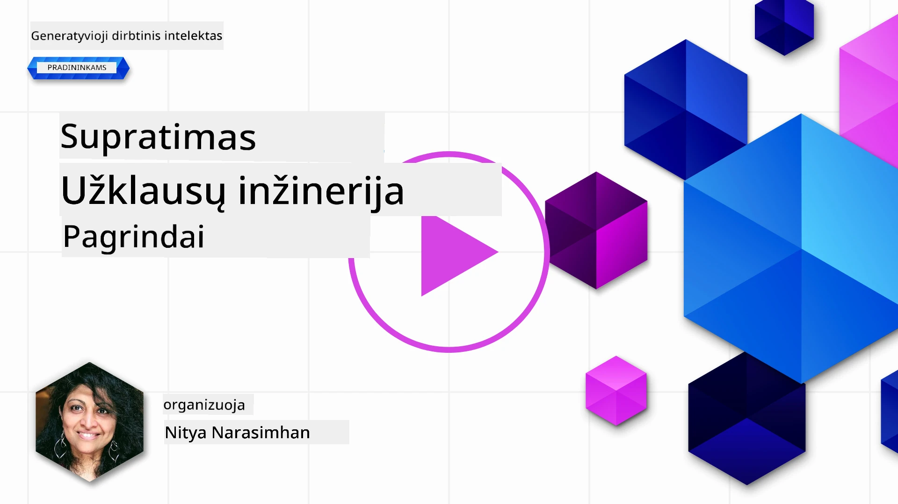
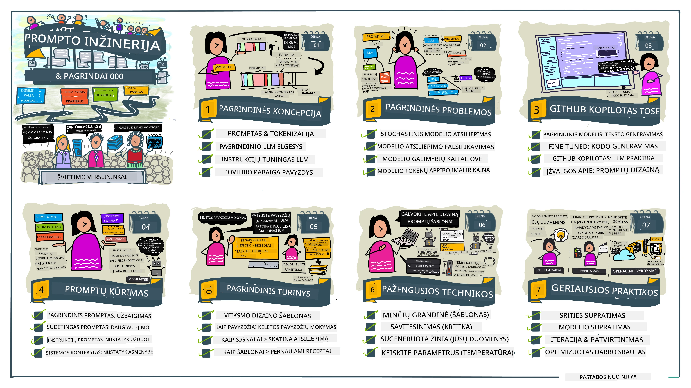
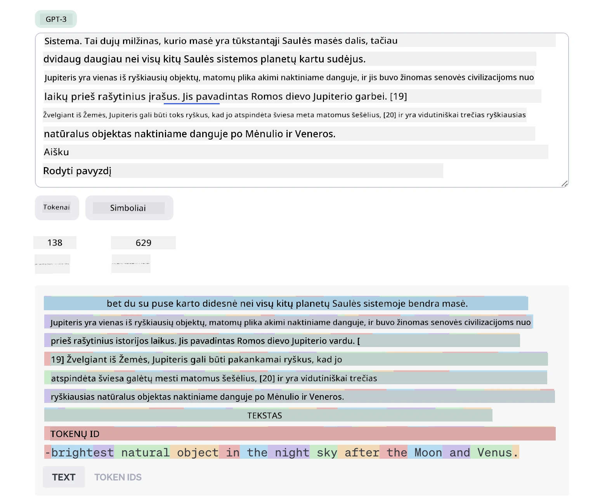
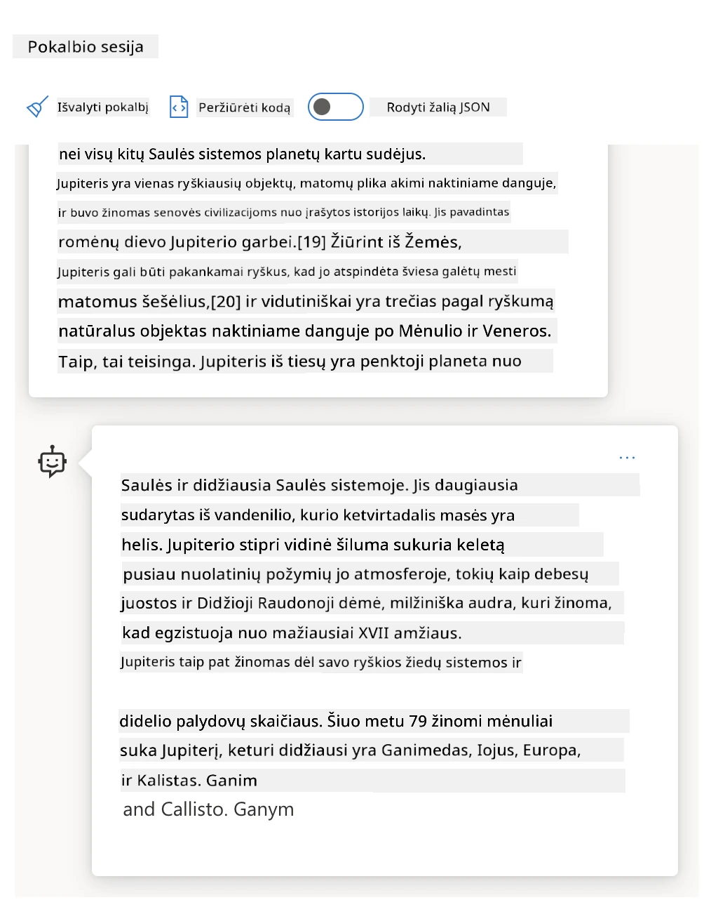
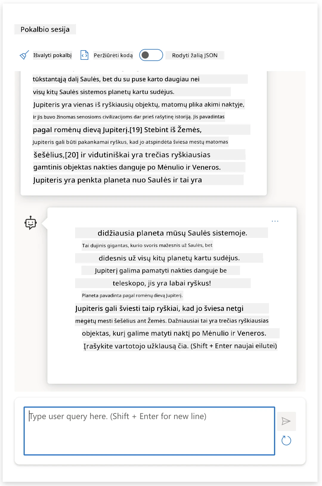
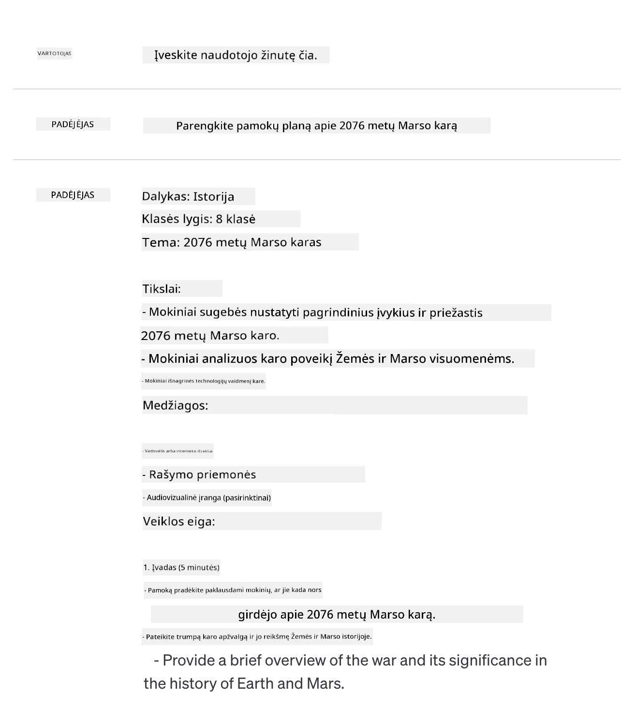
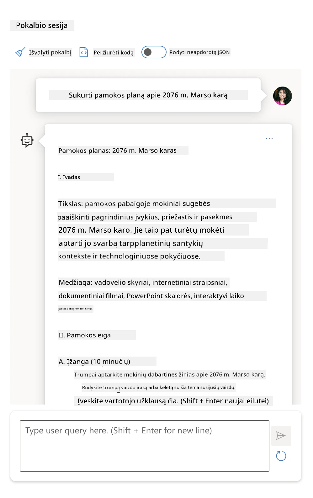
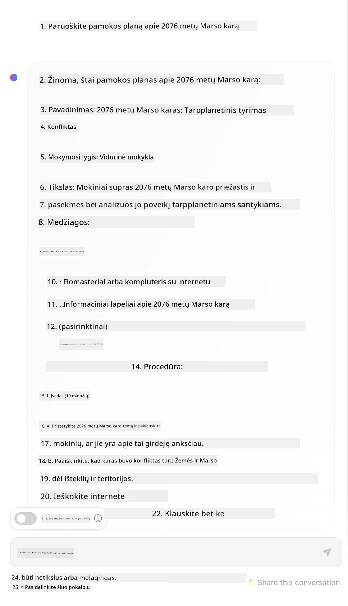

# Pagrindai apie užklausų (promptų) kūrimą

[](https://youtu.be/GElCu2kUlRs?si=qrXsBvXnCW12epb8)

## Įvadas
Šis modulis apima svarbias sąvokas ir metodus, kaip kurti veiksmingas užklausas (promptus) generatyviuose DI modeliuose. Svarbu, kaip rašote savo užklausą LLM modeliui. Kruopščiai sukurta užklausa gali užtikrinti geresnės kokybės atsakymą. Bet ką tiksliai reiškia terminai _užklausa_ ir _užklausų inžinerija_? Ir kaip patobulinti užklausos _įvestį_, kurią siunčiu LLM? Tai klausimai, į kuriuos bandysime atsakyti šiame ir kitame skyriuje.

_Generatyvus DI_ gali kurti naują turinį (pvz., tekstą, paveikslėlius, garsą, kodą ir pan.) pagal vartotojo užklausas. Tai pasiekiama naudojant _didelius kalbos modelius_ (LLM), tokius kaip OpenAI GPT (“Generatyvus iš anksto apmokytas transformerių modelis”), kurie yra apmokyti naudotis natūralia kalba ir kodu.

Vartotojai dabar gali bendrauti su šiais modeliais naudodami pažįstamas paradigmas, tokias kaip pokalbis, nereikalaujant techninių žinių ar mokymų. Modeliai yra _užklausomis valdomi_ – vartotojai siunčia teksto įvestį (užklausą) ir gauna DI atsakymą (užbaigimą). Jie gali tada „kalbėtis su DI“ iteratyviai, daugiausiai kartų, tobulindami užklausą, kol atsakymas atitinka jų lūkesčius.

„Užklausos“ dabar tampa pagrindine _programavimo sąsaja_ generatyvioms DI programėlėms, nurodančioms modeliams, ką daryti, ir įtakojančioms gaunamų atsakymų kokybę. „Užklausų inžinerija“ yra sparčiai plečiamas mokslinių tyrimų laukas, kuris orientuojasi į užklausų _dizainą ir optimizavimą_, siekiant užtikrinti nuoseklius ir kokybiškus atsakymus mastu.

## Mokymosi tikslai

Šioje pamokoje sužinosime, kas yra užklausų inžinerija, kodėl ji svarbi ir kaip galime sukurti efektyvesnes užklausas konkrečiam modeliui ir programos tikslui. Susipažinsime su pagrindinėmis sąvokomis ir geriausiomis praktikomis užklausų inžinerijoje – taip pat atrasime interaktyvią Jupyter Notebooks „smėlio dėžės“ aplinką, kur galime matyti šių sąvokų pritaikymą realiems pavyzdžiams.

Pamokos pabaigoje galėsime:

1. Paaiškinti, kas yra užklausų inžinerija ir kodėl ji svarbi.
2. Apibūdinti užklausos sudedamąsias dalis ir jų panaudojimą.
3. Išmokti geriausias praktikas ir technikas užklausų inžinerijai.
4. Pritaikyti įgytas technikas realiems pavyzdžiams su OpenAI prieigos tašku.

## Svarbios sąvokos

Užklausų Inžinerija: Praktika, skirta kurti ir tobulinti įvestis, kad DI modeliai generuotų pageidaujamus rezultatus.
Tokenizacija: Teksto paverčiama mažesniais vienetais, vadinamais žetonais, kuriuos modelis supranta ir apdoroja.
Instrukcijomis Patobulinti LLM: Dideli kalbos modeliai (LLM), kurie yra specifiniai patobulinti naudojant instrukcijas, kad pagerintų atsakymų tikslumą ir aktualumą.

## Mokymosi Smėlio Dėžė

Užklausų inžinerija šiuo metu labiau menas nei mokslas. Geriausias būdas tobulinti intuiciją – _praktikuoti daugiau_ ir taikyti bandymų ir klaidų metodą, kuris sujungia taikomosios srities žinias su rekomenduojamomis technikomis ir modelio specifinėmis optimizacijomis.

Šiai pamokai pridedamas Jupyter Notebook suteikia _smėlio dėžės_ aplinką, kurioje galite išbandyti įgytas žinias – vykdant užduotis pamokos metu arba kaip užbaigiamąjį kodo iššūkį. Norint vykdyti pratimus, reikės:

1. **Azure OpenAI API raktas** – paslaugos galinis taškas išdiegti LLM modeliui.
2. **Python vykdymo aplinka** – kurioje galima vykdyti Notebook.
3. **Vietinės aplinkos kintamieji** – _užbaikite [SETUP](./../00-course-setup/02-setup-local.md?WT.mc_id=academic-105485-koreyst) žingsnius dabar, kad pasiruoštumėte_.

Notebook pateikia pradines užduotis – bet skatiname papildyti savo _Markdown_ (aprašymo) ir _Code_ (užklausų) skyrius, kad išbandytumėte daugiau pavyzdžių ar idėjų ir vystytumėte intuiciją užklausų dizainui.

## Iliustruotas vadovas

Norite gauti bendrą vaizdą, ką ši pamoka apima prieš pradedant? Patikrinkite šį iliustruotą vadovą, kuris suteiks supratimą apie pagrindines aptariamas temas ir svarbiausius išmokimus kiekvienai jų. Pamokos planas veda nuo pagrindinių sąvokų ir iššūkių supratimo iki sprendimų taikant tinkamas užklausų inžinerijos technikas ir geriausias praktikas. Atkreipkite dėmesį, kad „Pažangių Technikų“ skyrius šiame vadove apima medžiagą, aptariamą _kitoje_ šio kurso dalyje.



## Mūsų Startuolis

Dabar pakalbėkime, kaip _ši tema_ susijusi su mūsų startuolio misija [atnešti DI inovacijas į švietimą](https://educationblog.microsoft.com/2023/06/collaborating-to-bring-ai-innovation-to-education?WT.mc_id=academic-105485-koreyst). Norime kurti DI pagrįstas programas _personalizuotam mokymuisi_ – todėl pagalvokime, kaip skirtingi mūsų programos naudotojai gali „kūrti“ užklausas:

- **Administratoriai** gali paprašyti DI _analizuoti mokymo programos duomenis ieškant spragų apimtimi_. DI gali suvesti rezultatus arba juos vizualizuoti su kodu.
- **Mokytojai** gali paprašyti DI _sukurti pamokos planą tiksliniam auditorijai ir temai_. DI gali paruošti asmeninį planą nurodytu formatu.
- **Mokiniai** gali paprašyti DI _mokyti juos sudėtingoje srityje_. DI dabar gali nukreipti mokinius su pamokomis, patarimais ir pavyzdžiais, pritaikytais jų lygiui.

Tai tik viršūnėlė. Pažiūrėkite [Prompts For Education](https://github.com/microsoft/prompts-for-edu/tree/main?WT.mc_id=academic-105485-koreyst) – atviro kodo užklausų biblioteką, kuruojamą švietimo ekspertų, kad gautumėte platesnį galimybių suvokimą! _Išbandykite keletą užklausų smėlio dėžėje arba naudodamiesi OpenAI Playground, kad pamatytumėte, kas nutinka!_

<!--
PAMOKOS ŠABLONAS:
Ši dalis turėtų apimti pagrindinę sąvoką #1.
Palaikykite sąvoką pavyzdžiais ir nuorodomis.

SĄVOKA #1:
Užklausų inžinerija.
Apibrėžkite ją ir paaiškinkite, kodėl ji reikalinga.
-->

## Kas yra užklausų inžinerija?

Šią pamoką pradėjome apibrėždami **užklausų inžineriją** kaip procesą, kuriame _kuriamos ir optimizuojamos_ teksto įvestys (užklausos), siekiant pateikti nuoseklius ir kokybiškus atsakymus (užbaigimus) pagal konkretų taikymo tikslą ir modelį. Galime tai laikyti dviejų žingsnių procesu:

- _sukurti_ pradinę užklausą konkrečiam modeliui ir tikslui
- _toliau tobulinti_ užklausą iteratyviai gerinant atsako kokybę

Tai būtinai yra bandymų ir klaidų procesas, reikalaujantis naudotojo intuicijos ir pastangų, norint gauti optimalius rezultatus. Kodėl tai svarbu? Norėdami atsakyti, pirmiausia turime suprasti tris sąvokas:

- _Tokenizacija_ = kaip modelis „matuoja“ užklausą
- _Pagrindiniai LLM_ = kaip pagrindinis modelis „apdoroja“ užklausą
- _Instrukcijomis patobulinti LLM_ = kaip modelis dabar mato „užduotis“

### Tokenizacija

LLM mato užklausas kaip _žetonų seką_, kur skirtingi modeliai (ar jų versijos) gali tą pačią užklausą tokenizuoti skirtingais būdais. Kadangi LLM yra apmokyti su žetonais (o ne žaliu tekstu), užklausų tokenizacijos būdas tiesiogiai veikia sugeneruoto atsakymo kokybę.

Norėdami suprasti tokenizacijos veikimą, išbandykite įrankius, tokius kaip [OpenAI Tokenizer](https://platform.openai.com/tokenizer?WT.mc_id=academic-105485-koreyst), parodytą žemiau. Įterpkite savo užklausą ir pažiūrėkite, kaip ji paverčiama žetonais, atkreipdami dėmesį į tarpų ir skyrybos ženklų elgesį. Atkreipkite dėmesį, kad šiame pavyzdyje parodytas senesnis LLM (GPT-3), todėl bandymas su naujesniu modeliu gali duoti kitokį rezultatą.



### Sąvoka: Pagrindiniai (skaidymo) modeliai

Kai užklausa tokenizuojama, pagrindinė funkcija, kurią atlieka ["Pagrindinis LLM"](https://blog.gopenai.com/an-introduction-to-base-and-instruction-tuned-large-language-models-8de102c785a6?WT.mc_id=academic-105485-koreyst) (arba Pagrindinis modelis) yra numatyti kitą tokeną šioje sekoje. Kadangi LLM apmokyti didžiuliais teksto duomenų rinkiniais, jie gerai supranta statistinius ryšius tarp žetonų ir gali tą prognozę atlikti gana užtikrintai. Jie nesupranta užklausos ar žodžių _prasmės_; jie tiesiog mato šabloną, kurį gali „užbaigti“ kitą žetoną prognozuodami. Jie gali tęsti prognozavimą tol, kol naudotojas nutraukia pokalbį arba įvyksta iš anksto nustatyta sąlyga.

Norite pamatyti, kaip veikia užklausomis pagrįstas užbaigimas? Įveskite aukščiau pateiktą užklausą į [Microsoft Foundry playground](https://ai.azure.com?WT.mc_id=academic-105485-koreyst) su numatytosiomis parametrais. Sistema sukonfigūruota traktuoti užklausas kaip informacijos užklausas – todėl turėtumėte matyti atsakymą, atitinkantį šį kontekstą.

Bet ką daryti, jei vartotojas norėtų pamatyti ką nors konkretaus, atitinkančio tam tikrus kriterijus ar užduoties tikslą? Čia įsijungia _instrukcijomis patobulinti_ LLM.



### Sąvoka: Instrukcijomis patobulinti LLM

[Instrukcijomis Patobulintas LLM](https://blog.gopenai.com/an-introduction-to-base-and-instruction-tuned-large-language-models-8de102c785a6?WT.mc_id=academic-105485-koreyst) prasideda nuo pagrindinio modelio ir toliau jį tikslina pavyzdžiais ar įvesties/išvesties poromis (pvz., daugiažingsnės „žinutės“), kurios gali turėti aiškias instrukcijas – ir DI atsakymas siekia laikytis šių nurodymų.

Tai naudoja metodus, tokius kaip Žmogiškojo Atgalinio Ryšio sustiprintas mokymasis (RLHF), kuris moko modelį _vykdyti instrukcijas_ ir _mokytis iš atsiliepimų_, kad generuoti atsakymus, kurie yra geriau pritaikyti praktinėms programoms ir labiau aktualūs naudotojo tikslams.

Išbandykime – peržiūrėkite aukščiau pateiktą užklausą, bet dabar pakeiskite _sistemos pranešimą_ nurodydami šią instrukciją kaip kontekstą:

> _Apibendrinkite pateiktą turinį antro klasės mokiniui. Laikykitės vieno pastraipos rezultato su 3–5 punktais._

Matote, kaip rezultatas dabar pritaikytas siekiamam tikslui ir formatui? Mokytojas dabar gali naudoti šį atsakymą savo skaidrėse tos pamokos metu.



## Kodėl mums reikia užklausų inžinerijos?

Dabar, kai žinome, kaip LLM apdoroja užklausas, pakalbėkime, kodėl mums reikia užklausų inžinerijos. Atsakymas slypi tame, kad dabartiniai LLM kelia daugybę iššūkių, dėl kurių _patikimas ir nuoseklus užbaigimas_ yra sudėtingesnis be pastangų kuriant ir tobulinant užklausas. Pavyzdžiui:

1. **Modelių atsakymai yra stokastiniai.** _Ta pati užklausa_ greičiausiai duos skirtingus atsakymus su skirtingais modeliais ar jų versijomis. Netgi tas pats modelis gali skirtingais laikais duoti skirtingus rezultatus. _Užklausų inžinerijos metodai padeda sumažinti šias svyravimus, suteikdami geresnes apsaugas_.

1. **Modeliai gali sukurti netikrus atsakymus.** Modeliai yra iš anksto apmokyti su _dideliais, bet ribotais_ duomenų rinkiniais, todėl jiems trūksta žinių apie sąvokas už mokymo ribų. Todėl jie gali sukurti netikslius, išgalvotus arba tiesiogiai su tikrais faktais prieštaraujančius atsakymus. _Užklausų inžinerijos metodai padeda vartotojams identifikuoti ir sumažinti tokius netikrumus, pvz., klausiant DI pateikti šaltinius ar pagrindimus_.

1. **Modelių galimybės skirsis.** Naujesni modeliai ar jų kartos turi platesnes galimybes, bet taip pat turi unikalių savybių ir kompromisų kainos bei sudėtingumo srityse. _Užklausų inžinerija padeda kurti geriausias praktikas ir darbo eigas, kurios abstrahuoja skirtumus ir prisitaiko prie modelių specifinių reikalavimų masto ir sklandumo požiūriu_.

Pažiūrėkime tai praktiškai OpenAI arba Azure OpenAI Playground:

- Panaudokite tą pačią užklausą su skirtingais LLM diegimais (pvz., OpenAI, Azure OpenAI, Hugging Face) – ar pastebėjote skirtumus?
- Kartokite tą pačią užklausą su _tuo pačiu_ LLM diegimu (pvz., Azure OpenAI playground) – kaip skyrėsi atsakymai?

### Netikrų atsakymų pavyzdys

Šiame kurse terminas **„netikras atsakymas“** (fabrication) reiškia reiškinį, kai LLM kartais generuoja faktiniu požiūriu netikslią informaciją dėl jų mokymo ribotumų ar kitų veiksnių. Galbūt šį reiškinį esate girdėję vadinant _„halucinacijomis“_ populiariuose straipsniuose ar moksliniuose darbuose. Tačiau mes tvirtai rekomenduojame naudoti terminą _„netikras atsakymas“_, kad netyčia neantroponomorfizuotume elgsenos, priskirdami mašinai žmogui būdingas savybes. Tai taip pat atitinka [Atsakingo DI gairių](https://www.microsoft.com/ai/responsible-ai?WT.mc_id=academic-105485-koreyst) terminologijos perspektyvą, pašalinant sąvokas, kurios kai kuriose situacijose gali būti laikomos įžeidžiančiomis ar neįtraukiamos.

Norite pamatyti, kaip veikia netikri atsakymai? Pagalvokite apie užklausą, kuri nurodo DI sukurti turinį neegzistuojančia tema (kad užtikrinti, jog jos nėra mokymo duomenyse). Pavyzdžiui, aš panaudojau tokią užklausą:

> **Užklausa:** sukurkite pamokos planą apie Marso karą 2076 metais.

Internetinė paieška parodė, kad yra išgalvotos istorijos (pvz., televizijos serialai ar knygos) apie Marso karus – bet ne 2076 metais. Sveikas protas taip pat sako, kad 2076 metai yra _ateityje_ ir todėl negali būti susieti su tikru įvykiu.


Kas nutinka, kai šį užklausimą paleidžiame su skirtingais LLM teikėjais?

> **Atsakymas 1**: OpenAI Playground (GPT-35)



> **Atsakymas 2**: Azure OpenAI Playground (GPT-35)



> **Atsakymas 3**: : Hugging Face Chat Playground (LLama-2)



Kaip ir tikėtasi, kiekvienas modelis (ar modelio versija) generuoja šiek tiek skirtingus atsakymus dėl stochastinio elgesio ir modelio pajėgumo skirtumų. Pavyzdžiui, vienas modelis skirtas 8 klasės auditorijai, o kitas laiko, kad naudotojas yra vidurinės mokyklos mokinys. Tačiau visi trys modeliai pateikė atsakymus, kurie galėtų įtikinti nežinančią vartotoją, kad įvykis buvo tikras.

Užklausų inžinerijos technikos, tokios kaip _metaužklausų_ kūrimas ir _temperatūros konfigūracija_, gali tam tikru mastu sumažinti modelių išgalvojimus. Naujos užklausų inžinerijos _architektūros_ taip pat sklandžiai įtraukia naujus įrankius ir technikas į užklausų srautą, siekdamos sumažinti kai kuriuos iš šių efektų.

## Atvejo analizė: GitHub Copilot

Apibendrinkime šį skyrių ir pažiūrėkime, kaip užklausų inžinerija naudojama realių sprendimų kontekste, nagrinėdami vieną atvejį: [GitHub Copilot](https://github.com/features/copilot?WT.mc_id=academic-105485-koreyst).

GitHub Copilot yra jūsų "dirbtinio intelekto programavimo partneris" – jis paverčia tekstines užklausas į kodo užbaigimus ir yra integruotas į jūsų kūrimo aplinką (pvz., Visual Studio Code), užtikrinant sklandžią naudotojo patirtį. Kaip aprašyta žemiau pateiktoje tinklaraščių serijoje, ankstyviausia versija buvo paremta OpenAI Codex modeliu – inžinieriai greitai suprato poreikį tikslinti modelį ir kurti geresnes užklausų inžinerijos technikas, kad pagerintų kodo kokybę. Liepos mėnesį jie [pasirodė su patobulintu DI modeliu, kuris eina už Codex ribų](https://github.blog/2023-07-28-smarter-more-efficient-coding-github-copilot-goes-beyond-codex-with-improved-ai-model/?WT.mc_id=academic-105485-koreyst) dar greitesniems pasiūlymams.

Skaitykite įrašus jų eiliškumu, kad sektumėte mokymosi kelią.

- **2023 metų gegužė** | [GitHub Copilot geriau supranta jūsų kodą](https://github.blog/2023-05-17-how-github-copilot-is-getting-better-at-understanding-your-code/?WT.mc_id=academic-105485-koreyst)
- **2023 metų gegužė** | [Viduje GitHub: darbas su LLM už GitHub Copilot](https://github.blog/2023-05-17-inside-github-working-with-the-llms-behind-github-copilot/?WT.mc_id=academic-105485-koreyst).
- **2023 metų birželis** | [Kaip rašyti geresnes užklausas GitHub Copilot](https://github.blog/2023-06-20-how-to-write-better-prompts-for-github-copilot/?WT.mc_id=academic-105485-koreyst).
- **2023 metų liepa** | [GitHub Copilot žengia toliau už Codex su patobulintu DI modeliu](https://github.blog/2023-07-28-smarter-more-efficient-coding-github-copilot-goes-beyond-codex-with-improved-ai-model/?WT.mc_id=academic-105485-koreyst)
- **2023 metų liepa** | [Kūrėjo vadovas užklausų inžinerijai ir LLM](https://github.blog/2023-07-17-prompt-engineering-guide-generative-ai-llms/?WT.mc_id=academic-105485-koreyst)
- **2023 metų rugsėjis** | [Kaip kurti įmonės LLM programėlę: pamokos iš GitHub Copilot](https://github.blog/2023-09-06-how-to-build-an-enterprise-llm-application-lessons-from-github-copilot/?WT.mc_id=academic-105485-koreyst)

Taip pat galite peržiūrėti jų [Inžinerijos tinklaraštį](https://github.blog/category/engineering/?WT.mc_id=academic-105485-koreyst) kitoms įrašams, tokiems kaip [šis](https://github.blog/2023-09-27-how-i-used-github-copilot-chat-to-build-a-reactjs-gallery-prototype/?WT.mc_id=academic-105485-koreyst), kuris parodo, kaip šie modeliai ir technikos yra _pritaikomi_ realių sprendimų kūrimui.

---

<!--
PAMOKOS ŠABLONAS:
Šis skyrius turėtų apimti pagrindinę koncepciją #2.
Sustiprinkite koncepciją pavyzdžiais ir nuorodomis.

KONCEPCIJA #2:
Užklausos dizainas.
Iliustruota pavyzdžiais.
-->

## Užklausos konstrukcija

Matėme, kodėl užklausų inžinerija yra svarbi – dabar supraskime, kaip užklausos _kuriamos_, kad galėtume įvertinti skirtingas technikas efektyvesniam užklausų dizainui.

### Paprasta užklausa

Pradėkime nuo paprastos užklausos: teksto įvesties, siunčiamos modeliui be jokio kito konteksto. Štai pavyzdys – kai pirmuosius kelis žodžius JAV himno siunčiame OpenAI [Completion API](https://platform.openai.com/docs/api-reference/completions?WT.mc_id=academic-105485-koreyst), jis akimirksniu _užbaigia_ atsakymą keliais sekančiais sakiniais, iliustruodamas pagrindinį prognozavimo elgesį.

| Užklausa (įvestis)      | Užbaigimas (išvestis)                                                                                                                        |
| :--------------------- | :----------------------------------------------------------------------------------------------------------------------------------------- |
| Oh say can you see      | Atrodo, kad pradedate dainuoti "The Star-Spangled Banner", Jungtinių Valstijų nacionalinį himną. Visos dainos žodžiai yra ...              |

### Sudėtinga užklausa

Dabar pridėkime kontekstą ir nurodymus prie tos paprastos užklausos. [Chat Completion API](https://learn.microsoft.com/azure/ai-foundry/openai/how-to/chatgpt?WT.mc_id=academic-105485-koreyst) leidžia sukurti sudėtingą užklausą kaip _žinučių_ rinkinį, kuriame:

- Įvesties / išvesties poros, atspindinčios _naudotojo_ įvestį ir _asistento_ atsakymą.
- Sistemos žinutė, nustatanti asistento elgesio ar asmenybės kontekstą.

Užklausa dabar atrodo taip, kur _žodžių skaidymas į žetonus_ efektyviai atspindi svarbią informaciją iš konteksto ir pokalbio. Dabar sistemos konteksto pakeitimas gali turėti tiek pat reikšmės užbaigimų kokybei, kiek ir pateikti naudotojo įrašai.

```python
response = client.responses.create(
    model="gpt-5-mini",
    input=[
        {"role": "system", "content": "You are a helpful assistant."},
        {"role": "user", "content": "Who won the world series in 2020?"},
        {"role": "assistant", "content": "The Los Angeles Dodgers won the World Series in 2020."},
        {"role": "user", "content": "Where was it played?"}
    ]
)
```

### Nurodymų užklausa

Aukščiau pateiktuose pavyzdžiuose naudotojo užklausa buvo paprastas teksto klausimas, kurį galima interpretuoti kaip prašymą gauti informaciją. Su _nurodymų_ užklausomis galime tą tekstą naudoti užduočiai tiksliau apibrėžti, suteikdami DI geresnę kryptį. Štai pavyzdys:

| Užklausa (įvestis)                                                                                                                                                                                                                         | Užbaigimas (išvestis)                                                                                                        | Nurodymo tipas      |
| :------------------------------------------------------------------------------------------------------------------------------------------------------------------------------------------------------------------------------------- | :------------------------------------------------------------------------------------------------------------------------- | :------------------ |
| Parašykite aprašymą apie Pilietinį karą                                                                                                                                                                                                | _grąžino paprastą pastraipą_                                                                                               | Paprasta            |
| Parašykite aprašymą apie Pilietinį karą. Nurodykite pagrindines datas ir įvykius bei aprašykite jų reikšmę                                                                                                                               | _grąžino pastraipą ir sąrašą pagrindinių įvykių datų su aprašymais_                                                         | Sudėtinga           |
| Parašykite aprašymą apie Pilietinį karą 1 pastraipoje. Pateikite 3 punktus su pagrindinėmis datomis ir jų reikšme. Pateikite dar 3 punktus su pagrindinėmis istorinėmis asmenybėmis ir jų indėliu. Grąžinkite išvestį JSON formatu | _grąžina išsamesnę informaciją teksto lange, suformatuotą kaip JSON, kurį galima nukopijuoti į failą ir prireikus patikrinti_  | Sudėtinga. Suformuota. |

## Pagrindinis turinys

Aukščiau pateiktuose pavyzdžiuose užklausa vis dar buvo gana atvira, leidžianti LLM nuspręsti, kurios mokymo duomenų dalys yra svarbios. Su _pagrindinio turinio_ dizaino šablonu įvesties tekstas yra padalintas į dvi dalis:

- nurodymą (veiksmas)
- svarbų turinį (įtakojantį veiksmą)

Štai pavyzdys, kai nurodymas yra "sutrumpinkite tai 2 sakiniais".

| Užklausa (įvestis)                                                                                                                                                                                                                                                                                                                                                                                                                                                                                                                                                                                                                                                                                      | Užbaigimas (išvestis)                                                                                                                                                                                                                                                                             |
| :-------------------------------------------------------------------------------------------------------------------------------------------------------------------------------------------------------------------------------------------------------------------------------------------------------------------------------------------------------------------------------------------------------------------------------------------------------------------------------------------------------------------------------------------------------------------------------------------------------------------------------------------------------------------------------------------------- | :---------------------------------------------------------------------------------------------------------------------------------------------------------------------------------------------------------------------------------------------------------------------------------------------- |
| Jupiteris yra penktoji planeta nuo Saulės ir didžiausia Saulės sistemoje. Tai dujiniai milžinas, kurio masė yra tūkstantąji Saulės masės dalis, bet du su puse karto didesnė už visų kitų planetų Saulės sistemoje masių sumą. Jupiteris yra viena ryškiausių objektų, matomų plika akimi naktiniame danguje, ir jis buvo žinomas senosioms civilizacijoms dar prieš istorijos įrašus. Jis pavadintas romėnų dievo Jupiterio vardu.[19] Žiūrint iš Žemės, Jupiteris gali būti pakankamai ryškus, kad jo atspindėta šviesa mesti matomus šešėlius,[20] ir vidutiniškai yra trečias ryškiausias natūralus objektas naktiniame danguje po Mėnulio ir Veneros. <br/> **Sutrumpinkite tai į 2 trumpus sakinius** | Jupiteris, penktoji planeta nuo Saulės, yra didžiausia Saulės sistemoje ir žinoma kaip viena ryškiausių naktinio dangaus objektų. Pavadintas romėnų dievo Jupiterio vardu, tai dujiniai milžinas, kurio masė yra du su puse karto didesnė už visų kitų planetų Saulės sistemoje sumą. |

Pagrindinį turinį galima naudoti įvairiais būdais, kad būtų gauti efektyvesni nurodymai:

- **Pavyzdžiai** – vietoj to, kad modelis gautų tiesioginį nurodymą, pateikite pavyzdžius, ką reikia padaryti, ir leiskite modeliui suprasti šabloną.
- **Signalai** – po nurodymo pridėkite „signalą“, kuris nukreipia modelį link tinkamesnių atsakymų.
- **Šablonai** – tai pakartojami užklausų „receptai“ su kintamaisiais laukais, kurie gali būti pritaikomi konkrečioms situacijoms su duomenimis.

Pažiūrėkime, kaip tai veikia praktiškai.

### Naudojant pavyzdžius

Tai metodas, kai pagrindinis turinys naudojamas „maitinti modelį“ pavyzdžiais norimos išvesties pagal tam tikrą nurodymą, leidžiant modeliui suprasti norimos išvesties modelį. Atsižvelgiant į pateiktų pavyzdžių skaičių, galime turėti nulio-shot, vieno-shot, kelių-shot užklausas ir pan.

Užklausa dabar susideda iš trijų komponentų:

- Užduoties aprašymas
- Keli pavyzdžiai norimos išvesties
- Naujo pavyzdžio pradžia (kuri tampa implicitiniu užduoties aprašymu)

| Mokymosi tipas | Užklausa (įvestis)                                                                                                                                        | Užbaigimas (išvestis)     |
| :------------ | :---------------------------------------------------------------------------------------------------------------------------------------------------- | :------------------------ |
| Nulio-shot    | „The Sun is Shining“. Išversti į ispanų kalbą                                                                                                         | „El Sol está brillando“.  |
| Vieno-shot    | „The Sun is Shining“ => „El Sol está brillando“. <br> „It's a Cold and Windy Day“ =>                                                                   | „Es un día frío y ventoso“. |
| Kelių-shot   | Žaidėjas bėgo bazėmis => Beisbolas <br/> Žaidėjas pataikė „ace“ => Tenisas <br/> Žaidėjas pataikė „six“ => Kriketas <br/> Žaidėjas atliko „slam-dunk“ =>  | Krepšinis                |
|               |                                                                                                                                                       |                           |

Atkreipkite dėmesį, kad nulio-shot užklausoje reikėjo pateikti aiškų nurodymą („Išversti į ispanų“), tačiau vieno-shot pavyzdyje jis buvo suprantamas iš konteksto. Kelių-shot pavyzdys parodo, kaip pridėjus daugiau pavyzdžių modelis geba tiksliau spėti be papildomų nurodymų.

### Užklausų signalai

Kita pagrindinio turinio naudojimo technika yra pateikti _signalus_ vietoj pavyzdžių. Šiuo atveju mes modelį nukreipiame tinkama linkme, _pradėdami_ jį nuo ištrauktos teksto dalies, kuri atspindi norimą atsakymo formatą. Modelis tada „priima signalą“ ir tęsia ta pačia kryptimi.

| Signalų skaičius | Užklausa (įvestis)                                                                                                                                                                                                                                                                                                                                                                                                                                               | Užbaigimas (išvestis)                                                                                                                                                                                                                                                                                       |
| :------------- | :----------------------------------------------------------------------------------------------------------------------------------------------------------------------------------------------------------------------------------------------------------------------------------------------------------------------------------------------------------------------------------------------------------------------------------------------------------- | :-------------------------------------------------------------------------------------------------------------------------------------------------------------------------------------------------------------------------------------------------------------------------------------------------------- |
| 0              | Jupiteris yra penktoji planeta nuo Saulės ir didžiausia Saulės sistemoje. Tai dujiniai milžinas, kurio masė yra tūkstantąji Saulės masės dalis, bet du su puse karto didesnė už visų kitų planetų Saulės sistemoje masių sumą. Jupiteris yra viena ryškiausių objektų, matomų plika akimi naktiniame danguje, ir jis buvo žinomas senosioms civilizacijoms dar prieš istorijos įrašus. <br/>**Sutrumpinkite tai**                                       | Jupiteris yra didžiausia planeta mūsų Saulės sistemoje ir penktoji nuo Saulės. Tai dujiniai milžinas, kurio masė yra 1/1000 Saulės masės, tačiau jis sunkesnis nei visos kitos planetos kartu. Senovės civilizacijos jau seniai žino apie Jupiterį, o jis lengvai matomas naktiniame danguje.. |
| 1              | Jupiteris yra penktoji planeta nuo Saulės ir didžiausia Saulės sistemoje. Tai dujiniai milžinas, kurio masė yra tūkstantąji Saulės masės dalis, bet du su puse karto didesnė už visų kitų planetų Saulės sistemoje masių sumą. Jupiteris yra viena ryškiausių objektų, matomų plika akimi naktiniame danguje, ir jis buvo žinomas senosioms civilizacijoms dar prieš istorijos įrašus. <br/>**Sutrumpinkite tai** <br/> Ko išmokome yra tai, kad Jupiteris | yra penktoji planeta nuo Saulės ir didžiausia Saulės sistemoje. Tai dujiniai milžinas, kurio masė yra tūkstantąji Saulės masės dalis, bet du su puse karto didesnė už visų kitų planetų kartu. Jis lengvai matomas plika akimi ir žinomas nuo senoves.                                  |

| 2              | Jupiteris yra penktoji planeta nuo Saulės ir didžiausia Saulės sistemoje. Tai dujų milžinas, kurio masė yra tūkstantąji dalis Saulės masės, tačiau ji yra du su puse karto didesnė už visų kitų Saulės sistemos planetų masių sumą. Jupiteris yra vienas iš ryškiausių objektų, matomų plika akimi naktiniame danguje, ir jis buvo žinomas senosioms civilizacijoms jau prieš užfiksuotą istoriją. <br/>**Apibendrinkite šį** <br/> Mūsų sužinoti 3 svarbiausi faktai:         | 1. Jupiteris yra penktoji planeta nuo Saulės ir didžiausia Saulės sistemoje. <br/> 2. Tai dujų milžinas, kurio masė yra tūkstantąji dalis Saulės masės...<br/> 3. Jupiteris buvo matomas plika akimi nuo senų laikų ...                                                                       |
|                |                                                                                                                                                                                                                                                                                                                                                                                                                                                              |                                                                                                                                                                                                                                                                                                           |

### Užklausų Šablonai

Užklausų šablonas yra _iš anksto apibrėžtas užklausos receptas_, kurį galima saugoti ir pakartotinai naudoti, siekiant užtikrinti nuoseklesnes naudotojų patirtis dideliu mastu. Paprasčiausia forma tai yra užklausų pavyzdžių rinkinys, pavyzdžiui, [šis iš OpenAI](https://cookbook.openai.com/examples/gpt4-1_prompting_guide?WT.mc_id=academic-105485-koreyst), kuris pateikia tiek interaktyvias užklausos dalis (naudotojo ir sistemos žinutes), tiek API pagrindu veikiančio užklausos formato pavyzdį - tam, kad būtų palaikomas pakartotinis naudojimas.

Sudėtingesnė forma, kaip [šis pavyzdys iš LangChain](https://python.langchain.com/docs/concepts/prompt_templates/?WT.mc_id=academic-105485-koreyst), turi _vietas rezervuotes_, kurias galima pakeisti duomenimis iš įvairių šaltinių (naudotojo įvestis, sistemos kontekstas, išoriniai duomenų šaltiniai ir pan.), kad būtų dinamiškai sugeneruota užklausa. Tai leidžia sukurti pakartotinai naudojamų užklausų biblioteką, kuri gali būti naudojama **programiškai** nuoseklioms naudotojų patirtims skatinti dideliu mastu.

Galiausiai, tikroji šablonų vertė yra galimybė kurti ir publikuoti _užklausų bibliotekas_ tam tikriems vertikaliems programų domenams - kai užklausos šablonas yra dabar _optimizuotas_, kad atspindėtų taikomosios srities specifinį kontekstą ar pavyzdžius, kurie daro atsakymus tinkamesnius ir tikslesnius tiksliniam naudotojų auditorijai. [Prompts For Edu](https://github.com/microsoft/prompts-for-edu?WT.mc_id=academic-105485-koreyst) saugykla yra puikus šio požiūrio pavyzdys, kur ji kuruoja užklausų biblioteką švietimo sričiai, pabrėždama pagrindinius tikslus, kaip pamokų planavimas, mokymo programos kūrimas, studentų mokymas ir pan.

## Papildomas Turinys

Jei galvosime apie užklausos konstrukciją turint nurodymą (užduotį) ir tikslinį turinį (pagrindinį turinį), tada _antrinis turinys_ yra kaip papildomas kontekstas, kurį mes suteikiame, kad **kaip nors paveiktume rezultatą**. Tai gali būti sureguliavimo parametrai, formatavimo instrukcijos, temų taksonomijos ir pan., kurie gali padėti modeliui _pritaikyti_ savo atsakymą, kad atitiktų norimus naudotojo tikslus ar lūkesčius.

Pavyzdžiui: turint kursų katalogą su išsamiais metaduomenimis (pavadinimas, aprašymas, lygis, metaduomenų žymos, dėstytojas ir pan.) apie visus turimus kursus mokymo programoje:

- galime apibrėžti nurodymą „apibendrinti 2023 m. rudens kursų katalogą“
- galime naudoti pagrindinį turinį, kad pateiktume keletą norimo rezultato pavyzdžių
- galime naudoti antrinį turinį, kad išskirtume 5 svarbiausias „žymas“

Dabar modelis gali pateikti santrauką formatu, kuris parodytas keliuose pavyzdžiuose - tačiau jei rezultatas turi kelias žymas, jis gali prioritetizuoti antriniame turinyje nurodytas 5 žymas.

---

<!--
PAMOKOS ŠABLONAS:
Šis skyrius turėtų apimti pagrindinę sąvoką Nr. 1.
Paryškinkite sąvoką pavyzdžiais ir nuorodomis.

SĄVOKA NR. 3:
Užklausų inžinerijos metodai.
Kokie yra pagrindiniai užklausų inžinerijos metodai?
Iliustruokite tai su keletu pratimų.
-->

## Geriausios Užklausų Praktikos

Dabar, kai žinome, kaip užklausos gali būti _sukuriamos_, galime pradėti galvoti apie jų _projektavimą_, siekiant atspindėti geriausias praktikas. Galime tai svarstyti dviem aspektais – turėti tinkamą _požiūrį_ ir taikyti tinkamus _metodus_.

### Užklausų Inžinerijos Požiūris

Užklausų inžinerija yra bandymų ir klaidų procesas, tad prisiminkite tris plačius pagrindinius veiksnius:

1. **Srities supratimas svarbus.** Atsakymo tikslumas ir aktualumas priklauso nuo to, kokioje _srityje_ ta programa ar naudotojas veikia. Naudokite savo intuiciją ir srities ekspertizę, kad **dar labiau pritaikytumėte metodus**. Pavyzdžiui, apibrėžkite _srities specifines asmenybes_ savo sistemos užklausose arba naudokite _srities specifinius šablonus_ savo naudotojo užklausose. Pateikite antrinį turinį, atspindintį srities specifinius kontekstus, arba naudokite _srities specifinius signalus ir pavyzdžius_, kad nukreiptumėte modelį pažįstamais naudojimo pavyzdžiais.

2. **Modelio supratimas svarbus.** Žinome, kad modeliai yra atsitiktiniai savo prigimtimi. Tačiau modelių įgyvendinimai gali skirtis pagal naudojamus mokymo duomenų rinkinius (iš anksto išmoktas žinias), jų teikiamas galimybes (pvz., per API ar SDK) ir turinio tipą, kuriam jie yra optimizuoti (pvz., kodas, vaizdai, tekstas). Supraskite stipriąsias ir silpnąsias modelio puses, kurį naudojate, ir naudokite šias žinias _užduočių prioritetui_ nustatyti arba _kurti pritaikytus šablonus_, optimizuotus pagal modelio galimybes.

3. **Iteracija ir patikra svarbi.** Modeliai greitai tobulėja, kaip ir užklausų inžinerijos metodai. Kaip srities ekspertas, galite turėti kitą kontekstą ar kriterijus _savo_ specifinei programai, kurie gali būti neaktualūs platesnei bendruomenei. Naudokite užklausų inžinerijos įrankius ir metodus, kad „greitai pradėtumėte“ užklausų kūrimą, tada iteruokite ir tikrinkite rezultatus naudodami savo intuiciją ir srities žinias. Fiksuokite savo įžvalgas ir kurkite **žinių bazę** (pvz., užklausų bibliotekas), kuri galėtų būti naudojama kaip naujas pagrindas kitiems, siekiant greitesnių iteracijų ateityje.

## Geriausios Praktikos

Dabar pažvelkime į dažniausiai rekomenduojamas geriausias praktikas, kurias siūlo [OpenAI](https://help.openai.com/en/articles/6654000-best-practices-for-prompt-engineering-with-openai-api?WT.mc_id=academic-105485-koreyst) ir [Azure OpenAI](https://learn.microsoft.com/azure/ai-foundry/openai/concepts/prompt-engineering#best-practices?WT.mc_id=academic-105485-koreyst) praktikų komandos.

| Kas                              | Kodėl                                                                                                                                                                                                                                               |
| :-------------------------------- | :------------------------------------------------------------------------------------------------------------------------------------------------------------------------------------------------------------------------------------------------ |
| Įvertinkite naujausius modelius.       | Naujos modelių kartos tikėtina turi patobulintas savybes ir kokybę - bet gali sukelti ir didesnes sąnaudas. Įvertinkite jų poveikį ir priimkite migravimo sprendimus.                                                                                |
| Atskirkite nurodymus ir kontekstą   | Patikrinkite, ar jūsų modelis/teikėjas apibrėžia _ribas_, kad aiškiau atskirtų nurodymus, pagrindinį ir antrinį turinį. Tai gali padėti modeliams tiksliau priskirti svorius žodžių vienetams.                                                         |
| Būkite konkretūs ir aiškūs             | Pateikite daugiau detalių apie norimą kontekstą, rezultatą, ilgį, formatą, stilių ir pan. Tai pagerins tiek atsakymų kokybę, tiek nuoseklumą. Užfiksuokite receptus pakartotinai naudojamuose šablonuose.                                                          |
| Būkite aprašomieji, naudokite pavyzdžius      | Modeliai gali geriau reaguoti į „rodyti ir pasakoti“ metodą. Pradėkite nuo „nulinio šūvio“ metodo, kai duodate nurodymą (bet be pavyzdžių), tada pabandykite „keleto šūvių“ metodą, pateikdami keletą norimo rezultato pavyzdžių. Naudokite analogas. |
| Naudokite signalus užbaigimams paskatinti | Nukreipkite link norimo rezultato, pateikdami pradinius žodžius ar frazes, kuriuos modelis gali naudoti kaip atsakymo pradžią.                                                                                                               |
| Dvigubinkite                       | Kartais gali tekti modelio pakartoti nurodymus. Pateikite nurodymus prieš ir po pagrindinio turinio, naudokite nurodymą ir signalą ir pan. Iteruokite ir tikrinkite, kas veikia geriausiai.                                                         |
| Tvarka svarbi                     | Informacijos pateikimo modeliui tvarka gali paveikti rezultatą, net ir mokymosi pavyzdžiuose, dėl naujausio įspūdžio šališkumo. Išbandykite skirtingas galimybes, kad pamatytumėte, kas veikia geriausiai.                                                               |
| Suteikite modeliui „išeitį“           | Suteikite modeliui _atsarginį_ atsakymo variantą, kurį jis gali pateikti, jei dėl kokios nors priežasties negali užbaigti užduoties. Tai gali sumažinti klaidingų ar sugalvotų atsakymų riziką.                                                         |
|                                   |                                                                                                                                                                                                                                                   |

Kaip ir su bet kuria gerąja praktika, prisiminkite, kad _jūsų patirtis gali skirtis_ priklausomai nuo modelio, užduoties ir srities. Naudokite tai kaip pradinį tašką ir iteruokite, kad rastumėte, kas jums geriausiai tinka. Nuolat peržiūrėkite savo užklausų inžinerijos procesą, kai atsiranda nauji modeliai ir įrankiai, orientuodamiesi į proceso skalę ir atsakymų kokybę.

<!--
PAMOKOS ŠABLONAS:
Šis skyrius turėtų pateikti kodavimo užduotį, jei taikoma

UŽDUOTIS:
Nuoroda į Jupyter Notebook, kuriame instrukcijose yra tik kodo komentarai (kodo dalys tuščios).

SPRENDIMAS:
Nuoroda į tą patį Notebook su užpildytomis užklausomis ir vykdytą, rodančią vieną pavyzdinį rezultatą.
-->

## Užduotis

Sveikiname! Jūs pasiekėte pamokos pabaigą! Atėjo laikas išbandyti kai kurias šias sąvokas ir metodus su realiais pavyzdžiais!

Mūsų užduočiai naudosime Jupyter Notebook su pratimais, kuriuos galite atlikti interaktyviai. Taip pat galite išplėsti Notebook pridėdami savo Markdown ir kodo langelius, kad patys tyrinėtumėte idėjas ir metodus.

### Norėdami pradėti, klonuokite repozitoriją, tada

- (Rekomenduojama) Paleiskite GitHub Codespaces
- (Alternatyviai) Nuklonuokite repozitoriją į savo vietinį įrenginį ir naudokite ją su Docker Desktop
- (Alternatyviai) Atidarykite Notebook su savo pageidaujama aplinka.

### Toliau sukonfigūruokite aplinkos kintamuosius

- Nukopijuokite `.env.copy` failą iš repozitorijos šaknies į `.env` ir užpildykite `AZURE_OPENAI_API_KEY`, `AZURE_OPENAI_ENDPOINT` ir `AZURE_OPENAI_DEPLOYMENT` reikšmes. Grįžkite prie [Learning Sandbox skyriaus](#mokymosi-smėlio-dėžė), kad sužinotumėte, kaip tai padaryti.

### Tada atidarykite Jupyter Notebook

- Pasirinkite vykdymo branduolį. Jei naudojate 1 ar 2 parinktis, tiesiog pasirinkite numatytąjį Python 3.10.x branduolį, suteiktą kūrimo konteineryje.

Jūs esate pasiruošę vykdyti pratimus. Atkreipkite dėmesį, kad čia nėra _teisingų ar neteisingų_ atsakymų – tiesiog tyrinėkite galimybes bandymų ir klaidų būdu ir formuokite intuityvumą, kas tinka konkrečiam modeliui ir programos sričiai.

_Dėl šios priežasties šioje pamokoje nėra Kodo sprendimų segmentų. Vietoje to, Notebook turės Markdown langelius pavadinimu „Mano sprendimas:“, kuriuose pateikiamas vienas pavyzdinis atsakymas kaip nuoroda._

 <!--
PAMOKOS ŠABLONAS:
Apibendrinkite skyrių su santrauka ir savarankiško mokymosi ištekliais.
-->

## Žinių patikrinimas

Kuris iš šių užklausų yra geras ir laikosi pagrįstų geriausių praktikų?

1. Parodyk man raudonos mašinos paveikslėlį
2. Parodyk man raudonos mašinos, markės Volvo ir modelio XC90, stovinčios prie uolos saulėlydžio metu, paveikslėlį
3. Parodyk man raudonos mašinos, markės Volvo ir modelio XC90, paveikslėlį

A: 2 yra geriausia užklausa, nes ji pateikia detales apie "ką" ir eina į specifiką (ne bet kokia mašina, o specifinė markė ir modelis) bei aprašo bendrą aplinką. 3 yra antra geriausia, nes taip pat turi daug aprašymų.

## 🚀 Iššūkis

Pažiūrėkite, ar galite pasinaudoti „signalo“ technika su užklausa: Užbaikite sakinį „Parodyk man raudonos mašinos, markės Volvo ir „. Koks bus atsakymas ir kaip jį patobulintumėte?

## Puikiai padirbėta! Tęskite mokymąsi

Norite sužinoti daugiau apie skirtingas užklausų inžinerijos sąvokas? Eikite į [tolimesnio mokymosi puslapį](https://aka.ms/genai-collection?WT.mc_id=academic-105485-koreyst), kur rasite kitų puikių išteklių šia tema.

Keliu ateiti prie 5 pamokos, kur apžvelgsime [pažangias užklausų technikas](../05-advanced-prompts/README.md?WT.mc_id=academic-105485-koreyst)!

---

<!-- CO-OP TRANSLATOR DISCLAIMER START -->
**Atsakomybės apribojimas**:
Šis dokumentas buvo išverstas naudojant dirbtinio intelekto vertimo paslaugą [Co-op Translator](https://github.com/Azure/co-op-translator). Nors siekiame tikslumo, prašome atkreipti dėmesį, kad automatiniai vertimai gali turėti klaidų ar netikslumų. Originalus dokumentas jo gimtąja kalba laikomas autoritetingu šaltiniu. Svarbiai informacijai rekomenduojama naudoti profesionalų žmogiškąjį vertimą. Mes neatsakome už jokius nesusipratimus ar neteisingą interpretaciją, kilusią naudojantis šiuo vertimu.
<!-- CO-OP TRANSLATOR DISCLAIMER END -->