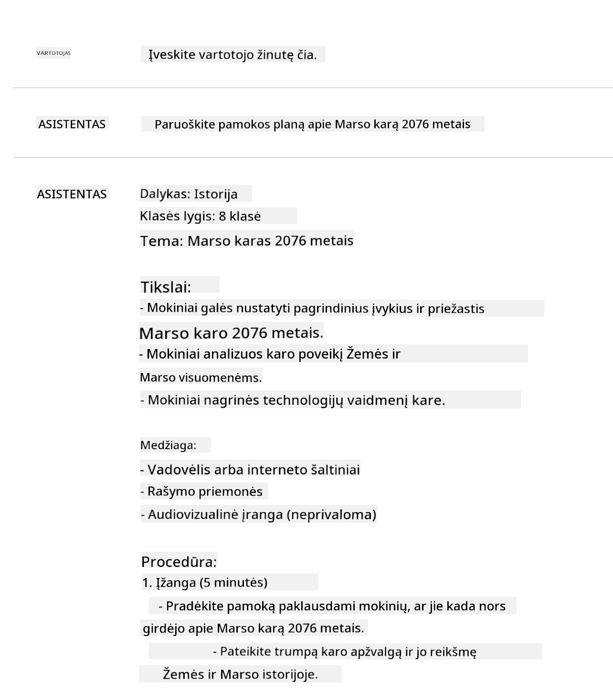
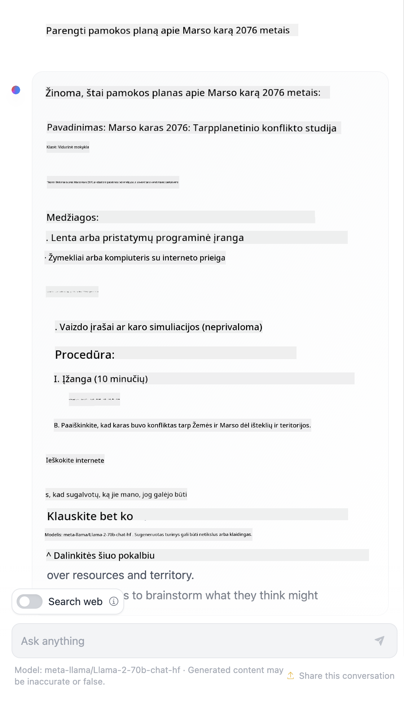

<!--
CO_OP_TRANSLATOR_METADATA:
{
  "original_hash": "0135e6c271f3ece8699050d4debbce88",
  "translation_date": "2025-10-18T02:31:42+00:00",
  "source_file": "04-prompt-engineering-fundamentals/README.md",
  "language_code": "lt"
}
-->
# Pagrindai apie užklausų kūrimą

[](https://youtu.be/GElCu2kUlRs?si=qrXsBvXnCW12epb8)

## Įvadas
Å iame modulyje aptariami esminiai konceptai ir technikos, kaip kurti efektyvias užklausas generatyviniams dirbtinio intelekto modeliams. Tai, kaip jÅ«s formuluojate savo užklausÄ… LLM (dideliam kalbos modeliui), yra labai svarbu. KruopÅ¡Äiai suformuluota užklausa gali užtikrinti geresnÄ™ atsakymo kokybÄ™. Bet kÄ… iÅ¡ tikrųjų reiÅ¡kia tokie terminai kaip _užklausa_ ir _užklausų kÅ«rimas_? Ir kaip galima patobulinti užklausos _įvestį_, kuriÄ… siunÄiate LLM? Tai yra klausimai, į kuriuos bandysime atsakyti Å¡iame ir kitame skyriuje.

_Generatyvinis dirbtinis intelektas_ gali kurti naujÄ… turinį (pvz., tekstÄ…, vaizdus, garsÄ…, kodÄ… ir kt.) reaguodamas į vartotojo užklausas. Tai pasiekiama naudojant _Didelius kalbos modelius_, tokius kaip OpenAI GPT (â€Generative Pre-trained Transformer“) serija, kurie yra apmokyti naudoti natÅ«raliÄ… kalbÄ… ir kodÄ….

Dabar vartotojai gali bendrauti su Å¡iais modeliais naudodami pažįstamus paradigmus, tokius kaip pokalbiai, nereikalaujant jokių techninių žinių ar mokymų. Modeliai yra _užklausų pagrindu sukurti_ – vartotojai siunÄia tekstinÄ™ užklausÄ… (prompt) ir gauna dirbtinio intelekto atsakymÄ… (completion). Jie gali â€kalbÄ—tis su dirbtiniu intelektu“ iteratyviai, daugiapakopiuose pokalbiuose, tobulindami savo užklausÄ…, kol atsakymas atitiks jų lÅ«kesÄius.

â€Užklausos“ dabar tampa pagrindine _programavimo sÄ…saja_ generatyviniams dirbtinio intelekto programoms, nurodant modeliams, kÄ… daryti, ir darant įtakÄ… grąžinamų atsakymų kokybei. â€Užklausų kÅ«rimas“ yra sparÄiai auganti studijų sritis, kuri orientuojasi į užklausų _dizainÄ… ir optimizavimÄ…_, siekiant užtikrinti nuoseklius ir kokybiÅ¡kus atsakymus dideliu mastu.

## Mokymosi tikslai

Å ioje pamokoje sužinosime, kas yra užklausų kÅ«rimas, kodÄ—l jis svarbus ir kaip galime kurti efektyvesnes užklausas konkreÄiam modeliui ir taikymo tikslui. Suprasime pagrindinius užklausų kÅ«rimo konceptus ir geriausias praktikas – ir sužinosime apie interaktyviÄ… Jupyter Notebooks â€smÄ—lio dėžės“ aplinkÄ…, kurioje galime pritaikyti Å¡iuos konceptus realiuose pavyzdžiuose.

Pamokos pabaigoje mes galÄ—sime:

1. Paaiškinti, kas yra užklausų kūrimas ir kodėl jis svarbus.
2. Apibūdinti užklausos komponentus ir kaip jie naudojami.
3. Išmokti geriausias praktikas ir technikas užklausų kūrimui.
4. Pritaikyti išmoktas technikas realiuose pavyzdžiuose, naudojant OpenAI sąsają.

## Pagrindiniai terminai

Užklausų kūrimas: Praktika, kai kuriamos ir tobulinamos įvestys, siekiant nukreipti dirbtinio intelekto modelius į norimus rezultatus.
Tokenizacija: Teksto pavertimo mažesniais vienetais, vadinamais tokenais, procesas, kurį modelis gali suprasti ir apdoroti.
Instrukcijomis pritaikyti LLM: Dideli kalbos modeliai (LLM), kurie buvo specialiai pritaikyti su konkreÄiomis instrukcijomis, siekiant pagerinti jų atsakymų tikslumÄ… ir aktualumÄ….

## Mokymosi smėlio dėžė

Užklausų kūrimas šiuo metu yra labiau menas nei mokslas. Geriausias būdas pagerinti savo intuiciją šioje srityje yra _praktikuotis daugiau_ ir taikyti bandymų ir klaidų metodą, kuris derina taikymo srities žinias su rekomenduojamomis technikomis ir modelio specifinėmis optimizacijomis.

Pamokai skirtas Jupyter Notebook suteikia _smėlio dėžės_ aplinką, kurioje galite išbandyti tai, ką išmokote – tiek pamokos metu, tiek kaip kodo iššūkio dalį pamokos pabaigoje. Norėdami vykdyti pratimus, jums reikės:

1. **Azure OpenAI API rakto** – paslaugos sąsajos, skirtos įdiegtam LLM.
2. **Python aplinkos** – kurioje galima vykdyti Notebook.
3. **Vietinių aplinkos kintamųjų** – _užbaikite [NUSTATYMO](./../00-course-setup/02-setup-local.md?WT.mc_id=academic-105485-koreyst) žingsnius dabar, kad pasiruoštumėte_.

Notebook turi _pradinių_ pratimų – taÄiau jÅ«s esate skatinami pridÄ—ti savo _Markdown_ (apraÅ¡ymo) ir _Code_ (užklausų) sekcijas, kad iÅ¡bandytumÄ—te daugiau pavyzdžių ar idÄ—jų – ir ugdytumÄ—te savo intuicijÄ… užklausų dizainui.

## Iliustruotas vadovas

Norite gauti bendrÄ… vaizdÄ… apie tai, kÄ… apima Å¡i pamoka, prieÅ¡ pradedant gilintis? PeržiÅ«rÄ—kite šį iliustruotÄ… vadovÄ…, kuris suteikia supratimÄ… apie pagrindines aptariamas temas ir svarbiausius dalykus, kuriuos verta apmÄ…styti kiekvienoje iÅ¡ jų. Pamokos planas veda jus nuo pagrindinių konceptų ir iÅ¡Å¡Å«kių supratimo iki jų sprendimo, taikant atitinkamas užklausų kÅ«rimo technikas ir geriausias praktikas. Atkreipkite dÄ—mesį, kad â€Pažangių technikų“ skyrius Å¡iame vadove nurodo turinį, aptariamÄ… _kitame_ Å¡ios mokymo programos skyriuje.


## Mūsų startuolis

Dabar pakalbÄ—kime apie tai, kaip _Å¡i tema_ susijusi su mÅ«sų startuolio misija [įneÅ¡ti dirbtinio intelekto inovacijas į Å¡vietimÄ…](https://educationblog.microsoft.com/2023/06/collaborating-to-bring-ai-innovation-to-education?WT.mc_id=academic-105485-koreyst). Mes norime kurti dirbtinio intelekto pagrindu veikianÄias _personalizuoto mokymosi_ programas – tad pagalvokime, kaip skirtingi mÅ«sų programos vartotojai galÄ—tų â€kurti“ užklausas:

- **Administratoriai** galėtų paprašyti dirbtinio intelekto _analizuoti mokymo programos duomenis, kad būtų nustatytos spragos aprėptyje_. Dirbtinis intelektas galėtų apibendrinti rezultatus arba vizualizuoti juos naudodamas kodą.
- **Mokytojai** galėtų paprašyti dirbtinio intelekto _sukurti pamokos planą tam tikrai auditorijai ir temai_. Dirbtinis intelektas galėtų sukurti personalizuotą planą nurodytu formatu.
- **Mokiniai** galėtų paprašyti dirbtinio intelekto _padėti jiems mokytis sunkios temos_. Dirbtinis intelektas galėtų vesti mokinius per pamokas, pateikti užuominas ir pavyzdžius, pritaikytus jų lygiui.

Tai tik ledkalnio viršūnė. Peržiūrėkite [Užklausos švietimui](https://github.com/microsoft/prompts-for-edu/tree/main?WT.mc_id=academic-105485-koreyst) – atvirą šaltinio užklausų biblioteką, kurią sudarė švietimo ekspertai – kad gautumėte platesnį galimybių vaizdą! _Pabandykite paleisti kai kurias iš tų užklausų smėlio dėžėje arba naudodami OpenAI Playground ir pažiūrėkite, kas nutiks!_

## Kas yra užklausų kūrimas?

PamokÄ… pradÄ—jome apibrėždami **Užklausų kÅ«rimÄ…** kaip procesÄ…, kurio metu _kuriamos ir optimizuojamos_ tekstinÄ—s įvestys (užklausos), siekiant užtikrinti nuoseklius ir kokybiÅ¡kus atsakymus (užbaigimus) konkreÄiam taikymo tikslui ir modeliui. Galime tai laikyti dviejų etapų procesu:

- _kuriant_ pradinÄ™ užklausÄ… konkreÄiam modeliui ir tikslui
- _tobulinant_ užklausą iteratyviai, siekiant pagerinti atsakymo kokybę

Tai neišvengiamai yra bandymų ir klaidų procesas, kuris reikalauja vartotojo intuicijos ir pastangų, kad būtų pasiekti optimalūs rezultatai. Kodėl tai svarbu? Norėdami atsakyti į šį klausimą, pirmiausia turime suprasti tris konceptus:

- _Tokenizacija_ = kaip modelis â€mato“ užklausÄ…
- _Bazinis LLM_ = kaip pagrindinis modelis â€apdoroja“ užklausÄ…
- _Instrukcijomis pritaikyti LLM_ = kaip modelis dabar mato â€užduotis“

### Tokenizacija

LLM mato užklausas kaip _tokenų sekÄ…_, kur skirtingi modeliai (arba modelio versijos) gali skirtingai suskaidyti tÄ… paÄiÄ… užklausÄ…. Kadangi LLM yra apmokyti su tokenais (o ne su neapdorotu tekstu), bÅ«das, kuriuo užklausos yra suskaidomos į tokenus, tiesiogiai veikia generuojamo atsakymo kokybÄ™.

NorÄ—dami geriau suprasti, kaip veikia tokenizacija, iÅ¡bandykite tokias priemones kaip [OpenAI Tokenizer](https://platform.openai.com/tokenizer?WT.mc_id=academic-105485-koreyst), parodytÄ… žemiau. Nukopijuokite savo užklausÄ… – ir pažiÅ«rÄ—kite, kaip ji paverÄiama į tokenus, atkreipdami dÄ—mesį į tai, kaip tvarkomi tarpai ir skyrybos ženklai. Atkreipkite dÄ—mesį, kad Å¡is pavyzdys rodo senesnį LLM (GPT-3) – todÄ—l bandymas su naujesniu modeliu gali duoti kitokį rezultatÄ….


### Konceptas: Pagrindiniai modeliai

Kai užklausa yra suskaidyta į tokenus, pagrindinÄ— ["Bazinio LLM"](https://blog.gopenai.com/an-introduction-to-base-and-instruction-tuned-large-language-models-8de102c785a6?WT.mc_id=academic-105485-koreyst) (arba Pagrindinio modelio) funkcija yra numatyti tokenÄ… toje sekoje. Kadangi LLM yra apmokyti su didžiuliais tekstų duomenų rinkiniais, jie gerai supranta statistinius ryÅ¡ius tarp tokenų ir gali atlikti Å¡iÄ… prognozÄ™ su tam tikru pasitikÄ—jimu. Atkreipkite dÄ—mesį, kad jie nesupranta _žodžių prasmÄ—s_ užklausoje ar tokene; jie tiesiog mato modelį, kurį gali â€užbaigti“ savo kita prognoze. Jie gali tÄ™sti sekos prognozavimÄ…, kol vartotojas nutrauks arba bus pasiektos iÅ¡ anksto nustatytos sÄ…lygos.

Norite pamatyti, kaip veikia užklausų pagrindu sukurtas užbaigimas? Ä®veskite aukÅ¡Äiau pateiktÄ… užklausÄ… į Azure OpenAI Studio [_Chat Playground_](https://oai.azure.com/playground?WT.mc_id=academic-105485-koreyst) su numatytaisiais nustatymais. Sistema sukonfigÅ«ruota traktuoti užklausas kaip informacijos praÅ¡ymus – todÄ—l turÄ—tumÄ—te pamatyti užbaigimÄ…, kuris atitinka šį kontekstÄ….

Bet kas, jei vartotojas norėtų pamatyti kažką konkretaus, kas atitiktų tam tikrus kriterijus ar užduoties tikslą? Čia į pagalbą ateina _instrukcijomis pritaikyti_ LLM.


### Konceptas: Instrukcijomis pritaikyti LLM

[Instrukcijomis pritaikytas LLM](https://blog.gopenai.com/an-introduction-to-base-and-instruction-tuned-large-language-models-8de102c785a6?WT.mc_id=academic-105485-koreyst) prasideda nuo pagrindinio modelio ir yra pritaikytas naudojant pavyzdžius arba įvesties/iÅ¡vesties poras (pvz., daugiapakopius â€praneÅ¡imus“), kurie gali turÄ—ti aiÅ¡kias instrukcijas – ir atsakymas iÅ¡ dirbtinio intelekto bando laikytis tų instrukcijų.

Tai naudoja tokias technikas kaip stiprinamasis mokymasis su žmogaus grįžtamuoju ryšiu (RLHF), kuris gali apmokyti modelį _laikytis instrukcijų_ ir _mokytis iš grįžtamojo ryšio_, kad jis generuotų atsakymus, kurie yra labiau pritaikyti praktiniams taikymams ir labiau atitinka vartotojo tikslus.

Pabandykime – peržiÅ«rÄ—kite aukÅ¡Äiau pateiktÄ… užklausÄ…, taÄiau dabar pakeiskite _sistemos praneÅ¡imÄ…_, kad pateiktumÄ—te Å¡iÄ… instrukcijÄ… kaip kontekstÄ…:

> _Apibendrinkite pateiktą turinį antros klasės mokiniui. Rezultatas turėtų būti vienas paragrafas su 3–5 punktų sąrašu._

Pažiūrėkite, kaip rezultatas dabar pritaikytas atspindėti norimą tikslą ir formatą? Mokytojas dabar gali tiesiogiai naudoti šį atsakymą savo klasės skaidrėse.


## Kodėl mums reikia užklausų kūrimo?

Dabar, kai žinome, kaip užklausos yra apdorojamos LLM, pakalbėkime apie _kodėl_ mums reikia užklausų kūrimo. Atsakymas slypi tame, kad dabartiniai LLM kelia daugybę iššūkių, dėl kurių _patikimi ir nuoseklūs užbaigimai_ tampa sunkiau pasiekiami, jei neįdedama pastangų į užklausų konstravimą ir optimizavimą. Pavyzdžiui:

1. **Modelio atsakymai yra stochastiÅ¡ki.** _Ta pati užklausa_ greiÄiausiai duos skirtingus atsakymus su skirtingais modeliais ar modelio versijomis. Ir ji gali netgi duoti skirtingus rezultatus su _tuo paÄiu modeliu_ skirtingu metu. _Užklausų kÅ«rimo technikos gali padÄ—ti mums sumažinti Å¡iuos skirtumus, suteikiant geresnes apsaugos priemones_.

1. **Modeliai gali kurti netikrus atsakymus.** Modeliai yra iÅ¡ anksto apmokyti su _dideliais, bet ribotais_ duomenų rinkiniais, o tai reiÅ¡kia, kad jie neturi žinių apie konceptus, esanÄius už Å¡io mokymo ribų. DÄ—l to jie gali generuoti užbaigimus, kurie yra netikslÅ«s, iÅ¡galvoti arba tiesiogiai prieÅ¡tarauja žinomiems faktams. _Užklausų kÅ«rimo technikos padeda vartotojams identifikuoti ir sumažinti tokius iÅ¡galvojimus, pvz., praÅ¡ant dirbtinio intelekto pateikti citatas ar argumentus_.

1. **Modelių galimybÄ—s skiriasi.** Naujesni modeliai ar modelių kartos turÄ—s turtingesnes galimybes, taÄiau taip pat atneÅ¡ unikalių keistenybių ir kompromisų dÄ—l kainos ir sudÄ—tingumo. _Užklausų kÅ«rimas gali padÄ—ti mums sukurti geriausias praktikas ir darbo eigas, kurios abstra
Interneto paieÅ¡ka parodÄ—, kad yra iÅ¡galvotų pasakojimų (pvz., televizijos serialų ar knygų) apie Marso karus, taÄiau nÄ— vieno apie 2076 metus. Sveikas protas taip pat sako, kad 2076 metai yra _ateityje_ ir todÄ—l negali bÅ«ti susijÄ™ su realiu įvykiu.

Taigi, kas nutinka, kai šį užklausą pateikiame skirtingiems LLM tiekėjams?

> **Atsakymas 1**: OpenAI Playground (GPT-35)



> **Atsakymas 2**: Azure OpenAI Playground (GPT-35)


> **Atsakymas 3**: Hugging Face Chat Playground (LLama-2)



Kaip ir tikÄ—tasi, kiekvienas modelis (arba modelio versija) pateikia Å¡iek tiek skirtingus atsakymus dÄ—l stochastinio elgesio ir modelio galimybių skirtumų. Pavyzdžiui, vienas modelis orientuojasi į 8 klasÄ—s auditorijÄ…, o kitas - į vidurinÄ—s mokyklos mokinius. TaÄiau visi trys modeliai pateikÄ— atsakymus, kurie galÄ—tų įtikinti neinformuotÄ… vartotojÄ…, kad įvykis buvo tikras.

Užklausų kūrimo technikos, tokios kaip _metaužklausos_ ir _temperatūros konfigūravimas_, gali tam tikru mastu sumažinti modelio klaidas. Naujos užklausų kūrimo _architektūros_ taip pat sklandžiai integruoja naujus įrankius ir technikas į užklausų srautą, kad sumažintų kai kuriuos šiuos efektus.

## Atvejo analizÄ—: GitHub Copilot

Užbaikime šią dalį, susipažindami su tuo, kaip užklausų kūrimas naudojamas realiame pasaulyje, pažvelgdami į vieną atvejo analizę: [GitHub Copilot](https://github.com/features/copilot?WT.mc_id=academic-105485-koreyst).

GitHub Copilot yra jÅ«sų â€AI porinis programuotojas“ – jis paverÄia tekstines užklausas kodų užbaigimais ir yra integruotas į jÅ«sų kÅ«rimo aplinkÄ… (pvz., Visual Studio Code), kad užtikrintų sklandžiÄ… vartotojo patirtį. Kaip dokumentuota žemiau pateiktuose tinklaraÅ¡Äiuose, ankstyviausia versija buvo pagrįsta OpenAI Codex modeliu – inžinieriai greitai suprato poreikį patobulinti modelį ir sukurti geresnes užklausų kÅ«rimo technikas, kad pagerintų kodo kokybÄ™. LiepÄ… jie [pristatÄ— patobulintÄ… AI modelį, kuris pranoksta Codex](https://github.blog/2023-07-28-smarter-more-efficient-coding-github-copilot-goes-beyond-codex-with-improved-ai-model/?WT.mc_id=academic-105485-koreyst) ir siÅ«lo dar greitesnius pasiÅ«lymus.

Skaitykite įrašus iš eilės, kad galėtumėte sekti jų mokymosi kelionę.

- **2023 m. gegužė** | [GitHub Copilot tampa geresnis suprantant jūsų kodą](https://github.blog/2023-05-17-how-github-copilot-is-getting-better-at-understanding-your-code/?WT.mc_id=academic-105485-koreyst)
- **2023 m. gegužė** | [GitHub viduje: darbas su LLM, esanÄiais už GitHub Copilot](https://github.blog/2023-05-17-inside-github-working-with-the-llms-behind-github-copilot/?WT.mc_id=academic-105485-koreyst).
- **2023 m. birželis** | [Kaip rašyti geresnes užklausas GitHub Copilot](https://github.blog/2023-06-20-how-to-write-better-prompts-for-github-copilot/?WT.mc_id=academic-105485-koreyst).
- **2023 m. liepa** | [.. GitHub Copilot pranoksta Codex su patobulintu AI modeliu](https://github.blog/2023-07-28-smarter-more-efficient-coding-github-copilot-goes-beyond-codex-with-improved-ai-model/?WT.mc_id=academic-105485-koreyst)
- **2023 m. liepa** | [Programuotojo vadovas apie užklausų kūrimą ir LLM](https://github.blog/2023-07-17-prompt-engineering-guide-generative-ai-llms/?WT.mc_id=academic-105485-koreyst)
- **2023 m. rugsėjis** | [Kaip sukurti įmonės LLM programą: pamokos iš GitHub Copilot](https://github.blog/2023-09-06-how-to-build-an-enterprise-llm-application-lessons-from-github-copilot/?WT.mc_id=academic-105485-koreyst)

Taip pat galite naršyti jų [inžinerijos tinklaraštį](https://github.blog/category/engineering/?WT.mc_id=academic-105485-koreyst), kad rastumėte daugiau įrašų, tokių kaip [šis](https://github.blog/2023-09-27-how-i-used-github-copilot-chat-to-build-a-reactjs-gallery-prototype/?WT.mc_id=academic-105485-koreyst), kuris parodo, kaip šie modeliai ir technikos yra _taikomi_ realioms programoms kurti.

---

## Užklausų kūrimas

Jau supratome, kodėl užklausų kūrimas yra svarbus – dabar išsiaiškinkime, kaip užklausos yra _kuriamos_, kad galėtume įvertinti skirtingas technikas efektyvesniam užklausų dizainui.

### Pagrindinė užklausa

PradÄ—kime nuo pagrindinÄ—s užklausos: teksto įvesties, siunÄiamos modeliui be jokio papildomo konteksto. Å tai pavyzdys – kai OpenAI [Completion API](https://platform.openai.com/docs/api-reference/completions?WT.mc_id=academic-105485-koreyst) siunÄiame pirmuosius JAV nacionalinio himno žodžius, jis iÅ¡ karto _papildo_ atsakymÄ… kitomis eilutÄ—mis, iliustruodamas pagrindinį prognozavimo elgesį.

| Užklausa (Įvestis) | Papildymas (Išvestis)                                                                                                                        |
| :----------------- | :----------------------------------------------------------------------------------------------------------------------------------------- |
| Oh say can you see | Atrodo, kad pradedate dainuoti â€The Star-Spangled Banner“, Jungtinių Valstijų nacionalinį himnÄ…. Pilnas tekstas yra ...                     |

### Sudėtinga užklausa

Dabar pridÄ—kime kontekstÄ… ir instrukcijas prie pagrindinÄ—s užklausos. [Chat Completion API](https://learn.microsoft.com/azure/ai-services/openai/how-to/chatgpt?WT.mc_id=academic-105485-koreyst) leidžia mums sukurti sudÄ—tingÄ… užklausÄ… kaip _žinuÄių_ rinkinį su:

- Ä®vesties/iÅ¡vesties poromis, atspindinÄiomis _vartotojo_ įvestį ir _asistento_ atsakymÄ….
- Sistemos žinute, nustatanÄia asistento elgesio ar asmenybÄ—s kontekstÄ….

Užklausa dabar pateikiama žemiau nurodyta forma, kur _tokenizacija_ efektyviai užfiksuoja svarbią informaciją iš konteksto ir pokalbio. Dabar sistemos konteksto pakeitimas gali turėti tokį patį poveikį atsakymų kokybei, kaip ir pateiktos vartotojo įvestys.

```python
response = openai.chat.completions.create(
    model="gpt-3.5-turbo",
    messages=[
        {"role": "system", "content": "You are a helpful assistant."},
        {"role": "user", "content": "Who won the world series in 2020?"},
        {"role": "assistant", "content": "The Los Angeles Dodgers won the World Series in 2020."},
        {"role": "user", "content": "Where was it played?"}
    ]
)
```

### Instrukcijos užklausa

Ankstesniuose pavyzdžiuose vartotojo užklausa buvo paprastas tekstinis klausimas, kurį galima interpretuoti kaip informacijos užklausą. Naudojant _instrukcijų_ užklausas, galime naudoti tekstą, kad išsamiau nurodytume užduotį, suteikdami AI geresnes gaires. Štai pavyzdys:

| Užklausa (Įvestis)                                                                                                                                                                                                                         | Papildymas (Išvestis)                                                                                                        | Instrukcijos tipas  |
| :------------------------------------------------------------------------------------------------------------------------------------------------------------------------------------------------------------------------------------- | :------------------------------------------------------------------------------------------------------------------------- | :------------------ |
| Parašykite aprašymą apie Pilietinį karą                                                                                                                                                                                                   | _grąžino paprastą pastraipą_                                                                                              | Paprasta            |
| Parašykite aprašymą apie Pilietinį karą. Pateikite pagrindines datas ir įvykius bei apibūdinkite jų reikšmę                                                                                                                                     | _grąžino pastraipą, po kurios pateiktas pagrindinių įvykių datų sąrašas su aprašymais_                                             | Sudėtinga           |
| Parašykite aprašymą apie Pilietinį karą vienoje pastraipoje. Pateikite 3 punktus su pagrindinėmis datomis ir jų reikšme. Pateikite dar 3 punktus su pagrindiniais istoriniais veikėjais ir jų indėliu. Grąžinkite išvestį JSON failo formatu | _grąžino išsamesnę informaciją teksto laukelyje, suformatuotą kaip JSON, kurį galima nukopijuoti ir įklijuoti į failą bei patikrinti_ | Sudėtinga. Su formatu. |

## Pagrindinis turinys

Ankstesniuose pavyzdžiuose užklausa vis dar buvo gana atvira, leidžianti LLM nuspręsti, kuri jo iš anksto apmokyto duomenų rinkinio dalis yra svarbi. Naudojant _pagrindinio turinio_ dizaino modelį, įvesties tekstas yra padalintas į dvi dalis:

- instrukcija (veiksmas)
- svarbus turinys (kuris daro įtaką veiksmui)

Å tai pavyzdys, kur instrukcija yra â€sutrumpinkite tai į 2 sakinius“.

| Užklausa (Įvestis)                                                                                                                                                                                                                                                                                                                                                                                                                                                                                                                                                                                                                                                                                      | Papildymas (Išvestis)                                                                                                                                                                                                                                                                             |
| :-------------------------------------------------------------------------------------------------------------------------------------------------------------------------------------------------------------------------------------------------------------------------------------------------------------------------------------------------------------------------------------------------------------------------------------------------------------------------------------------------------------------------------------------------------------------------------------------------------------------------------------------------------------------------------------------------- | :---------------------------------------------------------------------------------------------------------------------------------------------------------------------------------------------------------------------------------------------------------------------------------------------- |
| Jupiteris yra penkta planeta nuo SaulÄ—s ir didžiausia SaulÄ—s sistemoje. Tai dujų milžinas, kurio masÄ— yra tÅ«kstantÄ…ja SaulÄ—s masÄ—s dalimi, taÄiau du su puse karto didesnÄ— už visų kitų planetų masÄ™ kartu sudÄ—jus. Jupiteris yra vienas ryÅ¡kiausių objektų, matomų plika akimi naktiniame danguje, ir buvo žinomas senovÄ—s civilizacijoms dar prieÅ¡ užfiksuojant istorijÄ…. Jis pavadintas Romos dievo Jupiterio vardu.[19] ŽiÅ«rint iÅ¡ ŽemÄ—s, Jupiteris gali bÅ«ti pakankamai ryÅ¡kus, kad jo atspindÄ—ta Å¡viesa mestų matomus Å¡eÅ¡Ä—lius,[20] ir vidutiniÅ¡kai yra treÄias ryÅ¡kiausias natÅ«ralus objektas naktiniame danguje po MÄ—nulio ir Veneros. <br/> **Sutrumpinkite tai į 2 trumpus sakinius** | Jupiteris, penkta planeta nuo SaulÄ—s, yra didžiausia SaulÄ—s sistemoje ir žinoma kaip vienas ryÅ¡kiausių objektų naktiniame danguje. Pavadintas Romos dievo Jupiterio vardu, tai dujų milžinas, kurio masÄ— yra du su puse karto didesnÄ— už visų kitų planetų masÄ™ kartu sudÄ—jus. |

Pagrindinio turinio segmentą galima naudoti įvairiais būdais, siekiant efektyvesnių instrukcijų:

- **Pavyzdžiai** - vietoj to, kad modelį nurodytume aiÅ¡kia instrukcija, pateikiame jam pavyzdžių, kÄ… daryti, ir leidžiame jam paÄiam suprasti modelį.
- **Užuominos** - po instrukcijos pateikiame â€užuominą“, kuri nukreipia modelį link tinkamesnių atsakymų.
- **Å ablonai** - tai pakartojami â€receptai“ užklausoms su vietos rezervavimo ženklais (kintamaisiais), kuriuos galima pritaikyti konkretiems naudojimo atvejams.

Pažvelkime, kaip tai veikia praktikoje.

### Naudojant pavyzdžius

Tai metodas, kai naudojate pagrindinį turinį, kad â€pamaitintumÄ—te modelį“ keliais norimos iÅ¡vesties pavyzdžiais pagal pateiktÄ… instrukcijÄ… ir leistumÄ—te jam paÄiam suprasti norimÄ… iÅ¡vesties modelį. Atsižvelgiant į pateiktų pavyzdžių skaiÄių, galime turÄ—ti užklausas be pavyzdžių, su vienu pavyzdžiu, su keliais pavyzdžiais ir pan.

Užklausa dabar susideda iš trijų komponentų:

- Užduoties aprašymo
- Kelių norimos išvesties pavyzdžių
- Naujo pavyzdžio pradžios (kuris tampa netiesioginiu užduoties aprašymu)

| Mokymosi tipas | Užklausa (Įvestis)                                                                                                                                        | Papildymas (Išvestis)         |
| :------------ | :---------------------------------------------------------------------------------------------------------------------------------------------------- | :-------------------------- |
| Be pavyzdžių  | â€The Sun is Shining“. IÅ¡verskite į ispanų kalbÄ…                                                                                                            | â€El Sol está brillando“.    |
| Su vienu pavyzdžiu | â€The Sun is Shining“ => â€El Sol está brillando“. <br> â€It's a Cold and Windy Day“ =>                                                                 | â€Es un día frío y ventoso“. |
| Su keliais pavyzdžiais | Žaidėjas bėgo bazėmis => Beisbolas <br/> Žaidėjas pataikė ace => Tenisas <br/> Žaidėjas pataikė šešis => Kriketas <br/> Žaidėjas atliko slam-dunk => | Krepšinis                  |
|               |                                                                                                                                                       |                             |

Atkreipkite dÄ—mesį, kaip turÄ—jome pateikti aiÅ¡kiÄ… instrukcijÄ… (â€IÅ¡verskite į ispanų kalbą“) užklausose be pavyzdžių, taÄiau ji tampa suprantama užklausose su vienu pavyzdžiu. Pavyzdys su keliais pavyzdžiais rodo, kaip pridÄ—jus daugiau pavyzdžių modeliai gali tiksliau suprasti be papildomų instrukcijų.

### Užklausų užuominos

Kitas pagrindinio turinio naudojimo bÅ«das yra pateikti _užuominas_, o ne pavyzdžius. Å iuo atveju mes suteikiame modeliui postÅ«mį tinkama kryptimi, _pradÄ—dami_ nuo fragmento, kuris atspindi norimÄ… atsakymo formatÄ…. Tada modelis â€pagauna užuominą“ ir tÄ™sia tuo paÄiu stiliumi.

| Užuominų skaiÄius | Užklausa (Ä®vestis)                                                                                                                                                                                                                                                                                                                                                                                                                                               | Papildymas (IÅ¡vestis)                                                                                                                                                                                                                                                                                       |
| :------------- | :----------------------------------------------------------------------------------------------------------------------------------------------------------------------------------------------------------------------------------------------------------------------------------------------------------------------------------------------------------------------------------------------------------------------------------------------------------- | :-------------------------------------------------------------------------------------------------------------------------------------------------------------------------------------------------------------------------------------------------------------------------------------------------------- |
| 0              | Jupiteris yra penkta planeta nuo SaulÄ—s ir didžiausia SaulÄ—s sistemoje. Tai dujų milžinas, kurio masÄ— yra tÅ«kstantÄ…ja SaulÄ—s masÄ—s dalimi, taÄiau du su puse karto didesnÄ— už visų kitų planetų masÄ™ kartu sudÄ—jus. Jupiteris yra vienas ryÅ¡kiausių objektų, matomų plika akimi naktiniame danguje, ir buvo žinomas senovÄ—s civilizacijoms dar prieÅ¡ užfiksuojant istorijÄ…. <br/>**Sutrumpinkite Tai**                                       | Jupiteris yra didžiausia planeta mÅ«sų SaulÄ—s sistemoje ir penkta nuo SaulÄ—s. Tai dujų milžinas, kurio masÄ— yra 1/1000 SaulÄ—s masÄ—s, taÄiau jis sunkesnis už visas kitas planetas kartu sudÄ—jus. SenovÄ—s civilizacijos jau seniai žinojo apie Jupiterį, ir jis lengvai matomas naktiniame danguje. |
| 1              | Jupiteris yra penkta planeta nuo SaulÄ—s ir didžiausia SaulÄ—s sistemoje. Tai dujų milžinas, kurio masÄ— yra tÅ«kstantÄ…ja SaulÄ—s masÄ—s dalimi, taÄiau du su puse karto didesnÄ— už visų kitų SaulÄ—s sistemos planetų masÄ™ kartu sudÄ—jus. Jupiteris yra vienas ryÅ¡kiausių objektų, matomų plika akimi naktiniame danguje, ir buvo žinomas senovÄ—s civilizacijoms dar prieÅ¡ užraÅ¡ytÄ… istorijÄ…. <br/>**Santrauka** <br/> Sužinojome, kad Jupiteris | yra penkta planeta nuo SaulÄ—s ir didžiausia SaulÄ—s sistemoje. Tai dujų milžinas, kurio masÄ— yra tÅ«kstantÄ…ja SaulÄ—s masÄ—s dalimi, taÄiau du su puse karto didesnÄ— už visų kitų planetų masÄ™ kartu sudÄ—jus. Jis lengvai matomas plika akimi ir buvo žinomas nuo senovÄ—s laikų.                        |
| 2              | Jupiteris yra penkta planeta nuo SaulÄ—s ir didžiausia SaulÄ—s sistemoje. Tai dujų milžinas, kurio masÄ— yra tÅ«kstantÄ…ja SaulÄ—s masÄ—s dalimi, taÄiau du su puse karto didesnÄ— už visų kitų SaulÄ—s sistemos planetų masÄ™ kartu sudÄ—jus. Jupiteris yra vienas ryÅ¡kiausių objektų, matomų plika akimi naktiniame danguje, ir buvo žinomas senovÄ—s civilizacijoms dar prieÅ¡ užraÅ¡ytÄ… istorijÄ…. <br/>**Santrauka** <br/> 3 pagrindiniai faktai, kuriuos sužinojome:         | 1. Jupiteris yra penkta planeta nuo SaulÄ—s ir didžiausia SaulÄ—s sistemoje. <br/> 2. Tai dujų milžinas, kurio masÄ— yra tÅ«kstantÄ…ja SaulÄ—s masÄ—s dalimi...<br/> 3. Jupiteris buvo matomas plika akimi nuo senovÄ—s laikų ...                                                                       |
|                |                                                                                                                                                                                                                                                                                                                                                                                                                                                              |                                                                                                                                                                                                                                                                                                           |

### Šablonai užduotims

Å ablonas užduotims yra _iÅ¡ anksto apibrėžtas Å¡ablonas_, kurį galima iÅ¡saugoti ir naudoti pagal poreikį, siekiant užtikrinti nuoseklesnÄ™ vartotojo patirtį dideliu mastu. PaprasÄiausia forma tai yra tiesiog rinkinys pavyzdžių, kaip [Å¡is iÅ¡ OpenAI](https://platform.openai.com/examples?WT.mc_id=academic-105485-koreyst), kuris pateikia tiek interaktyvius užduoties komponentus (vartotojo ir sistemos praneÅ¡imus), tiek API valdomÄ… užklausos formatÄ… - kad bÅ«tų galima pakartotinai naudoti.

SudÄ—tingesnÄ—je formoje, kaip [Å¡is pavyzdys iÅ¡ LangChain](https://python.langchain.com/docs/concepts/prompt_templates/?WT.mc_id=academic-105485-koreyst), jis turi _vietos rezervavimo ženklus_, kuriuos galima pakeisti duomenimis iÅ¡ įvairių Å¡altinių (vartotojo įvestis, sistemos kontekstas, iÅ¡oriniai duomenų Å¡altiniai ir kt.), kad bÅ«tų galima dinamiÅ¡kai generuoti užduotį. Tai leidžia sukurti pakartotinai naudojamų užduoÄių bibliotekÄ…, kuri gali bÅ«ti naudojama nuosekliai vartotojo patirÄiai **programiÅ¡kai** užtikrinti dideliu mastu.

Galiausiai, tikroji Å¡ablonų vertÄ— slypi galimybÄ—je kurti ir publikuoti _užduoÄių bibliotekas_ tam tikroms taikymo sritims - kur užduoties Å¡ablonas yra _optimizuotas_ atspindÄ—ti taikymo srities kontekstÄ… ar pavyzdžius, kurie daro atsakymus labiau aktualius ir tikslius tikslinÄ—s auditorijos atžvilgiu. [Prompts For Edu](https://github.com/microsoft/prompts-for-edu?WT.mc_id=academic-105485-koreyst) saugykla yra puikus Å¡io požiÅ«rio pavyzdys, kurioje kaupiama užduoÄių biblioteka Å¡vietimo sriÄiai, akcentuojant pagrindinius tikslus, tokius kaip pamokų planavimas, mokymo programų kÅ«rimas, mokinių konsultavimas ir kt.

## Papildoma informacija

Jei galvojame apie užduoties kÅ«rimÄ… kaip apie instrukcijos (užduoties) ir tikslo (pagrindinio turinio) turÄ—jimÄ…, tada _antrinis turinys_ yra kaip papildomas kontekstas, kurį pateikiame, kad **kažkaip paveiktume rezultatÄ…**. Tai gali bÅ«ti parametrų derinimas, formatavimo instrukcijos, temų taksonomijos ir kt., kurie gali padÄ—ti modeliui _pritaikyti_ savo atsakymÄ… pagal norimus vartotojo tikslus ar lÅ«kesÄius.

Pavyzdžiui: Turint kursų katalogą su išsamiais metaduomenimis (pavadinimas, aprašymas, lygis, metaduomenų žymos, dėstytojas ir kt.) apie visus mokymo programos kursus:

- galime apibrėžti instrukcijÄ… â€sutrumpinkite 2023 m. rudens semestro kursų katalogą“
- galime naudoti pagrindinį turinį, kad pateiktume keletą norimo rezultato pavyzdžių
- galime naudoti antrinį turinį, kad identifikuotume 5 svarbiausias â€Å¾ymas“.

Dabar modelis gali pateikti santraukÄ… formatu, parodytu keliuose pavyzdžiuose, taÄiau jei rezultatas turi kelias žymas, jis gali teikti pirmenybÄ™ 5 žymoms, nurodytoms antriniame turinyje.

---

<!--
PAMOKOS Å ABLONAS:
Ši dalis turėtų apimti pagrindinę sąvoką #1.
Sustiprinkite sąvoką su pavyzdžiais ir nuorodomis.

SÄ„VOKA #3:
UžduoÄių kÅ«rimo technikos.
Kokios yra pagrindinÄ—s užduoÄių kÅ«rimo technikos?
Iliustruokite tai pratimais.
-->

## Geriausios užduoÄių kÅ«rimo praktikos

Dabar, kai žinome, kaip užduotys gali būti _kuriamos_, galime pradėti galvoti, kaip jas _projektuoti_, kad jos atspindėtų geriausias praktikas. Galime tai suskirstyti į dvi dalis - turėti tinkamą _mąstyseną_ ir taikyti tinkamas _technikas_.

### UžduoÄių kÅ«rimo mÄ…stysena

UžduoÄių kÅ«rimas yra bandymų ir klaidų procesas, todÄ—l atsiminkite tris pagrindinius veiksnius:

1. **Domeno supratimas yra svarbus.** Atsakymo tikslumas ir aktualumas priklauso nuo _domeno_, kuriame veikia taikymas ar vartotojas. Naudokite savo intuiciją ir domeno žinias, kad **pritaikytumėte technikas**. Pavyzdžiui, apibrėžkite _domenui specifines asmenybes_ savo sistemos užduotyse arba naudokite _domenui specifinius šablonus_ vartotojo užduotyse. Pateikite antrinį turinį, kuris atspindi domenui specifinius kontekstus, arba naudokite _domenui specifinius užuominas ir pavyzdžius_, kad nukreiptumėte modelį link pažįstamų naudojimo modelių.

2. **Modelio supratimas yra svarbus.** Žinome, kad modeliai yra stochastiÅ¡ki. TaÄiau modelių įgyvendinimas taip pat gali skirtis pagal naudojamÄ… mokymo duomenų rinkinį (iÅ¡ anksto iÅ¡moktas žinias), teikiamas galimybes (pvz., per API ar SDK) ir turinio tipÄ…, kuriam jie yra optimizuoti (pvz., kodas, vaizdai ar tekstas). Supraskite modelio, kurį naudojate, stipriÄ…sias ir silpnÄ…sias puses ir naudokite Å¡ias žinias, kad _prioritetizuotumÄ—te užduotis_ arba sukurtumÄ—te _pritaikytus Å¡ablonus_, optimizuotus modelio galimybÄ—ms.

3. **Iteracija ir validacija yra svarbios.** Modeliai greitai tobulÄ—ja, kaip ir užduoÄių kÅ«rimo technikos. Kaip domeno ekspertas, galite turÄ—ti kitÄ… kontekstÄ… ar kriterijus, kurie yra svarbÅ«s _jÅ«sų_ specifinei taikymo sriÄiai, bet gali bÅ«ti netaikomi platesnei bendruomenei. Naudokite užduoÄių kÅ«rimo įrankius ir technikas, kad â€pradÄ—tumÄ—te“ užduoÄių kÅ«rimÄ…, tada iteruokite ir validuokite rezultatus naudodamiesi savo intuicija ir domeno žiniomis. Užfiksuokite savo įžvalgas ir sukurkite **žinių bazÄ™** (pvz., užduoÄių bibliotekas), kuriÄ… kiti galÄ—tų naudoti kaip naujÄ… pagrindÄ… greitesnÄ—ms iteracijoms ateityje.

## Geriausios praktikos

Dabar pažvelkime į bendras geriausias praktikas, kurias rekomenduoja [OpenAI](https://help.openai.com/en/articles/6654000-best-practices-for-prompt-engineering-with-openai-api?WT.mc_id=academic-105485-koreyst) ir [Azure OpenAI](https://learn.microsoft.com/azure/ai-services/openai/concepts/prompt-engineering#best-practices?WT.mc_id=academic-105485-koreyst) specialistai.

| Kas                               | KodÄ—l                                                                                                                                                                                                                                               |
| :-------------------------------- | :------------------------------------------------------------------------------------------------------------------------------------------------------------------------------------------------------------------------------------------------ |
| Ä®vertinkite naujausius modelius.  | Naujos modelių kartos greiÄiausiai turÄ—s patobulintas funkcijas ir kokybÄ™, taÄiau gali bÅ«ti brangesnÄ—s. Ä®vertinkite jų poveikį, tada priimkite migracijos sprendimus.                                                                                |
| Atskirkite instrukcijas ir kontekstą | Patikrinkite, ar jūsų modelis/paslaugų teikėjas apibrėžia _skyriklius_, kad aiškiau atskirtų instrukcijas, pagrindinį ir antrinį turinį. Tai gali padėti modeliams tiksliau priskirti svorius žetonams.                                                         |
| Būkite konkretūs ir aiškūs        | Pateikite daugiau detalių apie norimą kontekstą, rezultatą, ilgį, formatą, stilių ir kt. Tai pagerins tiek atsakymų kokybę, tiek nuoseklumą. Užfiksuokite receptus pakartotinai naudojamuose šablonuose.                                                          |
| BÅ«kite apraÅ¡omieji, naudokite pavyzdžius | Modeliai gali geriau reaguoti į â€parodyk ir pasakyk“ metodÄ…. PradÄ—kite nuo `zero-shot` metodo, kai pateikiate tik instrukcijÄ… (be pavyzdžių), tada iÅ¡bandykite `few-shot` kaip patobulinimÄ…, pateikdami keletÄ… norimo rezultato pavyzdžių. Naudokite analogijas. |
| Naudokite užuominas, kad pradėtumėte atsakymus | Nukreipkite modelį link norimo rezultato, pateikdami keletą pradinių žodžių ar frazių, kurias jis galėtų naudoti kaip atsakymo pradžią.                                                                                                               |
| Kartokite                        | Kartais gali prireikti pakartoti instrukcijas modeliui. Pateikite instrukcijas prieš ir po pagrindinio turinio, naudokite instrukciją ir užuominą ir pan. Iteruokite ir validuokite, kad pamatytumėte, kas veikia.                                                         |
| Tvarka yra svarbi                | Informacijos pateikimo modelio tvarka gali paveikti rezultatą, net ir mokymosi pavyzdžiuose, dėl recency bias. Išbandykite skirtingas galimybes, kad pamatytumėte, kas veikia geriausiai.                                                               |
| Suteikite modeliui â€iÅ¡eitį“       | Suteikite modeliui _atsarginį_ atsakymÄ…, kurį jis galÄ—tų pateikti, jei dÄ—l kokių nors priežasÄių negalÄ—tų užbaigti užduoties. Tai gali sumažinti modelių klaidingų ar iÅ¡galvotų atsakymų tikimybÄ™.                                                         |
|                                   |                                                                                                                                                                                                                                                   |

Kaip ir bet kuri geriausia praktika, atsiminkite, kad _jÅ«sų rezultatai gali skirtis_ priklausomai nuo modelio, užduoties ir domeno. Naudokite tai kaip pradinį taÅ¡kÄ… ir iteruokite, kad rastumÄ—te, kas geriausiai veikia jums. Nuolat peržiÅ«rÄ—kite savo užduoÄių kÅ«rimo procesÄ…, kai atsiranda nauji modeliai ir įrankiai, sutelkdami dÄ—mesį į proceso mastelį ir atsakymų kokybÄ™.

<!--
PAMOKOS Å ABLONAS:
Ši dalis turėtų pateikti kodo iššūkį, jei taikoma

IŠŠŪKIS:
Nuoroda į Jupyter Notebook su tik kodo komentarais instrukcijose (kodo sekcijos tuÅ¡Äios).

SPRENDIMAS:
Nuoroda į to Notebook kopiją su užpildytais ir paleistais užduotimis, parodant, koks galėtų būti vienas pavyzdys.
-->

## Užduotis

Sveikiname! Jūs pasiekėte pamokos pabaigą! Dabar laikas išbandyti kai kurias iš šių sąvokų ir technikų su realiais pavyzdžiais!

MÅ«sų užduoÄiai naudosime Jupyter Notebook su pratimais, kuriuos galÄ—site atlikti interaktyviai. Taip pat galite iÅ¡plÄ—sti Notebook, pridÄ—dami savo Markdown ir kodo langelius, kad savarankiÅ¡kai tyrinÄ—tumÄ—te idÄ—jas ir technikas.

### NorÄ—dami pradÄ—ti, fork'inkite saugyklÄ…, tada

- (Rekomenduojama) Paleiskite GitHub Codespaces
- (Alternatyva) Klonuokite saugyklą į savo vietinį įrenginį ir naudokite ją su Docker Desktop
- (Alternatyva) Atidarykite Notebook su savo pasirinkta Notebook vykdymo aplinka.

### Toliau, sukonfigūruokite savo aplinkos kintamuosius

- Nukopijuokite `.env.copy` failą iš saugyklos šaknies į `.env` ir užpildykite `AZURE_OPENAI_API_KEY`, `AZURE_OPENAI_ENDPOINT` ir `AZURE_OPENAI_DEPLOYMENT` reikšmes. Grįžkite į [Mokymosi smėlio dėžės skyrių](../../../04-prompt-engineering-fundamentals/04-prompt-engineering-fundamentals), kad sužinotumėte, kaip tai padaryti.

### Toliau, atidarykite Jupyter Notebook

- Pasirinkite vykdymo branduolį. Jei naudojate 1 arba 2 variantą, tiesiog pasirinkite numatytąjį Python 3.10.x branduolį, kurį teikia kūrimo konteineris.

JÅ«s pasiruoÅ¡Ä™ vykdyti pratimus. Atminkite, kad Äia nÄ—ra _teisingų ar neteisingų_ atsakymų - tiesiog tyrinÄ—kite galimybes bandymų ir klaidų bÅ«du ir kurkite intuicijÄ…, kas veikia tam tikram modeliui ir taikymo sriÄiai.

_DÄ—l Å¡ios priežasties Å¡ioje pamokoje nÄ—ra Kodo sprendimų segmentų. Vietoj to, Notebook turÄ—s Markdown langelius pavadinimu â€Mano sprendimas:“, kuriuose bus parodytas vienas pavyzdinis atsakymas kaip nuoroda._

 <!--
PAMOKOS Å ABLONAS:
Apibendrinkite skyrių ir pateikite išteklius savarankiškam mokymuisi.
-->

## Žinių patikrinimas

Kurie iÅ¡ Å¡ių yra geri užduoÄių pavyzdžiai, atitinkantys pagrįstas geriausias praktikas?

1. Parodyk man raudono automobilio vaizdÄ…
2. Parodyk man raudono automobilio, Volvo markÄ—s ir XC90 modelio, stovinÄio prie uolos su besileidžianÄia saule, vaizdÄ…
3. Parodyk man raudono automobilio, Volvo markÄ—s ir XC90 modelio, vaizdÄ…

A: 2, tai geriausia užduotis, nes ji pateikia detales apie â€ką“ ir eina į specifikÄ… (ne bet koks automobilis, o konkretus markÄ—s ir modelio) ir taip pat apraÅ¡o bendrÄ… aplinkÄ…. 3 yra kitas geriausias, nes jame taip pat yra daug apraÅ¡ymo.

## 🚀 Iššūkis

Pabandykite pasinaudoti â€užuominos“ technika su užduotimi: Užbaikite sakinį â€Parodyk man raudono automobilio, Volvo markÄ—s ir “. KÄ… jis atsako, ir kaip galÄ—tumÄ—te tai patobulinti?

## Puikus darbas! Tęskite mokymąsi

Norite sužinoti daugiau apie skirtingas užduoÄių kÅ«rimo sÄ…vokas? Eikite į [tÄ™stinio mokymosi puslapį](https://

---

**AtsakomybÄ—s apribojimas**:  
Šis dokumentas buvo išverstas naudojant AI vertimo paslaugą [Co-op Translator](https://github.com/Azure/co-op-translator). Nors siekiame tikslumo, prašome atkreipti dėmesį, kad automatiniai vertimai gali turėti klaidų ar netikslumų. Originalus dokumentas jo gimtąja kalba turėtų būti laikomas autoritetingu šaltiniu. Kritinei informacijai rekomenduojama naudoti profesionalų žmogaus vertimą. Mes neprisiimame atsakomybės už nesusipratimus ar neteisingus aiškinimus, atsiradusius dėl šio vertimo naudojimo.