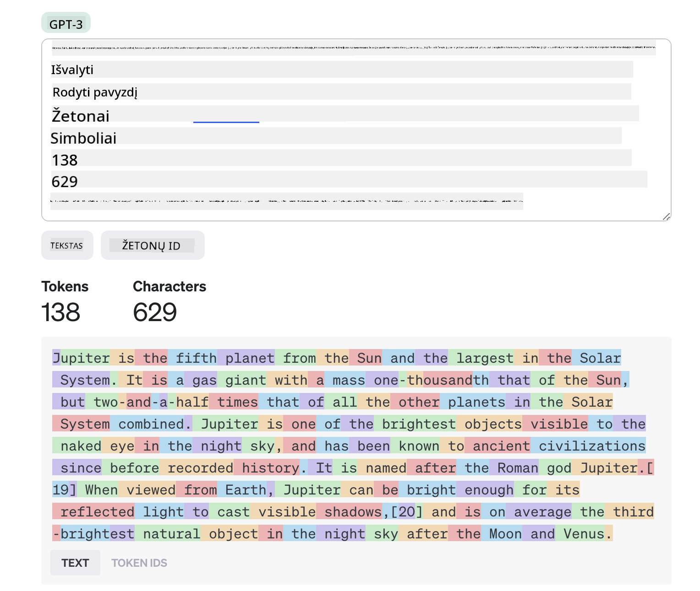

<!--
CO_OP_TRANSLATOR_METADATA:
{
  "original_hash": "856c11a307b38a83f1e043b5d46fe9ae",
  "translation_date": "2025-08-25T12:28:08+00:00",
  "source_file": "04-prompt-engineering-fundamentals/README.md",
  "language_code": "lt"
}
-->
# Promptų inžinerijos pagrindai

[](https://aka.ms/gen-ai-lesson4-gh?WT.mc_id=academic-105485-koreyst)

## Įvadas
Šiame modulyje aptariamos pagrindinės sąvokos ir technikos, kaip kurti efektyvius promptus generatyviuose AI modeliuose. Tai, kaip suformuluosite savo užklausą LLM, taip pat yra svarbu. Kruopščiai parengtas promptas gali užtikrinti geresnę atsakymo kokybę. Bet ką iš tikrųjų reiškia tokie terminai kaip _promptas_ ir _promptų inžinerija_? Ir kaip pagerinti prompto _įvestį_, kurią siunčiu LLM? Į šiuos klausimus bandysime atsakyti šiame ir kitame skyriuje.

_Generatyvusis AI_ geba kurti naują turinį (pvz., tekstą, vaizdus, garsą, kodą ir pan.) reaguodamas į vartotojo užklausas. Tai pasiekiama naudojant _Didelius kalbos modelius_ (LLM), tokius kaip OpenAI GPT („Generative Pre-trained Transformer“) serija, kurie apmokyti naudoti natūralią kalbą ir kodą.

Dabar vartotojai gali bendrauti su šiais modeliais naudodami įprastus pokalbio principus, nereikėdami jokios techninės patirties ar mokymų. Modeliai yra _promptų pagrindu_ – vartotojai siunčia tekstinę įvestį (promptą) ir gauna AI atsakymą (užbaigimą). Jie gali „kalbėtis su AI“ keliais etapais, tobulindami savo promptą tol, kol atsakymas atitiks jų lūkesčius.

„Promptai“ dabar tampa pagrindine _programavimo sąsaja_ generatyvioms AI programoms, nurodydami modeliams, ką daryti, ir darydami įtaką grąžinamų atsakymų kokybei. „Promptų inžinerija“ – sparčiai auganti sritis, kuri orientuota į _promptų kūrimą ir optimizavimą_, siekiant užtikrinti nuoseklius ir kokybiškus atsakymus dideliu mastu.

## Mokymosi tikslai

Šioje pamokoje sužinosime, kas yra Promptų inžinerija, kodėl ji svarbi ir kaip galime kurti efektyvesnius promptus pagal konkretų modelį ir programos tikslą. Susipažinsime su pagrindinėmis sąvokomis ir gerosiomis praktikomis, taip pat su interaktyvia Jupyter Notebook „smėlio dėžės“ aplinka, kurioje galėsime pamatyti šių sąvokų taikymą realiuose pavyzdžiuose.

Pamokos pabaigoje gebėsime:

1. Paaiškinti, kas yra promptų inžinerija ir kodėl ji svarbi.
2. Apibūdinti prompto sudedamąsias dalis ir jų panaudojimą.
3. Susipažinti su geriausiomis praktikomis ir technikomis promptų inžinerijoje.
4. Praktiškai pritaikyti išmoktas technikas realiuose pavyzdžiuose, naudojant OpenAI endpointą.

## Pagrindinės sąvokos

Promptų inžinerija: Praktika, kai kuriamos ir tobulinamos įvestys, kad AI modeliai generuotų norimus rezultatus.
Tokenizacija: Teksto pavertimo mažesniais vienetais, vadinamais tokenais, kuriuos modelis gali suprasti ir apdoroti, procesas.
Instrukcijomis patobulinti LLM: Dideli kalbos modeliai (LLM), kurie buvo papildomai apmokyti su konkrečiomis instrukcijomis, kad pagerėtų jų atsakymų tikslumas ir aktualumas.

## Mokymosi smėlio dėžė

Šiuo metu promptų inžinerija yra labiau menas nei mokslas. Geriausias būdas pagerinti savo nuojautą – _daugiau praktikuotis_ ir taikyti bandymų-klaidų metodą, derinant srities žinias su rekomenduojamomis technikomis ir modelio specifinėmis optimizacijomis.

Šiai pamokai skirtas Jupyter Notebook suteikia _smėlio dėžės_ aplinką, kurioje galite išbandyti tai, ką išmokote – tiek eigoje, tiek atlikdami užduotį pabaigoje. Norint atlikti pratimus, jums reikės:

1. **Azure OpenAI API rakto** – paslaugos endpointo, kuriame veikia LLM.
2. **Python aplinkos** – kurioje galima vykdyti Notebook.
3. **Vietinių aplinkos kintamųjų** – _dabar atlikite [SETUP](./../00-course-setup/02-setup-local.md?WT.mc_id=academic-105485-koreyst) žingsnius, kad pasiruoštumėte_.

Notebooke rasite _pradinius_ pratimus, tačiau raginame pridėti savo _Markdown_ (aprašymo) ir _Code_ (promptų užklausų) skyrius, kad išbandytumėte daugiau pavyzdžių ar idėjų – ir lavintumėte nuojautą promptų kūrimui.

## Iliustruotas gidas

Norite prieš pradėdami pamatyti bendrą vaizdą, ką apima ši pamoka? Peržiūrėkite šį iliustruotą gidą – jis padės suprasti pagrindines temas ir svarbiausias įžvalgas, apie kurias verta pagalvoti kiekvienoje jų. Pamokos planas veda nuo pagrindinių sąvokų ir iššūkių supratimo iki jų sprendimo taikant atitinkamas promptų inžinerijos technikas ir gerąsias praktikas. Atkreipkite dėmesį, kad „Išplėstinės technikos“ skyrius šiame gide susijęs su turiniu, kuris bus aptariamas _kitame_ šio kurso skyriuje.


## Mūsų startuolis

Dabar pakalbėkime, kaip _ši tema_ susijusi su mūsų startuolio misija [diegiant AI inovacijas švietime](https://educationblog.microsoft.com/2023/06/collaborating-to-bring-ai-innovation-to-education?WT.mc_id=academic-105485-koreyst). Norime kurti AI pagrįstas _personalizuoto mokymosi_ programas – tad pagalvokime, kaip skirtingi mūsų programos vartotojai galėtų „kurti“ promptus:

- **Administratoriai** galėtų paprašyti AI _analizuoti mokymo programos duomenis ir nustatyti spragas_. AI gali apibendrinti rezultatus arba juos vizualizuoti naudodamas kodą.
- **Mokytojai** galėtų paprašyti AI _sudaryti pamokos planą pagal tikslinę auditoriją ir temą_. AI gali parengti personalizuotą planą nurodytu formatu.
- **Mokiniai** galėtų paprašyti AI _padėti mokytis sudėtingo dalyko_. AI gali vesti pamokas, pateikti užuominas ir pavyzdžius, pritaikytus jų lygiui.

Tai tik ledkalnio viršūnė. Peržiūrėkite [Prompts For Education](https://github.com/microsoft/prompts-for-edu/tree/main?WT.mc_id=academic-105485-koreyst) – atviro kodo promptų biblioteką, kurią sudarė švietimo ekspertai – kad pamatytumėte, kokios galimybės atsiveria! _Išbandykite kai kuriuos iš tų promptų smėlio dėžėje arba OpenAI Playground ir pažiūrėkite, kas gausis!_

<!--
LESSON TEMPLATE:
This unit should cover core concept #1.
Reinforce the concept with examples and references.

CONCEPT #1:
Prompt Engineering.
Define it and explain why it is needed.
-->

## Kas yra promptų inžinerija?

Pamoką pradėjome apibrėždami **promptų inžineriją** kaip _tekstinių įvesčių (promptų) kūrimo ir optimizavimo_ procesą, siekiant užtikrinti nuoseklius ir kokybiškus atsakymus (užbaigimus) pagal konkrečios programos tikslą ir modelį. Tai galima įsivaizduoti kaip dviejų žingsnių procesą:

- _sukurti_ pradinį promptą pagal konkretų modelį ir tikslą
- _tobulinti_ promptą iteratyviai, kad pagerėtų atsakymo kokybė

Tai neišvengiamai yra bandymų-klaidų procesas, reikalaujantis vartotojo nuojautos ir pastangų, kad būtų pasiekti optimalūs rezultatai. Kodėl tai svarbu? Norėdami atsakyti į šį klausimą, pirmiausia turime suprasti tris sąvokas:

- _Tokenizacija_ = kaip modelis „mato“ promptą
- _Bazinis LLM_ = kaip pagrindinis modelis „apdoroja“ promptą
- _Instrukcijomis patobulintas LLM_ = kaip modelis dabar gali matyti „užduotis“

### Tokenizacija

LLM mato promptus kaip _tokenų seką_, kur skirtingi modeliai (ar jų versijos) gali tą patį promptą tokenizuoti skirtingai. Kadangi LLM yra apmokyti su tokenais (o ne su žaliu tekstu), tai, kaip promptai tokenizuojami, tiesiogiai veikia sugeneruoto atsakymo kokybę.

Norėdami geriau suprasti, kaip veikia tokenizacija, išbandykite tokius įrankius kaip [OpenAI Tokenizer](https://platform.openai.com/tokenizer?WT.mc_id=academic-105485-koreyst), parodytą žemiau. Nukopijuokite savo promptą – ir pažiūrėkite, kaip jis paverčiamas tokenais, atkreipdami dėmesį, kaip apdorojami tarpai ir skyrybos ženklai. Atkreipkite dėmesį, kad šiame pavyzdyje naudojamas senesnis LLM (GPT-3) – tad bandant su naujesniu modeliu rezultatas gali skirtis.



### Sąvoka: Pagrindiniai modeliai

Kai promptas tokenizuojamas, pagrindinė ["Bazinio LLM"](https://blog.gopenai.com/an-introduction-to-base-and-instruction-tuned-large-language-models-8de102c785a6?WT.mc_id=academic-105485-koreyst) (arba pagrindinio modelio) funkcija yra nuspėti sekantį tokeną toje sekoje. Kadangi LLM apmokyti su milžiniškais tekstų rinkiniais, jie gerai supranta statistinius ryšius tarp tokenų ir gali gana užtikrintai daryti prognozes. Tačiau jie nesupranta _žodžių prasmės_ promptuose ar tokenuose; jie tiesiog mato seką, kurią gali „užbaigti“ su kita prognoze. Jie gali tęsti prognozavimą tol, kol vartotojas nutraukia procesą arba pasiekiama iš anksto nustatyta sąlyga.

Norite pamatyti, kaip veikia promptų pagrindu vykdomas užbaigimas? Įveskite aukščiau pateiktą promptą į Azure OpenAI Studio [_Chat Playground_](https://oai.azure.com/playground?WT.mc_id=academic-105485-koreyst) su numatytais nustatymais. Sistema sukonfigūruota promptus traktuoti kaip informacijos užklausas – tad turėtumėte gauti užbaigimą, atitinkantį šį kontekstą.

O kas, jei vartotojas norėtų pamatyti kažką konkretaus, atitinkančio tam tikrus kriterijus ar užduoties tikslą? Čia ir atsiranda _instrukcijomis patobulinti_ LLM.


### Sąvoka: Instrukcijomis patobulinti LLM

[Instrukcijomis patobulintas LLM](https://blog.gopenai.com/an-introduction-to-base-and-instruction-tuned-large-language-models-8de102c785a6?WT.mc_id=academic-105485-koreyst) prasideda nuo pagrindinio modelio ir yra papildomai apmokomas su pavyzdžiais ar įvesties/išvesties poromis (pvz., kelių žinučių „pokalbiais“), kuriuose gali būti aiškios instrukcijos – o AI atsakymas bando tų instrukcijų laikytis.

Tam naudojamos tokios technikos kaip stiprinamasis mokymasis su žmogaus grįžtamuoju ryšiu (RLHF), kurios leidžia modelį _mokyti laikytis instrukcijų_ ir _mokytis iš grįžtamojo ryšio_, kad atsakymai būtų labiau pritaikyti praktiniam naudojimui ir labiau atitiktų vartotojo tikslus.

Išbandykime – pakartokite aukščiau buvusį promptą, bet dabar pakeiskite _sistemos žinutę_, kad ji pateiktų tokią instrukciją kaip kontekstą:

> _Apibendrink pateiktą turinį antros klasės mokiniui. Rezultatas turi būti vienas paragrafas su 3–5 punktais._

Matote, kaip rezultatas dabar pritaikytas norimam tikslui ir formatui? Mokytojas gali tiesiogiai panaudoti šį atsakymą savo skaidrėse tai klasei.


## Kodėl mums reikia promptų inžinerijos?

Dabar, kai žinome, kaip LLM apdoroja promptus, pakalbėkime, _kodėl_ mums reikia promptų inžinerijos. Atsakymas slypi tame, kad dabartiniai LLM kelia nemažai iššūkių, dėl kurių _patikimus ir nuoseklius užbaigimus_ pasiekti sunkiau, jei neskiriame dėmesio promptų kūrimui ir optimizavimui. Pavyzdžiui:

1. **Modelio atsakymai yra stochastiški.** _Tas pats promptas_ gali duoti skirtingus atsakymus su skirtingais modeliais ar jų versijomis. Net ir su _tuo pačiu modeliu_ skirtingu metu rezultatai gali skirtis. _Promptų inžinerijos technikos padeda sumažinti šiuos svyravimus, suteikdamos aiškesnes ribas._

1. **Modeliai gali kurti netikrus atsakymus.** Modeliai apmokyti su _dideliais, bet ribotais_ duomenų rinkiniais, todėl jiems trūksta žinių apie temas už šio mokymo ribų. Dėl to jie gali generuoti atsakymus, kurie yra netikslūs, išgalvoti ar net prieštarauja žinomiems faktams. _Promptų inžinerijos technikos padeda vartotojams atpažinti ir sumažinti tokius išgalvojimus, pvz., paprašant AI nurodyti šaltinius ar paaiškinti sprendimą._

1. **Modelių galimybės skiriasi.** Naujesni modeliai ar jų kartos turi daugiau galimybių, bet kartu atsiranda ir savitų niuansų, kainos bei sudėtingumo kompromisų. _Promptų inžinerija padeda sukurti gerąsias praktikas ir darbo eigas, kurios paslepia šiuos skirtumus ir leidžia prisitaikyti prie modelio reikalavimų masteliu ir sklandžiai._

Pažiūrėkime, kaip tai atrodo OpenAI ar Azure OpenAI Playground:

- Naudokite tą patį promptą su skirtingais LLM diegimais (pvz., OpenAI, Azure OpenAI, Hugging Face) – ar pastebėjote skirtumus?
- Naudokite tą patį promptą kelis kartus su _tuo pačiu_ LLM diegimu (pvz., Azure OpenAI playground) – kaip skyrėsi rezultatai?

### Išgalvojimų pavyzdys

Šiame kurse vartojame terminą **„išgalvojimas“** (angl. fabrication), apibūdindami reiškinį, kai LLM kartais sugeneruoja faktiškai neteisingą informaciją dėl mokymo apribojimų ar kitų priežasčių. Galbūt esate girdėję ir terminą _„haliucinacijos“_ populiariuose straipsniuose ar moksliniuose darbuose. Visgi, primygtinai rekomenduojame vartoti _„išgalvojimas“_, kad netyčia nesuteiktume žmogaus savybių mašinos elgesiui. Tai taip pat atitinka [Atsakingo AI gaires](https://www.microsoft.com/ai/responsible-ai?WT.mc_id
# Pamokos planas: Marso karas 2076 metais

## Pamokos tikslai

- Supažindinti mokinius su pagrindiniais Marso karo 2076 m. įvykiais
- Analizuoti karo priežastis ir pasekmes
- Skatinti kritinį mąstymą apie konfliktų sprendimo būdus ateityje

## Įžanga

Pradėkite pamoką trumpai pristatydami Marso karą 2076 m. Paaiškinkite, kodėl šis įvykis yra svarbus žmonijos istorijoje ir kaip jis paveikė tiek Žemę, tiek Marsą.

## Pagrindinės temos

### 1. Karo priežastys

- Diskutuokite apie politines, ekonomines ir socialines priežastis, dėl kurių kilo konfliktas tarp Marso kolonijų ir Žemės vyriausybių.
- Aptarkite resursų trūkumą, nepriklausomybės siekį ir technologijų skirtumus.

### 2. Svarbiausi įvykiai

- Apžvelkite pagrindinius karo etapus: pradžią, didžiausius mūšius, taikos derybas.
- Paminėkite žymiausius veikėjus ir jų vaidmenį konflikte.

### 3. Pasekmės

- Aptarkite, kaip karas pakeitė politinę situaciją Marse ir Žemėje.
- Diskutuokite apie technologinius pasiekimus, kurie atsirado karo metu.
- Analizuokite socialinius ir kultūrinius pokyčius po karo.

## Veiklos

- Padalykite mokinius į grupes ir paprašykite sukurti trumpą pristatymą apie vieną iš karo aspektų (priežastis, įvykius, pasekmes).
- Organizuokite diskusiją: ar buvo įmanoma išvengti karo? Kokie sprendimai galėjo pakeisti istorijos eigą?

## Vertinimas

- Įvertinkite mokinių dalyvavimą diskusijose ir grupinėse veiklose.
- Paprašykite parašyti trumpą rašinį apie tai, ko jie išmoko iš Marso karo 2076 m. analizės.

## Namų darbai

- Perskaityti pasirinktą straipsnį apie Marso karą 2076 m. ir parengti klausimus diskusijai kitai pamokai.

## Papildoma informacija

- Rekomenduojama naudoti interaktyvias priemones, pvz., žemėlapius, laiko juostas ir virtualias simuliacijas, kad mokiniai geriau suprastų karo eigą.
- Skatinkite mokinius ieškoti paralelių su kitais istoriniais konfliktais ir aptarti, ką galima pasimokyti iš praeities.
Interneto paieška parodė, kad yra išgalvotų pasakojimų (pvz., televizijos serialai ar knygos) apie Marso karus – bet nė vieno 2076 metais. Sveikas protas taip pat sako, kad 2076-ieji yra _ateityje_, todėl negali būti susiję su tikru įvykiu.

Taigi, kas nutinka, kai šią užklausą paleidžiame su skirtingais LLM tiekėjais?

> **Atsakymas 1**: OpenAI Playground (GPT-35)


> **Atsakymas 2**: Azure OpenAI Playground (GPT-35)


> **Atsakymas 3**: : Hugging Face Chat Playground (LLama-2)


Kaip ir tikėtasi, kiekvienas modelis (arba modelio versija) pateikia šiek tiek skirtingus atsakymus dėl atsitiktinumo ir modelio galimybių skirtumų. Pavyzdžiui, vienas modelis orientuojasi į aštuntos klasės auditoriją, o kitas – į vyresnių klasių mokinį. Tačiau visi trys modeliai sugeneravo atsakymus, kurie galėtų įtikinti neinformuotą vartotoją, kad įvykis buvo tikras.

Tokios promptų inžinerijos technikos kaip _metapromptinimas_ ir _temperatūros konfigūravimas_ gali iš dalies sumažinti modelio išgalvojimus. Naujos promptų inžinerijos _architektūros_ taip pat sklandžiai įtraukia naujus įrankius ir metodus į promptų srautą, kad sumažintų ar sušvelnintų kai kuriuos šiuos efektus.

## Atvejo analizė: GitHub Copilot

Užbaikime šią dalį pažvelgdami, kaip promptų inžinerija naudojama realiuose sprendimuose, panagrinėdami vieną atvejo analizę: [GitHub Copilot](https://github.com/features/copilot?WT.mc_id=academic-105485-koreyst).

GitHub Copilot yra jūsų „dirbtinio intelekto porininkas programuojant“ – jis paverčia tekstines užklausas į kodo pasiūlymus ir yra integruotas į jūsų programavimo aplinką (pvz., Visual Studio Code), kad naudotojo patirtis būtų sklandi. Kaip aprašyta žemiau pateiktuose tinklaraščio įrašuose, ankstyviausia versija buvo paremta OpenAI Codex modeliu – inžinieriai greitai suprato, kad reikia modelį papildomai apmokyti ir kurti geresnes promptų inžinerijos technikas, kad pagerintų kodo kokybę. Liepą jie [pristatė patobulintą DI modelį, kuris pranoksta Codex](https://github.blog/2023-07-28-smarter-more-efficient-coding-github-copilot-goes-beyond-codex-with-improved-ai-model/?WT.mc_id=academic-105485-koreyst) ir siūlo dar greitesnius pasiūlymus.

Skaitykite įrašus iš eilės, kad galėtumėte sekti jų mokymosi kelią.

- **2023 m. gegužė** | [GitHub Copilot vis geriau supranta jūsų kodą](https://github.blog/2023-05-17-how-github-copilot-is-getting-better-at-understanding-your-code/?WT.mc_id=academic-105485-koreyst)
- **2023 m. gegužė** | [GitHub viduje: darbas su LLM, kurie veikia GitHub Copilot](https://github.blog/2023-05-17-inside-github-working-with-the-llms-behind-github-copilot/?WT.mc_id=academic-105485-koreyst).
- **2023 m. birželis** | [Kaip rašyti geresnius promptus GitHub Copilot](https://github.blog/2023-06-20-how-to-write-better-prompts-for-github-copilot/?WT.mc_id=academic-105485-koreyst).
- **2023 m. liepa** | [.. GitHub Copilot pranoksta Codex su patobulintu DI modeliu](https://github.blog/2023-07-28-smarter-more-efficient-coding-github-copilot-goes-beyond-codex-with-improved-ai-model/?WT.mc_id=academic-105485-koreyst)
- **2023 m. liepa** | [Programuotojo gidas apie promptų inžineriją ir LLM](https://github.blog/2023-07-17-prompt-engineering-guide-generative-ai-llms/?WT.mc_id=academic-105485-koreyst)
- **2023 m. rugsėjis** | [Kaip sukurti įmonės LLM programėlę: pamokos iš GitHub Copilot](https://github.blog/2023-09-06-how-to-build-an-enterprise-llm-application-lessons-from-github-copilot/?WT.mc_id=academic-105485-koreyst)

Taip pat galite naršyti jų [inžinerijos tinklaraštį](https://github.blog/category/engineering/?WT.mc_id=academic-105485-koreyst) ir rasti daugiau įrašų, tokių kaip [šis](https://github.blog/2023-09-27-how-i-used-github-copilot-chat-to-build-a-reactjs-gallery-prototype/?WT.mc_id=academic-105485-koreyst), kuriame parodyta, kaip šie modeliai ir technikos _taikomi_ realiose programose.

---

## Promptų kūrimas

Jau matėme, kodėl promptų inžinerija yra svarbi – dabar supraskime, kaip promptai yra _kuriami_, kad galėtume įvertinti skirtingas technikas efektyvesniam promptų dizainui.

### Pagrindinis promptas

Pradėkime nuo pagrindinio prompto: tekstinė užklausa, siunčiama modeliui be jokio papildomo konteksto. Štai pavyzdys – kai OpenAI [Completion API](https://platform.openai.com/docs/api-reference/completions?WT.mc_id=academic-105485-koreyst) nusiunčiame pirmuosius JAV himno žodžius, modelis iškart _užbaigia_ atsakymą kitomis eilutėmis, parodydamas pagrindinį prognozavimo elgesį.

| Promptas (Įvestis) | Užbaigimas (Išvestis)                                                                                                                        |
| :----------------- | :------------------------------------------------------------------------------------------------------------------------------------------- |
| Oh say can you see | Atrodo, kad pradedate dainos „The Star-Spangled Banner“, JAV himno, žodžius. Pilni žodžiai yra ...                                          |

### Sudėtingas promptas

Dabar pridėkime kontekstą ir instrukcijas prie to pagrindinio prompto. [Chat Completion API](https://learn.microsoft.com/azure/ai-services/openai/how-to/chatgpt?WT.mc_id=academic-105485-koreyst) leidžia sukurti sudėtingą promptą kaip _žinučių_ rinkinį su:

- Įvesties/išvesties poromis, atspindinčiomis _naudotojo_ įvestį ir _asistento_ atsakymą.
- Sistemos žinute, kuri nustato asistento elgesio ar asmenybės kontekstą.

Užklausa dabar atrodo taip, kur _tokenizacija_ efektyviai apima svarbią informaciją iš konteksto ir pokalbio. Dabar sistemos konteksto pakeitimas gali turėti tiek pat įtakos atsakymų kokybei, kiek ir naudotojo įvestys.

```python
response = openai.chat.completions.create(
    model="gpt-3.5-turbo",
    messages=[
        {"role": "system", "content": "You are a helpful assistant."},
        {"role": "user", "content": "Who won the world series in 2020?"},
        {"role": "assistant", "content": "The Los Angeles Dodgers won the World Series in 2020."},
        {"role": "user", "content": "Where was it played?"}
    ]
)
```

### Instrukcijų promptas

Ankstesniuose pavyzdžiuose naudotojo promptas buvo paprasta tekstinė užklausa, kurią galima interpretuoti kaip informacijos prašymą. Naudojant _instrukcijų_ promptus, galime tą tekstą panaudoti užduočiai detaliau aprašyti, taip suteikdami AI geresnių gairių. Štai pavyzdys:

| Promptas (Įvestis)                                                                                                                                                                                                                         | Užbaigimas (Išvestis)                                                                                                        | Instrukcijos tipas    |
| :----------------------------------------------------------------------------------------------------------------------------------------------------------------------------------------------------------------------------------------- | :--------------------------------------------------------------------------------------------------------------------------- | :-------------------- |
| Parašyk pilietinio karo aprašymą                                                                                                                                                                    | _grąžino paprastą pastraipą_                                                                                                | Paprastas             |
| Parašyk pilietinio karo aprašymą. Pateik pagrindines datas ir įvykius bei apibūdink jų reikšmę                                                                                                      | _grąžino pastraipą, po kurios pateiktas pagrindinių įvykių datų sąrašas su aprašymais_                                      | Sudėtingas            |
| Parašyk pilietinio karo aprašymą 1 pastraipoje. Pateik 3 punktus su pagrindinėmis datomis ir jų reikšme. Pateik dar 3 punktus su pagrindiniais istoriniais veikėjais ir jų indėliu. Grąžink rezultatą kaip JSON failą | _grąžina išsamesnę informaciją tekstinėje dėžutėje, suformatuotą kaip JSON, kurį galima nukopijuoti į failą ir prireikus patikrinti_ | Sudėtingas. Su formatavimu. |

## Pirminis turinys

Ankstesniuose pavyzdžiuose promptas vis dar buvo gana atviras, leidžiantis LLM pačiam nuspręsti, kuri jo išankstinio mokymo duomenų rinkinio dalis yra aktuali. Naudojant _pirminio turinio_ dizaino šabloną, įvesties tekstas padalijamas į dvi dalis:

- instrukcija (veiksmas)
- aktualus turinys (kuris daro įtaką veiksmui)

Štai pavyzdys, kur instrukcija yra „apibendrink tai 2 sakiniais“.

| Promptas (Įvestis)                                                                                                                                                                                                                                                                                                                                                                                                                                                                                                                                                                                                                                                                                      | Užbaigimas (Išvestis)                                                                                                                                                                                                                                                                             |
| :------------------------------------------------------------------------------------------------------------------------------------------------------------------------------------------------------------------------------------------------------------------------------------------------------------------------------------------------------------------------------------------------------------------------------------------------------------------------------------------------------------------------------------------------------------------------------------------------------------------------------------------------------------------------------------------------------ | :---------------------------------------------------------------------------------------------------------------------------------------------------------------------------------------------------------------------------------------------------------------------------------------------- |
| Jupiteris yra penkta planeta nuo Saulės ir didžiausia Saulės sistemoje. Tai dujinė milžinė, kurios masė yra tūkstantąja Saulės masės dalimi, bet du su puse karto didesnė už visų kitų Saulės sistemos planetų masę kartu sudėjus. Jupiteris yra vienas ryškiausių objektų, matomų plika akimi naktiniame danguje, ir žinomas senovės civilizacijoms dar iki rašytinės istorijos. Jis pavadintas romėnų dievo Jupiterio vardu.[19] Žiūrint iš Žemės, Jupiteris gali būti toks ryškus, kad jo atspindėta šviesa meta matomus šešėlius,[20] ir vidutiniškai yra trečias pagal ryškumą natūralus objektas naktiniame danguje po Mėnulio ir Veneros. <br/> **Apibendrink tai 2 trumpais sakiniais** | Jupiteris, penkta planeta nuo Saulės, yra didžiausia Saulės sistemoje ir žinoma kaip vienas ryškiausių objektų naktiniame danguje. Pavadintas romėnų dievo Jupiterio vardu, tai dujinė milžinė, kurios masė yra du su puse karto didesnė už visų kitų planetų masę kartu sudėjus. |

Pirminio turinio segmentą galima naudoti įvairiais būdais, kad instrukcijos būtų efektyvesnės:

- **Pavyzdžiai** – užuot aiškiai nurodę modeliui, ką daryti, pateikite pavyzdžių ir leiskite jam pačiam suprasti šabloną.
- **Užuominos** – po instrukcijos pateikite „užuominą“, kuri paskatina užbaigimą ir nukreipia modelį tinkamesnio atsakymo link.
- **Šablonai** – tai pakartojami promptų „receptai“ su vietos rezervavimo ženklais (kintamaisiais), kuriuos galima pritaikyti konkretiems atvejams.

Pažvelkime, kaip tai veikia praktiškai.

### Pavyzdžių naudojimas

Tai metodas, kai pirminį turinį naudojate „pamaitinti modelį“ keliais pageidaujamo atsakymo pavyzdžiais pagal nurodytą instrukciją ir leidžiate jam pačiam suprasti pageidaujamą šabloną. Priklausomai nuo pateiktų pavyzdžių skaičiaus, galime turėti zero-shot, one-shot, few-shot promptinimą ir pan.

Promptas dabar susideda iš trijų dalių:

- Užduoties aprašymas
- Keli pageidaujamo atsakymo pavyzdžiai
- Naujo pavyzdžio pradžia (tampa numanoma užduoties instrukcija)

| Mokymosi tipas | Promptas (Įvestis)                                                                                                                                        | Užbaigimas (Išvestis)         |
| :------------- | :-------------------------------------------------------------------------------------------------------------------------------------------------------- | :---------------------------- |
| Zero-shot      | "The Sun is Shining". Translate to Spanish                                                                                                                | "El Sol está brillando".      |
| One-shot       | "The Sun is Shining" => ""El Sol está brillando". <br> "It's a Cold and Windy Day" =>                                                                     | "Es un día frío y ventoso".   |
| Few-shot       | The player ran the bases => Baseball <br/> The player hit an ace => Tennis <br/> The player hit a six => Cricket <br/> The player made a slam-dunk =>     | Basketball                    |
|                |                                                                                                                                                           |                               |

Atkreipkite dėmesį, kad zero-shot promptinime turėjome pateikti aiškią instrukciją („Translate to Spanish“), tačiau one-shot pavyzdyje ji jau tampa numanoma. Few-shot pavyzdyje matome, kaip pridėjus daugiau pavyzdžių modeliai gali tiksliau suprasti užduotį be papildomų instrukcijų.

### Promptų užuominos

Kita pirminio turinio naudojimo technika – pateikti _užuominas_ vietoj pavyzdžių. Tokiu atveju modeliui suteikiame postūmį tinkama kryptimi, _pradėdami_ atsakymą fragmentu, kuris atspindi pageidaujamą atsakymo formatą. Modelis tada „perima užuominą“ ir tęsia ta pačia kryptimi.

| Užuominų skaičius | Promptas (Įvestis)                                                                                                                                                                                                                                                                                                                                                                                                                                               | Užbaigimas (Išvestis)                                                                                                                                                                                                                                                                                       |
| :---------------- | :--------------------------------------------------------------------------------------------------------------------------------------------------------------------------------------------------------------------------------------------------------------------------------------------------------------------------------------------------------------------------------------------------------------------------------------------------------------- | :---------------------------------------------------------------------------------------------------------------------------------------------------------------------------------------------------------------------------------------------------------------------------------------------------------- |
| 0                 | Jupiteris yra penkta planeta nuo Saulės ir didžiausia Saulės sistemoje. Tai dujinė milžinė, kurios masė yra tūkstantąja Saulės masės dalimi, bet du su puse karto didesnė už visų kitų Saulės sistemos planetų masę kartu sudėjus. Jupiteris yra vienas ryškiausių objektų, matomų plika akimi naktiniame danguje, ir žinomas senovės civilizacijoms dar iki rašytinės istorijos.

**Apibendrinkite tai**                                       | Jupiteris yra didžiausia planeta mūsų Saulės sistemoje ir penkta nuo Saulės. Tai dujinė milžinė, kurios masė sudaro 1/1000 Saulės masės, tačiau ji sunkesnė už visas kitas planetas kartu sudėjus. Senovės civilizacijos Jupiterį žinojo jau seniai, o naktiniame danguje jį lengva pastebėti. |
| 1              | Jupiteris yra penkta planeta nuo Saulės ir didžiausia Saulės sistemoje. Tai dujinė milžinė, kurios masė sudaro vieną tūkstantąją Saulės masės, bet yra du su puse karto didesnė už visas kitas Saulės sistemos planetas kartu sudėjus. Jupiteris yra vienas ryškiausių objektų, matomų plika akimi naktiniame danguje, ir žinomas senovės civilizacijoms dar prieš rašytinę istoriją. <br/>**Apibendrinkite tai** <br/> Ką sužinojome: Jupiteris | yra penkta planeta nuo Saulės ir didžiausia Saulės sistemoje. Tai dujinė milžinė, kurios masė sudaro vieną tūkstantąją Saulės masės, bet yra du su puse karto didesnė už visas kitas planetas kartu sudėjus. Jį lengva pastebėti plika akimi ir jis žinomas nuo senovės laikų.                        |
| 2              | Jupiteris yra penkta planeta nuo Saulės ir didžiausia Saulės sistemoje. Tai dujinė milžinė, kurios masė sudaro vieną tūkstantąją Saulės masės, bet yra du su puse karto didesnė už visas kitas Saulės sistemos planetas kartu sudėjus. Jupiteris yra vienas ryškiausių objektų, matomų plika akimi naktiniame danguje, ir žinomas senovės civilizacijoms dar prieš rašytinę istoriją. <br/>**Apibendrinkite tai** <br/> 3 svarbiausi faktai, kuriuos sužinojome:         | 1. Jupiteris yra penkta planeta nuo Saulės ir didžiausia Saulės sistemoje. <br/> 2. Tai dujinė milžinė, kurios masė sudaro vieną tūkstantąją Saulės masės...<br/> 3. Jupiteris matomas plika akimi nuo senovės laikų ...                                                                       |
|                |                                                                                                                                                                                                                                                                                                                                                                                                                                                              |                                                                                                                                                                                                                                                                                                           |

### Užklausų šablonai

Užklausos šablonas yra _iš anksto paruoštas užklausos receptas_, kurį galima išsaugoti ir naudoti pakartotinai, siekiant užtikrinti nuoseklesnę vartotojo patirtį dideliu mastu. Paprasčiausia forma tai yra užklausų pavyzdžių rinkinys, kaip [šis iš OpenAI](https://platform.openai.com/examples?WT.mc_id=academic-105485-koreyst), kuris pateikia interaktyvius užklausos komponentus (vartotojo ir sistemos žinutes) bei API užklausos formatą – kad būtų galima naudoti pakartotinai.

Sudėtingesnėje formoje, kaip [šis pavyzdys iš LangChain](https://python.langchain.com/docs/concepts/prompt_templates/?WT.mc_id=academic-105485-koreyst), jis turi _vietos rezervacijas_, kurias galima pakeisti duomenimis iš įvairių šaltinių (vartotojo įvestis, sistemos kontekstas, išoriniai duomenų šaltiniai ir t.t.), kad užklausa būtų generuojama dinamiškai. Tai leidžia sukurti pakartotinai naudojamų užklausų biblioteką, kuri gali būti naudojama nuosekliai vartotojo patirčiai **programiškai** dideliu mastu.

Galiausiai, tikroji šablonų vertė atsiskleidžia kuriant ir publikuojant _užklausų bibliotekas_ konkrečioms taikymo sritims – kai užklausos šablonas yra _optimizuotas_ atspindėti specifinį kontekstą ar pavyzdžius, kurie daro atsakymus aktualesnius ir tikslesnius tiksliniams vartotojams. [Prompts For Edu](https://github.com/microsoft/prompts-for-edu?WT.mc_id=academic-105485-koreyst) yra puikus tokio požiūrio pavyzdys, kuriame kaupiama užklausų biblioteka švietimo sričiai, akcentuojant svarbiausius tikslus, kaip pamokų planavimas, mokymo programų kūrimas, mokinių konsultavimas ir pan.

## Papildoma medžiaga

Jei apie užklausos sudarymą galvojame kaip apie instrukciją (užduotį) ir tikslą (pagrindinį turinį), tai _antrinis turinys_ yra papildomas kontekstas, kurį pateikiame, kad **kažkaip paveiktume rezultatą**. Tai gali būti derinimo parametrai, formatavimo instrukcijos, temų taksonomijos ir pan., kurie padeda modeliui _pritaikyti_ atsakymą pagal norimus vartotojo tikslus ar lūkesčius.

Pavyzdžiui: Turint kursų katalogą su išsamia metaduomenų informacija (pavadinimas, aprašymas, lygis, žymos, dėstytojas ir t.t.) apie visus mokymo programos kursus:

- galime apibrėžti instrukciją „apibendrinti kursų katalogą 2023 m. rudeniui“
- pagrindiniame turinyje pateikti keletą norimo rezultato pavyzdžių
- antriniame turinyje išskirti 5 svarbiausias „žymas“, kurios domina.

Dabar modelis gali pateikti santrauką pagal pavyzdžių formatą – bet jei rezultatas turi kelias žymas, jis gali prioritetizuoti 5 antriniame turinyje nurodytas žymas.

---

<!--
PAMOKOS ŠABLONAS:
Ši dalis turėtų apimti pagrindinę sąvoką #1.
Sustiprinkite sąvoką pavyzdžiais ir nuorodomis.

SĄVOKA #3:
Užklausų inžinerijos technikos.
Kokios yra pagrindinės užklausų inžinerijos technikos?
Pateikite keletą pratimų.
-->

## Geriausios užklausų sudarymo praktikos

Dabar, kai žinome, kaip galima _sudaryti_ užklausas, galime pradėti galvoti, kaip jas _kurti_, laikantis geriausių praktikų. Galime tai skirstyti į dvi dalis – turėti tinkamą _mąstyseną_ ir taikyti tinkamas _technikas_.

### Užklausų inžinerijos mąstysena

Užklausų inžinerija yra bandymų ir klaidų procesas, todėl prisiminkite tris pagrindinius veiksnius:

1. **Svarbus srities supratimas.** Atsakymo tikslumas ir aktualumas priklauso nuo _srities_, kurioje veikia ta programa ar vartotojas. Pasitelkite savo intuiciją ir srities žinias, kad **dar labiau pritaikytumėte technikas**. Pavyzdžiui, apibrėžkite _srities specifines asmenybes_ sistemos užklausose arba naudokite _srities specifinius šablonus_ vartotojo užklausose. Pateikite antrinį turinį, atspindintį srities kontekstą, arba naudokite _srities specifinius signalus ir pavyzdžius_, kad modelis būtų nukreiptas į įprastus naudojimo būdus.

2. **Svarbus modelio supratimas.** Žinome, kad modeliai yra stochastiški. Tačiau modelių įgyvendinimas gali skirtis pagal naudojamą mokymo duomenų rinkinį (išankstinės žinios), teikiamas galimybes (pvz., per API ar SDK) ir turinio tipą, kuriam jie optimizuoti (pvz., kodas, vaizdai, tekstas). Supraskite naudojamo modelio stipriąsias ir silpnąsias puses ir naudokite šias žinias _prioritetizuodami užduotis_ arba kurdami _pritaikytus šablonus_, optimizuotus pagal modelio galimybes.

3. **Svarbus iteravimas ir validavimas.** Modeliai sparčiai tobulėja, kaip ir užklausų inžinerijos technikos. Kaip srities ekspertas, galite turėti kitą kontekstą ar kriterijus _savo_ konkrečiai programai, kurie gali būti nebūdingi plačiajai bendruomenei. Naudokite užklausų inžinerijos įrankius ir technikas, kad „užvestumėte“ užklausos sudarymą, tada iteruokite ir validuokite rezultatus pagal savo intuiciją ir srities žinias. Fiksuokite savo įžvalgas ir kurkite **žinių bazę** (pvz., užklausų bibliotekas), kurią kiti galės naudoti kaip naują atskaitos tašką greitesniam iteravimui ateityje.

## Geriausios praktikos

Pažvelkime į dažniausiai rekomenduojamas geriausias praktikas, kurias siūlo [OpenAI](https://help.openai.com/en/articles/6654000-best-practices-for-prompt-engineering-with-openai-api?WT.mc_id=academic-105485-koreyst) ir [Azure OpenAI](https://learn.microsoft.com/azure/ai-services/openai/concepts/prompt-engineering#best-practices?WT.mc_id=academic-105485-koreyst) specialistai.

| Kas                              | Kodėl                                                                                                                                                                                                                                               |
| :-------------------------------- | :------------------------------------------------------------------------------------------------------------------------------------------------------------------------------------------------------------------------------------------------ |
| Įvertinkite naujausius modelius.       | Naujos modelių kartos dažnai turi patobulintų funkcijų ir kokybę – bet gali būti brangesnės. Įvertinkite jų poveikį, tada priimkite sprendimus dėl migracijos.                                                                                |
| Atskirkite instrukcijas ir kontekstą   | Patikrinkite, ar jūsų modelis/paslaugų teikėjas naudoja _skirtukus_, kad aiškiau atskirtų instrukcijas, pagrindinį ir antrinį turinį. Tai gali padėti modeliams tiksliau paskirstyti svorius žetonams.                                                         |
| Būkite konkretūs ir aiškūs             | Pateikite daugiau detalių apie norimą kontekstą, rezultatą, ilgį, formatą, stilių ir t.t. Tai pagerins atsakymų kokybę ir nuoseklumą. Užfiksuokite receptus pakartotinai naudojamuose šablonuose.                                                          |
| Būkite aprašomi, naudokite pavyzdžius      | Modeliai dažnai geriau reaguoja į „parodyk ir paaiškink“ metodą. Pradėkite nuo `zero-shot` metodo, kai pateikiate instrukciją (be pavyzdžių), tada bandykite `few-shot` kaip patikslinimą, pateikdami keletą norimo rezultato pavyzdžių. Naudokite analogijas. |
| Naudokite signalus, kad paskatintumėte užbaigimą | Nukreipkite modelį link norimo rezultato, pateikdami keletą pradinių žodžių ar frazių, kurias jis gali naudoti kaip atsakymo pradžią.                                                                                                               |
| Kartokite                       | Kartais modelį reikia „priminti“ kelis kartus. Pateikite instrukcijas prieš ir po pagrindinio turinio, naudokite instrukciją ir signalą ir t.t. Iteruokite ir tikrinkite, kas veikia geriausiai.                                                         |
| Svarbi tvarka                     | Informacijos pateikimo modeliams tvarka gali paveikti rezultatą, net ir mokymosi pavyzdžiuose, dėl „recency bias“. Išbandykite skirtingas galimybes ir žiūrėkite, kas veikia geriausiai.                                                               |
| Suteikite modeliui „išeitį“           | Pateikite modeliui _atsarginį_ atsakymo variantą, kurį jis gali pateikti, jei dėl kokios nors priežasties negali atlikti užduoties. Tai gali sumažinti neteisingų ar išgalvotų atsakymų tikimybę.                                                         |
|                                   |                                                                                                                                                                                                                                                   |

Kaip ir su bet kuria geriausia praktika, atminkite, kad _rezultatai gali skirtis_ priklausomai nuo modelio, užduoties ir srities. Naudokite jas kaip atspirties tašką ir iteruokite, kad rastumėte, kas geriausiai tinka jums. Nuolat peržiūrėkite savo užklausų inžinerijos procesą, kai atsiranda nauji modeliai ir įrankiai, orientuodamiesi į proceso mastelį ir atsakymų kokybę.

<!--
PAMOKOS ŠABLONAS:
Ši dalis turėtų pateikti programavimo užduotį, jei taikoma

UŽDUOTIS:
Nuoroda į Jupyter Notebook, kur instrukcijose yra tik kodo komentarai (kodo dalys tuščios).

SPRENDIMAS:
Nuoroda į Notebook kopiją, kur užklausos užpildytos ir paleistos, parodyta vieno pavyzdžio rezultatas.
-->

## Užduotis

Sveikiname! Pasiekėte pamokos pabaigą! Laikas išbandyti kai kurias sąvokas ir technikas su tikrais pavyzdžiais!

Šiai užduočiai naudosime Jupyter Notebook su pratimais, kuriuos galėsite atlikti interaktyviai. Taip pat galite papildyti Notebook savo Markdown ir kodo langeliais, kad patys išbandytumėte idėjas ir technikas.

### Pradžiai, „forkinkite“ repozitoriją, tada

- (Rekomenduojama) Paleiskite GitHub Codespaces
- (Alternatyva) Nukopijuokite repozitoriją į savo įrenginį ir naudokite su Docker Desktop
- (Alternatyva) Atidarykite Notebook su jums patogia Notebook aplinka.

### Toliau, sukonfigūruokite aplinkos kintamuosius

- Nukopijuokite `.env.copy` failą iš repo šaknies į `.env` ir užpildykite `AZURE_OPENAI_API_KEY`, `AZURE_OPENAI_ENDPOINT` ir `AZURE_OPENAI_DEPLOYMENT` reikšmes. Grįžkite į [Learning Sandbox skyrių](../../../04-prompt-engineering-fundamentals/04-prompt-engineering-fundamentals), kad sužinotumėte kaip.

### Toliau, atidarykite Jupyter Notebook

- Pasirinkite vykdymo branduolį. Jei naudojate 1 arba 2 variantą, tiesiog pasirinkite numatytą Python 3.10.x branduolį, kurį pateikia kūrimo konteineris.

Viskas paruošta pratimams. Atkreipkite dėmesį, kad čia nėra _teisingų ar neteisingų_ atsakymų – tiesiog eksperimentuojate, bandote ir ugdote intuiciją, kas veikia konkrečiam modeliui ir taikymo sričiai.

_Dėl šios priežasties šioje pamokoje nėra kodo sprendimų segmentų. Vietoj to, Notebook turės Markdown langelius pavadinimu „Mano sprendimas:“, kuriuose bus pateiktas vieno pavyzdžio rezultatas nuorodai._

 <!--
PAMOKOS ŠABLONAS:
Užbaikite skyrių santrauka ir savarankiško mokymosi ištekliais.
-->

## Žinių patikrinimas

Kurio iš šių užklausų pavyzdžių laikytinas geru, laikantis pagrįstų geriausių praktikų?

1. Parodyk man raudono automobilio paveikslėlį
2. Parodyk man raudono automobilio, Volvo markės ir XC90 modelio, paveikslėlį, pastatytą prie skardžio, kai leidžiasi saulė
3. Parodyk man raudono automobilio, Volvo markės ir XC90 modelio, paveikslėlį

A: 2, tai geriausias užklausos pavyzdys, nes pateikiama informacija apie „ką“ ir detalizuojama (ne bet koks automobilis, o konkretus modelis ir markė), taip pat aprašoma aplinka. 3 yra antras geriausias, nes irgi turi daug aprašymo.

## 🚀 Iššūkis

Pabandykite pritaikyti „signalo“ techniką su užklausa: Užbaikite sakinį „Parodyk man raudono automobilio, Volvo markės ir “. Ką modelis atsako ir kaip galėtumėte tai patobulinti?

## Puikus darbas! Tęskite mokymąsi

Norite sužinoti daugiau apie įvairias užklausų inžinerijos sąvokas? Eikite į [tęstinio mokymosi puslapį](https://aka.ms/genai-collection?WT.mc_id=academic-105485-koreyst), kur rasite daugiau puiki

---

**Atsakomybės atsisakymas**:  
Šis dokumentas buvo išverstas naudojant dirbtinio intelekto vertimo paslaugą [Co-op Translator](https://github.com/Azure/co-op-translator). Nors siekiame tikslumo, prašome atkreipti dėmesį, kad automatiniai vertimai gali turėti klaidų ar netikslumų. Originalus dokumentas jo gimtąja kalba turėtų būti laikomas autoritetingu šaltiniu. Kritinei informacijai rekomenduojame profesionalų žmogaus vertimą. Mes neatsakome už nesusipratimus ar neteisingą interpretaciją, kylančią dėl šio vertimo naudojimo.