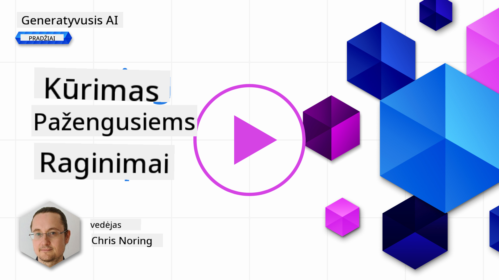

<!--
CO_OP_TRANSLATOR_METADATA:
{
  "original_hash": "b2651fb16bcfbc62b8e518751ed90fdb",
  "translation_date": "2025-10-18T02:21:27+00:00",
  "source_file": "05-advanced-prompts/README.md",
  "language_code": "lt"
}
-->
# Kurti pažangius užklausų tekstus

[](https://youtu.be/BAjzkaCdRok?si=NmUIyRf7-cDgbjtt)

Apžvelkime, ką išmokome ankstesniame skyriuje:

> Užklausų _kūrimas_ – tai procesas, kurio metu mes **nukreipiame modelį link tinkamesnių atsakymų**, pateikdami naudingesnes instrukcijas ar kontekstą.

Užklausų rašymas susideda iš dviejų etapų: užklausos konstravimo, pateikiant tinkamą kontekstą, ir _optimizavimo_, t. y. kaip palaipsniui tobulinti užklausą.

Šiuo metu turime pagrindinį supratimą, kaip rašyti užklausas, tačiau reikia gilintis. Šiame skyriuje pereisite nuo įvairių užklausų bandymo prie supratimo, kodėl viena užklausa yra geresnė už kitą. Išmoksite kurti užklausas, vadovaudamiesi pagrindinėmis technikomis, kurias galima taikyti bet kuriam LLM.

## Įvadas

Šiame skyriuje aptarsime šias temas:

- Išplėskite savo žinias apie užklausų kūrimą, taikydami skirtingas technikas savo užklausoms.
- Konfigūruokite savo užklausas, kad gautumėte įvairius rezultatus.

## Mokymosi tikslai

Baigę šią pamoką, galėsite:

- Taikyti užklausų kūrimo technikas, kurios pagerina užklausų rezultatus.
- Atlikti užklausas, kurios yra arba įvairios, arba deterministinės.

## Užklausų kūrimas

Užklausų kūrimas – tai procesas, kurio metu kuriamos užklausos, siekiant gauti norimą rezultatą. Užklausų kūrimas nėra inžinerijos disciplina, tai labiau technikų rinkinys, kurį galite taikyti norimam rezultatui pasiekti.

### Užklausos pavyzdys

Pažvelkime į paprastą užklausą, pavyzdžiui, šią:

> Sukurkite 10 geografijos klausimų.

Šioje užklausoje jūs iš tikrųjų taikote skirtingų užklausų technikų rinkinį.

Išskaidykime tai.

- **Kontekstas**, jūs nurodote, kad tai turėtų būti apie „geografiją“.
- **Rezultato apribojimas**, norite ne daugiau kaip 10 klausimų.

### Paprastų užklausų apribojimai

Galite gauti arba negauti norimo rezultato. Klausimai bus sugeneruoti, tačiau geografija yra plati tema, ir galite negauti to, ko norite, dėl šių priežasčių:

- **Plati tema**, nežinote, ar tai bus apie šalis, sostines, upes ir pan.
- **Formatas**, o kas, jei norėtumėte, kad klausimai būtų suformatuoti tam tikru būdu?

Kaip matote, kuriant užklausas reikia daug ką apsvarstyti.

Iki šiol matėme paprastą užklausos pavyzdį, tačiau generatyvusis DI gali daug daugiau padėti žmonėms įvairiose srityse ir profesijose. Pažvelkime į keletą pagrindinių technikų.

### Užklausų technikos

Pirmiausia turime suprasti, kad užklausų kūrimas yra _atsirandanti_ LLM savybė, tai reiškia, kad tai nėra funkcija, įdiegta modelyje, o kažkas, ką atrandame naudodamiesi modeliu.

Yra keletas pagrindinių technikų, kurias galime naudoti LLM užklausoms kurti. Pažvelkime į jas.

- **Vieno pavyzdžio užklausa**, tai pati paprasčiausia užklausų forma. Tai viena užklausa, prašanti LLM atsakymo, remiantis tik jo mokymo duomenimis.
- **Kelių pavyzdžių užklausa**, tokio tipo užklausa nukreipia LLM, pateikdama 1 ar daugiau pavyzdžių, kuriais jis gali remtis generuodamas atsakymą.
- **Mąstymo grandinė**, tokio tipo užklausa nurodo LLM, kaip suskaidyti problemą į žingsnius.
- **Sugeneruotos žinios**, norėdami pagerinti užklausos atsakymą, galite papildomai pateikti sugeneruotus faktus ar žinias.
- **Nuo paprasto iki sudėtingo**, kaip mąstymo grandinė, ši technika susijusi su problemos suskaidymu į žingsnius ir prašymu atlikti šiuos žingsnius eilės tvarka.
- **Savęs tobulinimas**, ši technika susijusi su LLM atsakymo kritika ir prašymu jį patobulinti.
- **Maieutinė užklausa**, čia norite užtikrinti, kad LLM atsakymas būtų teisingas, ir prašote paaiškinti įvairias atsakymo dalis. Tai savęs tobulinimo forma.

### Vieno pavyzdžio užklausa

Šis užklausų stilius yra labai paprastas, jis susideda iš vienos užklausos. Ši technika tikriausiai yra ta, kurią naudojate pradėdami mokytis apie LLM. Štai pavyzdys:

- Užklausa: „Kas yra algebra?“
- Atsakymas: „Algebra yra matematikos šaka, kuri tiria matematinius simbolius ir taisykles, kaip manipuliuoti šiais simboliais.“

### Kelių pavyzdžių užklausa

Šis užklausų stilius padeda modeliui, pateikiant keletą pavyzdžių kartu su prašymu. Jis susideda iš vienos užklausos su papildomais užduoties specifiniais duomenimis. Štai pavyzdys:

- Užklausa: „Parašyk eilėraštį Šekspyro stiliumi. Štai keletas Šekspyro sonetų pavyzdžių:
  Sonetas 18: „Ar palyginsiu tave su vasaros diena? Tu esi gražesnis ir švelnesnis...“
  Sonetas 116: „Neleiskime tikrų protų santuokai Trukdyti. Meilė nėra meilė, kuri keičiasi, kai keičiasi aplinkybės...“
  Sonetas 132: „Tavo akys man patinka, ir jos, tarsi gailėdamos manęs, Žinodamos tavo širdį, kankina mane panieka,...“
  Dabar parašyk sonetą apie mėnulio grožį.“
- Atsakymas: „Danguje mėnulis švelniai švyti, Sidabriniu švytėjimu, kuris skleidžia savo malonę,...“

Pavyzdžiai suteikia LLM kontekstą, formatą ar norimą stilių. Jie padeda modeliui suprasti konkrečią užduotį ir generuoti tikslesnius bei tinkamesnius atsakymus.

### Mąstymo grandinė

Mąstymo grandinė yra labai įdomi technika, nes ji susijusi su LLM vedimu per kelis žingsnius. Idėja yra nurodyti LLM, kaip kažką atlikti. Apsvarstykite šį pavyzdį, su ir be mąstymo grandinės:

    - Užklausa: „Alisa turi 5 obuolius, išmeta 3 obuolius, duoda 2 Bobui, o Bobas grąžina vieną, kiek obuolių turi Alisa?“
    - Atsakymas: 5

LLM atsako 5, kas yra neteisinga. Teisingas atsakymas yra 1 obuolys, atsižvelgiant į skaičiavimą (5 -3 -2 + 1 = 1).

Kaip galime išmokyti LLM tai atlikti teisingai?

Pabandykime mąstymo grandinę. Taikant mąstymo grandinę reiškia:

1. Pateikite LLM panašų pavyzdį.
1. Parodykite skaičiavimą ir kaip jį teisingai apskaičiuoti.
1. Pateikite pradinę užklausą.

Štai kaip:

- Užklausa: „Liza turi 7 obuolius, išmeta 1 obuolį, duoda 4 obuolius Bartui, o Bartas grąžina vieną:
  7 -1 = 6
  6 -4 = 2
  2 +1 = 3  
  Alisa turi 5 obuolius, išmeta 3 obuolius, duoda 2 Bobui, o Bobas grąžina vieną, kiek obuolių turi Alisa?“
  Atsakymas: 1

Atkreipkite dėmesį, kaip rašome žymiai ilgesnes užklausas su kitu pavyzdžiu, skaičiavimu ir tada pradinę užklausą, ir gauname teisingą atsakymą 1.

Kaip matote, mąstymo grandinė yra labai galinga technika.

### Sugeneruotos žinios

Dažnai, kai norite sukurti užklausą, norite tai padaryti naudodami savo įmonės duomenis. Norite, kad dalis užklausos būtų iš įmonės, o kita dalis – tai, kas jus domina.

Pavyzdžiui, jei dirbate draudimo versle, jūsų užklausa gali atrodyti taip:

```text
{{company}}: {{company_name}}
{{products}}:
{{products_list}}
Please suggest an insurance given the following budget and requirements:
Budget: {{budget}}
Requirements: {{requirements}}
```

Aukščiau matote, kaip užklausa sukonstruota naudojant šabloną. Šablone yra keletas kintamųjų, pažymėtų `{{variable}}`, kurie bus pakeisti faktinėmis vertėmis iš įmonės API.

Štai pavyzdys, kaip užklausa galėtų atrodyti, kai kintamieji pakeičiami turiniu iš jūsų įmonės:

```text
Insurance company: ACME Insurance
Insurance products (cost per month):
- Car, cheap, 500 USD
- Car, expensive, 1100 USD
- Home, cheap, 600 USD
- Home, expensive, 1200 USD
- Life, cheap, 100 USD

Please suggest an insurance given the following budget and requirements:
Budget: $1000
Requirements: Car, Home, and Life insurance
```

Paleidus šią užklausą per LLM, gausite tokį atsakymą:

```output
Given the budget and requirements, we suggest the following insurance package from ACME Insurance:
- Car, cheap, 500 USD
- Home, cheap, 600 USD
- Life, cheap, 100 USD
Total cost: $1,200 USD
```

Kaip matote, jis taip pat siūlo gyvybės draudimą, ko neturėtų. Šis rezultatas rodo, kad turime optimizuoti užklausą, kad ji būtų aiškesnė, ką galima leisti. Po tam tikro _bandymų ir klaidų_ proceso gauname tokią užklausą:

```text
Insurance company: ACME Insurance
Insurance products (cost per month):
- type: Car, cheap, cost: 500 USD
- type: Car, expensive, cost: 1100 USD
- type: Home, cheap, cost: 600 USD
- type: Home, expensive, cost: 1200 USD
- type: Life, cheap, cost: 100 USD

Please suggest an insurance given the following budget and requirements:
Budget: $1000 restrict choice to types: Car, Home
```

Atkreipkite dėmesį, kaip pridėjus _tipą_ ir _kainą_ bei naudojant raktinį žodį _apriboti_, LLM geriau supranta, ko norime.

Dabar gauname tokį atsakymą:

```output
Given the budget and requirements, we suggest the Car, Cheap insurance product which costs 500 USD per month.
```

Šio pavyzdžio tikslas buvo parodyti, kad net jei naudojame pagrindinę techniką, kaip _sugeneruotos žinios_, daugeliu atvejų vis tiek reikia optimizuoti užklausą, kad gautume norimą rezultatą.

### Nuo paprasto iki sudėtingo

„Nuo paprasto iki sudėtingo“ užklausų idėja yra suskaidyti didesnę problemą į subproblemas. Tokiu būdu padedate LLM „įveikti“ didesnę problemą. Geras pavyzdys galėtų būti duomenų mokslas, kur galite paprašyti LLM padalyti problemą taip:

> Užklausa: Kaip atlikti duomenų mokslą 5 žingsniais?

Jūsų DI asistentas atsakys:

1. Surinkti duomenis
1. Išvalyti duomenis
1. Analizuoti duomenis
1. Vaizduoti duomenis
1. Pateikti duomenis

### Savęs tobulinimas, rezultatų kritika

Naudojant generatyvinius DI ir LLM, negalite pasitikėti rezultatu. Jūs turite jį patikrinti. Galų gale, LLM tiesiog pateikia tai, kas greičiausiai turėtų būti pasakyta, o ne tai, kas yra teisinga. Todėl gera idėja yra paprašyti LLM kritikuoti save, kas veda mus prie savęs tobulinimo technikos.

Kaip tai veikia:

1. Pradinė užklausa, prašanti LLM išspręsti problemą
1. LLM atsako
1. Jūs kritikuojate atsakymą ir prašote DI jį patobulinti
1. LLM vėl atsako, šį kartą atsižvelgdamas į kritiką ir siūlo sprendimus, kuriuos sugalvojo

Šį procesą galite kartoti tiek kartų, kiek norite.

Štai pavyzdys, naudojant šią techniką:

> Užklausa: „Sukurkite Python Web API su maršrutais produktams ir klientams“

DI atsakymas:

```python
import flask
app = Flask(__name__)

@app.route('/products')
def products():
    return 'Products'

@app.route('/customers')
def customers():
    return 'Customers'
```

> Užklausa: pasiūlykite 3 patobulinimus aukščiau pateiktam kodui

DI atsakymas:

```text
Sure, here are three suggestions to improve the code:

Import the correct module: The first line should import Flask instead of flask. The correct import statement should be from flask import Flask.

Add a main function: Add a if __name__ == '__main__': block to the end of the file to run the application when the file is executed.

Use f-strings: Use f-strings to format the return statements in the route functions. For example, return 'Products' can be changed to return f'This is the {request.path} page'.
```

```python
from flask import Flask, request

app = Flask(__name__)

@app.route('/products')
def products():
    return f'This is the {request.path} page'

@app.route('/customers')
def customers():
    return f'This is the {request.path} page'

if __name__ == '__main__':
    app.run()
```

Kaip matote, aukščiau pateiktas DI atsakymas patobulina pirmąjį pasiūlytą kodą, dėka pirmojo atsakymo kritikos.

### Maieutinė užklausa

Maieutinė užklausa yra technika, panaši į savęs tobulinimą, tačiau ji labiau susijusi su LLM prašymu paaiškinti save. Tikslas yra sumažinti LLM atsakymų nenuoseklumus, kad būtų užtikrintas teisingas atsakymas. Darbo eiga:

1. Paprašykite LLM atsakyti į klausimą
1. Kiekvienai atsakymo daliai paprašykite LLM paaiškinti ją išsamiau.
1. Jei yra nenuoseklumų, atmesti dalis, kurios yra nenuoseklios.

Kartokite 2 ir 3, kol peržiūrėsite visas dalis ir būsite patenkinti atsakymu.

Štai pavyzdinė užklausa:

> Užklausa: Kaip sukurti krizės planą pandemijai suvaldyti 5 žingsniais?
> LLM atsakymas:

```text
1. Identify the risks
1. Identify the stakeholders
1. Identify the resources
1. Identify the actions
1. Identify the communication channels
```

Jis nustatė 5 žingsnius, bet ar galime nustatyti, ar tai teisinga? Paprašykime LLM paaiškinti kiekvieną žingsnį išsamiau:

> Užklausa: Paaiškinkite pirmąjį žingsnį išsamiau, kokios yra pandemijos rizikos?

```text
The risks are the following:

- Loss of life
- Loss of business
- Loss of reputation
- Loss of customers
- Loss of employees
```

Šiuo metu norime įsitikinti, kad LLM yra teisingas, todėl prašome paaiškinti pirmąją riziką išsamiau ir tikimės, kad ji bus nuosekli su aukščiau pateiktu atsakymu:

> Užklausa: Pandemijos metu, kokia yra didžiausia rizika ir kodėl?

```text
The biggest risk is loss of life because it's the most important thing to protect.
```

> Kokios yra dvi didžiausios rizikos pandemijos metu?

```text
The two biggest risks are loss of life and loss of business.
```

Šiuo metu LLM yra nuoseklus ir mini „gyvybę“ ir „verslą“ kaip dvi didžiausias rizikas. Dabar galime pereiti prie kito žingsnio ir jaustis gana užtikrintai. Tačiau neturėtume aklai pasitikėti LLM, visada turėtume patikrinti rezultatą.

## Įvairinkite savo rezultatus

LLM yra nedeterministiniai iš prigimties, tai reiškia, kad kiekvieną kartą paleidus tą pačią užklausą gausite skirtingus rezultatus. Pabandykite, pavyzdžiui, šią užklausą:

> „Sugeneruokite Python Web API kodą“

```python
# Import necessary modules
import flask
from flask import request, jsonify

# Create a Flask app
app = flask.Flask(__name__)

# Create a route for the API
@app.route('/api', methods=['GET'])
def api():
    # Get the data from the request
    data = request.args

    # Process the data
    result = process_data(data)

    # Return the result as JSON
    return jsonify(result)

# Function to process the data
def process_data(data):
    # Do something with the data
    result = data + 1

    # Return the result
    return result

# Run the app
if __name__ == '__main__':
    app.run()

```

Paleidus tą pačią užklausą dar kartą, gaunamas šiek tiek kitoks atsakymas:

```python
#import necessary packages
import flask
from flask import request, jsonify

#create the Flask application
app = flask.Flask(__name__)
app.config["DEBUG"] = True

#create a list of books
books = [
    {'id': 0,
     'title': 'A Fire Upon the Deep',
     'author': 'Vernor Vinge',
     'first_sentence': 'The coldsleep itself was dreamless.',
     'year_published': '1992'},
    {'id': 1,
     'title': 'The Ones Who Walk Away From Omelas',
     'author': 'Ursula K. Le Guin',
     'first_sentence': 'With a clamor of bells that set the swallows soaring, the Festival of Summer came to the city Omelas, bright-towered by the sea.',
     'published': '1973'},
    {'id': 2,
     'title': 'Dhalgren',
     'author': 'Samuel R. Delany',
     'first_sentence': 'to wound the autumnal city.',
     'published': '1975'}
]

#create an endpoint for the API
@app.route('/', methods=['GET'])
def home():
    return '''<h1>Books API</h1>
<p>A prototype API for retrieving books.</p>'''

#create an endpoint to return all books
@app.route('/api/v1/resources/books/all', methods=['GET'])
def api_all():
    return jsonify(books)

#create an endpoint to return a single book
@app.route('/api/v1/resources/books', methods=['GET'])
def api_id():
    #check if an ID was provided as part of the URL
    #if ID is provided, assign it to a variable
    #if no ID is provided, display an error
    if 'id' in request.args:
        id = int(request.args['id'])
    else:
        return "Error: No id field provided. Please specify an id."

    #create an empty list for our results
    results = []

    #loop through the data and match results that fit the requested ID
    #IDs are unique, but other fields might return many results
    for book in books:
        if book['id'] == id:
            results.append(book)

    #use the jsonify function from Flask to convert our list of
    #Python dictionaries to the JSON format
    return jsonify(results)

app.run()
```

> Ar įvairūs rezultatai yra problema?

Priklauso nuo to, ką bandote padaryti. Jei norite konkretaus atsakymo, tai yra problema. Jei jums tinka įvairūs rezultatai, pavyzdžiui, „Sugeneruokite bet kokius 3 geografijos klausimus“, tai nėra problema.

### Naudojant temperatūrą rezultatų įvairinimui

Gerai, taigi nusprendėme, kad norime apriboti rezultatą, kad jis būtų labiau nuspėjamas, t. y. labiau deterministinis. Kaip tai padaryti?

Temperatūra yra vertė nuo 0 iki 1, kur 0 yra labiausiai deterministinis, o 1 – labiausiai įvairus. Numatytasis reikšmė yra 0.7. Pažiūrėkime, kas nutinka su dviem užklausos paleidimais, kai temperatūra nustatyta į 0.1:

> „Sugeneruokite Python Web API kodą“

```python
#import necessary libraries
import flask
from flask import request, jsonify

#create an instance of the Flask class
app = flask.Flask(__name__)

#create an endpoint for the API
@app.route('/api/v1/endpoint', methods=['GET'])
def api_endpoint():
    #get the request data
    data = request.get_json()

    #process the data
    result = process_data(data)

    #return the result
    return jsonify(result)

#function to process the data
def process_data(data):
    #process the data
    result = {'result': 'success'}

    #return the result
    return result

#run the Flask app
if __name__ == '__main__':
    app.run()

```

Paleidus užklausą dar kartą, gauname tokį rezultatą:

```python
#import necessary libraries
import flask
from flask import request, jsonify

#create a Flask app
app = flask.Flask(__name__)

#create a route for the API
@app.route('/api', methods=['GET'])
def api_call():
    #get the data from the request
    data = request.get_json()

    #process the data
    result = process_data(data)

    #return the result
    return jsonify(result)

#define the process_data function
def process_data(data):
    #do something with the data
    result = data + 1

    #return the result
    return result

#run the app
if __name__ == '__main__':
    app.run()

```

Tarp š
Kaip matote, rezultatai negalėjo būti įvairesni.

> Atkreipkite dėmesį, kad yra daugiau parametrų, kuriuos galite pakeisti norėdami įvairinti rezultatą, pavyzdžiui, top-k, top-p, pasikartojimo bauda, ilgio bauda ir įvairovės bauda, tačiau jie nepatenka į šios mokymo programos apimtį.

## Geros praktikos

Yra daugybė praktikų, kurias galite taikyti, kad pasiektumėte norimą rezultatą. Naudodami užklausų formulavimą vis daugiau, rasite savo stilių.

Be jau aptartų technikų, yra keletas gerų praktikų, kurias verta apsvarstyti formuluojant užklausas LLM.

Štai keletas gerų praktikų, kurias verta apsvarstyti:

- **Nurodykite kontekstą**. Kontekstas yra svarbus – kuo daugiau galite nurodyti, pavyzdžiui, sritį, temą ir pan., tuo geriau.
- Apribokite rezultatą. Jei norite tam tikro skaičiaus elementų ar tam tikro ilgio, nurodykite tai.
- **Nurodykite tiek ką, tiek kaip**. Nepamirškite paminėti tiek, ko norite, tiek kaip norite, pavyzdžiui: „Sukurkite Python Web API su maršrutais produktams ir klientams, padalinkite jį į 3 failus“.
- **Naudokite šablonus**. Dažnai norėsite praturtinti savo užklausas duomenimis iš savo įmonės. Naudokite šablonus tam pasiekti. Šablonuose gali būti kintamųjų, kuriuos pakeisite tikrais duomenimis.
- **Rašykite taisyklingai**. LLM gali pateikti jums teisingą atsakymą, tačiau jei rašysite taisyklingai, gausite geresnį atsakymą.

## Užduotis

Štai Python kodas, rodantis, kaip sukurti paprastą API naudojant Flask:

```python
from flask import Flask, request

app = Flask(__name__)

@app.route('/')
def hello():
    name = request.args.get('name', 'World')
    return f'Hello, {name}!'

if __name__ == '__main__':
    app.run()
```

Naudokite AI asistentą, pvz., GitHub Copilot arba ChatGPT, ir pritaikykite „self-refine“ techniką, kad patobulintumėte kodą.

## Sprendimas

Pabandykite išspręsti užduotį, pridėdami tinkamas užklausas prie kodo.

> [!TIP]
> Suformuluokite užklausą, kad paprašytumėte patobulinti, gerai apriboti, kiek patobulinimų norite. Taip pat galite paprašyti patobulinti tam tikru būdu, pavyzdžiui, architektūrą, našumą, saugumą ir pan.

[Sprendimas](../../../05-advanced-prompts/python/aoai-solution.py)

## Žinių patikrinimas

Kodėl turėčiau naudoti „chain-of-thought“ užklausų formulavimą? Parodykite 1 teisingą atsakymą ir 2 neteisingus atsakymus.

1. Mokyti LLM, kaip išspręsti problemą.
1. B, Mokyti LLM rasti klaidas kode.
1. C, Nurodyti LLM sugalvoti skirtingus sprendimus.

A: 1, nes „chain-of-thought“ yra apie tai, kaip parodyti LLM, kaip išspręsti problemą, pateikiant jai veiksmų seką, panašias problemas ir jų sprendimo būdus.

## 🚀 Iššūkis

Jūs ką tik panaudojote „self-refine“ techniką užduotyje. Paimkite bet kurią jūsų sukurtą programą ir apsvarstykite, kokius patobulinimus norėtumėte jai pritaikyti. Dabar naudokite „self-refine“ techniką, kad pritaikytumėte siūlomus pakeitimus. Ką manote apie rezultatą – ar jis geresnis, ar blogesnis?

## Puikus darbas! Tęskite mokymąsi

Baigę šią pamoką, peržiūrėkite mūsų [Generatyvios AI mokymosi kolekciją](https://aka.ms/genai-collection?WT.mc_id=academic-105485-koreyst), kad toliau gilintumėte savo žinias apie generatyviąją AI!

Eikite į 6 pamoką, kur pritaikysime savo žinias apie užklausų formulavimą [kurdamas teksto generavimo programas](../06-text-generation-apps/README.md?WT.mc_id=academic-105485-koreyst)

---

**Atsakomybės apribojimas**:  
Šis dokumentas buvo išverstas naudojant AI vertimo paslaugą [Co-op Translator](https://github.com/Azure/co-op-translator). Nors siekiame tikslumo, prašome atkreipti dėmesį, kad automatiniai vertimai gali turėti klaidų ar netikslumų. Originalus dokumentas jo gimtąja kalba turėtų būti laikomas autoritetingu šaltiniu. Dėl svarbios informacijos rekomenduojama profesionali žmogaus vertimo paslauga. Mes neprisiimame atsakomybės už nesusipratimus ar neteisingus interpretavimus, atsiradusius naudojant šį vertimą.