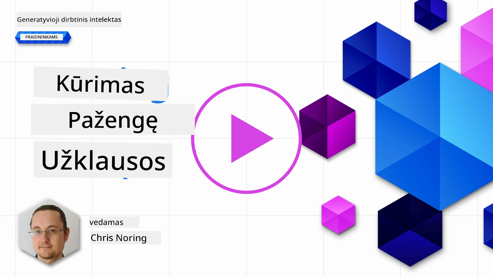

# Išplėstinių užklausų kūrimas

[](https://youtu.be/BAjzkaCdRok?si=NmUIyRf7-cDgbjtt)

Apžvelkime kai kurias išmoktas temas iš ankstesnio skyriaus:

> Užklausų _kūrimas_ yra procesas, kuriuo mes **vedame modelį link tinkamesnių atsakymų** pateikdami naudingesnes instrukcijas ar kontekstą.

Taip pat yra du užklausų rašymo etapai: užklausos konstravimas, pateikiant aktualų kontekstą, ir _optimizavimas_, kaip palaipsniui tobulinti užklausą.

Šiuo metu turime pagrindinį supratimą, kaip rašyti užklausas, tačiau reikia žengti giliau. Šiame skyriuje pereisite nuo įvairių užklausų išbandymo prie supratimo, kodėl viena užklausa yra geresnė nei kita. Išmoksite kurti užklausas, remdamiesi pagrindinėmis technikomis, kurios taikomos bet kuriam LLM.

## Įvadas

Šiame skyriuje aptarsime šias temas:

- Išplėsti savo žinias apie užklausų kūrimą taikant skirtingas technikas savo užklausoms.
- Konfigūruoti savo užklausas, kad keistumėte išvestį.

## Mokymosi tikslai

Baigę šią pamoką, galėsite:

- Taikyti užklausų kūrimo technikas, gerinančias užklausų rezultatą.
- Atlikti užklausas, kurios yra arba įvairios, arba deterministinės.

## Užklausų kūrimas

Užklausų kūrimas yra procesas, kuriuo sudaromos užklausos, kurios duos norimą rezultatą. Tai ne tik tekstinės užklausos rašymas. Užklausų kūrimas nėra inžinerijos disciplina, tai daugiau technikų rinkinys, kurį galite taikyti, kad gautumėte norimą rezultatą.

### Užklausos pavyzdys

Paimkime paprastą užklausą:

> Sugeneruokite 10 klausimų apie geografiją.

Šioje užklausoje taikote kelias skirtingas užklausų technikas.

Išskaidykime tai.

- **Kontekstas**, jūs nurodote, kad tai turi būti apie "geografiją".
- **Išvesties apribojimas**, norite ne daugiau kaip 10 klausimų.

### Paprastų užklausų ribotumai

Galite gauti norimą rezultatą arba ne. Jūs gausite sugeneruotus klausimus, bet geografija yra plati tema ir gali būti, kad negausite to, ko norite dėl šių priežasčių:

- **Plati tema**, nežinote, ar tai bus apie šalis, sostines, upes ir pan.
- **Formatas**, o jei norėtumėte, kad klausimai būtų pateikti tam tikru formatu?

Kaip matote, kuriant užklausas reikia daug ką apsvarstyti.

Iki šiol matėme paprastą užklausos pavyzdį, bet generatyvioji dirbtinis intelektas gali daug daugiau – padėti žmonėms įvairiose rolėse ir pramonės šakose. Toliau apžvelgsime pagrindines technikas.

### Užklausų technikos

Pirmiausia turime suprasti, kad užklausų kūrimas yra _išliekanti_ LLM savybė, reiškianti, kad tai nėra modelio funkcija, o kažkas, ką atrandame naudodamiesi modeliu.

Yra kelios pagrindinės technikos, kurias galime naudoti užklausoms kurti. Panagrinėkime jas.

- **Nulinės užklausos (zero-shot) metodas**, tai pats paprasčiausias užklausos forma. Tai viena užklausa, kuri prašo LLM atsakyti remiantis tik mokymo duomenimis.
- **Kelių pavyzdžių užklausa (few-shot)**, šio tipo užklausa nukreipia LLM, pateikdama vieną ar kelis pavyzdžius, kuriais jis gali remtis generuodamas atsakymą.
- **Minties grandinė (chain-of-thought)**, šis metodas moko LLM, kaip išskaidyti problemą į žingsnius.
- **Generuotos žinios**, norint pagerinti užklausos atsakymą, galima papildomai pateikti sugeneruotą informaciją ar žinias kartu su užklausa.
- **Nuo mažiausio iki didžiausio (least to most)**, panašiai kaip minties grandinė, ši technika kurią problemą išskaido į žingsnius ir prašo juos atlikti paeiliui.
- **Savarankiškas tobulinimas (self-refine)**, ši technika reiškia kritiškai vertinti LLM atsakymą ir tada prašyti jį patobulinti.
- **Maieutica (maieutic prompting)**. Čia norite įsitikinti, kad LLM atsakymas yra teisingas ir prašote jį paaiškinti įvairius atsakymo dalykus. Tai yra savarankiško tobulinimo forma.

### Nulinės užklausos metodas

Šis užklausos būdas labai paprastas, jis susideda iš vienos užklausos. Ši technika tikriausiai yra ta, kurią naudojate pradėdami mokytis apie LLM. Štai pavyzdys:

- Užklausa: "Kas yra algebra?"
- Atsakymas: "Algebra yra matematikos šaka, kuri tiria matematinius simbolius ir taisykles, kaip manipuliuoti šiais simboliais."

### Kelių pavyzdžių užklausa

Ši užklausų forma padeda modeliui suteikdama keletą pavyzdžių kartu su užklausa. Ji susideda iš vienos užklausos su papildomais užduoties specifiniais duomenimis. Štai pavyzdys:

- Užklausa: "Parašyk eilėraštį Šekspyro stiliumi. Štai keletas Šekspyro sonetų pavyzdžių.:
  Sonetas 18: 'Ar lyginsiu tave su vasaros diena? Tu švelnesnė ir rimtesnė...'
  Sonetas 116: 'Neprieštarauju tikrų protų susijungimui. Meilė nėra meilė, kuri keičiasi, kai randa pokytį...'
  Sonetas 132: 'Tavo akis myliu, ir jos, atjaučiančios mane, Žino, kad tavo širdis mane kankina panieka,...'
  Dabar parašyk sonetą apie mėnulio grožį."
- Atsakymas: "Danguje švelniai žiba mėnulis, Sidabrinė šviesa, metanti jo švelnų žavesį,..."

Pavyzdžiai suteikia LLM kontekstą, formatą ar norimą stilių. Jie padeda modeliui suprasti konkrečią užduotį ir sugeneruoti tikslesnius bei atitinkančius atsakymus.

### Minties grandinė

Minties grandinė yra labai įdomi technika, nes ji leidžia LLM atlikti veiksmų seką. Idėja yra nurodyti LLM, kaip atlikti kažką žingsniais. Pažvelkime į pavyzdį, su ir be minties grandinės:

    - Užklausa: "Alice turi 5 obuolius, meta 3 obuolius, duoda 2 Bobui, o Bobas grąžina vieną, kiek obuolių turi Alice?"
    - Atsakymas: 5

LLM atsako 5, kas neteisinga. Teisingas atsakymas yra 1 obuolys, atsižvelgiant į skaičiavimą (5 -3 -2 + 1 = 1).

Kaip galima išmokyti LLM tai padaryti teisingai?

Pabandykime minties grandinę. Taikyti minties grandinę reiškia:

1. Duoti LLM panašų pavyzdį.
1. Pademonstruoti skaičiavimą ir kaip teisingai jį atlikti.
1. Pateikti pirminę užklausą.

Štai kaip:

- Užklausa: "Lisa turi 7 obuolius, meta 1 obuolį, duoda 4 obuolius Bartui, o Bartas grąžina vieną:
  7 -1 = 6
  6 -4 = 2
  2 +1 = 3  
  Alice turi 5 obuolius, meta 3 obuolius, duoda 2 Bobui ir Bobas grąžina vieną, kiek obuolių turi Alice?"
  Atsakymas: 1

Pastebėkite, kad rašome žymiai ilgesnes užklausas su kitu pavyzdžiu, skaičiavimu ir tada pagrindine užklausa ir gauname teisingą atsakymą 1.

Kaip matote, minties grandinė yra labai galinga technika.

### Generuotos žinios

Daugelis kartų, kai norite suformuluoti užklausą, norite naudoti savo įmonės duomenis. Norite, kad dalis užklausos būtų iš įmonės, o kita dalis – tai pati domina užklausa.

Kaip pavyzdys, ši jūsų užklausa gali atrodyti taip, jei dirbate draudimo versle:

```text
{{company}}: {{company_name}}
{{products}}:
{{products_list}}
Please suggest an insurance given the following budget and requirements:
Budget: {{budget}}
Requirements: {{requirements}}
```

Viršuje matote, kaip užklausa sukonstruota naudojant šabloną. Šablone yra keletas kintamųjų, pažymėtų `{{variable}}`, kurie bus pakeisti aktualiomis reikšmėmis iš įmonės API.

Štai kaip užklausa galėtų atrodyti, kai kintamieji pakeisti jūsų įmonės turiniu:

```text
Insurance company: ACME Insurance
Insurance products (cost per month):
- Car, cheap, 500 USD
- Car, expensive, 1100 USD
- Home, cheap, 600 USD
- Home, expensive, 1200 USD
- Life, cheap, 100 USD

Please suggest an insurance given the following budget and requirements:
Budget: $1000
Requirements: Car, Home, and Life insurance
```

Paleidus šią užklausą per LLM, bus gautas toks atsakymas:

```output
Given the budget and requirements, we suggest the following insurance package from ACME Insurance:
- Car, cheap, 500 USD
- Home, cheap, 600 USD
- Life, cheap, 100 USD
Total cost: $1,200 USD
```

Kaip matote, taip pat siūloma gyvybės draudimas, ko neturėtų būti. Šis rezultatas rodo, kad reikia optimizuoti užklausą pakeičiant ją aiškesne, ko galima leisti. Po kai kurių _bandymų ir klaidų_ gauname šią užklausą:

```text
Insurance company: ACME Insurance
Insurance products (cost per month):
- type: Car, cheap, cost: 500 USD
- type: Car, expensive, cost: 1100 USD
- type: Home, cheap, cost: 600 USD
- type: Home, expensive, cost: 1200 USD
- type: Life, cheap, cost: 100 USD

Please suggest an insurance given the following budget and requirements:
Budget: $1000 restrict choice to types: Car, Home
```

Pastebėkite, kaip pridėjus _tipą_, _kainą_ ir panaudojus raktinį žodį _riboti_ padeda LLM geriau suprasti, ko norime.

Dabar gauname tokį atsakymą:

```output
Given the budget and requirements, we suggest the Car, Cheap insurance product which costs 500 USD per month.
```

Šio pavyzdžio tikslas buvo parodyti, kad nors naudojame paprastą techniką kaip _generuotos žinios_, daugeliu atvejų vis tiek reikia optimizuoti užklausą norint gauti norimą rezultatą.

### Nuo mažiausio iki didžiausio

Idėja su Least-to-most užklausa yra išskaidyti didesnę problemą į smulkesnes problemas. Tokiu būdu padedate nukreipti LLM, kaip „įveikti“ didesnę problemą. Geras pavyzdys galėtų būti duomenų mokslas, kai galite paprašyti LLM padalyti problemą taip:

> Užklausa: Kaip atlikti duomenų mokslą per 5 žingsnius?

Jūsų AI padėjėjas atsakytų:

1. Surinkti duomenis
1. Išvalyti duomenis
1. Analizuoti duomenis
1. Nupiešti duomenis
1. Pristatyti duomenis

### Savarankiškas tobulinimas, kritikuokite rezultatus

Su generatyviniu DI ir LLM negalite visiškai pasitikėti išvestimi. Turite ją patikrinti. Galų gale, LLM tiesiog pateikia jums, kas greičiausiai bus toliau sakoma, o ne kas yra teisinga. Todėl gera idėja yra paprašyti LLM save kritikuoti, kas veda prie savarankiško tobulinimo technikos.

Kaip tai veikia:

1. Pradinė užklausa LLM spręsti problemą
1. LLM atsako
1. Jūs kritikuojate atsakymą ir prašote DI patobulinti
1. LLM vėl atsako, atsižvelgdamas į kritiką ir siūlo sprendimus

Šį procesą galite kartoti tiek kartų, kiek norite.

Štai pavyzdys naudojant šią techniką:

> Užklausa: "Sukurk Python Web API su maršrutais products ir customers"

DI atsakymas:

```python
import flask
app = Flask(__name__)

@app.route('/products')
def products():
    return 'Products'

@app.route('/customers')
def customers():
    return 'Customers'
```

> Užklausa: pasiūlyk 3 patobulinimus aukščiau pateiktam kodui

DI atsakymas:

```text
Sure, here are three suggestions to improve the code:

Import the correct module: The first line should import Flask instead of flask. The correct import statement should be from flask import Flask.

Add a main function: Add a if __name__ == '__main__': block to the end of the file to run the application when the file is executed.

Use f-strings: Use f-strings to format the return statements in the route functions. For example, return 'Products' can be changed to return f'This is the {request.path} page'.
```

```python
from flask import Flask, request

app = Flask(__name__)

@app.route('/products')
def products():
    return f'This is the {request.path} page'

@app.route('/customers')
def customers():
    return f'This is the {request.path} page'

if __name__ == '__main__':
    app.run()
```

Kaip matote, aukščiau pateiktas DI atsakymas tobulina pirmą pateiktą kodą kritikų dėka.

### Maieutic užklausa

Maieutic užklausa yra technika, panaši į savarankišką tobulinimą, tačiau labiau orientuota į LLM prašymą paaiškinti save. Tikslas – sumažinti prieštaravimus LLM atsakyme ir užtikrinti teisingą atsakymą. Sekti reikia tokį procesą:

1. Paprašyti LLM atsakyti į klausimą
1. Kiekvienai atsakymo daliai paprašyti LLM paaiškinti išsamiau.
1. Jei yra prieštaravimų, atmesti prieštaringas dalis.

Kartokite 2 ir 3, kol peržiūrėsite visas dalis ir būsite patenkinti atsakymu.

Štai pavyzdinė užklausa:

> užklausa: Kaip sukurti krizių planą, skirtą pandemijos mažinimui per 5 žingsnius?
> LLM atsakymas:

```text
1. Identify the risks
1. Identify the stakeholders
1. Identify the resources
1. Identify the actions
1. Identify the communication channels
```

Identifikuota 5 žingsniai, bet ar galime nustatyti, ar tai teisinga? Paprašykime LLM išsamiau paaiškinti kiekvieną žingsnį:

> užklausa: Paaiškink pirmą žingsnį išsamiau, kokios yra pandemijos rizikos detalizuotai?

```text
The risks are the following:

- Loss of life
- Loss of business
- Loss of reputation
- Loss of customers
- Loss of employees
```

Šiuo metu norime įsitikinti, kad LLM yra teisingas, todėl paprašome paaiškinti pirmą riziką išsamiau ir tikimės, kad ji sutaps su aukščiau pateiktu atsakymu:

> užklausa: Pandemijos atveju, kuri yra didžiausia rizika ir kodėl?

```text
The biggest risk is loss of life because it's the most important thing to protect.
```

> Kokios yra dvi didžiausios rizikos pandemijoje?

```text
The two biggest risks are loss of life and loss of business.
```

Šiuo momentu LLM yra nuoseklus ir mini „gyvenimą“ ir „verslą“ kaip dvi didžiausias rizikas. Dabar galime tęsti į kitą žingsnį ir jaustis gana užtikrintai. Tačiau neturėtume aklai tikėti LLM, visuomet reikia patikrinti atsakymą.

## Kituokite savo išvestį

LLM pagal prigimtį yra nedeterministiniai, tai reiškia, kad kiekvieną kartą paleidus tą pačią užklausą, gausite skirtingą rezultatą. Išbandykite šią užklausą pavyzdžiui:

> „Sugeneruokite Python Web API kodą“

```python
# Importuoti reikiamus modulius
import flask
from flask import request, jsonify

# Sukurti Flask programėlę
app = flask.Flask(__name__)

# Sukurti maršrutą API
@app.route('/api', methods=['GET'])
def api():
    # Gauti duomenis iš užklausos
    data = request.args

    # Apdoroti duomenis
    result = process_data(data)

    # Grąžinti rezultatą JSON formatu
    return jsonify(result)

# Funkcija duomenims apdoroti
def process_data(data):
    # Atlikti veiksmą su duomenimis
    result = data + 1

    # Grąžinti rezultatą
    return result

# Paleisti programėlę
if __name__ == '__main__':
    app.run()

```

Paleidus tą pačią užklausą dar kartą, sugeneruojamas šiek tiek skirtingas atsakymas:

```python
#importuoti reikiamas paketas
import flask
from flask import request, jsonify

#sukurti Flask programą
app = flask.Flask(__name__)
app.config["DEBUG"] = True

#sukurti knygų sąrašą
books = [
    {'id': 0,
     'title': 'A Fire Upon the Deep',
     'author': 'Vernor Vinge',
     'first_sentence': 'The coldsleep itself was dreamless.',
     'year_published': '1992'},
    {'id': 1,
     'title': 'The Ones Who Walk Away From Omelas',
     'author': 'Ursula K. Le Guin',
     'first_sentence': 'With a clamor of bells that set the swallows soaring, the Festival of Summer came to the city Omelas, bright-towered by the sea.',
     'published': '1973'},
    {'id': 2,
     'title': 'Dhalgren',
     'author': 'Samuel R. Delany',
     'first_sentence': 'to wound the autumnal city.',
     'published': '1975'}
]

#sukurti API galinį tašką
@app.route('/', methods=['GET'])
def home():
    return '''<h1>Books API</h1>
<p>A prototype API for retrieving books.</p>'''

#sukurti galinį tašką, kuris grąžina visas knygas
@app.route('/api/v1/resources/books/all', methods=['GET'])
def api_all():
    return jsonify(books)

#sukurti galinį tašką, kuris grąžina vieną knygą
@app.route('/api/v1/resources/books', methods=['GET'])
def api_id():
    #patikrinti, ar ID buvo pateiktas URL dalyje
    #jei ID pateiktas, priskirti jį kintamajam
    #jei ID nepateiktas, parodyti klaidą
    if 'id' in request.args:
        id = int(request.args['id'])
    else:
        return "Error: No id field provided. Please specify an id."

    #sukurti tuščią sąrašą mūsų rezultatams
    results = []

    #pereiti per duomenis ir surasti atitinkančius prašomą ID rezultatus
    #ID yra unikalūs, bet kiti laukai gali grąžinti daug rezultatų
    for book in books:
        if book['id'] == id:
            results.append(book)

    #naudoti Flask funkciją jsonify, kad konvertuotume sąrašą
    #Python žodynų į JSON formatą
    return jsonify(results)

app.run()
```

> Ar tai, kad išvestis skirtinga, yra problema?

Priklauso nuo to, ką bandote daryti. Jei norite konkretaus atsakymo, tuomet tai problema. Jei esate patenkintas įvairia išvestimi, pavyzdžiui, „Sugeneruok bet kokius 3 klausimus apie geografiją“, tai problema nėra.

### Naudojant temperatūrą išvesties variacijai reguliuoti

Gerai, nusprendėme apriboti išvestį, kad ji būtų labiau prognozuojama, t.y. labiau deterministinė. Kaip tai padaryti?

Temperatūra yra reikšmė nuo 0 iki 1, kur 0 – labiausiai deterministiška, o 1 – labiausiai įvairi. Numatytoji reikšmė yra 0,7. Pažiūrėkime, kas nutinka paleidus tą pačią užklausą du kartus, nustatant temperatūrą 0,1:

> „Sugeneruok Python Web API kodą“

```python
#importuoti reikalingas bibliotekas
import flask
from flask import request, jsonify

#sukurti Flask klasės egzempliorių
app = flask.Flask(__name__)

#sukurti API galinį tašką
@app.route('/api/v1/endpoint', methods=['GET'])
def api_endpoint():
    #gauti užklausos duomenis
    data = request.get_json()

    #apdoroti duomenis
    result = process_data(data)

    #grąžinti rezultatą
    return jsonify(result)

#funkcija duomenims apdoroti
def process_data(data):
    #apdoroti duomenis
    result = {'result': 'success'}

    #grąžinti rezultatą
    return result

#paleisti Flask programą
if __name__ == '__main__':
    app.run()

```

Paleidus vėl gauname tokį rezultatą:

```python
#importuoti reikiamas bibliotekas
import flask
from flask import request, jsonify

#sukurti Flask programą
app = flask.Flask(__name__)

#sukurti API maršrutą
@app.route('/api', methods=['GET'])
def api_call():
    #gauti duomenis iš užklausos
    data = request.get_json()

    #apdoroti duomenis
    result = process_data(data)

    #grąžinti rezultatą
    return jsonify(result)

#apibrėžti process_data funkciją
def process_data(data):
    #kažką daryti su duomenimis
    result = data + 1

    #grąžinti rezultatą
    return result

#paleisti programą
if __name__ == '__main__':
    app.run()

```

Šių dviejų išvestių skirtumas labai mažas. Dabar darykime priešingai – nustatykime temperatūrą 0,9:

```python
# Importuokite reikalingas bibliotekas
import flask
from flask import request, jsonify

# Sukurkite Flask programėlę
app = flask.Flask(__name__)

# Sukurkite API maršrutą
@app.route('/api', methods=['GET'])
def api_call():
    # Gaukite duomenis iš užklausos
    data = request.args

    # Apdorokite duomenis
    result = process_data(data)

    # Grąžinkite rezultatą
    return jsonify(result)

# Funkcija duomenims apdoroti
def process_data(data):
    # Atlikite ką nors su duomenimis
    result = data + 1

    # Grąžinkite rezultatą
    return result

# Paleiskite programėlę
if __name__ == '__main__':
    app.run()

```

ir antras bandymas su temperatūra 0,9:

```python
import flask
from flask import request, jsonify

# sukurti Flask programėlę
app = flask.Flask(__name__)
app.config['DEBUG'] = True

# sukurti kai kuriuos testinius duomenis
books = [
    {'id': 0, 'title': 'A Fire Upon The Deep', 'author': 'Vernor Vinge', 'first_sentence': 'The coldsleep itself was dreamless.', 'year_published': '1992'},
    {'id': 1, 'title': 'The Ones Who Walk Away From Omelas', 'author': 'Ursula K. Le Guin', 'first_sentence': 'With a clamor of bells that set the swallows soaring, the Festival of Summer came to the city Omelas, bright-towered by the sea.', 'published': '1973'},
    {'id': 2, 'title': 'Dhalgren', 'author': 'Samuel R. Delany', 'first_sentence': 'to wound the autumnal city.', 'published': '1975'}
]

# sukurti galinį tašką
@app.route('/', methods=['GET'])
def home():
    return '''<h1>Welcome to our book API!</h1>'''

@app.route('/api/v1/resources/books

```

Kaip matote, rezultatai yra be galo įvairūs.
> Atkreipkite dėmesį, kad yra daugiau parametrų, kuriuos galite keisti norėdami įvairovinti išvestį, pavyzdžiui, top-k, top-p, pakartojimo bauda, ilgio bauda ir įvairovės bauda, tačiau šie dalykai yra už šio mokymo kurso ribų.

## Geros praktikos

Yra daug praktikų, kurias galite taikyti, kad gautumėte norimą rezultatą. Jūs rasite savo stilių naudodamiesi paklausimus vis daugiau.

Be technikų, kurias aptarėme, yra keletas gerų praktikų, kurias verta apsvarstyti formuluojant klausimus dideliems kalbos modeliams (LLM).

Štai keletas gerų praktikų, kurias verta apsvarstyti:

- **Nurodykite kontekstą**. Kontekstas svarbus, kuo daugiau galite nurodyti, pavyzdžiui, sritį, temą ir pan., tuo geriau.
- Apribokite išvestį. Jei norite tam tikro elementų skaičiaus arba tam tikro ilgio, nurodykite tai.
- **Nurodykite tiek ką, tiek kaip**. Prisiminkite paminėti tiek ką norite, tiek kaip norite, pavyzdžiui „Sukurkite Python Web API su maršrutais products ir customers, padalinkite jį į 3 failus“.
- **Naudokite šablonus**. Dažnai norėsite praturtinti savo paklausimus duomenimis iš savo įmonės. Tam naudokite šablonus. Šablonai gali turėti kintamuosius, kuriuos pakeičiate tikrais duomenimis.
- **Rašykite taisyklingai**. LLM gali pateikti teisingą atsakymą, tačiau jei rašysite taisyklingai, gausite geresnį atsakymą.

## Užduotis

Štai Python kodas, rodantis, kaip sukurti paprastą API naudojant Flask:

```python
from flask import Flask, request

app = Flask(__name__)

@app.route('/')
def hello():
    name = request.args.get('name', 'World')
    return f'Hello, {name}!'

if __name__ == '__main__':
    app.run()
```

Naudokite AI asistentą, tokį kaip GitHub Copilot arba ChatGPT, ir taikykite „self-refine“ techniką, kad pagerintumėte kodą.

## Sprendimas

Pabandykite išspręsti užduotį pridėdami tinkamus paklausimus prie kodo.

> [!TIP]
> Formuluokite paklausimą, prašydami patobulinti, gerai apriboti patobulinimų skaičių. Taip pat galite prašyti patobulinti tam tikru aspektu, pvz., architektūra, našumu, saugumu ir pan.

[Sprendimas](../../../05-advanced-prompts/python/aoai-solution.py)

## Žinių patikrinimas

Kodėl naudotumėte chain-of-thought paklausimą? Parodykite man 1 teisingą atsakymą ir 2 neteisingus atsakymus.

1. Kad išmokytumėte LLM, kaip spręsti problemą.
1. B, Kad išmokytumėte LLM rasti klaidas kode.
1. C, Kad nurodytumėte LLM pasiūlyti skirtingus sprendimus.

A: 1, nes chain-of-thought reiškia parodyti LLM, kaip spręsti problemą, pateikiant jam žingsnių seką, panašias problemas ir kaip jos buvo sprendžiamos.

## 🚀 Iššūkis

Jūs ką tik pritaikėte self-refine techniką užduotyje. Paimkite bet kurį sukurtą programą ir apsvarstykite, kokius patobulinimus norėtumėte pritaikyti. Dabar naudokite self-refine techniką, kad įgyvendintumėte pasiūlytus pakeitimus. Koks, jūsų nuomone, buvo rezultatas – geresnis ar blogesnis?

## Puikus darbas! Tęskite mokymąsi

Baigę šią pamoką, apsilankykite mūsų [Generatyvios AI mokymosi kolekcijoje](https://aka.ms/genai-collection?WT.mc_id=academic-105485-koreyst), kad toliau gilintumėte savo žinias apie generatyviąją AI!

Pereikite prie 6 pamokos, kur pritaikysime žinias apie paklausimų inžineriją, [kuriant teksto generavimo programas](../06-text-generation-apps/README.md?WT.mc_id=academic-105485-koreyst)

---

<!-- CO-OP TRANSLATOR DISCLAIMER START -->
**Atsakomybės apribojimas**:
Šis dokumentas buvo išverstas naudojant dirbtinio intelekto vertimo paslaugą [Co-op Translator](https://github.com/Azure/co-op-translator). Nors siekiame tikslumo, prašome atkreipti dėmesį, kad automatiniai vertimai gali turėti klaidų ar netikslumų. Originalus dokumentas jo gimtąja kalba laikomas autoritetingu šaltiniu. Svarbiai informacijai rekomenduojama naudoti profesionalų žmogiškąjį vertimą. Mes neatsakome už jokius nesusipratimus ar neteisingą interpretaciją, kilusią naudojantis šiuo vertimu.
<!-- CO-OP TRANSLATOR DISCLAIMER END -->