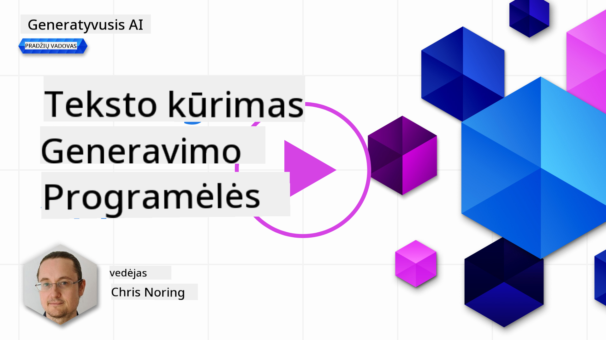

<!--
CO_OP_TRANSLATOR_METADATA:
{
  "original_hash": "ce8224073b86b728ed52b19bed7932fd",
  "translation_date": "2025-08-25T12:31:03+00:00",
  "source_file": "06-text-generation-apps/README.md",
  "language_code": "lt"
}
-->
# Teksto generavimo programėlių kūrimas

[](https://aka.ms/gen-ai-lesson6-gh?WT.mc_id=academic-105485-koreyst)

> _(Paspauskite ant paveikslėlio aukščiau, kad peržiūrėtumėte šios pamokos vaizdo įrašą)_

Šioje mokymų programoje jau matėte, kad yra pagrindinės sąvokos, tokios kaip raginimai (prompts), ir net visa sritis, vadinama „promptų inžinerija“. Daugybė įrankių, su kuriais galite bendrauti, pavyzdžiui, ChatGPT, Office 365, Microsoft Power Platform ir kiti, leidžia jums naudoti raginimus norint pasiekti norimą rezultatą.

Norėdami pridėti tokią patirtį prie savo programėlės, turite suprasti tokias sąvokas kaip raginimai, užbaigimai (completions) ir pasirinkti biblioteką darbui. Būtent to ir išmoksite šiame skyriuje.

## Įvadas

Šiame skyriuje jūs:

- Susipažinsite su openai biblioteka ir jos pagrindinėmis sąvokomis.
- Sukursite teksto generavimo programėlę naudodami openai.
- Suprasite, kaip naudoti tokias sąvokas kaip raginimas, temperatūra ir žetonai (tokens), kad sukurtumėte teksto generavimo programėlę.

## Mokymosi tikslai

Pamokos pabaigoje galėsite:

- Paaiškinti, kas yra teksto generavimo programėlė.
- Sukurti teksto generavimo programėlę naudodami openai.
- Konfigūruoti savo programėlę naudoti daugiau ar mažiau žetonų ir keisti temperatūrą, kad gautumėte įvairų rezultatą.

## Kas yra teksto generavimo programėlė?

Paprastai, kai kuriate programėlę, ji turi tam tikrą sąsają, pavyzdžiui:

- Komandų pagrindu. Konsolinės programėlės – tai tipinės programėlės, kuriose įvedate komandą ir ji atlieka užduotį. Pavyzdžiui, `git` yra komandų pagrindu veikianti programėlė.
- Vartotojo sąsaja (UI). Kai kurios programėlės turi grafinę vartotojo sąsają (GUI), kurioje spaudžiate mygtukus, įvedate tekstą, pasirenkate parinktis ir pan.

### Konsolinės ir UI programėlės turi ribotumų

Palyginkite su komandų pagrindu veikiančia programėle, kurioje įvedate komandą:

- **Jos ribotos**. Negalite įvesti bet kokios komandos, tik tas, kurias programėlė palaiko.
- **Kalbos specifika**. Kai kurios programėlės palaiko daug kalbų, bet pagal nutylėjimą programėlė kuriama konkrečiai kalbai, net jei galima pridėti daugiau kalbų palaikymo.

### Teksto generavimo programėlių privalumai

Tai kuo teksto generavimo programėlė skiriasi?

Teksto generavimo programėlėje turite daugiau lankstumo, nesate apriboti komandų rinkiniu ar konkrečia įvesties kalba. Vietoj to galite naudoti natūralią kalbą bendrauti su programėle. Kitas privalumas – jūs jau bendraujate su duomenų šaltiniu, kuris buvo apmokytas su didžiuliu informacijos kiekiu, kai tuo tarpu tradicinė programėlė gali būti apribota tik tuo, kas yra duomenų bazėje.

### Ką galima sukurti su teksto generavimo programėle?

Galima sukurti daug ką. Pavyzdžiui:

- **Pokalbių robotą**. Pokalbių robotas, atsakantis į klausimus apie temas, pavyzdžiui, jūsų įmonę ir jos produktus, gali būti puikus pasirinkimas.
- **Pagalbininką**. LLM puikiai tinka tekstų santraukų kūrimui, įžvalgų gavimui iš teksto, tekstų kūrimui, pvz., gyvenimo aprašymų ir pan.
- **Kodo asistentą**. Priklausomai nuo naudojamo kalbos modelio, galite sukurti kodo asistentą, kuris padės rašyti kodą. Pavyzdžiui, galite naudoti GitHub Copilot ar ChatGPT, kad padėtų rašyti kodą.

## Kaip pradėti?

Reikia rasti būdą, kaip integruotis su LLM, o tai dažniausiai apima du pagrindinius būdus:

- Naudoti API. Čia kuriate žiniatinklio užklausas su savo raginimu ir gaunate sugeneruotą tekstą atgal.
- Naudoti biblioteką. Bibliotekos padeda apgaubti API užklausas ir padaro jas lengviau naudojamas.

## Bibliotekos/SDK

Yra keletas gerai žinomų bibliotekų darbui su LLM, pavyzdžiui:

- **openai**, ši biblioteka leidžia lengvai prisijungti prie savo modelio ir siųsti raginimus.

Taip pat yra bibliotekų, veikiančių aukštesniu lygiu, pavyzdžiui:

- **Langchain**. Langchain yra gerai žinoma ir palaiko Python.
- **Semantic Kernel**. Semantic Kernel yra Microsoft biblioteka, palaikanti C#, Python ir Java kalbas.

## Pirmoji programėlė su openai

Pažiūrėkime, kaip galime sukurti savo pirmąją programėlę, kokių bibliotekų reikia, kiek darbo reikia įdėti ir pan.

### Įdiekite openai

Yra daug bibliotekų, skirtų darbui su OpenAI ar Azure OpenAI. Galima naudoti įvairias programavimo kalbas, tokias kaip C#, Python, JavaScript, Java ir kt. Mes pasirinkome naudoti `openai` Python biblioteką, tad ją įdiegsime su `pip`.

```bash
pip install openai
```

### Sukurkite resursą

Turite atlikti šiuos veiksmus:

- Susikurkite paskyrą Azure [https://azure.microsoft.com/free/](https://azure.microsoft.com/free/?WT.mc_id=academic-105485-koreyst).
- Gaukite prieigą prie Azure OpenAI. Eikite į [https://learn.microsoft.com/azure/ai-services/openai/overview#how-do-i-get-access-to-azure-openai](https://learn.microsoft.com/azure/ai-services/openai/overview#how-do-i-get-access-to-azure-openai?WT.mc_id=academic-105485-koreyst) ir užpildykite prašymą dėl prieigos.

  > [!NOTE]
  > Rašymo metu reikia pateikti prašymą dėl prieigos prie Azure OpenAI.

- Įdiekite Python <https://www.python.org/>
- Sukurkite Azure OpenAI Service resursą. Kaip sukurti resursą, žiūrėkite šiame gide: [create a resource](https://learn.microsoft.com/azure/ai-services/openai/how-to/create-resource?pivots=web-portal?WT.mc_id=academic-105485-koreyst).

### Suraskite API raktą ir galinį tašką

Šiuo metu turite nurodyti savo `openai` bibliotekai, kokį API raktą naudoti. Norėdami rasti savo API raktą, eikite į „Keys and Endpoint“ skiltį savo Azure OpenAI resurse ir nukopijuokite „Key 1“ reikšmę.


Kai jau turite šią informaciją, nurodykite bibliotekoms ją naudoti.

> [!NOTE]
> Verta atskirti savo API raktą nuo kodo. Tai galite padaryti naudodami aplinkos kintamuosius.
>
> - Nustatykite aplinkos kintamąjį `OPENAI_API_KEY` į savo API raktą.
>   `export OPENAI_API_KEY='sk-...'`

### Azure konfigūracijos nustatymas

Jei naudojate Azure OpenAI, štai kaip nustatyti konfigūraciją:

```python
openai.api_type = 'azure'
openai.api_key = os.environ["OPENAI_API_KEY"]
openai.api_version = '2023-05-15'
openai.api_base = os.getenv("API_BASE")
```

Aukščiau nustatome:

- `api_type` į `azure`. Tai nurodo bibliotekai naudoti Azure OpenAI, o ne OpenAI.
- `api_key` – tai jūsų API raktas, kurį rasite Azure portale.
- `api_version` – tai API versija, kurią norite naudoti. Rašymo metu naujausia versija yra `2023-05-15`.
- `api_base` – tai API galinis taškas. Jį rasite Azure portale šalia savo API rakto.

> [!NOTE] > `os.getenv` yra funkcija, kuri nuskaito aplinkos kintamuosius. Ją galite naudoti norėdami nuskaityti tokius kintamuosius kaip `OPENAI_API_KEY` ir `API_BASE`. Nustatykite šiuos kintamuosius terminale arba naudodami tokią biblioteką kaip `dotenv`.

## Teksto generavimas

Tekstui generuoti naudojama `Completion` klasė. Štai pavyzdys:

```python
prompt = "Complete the following: Once upon a time there was a"

completion = openai.Completion.create(model="davinci-002", prompt=prompt)
print(completion.choices[0].text)
```

Aukščiau esančiame kode sukuriame completion objektą ir perduodame modelį, kurį norime naudoti, bei raginimą. Tada atspausdiname sugeneruotą tekstą.

### Pokalbių užbaigimai

Iki šiol matėte, kaip naudojome `Completion` tekstui generuoti. Tačiau yra ir kita klasė – `ChatCompletion`, kuri labiau tinka pokalbių robotams. Štai pavyzdys, kaip ją naudoti:

```python
import openai

openai.api_key = "sk-..."

completion = openai.ChatCompletion.create(model="gpt-3.5-turbo", messages=[{"role": "user", "content": "Hello world"}])
print(completion.choices[0].message.content)
```

Daugiau apie šią funkciją – kitame skyriuje.

## Užduotis – jūsų pirmoji teksto generavimo programėlė

Dabar, kai išmokome, kaip nustatyti ir konfigūruoti openai, laikas sukurti savo pirmąją teksto generavimo programėlę. Norėdami ją sukurti, atlikite šiuos veiksmus:

1. Sukurkite virtualią aplinką ir įdiekite openai:

   ```bash
   python -m venv venv
   source venv/bin/activate
   pip install openai
   ```

   > [!NOTE]
   > Jei naudojate Windows, rašykite `venv\Scripts\activate` vietoj `source venv/bin/activate`.

   > [!NOTE]
   > Savo Azure OpenAI raktą rasite nuėję į [https://portal.azure.com/](https://portal.azure.com/?WT.mc_id=academic-105485-koreyst), paieškoje įveskite `Open AI`, pasirinkite `Open AI resource`, tada pasirinkite `Keys and Endpoint` ir nukopijuokite `Key 1` reikšmę.

1. Sukurkite _app.py_ failą ir įdėkite į jį šį kodą:

   ```python
   import openai

   openai.api_key = "<replace this value with your open ai key or Azure OpenAI key>"

   openai.api_type = 'azure'
   openai.api_version = '2023-05-15'
   openai.api_base = "<endpoint found in Azure Portal where your API key is>"
   deployment_name = "<deployment name>"

   # add your completion code
   prompt = "Complete the following: Once upon a time there was a"
   messages = [{"role": "user", "content": prompt}]

   # make completion
   completion = openai.chat.completions.create(model=deployment_name, messages=messages)

   # print response
   print(completion.choices[0].message.content)
   ```

   > [!NOTE]
   > Jei naudojate Azure OpenAI, turite nustatyti `api_type` į `azure` ir `api_key` į savo Azure OpenAI raktą.

   Turėtumėte pamatyti tokį rezultatą:

   ```output
    very unhappy _____.

   Once upon a time there was a very unhappy mermaid.
   ```

## Skirtingi raginimų tipai skirtingiems tikslams

Dabar matėte, kaip generuoti tekstą naudojant raginimą. Jūs jau turite veikiančią programą, kurią galite keisti ir pritaikyti įvairių tipų tekstui generuoti.

Raginimai gali būti naudojami įvairioms užduotims. Pavyzdžiui:

- **Sugeneruoti tam tikrą tekstą**. Pavyzdžiui, galite sugeneruoti eilėraštį, klausimus viktorinai ir pan.
- **Ieškoti informacijos**. Raginimus galite naudoti ieškodami informacijos, pavyzdžiui: „Ką reiškia CORS žiniatinklio programavime?“.
- **Generuoti kodą**. Raginimus galite naudoti kodui generuoti, pavyzdžiui, sukurti reguliariąją išraišką el. pašto validavimui ar net sugeneruoti visą programą, pvz., žiniatinklio programėlę.

## Daugiau praktinis pavyzdys: receptų generatorius

Įsivaizduokite, kad namuose turite ingredientų ir norite kažką pagaminti. Tam reikia recepto. Vienas būdas rasti receptų – naudoti paieškos sistemą, arba galite pasitelkti LLM.

Galite parašyti tokį raginimą:

> „Parodyk 5 receptus patiekalui su šiais ingredientais: vištiena, bulvės ir morkos. Prie kiekvieno recepto išvardink visus naudotus ingredientus“

Pagal šį raginimą galite gauti tokį atsakymą:

```output
1. Roasted Chicken and Vegetables:
Ingredients:
- 4 chicken thighs
- 2 potatoes, cut into cubes
- 2 carrots, cut into cubes
- 2 tablespoons olive oil
- 2 cloves garlic, minced
- 1 teaspoon dried thyme
- 1 teaspoon dried oregano
- Salt and pepper, to taste

2. Chicken and Potato Stew:
Ingredients:
- 2 tablespoons olive oil
- 1 onion, diced
- 2 cloves garlic, minced
- 2 chicken breasts, cut into cubes
- 2 potatoes, cut into cubes
- 2 carrots, cut into cubes
- 1 teaspoon dried oregano
- 1 teaspoon dried thyme
- 1 cup chicken broth
- Salt and pepper, to taste

3. Chicken and Potato Bake:
Ingredients:
- 2 tablespoons olive oil
- 2 chicken breasts, cut into cubes
- 2 potatoes, cut into cubes
- 2 carrots, cut into cubes
- 1 onion, diced
- 2 cloves garlic, minced
- 1 teaspoon dried oregano
- 1 teaspoon dried thyme
- 1 cup chicken broth
- Salt and pepper, to taste

4. Chicken and Potato Soup:
Ingredients:
- 2 tablespoons olive oil
- 1 onion, diced
- 2 cloves garlic, minced
- 2 chicken breasts, cut into cubes
- 2 potatoes, cut into cubes
- 2 carrots, cut into cubes
- 1 teaspoon dried oregano
- 1 teaspoon dried thyme
- 4 cups chicken broth
- Salt and pepper, to taste

5. Chicken and Potato Hash:
Ingredients:
- 2 tablespoons olive oil
- 2 chicken breasts, cut into cubes
- 2 potatoes, cut into cubes
- 2 carrots, cut into cubes
- 1 onion, diced
- 2 cloves garlic, minced
- 1 teaspoon dried oregano
```

Šis rezultatas puikus – žinau, ką gaminti. Šiuo metu naudingi patobulinimai galėtų būti:

- Išfiltruoti ingredientus, kurių nemėgstu ar kuriems esu alergiškas.
- Sudaryti pirkinių sąrašą, jei namuose neturiu visų ingredientų.

Šiems atvejams pridėkime papildomą raginimą:

> „Pašalink receptus su česnaku, nes esu jam alergiškas, ir pakeisk jį kuo nors kitu. Taip pat sudaryk pirkinių sąrašą šiems receptams, atsižvelgiant į tai, kad jau turiu vištienos, bulvių ir morkų.“

Dabar gaunate naują rezultatą:

```output
1. Roasted Chicken and Vegetables:
Ingredients:
- 4 chicken thighs
- 2 potatoes, cut into cubes
- 2 carrots, cut into cubes
- 2 tablespoons olive oil
- 1 teaspoon dried thyme
- 1 teaspoon dried oregano
- Salt and pepper, to taste

2. Chicken and Potato Stew:
Ingredients:
- 2 tablespoons olive oil
- 1 onion, diced
- 2 chicken breasts, cut into cubes
- 2 potatoes, cut into cubes
- 2 carrots, cut into cubes
- 1 teaspoon dried oregano
- 1 teaspoon dried thyme
- 1 cup chicken broth
- Salt and pepper, to taste

3. Chicken and Potato Bake:
Ingredients:
- 2 tablespoons olive oil
- 2 chicken breasts, cut into cubes
- 2 potatoes, cut into cubes
- 2 carrots, cut into cubes
- 1 onion, diced
- 1 teaspoon dried oregano
- 1 teaspoon dried thyme
- 1 cup chicken broth
- Salt and pepper, to taste

4. Chicken and Potato Soup:
Ingredients:
- 2 tablespoons olive oil
- 1 onion, diced
- 2 chicken breasts, cut into cubes
- 2 potatoes, cut into cubes
- 2 carrots, cut into cubes
- 1 teaspoon dried oregano
- 1 teaspoon dried thyme
- 4 cups chicken broth
- Salt and pepper, to taste

5. Chicken and Potato Hash:
Ingredients:
- 2 tablespoons olive oil
- 2 chicken breasts, cut into cubes
- 2 potatoes, cut into cubes
- 2 carrots, cut into cubes
- 1 onion, diced
- 1 teaspoon dried oregano

Shopping List:
- Olive oil
- Onion
- Thyme
- Oregano
- Salt
- Pepper
```

Štai jūsų penki receptai, be česnako, ir taip pat pirkinių sąrašas, atsižvelgiant į tai, ką jau turite namuose.

## Užduotis – sukurkite receptų generatorių

Dabar, kai išbandėme scenarijų, parašykime kodą, atitinkantį parodytą situaciją. Norėdami tai padaryti, atlikite šiuos veiksmus:

1. Naudokite esamą _app.py_ failą kaip pradžios tašką
1. Suraskite `prompt` kintamąjį ir pakeiskite jo kodą į šį:

   ```python
   prompt = "Show me 5 recipes for a dish with the following ingredients: chicken, potatoes, and carrots. Per recipe, list all the ingredients used"
   ```

   Jei dabar paleisite kodą, turėtumėte pamatyti panašų rezultatą:

   ```output
   -Chicken Stew with Potatoes and Carrots: 3 tablespoons oil, 1 onion, chopped, 2 cloves garlic, minced, 1 carrot, peeled and chopped, 1 potato, peeled and chopped, 1 bay leaf, 1 thyme sprig, 1/2 teaspoon salt, 1/4 teaspoon black pepper, 1 1/2 cups chicken broth, 1/2 cup dry white wine, 2 tablespoons chopped fresh parsley, 2 tablespoons unsalted butter, 1 1/2 pounds boneless, skinless chicken thighs, cut into 1-inch pieces
   -Oven-Roasted Chicken with Potatoes and Carrots: 3 tablespoons extra-virgin olive oil, 1 tablespoon Dijon mustard, 1 tablespoon chopped fresh rosemary, 1 tablespoon chopped fresh thyme, 4 cloves garlic, minced, 1 1/2 pounds small red potatoes, quartered, 1 1/2 pounds carrots, quartered lengthwise, 1/2 teaspoon salt, 1/4 teaspoon black pepper, 1 (4-pound) whole chicken
   -Chicken, Potato, and Carrot Casserole: cooking spray, 1 large onion, chopped, 2 cloves garlic, minced, 1 carrot, peeled and shredded, 1 potato, peeled and shredded, 1/2 teaspoon dried thyme leaves, 1/4 teaspoon salt, 1/4 teaspoon black pepper, 2 cups fat-free, low-sodium chicken broth, 1 cup frozen peas, 1/4 cup all-purpose flour, 1 cup 2% reduced-fat milk, 1/4 cup grated Parmesan cheese

   -One Pot Chicken and Potato Dinner: 2 tablespoons olive oil, 1 pound boneless, skinless chicken thighs, cut into 1-inch pieces, 1 large onion, chopped, 3 cloves garlic, minced, 1 carrot, peeled and chopped, 1 potato, peeled and chopped, 1 bay leaf, 1 thyme sprig, 1/2 teaspoon salt, 1/4 teaspoon black pepper, 2 cups chicken broth, 1/2 cup dry white wine

   -Chicken, Potato, and Carrot Curry: 1 tablespoon vegetable oil, 1 large onion, chopped, 2 cloves garlic, minced, 1 carrot, peeled and chopped, 1 potato, peeled and chopped, 1 teaspoon ground coriander, 1 teaspoon ground cumin, 1/2 teaspoon ground turmeric, 1/2 teaspoon ground ginger, 1/4 teaspoon cayenne pepper, 2 cups chicken broth, 1/2 cup dry white wine, 1 (15-ounce) can chickpeas, drained and rinsed, 1/2 cup raisins, 1/2 cup chopped fresh cilantro
   ```

   > PASTABA: jūsų LLM yra nedeterministinis, todėl kiekvieną kartą paleidus programą galite gauti skirtingus rezultatus.

   Puiku, pažiūrėkime, kaip galime patobulinti. Norėdami pagerinti, norime, kad kodas būtų lankstesnis, kad ingredientus ir receptų skaičių būtų galima keisti.

1. Pakeiskite kodą taip:

   ```python
   no_recipes = input("No of recipes (for example, 5): ")

   ingredients = input("List of ingredients (for example, chicken, potatoes, and carrots): ")

   # interpolate the number of recipes into the prompt an ingredients
   prompt = f"Show me {no_recipes} recipes for a dish with the following ingredients: {ingredients}. Per recipe, list all the ingredients used"
   ```

   Paleidus kodą, rezultatas gali atrodyti taip:

   ```output
   No of recipes (for example, 5): 3
   List of ingredients (for example, chicken, potatoes, and carrots): milk,strawberries

   -Strawberry milk shake: milk, strawberries, sugar, vanilla extract, ice cubes
   -Strawberry shortcake: milk, flour, baking powder, sugar, salt, unsalted butter, strawberries, whipped cream
   -Strawberry milk: milk, strawberries, sugar, vanilla extract
   ```

### Patobulinkite pridėdami filtrą ir pirkinių sąrašą

Dabar turime veikiančią programėlę, galinčią generuoti receptus, ir ji lanksti, nes remiasi vartotojo įvedamais duomenimis – tiek receptų skaičiumi, tiek ingredientais.

Norėdami dar patobulinti, norime pridėti:

- **Išfiltruoti ingredientus**. Norime galėti išfiltruoti ingredientus, kurių nemėgstame ar kuriems esame alergiški. Tam galime redaguoti esamą raginimą ir pridėti filtro sąlygą pabaigoje, pvz.:

  ```python
  filter = input("Filter (for example, vegetarian, vegan, or gluten-free): ")

  prompt = f"Show me {no_recipes} recipes for a dish with the following ingredients: {ingredients}. Per recipe, list all the ingredients used, no {filter}"
  ```

  Aukščiau prie raginimo pridedame `{filter}` ir taip pat gauname filtro reikšmę iš vartotojo.

  Pavyzdinė įvestis paleidus programą gali atrodyti taip:

  ```output
  No of recipes (for example, 5): 3
  List of ingredients (for example, chicken, potatoes, and carrots): onion,milk
  Filter (for example, vegetarian, vegan, or gluten-free): no milk

  1. French Onion Soup

  Ingredients:

  -1 large onion, sliced
  -3 cups beef broth
  -1 cup milk
  -6 slices french bread
  -1/4 cup shredded Parmesan cheese
  -1 tablespoon butter
  -1 teaspoon dried thyme
  -1/4 teaspoon salt
  -1/4 teaspoon black pepper

  Instructions:

  1. In a large pot, sauté onions in butter until golden brown.
  2. Add beef broth, milk, thyme, salt, and pepper. Bring to a boil.
  3. Reduce heat and simmer for 10 minutes.
  4. Place french bread slices on soup bowls.
  5. Ladle soup over bread.
  6. Sprinkle with Parmesan cheese.

  2. Onion and Potato Soup

  Ingredients:

  -1 large onion, chopped
  -2 cups potatoes, diced
  -3 cups vegetable broth
  -1 cup milk
  -1/4 teaspoon black pepper

  Instructions:

  1. In a large pot, sauté onions in butter until golden brown.
  2. Add potatoes, vegetable broth, milk, and pepper. Bring to a boil.
  3. Reduce heat and simmer for 10 minutes.
  4. Serve hot.

  3. Creamy Onion Soup

  Ingredients:

  -1 large onion, chopped
  -3 cups vegetable broth
  -1 cup milk
  -1/4 teaspoon black pepper
  -1/4 cup all-purpose flour
  -1/2 cup shredded Parmesan cheese

  Instructions:

  1. In a large pot, sauté onions in butter until golden brown.
  2. Add vegetable broth, milk, and pepper. Bring to a boil.
  3. Reduce heat and simmer for 10 minutes.
  4. In a small bowl, whisk together flour and Parmesan cheese until smooth.
  5. Add to soup and simmer for an additional 5 minutes, or until soup has thickened.
  ```

  Kaip matote, visi receptai su pienu buvo išfiltruoti. Tačiau jei esate netoleruojantis laktozės, galbūt norėsite išfiltruoti ir sūrio turinčius receptus, tad reikia būti aiškiam.

- **Sudaryti pirkinių sąrašą**. Norime sudaryti pirkinių sąrašą, atsižvelgiant į tai, ką jau turime namuose.

  Šiai funkcijai galime bandyti viską išspręsti vienu raginimu arba padalinti į du raginimus. Išbandykime antrąjį variantą. Čia siūlome pridėti papildomą raginimą, tačiau tam reikia pirmojo raginimo rezultatą perduoti kaip kontekstą antrajam.

  Suraskite kodo dalį, kuri išveda pirmojo raginimo rezultatą, ir žemiau pridėkite šį kodą:

  ```python
  old_prompt_result = completion.choices[0].message.content
  prompt = "Produce a shopping list for the generated recipes and please don't include ingredients that I already have."

  new_prompt = f"{old_prompt_result} {prompt}"
  messages = [{"role": "user", "content": new_prompt}]
  completion = openai.Completion.create(engine=deployment_name, messages=messages, max_tokens=1200)

  # print response
  print("Shopping list:")
  print(completion.choices[0].message.content)
  ```

  Atkreipkite dėmesį į šiuos dalykus:

  1. Kuriame naują raginimą, prie naujo raginimo pridedame pirmojo raginimo rezultatą:

     ```python
     new_prompt = f"{old_prompt_result} {prompt}"
     ```
1. Mes pateikiame naują užklausą, tačiau taip pat atsižvelgiame į žetonų skaičių, kurio prašėme pirmame užklausoje, todėl šį kartą nurodome, kad `max_tokens` yra 1200.

```python
     completion = openai.Completion.create(engine=deployment_name, prompt=new_prompt, max_tokens=1200)
     ```

Išbandę šį kodą, gauname tokį rezultatą:

```output
     No of recipes (for example, 5): 2
     List of ingredients (for example, chicken, potatoes, and carrots): apple,flour
     Filter (for example, vegetarian, vegan, or gluten-free): sugar


     -Apple and flour pancakes: 1 cup flour, 1/2 tsp baking powder, 1/2 tsp baking soda, 1/4 tsp salt, 1 tbsp sugar, 1 egg, 1 cup buttermilk or sour milk, 1/4 cup melted butter, 1 Granny Smith apple, peeled and grated
     -Apple fritters: 1-1/2 cups flour, 1 tsp baking powder, 1/4 tsp salt, 1/4 tsp baking soda, 1/4 tsp nutmeg, 1/4 tsp cinnamon, 1/4 tsp allspice, 1/4 cup sugar, 1/4 cup vegetable shortening, 1/4 cup milk, 1 egg, 2 cups shredded, peeled apples
     Shopping list:
     -Flour, baking powder, baking soda, salt, sugar, egg, buttermilk, butter, apple, nutmeg, cinnamon, allspice
     ```

## Tobulinkite savo aplinką

Ką turime iki šiol – tai veikiantis kodas, tačiau yra keletas patobulinimų, kuriuos verta padaryti, kad viskas veiktų dar geriau. Štai ką reikėtų padaryti:

- **Atskirkite slaptažodžius nuo kodo**, pavyzdžiui, API raktą. Slaptažodžiai neturėtų būti laikomi kode ir turi būti saugomi saugioje vietoje. Norėdami atskirti slaptažodžius nuo kodo, galime naudoti aplinkos kintamuosius ir tokias bibliotekas kaip `python-dotenv`, kad juos įkeltume iš failo. Štai kaip tai atrodytų kode:

  1. Sukurkite `.env` failą su šiuo turiniu:

     ```bash
     OPENAI_API_KEY=sk-...
     ```

> Pastaba, naudojant Azure, reikia nustatyti šiuos aplinkos kintamuosius:

     ```bash
     OPENAI_API_TYPE=azure
     OPENAI_API_VERSION=2023-05-15
     OPENAI_API_BASE=<replace>
     ```

     Kode aplinkos kintamuosius įkeltumėte taip:

     ```python
     from dotenv import load_dotenv

     load_dotenv()

     openai.api_key = os.environ["OPENAI_API_KEY"]
     ```

- **Apie žetonų ilgį**. Turėtume pagalvoti, kiek žetonų mums reikia, kad sugeneruotume norimą tekstą. Žetonai kainuoja pinigus, todėl, jei įmanoma, turėtume stengtis naudoti jų kuo mažiau. Pavyzdžiui, ar galime suformuluoti užklausą taip, kad prireiktų mažiau žetonų?

  Norėdami pakeisti naudojamų žetonų skaičių, galite naudoti `max_tokens` parametrą. Pavyzdžiui, jei norite naudoti 100 žetonų, rašytumėte:

  ```python
  completion = client.chat.completions.create(model=deployment, messages=messages, max_tokens=100)
  ```

- **Eksperimentuokite su temperatūra**. Temperatūra – tai parametras, kurio dar neminėjome, bet jis svarbus programos veikimui. Kuo didesnė temperatūros reikšmė, tuo atsitiktinesnis bus rezultatas. Kuo mažesnė – tuo rezultatas bus nuspėjamesnis. Pagalvokite, ar norite, kad rezultatai būtų įvairūs, ar labiau pastovūs.

  Norėdami pakeisti temperatūrą, galite naudoti `temperature` parametrą. Pavyzdžiui, jei norite naudoti temperatūrą 0.5, rašytumėte:

  ```python
  completion = client.chat.completions.create(model=deployment, messages=messages, temperature=0.5)
  ```

  > Pastaba, kuo arčiau 1.0, tuo rezultatai bus įvairesni.

## Užduotis

Šiai užduočiai galite pasirinkti, ką norite sukurti.

Štai keletas pasiūlymų:

- Patobulinkite receptų generatoriaus programėlę. Paeksperimentuokite su temperatūros reikšmėmis ir užklausomis, pažiūrėkite, ką galite sugalvoti.
- Sukurkite „mokymosi draugą“. Ši programėlė turėtų gebėti atsakyti į klausimus apie tam tikrą temą, pavyzdžiui, Python. Galite naudoti užklausas, tokias kaip „Kas yra tam tikra tema Python?“, arba paprašyti parodyti kodo pavyzdį tam tikra tema ir pan.
- Istorijos bot'as – priverskite istoriją atgyti, nurodykite bot'ui vaidinti tam tikrą istorinį veikėją ir klauskite jo apie gyvenimą bei laikmetį.

## Sprendimas

### Mokymosi draugas

Žemiau pateiktas pradinis užklausos pavyzdys – pažiūrėkite, kaip galite jį pritaikyti pagal save.

```text
- "You're an expert on the Python language

    Suggest a beginner lesson for Python in the following format:

    Format:
    - concepts:
    - brief explanation of the lesson:
    - exercise in code with solutions"
```

### Istorijos bot'as

Štai keletas užklausų, kurias galite naudoti:

```text
- "You are Abe Lincoln, tell me about yourself in 3 sentences, and respond using grammar and words like Abe would have used"
- "You are Abe Lincoln, respond using grammar and words like Abe would have used:

   Tell me about your greatest accomplishments, in 300 words"
```

## Žinių patikrinimas

Ką daro temperatūros parametras?

1. Jis reguliuoja, kiek atsitiktinis bus rezultatas.
1. Jis reguliuoja, kokio dydžio bus atsakymas.
1. Jis reguliuoja, kiek žetonų bus panaudota.

## 🚀 Iššūkis

Dirbdami su užduotimi, pabandykite keisti temperatūrą – nustatykite ją į 0, 0.5 ir 1. Atminkite, kad 0 – mažiausiai įvairus, o 1 – labiausiai įvairus rezultatas. Kokia reikšmė geriausiai tinka jūsų programai?

## Puikus darbas! Tęskite mokymąsi

Baigę šią pamoką, apsilankykite mūsų [Generatyvaus DI mokymosi kolekcijoje](https://aka.ms/genai-collection?WT.mc_id=academic-105485-koreyst), kad dar labiau pagilintumėte žinias apie generatyvų DI!

Eikite į 7 pamoką, kurioje sužinosite, kaip [kurti pokalbių programėles](../07-building-chat-applications/README.md?WT.mc_id=academic-105485-koreyst)!

---

**Atsakomybės atsisakymas**:  
Šis dokumentas buvo išverstas naudojant dirbtinio intelekto vertimo paslaugą [Co-op Translator](https://github.com/Azure/co-op-translator). Nors siekiame tikslumo, prašome atkreipti dėmesį, kad automatiniai vertimai gali turėti klaidų ar netikslumų. Originalus dokumentas jo gimtąja kalba turėtų būti laikomas autoritetingu šaltiniu. Svarbios informacijos atveju rekomenduojame profesionalų žmogaus vertimą. Mes neatsakome už nesusipratimus ar neteisingą interpretavimą, kilusį dėl šio vertimo naudojimo.