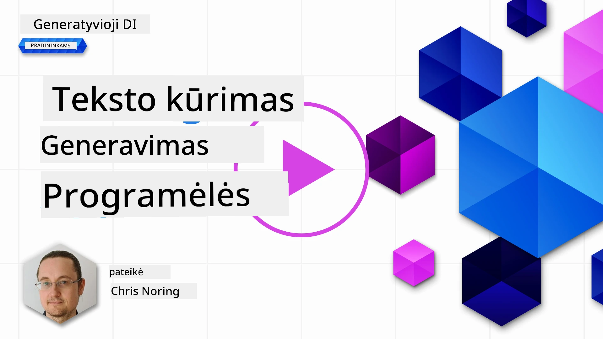

# Teksto generavimo programų kūrimas

[](https://youtu.be/0Y5Luf5sRQA?si=t_xVg0clnAI4oUFZ)

> _(Paspauskite paveikslėlį aukščiau, kad peržiūrėtumėte šios pamokos vaizdo įrašą)_

Iki šiol peržiūrėdami šį mokymo planą matėte pagrindines sąvokas, tokias kaip užklausos (prompts) ir net visą discipliną, vadinamą „užklausų inžinerija“. Daugelis įrankių, su kuriais galite bendrauti, kaip ChatGPT, Office 365, Microsoft Power Platform ir kt., leidžia jums naudoti užklausas siekiant atlikti tam tikrą veiksmą.

Norint pridėti tokią patirtį prie programos, jums reikia suprasti tokias sąvokas kaip užklausos, užbaigimai ir pasirinkti biblioteką darbui. Būtent to jūs išmoksite šiame skyriuje.

## Įvadas

Šiame skyriuje jūs:

- Sužinosite apie openai biblioteką ir jos pagrindines sąvokas.
- Sukursite teksto generavimo programą naudodami openai.
- Suprasite, kaip naudoti tokias sąvokas kaip užklausa, temperatūra ir žetonai, kad sukurtumėte teksto generavimo programą.

## Mokymosi tikslai

Pamokos pabaigoje jūs galėsite:

- Paaiškinti, kas yra teksto generavimo programa.
- Sukurti teksto generavimo programą naudodami openai.
- Konfigūruoti savo programą naudoti daugiau ar mažiau žetonų ir taip pat keisti temperatūrą, kad gautumėte įvairų rezultatą.

## Kas yra teksto generavimo programa?

Paprastai, kai kuriate programą, ji turi tam tikrą sąsają, pavyzdžiui, tokią:

- Komandų pagrindu. Konsolės programos yra tipinės programos, kuriose įvedate komandą ir ji atlieka užduotį. Pavyzdžiui, „git“ yra komandų pagrindu veikianti programa.
- Vartotojo sąsaja (UI). Kai kurios programos turi grafinę vartotojo sąsają (GUI), kurioje spaudote mygtukus, įvedate tekstą, renkatės parinktis ir pan.

### Konsolės ir vartotojo sąsajos programos yra ribotos

Palyginkite tai su komandine programa, kur įvedate komandą:

- **Ji yra ribota**. Negalite įvesti bet kokios komandos, tik tų, kurias programa palaiko.
- **Kalbai specifinė**. Kai kurios programos palaiko daugelį kalbų, bet pagal numatytuosius nustatymus programa skirta konkrečiai kalbai, nors galite pridėti papildomą kalbų palaikymą.

### Teksto generavimo programų privalumai

Taigi kuo skiriasi teksto generavimo programa?

Teksto generavimo programoje turite daugiau lankstumo, nesate apriboti komandomis ar konkrečia įvesties kalba. Vietoje to galite naudoti natūralią kalbą bendrauti su programa. Kitas privalumas yra tas, kad jūs jau bendraujate su duomenų šaltiniu, kuris buvo apmokytas didžiuliu informacijos korpusu, o tradicinė programa gali būti ribota tuo, kas yra duomenų bazėje.

### Ką galima sukurti su teksto generavimo programa?

Galite sukurti daugybę dalykų. Pavyzdžiui:

- **Pokalbiai robotas (chatbot)**. Pokalbių robotas, atsakantis į klausimus apie temą, pavyzdžiui, jūsų įmonę ir jos produktus, gali būti puikus sprendimas.
- **Pagalbininkas**. Dideli kalbos modeliai puikiai tinka tokioms užduotims kaip teksto santraukos, įžvalgų gavimas iš teksto, teksto generavimas, pvz., gyvenimo aprašymai ir pan.
- **Kodo pagalbininkas**. Priklausomai nuo naudojamo kalbos modelio, galite sukurti kodo pagalbininką, kuris padės rašyti kodą. Pavyzdžiui, galite naudoti produktus kaip GitHub Copilot taip pat kaip ChatGPT kodo rašymo pagalbai.

## Kaip pradėti?

Turite rasti būdą, kaip integruotis su dideliu kalbos modeliu (LLM), kuris įprastai apima šiuos du požiūrius:

- Naudoti API. Čia jūs kūrėte internetinius užklausimus su savo užklausa ir gaunate sugeneruotą tekstą atgal.
- Naudoti biblioteką. Bibliotekos padeda apjungti API iškvietimus ir padaryti juos lengviau naudojamus.

## Bibliotekos/SDK

Yra keletas gerai žinomų bibliotekų darbui su LLM, tokių kaip:

- **openai**, ši biblioteka leidžia lengvai prisijungti prie savo modelio ir siųsti užklausas.

Yra taip pat bibliotekų, veikiančių aukštesniame lygyje, kaip:

- **Langchain**. Langchain yra žinoma ir palaiko Python.
- **Semantic Kernel**. Semantic Kernel yra Microsoft biblioteka, palaikanti C#, Python ir Java kalbas.

## Pirmoji programa naudojant openai

Pažiūrėkime, kaip galime sukurti savo pirmąją programą, kokių bibliotekų reikia ir kokių nustatymų reikia.

### Įdiekite openai

Yra daug bibliotekų, kurios leidžia bendrauti su OpenAI arba Azure OpenAI. Taip pat galima naudoti įvairias programavimo kalbas, tokias kaip C#, Python, JavaScript, Java ir kt. Mes pasirinkome naudoti `openai` Python biblioteką, todėl įdiegsime ją per `pip`.

```bash
pip install openai
```

### Sukurkite resursą

Turite atlikti šiuos veiksmus:

- Sukurkite paskyrą Azure svetainėje [https://azure.microsoft.com/free/](https://azure.microsoft.com/free/?WT.mc_id=academic-105485-koreyst).
- Gaukitės prieigą prie Azure OpenAI. Eikite į [https://learn.microsoft.com/azure/ai-foundry/openai/overview#how-do-i-get-access-to-azure-openai](https://learn.microsoft.com/azure/ai-foundry/openai/overview#how-do-i-get-access-to-azure-openai?WT.mc_id=academic-105485-koreyst) ir paprašykite prieigos.

  > [!NOTE]
  > Rašymo metu reikia kreiptis dėl prieigos prie Azure OpenAI.

- Įdiekite Python <https://www.python.org/>
- Sukurkite Azure OpenAI paslaugos resursą. Peržiūrėkite šią instrukciją, kaip [sukurti resursą](https://learn.microsoft.com/azure/ai-foundry/openai/how-to/create-resource?pivots=web-portal?WT.mc_id=academic-105485-koreyst).

### Suraskite API raktą ir endpoint'ą

Dabar turite nurodyti savo `openai` bibliotekai, kurį API raktą naudoti. Norėdami rasti API raktą, eikite į „Keys and Endpoint“ skiltį savo Azure OpenAI resurse ir nukopijuokite „Key 1“ reikšmę.


Dabar, kai turite šią informaciją, leiskite bibliotekoms ja naudotis.

> [!NOTE]
> Vertinga atskirti savo API raktą nuo kodo. Tai galite padaryti naudodami aplinkos kintamuosius.
>
> - Nustatykite aplinkos kintamąjį `OPENAI_API_KEY` su savo API raktu.
>   `export OPENAI_API_KEY='sk-...'`

### Azure konfigūracijos nustatymas

Jei naudojate Azure OpenAI (dabar Microsoft Foundry dalis), štai kaip nustatyti konfigūraciją. Mes naudojame standartinį `OpenAI` klientą, nukreiptą į Azure OpenAI `/openai/v1/` endpoint'ą, kuris veikia su Responses API ir nereikalauja `api_version`:

```python
import os
from openai import OpenAI

client = OpenAI(
    api_key=os.environ["AZURE_OPENAI_API_KEY"],
    base_url=f"{os.environ['AZURE_OPENAI_ENDPOINT'].rstrip('/')}/openai/v1/",
)
```

Aukščiau nustatome šiuos parametrus:

- `api_key`, tai jūsų API raktas, rastas Azure portale arba Microsoft Foundry portale.
- `base_url`, tai jūsų Foundry resurso endpoint'as su pridėtu `/openai/v1/`. Stabilus v1 endpoint'as veikia tiek OpenAI, tiek Azure OpenAI be `api_version` valdymo.

> [!NOTE] > `os.environ` skaito aplinkos kintamuosius. Galite jį naudoti skaityti tokius kintamuosius kaip `AZURE_OPENAI_API_KEY` ir `AZURE_OPENAI_ENDPOINT`. Nustatykite šiuos aplinkos kintamuosius terminale arba naudodami biblioteką kaip `dotenv`.

## Teksto generavimas

Teksto generavimui naudojama Responses API per metodą `responses.create`. Štai pavyzdys:

```python
prompt = "Complete the following: Once upon a time there was a"

response = client.responses.create(
    model="gpt-5-mini",  # tai jūsų modelio diegimo pavadinimas
    input=prompt,
    store=False,
)
print(response.output_text)
```

Aukščiau esančiame kode sukuriame atsakymą ir perduodame modelį, kurį norime naudoti, bei užklausą (prompt). Tada išvedame sugeneruotą tekstą per `response.output_text`.

### Daugiaerių pokalbių užbaigimas (multi-turn conversations)

Responses API puikiai tinka tiek vieno posūkio teksto generavimui, tiek daugiaerių pokalbių robotams – pateikiate pranešimų sąrašą `input`, kad sukurtumėte pokalbį:

```python
from openai import OpenAI

client = OpenAI(api_key="sk-...")

response = client.responses.create(model="gpt-5-mini", input="Hello world", store=False)
print(response.output_text)
```

Daugiau apie šią funkciją bus ateinančiame skyriuje.

## Pratimai – jūsų pirmoji teksto generavimo programa

Dabar, kai išmokome nustatyti ir konfigūruoti openai, laikas sukurti jūsų pirmąją teksto generavimo programą. Norėdami ją sukurti, vadovaukitės šiais žingsniais:

1. Sukurkite virtualią aplinką ir įdiekite openai:

   ```bash
   python -m venv venv
   source venv/bin/activate
   pip install openai
   ```

   > [!NOTE]
   > Jei naudojate Windows, įrašykite `venv\Scripts\activate` vietoje `source venv/bin/activate`.

   > [!NOTE]
   > Raskite savo Azure OpenAI raktą eidami į [https://portal.azure.com/](https://portal.azure.com/?WT.mc_id=academic-105485-koreyst) ir ieškokite `Open AI`, pasirinkite `Open AI resource`, tada `Keys and Endpoint` ir nukopijuokite `Key 1` reikšmę.

1. Sukurkite _app.py_ failą ir įrašykite jame šį kodą:

   ```python
   import os
   from openai import OpenAI

   client = OpenAI(
       api_key="<replace this value with your Azure OpenAI key>",
       base_url="<endpoint found in Azure Portal>/openai/v1/",
   )
   deployment_name = "<deployment name>"

   # pridėkite savo užpildymo kodą
   prompt = "Complete the following: Once upon a time there was a"

   # atlikite užklausą naudodami Responses API
   response = client.responses.create(model=deployment_name, input=prompt, store=False)

   # atspausdinkite atsakymą
   print(response.output_text)
   ```

   > [!NOTE]
   > Jei naudojate paprastą OpenAI (ne Azure), naudokite `client = OpenAI(api_key="<pakeiskite šia reikšme savo OpenAI raktą>")` (be `base_url`) ir nurodykite modelio pavadinimą, pvz., `gpt-5-mini` vietoje diegimo pavadinimo.

   Turėtumėte pamatyti tokį rezultatą:

   ```output
    very unhappy _____.

   Once upon a time there was a very unhappy mermaid.
   ```

## Skirtingi užklausų tipai, skirti skirtingiems dalykams

Dabar matėte, kaip sugeneruoti tekstą naudojant užklausą. Jūs netgi turite programą, kurią galite modifikuoti ir keisti siekiant generuoti skirtingų tipų tekstą.

Užklausos gali būti naudojamos įvairioms užduotims. Pavyzdžiui:

- **Generuoti tam tikro tipo tekstą**. Pavyzdžiui, galite sugeneruoti eilėraštį, klausimus viktorinai ir pan.
- **Ieškoti informacijos**. Galite naudoti užklausas informacijos paieškai, pvz., „Ką reiškia CORS interneto kūrime?“.
- **Generuoti kodą**. Galite naudoti užklausas kodo generavimui, pvz., sukurti reguliarią išraišką el. pašto patikrinimui ar kodą visai programai, kaip interneto programai.

## Praktinis pavyzdys: receptų generatorius

Įsivaizduokite, kad turite ingredientų namuose ir norite ką nors pagaminti. Tam jums reikia recepto. Receptus galite rasti naudodami paieškos variklį arba galite naudoti LLM.

Galite sukurti užklausą, pavyzdžiui:

> "Parodykite 5 receptus patiekalui su šiais ingredientais: vištiena, bulvės ir morkos. Kiekvienam receptui pateikite visus naudojamus ingredientus."

Gavę tokią užklausą, galite gauti panašų atsakymą:

```output
1. Roasted Chicken and Vegetables:
Ingredients:
- 4 chicken thighs
- 2 potatoes, cut into cubes
- 2 carrots, cut into cubes
- 2 tablespoons olive oil
- 2 cloves garlic, minced
- 1 teaspoon dried thyme
- 1 teaspoon dried oregano
- Salt and pepper, to taste

2. Chicken and Potato Stew:
Ingredients:
- 2 tablespoons olive oil
- 1 onion, diced
- 2 cloves garlic, minced
- 2 chicken breasts, cut into cubes
- 2 potatoes, cut into cubes
- 2 carrots, cut into cubes
- 1 teaspoon dried oregano
- 1 teaspoon dried thyme
- 1 cup chicken broth
- Salt and pepper, to taste

3. Chicken and Potato Bake:
Ingredients:
- 2 tablespoons olive oil
- 2 chicken breasts, cut into cubes
- 2 potatoes, cut into cubes
- 2 carrots, cut into cubes
- 1 onion, diced
- 2 cloves garlic, minced
- 1 teaspoon dried oregano
- 1 teaspoon dried thyme
- 1 cup chicken broth
- Salt and pepper, to taste

4. Chicken and Potato Soup:
Ingredients:
- 2 tablespoons olive oil
- 1 onion, diced
- 2 cloves garlic, minced
- 2 chicken breasts, cut into cubes
- 2 potatoes, cut into cubes
- 2 carrots, cut into cubes
- 1 teaspoon dried oregano
- 1 teaspoon dried thyme
- 4 cups chicken broth
- Salt and pepper, to taste

5. Chicken and Potato Hash:
Ingredients:
- 2 tablespoons olive oil
- 2 chicken breasts, cut into cubes
- 2 potatoes, cut into cubes
- 2 carrots, cut into cubes
- 1 onion, diced
- 2 cloves garlic, minced
- 1 teaspoon dried oregano
```

Šis rezultatas puikus – žinau, ką gaminti. Tokiu atveju naudinga būtų atlikti:

- Išfiltruoti ingredientus, kurių nemėgstu ar kuriems esu alergiškas.
- Paruošti pirkinių sąrašą, jei namuose neturiu visų ingredientų.

Tokiais atvejais pridėkime papildomą užklausą:

> "Prašau pašalinti receptus su česnakais, nes esu alergiškas, ir pakeisti juos kažkuo kitu. Taip pat prašau paruošti pirkinių sąrašą receptams, atsižvelgiant į tai, kad namuose jau turiu vištieną, bulves ir morkas."

Dabar turite naują rezultatą:

```output
1. Roasted Chicken and Vegetables:
Ingredients:
- 4 chicken thighs
- 2 potatoes, cut into cubes
- 2 carrots, cut into cubes
- 2 tablespoons olive oil
- 1 teaspoon dried thyme
- 1 teaspoon dried oregano
- Salt and pepper, to taste

2. Chicken and Potato Stew:
Ingredients:
- 2 tablespoons olive oil
- 1 onion, diced
- 2 chicken breasts, cut into cubes
- 2 potatoes, cut into cubes
- 2 carrots, cut into cubes
- 1 teaspoon dried oregano
- 1 teaspoon dried thyme
- 1 cup chicken broth
- Salt and pepper, to taste

3. Chicken and Potato Bake:
Ingredients:
- 2 tablespoons olive oil
- 2 chicken breasts, cut into cubes
- 2 potatoes, cut into cubes
- 2 carrots, cut into cubes
- 1 onion, diced
- 1 teaspoon dried oregano
- 1 teaspoon dried thyme
- 1 cup chicken broth
- Salt and pepper, to taste

4. Chicken and Potato Soup:
Ingredients:
- 2 tablespoons olive oil
- 1 onion, diced
- 2 chicken breasts, cut into cubes
- 2 potatoes, cut into cubes
- 2 carrots, cut into cubes
- 1 teaspoon dried oregano
- 1 teaspoon dried thyme
- 4 cups chicken broth
- Salt and pepper, to taste

5. Chicken and Potato Hash:
Ingredients:
- 2 tablespoons olive oil
- 2 chicken breasts, cut into cubes
- 2 potatoes, cut into cubes
- 2 carrots, cut into cubes
- 1 onion, diced
- 1 teaspoon dried oregano

Shopping List:
- Olive oil
- Onion
- Thyme
- Oregano
- Salt
- Pepper
```

Štai jūsų penki receptai, kuriuose nėra česnakų, ir taip pat pirkinių sąrašas, atsižvelgiant į tai, ką jau turite namuose.

## Pratimai – sukurkite receptų generatorių

Dabar, kai įsivaizdavome situaciją, parašykime kodą, atitinkantį šį scenarijų. Vadovaukitės šiais žingsniais:

1. Naudokite esamą _app.py_ failą kaip pradžios tašką
1. Suraskite kintamąjį `prompt` ir pakeiskite jo kodą tokiu:

   ```python
   prompt = "Show me 5 recipes for a dish with the following ingredients: chicken, potatoes, and carrots. Per recipe, list all the ingredients used"
   ```

   Paleidę kodą turėtumėte matyti panašų rezultatą:

   ```output
   -Chicken Stew with Potatoes and Carrots: 3 tablespoons oil, 1 onion, chopped, 2 cloves garlic, minced, 1 carrot, peeled and chopped, 1 potato, peeled and chopped, 1 bay leaf, 1 thyme sprig, 1/2 teaspoon salt, 1/4 teaspoon black pepper, 1 1/2 cups chicken broth, 1/2 cup dry white wine, 2 tablespoons chopped fresh parsley, 2 tablespoons unsalted butter, 1 1/2 pounds boneless, skinless chicken thighs, cut into 1-inch pieces
   -Oven-Roasted Chicken with Potatoes and Carrots: 3 tablespoons extra-virgin olive oil, 1 tablespoon Dijon mustard, 1 tablespoon chopped fresh rosemary, 1 tablespoon chopped fresh thyme, 4 cloves garlic, minced, 1 1/2 pounds small red potatoes, quartered, 1 1/2 pounds carrots, quartered lengthwise, 1/2 teaspoon salt, 1/4 teaspoon black pepper, 1 (4-pound) whole chicken
   -Chicken, Potato, and Carrot Casserole: cooking spray, 1 large onion, chopped, 2 cloves garlic, minced, 1 carrot, peeled and shredded, 1 potato, peeled and shredded, 1/2 teaspoon dried thyme leaves, 1/4 teaspoon salt, 1/4 teaspoon black pepper, 2 cups fat-free, low-sodium chicken broth, 1 cup frozen peas, 1/4 cup all-purpose flour, 1 cup 2% reduced-fat milk, 1/4 cup grated Parmesan cheese

   -One Pot Chicken and Potato Dinner: 2 tablespoons olive oil, 1 pound boneless, skinless chicken thighs, cut into 1-inch pieces, 1 large onion, chopped, 3 cloves garlic, minced, 1 carrot, peeled and chopped, 1 potato, peeled and chopped, 1 bay leaf, 1 thyme sprig, 1/2 teaspoon salt, 1/4 teaspoon black pepper, 2 cups chicken broth, 1/2 cup dry white wine

   -Chicken, Potato, and Carrot Curry: 1 tablespoon vegetable oil, 1 large onion, chopped, 2 cloves garlic, minced, 1 carrot, peeled and chopped, 1 potato, peeled and chopped, 1 teaspoon ground coriander, 1 teaspoon ground cumin, 1/2 teaspoon ground turmeric, 1/2 teaspoon ground ginger, 1/4 teaspoon cayenne pepper, 2 cups chicken broth, 1/2 cup dry white wine, 1 (15-ounce) can chickpeas, drained and rinsed, 1/2 cup raisins, 1/2 cup chopped fresh cilantro
   ```

   > PASTABA, jūsų LLM elgiasi ne nuspėjamai, todėl kiekvieną kartą paleidus programą galite gauti skirtingus rezultatus.

   Puiku, pažiūrėkime, kaip galime tai patobulinti. Norėdami pagerinti, norime užtikrinti, kad kodas būtų lanksčiai keičiamas, t.y. būtų galima keisti ingredientus ir receptų skaičių.

1. Pakeiskime kodą taip:

   ```python
   no_recipes = input("No of recipes (for example, 5): ")

   ingredients = input("List of ingredients (for example, chicken, potatoes, and carrots): ")

   # įterpti receptų skaičių į užklausą ir ingredientus
   prompt = f"Show me {no_recipes} recipes for a dish with the following ingredients: {ingredients}. Per recipe, list all the ingredients used"
   ```

   Testo paleidimas galėtų atrodyti taip:

   ```output
   No of recipes (for example, 5): 3
   List of ingredients (for example, chicken, potatoes, and carrots): milk,strawberries

   -Strawberry milk shake: milk, strawberries, sugar, vanilla extract, ice cubes
   -Strawberry shortcake: milk, flour, baking powder, sugar, salt, unsalted butter, strawberries, whipped cream
   -Strawberry milk: milk, strawberries, sugar, vanilla extract
   ```

### Patobulinkite pridėdami filtrą ir pirkinių sąrašą

Dabar turime veikiančią programą, galinčią generuoti receptus, ir ji yra lanksti, nes remiasi vartotojo įvedamais duomenimis, tiek receptų skaičiumi, tiek ingredientais.

Norėdami dar labiau patobulinti, pridėsime šiuos dalykus:

- **Filtravimas iš ingredientų**. Norime galėti filtruoti ingredientus, kurių nemėgstame arba kuriems esame alergiški. Norėdami tai pasiekti, galime redaguoti savo esamą užklausą ir pabaigoje pridėti filtro sąlygą, pvz.:

  ```python
  filter = input("Filter (for example, vegetarian, vegan, or gluten-free): ")

  prompt = f"Show me {no_recipes} recipes for a dish with the following ingredients: {ingredients}. Per recipe, list all the ingredients used, no {filter}"
  ```

  Aukščiau mes pridėjome `{filter}` į užklausos pabaigą ir taip pat paimame filtro reikšmę iš vartotojo.

  Tarkime, programos paleidimo pavyzdys dabar galėtų atrodyti taip:

  ```output
  No of recipes (for example, 5): 3
  List of ingredients (for example, chicken, potatoes, and carrots): onion,milk
  Filter (for example, vegetarian, vegan, or gluten-free): no milk

  1. French Onion Soup

  Ingredients:

  -1 large onion, sliced
  -3 cups beef broth
  -1 cup milk
  -6 slices french bread
  -1/4 cup shredded Parmesan cheese
  -1 tablespoon butter
  -1 teaspoon dried thyme
  -1/4 teaspoon salt
  -1/4 teaspoon black pepper

  Instructions:

  1. In a large pot, sauté onions in butter until golden brown.
  2. Add beef broth, milk, thyme, salt, and pepper. Bring to a boil.
  3. Reduce heat and simmer for 10 minutes.
  4. Place french bread slices on soup bowls.
  5. Ladle soup over bread.
  6. Sprinkle with Parmesan cheese.

  2. Onion and Potato Soup

  Ingredients:

  -1 large onion, chopped
  -2 cups potatoes, diced
  -3 cups vegetable broth
  -1 cup milk
  -1/4 teaspoon black pepper

  Instructions:

  1. In a large pot, sauté onions in butter until golden brown.
  2. Add potatoes, vegetable broth, milk, and pepper. Bring to a boil.
  3. Reduce heat and simmer for 10 minutes.
  4. Serve hot.

  3. Creamy Onion Soup

  Ingredients:

  -1 large onion, chopped
  -3 cups vegetable broth
  -1 cup milk
  -1/4 teaspoon black pepper
  -1/4 cup all-purpose flour
  -1/2 cup shredded Parmesan cheese

  Instructions:

  1. In a large pot, sauté onions in butter until golden brown.
  2. Add vegetable broth, milk, and pepper. Bring to a boil.
  3. Reduce heat and simmer for 10 minutes.
  4. In a small bowl, whisk together flour and Parmesan cheese until smooth.
  5. Add to soup and simmer for an additional 5 minutes, or until soup has thickened.
  ```

  Kaip matote, receptai, kuriuose yra pieno, buvo filtruojami. Bet jei esate laktozės netolerantas, galite norėti filtruoti receptus su sūriu, todėl svarbu būti aiškiam.


- **Sukurkite pirkinių sąrašą**. Norime sukurti pirkinių sąrašą, atsižvelgiant į tai, ką jau turime namuose.

  Šiai funkcijai galime pabandyti išspręsti viską vienu užklausimu arba padalinti į du užklausimus. Pabandykime pastarąjį metodą. Čia siūlome pridėti papildomą užklausimą, tačiau tam, kad tai veiktų, reikia pridėti pirmojo užklausimo rezultatą kaip kontekstą antrajam užklausimui.

  Suraskite kodo vietą, kur išvedamas pirmojo užklausimo rezultatas ir pridėkite žemiau šį kodą:

  ```python
  old_prompt_result = response.output_text
  prompt = "Produce a shopping list for the generated recipes and please don't include ingredients that I already have."

  new_prompt = f"{old_prompt_result} {prompt}"
  response = client.responses.create(model=deployment_name, input=new_prompt, max_output_tokens=1200, store=False)

  # atspausdinti atsakymą
  print("Shopping list:")
  print(response.output_text)
  ```

  Atkreipkite dėmesį į tai:

  1. Kuriame naują užklausimą pridėdami pirmojo užklausimo rezultatą prie naujo užklausimo:

     ```python
     new_prompt = f"{old_prompt_result} {prompt}"
     ```

  1. Atliekame naują užklausą, bet taip pat atsižvelgiame į pirmojo užklausimo užklausytų žetonų skaičių, todėl šį kartą nurodome `max_output_tokens` kaip 1200.

     ```python
     response = client.responses.create(model=deployment_name, input=new_prompt, max_output_tokens=1200, store=False)
     ```

     Paleidus šį kodą, gauname šį rezultatą:

     ```output
     No of recipes (for example, 5): 2
     List of ingredients (for example, chicken, potatoes, and carrots): apple,flour
     Filter (for example, vegetarian, vegan, or gluten-free): sugar


     -Apple and flour pancakes: 1 cup flour, 1/2 tsp baking powder, 1/2 tsp baking soda, 1/4 tsp salt, 1 tbsp sugar, 1 egg, 1 cup buttermilk or sour milk, 1/4 cup melted butter, 1 Granny Smith apple, peeled and grated
     -Apple fritters: 1-1/2 cups flour, 1 tsp baking powder, 1/4 tsp salt, 1/4 tsp baking soda, 1/4 tsp nutmeg, 1/4 tsp cinnamon, 1/4 tsp allspice, 1/4 cup sugar, 1/4 cup vegetable shortening, 1/4 cup milk, 1 egg, 2 cups shredded, peeled apples
     Shopping list:
     -Flour, baking powder, baking soda, salt, sugar, egg, buttermilk, butter, apple, nutmeg, cinnamon, allspice
     ```

## Pagerinkite savo aplinką

Turiu kodą, kuris veikia, bet yra keletas patobulinimų, kuriuos turėtume atlikti toliau. Kai ką turėtume padaryti:

- **Atskirkite slaptažodžius nuo kodo**, pvz., API raktą. Slaptažodžiai nepriklauso kodui ir turėtų būti saugomi saugioje vietoje. Norint atskirti slaptažodžius nuo kodo, galime naudoti aplinkos kintamuosius ir bibliotekas kaip `python-dotenv`, kad juos įkeltume iš failo. Štai kaip tai atrodytų kode:

  1. Sukurkite `.env` failą su šiuo turiniu:

     ```bash
     OPENAI_API_KEY=sk-...
     ```

     > Pastaba: „Azure OpenAI“ „Microsoft Foundry“ reikėtų nustatyti šiuos aplinkos kintamuosius:

     ```bash
     AZURE_OPENAI_API_KEY=<replace>
     AZURE_OPENAI_ENDPOINT=<replace>
     AZURE_OPENAI_API_VERSION=2024-10-21
     ```

     Kode aplinkos kintamuosius įkeltumėte taip:

     ```python
     import os
     from dotenv import load_dotenv
     from openai import OpenAI

     load_dotenv()

     client = OpenAI(api_key=os.environ["OPENAI_API_KEY"])
     ```

- **Žodis apie žetonų ilgį**. Turėtume apsvarstyti, kiek žetonų mums reikia norimam tekstui sugeneruoti. Žetonai kainuoja pinigus, todėl, jei įmanoma, turėtume būti ekonomiški naudodami žetonų skaičių. Pavyzdžiui, ar galime užklausą suformuluoti taip, kad naudotume mažiau žetonų?

  Norėdami pakeisti naudojamų žetonų skaičių, galite naudoti `max_output_tokens` parametrą. Pavyzdžiui, jei norite naudoti 100 žetonų, darykite taip:

  ```python
  response = client.responses.create(model=deployment, input=prompt, max_output_tokens=100, store=False)
  ```

- **Eksperimentavimas su temperatūra**. Temperatūra yra kažkas, apie ką dar nepaminėjome, bet tai svarbus kontekstas, kaip veikia mūsų programa. Kuo didesnė temperatūra, tuo labiau atsitiktinis bus rezultatas. Atvirkščiai, kuo mažesnė temperatūra, tuo nuspėjamesnis bus rezultatas. Pagalvokite, ar norite gauti įvairų rezultatą, ar ne.

  Norėdami keisti temperatūrą, galite naudoti `temperature` parametrą. Pavyzdžiui, jei norite naudoti temperatūrą 0.5, darykite taip:

  ```python
  response = client.responses.create(model=deployment, input=prompt, temperature=0.5, store=False)
  ```

  > Pastaba: kuo arčiau 1.0, tuo įvairesnis bus rezultatas.

- **Racionalumo modeliai nenaudoja `temperature`**. Tai svarbus 2026 metų pasikeitimas. Dabartiniai, nepasenusieji modeliai Microsoft Foundry yra **racionalumo modeliai** (GPT-5 šeima, o serija) – ir jie **nenaudoją `temperature` ar `top_p`** (nei `max_tokens`; naudokite `max_output_tokens`). Jei siųsite `temperature` modeliui `gpt-5-mini`, gausite klaidą „parametras nepalaikomas“. Todėl, norint išbandyti aukščiau pateiktą temperatūros pavyzdį, naudokite modelį, kuris vis dar palaiko atrankos valdiklius – pavyzdžiui, atvirą **Llama** modelį, kaip `Llama-3.3-70B-Instruct` iš [Microsoft Foundry modelių katalogo](https://ai.azure.com/catalog/models?WT.mc_id=academic-105485-koreyst), iškviečiamą per Foundry Models / Azure AI Inference galinį tašką (taip pat kaip `githubmodels-*` pavyzdžiai). Racionalumo modeliams, kaip GPT-5, išvestį valdote kitaip:
  - **Užklausų inžinerija** – aiškios instrukcijos, pavyzdžiai ir struktūruotas išvestis (žr. pamoką [04 - Prompt Engineering](../04-prompt-engineering-fundamentals/README.md?WT.mc_id=academic-105485-koreyst)) atlieka darbą, kurį anksčiau darė atrankos valdikliai.
  - **Racionalumo valdikliai** – parametrai kaip racionalumo pastangos/žodžių gausa subalansuoja racionalumo gylį su delsos laiku ir kaina.

  Trumpai: `temperature`/`top_p` vis dar galioja daugeliui modelių (Llama, Mistral, Phi ir GPT-4.x šeimai – nors GPT-4.x yra atsisakoma), tačiau kryptis yra užklausų inžinerija + racionalumo valdikliai racionalumo modeliams kaip GPT-5.

## Užduotis

Šiai užduočiai galite pasirinkti, ką sukurti.

Štai keletas pasiūlymų:

- Patobulinkite receptų generatoriaus programėlę. Eksperimentuokite su temperatūros reikšmėmis ir užklausomis bei pažiūrėkite, ką galite išgauti.
- Sukurkite "mokymosi draugą". Ši programa turėtų galėti atsakyti į klausimus apie tam tikrą temą, pavyzdžiui, Python, galėtumėte turėti užklausas kaip „Kas yra tam tikra tema Python?“ arba užklausą, kurioje būtų prašoma parodyti kodo pavyzdžių tam tikrai temai.
- Istorijos botas, padarykite istoriją gyvą, nurodykite botui vaidinti tam tikrą istorinį veikėją ir klauskite jo apie jo gyvenimą ir laikus.

## Sprendimas

### Mokymosi draugas

Žemiau pateikiama pradinė užklausa, pažiūrėkite, kaip ją naudoti ir tobulinti.

```text
- "You're an expert on the Python language

    Suggest a beginner lesson for Python in the following format:

    Format:
    - concepts:
    - brief explanation of the lesson:
    - exercise in code with solutions"
```

### Istorijos botas

Štai keletas užklausų, kurias galite naudoti:

```text
- "You are Abe Lincoln, tell me about yourself in 3 sentences, and respond using grammar and words like Abe would have used"
- "You are Abe Lincoln, respond using grammar and words like Abe would have used:

   Tell me about your greatest accomplishments, in 300 words"
```

## Žinių patikrinimas

Ką daro temperatūros sąvoka?

1. Ji valdo, kiek atsitiktinis yra rezultatas.
1. Ji valdo, koks didelis yra atsakymas.
1. Ji valdo, kiek žetonų naudojama.

## 🚀 Iššūkis

Dirbdami prie užduoties, pabandykite keisti temperatūrą, nustatykite ją į 0, 0.5 ir 1. Atminkite, kad 0 yra mažiausiai įvairus, o 1 – labiausiai. Kokia reikšmė geriausiai tinka jūsų programai?

## Puikiai padirbėta! Tęskite mokymąsi

Baigę šią pamoką, apsilankykite mūsų [Generatyvinio AI mokymosi kolekcijoje](https://aka.ms/genai-collection?WT.mc_id=academic-105485-koreyst), kad toliau gilintumėte savo generatyvinio AI žinias!

Eikite į 7 pamoką, kurioje apžvelgsime, kaip [kurti pokalbių programas](../07-building-chat-applications/README.md?WT.mc_id=academic-105485-koreyst)!

---

<!-- CO-OP TRANSLATOR DISCLAIMER START -->
**Atsakomybės apribojimas**:
Šis dokumentas buvo išverstas naudojant dirbtinio intelekto vertimo paslaugą [Co-op Translator](https://github.com/Azure/co-op-translator). Nors siekiame tikslumo, prašome atkreipti dėmesį, kad automatiniai vertimai gali turėti klaidų ar netikslumų. Originalus dokumentas jo gimtąja kalba laikomas autoritetingu šaltiniu. Svarbiai informacijai rekomenduojama naudoti profesionalų žmogiškąjį vertimą. Mes neatsakome už jokius nesusipratimus ar neteisingą interpretaciją, kilusią naudojantis šiuo vertimu.
<!-- CO-OP TRANSLATOR DISCLAIMER END -->