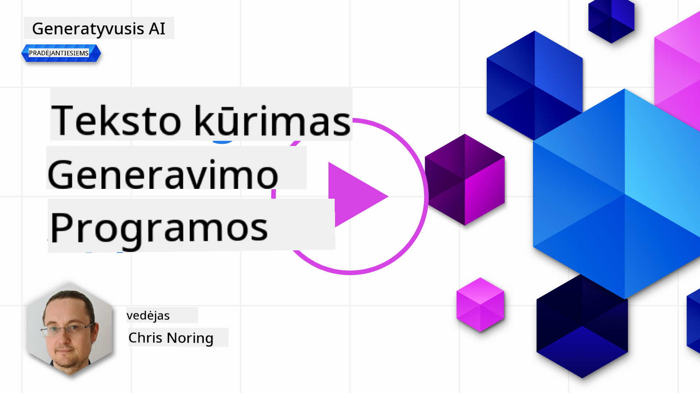

<!--
CO_OP_TRANSLATOR_METADATA:
{
  "original_hash": "df027997f1448323d6159b78a1b669bf",
  "translation_date": "2025-10-18T02:22:08+00:00",
  "source_file": "06-text-generation-apps/README.md",
  "language_code": "lt"
}
-->
# Teksto generavimo programų kūrimas

[](https://youtu.be/0Y5Luf5sRQA?si=t_xVg0clnAI4oUFZ)

> _(Spustelėkite aukščiau esančią nuotrauką, kad peržiūrėtumėte šios pamokos vaizdo įrašą)_

Iki šiol šiame kurse matėte pagrindines sąvokas, tokias kaip raginimai, ir net visą discipliną, vadinamą „raginimų inžinerija“. Daugelis įrankių, su kuriais galite sąveikauti, pavyzdžiui, ChatGPT, Office 365, Microsoft Power Platform ir kt., leidžia jums naudoti raginimus tam tikram tikslui pasiekti.

Norėdami pridėti tokią patirtį prie savo programos, turite suprasti tokias sąvokas kaip raginimai, užbaigimai ir pasirinkti biblioteką darbui. Būtent tai ir išmoksite šiame skyriuje.

## Įvadas

Šiame skyriuje jūs:

- Sužinosite apie openai biblioteką ir jos pagrindines sąvokas.
- Sukursite teksto generavimo programą naudodami openai.
- Suprasite, kaip naudoti tokias sąvokas kaip raginimas, temperatūra ir žetonai, kad sukurtumėte teksto generavimo programą.

## Mokymosi tikslai

Šios pamokos pabaigoje galėsite:

- Paaiškinti, kas yra teksto generavimo programa.
- Sukurti teksto generavimo programą naudodami openai.
- Konfigūruoti savo programą, kad ji naudotų daugiau ar mažiau žetonų ir keistų temperatūrą, kad gautumėte įvairų rezultatą.

## Kas yra teksto generavimo programa?

Paprastai, kai kuriate programą, ji turi tam tikrą sąsają, pavyzdžiui:

- Komandų pagrindu. Konsolės programos yra tipiškos programos, kuriose įvedate komandą ir ji atlieka užduotį. Pavyzdžiui, `git` yra komandinė programa.
- Vartotojo sąsaja (UI). Kai kurios programos turi grafinę vartotojo sąsają (GUI), kurioje galite spustelėti mygtukus, įvesti tekstą, pasirinkti parinktis ir kt.

### Konsolės ir UI programos yra ribotos

Palyginkite su komandinės bazės programa, kurioje įvedate komandą:

- **Jos ribotos**. Negalite tiesiog įvesti bet kokios komandos, tik tas, kurias programa palaiko.
- **Kalbos specifika**. Kai kurios programos palaiko daugelį kalbų, tačiau pagal numatymą programa sukurta konkrečiai kalbai, net jei galite pridėti daugiau kalbų palaikymo.

### Teksto generavimo programų privalumai

Taigi, kuo teksto generavimo programa skiriasi?

Teksto generavimo programoje turite daugiau lankstumo, nesate apriboti komandų rinkiniu ar konkrečia įvesties kalba. Vietoj to, galite naudoti natūralią kalbą, kad sąveikautumėte su programa. Kitas privalumas yra tas, kad jau sąveikaujate su duomenų šaltiniu, kuris buvo apmokytas pagal didelį informacijos korpusą, tuo tarpu tradicinė programa gali būti ribota tuo, kas yra duomenų bazėje.

### Ką galima sukurti naudojant teksto generavimo programą?

Galite sukurti daugybę dalykų. Pavyzdžiui:

- **Pokalbių robotą**. Pokalbių robotas, atsakantis į klausimus apie temas, pvz., jūsų įmonę ir jos produktus, galėtų būti puikus pasirinkimas.
- **Pagalbininką**. LLM puikiai tinka tokiems dalykams kaip teksto santraukų kūrimas, įžvalgų gavimas iš teksto, tekstų kūrimas, pvz., gyvenimo aprašymų ir kt.
- **Kodo asistentą**. Priklausomai nuo naudojamo kalbos modelio, galite sukurti kodo asistentą, kuris padės jums rašyti kodą. Pavyzdžiui, galite naudoti tokį produktą kaip GitHub Copilot arba ChatGPT, kad padėtų jums rašyti kodą.

## Kaip pradėti?

Na, jums reikia rasti būdą, kaip integruotis su LLM, kuris paprastai apima šiuos du metodus:

- Naudoti API. Čia konstruojate žiniatinklio užklausas su savo raginimu ir gaunate sugeneruotą tekstą.
- Naudoti biblioteką. Bibliotekos padeda supaprastinti API užklausas ir padaryti jas lengviau naudojamas.

## Bibliotekos/SDK

Yra keletas gerai žinomų bibliotekų, skirtų dirbti su LLM, pavyzdžiui:

- **openai**, ši biblioteka leidžia lengvai prisijungti prie jūsų modelio ir siųsti raginimus.

Taip pat yra bibliotekų, veikiančių aukštesniu lygiu, pavyzdžiui:

- **Langchain**. Langchain yra gerai žinoma ir palaiko Python.
- **Semantic Kernel**. Semantic Kernel yra Microsoft biblioteka, palaikanti C#, Python ir Java kalbas.

## Pirmoji programa naudojant openai

Pažiūrėkime, kaip galime sukurti savo pirmąją programą, kokių bibliotekų mums reikia, kiek reikia ir pan.

### Įdiegti openai

Yra daug bibliotekų, skirtų sąveikai su OpenAI arba Azure OpenAI. Galima naudoti daugybę programavimo kalbų, tokių kaip C#, Python, JavaScript, Java ir kt. Mes pasirinkome naudoti `openai` Python biblioteką, todėl ją įdiegsime naudodami `pip`.

```bash
pip install openai
```

### Sukurti resursą

Turite atlikti šiuos veiksmus:

- Susikurkite paskyrą Azure [https://azure.microsoft.com/free/](https://azure.microsoft.com/free/?WT.mc_id=academic-105485-koreyst).
- Gaukite prieigą prie Azure OpenAI. Eikite į [https://learn.microsoft.com/azure/ai-services/openai/overview#how-do-i-get-access-to-azure-openai](https://learn.microsoft.com/azure/ai-services/openai/overview#how-do-i-get-access-to-azure-openai?WT.mc_id=academic-105485-koreyst) ir pateikite prašymą dėl prieigos.

  > [!NOTE]
  > Rašymo metu reikia pateikti prašymą dėl prieigos prie Azure OpenAI.

- Įdiekite Python <https://www.python.org/>
- Sukurkite Azure OpenAI Service resursą. Žr. šį vadovą, kaip [sukurti resursą](https://learn.microsoft.com/azure/ai-services/openai/how-to/create-resource?pivots=web-portal?WT.mc_id=academic-105485-koreyst).

### Rasti API raktą ir galinį tašką

Šiuo metu turite nurodyti savo `openai` bibliotekai, kokį API raktą naudoti. Norėdami rasti savo API raktą, eikite į „Keys and Endpoint“ skyrių savo Azure OpenAI resurse ir nukopijuokite „Key 1“ reikšmę.


Dabar, kai turite šią informaciją, nurodykime bibliotekoms ją naudoti.

> [!NOTE]
> Verta atskirti savo API raktą nuo kodo. Tai galite padaryti naudodami aplinkos kintamuosius.
>
> - Nustatykite aplinkos kintamąjį `OPENAI_API_KEY` į savo API raktą.
>   `export OPENAI_API_KEY='sk-...'`

### Konfigūracijos nustatymas Azure

Jei naudojate Azure OpenAI, štai kaip nustatyti konfigūraciją:

```python
openai.api_type = 'azure'
openai.api_key = os.environ["OPENAI_API_KEY"]
openai.api_version = '2023-05-15'
openai.api_base = os.getenv("API_BASE")
```

Aukščiau mes nustatome:

- `api_type` į `azure`. Tai nurodo bibliotekai naudoti Azure OpenAI, o ne OpenAI.
- `api_key`, tai jūsų API raktas, rastas Azure portale.
- `api_version`, tai API versija, kurią norite naudoti. Rašymo metu naujausia versija yra `2023-05-15`.
- `api_base`, tai API galinis taškas. Jį galite rasti Azure portale šalia savo API rakto.

> [!NOTE] > `os.getenv` yra funkcija, skirta skaityti aplinkos kintamuosius. Ją galite naudoti norėdami perskaityti aplinkos kintamuosius, pvz., `OPENAI_API_KEY` ir `API_BASE`. Nustatykite šiuos aplinkos kintamuosius savo terminale arba naudodami tokią biblioteką kaip `dotenv`.

## Teksto generavimas

Tekstui generuoti naudojama `Completion` klasė. Štai pavyzdys:

```python
prompt = "Complete the following: Once upon a time there was a"

completion = openai.Completion.create(model="davinci-002", prompt=prompt)
print(completion.choices[0].text)
```

Aukščiau esančiame kode mes sukuriame užbaigimo objektą ir perduodame modelį, kurį norime naudoti, ir raginimą. Tada atspausdiname sugeneruotą tekstą.

### Pokalbių užbaigimai

Iki šiol matėte, kaip mes naudojome `Completion` tekstui generuoti. Tačiau yra kita klasė, vadinama `ChatCompletion`, kuri labiau tinka pokalbių robotams. Štai pavyzdys, kaip ją naudoti:

```python
import openai

openai.api_key = "sk-..."

completion = openai.ChatCompletion.create(model="gpt-3.5-turbo", messages=[{"role": "user", "content": "Hello world"}])
print(completion.choices[0].message.content)
```

Daugiau apie šią funkciją kitame skyriuje.

## Užduotis - jūsų pirmoji teksto generavimo programa

Dabar, kai išmokome nustatyti ir konfigūruoti openai, laikas sukurti savo pirmąją teksto generavimo programą. Norėdami sukurti savo programą, atlikite šiuos veiksmus:

1. Sukurkite virtualią aplinką ir įdiekite openai:

   ```bash
   python -m venv venv
   source venv/bin/activate
   pip install openai
   ```

   > [!NOTE]
   > Jei naudojate Windows, įveskite `venv\Scripts\activate` vietoj `source venv/bin/activate`.

   > [!NOTE]
   > Raskite savo Azure OpenAI raktą, eikite į [https://portal.azure.com/](https://portal.azure.com/?WT.mc_id=academic-105485-koreyst), ieškokite `Open AI`, pasirinkite `Open AI resource`, tada pasirinkite `Keys and Endpoint` ir nukopijuokite `Key 1` reikšmę.

1. Sukurkite _app.py_ failą ir įrašykite į jį šį kodą:

   ```python
   import openai

   openai.api_key = "<replace this value with your open ai key or Azure OpenAI key>"

   openai.api_type = 'azure'
   openai.api_version = '2023-05-15'
   openai.api_base = "<endpoint found in Azure Portal where your API key is>"
   deployment_name = "<deployment name>"

   # add your completion code
   prompt = "Complete the following: Once upon a time there was a"
   messages = [{"role": "user", "content": prompt}]

   # make completion
   completion = openai.chat.completions.create(model=deployment_name, messages=messages)

   # print response
   print(completion.choices[0].message.content)
   ```

   > [!NOTE]
   > Jei naudojate Azure OpenAI, turite nustatyti `api_type` į `azure` ir nustatyti `api_key` į savo Azure OpenAI raktą.

   Turėtumėte pamatyti tokį rezultatą:

   ```output
    very unhappy _____.

   Once upon a time there was a very unhappy mermaid.
   ```

## Skirtingi raginimų tipai skirtingiems tikslams

Dabar matėte, kaip generuoti tekstą naudojant raginimą. Jūs netgi turite veikiančią programą, kurią galite modifikuoti ir keisti, kad generuotumėte skirtingus tekstų tipus.

Raginimai gali būti naudojami įvairioms užduotims. Pavyzdžiui:

- **Generuoti tam tikrą tekstą**. Pavyzdžiui, galite generuoti eilėraštį, klausimus viktorinai ir pan.
- **Ieškoti informacijos**. Galite naudoti raginimus, kad ieškotumėte informacijos, pavyzdžiui, „Ką reiškia CORS žiniatinklio kūrime?“.
- **Generuoti kodą**. Galite naudoti raginimus kodui generuoti, pavyzdžiui, sukurti reguliarią išraišką, naudojamą el. pašto adresams patikrinti, arba kodėl gi ne sukurti visą programą, pvz., žiniatinklio programą?

## Daugiau praktinio panaudojimo atvejo: receptų generatorius

Įsivaizduokite, kad turite ingredientų namuose ir norite kažką gaminti. Tam jums reikia recepto. Vienas iš būdų rasti receptus yra naudoti paieškos sistemą arba galite naudoti LLM.

Galite parašyti tokį raginimą:

> „Parodykite 5 receptus patiekalui su šiais ingredientais: vištiena, bulvės ir morkos. Kiekvienam receptui išvardykite visus naudojamus ingredientus.“

Atsižvelgiant į aukščiau pateiktą raginimą, galite gauti tokį atsakymą:

```output
1. Roasted Chicken and Vegetables:
Ingredients:
- 4 chicken thighs
- 2 potatoes, cut into cubes
- 2 carrots, cut into cubes
- 2 tablespoons olive oil
- 2 cloves garlic, minced
- 1 teaspoon dried thyme
- 1 teaspoon dried oregano
- Salt and pepper, to taste

2. Chicken and Potato Stew:
Ingredients:
- 2 tablespoons olive oil
- 1 onion, diced
- 2 cloves garlic, minced
- 2 chicken breasts, cut into cubes
- 2 potatoes, cut into cubes
- 2 carrots, cut into cubes
- 1 teaspoon dried oregano
- 1 teaspoon dried thyme
- 1 cup chicken broth
- Salt and pepper, to taste

3. Chicken and Potato Bake:
Ingredients:
- 2 tablespoons olive oil
- 2 chicken breasts, cut into cubes
- 2 potatoes, cut into cubes
- 2 carrots, cut into cubes
- 1 onion, diced
- 2 cloves garlic, minced
- 1 teaspoon dried oregano
- 1 teaspoon dried thyme
- 1 cup chicken broth
- Salt and pepper, to taste

4. Chicken and Potato Soup:
Ingredients:
- 2 tablespoons olive oil
- 1 onion, diced
- 2 cloves garlic, minced
- 2 chicken breasts, cut into cubes
- 2 potatoes, cut into cubes
- 2 carrots, cut into cubes
- 1 teaspoon dried oregano
- 1 teaspoon dried thyme
- 4 cups chicken broth
- Salt and pepper, to taste

5. Chicken and Potato Hash:
Ingredients:
- 2 tablespoons olive oil
- 2 chicken breasts, cut into cubes
- 2 potatoes, cut into cubes
- 2 carrots, cut into cubes
- 1 onion, diced
- 2 cloves garlic, minced
- 1 teaspoon dried oregano
```

Šis rezultatas puikus, žinau, ką gaminti. Šiuo metu, kas galėtų būti naudinga, yra:

- Pašalinti ingredientus, kurių nemėgstu arba kuriems esu alergiškas.
- Sudaryti pirkinių sąrašą, jei neturiu visų ingredientų namuose.

Šiems atvejams pridėkime papildomą raginimą:

> „Prašome pašalinti receptus su česnaku, nes esu alergiškas, ir pakeisti jį kažkuo kitu. Taip pat sudarykite pirkinių sąrašą receptams, atsižvelgdami į tai, kad jau turiu vištienos, bulvių ir morkų namuose.“

Dabar turite naują rezultatą, būtent:

```output
1. Roasted Chicken and Vegetables:
Ingredients:
- 4 chicken thighs
- 2 potatoes, cut into cubes
- 2 carrots, cut into cubes
- 2 tablespoons olive oil
- 1 teaspoon dried thyme
- 1 teaspoon dried oregano
- Salt and pepper, to taste

2. Chicken and Potato Stew:
Ingredients:
- 2 tablespoons olive oil
- 1 onion, diced
- 2 chicken breasts, cut into cubes
- 2 potatoes, cut into cubes
- 2 carrots, cut into cubes
- 1 teaspoon dried oregano
- 1 teaspoon dried thyme
- 1 cup chicken broth
- Salt and pepper, to taste

3. Chicken and Potato Bake:
Ingredients:
- 2 tablespoons olive oil
- 2 chicken breasts, cut into cubes
- 2 potatoes, cut into cubes
- 2 carrots, cut into cubes
- 1 onion, diced
- 1 teaspoon dried oregano
- 1 teaspoon dried thyme
- 1 cup chicken broth
- Salt and pepper, to taste

4. Chicken and Potato Soup:
Ingredients:
- 2 tablespoons olive oil
- 1 onion, diced
- 2 chicken breasts, cut into cubes
- 2 potatoes, cut into cubes
- 2 carrots, cut into cubes
- 1 teaspoon dried oregano
- 1 teaspoon dried thyme
- 4 cups chicken broth
- Salt and pepper, to taste

5. Chicken and Potato Hash:
Ingredients:
- 2 tablespoons olive oil
- 2 chicken breasts, cut into cubes
- 2 potatoes, cut into cubes
- 2 carrots, cut into cubes
- 1 onion, diced
- 1 teaspoon dried oregano

Shopping List:
- Olive oil
- Onion
- Thyme
- Oregano
- Salt
- Pepper
```

Tai jūsų penki receptai, kuriuose nėra paminėta česnako, ir jūs taip pat turite pirkinių sąrašą, atsižvelgiant į tai, ką jau turite namuose.

## Užduotis - sukurkite receptų generatorių

Dabar, kai išbandėme scenarijų, parašykime kodą, atitinkantį pademonstruotą scenarijų. Norėdami tai padaryti, atlikite šiuos veiksmus:

1. Naudokite esamą _app.py_ failą kaip pradinį tašką.
1. Suraskite kintamąjį `prompt` ir pakeiskite jo kodą į šį:

   ```python
   prompt = "Show me 5 recipes for a dish with the following ingredients: chicken, potatoes, and carrots. Per recipe, list all the ingredients used"
   ```

   Jei dabar paleisite kodą, turėtumėte pamatyti rezultatą, panašų į:

   ```output
   -Chicken Stew with Potatoes and Carrots: 3 tablespoons oil, 1 onion, chopped, 2 cloves garlic, minced, 1 carrot, peeled and chopped, 1 potato, peeled and chopped, 1 bay leaf, 1 thyme sprig, 1/2 teaspoon salt, 1/4 teaspoon black pepper, 1 1/2 cups chicken broth, 1/2 cup dry white wine, 2 tablespoons chopped fresh parsley, 2 tablespoons unsalted butter, 1 1/2 pounds boneless, skinless chicken thighs, cut into 1-inch pieces
   -Oven-Roasted Chicken with Potatoes and Carrots: 3 tablespoons extra-virgin olive oil, 1 tablespoon Dijon mustard, 1 tablespoon chopped fresh rosemary, 1 tablespoon chopped fresh thyme, 4 cloves garlic, minced, 1 1/2 pounds small red potatoes, quartered, 1 1/2 pounds carrots, quartered lengthwise, 1/2 teaspoon salt, 1/4 teaspoon black pepper, 1 (4-pound) whole chicken
   -Chicken, Potato, and Carrot Casserole: cooking spray, 1 large onion, chopped, 2 cloves garlic, minced, 1 carrot, peeled and shredded, 1 potato, peeled and shredded, 1/2 teaspoon dried thyme leaves, 1/4 teaspoon salt, 1/4 teaspoon black pepper, 2 cups fat-free, low-sodium chicken broth, 1 cup frozen peas, 1/4 cup all-purpose flour, 1 cup 2% reduced-fat milk, 1/4 cup grated Parmesan cheese

   -One Pot Chicken and Potato Dinner: 2 tablespoons olive oil, 1 pound boneless, skinless chicken thighs, cut into 1-inch pieces, 1 large onion, chopped, 3 cloves garlic, minced, 1 carrot, peeled and chopped, 1 potato, peeled and chopped, 1 bay leaf, 1 thyme sprig, 1/2 teaspoon salt, 1/4 teaspoon black pepper, 2 cups chicken broth, 1/2 cup dry white wine

   -Chicken, Potato, and Carrot Curry: 1 tablespoon vegetable oil, 1 large onion, chopped, 2 cloves garlic, minced, 1 carrot, peeled and chopped, 1 potato, peeled and chopped, 1 teaspoon ground coriander, 1 teaspoon ground cumin, 1/2 teaspoon ground turmeric, 1/2 teaspoon ground ginger, 1/4 teaspoon cayenne pepper, 2 cups chicken broth, 1/2 cup dry white wine, 1 (15-ounce) can chickpeas, drained and rinsed, 1/2 cup raisins, 1/2 cup chopped fresh cilantro
   ```

   > PASTABA, jūsų LLM yra nedeterministinis, todėl kiekvieną kartą paleidus programą galite gauti skirtingus rezultatus.

   Puiku, pažiūrėkime, kaip galime patobulinti dalykus. Norėdami patobulinti dalykus, norime įsitikinti, kad kodas yra lankstus, kad ingredientai ir receptų skaičius galėtų būti patobulinti ir pakeisti.

1. Pakeiskime kodą taip:

   ```python
   no_recipes = input("No of recipes (for example, 5): ")

   ingredients = input("List of ingredients (for example, chicken, potatoes, and carrots): ")

   # interpolate the number of recipes into the prompt an ingredients
   prompt = f"Show me {no_recipes} recipes for a dish with the following ingredients: {ingredients}. Per recipe, list all the ingredients used"
   ```

   Testuojant kodą, rezultatas galėtų atrodyti taip:

   ```output
   No of recipes (for example, 5): 3
   List of ingredients (for example, chicken, potatoes, and carrots): milk,strawberries

   -Strawberry milk shake: milk, strawberries, sugar, vanilla extract, ice cubes
   -Strawberry shortcake: milk, flour, baking powder, sugar, salt, unsalted butter, strawberries, whipped cream
   -Strawberry milk: milk, strawberries, sugar, vanilla extract
   ```

### Patobulinimas pridedant filtrą ir pirkinių sąrašą

Dabar turime veikiančią programą, galinčią generuoti receptus, ir ji yra lanksti, nes remiasi vartotojo įvestimis tiek dėl receptų skaičiaus, tiek dėl naudojamų ingredientų.

Norėdami dar labiau patobulinti, norime pridėti šiuos dalykus:

- **Pašalinti ingredientus**. Norime turėti galimybę pašalinti ingredientus, kurių nemėgstame arba kuriems esame alergiški. Norėdami atlikti šį pakeitimą, galime redaguoti esamą raginimą ir pridėti filtravimo sąlygą jo pabaigoje, pvz.:

  ```python
  filter = input("Filter (for example, vegetarian, vegan, or gluten-free): ")

  prompt = f"Show me {no_recipes} recipes for a dish with the following ingredients: {ingredients}. Per recipe, list all the ingredients used, no {filter}"
  ```

  Aukščiau mes pridedame `{filter}` raginimo pabaigoje ir taip pat gauname filtro reikšmę iš vartotojo.

  Pavyzdinis įvesties rezultatas paleidus programą dabar gali atrodyti taip:

  ```output
  No of recipes (for example, 5): 3
  List of ingredients (for example, chicken, potatoes, and carrots): onion,milk
  Filter (for example, vegetarian, vegan, or gluten-free): no milk

  1. French Onion Soup

  Ingredients:

  -1 large onion, sliced
  -3 cups beef broth
  -1 cup milk
  -6 slices french bread
  -1/4 cup shredded Parmesan cheese
  -1 tablespoon butter
  -1 teaspoon dried thyme
  -1/4 teaspoon salt
  -1/4 teaspoon black pepper

  Instructions:

  1. In a large pot, sauté onions in butter until golden brown.
  2. Add beef broth, milk, thyme, salt, and pepper. Bring to a boil.
  3. Reduce heat and simmer for 10 minutes.
  4. Place french bread slices on soup bowls.
  5. Ladle soup over bread.
  6. Sprinkle with Parmesan cheese.

  2. Onion and Potato Soup

  Ingredients:

  -1 large onion, chopped
  -2 cups potatoes, diced
  -3 cups vegetable broth
  -1 cup milk
  -1/4 teaspoon black pepper

  Instructions:

  1. In a large pot, sauté onions in butter until golden brown.
  2. Add potatoes, vegetable broth, milk, and pepper. Bring to a boil.
  3. Reduce heat and simmer for 10 minutes.
  4. Serve hot.

  3. Creamy Onion Soup

  Ingredients:

  -1 large onion, chopped
  -3 cups vegetable broth
  -1 cup milk
  -1/4 teaspoon black pepper
  -1/4 cup all-purpose flour
  -1/2 cup shredded Parmesan cheese

  Instructions:

  1. In a large pot, sauté onions in butter until golden brown.
  2. Add vegetable broth, milk, and pepper. Bring to a boil.
  3. Reduce heat and simmer for 10 minutes.
  4. In a small bowl, whisk together flour and Parmesan cheese until smooth.
  5. Add to soup and simmer for an additional 5 minutes, or until soup has thickened.
  ```

  Kaip matote, bet kokie receptai su pienu buvo pašalinti. Tačiau, jei esate netoleruojantis laktozės, galbūt norėsite pašalinti receptus su sūriu, todėl reikia būti aiškiam.

- **Sudaryti pirkinių sąrašą**. Norime sudaryti pirkinių sąrašą, atsižvelgiant į tai, ką jau turime namuose.

  Šiai funkcijai galėtume bandyti viską išspręsti vienu raginimu arba galėtume padalyti į du raginimus. Pabandykime pastarąjį metodą. Čia siūlome pridėti papildomą raginimą, tačiau tam, kad tai veiktų, turime pridėti pirmojo raginimo rezultatą kaip kontekstą antrajam raginimui.

  Suraskite kodo dalį, kurioje spausdinamas pirmojo raginimo rezultatas, ir pridėkite šį kodą žemiau:
  ```python
  old_prompt_result = completion.choices[0].message.content
  prompt = "Produce a shopping list for the generated recipes and please don't include ingredients that I already have."

  new_prompt = f"{old_prompt_result} {prompt}"
  messages = [{"role": "user", "content": new_prompt}]
  completion = openai.Completion.create(engine=deployment_name, messages=messages, max_tokens=1200)

  # print response
  print("Shopping list:")
  print(completion.choices[0].message.content)
  ```

  Atkreipkite dėmesį į šiuos dalykus:

  1. Mes kuriame naują užklausą, pridėdami pirmosios užklausos rezultatą prie naujos užklausos:

     ```python
     new_prompt = f"{old_prompt_result} {prompt}"
     ```

  1. Mes pateikiame naują užklausą, tačiau taip pat atsižvelgiame į pirmoje užklausoje prašytų žetonų skaičių, todėl šį kartą nurodome `max_tokens` kaip 1200.

     ```python
     completion = openai.Completion.create(engine=deployment_name, prompt=new_prompt, max_tokens=1200)
     ```

     Išbandę šį kodą, gauname tokį rezultatą:

     ```output
     No of recipes (for example, 5): 2
     List of ingredients (for example, chicken, potatoes, and carrots): apple,flour
     Filter (for example, vegetarian, vegan, or gluten-free): sugar


     -Apple and flour pancakes: 1 cup flour, 1/2 tsp baking powder, 1/2 tsp baking soda, 1/4 tsp salt, 1 tbsp sugar, 1 egg, 1 cup buttermilk or sour milk, 1/4 cup melted butter, 1 Granny Smith apple, peeled and grated
     -Apple fritters: 1-1/2 cups flour, 1 tsp baking powder, 1/4 tsp salt, 1/4 tsp baking soda, 1/4 tsp nutmeg, 1/4 tsp cinnamon, 1/4 tsp allspice, 1/4 cup sugar, 1/4 cup vegetable shortening, 1/4 cup milk, 1 egg, 2 cups shredded, peeled apples
     Shopping list:
     -Flour, baking powder, baking soda, salt, sugar, egg, buttermilk, butter, apple, nutmeg, cinnamon, allspice
     ```

## Tobulinkite savo nustatymus

Tai, ką turime iki šiol, yra veikiantis kodas, tačiau yra keletas patobulinimų, kuriuos turėtume atlikti, kad viskas veiktų dar geriau. Kai kurie dalykai, kuriuos turėtume padaryti:

- **Atskirkite slaptažodžius nuo kodo**, pavyzdžiui, API raktą. Slaptažodžiai neturėtų būti kode ir turėtų būti saugomi saugioje vietoje. Norėdami atskirti slaptažodžius nuo kodo, galime naudoti aplinkos kintamuosius ir bibliotekas, tokias kaip `python-dotenv`, kad juos įkeltume iš failo. Štai kaip tai atrodytų kode:

  1. Sukurkite `.env` failą su šiuo turiniu:

     ```bash
     OPENAI_API_KEY=sk-...
     ```

     > Pastaba: naudojant Azure, reikia nustatyti šiuos aplinkos kintamuosius:

     ```bash
     OPENAI_API_TYPE=azure
     OPENAI_API_VERSION=2023-05-15
     OPENAI_API_BASE=<replace>
     ```

     Kode aplinkos kintamuosius įkeltumėte taip:

     ```python
     from dotenv import load_dotenv

     load_dotenv()

     openai.api_key = os.environ["OPENAI_API_KEY"]
     ```

- **Pastaba apie žetonų ilgį**. Turėtume apsvarstyti, kiek žetonų mums reikia norint sugeneruoti norimą tekstą. Žetonai kainuoja pinigus, todėl, kur įmanoma, turėtume stengtis naudoti kuo mažiau žetonų. Pavyzdžiui, ar galime suformuluoti užklausą taip, kad galėtume naudoti mažiau žetonų?

  Norėdami pakeisti naudojamų žetonų skaičių, galite naudoti `max_tokens` parametrą. Pavyzdžiui, jei norite naudoti 100 žetonų, tai atrodytų taip:

  ```python
  completion = client.chat.completions.create(model=deployment, messages=messages, max_tokens=100)
  ```

- **Eksperimentavimas su temperatūra**. Temperatūra yra dalykas, kurio iki šiol neminėjome, tačiau tai yra svarbus kontekstas, kaip veikia mūsų programa. Kuo didesnė temperatūros vertė, tuo atsitiktinesnis bus rezultatas. Priešingai, kuo mažesnė temperatūros vertė, tuo labiau nuspėjamas bus rezultatas. Apsvarstykite, ar norite, kad jūsų rezultatai būtų įvairūs, ar ne.

  Norėdami pakeisti temperatūrą, galite naudoti `temperature` parametrą. Pavyzdžiui, jei norite naudoti temperatūrą 0.5, tai atrodytų taip:

  ```python
  completion = client.chat.completions.create(model=deployment, messages=messages, temperature=0.5)
  ```

  > Pastaba: kuo arčiau 1.0, tuo įvairesnis rezultatas.

## Užduotis

Šiai užduočiai galite pasirinkti, ką kurti.

Štai keletas pasiūlymų:

- Patobulinkite receptų generatoriaus programą, kad ji veiktų dar geriau. Eksperimentuokite su temperatūros reikšmėmis ir užklausomis, kad pamatytumėte, ką galite sukurti.
- Sukurkite "mokymosi draugą". Ši programa turėtų galėti atsakyti į klausimus apie tam tikrą temą, pavyzdžiui, Python. Galite turėti užklausas, tokias kaip "Kas yra tam tikra tema Python?", arba galite turėti užklausą, kuri sako: "Parodyk man kodą tam tikrai temai" ir pan.
- Istorijos botą, kuris atgaivintų istoriją, nurodydamas botui vaidinti tam tikrą istorinį veikėją ir užduodamas jam klausimus apie jo gyvenimą ir laikus.

## Sprendimas

### Mokymosi draugas

Žemiau pateikiama pradinė užklausa, pažiūrėkite, kaip galite ją naudoti ir pritaikyti pagal savo poreikius.

```text
- "You're an expert on the Python language

    Suggest a beginner lesson for Python in the following format:

    Format:
    - concepts:
    - brief explanation of the lesson:
    - exercise in code with solutions"
```

### Istorijos botas

Štai keletas užklausų, kurias galėtumėte naudoti:

```text
- "You are Abe Lincoln, tell me about yourself in 3 sentences, and respond using grammar and words like Abe would have used"
- "You are Abe Lincoln, respond using grammar and words like Abe would have used:

   Tell me about your greatest accomplishments, in 300 words"
```

## Žinių patikrinimas

Ką daro temperatūros koncepcija?

1. Ji kontroliuoja, kaip atsitiktinis yra rezultatas.
1. Ji kontroliuoja, kokio dydžio yra atsakymas.
1. Ji kontroliuoja, kiek žetonų yra naudojama.

## 🚀 Iššūkis

Dirbdami su užduotimi, pabandykite keisti temperatūrą, nustatykite ją į 0, 0.5 ir 1. Atminkite, kad 0 yra mažiausiai įvairus, o 1 yra labiausiai įvairus. Kokia reikšmė geriausiai tinka jūsų programai?

## Puikus darbas! Tęskite mokymąsi

Baigę šią pamoką, peržiūrėkite mūsų [Generatyvios AI mokymosi kolekciją](https://aka.ms/genai-collection?WT.mc_id=academic-105485-koreyst), kad toliau gilintumėte savo žinias apie generatyvią AI!

Eikite į 7 pamoką, kurioje nagrinėsime, kaip [kurti pokalbių programas](../07-building-chat-applications/README.md?WT.mc_id=academic-105485-koreyst)!

---

**Atsakomybės apribojimas**:  
Šis dokumentas buvo išverstas naudojant AI vertimo paslaugą [Co-op Translator](https://github.com/Azure/co-op-translator). Nors siekiame tikslumo, prašome atkreipti dėmesį, kad automatiniai vertimai gali turėti klaidų ar netikslumų. Originalus dokumentas jo gimtąja kalba turėtų būti laikomas autoritetingu šaltiniu. Dėl svarbios informacijos rekomenduojama profesionali žmogaus vertimo paslauga. Mes neprisiimame atsakomybės už nesusipratimus ar neteisingus interpretavimus, atsiradusius naudojant šį vertimą.