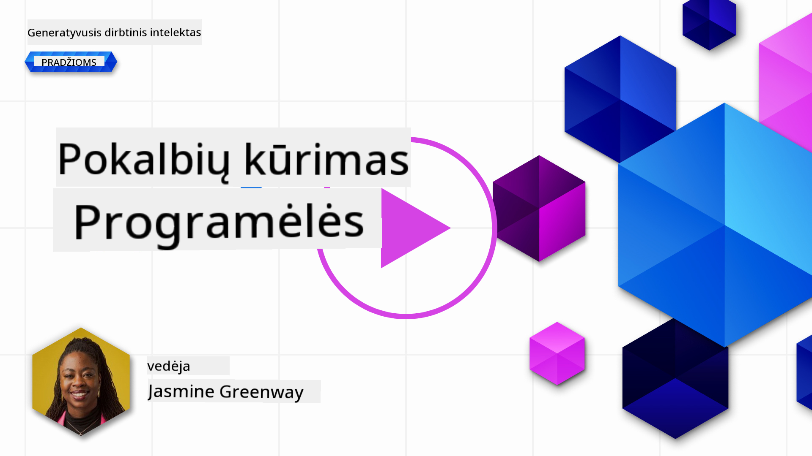
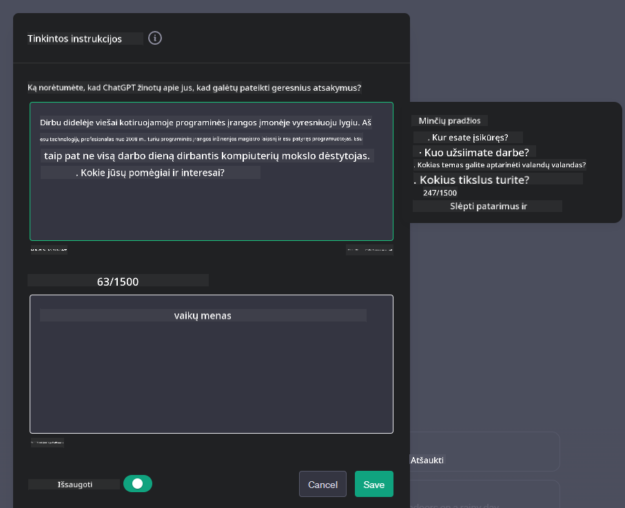

<!--
CO_OP_TRANSLATOR_METADATA:
{
  "original_hash": "ea4bbe640847aafbbba14dae4625e9af",
  "translation_date": "2025-08-25T12:32:18+00:00",
  "source_file": "07-building-chat-applications/README.md",
  "language_code": "lt"
}
-->
# Generatyvinio dirbtinio intelekto pagrindu veikiančių pokalbių programėlių kūrimas

[](https://aka.ms/gen-ai-lessons7-gh?WT.mc_id=academic-105485-koreyst)

> _(Spustelėkite aukščiau esantį paveikslėlį, kad peržiūrėtumėte šios pamokos vaizdo įrašą)_

Dabar, kai jau matėme, kaip galima kurti tekstą generuojančias programėles, pažvelkime į pokalbių programėles.

Pokalbių programėlės tapo neatsiejama mūsų kasdienio gyvenimo dalimi – jos siūlo daugiau nei tik galimybę neformaliai bendrauti. Jos yra svarbi klientų aptarnavimo, techninės pagalbos ir net sudėtingų konsultavimo sistemų dalis. Tikėtina, kad visai neseniai ir jūs gavote pagalbos iš pokalbių programėlės. Integruojant vis pažangesnes technologijas, tokias kaip generatyvinis DI, šių platformų sudėtingumas didėja, o kartu atsiranda ir naujų iššūkių.

Keli klausimai, į kuriuos reikia atsakyti:

- **Programėlės kūrimas**. Kaip efektyviai sukurti ir sklandžiai integruoti šias DI pagrindu veikiančias programėles konkretiems poreikiams?
- **Stebėsena**. Kai programėlė jau veikia, kaip galime stebėti ir užtikrinti, kad ji veiktų aukščiausios kokybės lygmeniu – tiek funkcionalumo, tiek laikantis [šešių atsakingo DI principų](https://www.microsoft.com/ai/responsible-ai?WT.mc_id=academic-105485-koreyst)?

Žengdami į automatikos ir sklandaus žmogaus bei mašinos bendradarbiavimo amžių, tampa itin svarbu suprasti, kaip generatyvinis DI keičia pokalbių programėlių galimybes, gilumą ir prisitaikymą. Šioje pamokoje nagrinėsime architektūrinius aspektus, kurie palaiko šias sudėtingas sistemas, gilinsimės į metodus, kaip jas pritaikyti konkrečioms sritims, ir įvertinsime metrikas bei svarbius aspektus, užtikrinančius atsakingą DI diegimą.

## Įvadas

Šioje pamokoje aptariama:

- Efektyvūs pokalbių programėlių kūrimo ir integravimo metodai.
- Kaip pritaikyti ir individualizuoti programėles.
- Strategijos ir svarbūs aspektai, kaip efektyviai stebėti pokalbių programėles.

## Mokymosi tikslai

Pamokos pabaigoje gebėsite:

- Apibūdinti, į ką reikia atsižvelgti kuriant ir integruojant pokalbių programėles į esamas sistemas.
- Pritaikyti pokalbių programėles konkretiems poreikiams.
- Nustatyti pagrindines metrikas ir svarbius aspektus, kaip efektyviai stebėti ir palaikyti DI pagrindu veikiančių pokalbių programėlių kokybę.
- Užtikrinti, kad pokalbių programėlės DI naudotų atsakingai.

## Generatyvinio DI integravimas į pokalbių programėles

Pokalbių programėlių tobulinimas generatyviniu DI nėra tik jų „protingumo“ didinimas – svarbu optimizuoti jų architektūrą, našumą ir naudotojo sąsają, kad būtų užtikrinta kokybiška naudotojo patirtis. Tai apima architektūrinių pagrindų, API integracijų ir naudotojo sąsajos aspektų analizę. Šiame skyriuje pateikiamas išsamus kelrodis, padėsiantis orientuotis šioje sudėtingoje srityje – tiek integruojant į esamas sistemas, tiek kuriant atskiras platformas.

Šio skyriaus pabaigoje turėsite žinių, kaip efektyviai kurti ir integruoti pokalbių programėles.

### Pokalbių robotas ar pokalbių programėlė?

Prieš pradėdami kurti pokalbių programėles, palyginkime „pokalbių robotus“ ir „DI pagrindu veikiančias pokalbių programėles“, kurios atlieka skirtingas funkcijas. Pokalbių roboto pagrindinis tikslas – automatizuoti tam tikras pokalbio užduotis, pavyzdžiui, atsakyti į dažniausiai užduodamus klausimus ar sekti siuntinį. Jis dažniausiai veikia pagal taisykles arba sudėtingus DI algoritmus. Tuo tarpu DI pagrindu veikianti pokalbių programėlė – tai daug platesnė aplinka, skirta įvairioms skaitmeninio bendravimo formoms: tekstui, balsui, vaizdo pokalbiams tarp žmonių. Jos išskirtinumas – generatyvinio DI modelio integracija, leidžianti simuliuoti niuansuotus, žmogiškus pokalbius ir generuoti atsakymus pagal įvairius įvesties ir konteksto signalus. Tokia programėlė gali dalyvauti atviro pobūdžio diskusijose, prisitaikyti prie besikeičiančio pokalbio konteksto ir net kurti kūrybišką ar sudėtingą dialogą.

Žemiau pateiktoje lentelėje išskirti pagrindiniai skirtumai ir panašumai, padedantys suprasti jų unikalų vaidmenį skaitmeniniame bendravime.

| Pokalbių robotas                      | Generatyvinio DI pagrindu veikianti pokalbių programėlė |
| ------------------------------------- | ------------------------------------------------------ |
| Užduočių orientuotas, veikia pagal taisykles | Konteksto suvokimas                             |
| Dažnai integruotas į didesnes sistemas | Gali talpinti vieną ar kelis pokalbių robotus   |
| Ribotas pagal užprogramuotas funkcijas | Naudoja generatyvinio DI modelius               |
| Specializuoti ir struktūruoti pokalbiai | Gali dalyvauti atviro pobūdžio diskusijose      |

### Paruoštų funkcijų naudojimas su SDK ir API

Kuriant pokalbių programėlę, verta pradėti nuo esamų sprendimų įvertinimo. SDK ir API naudojimas pokalbių programėlėms kurti yra naudingas dėl kelių priežasčių. Integruodami gerai dokumentuotus SDK ir API, užtikrinate ilgalaikę programėlės sėkmę, sprendžiate mastelio ir priežiūros klausimus.

- **Pagreitina kūrimo procesą ir sumažina sąnaudas**: Naudodami paruoštas funkcijas, o ne kurdami jas patys, galite sutelkti dėmesį į svarbesnius programėlės aspektus, pavyzdžiui, verslo logiką.
- **Geresnis našumas**: Kurdami funkcionalumą nuo nulio, anksčiau ar vėliau susimąstysite: „Kaip tai mastelinsis? Ar programėlė atlaikys staigų naudotojų antplūdį?“ Gerai prižiūrimi SDK ir API dažnai turi sprendimus šiems klausimams.
- **Lengvesnė priežiūra**: Atnaujinimai ir patobulinimai paprastesni – dažniausiai užtenka atnaujinti biblioteką, kai pasirodo nauja versija.
- **Prieiga prie pažangiausių technologijų**: Naudojant modelius, kurie jau apmokyti dideliais duomenų rinkiniais, jūsų programėlė įgyja natūralios kalbos supratimo galimybes.

Norint naudotis SDK ar API funkcijomis, dažniausiai reikia gauti leidimą – tam naudojamas unikalus raktas arba autentifikacijos žetonas. Naudosime OpenAI Python biblioteką, kad pamatytume, kaip tai atrodo. Taip pat galite išbandyti patys šioje [OpenAI užduotyje](python/oai-assignment.ipynb?WT.mc_id=academic-105485-koreyst) arba [Azure OpenAI Services užduotyje](python/aoai-assignment.ipynb?WT.mc_id=academic-105485-koreys) šiai pamokai.

```python
import os
from openai import OpenAI

API_KEY = os.getenv("OPENAI_API_KEY","")

client = OpenAI(
    api_key=API_KEY
    )

chat_completion = client.chat.completions.create(model="gpt-3.5-turbo", messages=[{"role": "user", "content": "Suggest two titles for an instructional lesson on chat applications for generative AI."}])
```

Aukščiau pateiktame pavyzdyje naudojamas GPT-3.5 Turbo modelis užduočiai atlikti, tačiau atkreipkite dėmesį, kad API raktas nustatomas prieš tai. Jei rakto nenustatytumėte, gautumėte klaidą.

## Naudotojo patirtis (UX)

Bendrieji UX principai galioja ir pokalbių programėlėms, tačiau dėl mašininio mokymosi komponentų atsiranda papildomų svarbių aspektų.

- **Neaiškumų sprendimo mechanizmas**: Generatyvinio DI modeliai kartais pateikia dviprasmius atsakymus. Funkcija, leidžianti naudotojui paprašyti paaiškinimo, gali būti labai naudinga.
- **Konteksto išlaikymas**: Pažangūs generatyvinio DI modeliai geba išlaikyti pokalbio kontekstą, o tai gali būti svarbu naudotojo patirčiai. Suteikdami naudotojui galimybę valdyti ir tvarkyti kontekstą, pagerinate patirtį, tačiau kyla rizika išsaugoti jautrią informaciją. Apgalvokite, kiek laiko ši informacija saugoma – pavyzdžiui, įveskite saugojimo politiką, kad būtų balansuojamas konteksto poreikis ir privatumas.
- **Personalizavimas**: DI modeliai gali mokytis ir prisitaikyti, todėl naudotojui suteikiama individualizuota patirtis. Tokios funkcijos kaip naudotojo profiliai ne tik leidžia jaustis suprastam, bet ir padeda greičiau rasti atsakymus, užtikrina efektyvesnį ir malonesnį bendravimą.

Vienas personalizavimo pavyzdžių – „Custom instructions“ nustatymai OpenAI ChatGPT. Jie leidžia pateikti informaciją apie save, kuri gali būti svarbi jūsų užklausoms. Štai pavyzdys:



Šis „profilis“ nurodo ChatGPT sukurti pamokos planą apie sąrašus. Atkreipkite dėmesį, kad ChatGPT atsižvelgia į tai, kad naudotojas gali norėti išsamesnio plano pagal savo patirtį.


### Microsoft sisteminių žinučių sistema dideliems kalbos modeliams

[Microsoft pateikė rekomendacijas](https://learn.microsoft.com/azure/ai-services/openai/concepts/system-message#define-the-models-output-format?WT.mc_id=academic-105485-koreyst), kaip rašyti efektyvias sistemines žinutes generuojant atsakymus iš LLM, suskirstytas į 4 sritis:

1. Apibrėžti, kam skirtas modelis, jo galimybes ir ribotumus.
2. Nustatyti modelio išvesties formatą.
3. Pateikti konkrečius pavyzdžius, demonstruojančius norimą modelio elgesį.
4. Nustatyti papildomas elgesio ribas.

### Prieinamumas

Nesvarbu, ar naudotojas turi regos, klausos, motorikos ar kognityvinių sutrikimų, gerai sukurta pokalbių programėlė turi būti prieinama visiems. Žemiau pateiktos funkcijos, skirtos pagerinti prieinamumą įvairių sutrikimų turintiems naudotojams.

- **Regos sutrikimams**: Didelio kontrasto temos, reguliuojamas teksto dydis, suderinamumas su ekrano skaitytuvais.
- **Klausos sutrikimams**: Teksto į kalbą ir kalbos į tekstą funkcijos, vizualiniai signalai apie garso pranešimus.
- **Motorikos sutrikimams**: Klaviatūros navigacijos palaikymas, balso komandos.
- **Kognityviniams sutrikimams**: Supaprastintos kalbos parinktys.

## Individualizavimas ir pritaikymas konkrečiai sričiai

Įsivaizduokite pokalbių programėlę, kuri supranta jūsų įmonės žargoną ir numato dažniausius naudotojų klausimus. Yra keli būdai, kaip to pasiekti:

- **Naudoti DSL modelius**. DSL reiškia konkrečios srities kalbą. Galite naudoti taip vadinamą DSL modelį, apmokytą konkrečioje srityje, kad jis suprastų jos sąvokas ir scenarijus.
- **Taikyti pritaikymą (fine-tuning)**. Tai procesas, kai modelis papildomai apmokomas su konkrečiais duomenimis.

## Individualizavimas: DSL modelio naudojimas

Naudojant konkrečios srities kalbos modelius (DSL modelius), galima pagerinti naudotojų įsitraukimą, nes jie pateikia specializuotus, kontekstui aktualius atsakymus. Tai modelis, apmokytas ar papildomai apmokytas generuoti tekstą konkrečioje srityje, pramonėje ar temoje. DSL modelį galima sukurti nuo nulio, naudoti jau esamus per SDK ar API, arba pritaikyti (fine-tune) jau apmokytą modelį konkrečiai sričiai.

## Individualizavimas: pritaikymo (fine-tuning) taikymas

Pritaikymas dažnai taikomas, kai iš anksto apmokytas modelis nepakankamai gerai veikia specializuotoje srityje ar užduotyje.

Pavyzdžiui, medicininiai klausimai yra sudėtingi ir reikalauja daug konteksto. Gydytojas diagnozuodamas pacientą atsižvelgia į įvairius veiksnius, tokius kaip gyvenimo būdas ar gretutinės ligos, ir gali remtis naujausiais medicinos žurnalais. Tokiose subtiliose situacijose bendros paskirties DI pokalbių programėlė nėra patikimas šaltinis.

### Scenarijus: medicininė programėlė

Įsivaizduokite pokalbių programėlę, skirtą medicinos specialistams, kuri greitai pateikia gydymo rekomendacijas, vaistų sąveikas ar naujausius tyrimų rezultatus.

Bendros paskirties modelis gali tikti atsakant į paprastus medicininius klausimus ar teikiant bendrus patarimus, tačiau jam gali kilti sunkumų šiose situacijose:

- **Labai specifiniai ar sudėtingi atvejai**. Pavyzdžiui, neurologas gali paklausti: „Kokios šiuo metu geriausios praktikos gydant vaistams atsparią epilepsiją vaikams?“
- **Naujausių pasiekimų trūkumas**. Bendros paskirties modelis gali nesugebėti pateikti naujausiais neurologijos ir farmakologijos pasiekimais pagrįsto atsakymo.

Tokiais atvejais modelio pritaikymas su specializuotu medicininiu duomenų rinkiniu gali žymiai pagerinti jo gebėjimą tiksliai ir patikimai atsakyti į sudėtingus medicininius klausimus. Tam reikia turėti didelį ir aktualų duomenų rinkinį, atspindintį konkrečios srities iššūkius ir klausimus.

## Aukštos kokybės DI pagrindu veikiančios pokalbių patirties aspektai

Šiame skyriuje apibrėžiami „aukštos kokybės“ pokalbių programėlių kriterijai, įskaitant svarbių metrikų stebėseną ir atsakingą DI technologijos naudojimą.

### Pagrindinės metrikos

Norint išlaikyti aukštą programėlės našumą, būtina stebėti pagrindines metrikas ir aspektus. Šie rodikliai padeda ne tik užtikrinti programėlės funkcionalumą, bet ir įvertinti DI modelio bei naudotojo patirties kokybę. Žemiau pateiktas sąrašas apima pagrindines, DI ir naudotojo patirties metrikas, į kurias verta atsižvelgti.

| Metrika                      | Apibrėžimas                                                                                                            | Ką turi apgalvoti pokalbių programėlės kūrėjas                           |
| ---------------------------- | --------------------------------------------------------------------------------------------------------------------- | ------------------------------------------------------------------------- |
| **Veikimo laikas (Uptime)**  | Matuoja, kiek laiko programėlė veikia ir yra pasiekiama naudotojams.                                                  | Kaip sumažinsite neveikimo laiką?                                         |
| **Atsakymo laikas**          | Laikas, per kurį programėlė atsako į naudotojo užklausą.                                                             
| **Anomalijų aptikimas**         | Įrankiai ir metodai, skirti nustatyti neįprastus modelius, kurie neatitinka tikėtino elgesio.                        | Kaip reaguosite į aptiktas anomalijas?                                        |

### Atsakingo dirbtinio intelekto principų taikymas pokalbių programėlėse

Microsoft atsakingo DI požiūris išskiria šešis principus, kurie turėtų vadovauti DI kūrimui ir naudojimui. Žemiau pateikti principai, jų apibrėžimai ir dalykai, į kuriuos turėtų atsižvelgti pokalbių programėlės kūrėjas bei kodėl tai svarbu.

| Principai             | Microsoft apibrėžimas                                | Ką turėtų apsvarstyti pokalbių programėlės kūrėjas                        | Kodėl tai svarbu                                                                     |
| --------------------- | ---------------------------------------------------- | ------------------------------------------------------------------------- | ------------------------------------------------------------------------------------- |
| Teisingumas           | DI sistemos turėtų visus žmones vertinti vienodai.   | Užtikrinkite, kad pokalbių programėlė nediskriminuotų pagal naudotojo duomenis. | Kuria pasitikėjimą ir įtrauktį tarp naudotojų; padeda išvengti teisinių pasekmių.     |
| Patikimumas ir saugumas | DI sistemos turi veikti patikimai ir saugiai.        | Įgyvendinkite testavimą ir apsaugos priemones, kad sumažintumėte klaidas ir rizikas. | Užtikrina naudotojų pasitenkinimą ir apsaugo nuo galimos žalos.                       |
| Privatumas ir saugumas | DI sistemos turi būti saugios ir gerbti privatumą.   | Naudokite stiprų šifravimą ir duomenų apsaugos priemones.                  | Apsaugo jautrius naudotojų duomenis ir padeda laikytis privatumo įstatymų.            |
| Įtrauktis             | DI sistemos turi įgalinti visus ir įtraukti žmones.  | Kurkite vartotojo sąsają, kuri būtų prieinama ir patogi įvairioms auditorijoms. | Užtikrina, kad programėle galėtų efektyviai naudotis platesnis žmonių ratas.          |
| Skaidrumas            | DI sistemos turi būti suprantamos.                   | Pateikite aiškią dokumentaciją ir paaiškinimus dėl DI atsakymų.            | Naudotojai labiau pasitiki sistema, jei supranta, kaip priimami sprendimai.           |
| Atsakomybė            | Žmonės turi būti atsakingi už DI sistemas.           | Nustatykite aiškų procesą DI sprendimų auditui ir tobulinimui.             | Leidžia nuolat tobulinti ir taisyti klaidas, jei jų pasitaiko.                        |

## Užduotis

Peržiūrėkite [užduotį](../../../07-building-chat-applications/python) – ji padės jums atlikti įvairius pratimus: nuo pirmųjų pokalbių užklausų iki teksto klasifikavimo, apibendrinimo ir dar daugiau. Atkreipkite dėmesį, kad užduotys prieinamos skirtingomis programavimo kalbomis!

## Puikus darbas! Tęskite kelionę

Baigę šią pamoką, apsilankykite mūsų [Generatyvaus DI mokymosi kolekcijoje](https://aka.ms/genai-collection?WT.mc_id=academic-105485-koreyst), kad toliau gilintumėte žinias apie generatyvų DI!

Eikite į 8 pamoką ir sužinokite, kaip galite pradėti [kurti paieškos programėles](../08-building-search-applications/README.md?WT.mc_id=academic-105485-koreyst)!

---

**Atsakomybės atsisakymas**:  
Šis dokumentas buvo išverstas naudojant dirbtinio intelekto vertimo paslaugą [Co-op Translator](https://github.com/Azure/co-op-translator). Nors siekiame tikslumo, prašome atkreipti dėmesį, kad automatiniai vertimai gali turėti klaidų ar netikslumų. Originalus dokumentas jo gimtąja kalba turėtų būti laikomas autoritetingu šaltiniu. Kritinei informacijai rekomenduojamas profesionalus žmogaus vertimas. Mes neatsakome už nesusipratimus ar neteisingą interpretavimą, kilusį dėl šio vertimo naudojimo.