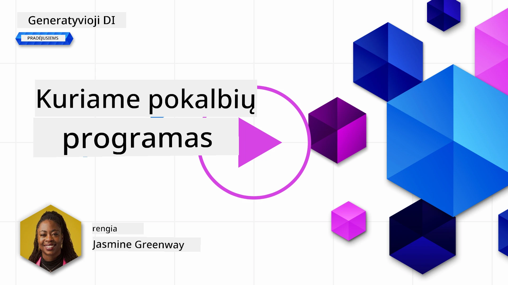
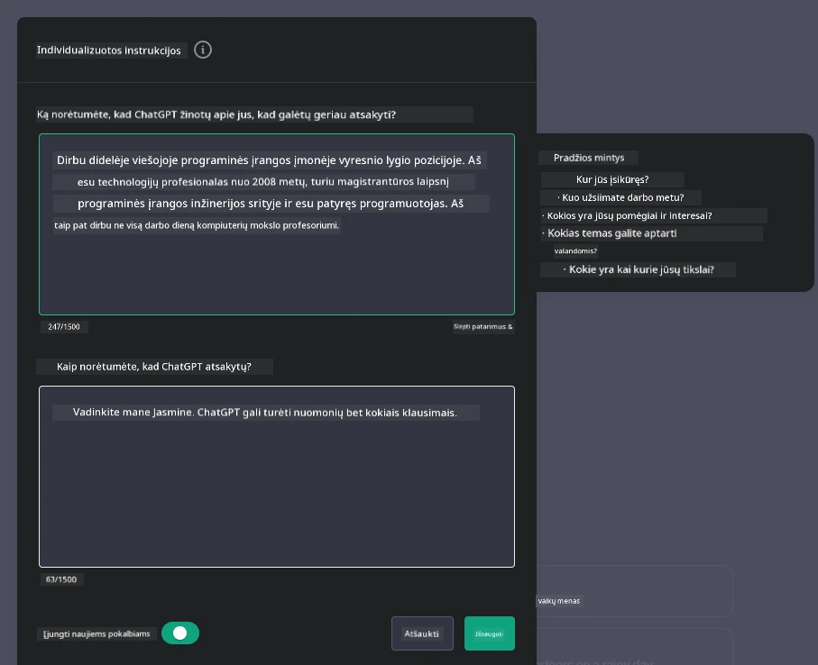
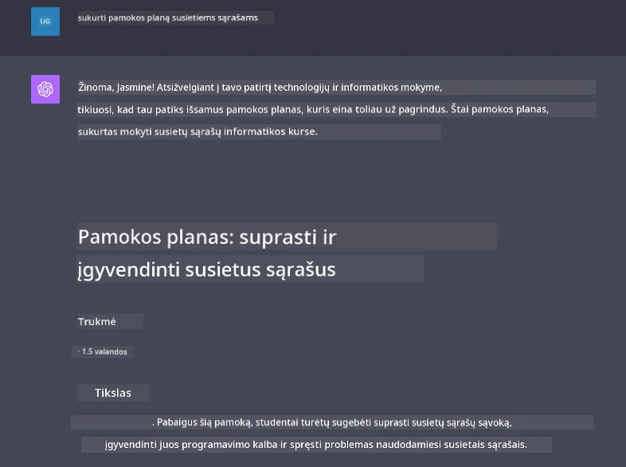

# Generatyvios AI pagrindu veikiančių pokalbių programų kūrimas

[](https://youtu.be/R9V0ZY1BEQo?si=IHuU-fS9YWT8s4sA)

> _(Spustelėkite aukščiau esančią nuotrauką, kad peržiūrėtumėte šios pamokos vaizdo įrašą)_

Dabar, kai matėme, kaip galime kurti teksto generavimo programas, pažvelkime į pokalbių programas.

Pokalbių programos tapo integralia mūsų kasdienio gyvenimo dalimi – jos ne tik leidžia laisvai bendrauti. Jos yra svarbi klientų aptarnavimo, techninės pagalbos ir net sudėtingų konsultavimo sistemų dalis. Greičiausiai neseniai jau gavote pagalbą iš pokalbių programos. Integruojant pažangesnes technologijas, tokias kaip generatyvioji AI, į šias platformas, didėja ne tik sudėtingumas, bet ir iššūkiai.

Kai kurie klausimai, kuriuos turime išspręsti, yra:

- **Programos kūrimas**. Kaip efektyviai sukurti ir sklandžiai integruoti šias AI pagrindu veikiančias programas konkretiems naudojimo atvejams?
- **Stebėsena**. Įdiegus, kaip galima stebėti ir užtikrinti, kad programos veiktų aukščiausios kokybės lygiu tiek funkcionalumo, tiek laikymosi [atsakingos AI šešių principų](https://www.microsoft.com/ai/responsible-ai?WT.mc_id=academic-105485-koreyst) atžvilgiu?

Judant toliau automatizacijos ir sklandaus žmogaus bei mašinos sąveikos amžiuje, būtina suprasti, kaip generatyvioji AI keičia pokalbių programų apimtį, gilumą ir pritaikomumą. Šioje pamokoje nagrinėsime architektūros aspektus, kurie palaiko šias sudėtingas sistemas, metodikas, kaip jas pritaikyti specifinėms sritims, ir įvertinsime metrikas bei svarstymus, susijusius su atsakinga AI diegimu.

## Įvadas

Ši pamoka apima:

- Technikas, kaip efektyviai kurti ir integruoti pokalbių programas.
- Kaip taikyti pritaikymą ir smulkų derinimą programoms.
- Strategijas ir svarstymus, kaip efektyviai stebėti pokalbių programas.

## Mokymosi tikslai

Pabaigę šią pamoką, galėsite:

- Apibūdinti svarstymus statant ir integruojant pokalbių programas į esamas sistemas.
- Pritaikyti pokalbių programas konkretiems naudojimo atvejams.
- Nustatyti pagrindines metrikas ir svarstymus efektyviai stebėti ir palaikyti AI pagrindu veikiančių pokalbių programų kokybę.
- Užtikrinti, kad pokalbių programos atsakingai naudotų AI.

## Generatyvios AI integravimas į pokalbių programas

Tobulinant pokalbių programas naudojant generatyviąją AI, svarbu ne tik jas padaryti protingesnes, bet ir optimizuoti jų architektūrą, veikimą bei vartotojo sąsają, kad būtų užtikrinta kokybiška vartotojo patirtis. Tai apima architektūrinių pagrindų, API integracijų ir vartotojo sąsajos svarstymų tyrimą. Ši dalis siekia suteikti jums išsamų vadovą šiose sudėtingose srityse, vienaip ar kitaip jungiant jas prie esamų sistemų arba kuriant kaip atskiras platformas.

Pabaigoje turėsite reikiamų žinių efektyviai kurti ir įtraukti pokalbių programas.

### Pokalbių robotas ar pokalbių programa?

Prieš pradėdami kurti pokalbių programas, palyginkime „pokalbių robotus“ ir „AI pagrindu veikiančias pokalbių programas“, kurios atlieka skirtingas funkcijas ir vaidmenis. Pokalbių roboto pagrindinis tikslas – automatizuoti specifines pokalbių užduotis, pavyzdžiui, atsakyti į dažnai užduodamus klausimus ar stebėti siuntinį. Dažniausiai juos valdo taisyklėmis pagrįsta logika arba sudėtingi AI algoritmai. Priešingai, AI pagrindu veikianti pokalbių programa yra kur kas platesnė aplinka, skirta įvairiems skaitmeninės komunikacijos formoms – tekstiniams, balso ir vaizdo pokalbiams tarp žmonių. Jos pagrindinė savybė – generatyvios AI modelio integracija, kuri imituoja niuansuotus, žmogui būdingus pokalbius, generuodama atsakymus pagal įvairias įvestis ir kontekstinius signalus. Generatyvioji AI palaikoma pokalbių programa gali dalyvauti atvirų temų diskusijose, prisitaikyti prie besikeičiančių pokalbių kontekstų ir net kurti kūrybišką ar sudėtingą dialogą.

Žemiau pateikta lentelė išryškina pagrindinius skirtumus ir panašumus, kad geriau suprastume jų unikalias roles skaitmeninėje komunikacijoje.

| Pokalbių robotas                     | Generatyviai AI pagrįsta pokalbių programa                      |
| ----------------------------------- | --------------------------------------------------------------- |
| Užduočių orientuotas ir taisyklėmis valdomas | Kontekstą atpažįstantis                                       |
| Dažnai integruotas į didesnes sistemas | Gali talpinti vieną ar kelis pokalbių robotus                   |
| Ribojasi su programuotomis funkcijomis | Įtraukia generatyvius AI modelius                              |
| Specializuotos ir struktūruotos sąveikos | Geba vesti atvirų temų diskusijas                              |

### Iš anksto sukurtų funkcijų panaudojimas su SDK ir API

Statant pokalbių programą, pirmasis žingsnis yra įvertinti, kas jau egzistuoja. SDK ir API naudojimas pokalbių programoms kurti yra naudinga strategija dėl įvairių priežasčių. Integruodami gerai dokumentuotus SDK ir API, strategiškai pozicionuojate savo programą ilgalaikei sėkmei, spręsdami mastelio keitimo ir priežiūros problemas.

- **Pagreitina vystymosi procesą ir sumažina apkrovą**: Pasikliaujant iš anksto sukurtomis funkcijomis jūs sutaupote brangaus laiko, kurį reiktų skirti jų kūrimui, todėl galite daugiau dėmesio skirti kitiems programos aspektams, pavyzdžiui, verslo logikai.
- **Geresnis veikimas**: Kuriant funkcijas nuo nulio, galiausiai kyla klausimai „Kaip tai plėtotis? Ar programa gali susidoroti su staigiu vartotojų padaugėjimu?“ Gerai prižiūrimi SDK ir API dažnai turi įdiegtus sprendimus šioms problemoms.
- **Lengvesnė priežiūra**: Atnaujinimai ir patobulinimai yra lengviau valdomi, nes daugumai API ir SDK tiesiog reikia atnaujinti biblioteką išleidus naują jos versiją.
- **Prieiga prie pažangiausių technologijų**: Naudojant modelius, kurie yra smulkiai derinti ir apmokyti remiantis plačiomis duomenų bazėmis, jūsų programa įgyja natūralios kalbos galimybes.

SDK ar API funkcijų naudojimas dažniausiai reikalauja leidimo naudotis suteiktomis paslaugomis, dažnai per unikalų raktą arba autentifikavimo žetoną. Pažvelgsime, kaip tai atrodo naudodami OpenAI Python biblioteką. Šią pamoką taip pat galite išbandyti savarankiškai šioje [OpenAI užduočių knygoje](./python/oai-assignment.ipynb?WT.mc_id=academic-105485-koreyst) arba [Azure OpenAI paslaugų užduočių knygoje](./python/aoai-assignment.ipynb?WT.mc_id=academic-105485-koreys).

```python
import os
from openai import OpenAI

API_KEY = os.getenv("OPENAI_API_KEY","")

client = OpenAI(
    api_key=API_KEY
    )

response = client.responses.create(model="gpt-4o-mini", input="Suggest two titles for an instructional lesson on chat applications for generative AI.", store=False)
print(response.output_text)
```

Aukščiau pateiktame pavyzdyje naudojamas GPT-4o mini modelis su Atsakymų API užbaigiant užklausą, tačiau atkreipkite dėmesį, kad API raktas nustatytas iš anksto. Jei to nepadarysite, gausite klaidą.

## Vartotojo patirtis (UX)

Bendros UX taisyklės taikomos pokalbių programoms, tačiau čia pateikiamos papildomos svarstymai, kurie tampa ypač svarbūs dėl įtrauktų mašininio mokymosi komponentų.

- **Neapibrėžtumo sprendimo mechanizmas**: Generatyvios AI modeliai kartais generuoja dviprasmius atsakymus. Funkcija, leidžianti vartotojams prašyti patikslinimų, gali būti labai naudinga susidūrus su šia problema.
- **Konteksto išlaikymas**: Pažangūs generatyvios AI modeliai gali prisiminti pokalbio kontekstą, kas yra svarbus vartotojo patirties aspektas. Leidžiant vartotojams valdyti kontekstą pagerina patirtį, bet tai taip pat kelia riziką saugoti jautrią informaciją. Svarstymai, kiek ilgai tokia informacija saugoma, pavyzdžiui, įvedant saugojimo politiką, leidžia subalansuoti konteksto poreikį su privatumu.
- **Personalizavimas**: Gebėjimas mokytis ir prisitaikyti leidžia AI modeliams suteikti asmeninę patirtį. Pritaikant vartotojo patirtį per funkcijas, tokias kaip vartotojo profiliai, ne tik sukuriama įspūdis, kad vartotojas yra suprastas, bet tai taip pat padeda greičiau ir efektyviau rasti reikiamus atsakymus bei patenkinti poreikius.

Vienas tokių personalizavimo pavyzdžių yra „Individualūs nurodymai“ OpenAI ChatGPT nustatymuose. Tai leidžia pateikti informaciją apie save, kuri gali būti svarbus kontekstas jūsų užklausoms. Štai pavyzdys, kaip atrodo individualus nurodymas.



Šis „profilis“ nurodo ChatGPT sukurti pamokos planą apie susietų sąrašų temą. Pastebėkite, kad ChatGPT atsižvelgia į tai, kad vartotoja gali norėti išsamiau išdėstyto plano, remdamasi jos patirtimi.



### Microsoft sistemos pranešimų sistema dideliems kalbos modeliams

[Microsoft pateikė rekomendacijas](https://learn.microsoft.com/azure/ai-services/openai/concepts/system-message#define-the-models-output-format?WT.mc_id=academic-105485-koreyst) apie veiksmingų sistemos pranešimų rašymą generuojant atsakymus iš didelių kalbos modelių, suskirstytų į 4 sritis:

1. Apibrėžti, kam skirtas modelis, taip pat jo galimybes ir ribotumus.
2. Apibrėžti modelio išvesties formatą.
3. Pateikti konkrečius pavyzdžius, kurie rodo numatytą modelio elgesį.
4. Pateikti papildomus elgesio apsaugos mechanizmus.

### Prieinamumas

Nesvarbu, ar vartotojas turi regos, klausos, motorikos ar pažintinius sutrikimus – gerai sukurta pokalbių programa turėtų būti naudinga visiems. Toliau pateikiamas sąrašas su specifinėmis funkcijomis, skirtomis gerinti prieinamumą įvairiems vartotojų sutrikimams.

- **Funkcijos regos sutrikimams**: Didelio kontrasto temos ir keičiami tekstai, suderinamumas su ekrano skaitytuvais.
- **Funkcijos klausos sutrikimams**: Teksto į kalbą ir kalbos į tekstą funkcijos, vizualiniai signalai garso pranešimams.
- **Funkcijos motorikos sutrikimams**: Klaviatūros navigacijos palaikymas, balso komandos.
- **Funkcijos pažintiniams sutrikimams**: Supaprastinta kalbų parinktis.

## Pritaikymas ir smulkus derinimas domeno specifiniams kalbos modeliams

Įsivaizduokite pokalbių programą, kuri supranta jūsų įmonės terminus ir numato specifines užklausas, kurios dažniausiai kyla jos naudotojams. Yra keletas svarbių metodų:

- **Domeno specifinių kalbos (DSL) modelių panaudojimas**. DSL reiškia domenui specifinę kalbą. Galite naudoti vadinamąjį DSL modelį, apmokytą konkrečiam domenui suprasti jo sąvokas ir situacijas.
- **Taikyti smulkų derinimą**. Smulkus derinimas yra modelio tolesnis mokymas su specifiniais duomenimis.

## Pritaikymas: naudojant DSL

Naudojant domenui specifinius kalbos modelius (DSL modelius) galima pagerinti vartotojų įsitraukimą, suteikiant specializuotas, kontekstiškai tinkamas sąveikas. Tai modelis, kuris yra apmokytas arba smulkiai derintas suprasti ir generuoti tekstą susijusį su konkrečia sritimi, pramone arba tema. DSL modelio panaudojimo galimybės apima modelio mokymą nuo nulio arba jau egzistuojančių per SDK ir API naudojimą. Kita galimybė – smulkus derinimas, kai paimamas esamas iš anksto apmokytas modelis ir pritaikomas specifiniam domenui.

## Pritaikymas: taikyti smulkų derinimą

Smulkus derinimas paprastai svarstomas, kai iš anksto apmokytas modelis neatitinka specializuotos srities ar konkrečios užduoties poreikių.

Pavyzdžiui, medicininiai klausimai yra sudėtingi ir reikalauja daug konteksto. Medicinos specialistas diagnozuodamas pacientą atsižvelgia į įvairius veiksnius, tokius kaip gyvenimo būdas ar iš anksto esantys sutrikimai, ir gali net pasikliauti naujausiais medicinos žurnalais patvirtindamas diagnozę. Tokiose niuansuotose situacijose bendros paskirties AI pokalbių programa negali būti patikimu šaltiniu.

### Scenarijus: medicinos programa

Apsvarstykite pokalbių programą, skirtą padėti medicinos specialistams greitai rasti gydymo gairių, vaistų sąveikų ar naujausių tyrimų rezultatus.

Bendros paskirties modelis gali būti tinkamas atsakyti į bendruosius medicininius klausimus ar suteikti bendrą patarimą, bet jis gali susidurti su sunkumais šiose srityse:

- **Labai specifinės ar sudėtingos situacijos**. Pavyzdžiui, neurologas gali paklausti programos: „Kokios yra dabartinės geriausios praktikos vaistams atsparios epilepsijos valdymui pediatrinėje pacientų grupėje?“
- **Trūksta naujausių pasiekimų**. Bendros paskirties modelis gali sunkiai pateikti naujausią atsakymą, atspindintį paskutinius neurologijos ir farmakologijos pasiekimus.

Tokiais atvejais modelio smulkus derinimas su specializuotu medicinos duomenų rinkiniu gali žymiai pagerinti jo gebėjimą tiksliai ir patikimai tvarkyti sudėtingas medicinines užklausas. Tai reikalauja prieigos prie didelio ir susijusio duomenų rinkinio, atspindinčio domenui būdingus iššūkius ir klausimus, kuriuos reikia spręsti.

## Aukštos kokybės AI valdomos pokalbių patirties svarstymai

Ši dalis išdėsto „aukštos kokybės“ pokalbių programų kriterijus, įskaitant veiksmingų metrikų fiksavimą ir atsakingo AI technologijos naudojimo principų laikymąsi.

### Pagrindinės metrikos

Norint palaikyti aukštos kokybės programos veikimą, būtina sekti pagrindines metrikas ir svarstymus. Šie rodikliai ne tik užtikrina programos funkcionalumą, bet ir vertina AI modelio bei vartotojo patirties kokybę. Toliau pateikiamas sąrašas apimantis pagrindines, AI ir vartotojo patirties metrikas.

| Metrika                     | Apibrėžimas                                                                                                           | Svarstymai pokalbių programų kūrėjui                         |
| ---------------------------- | -------------------------------------------------------------------------------------------------------------------- | ------------------------------------------------------------ |
| **Prieinamumo laikas (uptime)** | Matuoja, kiek laiko programa veikia ir yra prieinama vartotojams.                                                   | Kaip sumažinsite prastovas?                                  |
| **Atsakymo laikas**          | Laikas, per kurį programa atsako į vartotojo užklausą.                                                               | Kaip optimizuosite užklausų apdorojimą, kad pagerintumėte atsakymo laiką? |
| **Tikslumas (precision)**    | Teisingų teigiamų prognozių santykis su visomis teigiamomis prognozėmis.                                            | Kaip patikrinsite savo modelio tikslumą?                      |
| **Atmintis (recall, jautrumas)** | Teisingų teigiamų prognozių santykis su realiomis teigiamomis reikšmėmis.                                           | Kaip matuosite ir gerinsite atmintį?                          |
| **F1 balas**                | Tikslumo ir atminties harmoninis vidurkis, subalansuojantis šių dviejų rodiklių mainus.                              | Koks yra jūsų tikslinis F1 balas? Kaip subalansuosite tikslumą ir atmintį? |
| **Painumas (perplexity)**     | Matuoja, kaip gerai modelio prognozuojama tikimybių pasiskirstymas atitinka tikrą duomenų pasiskirstymą.               | Kaip sumažinsite painumą?                                    |
| **Vartotojų pasitenkinimo metrikos** | Matuoja vartotojo požiūrį į programą. Dažnai renkami apklausomis.                                                    | Kaip dažnai rinksitės vartotojų atsiliepimus? Kaip juos naudosite adaptavimui? |
| **Klaidų dažnis**            | Modelio klaidų kiekis suprantant arba kuriant išvestį.                                                              | Kokias strategijas turite klaidų dažniui mažinti?            |
| **Perkvalifikavimo ciklai** | Kaip dažnai modelis atnaujinamas, įtraukiant naujus duomenis ir įžvalgas.                                            | Kaip dažnai perkvalifikuosite modelį? Kas sukelia perkvalifikavimo ciklą? |

| **Anomalių aptikimas**      | Įrankiai ir technikos neįprastoms, nuo tikėtino elgesio neatitinkančioms, modelių identifikavimui.                 | Kaip reaguosite į anomalijas?                                            |

### Atsakingos DI praktikos diegimas pokalbių programėlėse

„Microsoft“ požiūris į Atsakingą DI identifikavo šešis principus, kurie turėtų vadovauti DI kūrimui ir naudojimui. Žemiau pateikti principai, jų apibrėžimas ir dalykai, kuriuos pokalbių programėlės kūrėjas turėtų apsvarstyti, ir kodėl juos būtina rimtai vertinti.

| Principai             | „Microsoft“ apibrėžimas                                | Apsvarstymai pokalbių programėlės kūrėjui                          | Kodėl tai svarbu                                                               |
| ---------------------- | ----------------------------------------------------- | ----------------------------------------------------------------- | ----------------------------------------------------------------------------- |
| Teisingumas           | DI sistemos turėtų elgtis teisingai su visais žmonėmis. | Užtikrinkite, kad pokalbių programėlė nediskriminuotų pagal naudotojo duomenis. | Siekiant kurti pasitikėjimą ir įtrauktį tarp naudotojų; išvengti teisinių pasekmių. |
| Patikimumas ir saugumas | DI sistemos turėtų veikti patikimai ir saugiai.         | Įdiekite testavimą ir atsargumo priemones, kad sumažintumėte klaidas ir rizikas. | Užtikrina naudotojų pasitenkinimą ir apsaugo nuo galimos žalos.              |
| Privatumas ir saugumas | DI sistemos turėtų būti saugios ir gerbti privatumą.   | Įgyvendinkite stiprią šifravimą ir duomenų apsaugos priemones.        | Siekiant apsaugoti jautrius naudotojų duomenis ir laikytis privatumo įstatymų. |
| Įtrauktis             | DI sistemos turėtų įgalinti visus ir įtraukti žmones. | Sukurkite vartotojo sąsają/naudotojo patirtį, kuri yra prieinama ir patogi įvairiai auditorijai. | Užtikrina, kad platesnė žmonių grupė gali efektyviai naudotis programėle.    |
| Skaidrumas            | DI sistemos turėtų būti suprantamos.                    | Pateikite aiškią dokumentaciją ir pagrindimą DI atsakymams.           | Naudotojai labiau pasitiki sistema, jei gali suprasti, kaip priimami sprendimai. |
| Atsakomybė            | Žmonės turėtų būti atsakingi už DI sistemas.            | Sukurkite aiškų procesą DI sprendimų tikrinimui ir gerinimui.          | Leidžia nuolatinį tobulinimą ir taisomąsias priemones klaidų atveju.          |

## Užduotis

Peržiūrėkite [užduotį](../../../07-building-chat-applications/python). Ji ves per keletą pratimų nuo pirmųjų pokalbių užklausų paleidimo iki teksto klasifikavimo ir santraukų rengimo bei daugiau. Atkreipkite dėmesį, kad užduotys prieinamos įvairiomis programavimo kalbomis!

## Puikiai! Tęskite kelionę

Užbaigus šią pamoką, apžiūrėkite mūsų [Generatyvinio DI mokymosi kolekciją](https://aka.ms/genai-collection?WT.mc_id=academic-105485-koreyst) ir toliau keldami savo žinias apie Generatyvinį DI!

Eikite į 8 pamoką, kad pamatytumėte, kaip pradėti [kurti paieškos programėles](../08-building-search-applications/README.md?WT.mc_id=academic-105485-koreyst)!

---

<!-- CO-OP TRANSLATOR DISCLAIMER START -->
**Atsakomybės apribojimas**:
Šis dokumentas buvo išverstas naudojant dirbtinio intelekto vertimo paslaugą [Co-op Translator](https://github.com/Azure/co-op-translator). Nors siekiame tikslumo, prašome atkreipti dėmesį, kad automatiniai vertimai gali turėti klaidų ar netikslumų. Originalus dokumentas jo gimtąja kalba laikomas autoritetingu šaltiniu. Svarbiai informacijai rekomenduojama naudoti profesionalų žmogiškąjį vertimą. Mes neatsakome už jokius nesusipratimus ar neteisingą interpretaciją, kilusią naudojantis šiuo vertimu.
<!-- CO-OP TRANSLATOR DISCLAIMER END -->