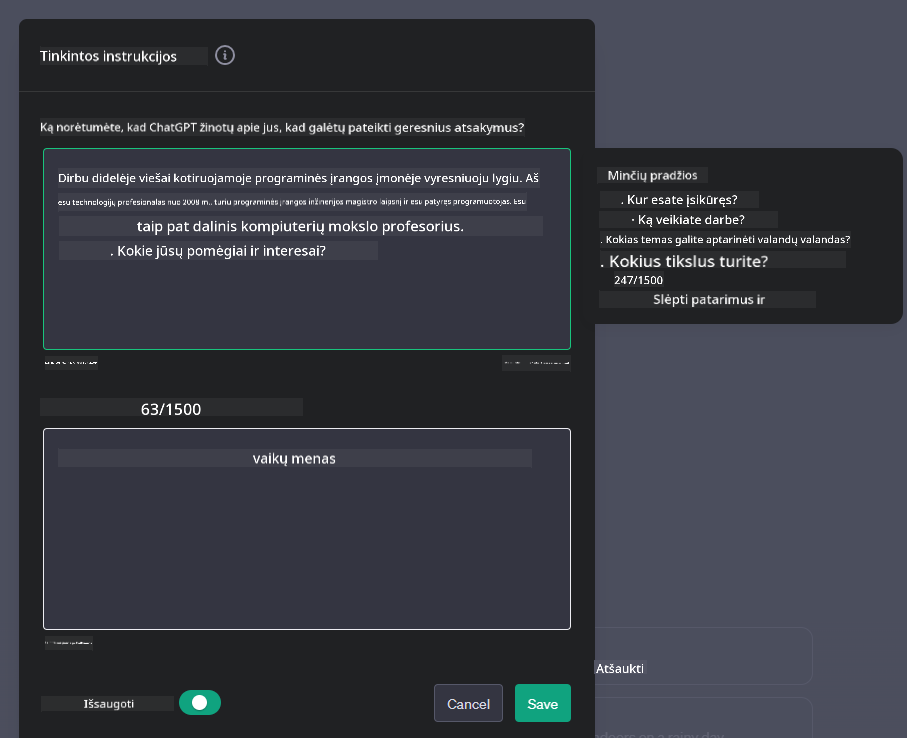

<!--
CO_OP_TRANSLATOR_METADATA:
{
  "original_hash": "a5308963a56cfbad2d73b0fa99fe84b3",
  "translation_date": "2025-10-18T02:29:08+00:00",
  "source_file": "07-building-chat-applications/README.md",
  "language_code": "lt"
}
-->
# Generatyviosios AI technologijos pagrindu sukurtų pokalbių programų kūrimas

[](https://youtu.be/R9V0ZY1BEQo?si=IHuU-fS9YWT8s4sA)

> _(Spustelėkite aukščiau esančią nuotrauką, kad peržiūrėtumėte šios pamokos vaizdo įrašą)_

Dabar, kai jau susipažinome su tekstų generavimo programų kūrimu, pažvelkime į pokalbių programas.

Pokalbių programos tapo neatsiejama mūsų kasdienio gyvenimo dalimi, siūlydamos ne tik galimybę bendrauti. Jos yra svarbi klientų aptarnavimo, techninės pagalbos ir net sudėtingų konsultavimo sistemų dalis. Tikėtina, kad neseniai gavote pagalbos iš pokalbių programos. Integruojant pažangias technologijas, tokias kaip generatyvioji AI, į šias platformas, didėja jų sudėtingumas, o kartu ir iššūkiai.

Kai kurie klausimai, į kuriuos reikia atsakyti:

- **Programos kūrimas**. Kaip efektyviai sukurti ir sklandžiai integruoti šias AI pagrindu veikiančias programas konkretiems naudojimo atvejams?
- **Stebėjimas**. Kai programa jau veikia, kaip galime stebėti ir užtikrinti, kad ji veiktų aukščiausios kokybės lygiu tiek funkcionalumo, tiek laikantis [šešių atsakingos AI principų](https://www.microsoft.com/ai/responsible-ai?WT.mc_id=academic-105485-koreyst)?

Judant į priekį automatizacijos ir sklandaus žmogaus-mašinos sąveikos amžiuje, tampa būtina suprasti, kaip generatyvioji AI keičia pokalbių programų apimtį, gilumą ir prisitaikymą. Šioje pamokoje bus nagrinėjami architektūros aspektai, palaikantys šias sudėtingas sistemas, aptariami metodai, skirti jų pritaikymui konkrečioms užduotims, ir vertinami metrikos bei svarstymai, susiję su atsakingu AI diegimu.

## Įvadas

Šioje pamokoje aptariama:

- Efektyvūs pokalbių programų kūrimo ir integravimo metodai.
- Kaip pritaikyti ir optimizuoti programas.
- Strategijos ir svarstymai, kaip efektyviai stebėti pokalbių programas.

## Mokymosi tikslai

Pamokos pabaigoje galėsite:

- Apibūdinti svarstymus, susijusius su pokalbių programų kūrimu ir integravimu į esamas sistemas.
- Pritaikyti pokalbių programas konkretiems naudojimo atvejams.
- Nustatyti pagrindines metrikas ir svarstymus, kaip efektyviai stebėti ir palaikyti AI pagrindu veikiančių pokalbių programų kokybę.
- Užtikrinti, kad pokalbių programos atsakingai naudotų AI technologijas.

## Generatyviosios AI integravimas į pokalbių programas

Pokalbių programų tobulinimas naudojant generatyviąją AI nėra vien tik jų „protingumo“ didinimas; tai apima jų architektūros, našumo ir vartotojo sąsajos optimizavimą, siekiant užtikrinti kokybišką vartotojo patirtį. Tai apima architektūrinių pagrindų, API integracijų ir vartotojo sąsajos svarstymų tyrimą. Šiame skyriuje siekiama pateikti išsamų planą, kaip naršyti šiuos sudėtingus aspektus, nesvarbu, ar integruojate juos į esamas sistemas, ar kuriate kaip atskiras platformas.

Šio skyriaus pabaigoje turėsite žinių, reikalingų efektyviai kurti ir integruoti pokalbių programas.

### Pokalbių robotas ar pokalbių programa?

Prieš pradėdami kurti pokalbių programas, palyginkime „pokalbių robotus“ su „AI pagrindu veikiančiomis pokalbių programomis“, kurios atlieka skirtingas funkcijas ir turi skirtingus tikslus. Pokalbių roboto pagrindinis tikslas yra automatizuoti konkrečias pokalbių užduotis, tokias kaip atsakymai į dažnai užduodamus klausimus ar siuntinio sekimas. Paprastai jis veikia pagal taisyklių logiką arba sudėtingus AI algoritmus. Tuo tarpu AI pagrindu veikianti pokalbių programa yra daug platesnė aplinka, skirta įvairioms skaitmeninio bendravimo formoms, tokioms kaip tekstiniai, balso ir vaizdo pokalbiai tarp žmonių. Jos išskirtinis bruožas yra generatyviosios AI modelio integracija, kuris simuliuoja subtilius, į žmogų panašius pokalbius, generuodamas atsakymus pagal įvairius įvesties ir kontekstinius signalus. Generatyviosios AI pagrindu veikianti pokalbių programa gali dalyvauti atvirose diskusijose, prisitaikyti prie besikeičiančių pokalbio kontekstų ir net kurti kūrybingus ar sudėtingus dialogus.

Žemiau pateiktoje lentelėje aprašomi pagrindiniai skirtumai ir panašumai, padedantys suprasti jų unikalius vaidmenis skaitmeniniame bendravime.

| Pokalbių robotas                     | Generatyviosios AI pagrindu veikianti pokalbių programa |
| ------------------------------------ | ------------------------------------------------------ |
| Užduočių orientuotas ir taisyklėmis pagrįstas | Konteksto suvokimas                                    |
| Dažnai integruotas į didesnes sistemas | Gali talpinti vieną ar kelis pokalbių robotus         |
| Ribotas iki užprogramuotų funkcijų   | Naudoja generatyviosios AI modelius                   |
| Specializuoti ir struktūruoti pokalbiai | Geba dalyvauti atvirose diskusijose                   |

### Naudojimasis iš anksto sukurtomis funkcijomis su SDK ir API

Kuriant pokalbių programą, puikus pirmasis žingsnis yra įvertinti, kas jau yra sukurta. Naudojimasis SDK ir API kuriant pokalbių programas yra naudingas dėl įvairių priežasčių. Integruojant gerai dokumentuotus SDK ir API, strategiškai pozicionuojate savo programą ilgalaikei sėkmei, sprendžiant mastelio ir priežiūros problemas.

- **Paspartina kūrimo procesą ir sumažina išlaidas**: Naudojimasis iš anksto sukurtomis funkcijomis, o ne brangus jų kūrimas leidžia sutelkti dėmesį į kitus svarbius programos aspektus, tokius kaip verslo logika.
- **Geresnis našumas**: Kuriant funkcionalumą nuo nulio, galiausiai kyla klausimas „Kaip tai mastelį? Ar programa pajėgi susidoroti su staigiu vartotojų antplūdžiu?“ Gerai prižiūrimi SDK ir API dažnai turi įmontuotus sprendimus šiems klausimams.
- **Lengvesnė priežiūra**: Atnaujinimai ir patobulinimai yra lengviau valdomi, nes dauguma API ir SDK reikalauja tik bibliotekos atnaujinimo, kai išleidžiama nauja versija.
- **Prieiga prie pažangiausių technologijų**: Naudojimasis modeliais, kurie buvo optimizuoti ir apmokyti pagal išsamius duomenų rinkinius, suteikia jūsų programai natūralios kalbos galimybes.

SDK ar API funkcionalumo naudojimas paprastai apima leidimo gauti teikiamas paslaugas gavimą, kuris dažnai vyksta naudojant unikalų raktą ar autentifikavimo žetoną. Naudosime „OpenAI Python Library“, kad pademonstruotume, kaip tai atrodo. Taip pat galite tai išbandyti patys naudodami šį [OpenAI užrašų knygelę](./python/oai-assignment.ipynb?WT.mc_id=academic-105485-koreyst) arba [Azure OpenAI Services užrašų knygelę](./python/aoai-assignment.ipynb?WT.mc_id=academic-105485-koreys) šiai pamokai.

```python
import os
from openai import OpenAI

API_KEY = os.getenv("OPENAI_API_KEY","")

client = OpenAI(
    api_key=API_KEY
    )

chat_completion = client.chat.completions.create(model="gpt-3.5-turbo", messages=[{"role": "user", "content": "Suggest two titles for an instructional lesson on chat applications for generative AI."}])
```

Aukščiau pateiktame pavyzdyje naudojamas GPT-3.5 Turbo modelis, kad užbaigtų užklausą, tačiau pastebėkite, kad API raktas nustatomas prieš tai. Jei raktas nebūtų nustatytas, gautumėte klaidą.

## Vartotojo patirtis (UX)

Bendrieji UX principai taikomi pokalbių programoms, tačiau yra keletas papildomų svarstymų, kurie tampa ypač svarbūs dėl mašininio mokymosi komponentų.

- **Mechanizmas neaiškumams spręsti**: Generatyviosios AI modeliai kartais generuoja neaiškius atsakymus. Funkcija, leidžianti vartotojams prašyti paaiškinimo, gali būti naudinga, jei jie susiduria su šia problema.
- **Konteksto išlaikymas**: Pažangūs generatyviosios AI modeliai turi galimybę prisiminti pokalbio kontekstą, kuris gali būti būtinas vartotojo patirčiai. Suteikdami vartotojams galimybę valdyti ir tvarkyti kontekstą, pagerinate vartotojo patirtį, tačiau kyla rizika išlaikyti jautrią vartotojo informaciją. Svarstymai, kiek laiko ši informacija saugoma, pvz., įvedant saugojimo politiką, gali subalansuoti konteksto poreikį ir privatumą.
- **Personalizacija**: Turėdami galimybę mokytis ir prisitaikyti, AI modeliai siūlo individualizuotą vartotojo patirtį. Vartotojo patirties pritaikymas, pvz., naudojant vartotojo profilius, ne tik leidžia vartotojui jaustis suprastam, bet ir padeda efektyviau rasti konkrečius atsakymus, sukuriant efektyvesnę ir malonesnę sąveiką.

Vienas tokios personalizacijos pavyzdys yra „Custom instructions“ nustatymai OpenAI ChatGPT. Tai leidžia pateikti informaciją apie save, kuri gali būti svarbi kontekste jūsų užklausoms. Štai pavyzdys, kaip atrodo „Custom instructions“.



Šis „profilis“ skatina ChatGPT sukurti pamokos planą apie sąrašus. Pastebėkite, kad ChatGPT atsižvelgia į tai, kad vartotojas gali norėti išsamesnio pamokos plano, atsižvelgiant į jos patirtį.


### Microsoft sistemos pranešimų struktūra dideliems kalbos modeliams

[Microsoft pateikė rekomendacijas](https://learn.microsoft.com/azure/ai-services/openai/concepts/system-message#define-the-models-output-format?WT.mc_id=academic-105485-koreyst) dėl efektyvių sistemos pranešimų rašymo, kai generuojami atsakymai iš didelių kalbos modelių, suskirstytų į 4 sritis:

1. Apibrėžti, kam skirtas modelis, taip pat jo galimybes ir apribojimus.
2. Apibrėžti modelio išvesties formatą.
3. Pateikti konkrečius pavyzdžius, kurie demonstruoja numatytą modelio elgesį.
4. Pateikti papildomas elgesio apsaugos priemones.

### Prieinamumas

Nesvarbu, ar vartotojas turi regos, klausos, motorikos ar kognityvinių sutrikimų, gerai sukurta pokalbių programa turėtų būti prieinama visiems. Toliau pateiktas sąrašas apibendrina konkrečias funkcijas, skirtas pagerinti prieinamumą įvairiems vartotojų sutrikimams.

- **Funkcijos regos sutrikimams**: Didelio kontrasto temos ir tekstas, kurį galima padidinti, suderinamumas su ekrano skaitytuvais.
- **Funkcijos klausos sutrikimams**: Teksto į kalbą ir kalbos į tekstą funkcijos, vizualiniai signalai garso pranešimams.
- **Funkcijos motorikos sutrikimams**: Klaviatūros navigacijos palaikymas, balso komandos.
- **Funkcijos kognityviniams sutrikimams**: Supaprastintos kalbos parinktys.

## Pritaikymas ir optimizavimas specifiniams kalbos modeliams

Įsivaizduokite pokalbių programą, kuri supranta jūsų įmonės žargoną ir numato specifinius klausimus, kuriuos dažnai užduoda jos vartotojai. Yra keletas požiūrių, kuriuos verta paminėti:

- **Naudojimasis DSL modeliais**. DSL reiškia specifinę srities kalbą. Galite naudoti vadinamąjį DSL modelį, apmokytą konkrečioje srityje, kad suprastų jos koncepcijas ir scenarijus.
- **Taikyti optimizavimą**. Optimizavimas yra procesas, kai modelis papildomai apmokomas naudojant specifinius duomenis.

## Pritaikymas: DSL naudojimas

Naudojimasis specifinės srities kalbos modeliais (DSL modeliais) gali pagerinti vartotojų įsitraukimą, teikiant specializuotas, kontekstualiai tinkamas sąveikas. Tai modelis, kuris yra apmokytas arba optimizuotas generuoti tekstą, susijusį su konkrečia sritimi, pramone ar tema. DSL modelio naudojimo galimybės gali skirtis nuo mokymo nuo nulio iki jau egzistuojančių modelių naudojimo per SDK ir API. Kita galimybė yra optimizavimas, kuris apima esamo iš anksto apmokyto modelio pritaikymą konkrečiai sričiai.

## Pritaikymas: Taikyti optimizavimą

Optimizavimas dažnai svarstomas, kai iš anksto apmokytas modelis neatitinka specializuotos srities ar specifinės užduoties.

Pavyzdžiui, medicininės užklausos yra sudėtingos ir reikalauja daug konteksto. Kai medicinos specialistas diagnozuoja pacientą, jis remiasi įvairiais veiksniais, tokiais kaip gyvenimo būdas ar esamos sveikatos būklės, ir gali net remtis naujausiais medicinos žurnalais, kad patvirtintų savo diagnozę. Tokiose subtiliose situacijose bendrosios paskirties AI pokalbių programa negali būti patikimas šaltinis.

### Scenarijus: medicininė programa

Apsvarstykite pokalbių programą, skirtą padėti medicinos specialistams, teikiant greitas nuorodas į gydymo gaires, vaistų sąveiką ar naujausius tyrimų rezultatus.

Bendrosios paskirties modelis gali būti tinkamas atsakyti į pagrindinius medicininius klausimus ar teikti bendrus patarimus, tačiau jis gali susidurti su šiais sunkumais:

- **Labai specifiniai ar sudėtingi atvejai**. Pavyzdžiui, neurologas gali paklausti programos: „Kokios yra dabartinės geriausios praktikos, susijusios su vaistams atsparios epilepsijos valdymu vaikų pacientams?“
- **Naujausių pasiekimų trūkumas**. Bendrosios paskirties modelis gali sunkiai pateikti dabartinį atsakymą, kuris apimtų naujausius neurologijos ir farmakologijos pasiekimus.

Tokiais atvejais modelio optimizavimas naudojant specializuotą medicininį duomenų rinkinį gali žymiai pagerinti jo gebėjimą tiksliai ir patikimai spręsti šiuos sudėtingus medicininius klausimus. Tam reikia prieigos prie didelio ir tinkamo duomenų rinkinio, kuris atspindi specifinius srities iššūkius ir klausimus, kuriuos reikia spręsti.

## Svarstymai dėl aukštos kokybės AI pagrindu veikiančios pokalbių patirties

Šiame skyriuje aprašomi „aukštos kokybės“ pokalbių programų kriterijai, įskaitant veiksmingų metrikų fiksavimą ir laikymąsi struktūros, kuri atsakingai naudoja AI technologijas.

### Pagrindinės metrikos

Norint išlaikyti aukštos kokybės programos veikimą, būtina stebėti pagrindines metrikas ir svarstym
| **Anomalijų aptikimas**       | Įrankiai ir technikos, skirtos nustatyti neįprastus modelius, kurie neatitinka tikėtino elgesio.                        | Kaip reaguosite į anomalijas?                                             |

### Atsakingo dirbtinio intelekto praktikų įgyvendinimas pokalbių programose

„Microsoft“ požiūris į atsakingą dirbtinį intelektą nustatė šešis principus, kurie turėtų vadovauti DI kūrimui ir naudojimui. Žemiau pateikiami principai, jų apibrėžimai, dalykai, kuriuos pokalbių programų kūrėjas turėtų apsvarstyti, ir kodėl jie yra svarbūs.

| Principai              | „Microsoft“ apibrėžimas                               | Svarstymai pokalbių programų kūrėjui                                   | Kodėl tai svarbu                                                                      |
| ---------------------- | ----------------------------------------------------- | ---------------------------------------------------------------------- | -------------------------------------------------------------------------------------- |
| Teisingumas            | DI sistemos turėtų elgtis su visais žmonėmis teisingai. | Užtikrinkite, kad pokalbių programa nediskriminuotų pagal vartotojo duomenis. | Siekiant sukurti pasitikėjimą ir įtrauktį tarp vartotojų; išvengiama teisinių pasekmių. |
| Patikimumas ir saugumas| DI sistemos turėtų veikti patikimai ir saugiai.        | Įgyvendinkite testavimą ir apsaugos mechanizmus, kad sumažintumėte klaidas ir riziką. | Užtikrina vartotojų pasitenkinimą ir apsaugo nuo galimos žalos.                        |
| Privatumas ir saugumas | DI sistemos turėtų būti saugios ir gerbti privatumą.   | Įgyvendinkite stiprią šifravimo ir duomenų apsaugos politiką.           | Siekiant apsaugoti jautrius vartotojų duomenis ir laikytis privatumo įstatymų.          |
| Įtrauktis              | DI sistemos turėtų įgalinti visus ir įtraukti žmones. | Sukurkite UI/UX, kuris būtų prieinamas ir patogus įvairioms auditorijoms. | Užtikrina, kad įvairūs žmonės galėtų efektyviai naudotis programa.                     |
| Skaidrumas             | DI sistemos turėtų būti suprantamos.                  | Pateikite aiškią dokumentaciją ir paaiškinimus dėl DI atsakymų.         | Vartotojai labiau pasitiki sistema, jei supranta, kaip priimami sprendimai.             |
| Atsakomybė             | Žmonės turėtų būti atsakingi už DI sistemas.          | Sukurkite aiškų procesą DI sprendimų audito ir tobulinimo.              | Leidžia nuolat tobulinti ir taisyti klaidas, jei jos atsiranda.                         |

## Užduotis

Žr. [užduotį](../../../07-building-chat-applications/python). Ji padės jums atlikti seriją pratimų nuo pirmųjų pokalbių užklausų vykdymo iki teksto klasifikavimo ir apibendrinimo bei daugiau. Atkreipkite dėmesį, kad užduotys yra prieinamos skirtingomis programavimo kalbomis!

## Puikus darbas! Tęskite kelionę

Baigę šią pamoką, peržiūrėkite mūsų [Generatyvaus DI mokymosi kolekciją](https://aka.ms/genai-collection?WT.mc_id=academic-105485-koreyst), kad toliau gilintumėte savo žinias apie generatyvų DI!

Eikite į 8 pamoką ir sužinokite, kaip pradėti [kurti paieškos programas](../08-building-search-applications/README.md?WT.mc_id=academic-105485-koreyst)!

---

**Atsakomybės apribojimas**:  
Šis dokumentas buvo išverstas naudojant AI vertimo paslaugą [Co-op Translator](https://github.com/Azure/co-op-translator). Nors siekiame tikslumo, prašome atkreipti dėmesį, kad automatiniai vertimai gali turėti klaidų ar netikslumų. Originalus dokumentas jo gimtąja kalba turėtų būti laikomas autoritetingu šaltiniu. Dėl svarbios informacijos rekomenduojama profesionali žmogaus vertimo paslauga. Mes neprisiimame atsakomybės už nesusipratimus ar neteisingus aiškinimus, atsiradusius naudojant šį vertimą.