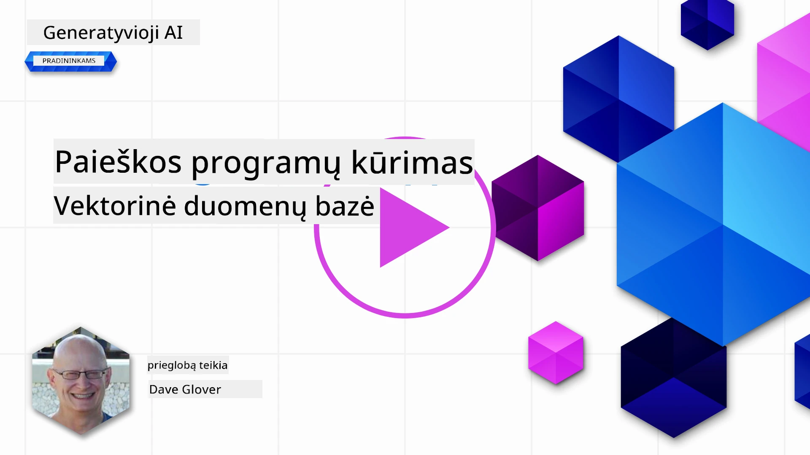
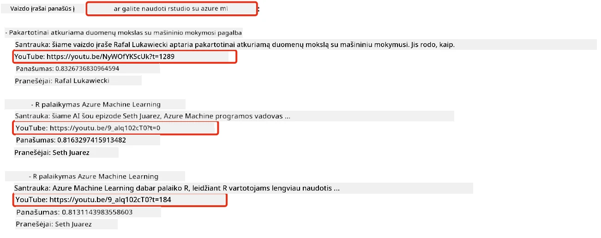
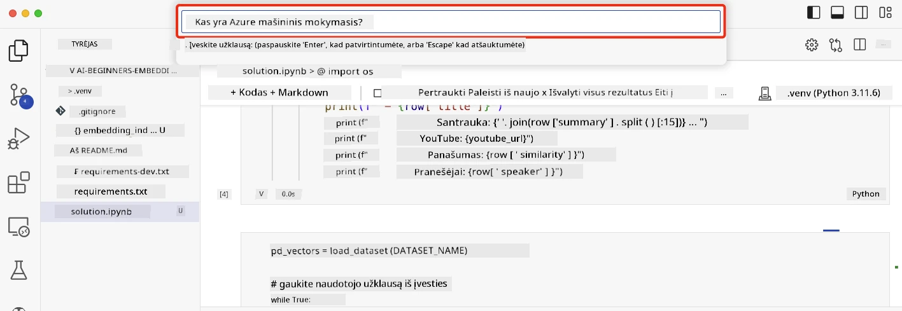

# Paieškos programų kūrimas

[](https://youtu.be/W0-nzXjOjr0?si=GcsqiTTvd7RKbo7V)

> > _Spustelėkite paveikslėlį aukščiau, kad peržiūrėtumėte pamokos vaizdo įrašą_

LLM yra daug daugiau nei pokalbių robotai ir tekstų generavimas. Taip pat galima kurti paieškos programas naudojant įterpinius (Embeddings). Įterpiniai yra skaitmeniniai duomenų atvaizdai, dar vadinami vektoriais, ir gali būti naudojami semantinei duomenų paieškai.

Šioje pamokoje kursite paieškos programą mūsų švietimo startuoliui. Mūsų startuolis yra ne pelno siekianti organizacija, teikianti nemokamą švietimą besivystančių šalių studentams. Mūsų startuolis turi daug „YouTube“ vaizdo įrašų, kuriuos studentai gali naudoti mokydamiesi apie DI. Mūsų startuolis nori sukurti paieškos programą, leidžiančią studentams ieškoti „YouTube“ vaizdo įrašo įvedus klausimą.

Pavyzdžiui, studentas gali įvesti „Kas yra „Jupyter Notebooks“?“ arba „Kas yra Azure ML“, o paieškos programa pateiks sąrašą „YouTube“ vaizdo įrašų, kurie yra susiję su klausimu, ir dar geriau – paieškos programa pateiks nuorodą į vietą vaizdo įraše, kur yra atsakymas į klausimą.

## Įvadas

Šioje pamokoje aptarsime:

- Semantinę ir raktinių žodžių paiešką.
- Kas yra tekstiniai įterpiniai.
- Tekstinių įterpinių indekso kūrimą.
- Tekstinių įterpinių indekso paiešką.

## Mokymosi tikslai

Baigę šią pamoką, sugebėsite:

- Atpažinti skirtumą tarp semantinės ir raktinių žodžių paieškos.
- Paaiškinti, kas yra tekstiniai įterpiniai.
- Kurti programą, naudojant įterpinius duomenų paieškai.

## Kodėl verta kurti paieškos programą?

Paieškos programos kūrimas padės suprasti, kaip naudoti įterpinius duomenų paieškai. Taip pat išmoksite kurti paieškos programą, kurią studentai galėtų naudoti greitai rasti informaciją.

Šioje pamokoje pateiktas „Embedding“ indeksas, sudarytas iš „Microsoft [AI Show](https://www.youtube.com/playlist?list=PLlrxD0HtieHi0mwteKBOfEeOYf0LJU4O1)“ „YouTube“ transkriptų. „AI Show“ yra „YouTube“ kanalas, kuriame mokoma apie DI ir mašininį mokymąsi. Įterpinių indeksas apima įterpinius kiekvienam „YouTube“ transkriptui iki 2023 m. spalio mėn. Jūs naudosite šį indeksą, kad sukurtumėte paieškos programą mūsų startuoliui. Paieškos programa pateiks nuorodą į vietą vaizdo įraše, kur rastas atsakymas į klausimą. Tai puikus būdas studentams greitai rasti reikiamą informaciją.

Toliau pateikiamas semantinio užklausos pavyzdys klausimui „ar galima naudoti rstudio su Azure ML?“ Peržiūrėkite „YouTube“ URL, pamatysite, kad jame yra laiko žyma, nukreipianti į vietą vaizdo įraše, kur yra atsakymas į klausimą.



## Kas yra semantinė paieška?

Galbūt svarstote, kas yra semantinė paieška? Semantinė paieška yra paieškos metodas, kuris naudoja žodžių užklausos prasmę arba reikšmę, kad pateiktų susijusius rezultatus.

Čia yra semantinės paieškos pavyzdys. Tarkime, norite nusipirkti automobilį, galite ieškoti „mano svajonių automobilis“ – semantinė paieška supranta, kad jūs nesvajojate apie automobilį, o ieškote savo „idealiojo“ automobilio. Semantinė paieška suvokia jūsų ketinimą ir pateikia susijusius rezultatus. Alternatyva yra „raktinių žodžių paieška“, kuri pažodžiui ieškotų svajonių apie automobilius ir dažnai pateiktų nesusijusius rezultatus.

## Kas yra tekstiniai įterpiniai?

[Tekstiniai įterpiniai](https://en.wikipedia.org/wiki/Word_embedding?WT.mc_id=academic-105485-koreyst) yra teksto atvaizdavimo metodas, naudojamas [natūralios kalbos apdorojime](https://en.wikipedia.org/wiki/Natural_language_processing?WT.mc_id=academic-105485-koreyst). Tekstiniai įterpiniai yra semantiniai skaitmeniniai teksto atvaizdai. Įterpiniai naudojami duomenims atvaizduoti mašinai suprantamu būdu. Yra daug modelių teksto įterpiniams kurti, šioje pamokoje daugiausia dėmesio skirsime įterpinių generavimui naudojant OpenAI Embedding Model.

Pavyzdžiui, įsivaizduokite, kad šis tekstas yra vieno epizodo transkripte iš „AI Show“ „YouTube“ kanalo:

```text
Today we are going to learn about Azure Machine Learning.
```

Tekstą pateiksime OpenAI Embedding API, kuris grąžins įterpinį – 1536 skaičių vektorių. Kiekvienas vektoriaus skaičius atspindi skirtingą teksto aspektą. Trumpumui čia pateikiame pirmuosius 10 skaičių vektoriuje.

```python
[-0.006655829958617687, 0.0026128944009542465, 0.008792596869170666, -0.02446001023054123, -0.008540431968867779, 0.022071078419685364, -0.010703742504119873, 0.003311325330287218, -0.011632772162556648, -0.02187200076878071, ...]
```

## Kaip sukuriamas įterpinių indeksas?

Šios pamokos įterpinių indeksas buvo sukurtas naudojant kelis „Python“ scenarijus. Juos su instrukcijomis rasite [README](./scripts/README.md?WT.mc_id=academic-105485-koreyst) faile pamokos `scripts` kataloge. Šių scenarijų paleisti nereikia, nes įterpinių indeksas yra pateiktas jums.

Scenarijai atlieka šiuos veiksmus:

1. Atsisiunčiamas kiekvieno „AI Show“ [YouTube](https://www.youtube.com/playlist?list=PLlrxD0HtieHi0mwteKBOfEeOYf0LJU4O1) vaizdo įrašo transkriptas.
2. Naudojant [OpenAI funkcijas](https://learn.microsoft.com/azure/ai-foundry/openai/how-to/function-calling?WT.mc_id=academic-105485-koreyst), bandoma išgauti lektoriaus vardą iš pirmųjų 3 minučių „YouTube“ transkripto. Kiekvieno vaizdo lektoriaus vardas saugomas įterpinių indekse `embedding_index_3m.json`.
3. Transkripto tekstas suskaidomas į **3 minučių teksto segmentus**. Segmentas apima apie 20 žodžių persidengimą su kitu segmentu, kad įterpinys nebūtų nutrauktas ir būtų geresnis paieškos kontekstas.
4. Kiekvienas teksto segmentas perduodamas OpenAI Chat API, kuris santrumpina tekstą iki 60 žodžių. Santrauka saugoma tame pačiame įterpinių indekse `embedding_index_3m.json`.
5. Galiausiai, teksto segmentas perduodamas OpenAI Embedding API. Ši API grąžina 1536 skaičių vektorių, kuris atspindi semantinę segmento prasmę. Segmentas kartu su įterpiniu saugomas įterpinių indekse `embedding_index_3m.json`.

### Vektorinės duomenų bazės

Dėl pamokos supaprastinimo įterpinių indeksas saugomas JSON faile `embedding_index_3m.json` ir įkraunamas į Pandas DataFrame. Tačiau gamyboje įterpinių indeksas būtų saugomas vektorinėje duomenų bazėje, tokioje kaip [Azure Cognitive Search](https://learn.microsoft.com/training/modules/improve-search-results-vector-search?WT.mc_id=academic-105485-koreyst), [Redis](https://cookbook.openai.com/examples/vector_databases/redis/readme?WT.mc_id=academic-105485-koreyst), [Pinecone](https://cookbook.openai.com/examples/vector_databases/pinecone/readme?WT.mc_id=academic-105485-koreyst), [Weaviate](https://cookbook.openai.com/examples/vector_databases/weaviate/readme?WT.mc_id=academic-105485-koreyst) ir kt.

## Kosininio panašumo supratimas

Išmokome apie tekstinius įterpinius. Kitas žingsnis – išmokti naudoti tekstinius įterpinius, ieškant duomenų ir ypač surasti panašiausius įterpinius pagal užklausą, naudojant kosininį panašumą.

### Kas yra kosininis panašumas?

Kosininis panašumas matuoja panašumą tarp dviejų vektorių, kartais tai vadinama „artimiausių kaimynų paieška“. Norint atlikti kosininį paiešką, reikia _vektorizuoti_ _užklausos_ tekstą naudojant OpenAI Embedding API. Tada apskaičiuojamas _kosininis panašumas_ tarp užklausos vektoriaus ir kiekvieno vektoriaus įterpinių indekse. Prisiminkite, indeksas turi vektorių kiekvienam „YouTube“ transkripto teksto segmentui. Galiausiai rezultatai surūšiuojami pagal kosininį panašumą, o tekstų segmentai su aukščiausiu panašumu yra labiausiai panašūs į užklausą.

Matematiškai kosininis panašumas matuoja kampo tarp dviejų vektorių kosinusą daugiadimensinėje erdvėje. Tai naudinga, nes du dokumentai, nors ir atitolę Euklido atstumu dėl dydžio, gali turėti mažesnį kampą tarp jų ir todėl aukštesnį kosininį panašumą. Daugiau informacijos apie kosininio panašumo lygtis rasite [Cosine similarity](https://en.wikipedia.org/wiki/Cosine_similarity?WT.mc_id=academic-105485-koreyst).

## Pirmoji paieškos programos kūrimas

Toliau mokysimės kurti paieškos programą naudojant įterpinius. Paieškos programa leis studentams ieškoti vaizdo įrašo, įvedus klausimą. Ji pateiks susijusių vaizdo įrašų sąrašą ir nuorodą į tą vietą vaizdo įraše, kur yra atsakymas į klausimą.

Šis sprendimas buvo kuriamas ir testuotas Windows 11, macOS ir Ubuntu 22.04 naudojant Python 3.10 ar naujesnę versiją. Python galite atsisiųsti iš [python.org](https://www.python.org/downloads/?WT.mc_id=academic-105485-koreyst).

## Užduotis – sukurti paieškos programą studentams

Pamokos pradžioje pristatėme mūsų startuolį. Dabar laikas leisti studentams sukurti paieškos programą savo užduotims.

Šioje užduotyje sukursite Azure OpenAI paslaugas, kurios bus naudojamos paieškos programai kurti. Jums reikės Azure prenumeratos užduočiai atlikti.

### Paleiskite Azure Cloud Shell

1. Prisijunkite prie [Azure portalo](https://portal.azure.com/?WT.mc_id=academic-105485-koreyst).
2. Pasirinkite Cloud Shell piktogramą viršutiniame dešiniajame Azure portalo kampe.
3. Pasirinkite **Bash** kaip aplinkos tipą.

#### Sukurkite išteklių grupę

> Šioms instrukcijoms naudojame „semantic-video-search“ pavadinimu išteklių grupę East US regione.
> Galite keisti išteklių grupės pavadinimą, tačiau keičiant išteklių vietą,
> patikrinkite [modelių prieinamumo lentelę](https://aka.ms/oai/models?WT.mc_id=academic-105485-koreyst).

```shell
az group create --name semantic-video-search --location eastus
```

#### Sukurkite Azure OpenAI paslaugos išteklių

Iš „Azure Cloud Shell“ paleiskite šią komandą, kad sukurtumėte Azure OpenAI paslaugos išteklius.

```shell
az cognitiveservices account create --name semantic-video-openai --resource-group semantic-video-search \
    --location eastus --kind OpenAI --sku s0
```

#### Gaukite pabaigos tašką ir raktus šiai programai

Iš „Azure Cloud Shell“ paleiskite šias komandas, kad gautumėte pabaigos tašką ir raktus Azure OpenAI paslaugai.

```shell
az cognitiveservices account show --name semantic-video-openai \
   --resource-group  semantic-video-search | jq -r .properties.endpoint
az cognitiveservices account keys list --name semantic-video-openai \
   --resource-group semantic-video-search | jq -r .key1
```

#### Įdiekite OpenAI Embedding modelį

Iš „Azure Cloud Shell“ paleiskite šią komandą, kad įdiegtumėte OpenAI Embedding modelį.

```shell
az cognitiveservices account deployment create \
    --name semantic-video-openai \
    --resource-group  semantic-video-search \
    --deployment-name text-embedding-ada-002 \
    --model-name text-embedding-ada-002 \
    --model-version "2"  \
    --model-format OpenAI \
    --sku-capacity 100 --sku-name "Standard"
```

## Sprendimas

Atidarykite [sprendimo užrašų knygelę](./python/aoai-solution.ipynb?WT.mc_id=academic-105485-koreyst) GitHub Codespaces ir sekite instrukcijas Jupyter užrašų knygelėje.

Paleidžiant užrašų knygelę, būsite paprašyti įvesti užklausą. Įvesties laukelis atrodys taip:



## Puikus darbas! Toliau mokykitės

Baigę šią pamoką, peržiūrėkite mūsų [Generatyvinio DI mokymosi kolekciją](https://aka.ms/genai-collection?WT.mc_id=academic-105485-koreyst), kad toliau gilintumėte žinias apie generatyvinį DI!

Nukeliame į Pamoką 9, kur mokysimės kurti [vaizdų generavimo programas](../09-building-image-applications/README.md?WT.mc_id=academic-105485-koreyst)!

---

<!-- CO-OP TRANSLATOR DISCLAIMER START -->
**Atsakomybės apribojimas**:
Šis dokumentas buvo išverstas naudojant dirbtinio intelekto vertimo paslaugą [Co-op Translator](https://github.com/Azure/co-op-translator). Nors siekiame tikslumo, prašome atkreipti dėmesį, kad automatiniai vertimai gali turėti klaidų ar netikslumų. Originalus dokumentas jo gimtąja kalba laikomas autoritetingu šaltiniu. Svarbiai informacijai rekomenduojama naudoti profesionalų žmogiškąjį vertimą. Mes neatsakome už jokius nesusipratimus ar neteisingą interpretaciją, kilusią naudojantis šiuo vertimu.
<!-- CO-OP TRANSLATOR DISCLAIMER END -->