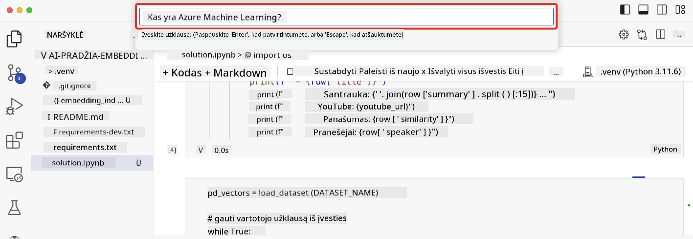

<!--
CO_OP_TRANSLATOR_METADATA:
{
  "original_hash": "d46aad0917a1a342d613e2c13d457da5",
  "translation_date": "2025-08-25T12:33:32+00:00",
  "source_file": "08-building-search-applications/README.md",
  "language_code": "lt"
}
-->
# Kaip sukurti paieškos programą

[](https://aka.ms/gen-ai-lesson8-gh?WT.mc_id=academic-105485-koreyst)

> > _Paspauskite paveikslėlį aukščiau, kad peržiūrėtumėte šios pamokos vaizdo įrašą_

LLM modeliai gali daugiau nei tik pokalbių robotai ar teksto generavimas. Su Embeddings galima kurti paieškos programas. Embeddings – tai duomenų skaitmeninės reprezentacijos, dar vadinamos vektoriais, kurios leidžia atlikti semantinę duomenų paiešką.

Šioje pamokoje kursite paieškos programą mūsų švietimo startuoliui. Mūsų startuolis – ne pelno siekianti organizacija, teikianti nemokamą išsilavinimą besivystančių šalių mokiniams. Turime daug „YouTube“ vaizdo įrašų, kuriuos mokiniai gali naudoti mokydamiesi apie DI. Startuolis nori sukurti paieškos programą, kuri leistų mokiniams rasti „YouTube“ vaizdo įrašą įvedus klausimą.

Pavyzdžiui, mokinys gali įvesti „Kas yra Jupyter Notebooks?“ arba „Kas yra Azure ML“, o paieškos programa grąžins sąrašą „YouTube“ vaizdo įrašų, susijusių su klausimu, ir dar geriau – pateiks nuorodą į vietą vaizdo įraše, kur yra atsakymas į klausimą.

## Įvadas

Šioje pamokoje aptarsime:

- Semantinė ir raktažodžių paieška.
- Kas yra teksto Embeddings.
- Kaip sukurti teksto Embeddings indeksą.
- Kaip ieškoti teksto Embeddings indekse.

## Mokymosi tikslai

Baigę šią pamoką, galėsite:

- Atskirti semantinę paiešką nuo raktažodžių paieškos.
- Paaiškinti, kas yra teksto Embeddings.
- Sukurti programą, kuri naudoja Embeddings duomenų paieškai.

## Kodėl verta kurti paieškos programą?

Kurdami paieškos programą suprasite, kaip naudoti Embeddings duomenų paieškai. Taip pat išmoksite sukurti paieškos programą, kuri padės mokiniams greitai rasti reikiamą informaciją.

Pamokoje pateikiamas Embedding indeksas, sudarytas iš „YouTube“ transkripcijų iš Microsoft [AI Show](https://www.youtube.com/playlist?list=PLlrxD0HtieHi0mwteKBOfEeOYf0LJU4O1) kanalo. AI Show – tai „YouTube“ kanalas, kuriame mokoma apie DI ir mašininį mokymąsi. Embedding indeksas apima kiekvienos transkripcijos Embeddings iki 2023 m. spalio. Naudosite šį indeksą kurdami paieškos programą mūsų startuoliui. Paieškos programa grąžins nuorodą į vietą vaizdo įraše, kur yra atsakymas į klausimą. Tai puikus būdas mokiniams greitai rasti reikiamą informaciją.

Štai pavyzdys, kaip atrodo semantinė užklausa klausimui „can you use rstudio with azure ml?“. Pažiūrėkite į „YouTube“ nuorodą – joje yra laiko žyma, kuri nuveda tiesiai į vietą vaizdo įraše, kur pateiktas atsakymas.


## Kas yra semantinė paieška?

Galbūt kyla klausimas, kas yra semantinė paieška? Semantinė paieška – tai paieškos metodas, kuris naudoja žodžių prasmę užklausoje, kad grąžintų aktualius rezultatus.

Štai pavyzdys: tarkime, norite įsigyti automobilį ir ieškote „mano svajonių automobilis“. Semantinė paieška supranta, kad jūs ne „svajojate“ apie automobilį, o ieškote savo „idealaus“ automobilio. Ji supranta jūsų ketinimą ir grąžina aktualius rezultatus. Alternatyva – raktažodžių paieška, kuri tiesiog ieškotų svajonių apie automobilius ir dažnai grąžintų nereikalingus rezultatus.

## Kas yra teksto Embeddings?

[Teksto embeddings](https://en.wikipedia.org/wiki/Word_embedding?WT.mc_id=academic-105485-koreyst) – tai teksto reprezentavimo metodas, naudojamas [natūralios kalbos apdorojime](https://en.wikipedia.org/wiki/Natural_language_processing?WT.mc_id=academic-105485-koreyst). Embeddings – tai semantinės skaitmeninės teksto reprezentacijos. Jos leidžia duomenis pateikti taip, kad kompiuteris lengvai suprastų. Yra daug modelių, skirtų teksto embeddings kūrimui, o šioje pamokoje naudosime OpenAI Embedding Model.

Pavyzdžiui, įsivaizduokite, kad šis tekstas yra transkripcijoje iš vienos AI Show „YouTube“ laidos:

```text
Today we are going to learn about Azure Machine Learning.
```

Tekstą perduodame OpenAI Embedding API ir gauname embedding, sudarytą iš 1536 skaičių, t. y. vektorių. Kiekvienas skaičius vektoriuje atspindi skirtingą teksto aspektą. Štai pirmi 10 skaičių iš vektoriaus:

```python
[-0.006655829958617687, 0.0026128944009542465, 0.008792596869170666, -0.02446001023054123, -0.008540431968867779, 0.022071078419685364, -0.010703742504119873, 0.003311325330287218, -0.011632772162556648, -0.02187200076878071, ...]
```

## Kaip sukuriamas Embedding indeksas?

Šios pamokos Embedding indeksas buvo sukurtas naudojant kelis Python skriptus. Skriptus ir instrukcijas rasite [README](./scripts/README.md?WT.mc_id=academic-105485-koreyst) faile „scripts“ aplanke. Jums nereikia paleisti šių skriptų, kad baigtumėte pamoką, nes Embedding indeksas jau pateiktas.

Skriptai atlieka šiuos veiksmus:

1. Atsisiunčiama kiekvieno „YouTube“ vaizdo įrašo transkripcija iš [AI Show](https://www.youtube.com/playlist?list=PLlrxD0HtieHi0mwteKBOfEeOYf0LJU4O1) grojaraščio.
2. Naudojant [OpenAI Functions](https://learn.microsoft.com/azure/ai-services/openai/how-to/function-calling?WT.mc_id=academic-105485-koreyst), bandoma iš pirmų 3 transkripcijos minučių išgauti pranešėjo vardą. Pranešėjo vardas saugomas Embedding indekse „embedding_index_3m.json“.
3. Transkripcijos tekstas suskaidomas į **3 minučių teksto segmentus**. Segmentas apima apie 20 žodžių persidengimą su kitu segmentu, kad embedding nebūtų nutrauktas ir paieška būtų tikslesnė.
4. Kiekvienas teksto segmentas perduodamas OpenAI Chat API, kad tekstas būtų apibendrintas iki 60 žodžių. Santrauka taip pat saugoma Embedding indekse „embedding_index_3m.json“.
5. Galiausiai segmentas perduodamas OpenAI Embedding API. API grąžina 1536 skaičių vektorių, atspindintį segmento semantinę prasmę. Segmentas ir OpenAI Embedding vektorius saugomi Embedding indekse „embedding_index_3m.json“.

### Vektorinės duomenų bazės

Kad pamoka būtų paprastesnė, Embedding indeksas saugomas JSON faile „embedding_index_3m.json“ ir įkeliamas į Pandas DataFrame. Tačiau realiose sistemose Embedding indeksas saugomas vektorinėje duomenų bazėje, tokioje kaip [Azure Cognitive Search](https://learn.microsoft.com/training/modules/improve-search-results-vector-search?WT.mc_id=academic-105485-koreyst), [Redis](https://cookbook.openai.com/examples/vector_databases/redis/readme?WT.mc_id=academic-105485-koreyst), [Pinecone](https://cookbook.openai.com/examples/vector_databases/pinecone/readme?WT.mc_id=academic-105485-koreyst), [Weaviate](https://cookbook.openai.com/examples/vector_databases/weaviate/readme?WT.mc_id=academic-105485-koreyst) ir kt.

## Kaip veikia kosinusinis panašumas

Jau sužinojome apie teksto embeddings, dabar laikas išmokti, kaip su jais ieškoti duomenų ir rasti labiausiai panašius embedding pagal kosinusinį panašumą.

### Kas yra kosinusinis panašumas?

Kosinusinis panašumas – tai dviejų vektorių panašumo matas, dar vadinamas „artimiausio kaimyno paieška“. Norint atlikti kosinusinio panašumo paiešką, reikia _vektorizuoti_ užklausos tekstą naudojant OpenAI Embedding API. Tada apskaičiuoti _kosinusinį panašumą_ tarp užklausos vektoriaus ir kiekvieno vektoriaus Embedding indekse. Primename, kad Embedding indeksas turi vektorių kiekvienam „YouTube“ transkripcijos segmentui. Galiausiai rezultatus surūšiuojame pagal kosinusinį panašumą – tie segmentai, kurių panašumas didžiausias, yra labiausiai panašūs į užklausą.

Matematiškai kosinusinis panašumas matuoja kampo kosinusą tarp dviejų vektorių daugiamačiame erdvėje. Tai naudinga, nes jei du dokumentai yra toli pagal Euklido atstumą dėl dydžio, jie vis tiek gali turėti mažesnį kampą tarp jų ir didesnį kosinusinį panašumą. Daugiau apie kosinusinio panašumo lygtis rasite [Cosine similarity](https://en.wikipedia.org/wiki/Cosine_similarity?WT.mc_id=academic-105485-koreyst).

## Kaip sukurti pirmąją paieškos programą

Toliau išmoksime, kaip sukurti paieškos programą naudojant Embeddings. Paieškos programa leis mokiniams ieškoti vaizdo įrašo įvedus klausimą. Programa grąžins vaizdo įrašų sąrašą, susijusį su klausimu, ir nuorodą į vietą vaizdo įraše, kur yra atsakymas.

Šis sprendimas buvo išbandytas Windows 11, macOS ir Ubuntu 22.04 su Python 3.10 ar naujesne versija. Python galite atsisiųsti iš [python.org](https://www.python.org/downloads/?WT.mc_id=academic-105485-koreyst).

## Užduotis – paieškos programos kūrimas, kad mokiniai galėtų naudotis

Pamokos pradžioje pristatėme savo startuolį. Dabar laikas suteikti mokiniams galimybę sukurti paieškos programą savo vertinimams.

Šioje užduotyje sukursite Azure OpenAI Services, kurie bus naudojami paieškos programai kurti. Sukursite šias Azure OpenAI Services. Norint atlikti užduotį, reikės Azure prenumeratos.

### Paleiskite Azure Cloud Shell

1. Prisijunkite prie [Azure portalo](https://portal.azure.com/?WT.mc_id=academic-105485-koreyst).
2. Viršutiniame dešiniajame Azure portalo kampe pasirinkite Cloud Shell piktogramą.
3. Pasirinkite **Bash** kaip aplinkos tipą.

#### Sukurkite išteklių grupę

> Šiose instrukcijose naudojame išteklių grupę „semantic-video-search“ East US regione.
> Galite pakeisti išteklių grupės pavadinimą, tačiau keisdami išteklių vietą,
> patikrinkite [modelių prieinamumo lentelę](https://aka.ms/oai/models?WT.mc_id=academic-105485-koreyst).

```shell
az group create --name semantic-video-search --location eastus
```

#### Sukurkite Azure OpenAI Service išteklių

Azure Cloud Shell paleiskite šią komandą, kad sukurtumėte Azure OpenAI Service išteklių.

```shell
az cognitiveservices account create --name semantic-video-openai --resource-group semantic-video-search \
    --location eastus --kind OpenAI --sku s0
```

#### Gaukite galinį tašką ir raktus, reikalingus šiai programai

Azure Cloud Shell paleiskite šias komandas, kad gautumėte Azure OpenAI Service ištekliaus galinį tašką ir raktus.

```shell
az cognitiveservices account show --name semantic-video-openai \
   --resource-group  semantic-video-search | jq -r .properties.endpoint
az cognitiveservices account keys list --name semantic-video-openai \
   --resource-group semantic-video-search | jq -r .key1
```

#### Įdiekite OpenAI Embedding modelį

Azure Cloud Shell paleiskite šią komandą, kad įdiegtumėte OpenAI Embedding modelį.

```shell
az cognitiveservices account deployment create \
    --name semantic-video-openai \
    --resource-group  semantic-video-search \
    --deployment-name text-embedding-ada-002 \
    --model-name text-embedding-ada-002 \
    --model-version "2"  \
    --model-format OpenAI \
    --sku-capacity 100 --sku-name "Standard"
```

## Sprendimas

Atidarykite [sprendimo užrašų knygą](python/aoai-solution.ipynb?WT.mc_id=academic-105485-koreyst) GitHub Codespaces ir vykdykite Jupyter Notebook instrukcijas.

Paleidus užrašų knygą, būsite paprašyti įvesti užklausą. Įvedimo langas atrodys taip:



## Puikiai padirbėta! Tęskite mokymąsi

Baigę šią pamoką, peržiūrėkite mūsų [Generatyvinio DI mokymosi kolekciją](https://aka.ms/genai-collection?WT.mc_id=academic-105485-koreyst), kad dar labiau pagilintumėte žinias!

Eikite į 9 pamoką, kurioje sužinosite, kaip [kurti vaizdų generavimo programas](../09-building-image-applications/README.md?WT.mc_id=academic-105485-koreyst)!

---

**Atsakomybės atsisakymas**:  
Šis dokumentas buvo išverstas naudojant dirbtinio intelekto vertimo paslaugą [Co-op Translator](https://github.com/Azure/co-op-translator). Nors siekiame tikslumo, prašome atkreipti dėmesį, kad automatiniai vertimai gali turėti klaidų ar netikslumų. Originalus dokumentas jo gimtąja kalba turėtų būti laikomas autoritetingu šaltiniu. Kritinei informacijai rekomenduojame profesionalų žmogaus vertimą. Mes neatsakome už nesusipratimus ar neteisingą interpretavimą, kilusį dėl šio vertimo naudojimo.