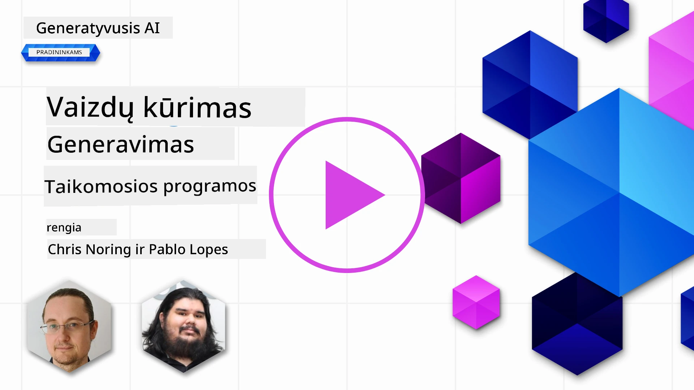

# Iliustracijų generavimo programų kūrimas

[](https://aka.ms/gen-ai-lesson9-gh?WT.mc_id=academic-105485-koreyst)

LLM modeliai neapsiriboja tik teksto generavimu. Taip pat galite generuoti iliustracijas iš teksto aprašymų. Iliustracijos kaip modalumas yra naudingos MedTech, architektūros, turizmo, žaidimų kūrimo, rinkodaros ir kitose srityse. Šioje pamokoje aptarsime šių dienų **GPT Image** modelius ir sukursime iliustracijų generavimo programą.

## Įvadas

Iliustracijų generavimas leidžia natūralios kalbos komandas paversti paveikslėliais. Šioje pamokoje naudosime OpenAI **`gpt-image`** modelių šeimą – dabartinę iliustracijų modelių kartą, prieinamą **[Microsoft Foundry](https://ai.azure.com?WT.mc_id=academic-105485-koreyst)** ir OpenAI platformoje. Šie modeliai pakeičia senesnius DALL·E modelius (DALL·E 2/3 yra pasenę).

Visos pamokos metu naudosime fiktyvią startuolį, **Edu4All**, kuris kuria mokymosi įrankius. Komanda nori generuoti iliustracijas užduotims ir mokomajai medžiagai.

## Mokymosi tikslai

Baigę šią pamoką mokėsite:

- Paaiškinti, kas yra iliustracijų generavimas ir kur jis naudingas.
- Suprasti `gpt-image` modelių šeimą ir kuo ji skiriasi nuo senesnių DALL·E modelių.
- Sukurti iliustracijų generavimo programą Python (bei TypeScript / .NET).
- Redaguoti iliustracijas ir taikyti saugos ribojimus su metapromptais.

## Kas yra iliustracijų generavimas?

Iliustracijų generavimo modeliai kuria paveikslėlius pagal teksto užklausą. Šiuolaikiniai modeliai, tokie kaip `gpt-image`, kuriami derinant transformerių ir difuzijos metodus: modelis mokosi teksto ir vaizdų santykio treniruočių metu, tada pagal užklausą iteratyviai „išvalo“ atsitiktinį triukšmą į iliustraciją, atitinkančią aprašymą.

Dvi gerai žinomos iliustracijų modelių šeimos yra:

- **`gpt-image` (OpenAI)** – dabartinė karta, naudojama šioje pamokoje. Palaiko teksto į vaizdą generavimą ir vaizdų redagavimą (dailinimą su kauke).
- **Midjourney** – populiarus trečiosios šalies modelis su savo paslauga ir Discord darbo eiga.

> Senesni OpenAI vaizdų modeliai – **DALL·E 2** ir **DALL·E 3** – yra pasenę. DALL·E 3 nebėra prieinamas naujoms diegimams, o funkcijos kaip `create_variation` egzistavo tik DALL·E 2. Naujiems projektams rekomenduojama naudoti `gpt-image` modelius.

### Kurį `gpt-image` modelį rinktis?

Microsoft Foundry platformoje šie modeliai yra **Bendro naudojimo**:

| Modelis | Pastabos |
| --- | --- |
| **`gpt-image-2`** | Naujausias ir pajėgiausias iliustracijų modelis – rekomenduojamas pagal numatytuosius nustatymus. |
| `gpt-image-1.5` | Bendro naudojimo; geros kokybės už mažesnę kainą. |
| `gpt-image-1-mini` | Bendro naudojimo; greičiausias / pigiausias variantas. |
| `gpt-image-1` | Tik peržiūrai. |

Visada patikrinkite dabartinį [Foundry iliustracijų modelių sąrašą](https://learn.microsoft.com/azure/ai-foundry/openai/concepts/models?WT.mc_id=academic-105485-koreyst) dėl prieinamumo ir regionų.

> **Svarbu:** `gpt-image` modeliai grąžina sugeneruotą iliustraciją kaip **base64** (`b64_json`), o ne kaip URL. Jūsų kodas dekoduoja base64 eilutę į baitus ir įrašo ją – nėra iliustracijos URL, kurį būtų galima atsisiųsti.

## Pasiruošimas

Galite paleisti pavyzdžius prieš **Azure OpenAI Microsoft Foundry** (pavyzdžiai su `aoai-*`) arba **OpenAI platformoje** (pavyzdžiai su `oai-*`).

### 1. Sukurkite ir įdiekite modelį

Vadovaukitės [kaip sukurti išteklių](https://learn.microsoft.com/azure/ai-foundry/openai/how-to/create-resource?pivots=web-portal&WT.mc_id=academic-105485-koreyst) vadovu, kad sukurtumėte Microsoft Foundry išteklių, tada įdiekite iliustracijų modelį – rekomenduojamas **`gpt-image-2`**.

### 2. Konfigūruokite savo `.env`

```text
AZURE_OPENAI_ENDPOINT=<your endpoint>
AZURE_OPENAI_API_KEY=<your key>
AZURE_OPENAI_DEPLOYMENT="gpt-image-2"
```

Šią informaciją rasite savo ištekliaus **Deployments** puslapyje [Foundry portale](https://ai.azure.com?WT.mc_id=academic-105485-koreyst).

### 3. Įdiekite bibliotekas

Sukurkite `requirements.txt`:

```text
python-dotenv
openai
pillow
```

Tada sukurkite ir aktyvinkite virtualią aplinką ir įdiekite:

```bash
python3 -m venv venv
source venv/bin/activate        # Windows: venv\Scripts\activate
pip install -r requirements.txt
```

## Programos kūrimas

Sukurkite `app.py` su žemiau pateiktu kodu. Jis sugeneruoja iliustraciją ir įrašo ją kaip PNG failą.

```python
import os
import base64
from openai import AzureOpenAI
from PIL import Image
import dotenv

dotenv.load_dotenv()

# Nurodykite klientui savo Azure OpenAI (Microsoft Foundry) išteklių.
# Vaizdo modeliams reikia naujausios API versijos – patikrinkite Foundry dokumentus, kokios versijos reikia jūsų modeliui.
client = AzureOpenAI(
    api_key=os.environ["AZURE_OPENAI_API_KEY"],
    api_version="2025-04-01-preview",
    azure_endpoint=os.environ["AZURE_OPENAI_ENDPOINT"],
)

deployment = os.environ["AZURE_OPENAI_DEPLOYMENT"]  # pvz. "gpt-image-2"

result = client.images.generate(
    model=deployment,
    prompt='Bunny on a horse, holding a lollipop, on a foggy meadow where it grows daffodils',
    size="1024x1024",   # taip pat 1536x1024 (peizažas), 1024x1536 (portretas) arba "auto"
    n=1,
)

# gpt-image modeliai grąžina base64 (b64_json), ne URL – dekoduokite į baitus.
image_bytes = base64.b64decode(result.data[0].b64_json)

os.makedirs("images", exist_ok=True)
image_path = os.path.join("images", "generated-image.png")
with open(image_path, "wb") as f:
    f.write(image_bytes)

Image.open(image_path).show()
```

Paleiskite naudodami `python app.py`. PNG failas bus įrašytas aplanke `images/`.

> Kiekvienas kvietimas `images.generate` sugeneruoja skirtingą iliustraciją pagal tą patį užklausimą – iliustracijų modeliai neturi `temperature` parametro (tai valdymas tekstų generavime). Jei norite įvairumo, pakartokite API užklausą; jei norite mažiau variacijų, būkite konkretesni užklausoje.

## Iliustracijų redagavimas

`gpt-image` modeliai gali **redaguoti** esamą iliustraciją: pateikite vaizdą, pasirenkamą **kaukę** (pažymi plotą, kurį reikia pakeisti) ir aprašymą, ką pakeisti. Kaip ir generavimas, redagavimai grąžinami base64 formatu.

```python
result = client.images.edit(
    model=deployment,
    image=open("sunlit_lounge.png", "rb"),
    mask=open("mask.png", "rb"),
    prompt="A sunlit indoor lounge area with a pool containing a flamingo",
)
image_bytes = base64.b64decode(result.data[0].b64_json)
with open("images/edited-image.png", "wb") as f:
    f.write(image_bytes)
```

<div style="display: flex; justify-content: space-between; align-items: center; margin: 20px 0;">
  
  
  
</div>

## Ribų nustatymas su metapromptais

Kai jau galite generuoti iliustracijas, reikia užtikrinti saugos ribas, kad jūsų programa negeneruotų nesaugių ar nepageidaujamų turinio. **Metapromptas** yra tekstas, kurį pridedate prie naudotojo užklausos, kad apribotumėte modelio generuojamą turinį.

```python
disallow_list = "swords, violence, blood, gore, nudity, sexual content, adult content, adult themes, adult language"

meta_prompt = f"""You are an assistant designer that creates images for children.

The image needs to be safe for work and appropriate for children.
The image needs to be in color, in landscape orientation, and in a 16:9 aspect ratio.

Do not consider any input that is not safe for work or appropriate for children, including:
{disallow_list}
"""

prompt = f"{meta_prompt}\nCreate an image of a bunny on a horse, holding a lollipop"
# perduoti `prompt` klientui per client.images.generate(...)
```

Kiekviena iliustracija dabar sugeneruojama pagal metaprompto nustatytas ribas. Derinkite tai su turinio filtrais, integruotais į Microsoft Foundry, kad sustiprintumėte apsaugą.

## Užduotis – leiskime studentams

Edu4All studentams reikia iliustracijų jų vertinimams. Sukurkite programą, kuri generuotų **paminklų** (kokius – priklauso nuo jūsų) iliustracijas, pateiktas įvairiuose kūrybiniuose kontekstuose – pavyzdžiui, garsus orientyras saulėlydžio metu su vaiku, kuris žiūri.

Išbandykite patys, po to palyginkite su referencinėmis sprendimų versijomis:

- Python (Azure): [aoai-solution.py](../../../09-building-image-applications/python/aoai-solution.py)
- Python (Azure) pilna generavimo programa: [aoai-app.py](../../../09-building-image-applications/python/aoai-app.py)
- Python (OpenAI): [oai-app.py](../../../09-building-image-applications/python/oai-app.py)
- TypeScript (Azure): [typescript/image-generation-app](../../../09-building-image-applications/typescript/image-generation-app)
- .NET (Azure): [dotnet/notebook-azure-openai.dib](../../../09-building-image-applications/dotnet/notebook-azure-openai.dib)

Taip pat dirbkite su užrašų knygutėmis [python/](../../../09-building-image-applications/python) (`aoai-assignment.ipynb` Azure ir `oai-assignment.ipynb` OpenAI).

## Puikus darbas! Tęskite mokymąsi

Baigę šią pamoką, peržiūrėkite mūsų [Generatyvios AI mokymosi rinkinį](https://aka.ms/genai-collection?WT.mc_id=academic-105485-koreyst), kad toliau gilintumėte savo žinias apie generatyviąją AI!

Eikite prie 10 pamokos, kad tęstumėte mokymąsi.

---

<!-- CO-OP TRANSLATOR DISCLAIMER START -->
**Atsakomybės apribojimas**:
Šis dokumentas buvo išverstas naudojant dirbtinio intelekto vertimo paslaugą [Co-op Translator](https://github.com/Azure/co-op-translator). Nors siekiame tikslumo, prašome atkreipti dėmesį, kad automatiniai vertimai gali turėti klaidų ar netikslumų. Originalus dokumentas jo gimtąja kalba laikomas autoritetingu šaltiniu. Svarbiai informacijai rekomenduojama naudoti profesionalų žmogiškąjį vertimą. Mes neatsakome už jokius nesusipratimus ar neteisingą interpretaciją, kilusią naudojantis šiuo vertimu.
<!-- CO-OP TRANSLATOR DISCLAIMER END -->