# Žemo kodo DI programų kūrimas

[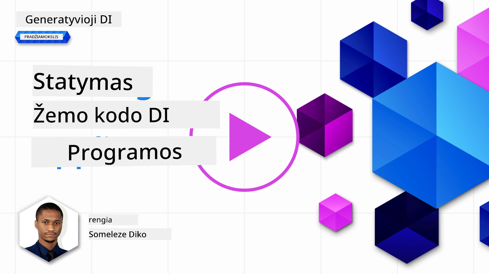](https://youtu.be/1vzq3Nd8GBA?si=h6LHWJXdmqf6mhDg)

> _(Spustelėkite aukščiau esantį paveikslėlį, jei norite peržiūrėti šios pamokos vaizdo įrašą)_

## Įvadas

Kadangi jau sužinojome, kaip kurti vaizdą generuojančias programas, pakalbėkime apie žemo kodo sprendimus. Generuojamą DI galima naudoti įvairiose srityse, įskaitant žemo kodo kūrimą, bet kas yra žemas kodas ir kaip prie jo pridėti DI?

Programėlių ir sprendimų kūrimas tapo lengvesnis tradiciniams programuotojams ir neprogramuotojams, naudojant žemo kodo kūrimo platformas. Žemo kodo kūrimo platformos leidžia kurti programas ir sprendimus naudojant mažai arba visai be kodo. Tai pasiekiama suteikiant vizualią kūrimo aplinką, kurioje objektus galima vilkti ir mesti, kad būtų sukurtos programėlės ir sprendimai. Tai leidžia kurti programas ir sprendimus greičiau ir su mažesniais resursais. Šioje pamokoje gilinsimės į žemo kodo naudojimą ir kaip patobulinti žemo kodo kūrimą su DI naudojant Power Platform.

Power Platform suteikia organizacijoms galimybę suteikti savo komandoms galią kurti savo sprendimus per intuityvią žemo kodo arba be kodo aplinką. Ši aplinka supaprastina sprendimų kūrimo procesą. Naudojant Power Platform, sprendimus galima sukurti per kelias dienas ar savaites, o ne mėnesius ar metus. Power Platform susideda iš penkių pagrindinių produktų: Power Apps, Power Automate, Power BI, Power Pages ir Copilot Studio.

Ši pamoka apima:

- Generuojamo DI įvadas Power Platform
- Įvadas apie Copilot ir kaip jį naudoti
- Generuojamo DI naudojimas aplikacijų ir srautų kūrimui Power Platform
- DI modelių Power Platform ir AI Builder supratimas
- Intelektualių agentų kūrimas naudojant Microsoft Copilot Studio

## Mokymosi tikslai

Baigę šią pamoką galėsite:

- Suprasti, kaip veikia Copilot Power Platform.

- Sukurti Studentų užduočių sekimo programėlę mūsų švietimo startuoliui.

- Sukurti sąskaitų apdorojimo srautą, kuris naudoja DI informacijai iš sąskaitų išgauti.

- Taikyti geriausias praktikas naudojant sukurti tekstą su GPT DI modeliu.

- Suprasti, kas yra Microsoft Copilot Studio ir kaip sukurti intelektualius agentus.

Šios pamokos įrankiai ir technologijos, kuriuos naudosite, yra:

- **Power Apps**, skirtas Studentų užduočių sekimo programėlei, suteikia žemo kodo kūrimo aplinką programoms, skirtoms stebėti, valdyti ir bendrauti su duomenimis.

- **Dataverse**, skirtas saugoti Studentų užduočių sekimo programėlės duomenims, kur Dataverse suteikia žemo kodo duomenų platformą šios programėlės duomenų saugojimui.

- **Power Automate**, skirtas Sąskaitų apdorojimo srautui, kur bus žemo kodo kūrimo aplinka darbo srautams kurti ir sąskaitų apdorojimo procesui automatizuoti.

- **AI Builder**, skirtas Sąskaitų apdorojimo DI modeliui, kur Naudosite iš anksto paruoštus DI modelius mūsų startuolio sąskaitų apdorojimui.

## Generuojamas DI Power Platform

Žemo kodo kūrimo ir aplikacijų tobulinimas su generuojamu DI yra svarbi Power Platform sritis. Tikslas yra leisti visiems kurti DI varomas programas, svetaines, skydelius ir automatizuoti procesus su DI, _nereikalaujant duomenų mokslo žinių_. Šis tikslas pasiekiamas integruojant generuojamą DI į žemo kodo kūrimo patirtį Power Platform per Copilot ir AI Builder.

### Kaip tai veikia?

Copilot yra DI asistentas, leidžiantis kurti Power Platform sprendimus, aprašant savo reikalavimus serijoje pokalbių žingsnių naudojant natūralią kalbą. Pavyzdžiui, galite nurodyti savo DI asistentui, kokius laukus naudos jūsų programa, ir jis sukurs tiek programą, tiek pagrindinį duomenų modelį, arba galite nurodyti, kaip nustatyti srautą Power Automate.

Copilot pagrįstas funkcionalumas gali būti įtrauktas į jūsų programos ekranus, leidžiant vartotojams atrasti įžvalgas per pokalbius ir sąveikas.

AI Builder yra žemo kodo DI galimybė Power Platform, leidžianti naudoti DI modelius procesų automatizavimui ir rezultatų prognozėms. Naudodami AI Builder galite pritaikyti DI savo programoms ir srautams, kurie jungiasi prie jūsų duomenų Dataverse arba įvairiuose debesies duomenų šaltiniuose, tokiuose kaip SharePoint, OneDrive ar Azure.

Copilot prieinamas visuose Power Platform produktuose: Power Apps, Power Automate, Power BI, Power Pages ir Copilot Studio (ankčiau Power Virtual Agents). AI Builder yra prieinamas Power Apps ir Power Automate. Šioje pamokoje sutelksime dėmesį, kaip naudoti Copilot ir AI Builder Power Apps ir Power Automate, kad sukurtume sprendimą mūsų švietimo startuoliui.

### Copilot Power Apps

Kaip Power Platform dalis, Power Apps suteikia žemo kodo kūrimo aplinką programoms kurti, kad būtų galima stebėti, valdyti ir bendrauti su duomenimis. Tai programėlių kūrimo paslaugų rinkinys su keičiamu duomenų platformu ir galimybe jungtis prie debesies paslaugų ir vidinių duomenų šaltinių. Power Apps leidžia kurti programas, veikiančias naršyklėse, planšetėse ir telefonuose, kurias galima bendrinti su kolegomis. Power Apps supaprastina programėlių kūrimą su paprasta sąsaja, kad kiekvienas verslo vartotojas ar profesionalas galėtų kurti individualias programas. Programų kūrimo patirtis taip pat yra pagerinta naudojant generuojamą DI per Copilot.

Copilot DI asistento funkcija Power Apps leidžia aprašyti, kokios programėlės jums reikia ir kokią informaciją ji turėtų stebėti, rinkti ar rodyti. Copilot tada sugeneruoja reaguojančią Canvas programėlę pagal jūsų aprašymą. Tada galite pritaikyti programėlę pagal savo poreikius. DI Copilot taip pat sukuria ir siūlo Dataverse lentelę su laukais, kurių reikia norint saugoti jūsų norimus stebėti duomenis ir keletą pavyzdinių duomenų. Šioje pamokoje vėliau apžvelgsime, kas yra Dataverse ir kaip jį naudoti Power Apps. Tada galite pritaikyti lentelę pagal savo poreikius naudodamiesi DI Copilot asistento funkcija per pokalbių žingsnius. Ši funkcija yra lengvai pasiekiama Power Apps pradiniame ekrane.

### Copilot Power Automate

Kaip Power Platform dalis, Power Automate leidžia vartotojams kurti automatizuotus darbo srautus tarp programėlių ir paslaugų. Tai padeda automatizuoti pasikartojančius verslo procesus, tokius kaip komunikacija, duomenų rinkimas ir sprendimų patvirtinimai. Paprasta sąsaja leidžia vartotojams nepriklausomai nuo techninių žinių (nuo pradedančiųjų iki patyrusių kūrėjų) automatizuoti darbo užduotis. Darbo srauto kūrimo patirtis taip pat pagerinta naudojant generuojamą DI per Copilot.

Copilot DI asistento funkcija Power Automate leidžia aprašyti, kokio srauto jums reikia ir kokias veiklas jūsų srautas turi atlikti. Copilot tada sukuria srautą pagal jūsų aprašymą. Tada galite pritaikyti srautą pagal savo poreikius. DI Copilot taip pat kuria ir siūlo veiklas, kurių jums reikia norint automatizuoti užduotį. Šioje pamokoje vėliau apžvelgsime, kas yra darbo srautai ir kaip juos naudoti Power Automate. Tada galite pritaikyti veiklas pagal savo poreikius naudodamiesi DI Copilot asistento funkcija per pokalbių žingsnius. Ši funkcija yra lengvai pasiekiama Power Automate pradiniame ekrane.

## Intelektualių agentų kūrimas su Microsoft Copilot Studio

[Microsoft Copilot Studio](https://learn.microsoft.com/microsoft-copilot-studio/fundamentals-what-is-copilot-studio?WT.mc_id=academic-105485-koreyst) (anksčiau Power Virtual Agents) yra žemo kodo Power Platform narys, skirtas kurti **DI agentus** – pokalbių asistetus, kurie gali atsakyti į klausimus, atlikti veiksmus ir automatizuoti užduotis jūsų vartotojų naudai. Kaip ir visa Power Platform dalis, šiuos agentus kuriate per vizualią, natūralios kalbos pagrindą turinčią patirtį: aprašote, ką norite, kad agentas darytų, o Copilot Studio padeda sukurti jo nurodymus, žinias ir veiksmus.

Mūsų švietimo startuoliui galėtumėte sukurti agentą, kuris atsakinėja studentų klausimus apie kursus, tikrina užduočių terminus ir net siunčia el. laiškus dėstytojui – visa tai be programavimo.

Štai keletas naujausių galimybių, dėl kurių Copilot Studio yra galingas:

- **Generuojami atsakymai iš jūsų žinių**. Vietoj to, kad rankiniu būdu kurtumėte kiekvieną pokalbį, galite prijungti **žinių šaltinius** – viešas svetaines, SharePoint, OneDrive, Dataverse, įkeliamus failus ar įmonės duomenis per jungtis – ir agentas sugeneruoja pagrįstus atsakymus iš jų.

- **Generuojamas orkestravimas**. Vietoj standžių komandų, agentas naudoja DI suprasti užklausą ir dinamiškai nuspręsti, kokias žinias, temas ir veiksmus sujungti užklausa įvykdyti, įskaitant kelių žingsnių grandinę.

- **Veiksmai ir jungtys**. Agentai gali *daryti* dalykus, ne tik kalbėtis. Galite suteikti agentui veiksmus, pagrįstus daugiau nei 1500 paruoštų Power Platform jungčių, Power Automate srautų, pasirinktinių REST API, komandų ar **Model Context Protocol (MCP)** serverių.

- **Autonominiai agentai**. Agentai nėra apriboti tik atsakyti pokalbių lange. Galite sukurti **autonominius agentus**, kurie yra aktyvuojami įvykių – pvz., naujas el. laiškas, naujas įrašas Dataverse ar įkeltas failas – ir tada veikia užkulisiuose, kad atliktų užduotį.

- **Daugiagentinis orkestravimas**. Agentai gali kvieti kitus agentus. Copilot Studio agentas gali perduoti darbą arba būti išplėstas kitų agentų, įskaitant agentus, paskelbtus Microsoft 365 Copilot, ir agentus, sukurtus Microsoft Foundry.

- **Modelių pasirinkimas**. Be įmontuotų modelių, galite naudoti Microsoft Foundry modelių katalogą, kad pritaikytumėte agento mąstymą ir atsakymų stilių.

- **Publikavimas bet kur**. Sukūrę agentą, galite jį publikuoti keliuose kanaluose – Microsoft Teams, Microsoft 365 Copilot, svetainėje ar pasirinktinėje programėlėje – su saugumu, autentifikacija ir analizės funkcijomis valdoma per Power Platform administravimo patirtį.

Pirmąjį agentą galite pradėti kurti adresu [copilotstudio.microsoft.com](https://copilotstudio.microsoft.com?WT.mc_id=academic-105485-koreyst) ir sužinoti daugiau [Microsoft Copilot Studio dokumentacijoje](https://learn.microsoft.com/microsoft-copilot-studio/?WT.mc_id=academic-105485-koreyst).

## Užduotis: valdyti studentų užduotis ir sąskaitas mūsų startuoliui naudojant Copilot

Mūsų startuolis teikia internetinius kursus studentams. Startuolis sparčiai augo ir dabar sunkiai spėja patenkinti kursų paklausą. Jie samdė jus kaip Power Platform kūrėją, kad padėtumėte jiems sukurti žemo kodo sprendimą studentų užduotims ir sąskaitoms valdyti. Jų sprendimas turi leisti stebėti ir valdyti studentų užduotis per programėlę ir automatizuoti sąskaitų apdorojimo procesą per darbo srautą. Jums buvo pavesta naudoti generuojamą DI sprendimui sukurti.

Pradėjus naudoti Copilot, galite naudoti [Power Platform Copilot Prompt Library](https://github.com/pnp/powerplatform-prompts?WT.mc_id=academic-109639-somelezediko), kad pradėtumėte naudotis komandų biblioteka. Ši biblioteka pateikia komandų sąrašą, kurį galite naudoti kuriant programas ir srautus su Copilot. Taip pat naudodamiesi biblioteka galite gauti idėją, kaip aprašyti savo reikalavimus Copilot.

### Sukurkite Studentų užduočių sekimo programėlę mūsų startuoliui

Mūsų startuolio mokytojai sunkiai sekė studentų užduotis. Jie naudojo skaičiuoklę stebėti užduotis, bet tai tapo sunku tvarkyti, nes studentų skaičius išaugo. Jie paprašė jūsų sukurti programėlę, kuri padėtų jiems stebėti ir valdyti studentų užduotis. Programėlė turi leisti jiems pridėti naujas užduotis, peržiūrėti užduotis, atnaujinti užduotis ir ištrinti užduotis. Taip pat programėlė turi leisti mokytojams ir studentams peržiūrėti įvertintas ir neįvertintas užduotis.

Programėlę kursite naudodami Copilot Power Apps pagal žemiau nurodytus žingsnius:

1. Eikite į [Power Apps](https://make.powerapps.com?WT.mc_id=academic-105485-koreyst) pradžios ekraną.

1. Naudokite teksto lauką pradžios ekrane, kad aprašytumėte norimą kurti programėlę. Pavyzdžiui, **_Noriu sukurti programėlę studentų užduotims sekti ir valdyti_**. Spustelėkite mygtuką **Siųsti**, kad išsiųstumėte komandą DI Copilot.

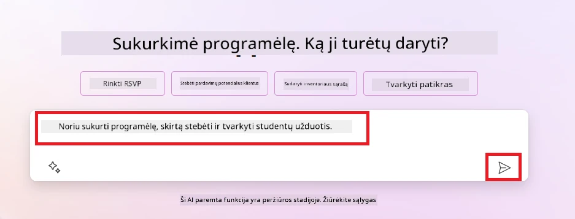

1. DI Copilot pasiūlys Dataverse lentelę su laukais duomenims saugoti, kuriuos norite stebėti ir keletą pavyzdinių duomenų. Tada galite pritaikyti lentelę pagal savo poreikius, naudodami DI Copilot asistento funkciją per pokalbyje pateiktus žingsnius.

   > **Svarbu**: Dataverse yra pagrindinė duomenų platforma Power Platform. Tai žemo kodo duomenų platforma programėlės duomenims saugoti. Tai visiškai valdomas servisą, kuris saugiai laiko duomenis Microsoft debesyje ir yra priskirtas jūsų Power Platform aplinkai. Jis turi įmontuotas duomenų valdymo galimybes, tokias kaip duomenų klasifikacija, duomenų kilmė, smulkus prieigos valdymas ir daugiau. Daugiau apie Dataverse galite sužinoti [čia](https://docs.microsoft.com/powerapps/maker/data-platform/data-platform-intro?WT.mc_id=academic-109639-somelezediko).

   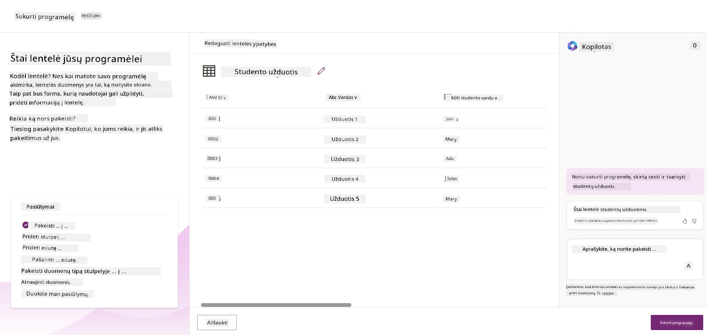

1. Mokytojai nori siųsti el. laiškus studentams, kurie pateikė savo užduotis, kad juos informuotų apie jų užduočių pažangą. Galite naudoti Copilot, kad pridėtumėte naują lauką lentelėje, kuriame būtų saugomas studento el. pašto adresas. Pavyzdžiui, galite naudoti tokią komandą, kad pridėtumėte naują lauką: **_Noriu pridėti stulpelį studento el. paštui saugoti_**. Spustelėkite mygtuką **Siųsti**, kad išsiųstumėte komandą DI Copilot.

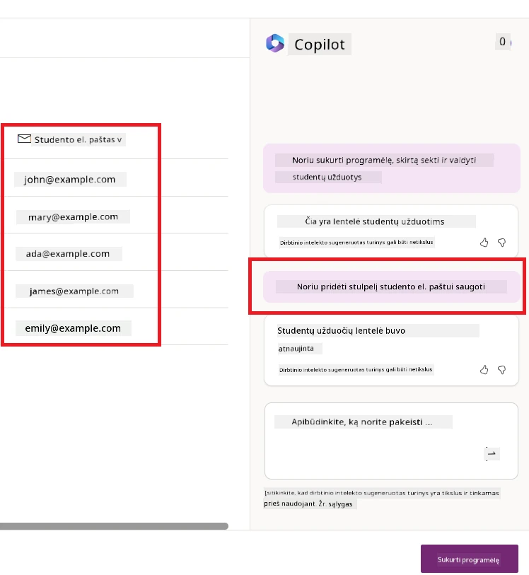

1. DI Copilot sukurs naują lauką, o jūs galėsite pritaikyti lauką pagal savo poreikius.

1. Kai baigsite su lentele, spustelėkite mygtuką **Create app**, kad sukurtumėte programėlę.

1. AI Copilot pagal jūsų aprašymą sugeneruos reaguojančią Canvas programėlę. Tada galite pritaikyti programėlę, kad ji atitiktų jūsų poreikius.

1. Mokytojams, norintiems siųsti el. laiškus studentams, galite naudoti Copilot, kad pridėtumėte naują ekraną programėlėje. Pavyzdžiui, galite naudoti šią užklausą, kad pridėtumėte naują ekraną programėlėje: **_Noriu pridėti ekraną el. laiškų siuntimui studentams_**. Spustelėkite mygtuką **Send**, kad išsiųstumėte užklausą AI Copilot.

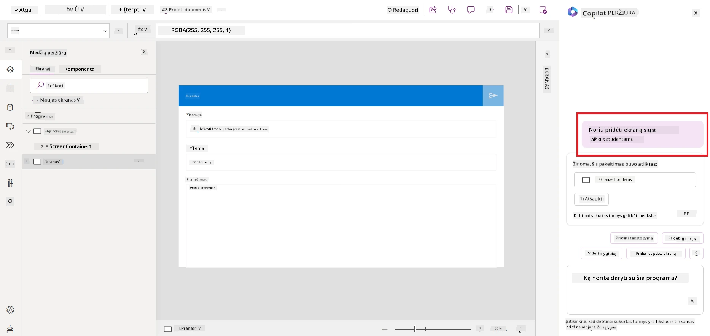

1. AI Copilot sugeneruos naują ekraną, kurį vėliau galėsite pritaikyti pagal savo poreikius.

1. Kai baigsite dirbti su programėle, spustelėkite mygtuką **Save**, kad ją išsaugotumėte.

1. Norėdami pasidalinti programėle su mokytojais, spustelėkite mygtuką **Share**, tada vėl spustelėkite **Share**. Galėsite pasidalinti programėle su mokytojais įvesti jų el. pašto adresus.

> **Jūsų namų darbas**: Sukurta programėlė yra puiki pradžia, tačiau ją galima patobulinti. Su el. pašto funkcija mokytojai gali siųsti el. laiškus studentams tik rankiniu būdu įvesdami jų el. pašto adresus. Ar galite naudoti Copilot sukurti automatizavimą, kuris leistų mokytojams automatiškai siųsti el. laiškus studentams, kai šie pateikia užduotis? Užuomina: su tinkama užklausa galite naudoti Copilot Power Automate programoje tai sukurti.

### Sukurkite sąskaitų informacijos lentelę mūsų startuoliui

Mūsų startuolio finansų komanda sunkiai sekė sąskaitas. Jie naudojo skaičiuoklę, kad sektų sąskaitas, tačiau valdyti tai tapo sudėtinga, nes sąskaitų skaičius išaugo. Jie paprašė jūsų sukurti lentelę, kuri padėtų saugoti, stebėti ir valdyti gautų sąskaitų informaciją. Šią lentelę turėtų būti galima naudoti automatizavimui, kuris išrašo visą sąskaitų informaciją ir saugo ją lentelėje. Taip pat lentelė turėtų leisti finansų komandai matyti, kurios sąskaitos apmokėtos, o kurios – ne.

Power Platform turi pagrindinę duomenų platformą, vadinamą Dataverse, kuri leidžia saugoti duomenis jūsų programėlėms ir sprendimams. Dataverse suteikia žemo kodo lygio duomenų platformą programėlės duomenų saugojimui. Tai visiškai valdomas servisas, kuris saugiai saugo duomenis Microsoft debesyje ir yra priskirtas jūsų Power Platform aplinkai. Jis turi įdiegtas duomenų valdymo galimybes, tokias kaip duomenų klasifikacija, duomenų kilmė, smulkus prieigos valdymas ir dar daugiau. Daugiau apie Dataverse galite sužinoti [čia](https://docs.microsoft.com/powerapps/maker/data-platform/data-platform-intro?WT.mc_id=academic-109639-somelezediko).

Kodėl turėtume naudoti Dataverse mūsų startuoliui? Standartinės ir pasirinktinos lentelės Dataverse suteikia saugų ir debesyje pagrįstą duomenų saugojimą. Lentelės leidžia saugoti įvairių tipų duomenis, panašiai kaip naudotumėte kelis darbalapius viename Excel darbalapyje. Galite naudoti lenteles saugoti duomenis, specifinius jūsų organizacijai ar verslo poreikiams. Kai kurios naudos mūsų startuoliui, naudojant Dataverse, yra bet neapsiriboja:

- **Lengva valdyti**: Tiek metaduomenys, tiek duomenys saugomi debesyje, todėl jums nereikia rūpintis, kaip jie yra saugomi ar tvarkomi. Galite koncentruotis į programėlių ir sprendimų kūrimą.

- **Saugumas**: Dataverse suteikia saugų debesyje saugyklą jūsų duomenims. Galite kontroliuoti, kas turi prieigą prie jūsų lentelių duomenų ir kaip jie gali prie jų prieiti, naudodami vaidmenimis pagrįstą saugumą.

- **Turtingi metaduomenys**: Duomenų tipai ir ryšiai naudojami tiesiogiai Power Apps aplinkoje

- **Logika ir patikrinimai**: Galite naudoti verslo taisykles, apskaičiuotus laukus ir patvirtinimo taisykles, kad užtikrintumėte verslo logiką ir duomenų tikslumą.

Dabar, kai žinote, kas yra Dataverse ir kodėl jį verta naudoti, pažvelkime, kaip galite naudoti Copilot, kad sukurtumėte lentelę Dataverse pagal mūsų finansų komandos reikalavimus.

> **Pastaba** : Šią lentelę naudosite kitame skyriuje, kad sukurtumėte automatizavimą, kuris išrašo visą sąskaitų informaciją ir saugo ją lentelėje.

Kad sukurtumėte lentelę Dataverse naudodami Copilot, atlikite šiuos veiksmus:

1. Eikite į [Power Apps](https://make.powerapps.com?WT.mc_id=academic-105485-koreyst) pradinį ekraną.

2. Kairėje navigacijos juostoje pasirinkite **Tables**, tada spustelėkite **Describe the new Table**.

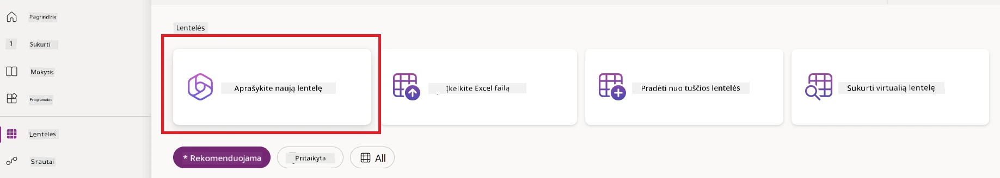

1. Ekrane **Describe the new Table** naudokite tekstinį lauką, kad aprašytumėte lentelę, kurią norite sukurti. Pavyzdžiui, **_Noriu sukurti lentelę, kurioje saugočiau sąskaitų informaciją_**. Spustelėkite mygtuką **Send**, kad išsiųstumėte užklausą AI Copilot.

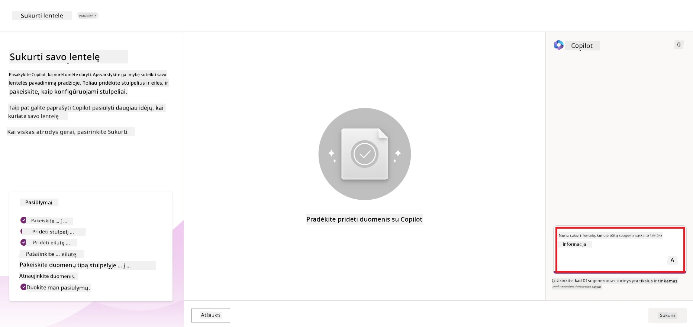

1. AI Copilot pasiūlys Dataverse lentelę su laukais, kurių jums reikia duomenų saugojimui ir kelių pavyzdinių duomenų. Tada galite pritaikyti lentelę pagal savo poreikius, naudodami AI Copilot asistento funkciją pokalbių metu.

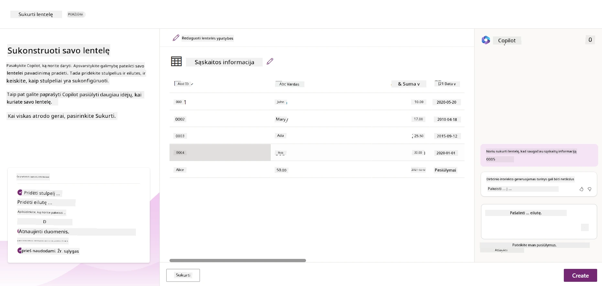

1. Finansų komanda nori siųsti el. laišką tiekėjui, kad atnaujintų juos apie sąskaitos statusą. Galite naudoti Copilot, kad pridėtumėte naują lauką lentelėje tiekėjo el. pašto saugojimui. Pavyzdžiui, galite naudoti tokią užklausą: **_Noriu pridėti stulpelį tiekėjo el. pašto saugojimui_**. Spustelėkite mygtuką **Send**, kad išsiųstumėte užklausą AI Copilot.

1. AI Copilot sugeneruos naują lauką, kurį galėsite pritaikyti pagal savo poreikius.

1. Kai baigsite su lentele, spustelėkite mygtuką **Create**, kad sukurtumėte lentelę.

## AI modeliai Power Platform su AI Builder

AI Builder yra žemo kodo AI galimybė Power Platform, kuri leidžia naudoti AI modelius, kad padėtų automatizuoti procesus ir prognozuoti rezultatus. Naudodami AI Builder galite integruoti AI į savo programėles ir srautus, kurie jungiasi prie jūsų duomenų Dataverse ar įvairiuose debesų duomenų šaltiniuose, tokiuose kaip SharePoint, OneDrive ar Azure.

## Iš anksto paruošti AI modeliai ir individualūs AI modeliai

AI Builder suteikia du AI modelių tipus: iš anksto paruoštus AI modelius ir individualius AI modelius. Iš anksto paruošti AI modeliai yra Microsoft apmokyti ir Power Platform prieinami modeliai, paruošti naudojimui. Jie padeda pridėti intelektą į jūsų programėles ir srautus nereikalaujant rinkti duomenų, tuomet kurti, apmokyti ir publikuoti savo modelius. Šių modelių galite naudoti procesų automatizavimui ir rezultatų prognozavimui.

Kai kurie iš anksto paruošti AI modeliai, prieinami Power Platform:

- **Pagrindinių frazių ištrauka**: modelis ištraukia pagrindines frazes iš teksto.
- **Kalbos atpažinimas**: modelis nustato teksto kalbą.
- **Nuotaikos analizė**: modelis nustato teigiamą, neigiamą, neutralią ar mišrią nuotaiką tekste.
- **Vizitinės kortelės skaitytuvas**: modelis ištraukia informaciją iš vizitinių kortelių.
- **Teksto atpažinimas**: modelis ištraukia tekstą iš nuotraukų.
- **Objektų aptikimas**: modelis aptinka ir ištraukia objektus iš nuotraukų.
- **Dokumentų apdorojimas**: modelis ištraukia informaciją iš formų.
- **Sąskaitų apdorojimas**: modelis ištraukia informaciją iš sąskaitų.

Naudodami individualius AI modelius, galite įkelti savo modelį į AI Builder, kad jis veiktų kaip bet kuris kitas AI Builder individualus modelis, leidžiantis apmokyti modelį naudodami savo duomenis. Šiuos modelius galite naudoti procesų automatizavimui ir rezultatų prognozavimui tiek Power Apps, tiek Power Automate. Naudojant savo modelį taikomi tam tikri apribojimai. Daugiau apie šiuos [apribojimus](https://learn.microsoft.com/ai-builder/byo-model#limitations?WT.mc_id=academic-105485-koreyst) skaitykite.

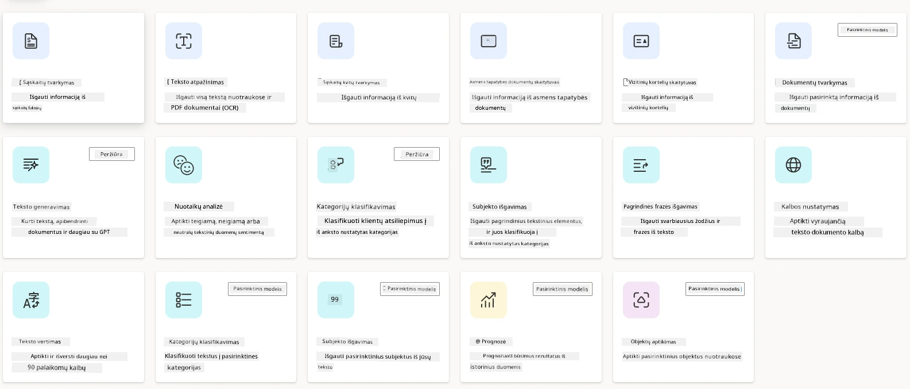

## Užduotis #2 - Sukurkite Sąskaitų apdorojimo srautą mūsų startuoliui

Finansų komanda sunkiai apdoroja sąskaitas. Jie naudojo skaičiuoklę sekdami sąskaitas, tačiau valdyti tai tapo sudėtinga, kai sąskaitų skaičius išaugo. Jie paprašė sukurti darbo eigą, padėsiančią apdoroti sąskaitas naudojant AI. Darbo eiga turi leisti išgauti informaciją iš sąskaitų ir saugoti ją Dataverse lentelėje. Taip pat darbo eiga turi leisti siųsti el. laišką finansų komandai su išgauta informacija.

Dabar, kai žinote, kas yra AI Builder ir kodėl verta jį naudoti, pažvelkime, kaip galite naudoti Sąskaitų apdorojimo AI modelį AI Builder, kurį aptarėme anksčiau, kurdami darbo eigą, padėsiančią finansų komandai apdoroti sąskaitas.

Norėdami sukurti darbo eigą, padėsiančią finansų komandai apdoroti sąskaitas, naudodami Sąskaitų apdorojimo AI modelį AI Builder, atlikite šiuos veiksmus:

1. Eikite į [Power Automate](https://make.powerautomate.com?WT.mc_id=academic-105485-koreyst) pradinį ekraną.

2. Naudokite teksto lauką pradžios ekrane aprašyti kūrimą darbo eigą. Pavyzdžiui, **_Apdoroti sąskaitą, kai ji atkeliauja į mano pašto dėžutę_**. Spustelėkite mygtuką **Send**, kad išsiųstumėte užklausą AI Copilot.

   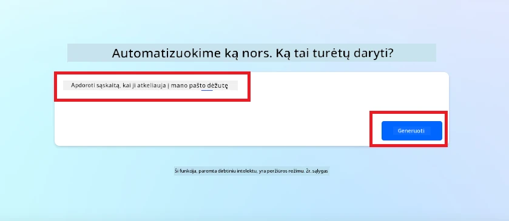

3. AI Copilot pasiūlys veiksmus, kuriuos turite atlikti, kad automatizuotumėte norimą užduotį. Galite spustelėti mygtuką **Next**, kad pereitumėte prie kitų žingsnių.

4. Kitame žingsnyje Power Automate paprašys nustatyti srautui reikalingus ryšius. Baigę spustelėkite mygtuką **Create flow**, kad sukurtumėte srautą.

5. AI Copilot sugeneruos srautą, kurį galėsite pritaikyti pagal savo poreikius.

6. Atnaujinkite srauto trigerį ir nustatykite **Folder** kaip aplanką, kuriame bus saugomos sąskaitos. Pavyzdžiui, nustatykite aplanką kaip **Inbox**. Spustelėkite **Show advanced options** ir nustatykite **Only with Attachments** į **Yes**. Tai užtikrins, kad srautas veiks tik gavus el. laišką su prisegtu failu tame aplanke.

7. Iš srauto pašalinkite šiuos veiksmus: **HTML to text**, **Compose**, **Compose 2**, **Compose 3** ir **Compose 4**, nes jų nenaudosite.

8. Pašalinkite veiksmą **Condition** iš srauto, nes jo nenaudosite. Turėtumėte pamatyti tokį vaizdą:

   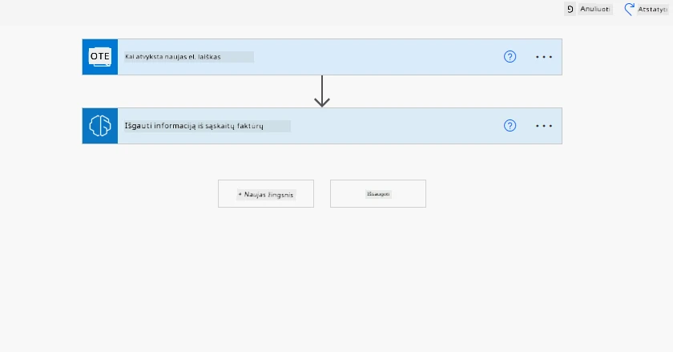

9. Spustelėkite mygtuką **Add an action** ir paieškos laukelyje įveskite **Dataverse**. Pasirinkite veiksmą **Add a new row**.

10. Veiksme **Extract Information from invoices** atnaujinkite lauką **Invoice File**, kad nurodytumėte **Attachment Content** iš el. laiško. Tai užtikrins, kad srautas ištrauks informaciją iš sąskaitos prisegto failo.

11. Pasirinkite lentelę, kurią sukūrėte anksčiau. Pavyzdžiui, galite pasirinkti lentelę **Invoice Information**. Pasirinkite dinaminį turinį iš ankstesnio veiksmo ir užpildykite šiuos laukus:

    - ID
    - Amount
    - Date
    - Name
    - Status - nustatykite **Status** reikšmę į **Pending**.
    - Supplier Email - naudokite dinaminį turinį **From** iš trigerio **When a new email arrives**.

    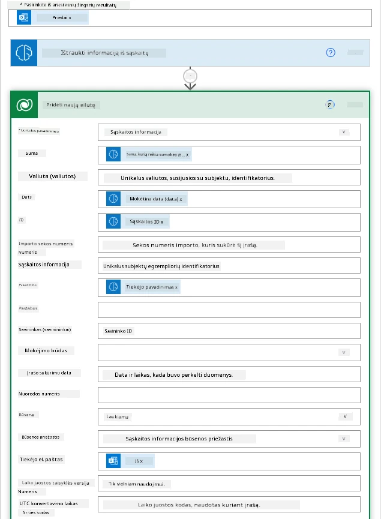

12. Baigę su srautu spustelėkite mygtuką **Save**, kad jį išsaugotumėte. Galite išbandyti srautą siųsdami el. laišką su sąskaita į aplanką, kurį nurodėte trigerio metu.

> **Jūsų namų darbas**: Sukurtas srautas yra gera pradžia, dabar pagalvokite, kaip sukurti automatizavimą, kuris leistų mūsų finansų komandai siųsti el. laišką tiekėjui, informuojant apie sąskaitos esamą statusą. Užuomina: srautas turi veikti, kai pasikeičia sąskaitos statusas.

## Naudokite Teksto generavimo AI modelį Power Automate

AI Builder siūlo modelį Create Text with GPT, kuris leidžia generuoti tekstą pagal užklausą ir veikia Microsoft Azure OpenAI paslaugos pagrindu. Su šia galimybe galite integruoti GPT (Generative Pre-Trained Transformer) technologiją į savo programėles ir srautus, kad sukurtumėte įvairias automatizuotas darbo eigas ir informatyvias programėles.

GPT modeliai yra plačiai mokomi dideliais duomenų kiekiais, leidžiančiais generuoti tekstą, kuris labai primena žmogaus kalbą pateikus užklausą. Integruoti į darbo eigas, GPT modeliai gali būti panaudoti įvairioms užduotims automatizuoti ir supaprastinti.

Pavyzdžiui, galite kurti srautus automatiškai generuoti tekstą įvairiems atvejams, tokiems kaip: el. laiškų juodraščiai, produktų aprašymai ir kt. Taip pat galite naudoti modelį tekstui generuoti įvairiems programų tipams, pavyzdžiui, pokalbių robotams ar klientų aptarnavimo programoms, leidžiančioms agentams efektyviai ir greitai atsakyti į klientų užklausas.

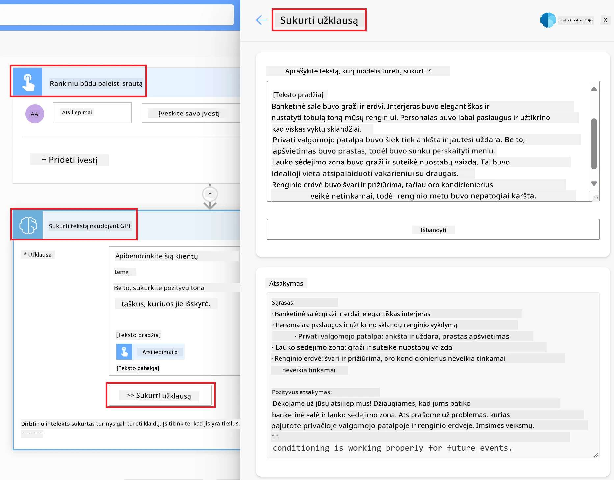

Norėdami sužinoti, kaip naudoti šį DI modelį Power Automate, peržiūrėkite modulį [Pridėkite intelektą su AI Builder ir GPT](https://learn.microsoft.com/training/modules/ai-builder-text-generation/?WT.mc_id=academic-109639-somelezediko).

## Puikus darbas! Tęskite mokymąsi

Baigę šią pamoką, peržiūrėkite mūsų [Generatyvinio DI mokymosi kolekciją](https://aka.ms/genai-collection?WT.mc_id=academic-105485-koreyst), kad toliau gilintumėte savo žinias apie generatyvinį DI!

Norite pritaikyti ir daugiau išnaudoti Copilot? Ištirkite [Awesome Copilot](https://github.com/github/awesome-copilot?WT.mc_id=academic-105485-koreyst) — bendruomenės sukurtą instrukcijų, agentų, įgūdžių ir konfigūracijų rinkinį, kuris padės kuo geriau išnaudoti GitHub Copilot.

Eikite į 11-ąją pamoką, kur apžvelgsime, kaip [integruoti generatyvinį DI su funkcijų kvietimu](../11-integrating-with-function-calling/README.md?WT.mc_id=academic-105485-koreyst)!

---

<!-- CO-OP TRANSLATOR DISCLAIMER START -->
**Atsakomybės apribojimas**:
Šis dokumentas buvo išverstas naudojant dirbtinio intelekto vertimo paslaugą [Co-op Translator](https://github.com/Azure/co-op-translator). Nors siekiame tikslumo, prašome atkreipti dėmesį, kad automatiniai vertimai gali turėti klaidų ar netikslumų. Originalus dokumentas jo gimtąja kalba laikomas autoritetingu šaltiniu. Svarbiai informacijai rekomenduojama naudoti profesionalų žmogiškąjį vertimą. Mes neatsakome už jokius nesusipratimus ar neteisingą interpretaciją, kilusią naudojantis šiuo vertimu.
<!-- CO-OP TRANSLATOR DISCLAIMER END -->