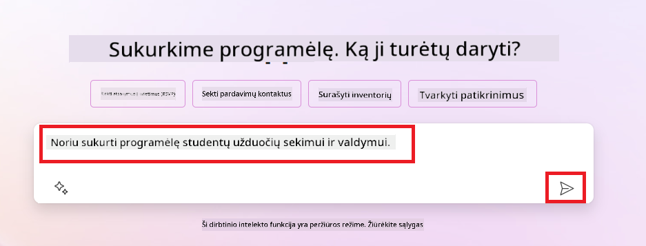
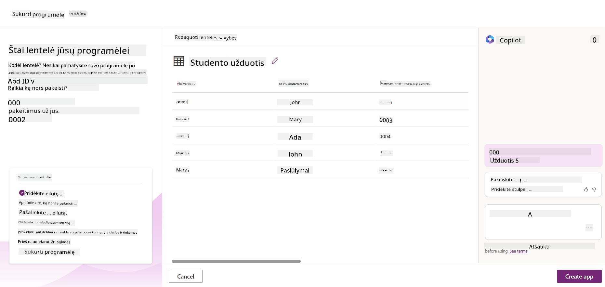
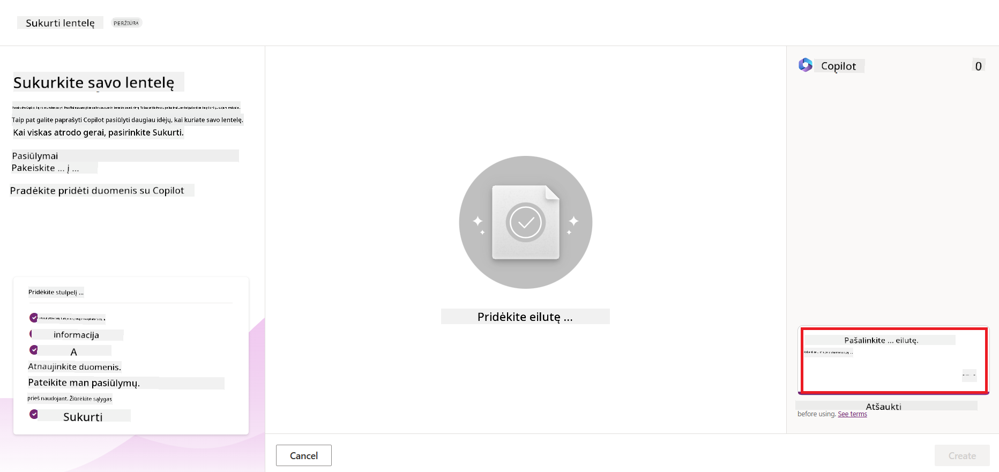

<!--
CO_OP_TRANSLATOR_METADATA:
{
  "original_hash": "846ac8e3b7dcfb697d3309fec05f0fea",
  "translation_date": "2025-10-18T02:27:04+00:00",
  "source_file": "10-building-low-code-ai-applications/README.md",
  "language_code": "lt"
}
-->
# Kuriame mažo kodo AI programas

> _(Spustelėkite aukščiau esančią nuotrauką, kad peržiūrėtumėte šios pamokos vaizdo įrašą)_

## Įvadas

Dabar, kai išmokome kurti vaizdus generuojančias programas, pakalbėkime apie mažą kodą. Generatyvinis AI gali būti naudojamas įvairiose srityse, įskaitant mažą kodą, bet kas yra mažas kodas ir kaip galime pridėti AI prie jo?

Programų ir sprendimų kūrimas tapo lengvesnis tiek tradiciniams programuotojams, tiek neprogramuotojams naudojant mažo kodo kūrimo platformas. Mažo kodo kūrimo platformos leidžia kurti programas ir sprendimus su minimaliu arba visai be kodo. Tai pasiekiama suteikiant vizualią kūrimo aplinką, kurioje galima vilkti ir mesti komponentus, kad būtų sukurtos programos ir sprendimai. Tai leidžia kurti programas ir sprendimus greičiau ir su mažesniais ištekliais. Šioje pamokoje gilinamės į tai, kaip naudoti mažą kodą ir kaip pagerinti mažo kodo kūrimą su AI naudojant „Power Platform“.

„Power Platform“ suteikia organizacijoms galimybę įgalinti savo komandas kurti savo sprendimus intuityvioje mažo kodo arba be kodo aplinkoje. Ši aplinka padeda supaprastinti sprendimų kūrimo procesą. Naudojant „Power Platform“, sprendimai gali būti sukurti per kelias dienas ar savaites, o ne mėnesius ar metus. „Power Platform“ sudaro penki pagrindiniai produktai: „Power Apps“, „Power Automate“, „Power BI“, „Power Pages“ ir „Copilot Studio“.

Šioje pamokoje aptariama:

- Generatyvinio AI pristatymas „Power Platform“
- „Copilot“ pristatymas ir kaip jį naudoti
- Generatyvinio AI naudojimas kuriant programas ir srautus „Power Platform“
- AI modelių supratimas „Power Platform“ su „AI Builder“

## Mokymosi tikslai

Pamokos pabaigoje galėsite:

- Suprasti, kaip veikia „Copilot“ „Power Platform“.

- Sukurti studentų užduočių sekimo programą mūsų švietimo startuoliui.

- Sukurti sąskaitų apdorojimo srautą, kuris naudoja AI informacijai iš sąskaitų išgauti.

- Taikyti geriausią praktiką naudojant „Create Text with GPT AI Model“.

Pamokoje naudosite šiuos įrankius ir technologijas:

- **Power Apps**, skirtą studentų užduočių sekimo programai, kuri suteikia mažo kodo kūrimo aplinką programoms kurti, kad būtų galima sekti, valdyti ir sąveikauti su duomenimis.

- **Dataverse**, skirtą studentų užduočių sekimo programos duomenų saugojimui, kur „Dataverse“ suteiks mažo kodo duomenų platformą programos duomenims saugoti.

- **Power Automate**, skirtą sąskaitų apdorojimo srautui, kur turėsite mažo kodo kūrimo aplinką darbo eigoms kurti, kad automatizuotumėte sąskaitų apdorojimo procesą.

- **AI Builder**, skirtą sąskaitų apdorojimo AI modeliui, kur naudosite iš anksto sukurtus AI modelius sąskaitoms apdoroti mūsų startuoliui.

## Generatyvinis AI „Power Platform“

Mažo kodo kūrimo ir programų tobulinimas generatyviniu AI yra pagrindinė „Power Platform“ sritis. Tikslas yra suteikti galimybę visiems kurti AI pagrįstas programas, svetaines, ataskaitų lentas ir automatizuoti procesus su AI, _nereikalaujant jokių duomenų mokslo žinių_. Šis tikslas pasiekiamas integruojant generatyvinį AI į mažo kodo kūrimo patirtį „Power Platform“ kaip „Copilot“ ir „AI Builder“.

### Kaip tai veikia?

„Copilot“ yra AI asistentas, kuris leidžia kurti „Power Platform“ sprendimus aprašant jūsų reikalavimus per pokalbių žingsnius naudojant natūralią kalbą. Pavyzdžiui, galite nurodyti savo AI asistentui, kokius laukus jūsų programa naudos, ir jis sukurs tiek programą, tiek pagrindinį duomenų modelį, arba galite nurodyti, kaip nustatyti srautą „Power Automate“.

„Copilot“ funkcijas galite naudoti kaip funkciją savo programos ekranuose, kad vartotojai galėtų atrasti įžvalgas per pokalbių sąveikas.

„AI Builder“ yra mažo kodo AI galimybė, prieinama „Power Platform“, kuri leidžia naudoti AI modelius, kad padėtų automatizuoti procesus ir prognozuoti rezultatus. Naudodami „AI Builder“ galite įtraukti AI į savo programas ir srautus, kurie jungiasi prie jūsų duomenų „Dataverse“ arba įvairiuose debesų duomenų šaltiniuose, tokiuose kaip „SharePoint“, „OneDrive“ ar „Azure“.

„Copilot“ yra prieinamas visuose „Power Platform“ produktuose: „Power Apps“, „Power Automate“, „Power BI“, „Power Pages“ ir „Power Virtual Agents“. „AI Builder“ yra prieinamas „Power Apps“ ir „Power Automate“. Šioje pamokoje mes sutelksime dėmesį į tai, kaip naudoti „Copilot“ ir „AI Builder“ „Power Apps“ ir „Power Automate“, kad sukurtume sprendimą mūsų švietimo startuoliui.

### „Copilot“ „Power Apps“

Kaip „Power Platform“ dalis, „Power Apps“ suteikia mažo kodo kūrimo aplinką programoms kurti, kad būtų galima sekti, valdyti ir sąveikauti su duomenimis. Tai programų kūrimo paslaugų rinkinys su mastelio duomenų platforma ir galimybe prisijungti prie debesų paslaugų ir vietinių duomenų. „Power Apps“ leidžia kurti programas, kurios veikia naršyklėse, planšetiniuose kompiuteriuose ir telefonuose, ir gali būti dalijamasi su kolegomis. „Power Apps“ supaprastina vartotojų įsitraukimą į programų kūrimą su paprasta sąsaja, kad kiekvienas verslo vartotojas ar profesionalus programuotojas galėtų kurti pritaikytas programas. Programų kūrimo patirtis taip pat pagerinama generatyviniu AI per „Copilot“.

„Copilot“ AI asistento funkcija „Power Apps“ leidžia aprašyti, kokios programos jums reikia ir kokią informaciją norite, kad jūsų programa sektų, rinktų ar rodytų. „Copilot“ tada sugeneruoja interaktyvią „Canvas“ programą pagal jūsų aprašymą. Tada galite pritaikyti programą pagal savo poreikius. „AI Copilot“ taip pat generuoja ir siūlo „Dataverse“ lentelę su laukais, kurių jums reikia norint saugoti norimus sekti duomenis, ir pateikia pavyzdinius duomenis. Vėliau pamokoje aptarsime, kas yra „Dataverse“ ir kaip ją galite naudoti „Power Apps“. Tada galite pritaikyti lentelę pagal savo poreikius naudodami „AI Copilot“ asistento funkciją per pokalbių žingsnius. Ši funkcija yra lengvai pasiekiama iš „Power Apps“ pagrindinio ekrano.

### „Copilot“ „Power Automate“

Kaip „Power Platform“ dalis, „Power Automate“ leidžia vartotojams kurti automatizuotas darbo eigas tarp programų ir paslaugų. Tai padeda automatizuoti pasikartojančius verslo procesus, tokius kaip komunikacija, duomenų rinkimas ir sprendimų patvirtinimai. Paprasta sąsaja leidžia vartotojams su įvairiais techniniais įgūdžiais (nuo pradedančiųjų iki patyrusių programuotojų) automatizuoti darbo užduotis. Darbo eigos kūrimo patirtis taip pat pagerinama generatyviniu AI per „Copilot“.

„Copilot“ AI asistento funkcija „Power Automate“ leidžia aprašyti, kokio srauto jums reikia ir kokius veiksmus norite, kad jūsų srautas atliktų. „Copilot“ tada sugeneruoja srautą pagal jūsų aprašymą. Tada galite pritaikyti srautą pagal savo poreikius. „AI Copilot“ taip pat generuoja ir siūlo veiksmus, kurių jums reikia norint atlikti norimą automatizuoti užduotį. Vėliau pamokoje aptarsime, kas yra srautai ir kaip juos galite naudoti „Power Automate“. Tada galite pritaikyti veiksmus pagal savo poreikius naudodami „AI Copilot“ asistento funkciją per pokalbių žingsnius. Ši funkcija yra lengvai pasiekiama iš „Power Automate“ pagrindinio ekrano.

## Užduotis: Valdykite studentų užduotis ir sąskaitas mūsų startuoliui, naudodami „Copilot“

Mūsų startuolis teikia internetinius kursus studentams. Startuolis sparčiai augo ir dabar sunkiai susidoroja su kursų paklausa. Startuolis pasamdė jus kaip „Power Platform“ kūrėją, kad padėtumėte sukurti mažo kodo sprendimą, kuris padėtų valdyti studentų užduotis ir sąskaitas. Sprendimas turėtų padėti sekti ir valdyti studentų užduotis per programą ir automatizuoti sąskaitų apdorojimo procesą per darbo eigą. Jums buvo pavesta naudoti generatyvinį AI sprendimui sukurti.

Pradėdami naudoti „Copilot“, galite naudoti [„Power Platform Copilot Prompt Library“](https://github.com/pnp/powerplatform-prompts?WT.mc_id=academic-109639-somelezediko), kad pradėtumėte naudoti raginimus. Ši biblioteka apima raginimų sąrašą, kurį galite naudoti kuriant programas ir srautus su „Copilot“. Taip pat galite naudoti bibliotekos raginimus, kad gautumėte idėjų, kaip aprašyti savo reikalavimus „Copilot“.

### Sukurkite studentų užduočių sekimo programą mūsų startuoliui

Mūsų startuolio pedagogai sunkiai sekė studentų užduotis. Jie naudojo skaičiuoklę užduotims sekti, tačiau tai tapo sunku valdyti, kai studentų skaičius padidėjo. Jie paprašė jūsų sukurti programą, kuri padėtų jiems sekti ir valdyti studentų užduotis. Programa turėtų leisti jiems pridėti naujas užduotis, peržiūrėti užduotis, atnaujinti užduotis ir ištrinti užduotis. Programa taip pat turėtų leisti pedagogams ir studentams peržiūrėti įvertintas ir neįvertintas užduotis.

Programą sukursite naudodami „Copilot“ „Power Apps“, atlikdami šiuos veiksmus:

1. Eikite į [„Power Apps“](https://make.powerapps.com?WT.mc_id=academic-105485-koreyst) pagrindinį ekraną.

1. Naudokite teksto lauką pagrindiniame ekrane, kad aprašytumėte programą, kurią norite sukurti. Pavyzdžiui, **_Noriu sukurti programą studentų užduotims sekti ir valdyti_**. Spustelėkite mygtuką **Siųsti**, kad išsiųstumėte raginimą „AI Copilot“.

1. „AI Copilot“ pasiūlys „Dataverse“ lentelę su laukais, kurių jums reikia norint saugoti norimus sekti duomenis, ir pateiks pavyzdinius duomenis. Tada galite pritaikyti lentelę pagal savo poreikius naudodami „AI Copilot“ asistento funkciją per pokalbių žingsnius.

   > **Svarbu**: „Dataverse“ yra pagrindinė „Power Platform“ duomenų platforma. Tai mažo kodo duomenų platforma programos duomenims saugoti. Tai visiškai valdomas paslaugų rinkinys, kuris saugiai saugo duomenis „Microsoft Cloud“ ir yra įdiegtas jūsų „Power Platform“ aplinkoje. Ji turi įmontuotas duomenų valdymo galimybes, tokias kaip duomenų klasifikacija, duomenų kilmė, smulkių detalių prieigos kontrolė ir kt. Daugiau apie „Dataverse“ galite sužinoti [čia](https://docs.microsoft.com/powerapps/maker/data-platform/data-platform-intro?WT.mc_id=academic-109639-somelezediko).

   

1. Pedagogai nori siųsti el. laiškus studentams, kurie pateikė savo užduotis, kad informuotų juos apie jų užduočių eigą. Galite naudoti „Copilot“, kad pridėtumėte naują lauką lentelėje studento el. paštui saugoti. Pavyzdžiui, galite naudoti šį raginimą, kad pridėtumėte naują lauką lentelėje: **_Noriu pridėti stulpelį studento el. paštui saugoti_**. Spustelėkite mygtuką **Siųsti**, kad išsiųstumėte raginimą „AI Copilot“.

1. „AI Copilot“ sugeneruos naują lauką, kurį galėsite pritaikyti pagal savo poreikius.

1. Kai baigsite darbą su lentele, spustelėkite mygtuką **Sukurti programą**, kad sukurtumėte programą.

1. „AI Copilot“ sugeneruos interaktyvią „Canvas“ programą pagal jūsų aprašymą. Tada galite pritaikyti programą pagal savo poreikius.

1. Kad pedagogai galėtų siųsti el. laiškus studentams, galite naudoti „Copilot“, kad pridėtumėte naują ekraną programoje. Pavyzdžiui, galite naudoti šį raginimą, kad pridėtumėte naują ekraną programoje: **_Noriu pridėti ekraną el. laiškams siųsti studentams_**. Spustelėkite mygtuką **Siųsti**, kad išsiųstumėte raginimą „AI Copilot“.

1. „AI Copilot“ sugeneruos naują ekraną, kurį galėsite pritaikyti pagal savo poreikius.

1. Kai baigsite darbą su programa, spustelėkite mygtuką **Išsaugoti**, kad išsaugotumėte programą.

1. Norėdami pasidalinti programa su pedagogais, spustelėkite mygtuką **Dalintis**, o tada dar kartą spustelėkite mygtuką **Dalintis**. Tada galite pasidalinti programa su pedagogais, įvesdami jų el. pašto adresus.

> **Jūsų namų darbas**: Ką tik sukurta programa yra geras pradžia, tačiau ją galima patobulinti. Su el. pašto funkcija pedagogai gali siųsti el. laiškus studentams tik rankiniu būdu, įvesdami jų el. paštus. Ar galite naudoti „Copilot“, kad sukurtumėte automatizavimą, kuris leistų pedagogams automatiškai siųsti el. laiškus studentams, kai jie pateikia savo užduotis? Jūsų užuomina yra ta, kad su tinkamu raginimu galite naudoti „Copilot“ „Power Automate“, kad tai sukurtumėte.

### Sukurkite sąskaitų informacijos lentelę mūsų startuoliui

Mūsų startuolio finansų komanda sunkiai sekė sąskaitas. Jie naudojo skaičiuoklę sąskaitoms sekti, tačiau tai tapo sunku valdyti, kai sąskaitų skaičius padidėjo. Jie paprašė jūsų sukurti lentelę, kuri padėtų saugoti, sekti ir valdyti gautų sąskaitų informaciją. Lentelė turėtų būti naudojama kuriant automatizavimą, kuris išgautų visą sąskaitų informaciją ir saugotų ją lentelėje. Lentelė taip pat turėtų leisti finansų komand
Kodėl verta naudoti „Dataverse“ mūsų startuoliui? Standartinės ir pritaikytos lentelės „Dataverse“ suteikia saugią ir debesų technologija pagrįstą duomenų saugojimo galimybę. Lentelės leidžia saugoti įvairių tipų duomenis, panašiai kaip naudojant kelis darbalapius viename „Excel“ darbaknygėje. Galite naudoti lenteles, kad saugotumėte duomenis, kurie yra specifiniai jūsų organizacijos ar verslo poreikiams. Kai kurie privalumai, kuriuos mūsų startuolis gaus naudodamas „Dataverse“, apima, bet neapsiriboja:

- **Lengva valdyti**: Tiek metaduomenys, tiek duomenys saugomi debesyje, todėl jums nereikia rūpintis, kaip jie saugomi ar valdomi. Galite susitelkti į savo programų ir sprendimų kūrimą.

- **Saugumas**: „Dataverse“ suteikia saugią ir debesų technologija pagrįstą duomenų saugojimo galimybę. Galite kontroliuoti, kas turi prieigą prie jūsų lentelėse esančių duomenų ir kaip jie gali būti pasiekiami, naudodami vaidmenimis pagrįstą saugumą.

- **Turtingi metaduomenys**: Duomenų tipai ir ryšiai naudojami tiesiogiai „Power Apps“.

- **Logika ir validacija**: Galite naudoti verslo taisykles, skaičiuojamus laukus ir validacijos taisykles, kad užtikrintumėte verslo logiką ir duomenų tikslumą.

Dabar, kai žinote, kas yra „Dataverse“ ir kodėl verta jį naudoti, pažvelkime, kaip galite naudoti „Copilot“, kad sukurtumėte lentelę „Dataverse“, atitinkančią mūsų finansų komandos reikalavimus.

> **Note**: Šią lentelę naudosite kitame skyriuje, kad sukurtumėte automatizavimą, kuris ištrauks visą sąskaitų faktūrų informaciją ir saugos ją lentelėje.

Norėdami sukurti lentelę „Dataverse“ naudodami „Copilot“, atlikite šiuos veiksmus:

1. Eikite į [Power Apps](https://make.powerapps.com?WT.mc_id=academic-105485-koreyst) pagrindinį ekraną.

2. Kairėje navigacijos juostoje pasirinkite **Tables** ir tada spustelėkite **Describe the new Table**.

3. Ekrane **Describe the new Table** naudokite teksto lauką, kad aprašytumėte lentelę, kurią norite sukurti. Pavyzdžiui, **_Noriu sukurti lentelę sąskaitų faktūrų informacijai saugoti_**. Spustelėkite **Send** mygtuką, kad išsiųstumėte užklausą AI „Copilot“.

4. AI „Copilot“ pasiūlys „Dataverse“ lentelę su laukais, reikalingais saugoti norimus duomenis, ir pateiks pavyzdinius duomenis. Tada galite pritaikyti lentelę pagal savo poreikius, naudodami AI „Copilot“ asistento funkciją per pokalbių žingsnius.

5. Finansų komanda nori išsiųsti el. laišką tiekėjui, kad informuotų apie dabartinę jų sąskaitos faktūros būseną. Galite naudoti „Copilot“, kad pridėtumėte naują lauką lentelėje tiekėjo el. paštui saugoti. Pavyzdžiui, galite naudoti šią užklausą, kad pridėtumėte naują lauką lentelėje: **_Noriu pridėti stulpelį tiekėjo el. paštui saugoti_**. Spustelėkite **Send** mygtuką, kad išsiųstumėte užklausą AI „Copilot“.

6. AI „Copilot“ sugeneruos naują lauką, kurį galėsite pritaikyti pagal savo poreikius.

7. Kai baigsite kurti lentelę, spustelėkite **Create** mygtuką, kad sukurtumėte lentelę.

## AI modeliai „Power Platform“ su „AI Builder“

„AI Builder“ yra mažo kodo AI galimybė, prieinama „Power Platform“, leidžianti naudoti AI modelius procesams automatizuoti ir rezultatams prognozuoti. Naudodami „AI Builder“ galite integruoti AI į savo programas ir srautus, kurie jungiasi su jūsų duomenimis „Dataverse“ arba įvairiuose debesų duomenų šaltiniuose, tokiuose kaip „SharePoint“, „OneDrive“ ar „Azure“.

## Paruošti AI modeliai ir pritaikyti AI modeliai

„AI Builder“ siūlo dviejų tipų AI modelius: paruoštus AI modelius ir pritaikytus AI modelius. Paruošti AI modeliai yra paruošti naudoti AI modeliai, kuriuos apmokė „Microsoft“ ir kurie yra prieinami „Power Platform“. Jie padeda pridėti intelektą prie jūsų programų ir srautų, nereikalaujant rinkti duomenų, kurti, mokyti ir publikuoti savo modelių. Šiuos modelius galite naudoti procesams automatizuoti ir rezultatams prognozuoti.

Kai kurie paruošti AI modeliai, prieinami „Power Platform“, apima:

- **Pagrindinių frazių ištraukimas**: Šis modelis ištraukia pagrindines frazes iš teksto.
- **Kalbos atpažinimas**: Šis modelis nustato teksto kalbą.
- **Nuotaikos analizė**: Šis modelis nustato teigiamą, neigiamą, neutralią ar mišrią teksto nuotaiką.
- **Vizitinių kortelių skaitytuvas**: Šis modelis ištraukia informaciją iš vizitinių kortelių.
- **Teksto atpažinimas**: Šis modelis ištraukia tekstą iš vaizdų.
- **Objektų atpažinimas**: Šis modelis atpažįsta ir ištraukia objektus iš vaizdų.
- **Dokumentų apdorojimas**: Šis modelis ištraukia informaciją iš formų.
- **Sąskaitų faktūrų apdorojimas**: Šis modelis ištraukia informaciją iš sąskaitų faktūrų.

Naudodami pritaikytus AI modelius galite įtraukti savo modelį į „AI Builder“, kad jis veiktų kaip bet kuris pritaikytas „AI Builder“ modelis, leidžiantis mokyti modelį naudojant savo duomenis. Šiuos modelius galite naudoti procesams automatizuoti ir rezultatams prognozuoti tiek „Power Apps“, tiek „Power Automate“. Naudojant savo modelį, taikomi tam tikri apribojimai. Daugiau apie šiuos [apribojimus](https://learn.microsoft.com/ai-builder/byo-model#limitations?WT.mc_id=academic-105485-koreyst).

## Užduotis Nr. 2 - Sukurkite sąskaitų faktūrų apdorojimo srautą mūsų startuoliui

Finansų komandai sunku apdoroti sąskaitas faktūras. Jie naudojo skaičiuoklę sąskaitoms faktūroms sekti, tačiau tai tapo sudėtinga, kai sąskaitų faktūrų skaičius padidėjo. Jie paprašė jūsų sukurti darbo eigą, kuri padėtų jiems apdoroti sąskaitas faktūras naudojant AI. Darbo eiga turėtų leisti ištraukti informaciją iš sąskaitų faktūrų ir saugoti informaciją „Dataverse“ lentelėje. Darbo eiga taip pat turėtų leisti išsiųsti el. laišką finansų komandai su ištraukta informacija.

Dabar, kai žinote, kas yra „AI Builder“ ir kodėl verta jį naudoti, pažvelkime, kaip galite naudoti „Invoice Processing AI Model“ „AI Builder“, kurį aptarėme anksčiau, kad sukurtumėte darbo eigą, kuri padėtų finansų komandai apdoroti sąskaitas faktūras.

Norėdami sukurti darbo eigą, kuri padėtų finansų komandai apdoroti sąskaitas faktūras naudojant „Invoice Processing AI Model“ „AI Builder“, atlikite šiuos veiksmus:

1. Eikite į [Power Automate](https://make.powerautomate.com?WT.mc_id=academic-105485-koreyst) pagrindinį ekraną.

2. Naudokite teksto lauką pagrindiniame ekrane, kad aprašytumėte darbo eigą, kurią norite sukurti. Pavyzdžiui, **_Apdoroti sąskaitą faktūrą, kai ji atkeliauja į mano pašto dėžutę_**. Spustelėkite **Send** mygtuką, kad išsiųstumėte užklausą AI „Copilot“.

   

3. AI „Copilot“ pasiūlys veiksmus, kuriuos reikia atlikti norint automatizuoti užduotį. Galite spustelėti **Next** mygtuką, kad pereitumėte prie kitų žingsnių.

4. Kitame žingsnyje „Power Automate“ paragins jus nustatyti ryšius, reikalingus srautui. Kai baigsite, spustelėkite **Create flow** mygtuką, kad sukurtumėte srautą.

5. AI „Copilot“ sugeneruos srautą, kurį galėsite pritaikyti pagal savo poreikius.

6. Atnaujinkite srauto trigerį ir nustatykite **Folder** į aplanką, kuriame bus saugomos sąskaitos faktūros. Pavyzdžiui, galite nustatyti aplanką į **Inbox**. Spustelėkite **Show advanced options** ir nustatykite **Only with Attachments** į **Yes**. Tai užtikrins, kad srautas veiks tik tada, kai el. laiškas su priedu bus gautas į aplanką.

7. Pašalinkite šiuos veiksmus iš srauto: **HTML to text**, **Compose**, **Compose 2**, **Compose 3** ir **Compose 4**, nes jų nenaudosite.

8. Pašalinkite **Condition** veiksmą iš srauto, nes jo nenaudosite. Tai turėtų atrodyti kaip šis ekrano vaizdas:

   

9. Spustelėkite **Add an action** mygtuką ir ieškokite **Dataverse**. Pasirinkite **Add a new row** veiksmą.

10. Veiksme **Extract Information from invoices** atnaujinkite **Invoice File**, kad jis nurodytų **Attachment Content** iš el. laiško. Tai užtikrins, kad srautas ištrauks informaciją iš sąskaitos faktūros priedo.

11. Pasirinkite lentelę, kurią sukūrėte anksčiau. Pavyzdžiui, galite pasirinkti lentelę **Invoice Information**. Pasirinkite dinaminį turinį iš ankstesnio veiksmo, kad užpildytumėte šiuos laukus:

    - ID
    - Suma
    - Data
    - Pavadinimas
    - Būsena - Nustatykite **Status** į **Pending**.
    - Tiekėjo el. paštas - Naudokite **From** dinaminį turinį iš **When a new email arrives** trigerio.

    

12. Kai baigsite srautą, spustelėkite **Save** mygtuką, kad išsaugotumėte srautą. Tada galite išbandyti srautą, išsiųsdami el. laišką su sąskaita faktūra į aplanką, kurį nurodėte trigerio nustatymuose.

> **Jūsų namų darbas**: Srautas, kurį ką tik sukūrėte, yra gera pradžia, dabar turite pagalvoti, kaip galite sukurti automatizavimą, kuris leistų mūsų finansų komandai išsiųsti el. laišką tiekėjui, kad informuotų apie dabartinę jų sąskaitos faktūros būseną. Jūsų užuomina: srautas turi veikti, kai sąskaitos faktūros būsena pasikeičia.

## Naudokite teksto generavimo AI modelį „Power Automate“

„Create Text with GPT AI Model“ „AI Builder“ leidžia generuoti tekstą pagal užklausą ir yra pagrįstas „Microsoft Azure OpenAI Service“. Naudodami šią galimybę galite integruoti GPT (Generative Pre-Trained Transformer) technologiją į savo programas ir srautus, kad sukurtumėte įvairius automatizuotus srautus ir įžvalgius sprendimus.

GPT modeliai yra intensyviai mokomi didžiuliais duomenų kiekiais, leidžiant jiems generuoti tekstą, kuris labai panašus į žmogaus kalbą, kai pateikiama užklausa. Integravus su darbo eigos automatizavimu, AI modeliai, tokie kaip GPT, gali būti naudojami įvairioms užduotims supaprastinti ir automatizuoti.

Pavyzdžiui, galite sukurti srautus, kurie automatiškai generuoja tekstą įvairiems naudojimo atvejams, tokiems kaip: el. laiškų juodraščiai, produktų aprašymai ir kt. Taip pat galite naudoti modelį tekstui generuoti įvairioms programoms, tokioms kaip pokalbių robotai ir klientų aptarnavimo programos, leidžiančios klientų aptarnavimo agentams efektyviai ir veiksmingai atsakyti į klientų užklausas.

Norėdami sužinoti, kaip naudoti šį AI modelį „Power Automate“, peržiūrėkite [Add intelligence with AI Builder and GPT](https://learn.microsoft.com/training/modules/ai-builder-text-generation/?WT.mc_id=academic-109639-somelezediko) modulį.

## Puikus darbas! Tęskite mokymąsi

Baigę šią pamoką, peržiūrėkite mūsų [Generative AI Learning collection](https://aka.ms/genai-collection?WT.mc_id=academic-105485-koreyst), kad toliau gilintumėte savo žinias apie generatyvinį AI!

Eikite į 11 pamoką, kurioje aptarsime, kaip [integruoti generatyvinį AI su funkcijų iškvietimu](../11-integrating-with-function-calling/README.md?WT.mc_id=academic-105485-koreyst)!

---

**Atsakomybės apribojimas**:  
Šis dokumentas buvo išverstas naudojant AI vertimo paslaugą [Co-op Translator](https://github.com/Azure/co-op-translator). Nors stengiamės užtikrinti tikslumą, prašome atkreipti dėmesį, kad automatiniai vertimai gali turėti klaidų ar netikslumų. Originalus dokumentas jo gimtąja kalba turėtų būti laikomas autoritetingu šaltiniu. Kritinei informacijai rekomenduojama naudoti profesionalų žmogaus vertimą. Mes neprisiimame atsakomybės už nesusipratimus ar neteisingus aiškinimus, atsiradusius dėl šio vertimo naudojimo.