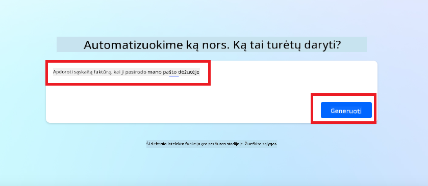
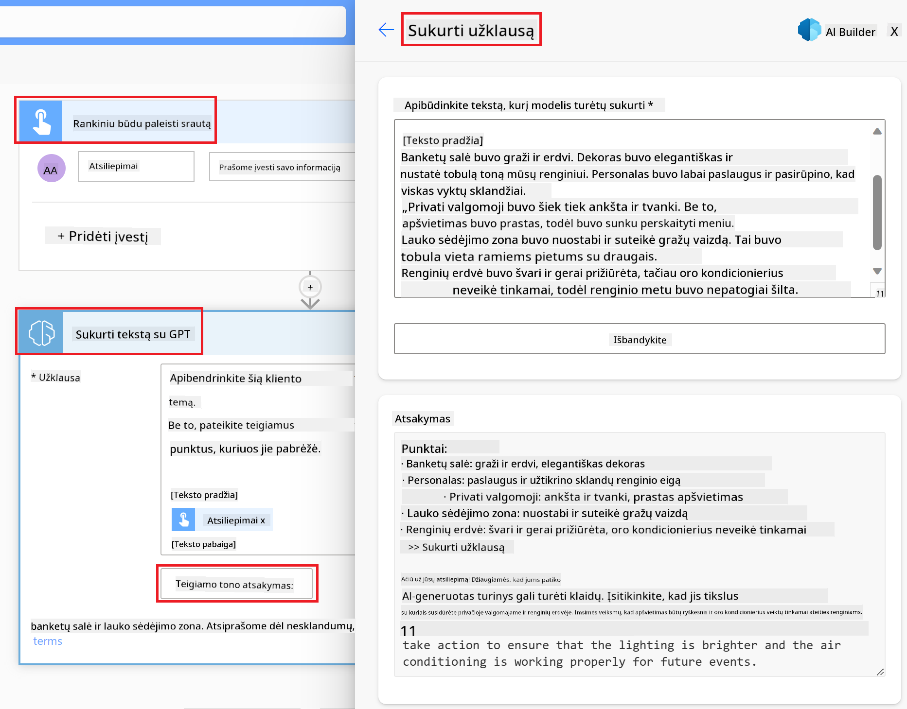

<!--
CO_OP_TRANSLATOR_METADATA:
{
  "original_hash": "f5ff3b6204a695a117d6f452403c95f7",
  "translation_date": "2025-08-25T12:35:30+00:00",
  "source_file": "10-building-low-code-ai-applications/README.md",
  "language_code": "lt"
}
-->
# Kuriame mažo kodo AI programas

> _(Paspauskite paveikslėlį aukščiau, kad peržiūrėtumėte šios pamokos vaizdo įrašą)_

## Įvadas

Dabar, kai jau išmokome kurti vaizdus generuojančias programas, pakalbėkime apie mažą kodą. Generatyvinis AI gali būti naudojamas įvairiose srityse, įskaitant mažą kodą, bet kas yra mažas kodas ir kaip galime į jį įtraukti AI?

Programų ir sprendimų kūrimas tapo lengvesnis tiek tradiciniams programuotojams, tiek neturintiems programavimo patirties, naudojant mažo kodo kūrimo platformas. Mažo kodo platformos leidžia kurti programas ir sprendimus su minimaliu arba visai be kodo. Tai pasiekiama suteikiant vizualią kūrimo aplinką, kurioje galima vilkti ir mesti komponentus, kad sukurtumėte programas ir sprendimus. Tai leidžia kurti greičiau ir su mažesniais resursais. Šioje pamokoje gilinsimės, kaip naudotis mažo kodo galimybėmis ir kaip jas sustiprinti AI pagalba naudojant Power Platform.

Power Platform suteikia organizacijoms galimybę įgalinti savo komandas kurti sprendimus intuityvioje mažo arba be kodo aplinkoje. Ši aplinka supaprastina sprendimų kūrimo procesą. Su Power Platform sprendimus galima sukurti per kelias dienas ar savaites, o ne mėnesius ar metus. Power Platform sudaro penki pagrindiniai produktai: Power Apps, Power Automate, Power BI, Power Pages ir Copilot Studio.

Šioje pamokoje aptarsime:

- Generatyvinio AI pristatymas Power Platform
- Copilot pristatymas ir kaip juo naudotis
- Generatyvinio AI naudojimas programoms ir srautams kurti Power Platform
- AI modelių Power Platform supratimas su AI Builder

## Mokymosi tikslai

Šios pamokos pabaigoje gebėsite:

- Suprasti, kaip Copilot veikia Power Platform.

- Sukurti Studentų užduočių stebėjimo programėlę mūsų švietimo startuoliui.

- Sukurti Sąskaitų apdorojimo srautą, kuris naudoja AI informacijai iš sąskaitų išgauti.

- Taikyti gerąsias praktikas naudojant Create Text with GPT AI modelį.

Šioje pamokoje naudosite šiuos įrankius ir technologijas:

- **Power Apps** – Studentų užduočių stebėjimo programėlei, kuri suteikia mažo kodo aplinką programoms kurti, duomenims sekti, valdyti ir su jais sąveikauti.

- **Dataverse** – duomenų saugojimui Studentų užduočių stebėjimo programėlei, kur Dataverse suteiks mažo kodo duomenų platformą programos duomenims laikyti.

- **Power Automate** – Sąskaitų apdorojimo srautui, kur turėsite mažo kodo aplinką darbo srautams kurti ir sąskaitų apdorojimo procesui automatizuoti.

- **AI Builder** – Sąskaitų apdorojimo AI modeliui, kur naudosite iš anksto paruoštus AI modelius mūsų startuolio sąskaitoms apdoroti.

## Generatyvinis AI Power Platform

Mažo kodo kūrimo ir programų stiprinimas generatyviniu AI yra viena iš pagrindinių Power Platform krypčių. Tikslas – suteikti galimybę visiems kurti AI pagrįstas programas, svetaines, ataskaitų lentas ir automatizuoti procesus su AI, _nereikalaujant duomenų mokslo žinių_. Tai pasiekiama integruojant generatyvinį AI į mažo kodo kūrimo patirtį Power Platform, naudojant Copilot ir AI Builder.

### Kaip tai veikia?

Copilot yra AI asistentas, leidžiantis kurti Power Platform sprendimus aprašant savo poreikius natūralia kalba, žingsnis po žingsnio. Pavyzdžiui, galite nurodyti AI asistentui, kokius laukus naudos jūsų programa, ir jis sukurs tiek pačią programą, tiek duomenų modelį, arba galite aprašyti, kaip sukurti srautą Power Automate.

Copilot funkcijas galite įtraukti kaip programos ekrano funkciją, kad naudotojai galėtų gauti įžvalgų per pokalbius.

AI Builder – tai mažo kodo AI galimybė Power Platform, leidžianti naudoti AI modelius procesams automatizuoti ir rezultatams prognozuoti. Su AI Builder galite įtraukti AI į savo programas ir srautus, kurie jungiasi prie jūsų duomenų Dataverse ar įvairiuose debesijos šaltiniuose, pvz., SharePoint, OneDrive ar Azure.

Copilot yra prieinamas visuose Power Platform produktuose: Power Apps, Power Automate, Power BI, Power Pages ir Power Virtual Agents. AI Builder galima naudoti Power Apps ir Power Automate. Šioje pamokoje susitelksime į tai, kaip naudoti Copilot ir AI Builder Power Apps ir Power Automate, kad sukurtume sprendimą mūsų švietimo startuoliui.

### Copilot Power Apps

Power Platform dalis – Power Apps – suteikia mažo kodo aplinką programoms kurti, duomenims sekti, valdyti ir su jais sąveikauti. Tai programų kūrimo paslaugų rinkinys su plečiama duomenų platforma ir galimybe jungtis prie debesijos paslaugų bei vietinių duomenų. Power Apps leidžia kurti programas, veikiančias naršyklėse, planšetėse ir telefonuose, ir dalintis jomis su kolegomis. Power Apps supaprastina programų kūrimą su paprasta sąsaja, kad kiekvienas verslo naudotojas ar profesionalus programuotojas galėtų kurti individualias programas. Programų kūrimo patirtį taip pat pagerina generatyvinis AI per Copilot.

Copilot AI asistento funkcija Power Apps leidžia aprašyti, kokios programos jums reikia ir kokią informaciją norite joje sekti, rinkti ar rodyti. Copilot tada sugeneruoja reaguojančią Canvas programą pagal jūsų aprašymą. Vėliau galite ją pritaikyti pagal savo poreikius. AI Copilot taip pat sugeneruoja ir pasiūlo Dataverse lentelę su laukais, kurių reikia jūsų duomenims saugoti, ir pavyzdiniais duomenimis. Vėliau šioje pamokoje aptarsime, kas yra Dataverse ir kaip ją naudoti Power Apps. Lentelę galite pritaikyti pagal savo poreikius naudodami AI Copilot asistento funkciją per pokalbius. Ši funkcija lengvai pasiekiama iš Power Apps pagrindinio ekrano.

### Copilot Power Automate

Power Platform dalis – Power Automate – leidžia naudotojams kurti automatizuotus darbo srautus tarp programų ir paslaugų. Tai padeda automatizuoti pasikartojančius verslo procesus, tokius kaip komunikacija, duomenų rinkimas ir sprendimų tvirtinimas. Paprasta sąsaja leidžia automatizuoti užduotis tiek pradedantiesiems, tiek patyrusiems programuotojams. Srautų kūrimo patirtį taip pat pagerina generatyvinis AI per Copilot.

Copilot AI asistento funkcija Power Automate leidžia aprašyti, kokio srauto jums reikia ir kokius veiksmus jis turi atlikti. Copilot tada sugeneruoja srautą pagal jūsų aprašymą. Vėliau galite jį pritaikyti pagal savo poreikius. AI Copilot taip pat sugeneruoja ir pasiūlo veiksmus, kurių reikia užduočiai automatizuoti. Vėliau šioje pamokoje aptarsime, kas yra srautai ir kaip juos naudoti Power Automate. Veiksmus galite pritaikyti pagal savo poreikius naudodami AI Copilot asistento funkciją per pokalbius. Ši funkcija lengvai pasiekiama iš Power Automate pagrindinio ekrano.

## Užduotis: Valdykite studentų užduotis ir sąskaitas mūsų startuolyje, naudodami Copilot

Mūsų startuolis teikia internetinius kursus studentams. Startuolis sparčiai auga ir dabar sunkiai spėja patenkinti kursų paklausą. Jie pasamdė jus kaip Power Platform kūrėją, kad padėtumėte sukurti mažo kodo sprendimą studentų užduotims ir sąskaitoms valdyti. Jų sprendimas turi padėti sekti ir valdyti studentų užduotis per programą ir automatizuoti sąskaitų apdorojimą per darbo srautą. Jūsų prašoma naudoti generatyvinį AI šiam sprendimui sukurti.

Pradėdami naudotis Copilot, galite pasinaudoti [Power Platform Copilot Prompt Library](https://github.com/pnp/powerplatform-prompts?WT.mc_id=academic-109639-somelezediko), kad susipažintumėte su užklausomis. Šioje bibliotekoje rasite užklausų, kurias galite naudoti programoms ir srautams kurti su Copilot. Taip pat galite pasisemti idėjų, kaip aprašyti savo poreikius Copilot.

### Sukurkite Studentų užduočių stebėjimo programėlę mūsų startuoliui

Mūsų startuolio dėstytojams sunku sekti studentų užduotis. Jie naudojo skaičiuoklę užduotims sekti, bet didėjant studentų skaičiui tai tapo sunku valdyti. Jie paprašė jūsų sukurti programą, kuri padėtų sekti ir valdyti studentų užduotis. Programa turi leisti pridėti naujas užduotis, peržiūrėti užduotis, atnaujinti ir ištrinti užduotis. Taip pat dėstytojai ir studentai turi galėti matyti, kurios užduotys jau įvertintos, o kurios dar ne.

Programą kursite naudodami Copilot Power Apps, vadovaudamiesi šiais žingsniais:

1. Eikite į [Power Apps](https://make.powerapps.com?WT.mc_id=academic-105485-koreyst) pagrindinį ekraną.

1. Naudokite pagrindinio ekrano teksto lauką, kad aprašytumėte, kokią programą norite sukurti. Pavyzdžiui, **_Noriu sukurti programą studentų užduotims sekti ir valdyti_**. Paspauskite **Siųsti** mygtuką, kad nusiųstumėte užklausą AI Copilot.

1. AI Copilot pasiūlys Dataverse lentelę su laukais, kurių reikia jūsų duomenims saugoti, ir pavyzdiniais duomenimis. Lentelę galite pritaikyti pagal savo poreikius naudodami AI Copilot asistento funkciją per pokalbius.

   > **Svarbu**: Dataverse yra pagrindinė duomenų platforma Power Platform. Tai mažo kodo duomenų platforma programos duomenims saugoti. Tai visiškai valdoma paslauga, kuri saugiai saugo duomenis Microsoft Cloud ir yra sukurta jūsų Power Platform aplinkoje. Ji turi įdiegtas duomenų valdymo galimybes, tokias kaip duomenų klasifikavimas, duomenų kilmė, detalus prieigos valdymas ir kt. Daugiau apie Dataverse galite sužinoti [čia](https://docs.microsoft.com/powerapps/maker/data-platform/data-platform-intro?WT.mc_id=academic-109639-somelezediko).

   

1. Dėstytojai nori siųsti el. laiškus studentams, kurie pateikė užduotis, kad informuotų juos apie užduočių eigą. Galite naudoti Copilot, kad pridėtumėte naują lauką studento el. paštui saugoti. Pavyzdžiui, galite naudoti tokią užklausą: **_Noriu pridėti stulpelį studento el. paštui saugoti_**. Paspauskite **Siųsti** mygtuką, kad nusiųstumėte užklausą AI Copilot.

1. AI Copilot sugeneruos naują lauką, kurį galėsite pritaikyti pagal savo poreikius.

1. Baigę kurti lentelę, paspauskite **Sukurti programą** mygtuką.

1. AI Copilot sugeneruos reaguojančią Canvas programą pagal jūsų aprašymą. Vėliau galėsite ją pritaikyti pagal savo poreikius.

1. Kad dėstytojai galėtų siųsti el. laiškus studentams, galite naudoti Copilot, kad pridėtumėte naują ekraną programoje. Pavyzdžiui, galite naudoti tokią užklausą: **_Noriu pridėti ekraną el. laiškams studentams siųsti_**. Paspauskite **Siųsti** mygtuką, kad nusiųstumėte užklausą AI Copilot.

1. AI Copilot sugeneruos naują ekraną, kurį galėsite pritaikyti pagal savo poreikius.

1. Baigę kurti programą, paspauskite **Išsaugoti** mygtuką.

1. Norėdami pasidalinti programa su dėstytojais, paspauskite **Bendrinti** mygtuką, tada dar kartą **Bendrinti**. Tuomet galėsite pasidalinti programa su dėstytojais įvesdami jų el. pašto adresus.

> **Jūsų namų darbas**: Sukurta programa – gera pradžia, bet ją galima patobulinti. Su el. pašto funkcija dėstytojai gali siųsti laiškus studentams tik rankiniu būdu, įvesdami jų el. paštus. Ar galite naudoti Copilot, kad sukurtumėte automatizavimą, kuris leistų dėstytojams siųsti laiškus studentams automatiškai, kai jie pateikia užduotis? Užuomina: su tinkama užklausa galite naudoti Copilot Power Automate tam sukurti.

### Sukurkite Sąskaitų informacijos lentelę mūsų startuoliui

Mūsų startuolio finansų komandai sunku sekti sąskaitas. Jie naudojo skaičiuoklę sąskaitoms sekti, bet didėjant sąskaitų skaičiui tai tapo sunku valdyti. Jie paprašė jūsų sukurti lentelę, kuri padėtų saugoti, sekti ir valdyti gautų sąskaitų informaciją. Lentelė bus naudojama automatizavimui, kuris ištrauks visą sąskaitų informaciją ir saugos ją lentelėje. Taip pat finansų komanda galės matyti, kurios sąskaitos apmokėtos, o kurios dar ne.

Power Platform turi pagrindinę duomenų platformą Dataverse, kuri leidžia saugoti programų ir sprendimų duomenis. Dataverse suteikia mažo kodo duomenų platformą programos duomenims saugoti. Tai visiškai valdoma paslauga, kuri saugiai saugo duomenis Microsoft Cloud ir yra sukurta jūsų Power Platform aplinkoje. Ji turi įdiegtas duomenų valdymo galimybes, tokias kaip duomenų klasifikavimas, duomenų kilmė, detalus prieigos valdymas ir kt. Daugiau [apie Dataverse skaitykite čia](https://docs.microsoft.com/powerapps/maker/data-platform/data-platform-intro?WT.mc_id=academic-109639-somelezediko).

Kodėl verta naudoti Dataverse mūsų startuoliui? Standartinės ir individualios lentelės Dataverse suteikia saugią ir debesijoje veikiančią duomenų saugojimo galimybę. Lentelės leidžia saugoti įvairių tipų duomenis, panašiai kaip naudojant kelis darbalapius viename Excel faile. Lenteles galite naudoti duomenims, kurie svarbūs jūsų organizacijai ar verslui, saugoti. Kai kurie privalumai, kuriuos mūsų startuolis gaus naudodamas Dataverse, bet jais neapsiribojant:
- **Lengva valdyti**: Metaduomenys ir duomenys saugomi debesyje, todėl jums nereikia rūpintis, kaip jie saugomi ar tvarkomi. Galite susitelkti į savo programų ir sprendimų kūrimą.

- **Saugumas**: Dataverse suteikia saugų ir debesyje pagrįstą duomenų saugojimo būdą. Galite kontroliuoti, kas turi prieigą prie jūsų lentelių duomenų ir kaip jie gali juos pasiekti, naudodami vaidmenimis pagrįstą saugumą.

- **Išsamūs metaduomenys**: Duomenų tipai ir ryšiai naudojami tiesiogiai Power Apps viduje.

- **Logika ir tikrinimas**: Galite naudoti verslo taisykles, skaičiuojamus laukus ir tikrinimo taisykles, kad užtikrintumėte verslo logiką ir duomenų tikslumą.

Dabar, kai žinote, kas yra Dataverse ir kodėl verta jį naudoti, pažiūrėkime, kaip galite pasitelkti Copilot, kad sukurtumėte lentelę Dataverse, atitinkančią mūsų finansų komandos poreikius.

> **Note** : Šią lentelę naudosite kitame skyriuje, kad sukurtumėte automatizavimą, kuris ištrauks visą sąskaitų faktūrų informaciją ir saugos ją lentelėje.

Norėdami sukurti lentelę Dataverse naudojant Copilot, atlikite šiuos veiksmus:

1. Eikite į [Power Apps](https://make.powerapps.com?WT.mc_id=academic-105485-koreyst) pagrindinį ekraną.

2. Kairėje navigacijos juostoje pasirinkite **Tables** ir spauskite **Describe the new Table**.

1. **Describe the new Table** ekrane naudokite teksto lauką, kad aprašytumėte, kokią lentelę norite sukurti. Pavyzdžiui, **_Noriu sukurti lentelę sąskaitų faktūrų informacijai saugoti_**. Spauskite **Send** mygtuką, kad išsiųstumėte užklausą AI Copilot.

1. AI Copilot pasiūlys Dataverse lentelę su laukais, kurių reikia jūsų duomenims saugoti, ir pateiks pavyzdinius duomenis. Tuomet galėsite pritaikyti lentelę pagal savo poreikius, naudodami AI Copilot asistento funkciją pokalbio žingsniais.

1. Finansų komanda nori išsiųsti el. laišką tiekėjui, kad informuotų apie dabartinę sąskaitos faktūros būseną. Galite naudoti Copilot, kad pridėtumėte naują lauką lentelėje tiekėjo el. paštui saugoti. Pavyzdžiui, galite naudoti tokią užklausą: **_Noriu pridėti stulpelį tiekėjo el. paštui saugoti_**. Spauskite **Send** mygtuką, kad išsiųstumėte užklausą AI Copilot.

1. AI Copilot sukurs naują lauką, kurį galėsite pritaikyti pagal savo poreikius.

1. Kai baigsite kurti lentelę, spauskite **Create** mygtuką, kad ją sukurtumėte.

## AI modeliai Power Platform su AI Builder

AI Builder – tai mažai kodo reikalaujanti AI galimybė Power Platform, leidžianti naudoti AI modelius procesų automatizavimui ir rezultatų prognozavimui. Su AI Builder galite įdiegti AI savo programose ir srautuose, kurie jungiasi prie duomenų Dataverse arba įvairiuose debesies duomenų šaltiniuose, tokiuose kaip SharePoint, OneDrive ar Azure.

## Paruošti AI modeliai ir individualūs AI modeliai

AI Builder siūlo dviejų tipų AI modelius: paruoštus AI modelius ir individualius AI modelius. Paruošti AI modeliai – tai iš anksto Microsoft apmokyti ir Power Platform prieinami modeliai. Jie leidžia pridėti išmanumo savo programoms ir srautams, nereikalaujant rinkti duomenų ir kurti, mokyti bei publikuoti savo modelių. Šiuos modelius galite naudoti procesų automatizavimui ir rezultatų prognozavimui.

Kai kurie Power Platform prieinami paruošti AI modeliai:

- **Raktinių frazių ištraukimas**: Šis modelis ištraukia raktines frazes iš teksto.
- **Kalbos atpažinimas**: Šis modelis nustato teksto kalbą.
- **Nuotaikos analizė**: Šis modelis nustato teigiamą, neigiamą, neutralią ar mišrią nuotaiką tekste.
- **Vizitinių kortelių skaitytuvas**: Šis modelis ištraukia informaciją iš vizitinių kortelių.
- **Teksto atpažinimas**: Šis modelis ištraukia tekstą iš vaizdų.
- **Objektų atpažinimas**: Šis modelis aptinka ir ištraukia objektus iš vaizdų.
- **Dokumentų apdorojimas**: Šis modelis ištraukia informaciją iš formų.
- **Sąskaitų faktūrų apdorojimas**: Šis modelis ištraukia informaciją iš sąskaitų faktūrų.

Naudodami individualius AI modelius galite įkelti savo modelį į AI Builder, kad jis veiktų kaip bet kuris AI Builder individualus modelis, leidžiantis mokyti modelį su savo duomenimis. Šiuos modelius galite naudoti procesų automatizavimui ir rezultatų prognozavimui tiek Power Apps, tiek Power Automate. Naudojant savo modelį galioja tam tikri apribojimai. Plačiau apie juos skaitykite [čia](https://learn.microsoft.com/ai-builder/byo-model#limitations?WT.mc_id=academic-105485-koreyst).

## Užduotis #2 – Sukurkite sąskaitų faktūrų apdorojimo srautą mūsų startuoliui

Finansų komanda susiduria su sunkumais apdorojant sąskaitas faktūras. Jie naudoja skaičiuoklę sąskaitoms sekti, tačiau didėjant sąskaitų skaičiui tai tapo sunkiai valdoma. Jie paprašė jūsų sukurti darbo eigą, kuri padėtų apdoroti sąskaitas faktūras naudojant AI. Darbo eiga turi leisti ištraukti informaciją iš sąskaitų faktūrų ir saugoti ją Dataverse lentelėje. Taip pat turi būti galimybė išsiųsti el. laišką finansų komandai su ištraukta informacija.

Dabar, kai žinote, kas yra AI Builder ir kodėl verta jį naudoti, pažiūrėkime, kaip galite pasitelkti AI Builder sąskaitų faktūrų apdorojimo AI modelį, apie kurį kalbėjome anksčiau, kad sukurtumėte darbo eigą, padėsiančią finansų komandai apdoroti sąskaitas faktūras.

Norėdami sukurti darbo eigą, kuri padės finansų komandai apdoroti sąskaitas faktūras naudojant AI Builder sąskaitų faktūrų apdorojimo AI modelį, atlikite šiuos veiksmus:

1. Eikite į [Power Automate](https://make.powerautomate.com?WT.mc_id=academic-105485-koreyst) pagrindinį ekraną.

2. Pagrindiniame ekrane teksto laukelyje aprašykite, kokią darbo eigą norite sukurti. Pavyzdžiui, **_Apdoroti sąskaitą faktūrą, kai ji pasiekia mano pašto dėžutę_**. Spauskite **Send** mygtuką, kad išsiųstumėte užklausą AI Copilot.

   

3. AI Copilot pasiūlys veiksmus, kuriuos reikia atlikti norint automatizuoti užduotį. Spauskite **Next** mygtuką, kad pereitumėte prie kitų žingsnių.

4. Kitame žingsnyje Power Automate paprašys nustatyti reikalingus srauto ryšius. Kai baigsite, spauskite **Create flow** mygtuką, kad sukurtumėte srautą.

5. AI Copilot sugeneruos srautą, kurį galėsite pritaikyti pagal savo poreikius.

6. Atnaujinkite srauto trigerį ir nustatykite **Folder** į aplanką, kuriame bus saugomos sąskaitos faktūros. Pavyzdžiui, galite nustatyti aplanką **Inbox**. Spauskite **Show advanced options** ir nustatykite **Only with Attachments** į **Yes**. Taip užtikrinsite, kad srautas veiks tik gavus el. laišką su priedu nurodytame aplanke.

7. Pašalinkite šiuos veiksmus iš srauto: **HTML to text**, **Compose**, **Compose 2**, **Compose 3** ir **Compose 4**, nes jų nenaudosite.

8. Pašalinkite **Condition** veiksmą iš srauto, nes jo nenaudosite. Srautas turėtų atrodyti kaip šioje ekrano nuotraukoje:

   

9. Spauskite **Add an action** mygtuką ir ieškokite **Dataverse**. Pasirinkite **Add a new row** veiksmą.

10. **Extract Information from invoices** veiksme atnaujinkite **Invoice File**, kad būtų nurodytas **Attachment Content** iš el. laiško. Taip užtikrinsite, kad srautas ištrauks informaciją iš sąskaitos faktūros priedo.

11. Pasirinkite anksčiau sukurtą **Table**. Pavyzdžiui, galite pasirinkti **Invoice Information** lentelę. Pasirinkite dinaminį turinį iš ankstesnio veiksmo, kad užpildytumėte šiuos laukus:

    - ID
    - Suma
    - Data
    - Pavadinimas
    - Būsena – nustatykite **Status** į **Pending**.
    - Tiekėjo el. paštas – naudokite **From** dinaminį turinį iš **When a new email arrives** trigerio.

    

12. Kai baigsite kurti srautą, spauskite **Save** mygtuką, kad jį išsaugotumėte. Tuomet galite išbandyti srautą, atsiųsdami el. laišką su sąskaita faktūra į aplanką, kurį nurodėte trigerio nustatymuose.

> **Your homework**: Sukurtas srautas – puiki pradžia, dabar pagalvokite, kaip galite sukurti automatizavimą, kuris leistų mūsų finansų komandai išsiųsti el. laišką tiekėjui, informuojant jį apie dabartinę sąskaitos faktūros būseną. Užduoties užuomina: srautas turi veikti, kai pasikeičia sąskaitos faktūros būsena.

## Naudokite teksto generavimo AI modelį Power Automate

Create Text with GPT AI modelis AI Builder leidžia generuoti tekstą pagal užklausą ir veikia su Microsoft Azure OpenAI Service. Ši galimybė leidžia integruoti GPT (Generative Pre-Trained Transformer) technologiją į savo programas ir srautus, kad kurtumėte įvairius automatizuotus srautus ir išmanias programas.

GPT modeliai yra intensyviai mokomi su dideliais duomenų kiekiais, todėl gali generuoti tekstą, labai panašų į žmogaus kalbą, kai pateikiama užklausa. Integravus su darbo eigos automatizavimu, tokie AI modeliai kaip GPT gali būti naudojami įvairių užduočių supaprastinimui ir automatizavimui.

Pavyzdžiui, galite kurti srautus, kurie automatiškai generuoja tekstą įvairiems poreikiams, pvz.: el. laiškų juodraščiai, produktų aprašymai ir kt. Taip pat galite naudoti modelį tekstui generuoti įvairioms programoms, pvz., pokalbių robotams ir klientų aptarnavimo programoms, kurios leidžia agentams efektyviai ir greitai atsakyti į klientų užklausas.

Norėdami sužinoti, kaip naudoti šį AI modelį Power Automate, peržiūrėkite [Add intelligence with AI Builder and GPT](https://learn.microsoft.com/training/modules/ai-builder-text-generation/?WT.mc_id=academic-109639-somelezediko) modulį.

## Puikus darbas! Tęskite mokymąsi

Baigę šią pamoką, peržiūrėkite mūsų [Generative AI Learning collection](https://aka.ms/genai-collection?WT.mc_id=academic-105485-koreyst), kad toliau gilintumėte žinias apie generatyvinį AI!

Eikite į 11 pamoką, kurioje nagrinėsime, kaip [integruoti generatyvinį AI su funkcijų iškvietimu](../11-integrating-with-function-calling/README.md?WT.mc_id=academic-105485-koreyst)!

---

**Atsakomybės atsisakymas**:  
Šis dokumentas buvo išverstas naudojant dirbtinio intelekto vertimo paslaugą [Co-op Translator](https://github.com/Azure/co-op-translator). Nors siekiame tikslumo, prašome atkreipti dėmesį, kad automatiniai vertimai gali turėti klaidų ar netikslumų. Originalus dokumentas jo gimtąja kalba turėtų būti laikomas autoritetingu šaltiniu. Svarbios informacijos atveju rekomenduojame profesionalų žmogaus vertimą. Mes neatsakome už nesusipratimus ar neteisingą interpretavimą, kilusį dėl šio vertimo naudojimo.