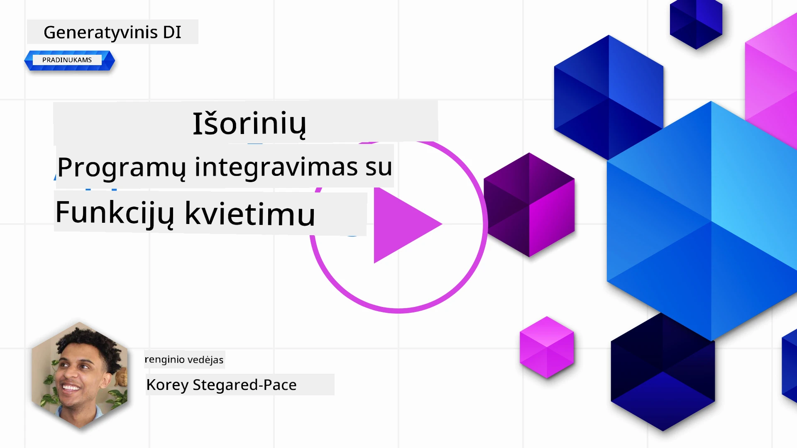
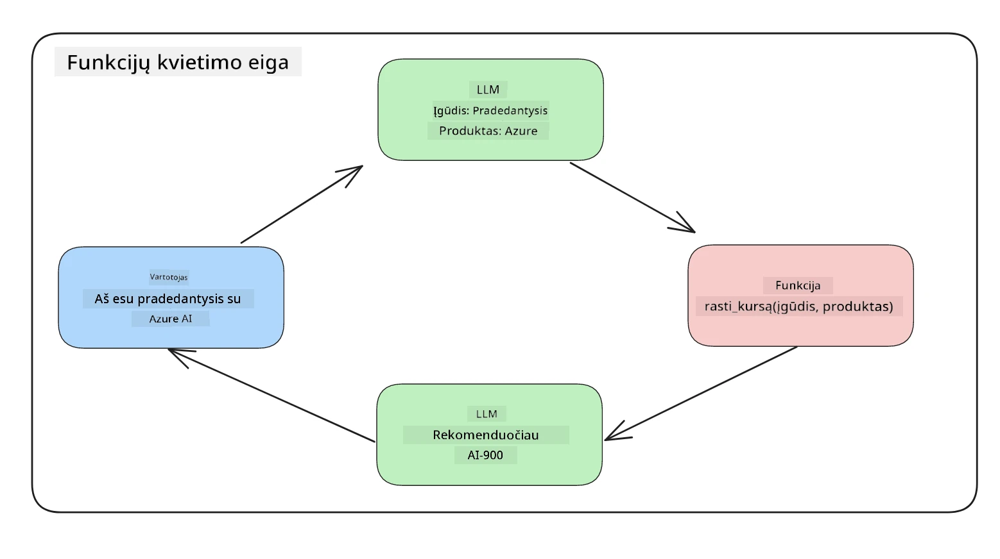
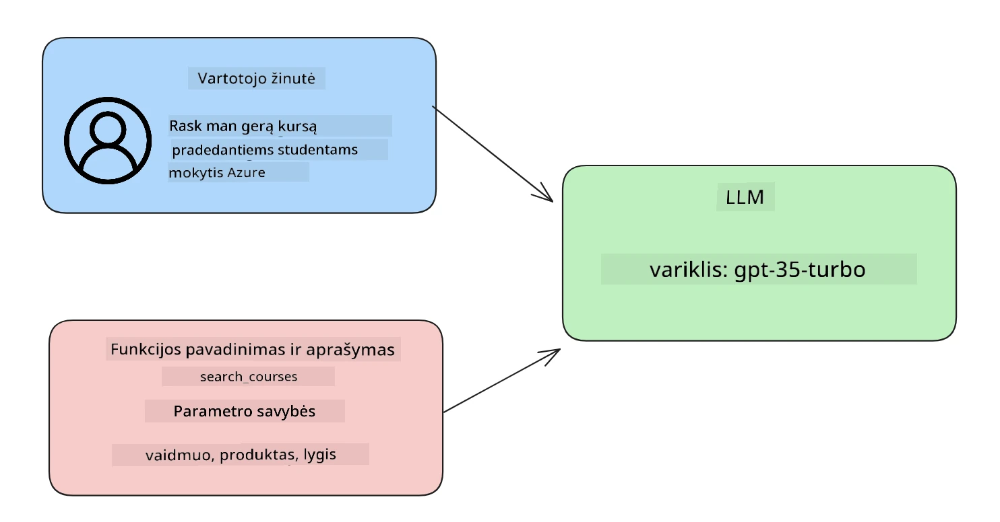

# Integracija su funkcijų kvietimais

[](https://youtu.be/DgUdCLX8qYQ?si=f1ouQU5HQx6F8Gl2)

Iki šiol ankstesnėse pamokose išmokote gana daug. Tačiau galime tobulėti dar labiau. Kai kuriuos dalykus galime spręsti, kad gautume nuoseklesnį atsakymų formatą, kuris palengvintų darbą su atsakymu toliau. Taip pat galime norėti pridėti duomenų iš kitų šaltinių, kad dar labiau praturtintume mūsų programą.

Aukščiau minėti iššūkiai yra tai, ką šiame skyriuje siekiama spręsti.

## Įvadas

Ši pamoka aptars:

- Paaiškinti, kas yra funkcijų kvietimas ir kur jis taikomas.
- Kaip sukurti funkcijos kvietimą naudojant Azure OpenAI.
- Kaip integruoti funkcijos kvietimą į programą.

## Mokymosi tikslai

Pamokos pabaigoje jūs sugebėsite:

- Paaiškinti funkcijų kvietimo paskirtį.
- Sukonfigūruoti funkcijos kvietimą naudojant Azure OpenAI paslaugą.
- Suplanuoti veiksmingus funkcijų kvietimus pagal savo programos naudojimo atvejį.

## Scenario: Tobuliname mūsų pokalbių robotą su funkcijomis

Šiai pamokai norime sukurti funkciją mūsų švietimo startuoliui, leidžiančią vartotojams naudotis pokalbių robotu, ieškant techninių kursų. Rekomenduosime kursus, atitinkančius jų įgūdžių lygį, esamą vaidmenį ir dominančią technologiją.

Šiam scenarijui įgyvendinti naudosime kombinaciją:

- `Azure OpenAI`, kad sukurtume pokalbių patirtį vartotojui.
- `Microsoft Learn Catalog API`, padėti vartotojams rasti kursus pagal jų užklausas.
- `Funkcijų kvietimą`, kad gautume vartotojo užklausą ir nusiųstume ją funkcijai atlikti API užklausą.

Kad pradėtume, pažiūrėkime, kodėl iš viso norėtume naudoti funkcijų kvietimą:

## Kodėl funkcijų kvietimas

Prieš funkcijų kvietimą, atsakymai iš LLM buvo nestruktūruoti ir nesuderinti. Programuotojai turėjo rašyti sudėtingą patikros kodą, kad galėtų apdoroti kiekvieną atsakymo variantą. Vartotojai negalėjo gauti atsakymų į klausimus, pvz., „Koks šiuo metu oras Stokholme?“. Tai buvo dėl to, kad modeliai turėjo apribojimą pagal mokymo duomenų laiką.

Funkcijų kvietimas yra Azure OpenAI paslaugos funkcija, skirta įveikti šias ribas:

- **Nuoseklus atsakymo formatas**. Jei galime geriau kontroliuoti atsakymo formatą, galime lengviau integruoti atsakymą į kitų sistemų veikimą.
- **Išoriniai duomenys**. Galimybė naudoti duomenis iš kitų programos šaltinių pokalbio kontekste.

## Problemos iliustracija per scenarijų

> Rekomenduojame naudoti [įtrauktą užrašų knygelę](./python/aoai-assignment.ipynb?WT.mc_id=academic-105485-koreyst), jei norite paleisti toliau pateiktą scenarijų. Taip pat galite tiesiog skaityti toliau, nes stengiamės iliustruoti problemą, kurią funkcijos gali padėti išspręsti.

Pažiūrėkime pavyzdį, iliustruojantį atsakymo formato problemą:

Tarkime, norime sukurti studentų duomenų bazę, kad galėtume jiems pasiūlyti tinkamą kursą. Žemiau pateikiamos dvi studentų aprašymų versijos, kurios yra labai panašios savo duomenų turiniu.

1. Sukurkite ryšį su mūsų Azure OpenAI ištekliais:

   ```python
   import os
   import json
   from openai import OpenAI
   from dotenv import load_dotenv
   load_dotenv()

   # Atsakymų API teikiama iš Azure OpenAI (Microsoft Foundry) v1
   # pabaigos taško, todėl mes nurodome OpenAI klientą į <your-endpoint>/openai/v1/.
   endpoint = os.environ['AZURE_OPENAI_ENDPOINT']
   client = OpenAI(
   api_key=os.environ['AZURE_OPENAI_API_KEY'],
   base_url=f"{endpoint.rstrip('/')}/openai/v1/",
   )

   deployment=os.environ['AZURE_OPENAI_DEPLOYMENT']
   ```

   Žemiau pateiktas Python kodas konfigūruoja ryšį su Azure OpenAI. Kadangi naudojame v1 galinį tašką, reikia nustatyti tik `api_key` ir `base_url` (nereikia `api_version`).

1. Sukurkite du studentų aprašymus kintamuosiuose `student_1_description` ir `student_2_description`.

   ```python
   student_1_description="Emily Johnson is a sophomore majoring in computer science at Duke University. She has a 3.7 GPA. Emily is an active member of the university's Chess Club and Debate Team. She hopes to pursue a career in software engineering after graduating."

   student_2_description = "Michael Lee is a sophomore majoring in computer science at Stanford University. He has a 3.8 GPA. Michael is known for his programming skills and is an active member of the university's Robotics Club. He hopes to pursue a career in artificial intelligence after finishing his studies."
   ```

   Norime siųsti aukščiau pateiktus studentų aprašymus į LLM, kad jis išskaitų duomenis. Šie duomenys vėliau gali būti naudojami mūsų programoje ir siunčiami į API arba saugomi duomenų bazėje.

1. Sukurkime du identiškus prašymus, kuriuose nurodome LLM, kokią informaciją norime gauti:

   ```python
   prompt1 = f'''
   Please extract the following information from the given text and return it as a JSON object:

   name
   major
   school
   grades
   club

   This is the body of text to extract the information from:
   {student_1_description}
   '''

   prompt2 = f'''
   Please extract the following information from the given text and return it as a JSON object:

   name
   major
   school
   grades
   club

   This is the body of text to extract the information from:
   {student_2_description}
   '''
   ```

   Aukščiau pateikti prašymai nurodo LLM išgauti informaciją ir grąžinti atsakymą JSON formatu.

1. Sukonfigūravus prašymus ir ryšį su Azure OpenAI, dabar siųsime prašymus LLM naudodami `client.responses.create`. Užklausą saugome kintamajame `input` ir priskiriame vaidmenį `user`. Tai imituoja žinutę vartotojo, siunčiamą pokalbių robotui.

   ```python
   # atsakymas iš pirmo užklausimo
   openai_response1 = client.responses.create(
   model=deployment,
   input = [{'role': 'user', 'content': prompt1}],
   store=False,
   )
   openai_response1.output_text

   # atsakymas iš antro užklausimo
   openai_response2 = client.responses.create(
   model=deployment,
   input = [{'role': 'user', 'content': prompt2}],
   store=False,
   )
   openai_response2.output_text
   ```

Dabar galime išsiųsti abu prašymus LLM ir patikrinti gautus atsakymus, juos radę kaip `openai_response1.output_text`.

1. Galiausiai galime paversti atsakymą JSON formatu, kviesdami `json.loads`:

   ```python
   # Įkeliama atsakymas kaip JSON objektas
   json_response1 = json.loads(openai_response1.output_text)
   json_response1
   ```

   Atsakymas 1:

   ```json
   {
     "name": "Emily Johnson",
     "major": "computer science",
     "school": "Duke University",
     "grades": "3.7",
     "club": "Chess Club"
   }
   ```

   Atsakymas 2:

   ```json
   {
     "name": "Michael Lee",
     "major": "computer science",
     "school": "Stanford University",
     "grades": "3.8 GPA",
     "club": "Robotics Club"
   }
   ```

   Nors prašymai yra tokie patys ir aprašymai panašūs, matome, kad `Grades` savybės reikšmės formatuojamos skirtingai, pvz., kartais gauname formatą `3.7`, o kartais `3.7 GPA`.

   Šis rezultatas atsiranda todėl, kad LLM turi nestruktūruotą duomenų įvestį žodiniu prašymu ir taip pat grąžina nestruktūruotus duomenis. Reikia turėti struktūruotą formatą, kad žinotume, ko tikėtis saugant ar naudojant šiuos duomenis.

Taigi, kaip išspręsti formatavimo problemą? Naudodami funkcijų kvietimą, galime užtikrinti, kad gauname struktūruotus duomenis. Naudojant funkcijų kvietimą, LLM iš tiesų nekviečia ar nevykdo jokios funkcijos. Vietoje to sukuriame struktūrą, kurios LLM turi laikytis savo atsakymuose. Tuomet naudojame tuos struktūruotus atsakymus, kad žinotume, kokią funkciją vykdyti mūsų programose.



Tuomet galime pasiimti tai, ką grąžino funkcija, ir nusiųsti atgal LLM. LLM atsakys natūralia kalba, atsakydamas į vartotojo užklausą.

## Funkcijų kvietimų taikymo sritys

Yra daugybė skirtingų situacijų, kur funkcijų kvietimai gali pagerinti jūsų programą, pvz.:

- **Išorinių įrankių kvietimas**. Pokalbių robotai puikiai teikia atsakymus į vartotojų klausimus. Naudodami funkcijų kvietimą, pokalbių robotai gali naudoti vartotojų žinutes tam tikriems uždaviniams atlikti. Pavyzdžiui, studentas gali paprašyti pokalbių roboto „Nusiųsti el. laišką mano dėstytojui, kad man reikia daugiau pagalbos šioje temoje“. Tai gali sukelti funkcijos kvietimą `send_email(to: string, body: string)`.

- **Kurti API ar duomenų bazės užklausas**. Vartotojai gali rasti informaciją naudodami natūralią kalbą, kuri paverčiama į suformatuotą užklausą ar API užklausą. Pavyzdys galėtų būti mokytojas, kuris klausia „Kas yra studentai, kurie įvykdė paskutinį užduotį“ ir tai gali iškviesti funkciją `get_completed(student_name: string, assignment: int, current_status: string)`.

- **Struktūruotų duomenų kūrimas**. Vartotojai gali paimti teksto bloką ar CSV ir naudoti LLM svarbios informacijos išgavimui. Pavyzdžiui, studentas gali perrašyti Wikipedijos straipsnį apie taikos sutartis, kad sukurtų AI flashcards. Tai galima padaryti naudojant funkciją `get_important_facts(agreement_name: string, date_signed: string, parties_involved: list)`.

## Kaip sukurti pirmąjį funkcijos kvietimą

Funkcijos kvietimo kūrimo procesas susideda iš 3 pagrindinių žingsnių:

1. **Kvietimas** į Responses API su jūsų funkcijų (įrankių) sąrašu ir vartotojo žinute.
2. **Atsakymo skaitymas** iš modelio, kad būtų atliktas veiksmas, t.y. vykdyti funkciją ar API kvietimą.
3. **Kitas kvietimas** į Responses API su funkcijos atsakymu, kad šią informaciją panaudotume atsakymo vartotojui kūrimui.



### 1 Žingsnis – žinučių kūrimas

Pirmasis žingsnis – sukurti vartotojo žinutę. Tai gali būti dinamiškai priskirta paimant tekstinio įvesties lauko reikšmę arba galite priskirti čia. Jei dirbate su Responses API pirmą kartą, turime apibrėžti žinutės `role` ir `content`.

`role` gali būti `system` (kuria taisykles), `assistant` (modelis) arba `user` (galutinis vartotojas). Funkcijų kvietimui priskirsime `user` ir pavyzdinį klausimą.

```python
messages= [ {"role": "user", "content": "Find me a good course for a beginner student to learn Azure."} ]
```

Priskiriant skirtingus vaidmenis LLM aišku, ar tai sistema kalba, ar vartotojas, kas padeda kurti pokalbio istoriją, į kurią LLM gali atsižvelgti.

### 2 Žingsnis – funkcijų kūrimas

Toliau apibrėšime funkciją ir jos parametrus. Naudosime tik vieną funkciją pavadinimu `search_courses`, tačiau galite sukurti kelias funkcijas.

> **Svarbu**: Funkcijos įtraukiamos į sistemos žinutę LLM ir įskaičiuojamos į turimų žetonų kiekį.

Žemiau sukuriame funkcijas kaip elementų masyvą. Kiekvienas elementas yra įrankis Responses API formatu, turintis ypatybes `type`, `name`, `description` ir `parameters`:

```python
functions = [
   {
      "type":"function",
      "name":"search_courses",
      "description":"Retrieves courses from the search index based on the parameters provided",
      "parameters":{
         "type":"object",
         "properties":{
            "role":{
               "type":"string",
               "description":"The role of the learner (i.e. developer, data scientist, student, etc.)"
            },
            "product":{
               "type":"string",
               "description":"The product that the lesson is covering (i.e. Azure, Power BI, etc.)"
            },
            "level":{
               "type":"string",
               "description":"The level of experience the learner has prior to taking the course (i.e. beginner, intermediate, advanced)"
            }
         },
         "required":[
            "role"
         ]
      }
   }
]
```

Žemiau aprašome kiekvieną funkcijos pavyzdį detaliau:

- `name` - funkcijos pavadinimas, kurį norime kviesti.
- `description` - aprašymas, kaip veikia funkcija. Čia svarbu būti tikslams ir aiškiems.
- `parameters` - reikšmių ir formato sąrašas, kurį norite, kad modelis pateiktų atsakyme. Parameter masyvas turi elementus, kurie turi šias savybes:
  1.  `type` - savybės duomenų tipas.
  1.  `properties` - specifinių vertybių sąrašas, kurias modelis naudos atsakymui
      1. `name` - raktas, tai yra savybės pavadinimas, kurį modelis naudos suformatuotame atsakyme, pvz., `product`.
      1. `type` - šios savybės duomenų tipas, pvz., `string`.
      1. `description` - specifinės savybės aprašymas.

Taip pat yra neprivaloma savybė `required` – reikalinga savybė, kad funkcijos kvietimas būtų vykdomas sėkmingai.

### 3 Žingsnis – funkcijos kvietimo vykdymas

Apibrėžus funkciją, dabar ją reikia įtraukti į kvietimą Responses API. Tai daroma pridedant `tools` į užklausą. Šiuo atveju `tools=functions`.

Taip pat yra galimybė nustatyti `tool_choice` reikšmei `auto`. Tai leidžia LLM nuspręsti, kurią funkciją kviesti, remiantis vartotojo žinute, o ne nustatant tai patiems.

Žemiau pateiktas kodas, kuriame kviečiame `client.responses.create`, atkreipkite dėmesį, kaip nustatome `tools=functions` ir `tool_choice="auto"`, taip suteikdami LLM pasirinkimą, kada kviesti mūsų pateiktas funkcijas:

```python
response = client.responses.create(model=deployment,
                                        input=messages,
                                        tools=functions,
                                        tool_choice="auto",
                                        store=False)

print(response.output)
```

Grįžtantis atsakymas dabar turi `function_call` elementą `response.output`, kuris atrodo taip:

```json
{
  "type": "function_call",
  "name": "search_courses",
  "call_id": "call_abc123",
  "arguments": "{\n  \"role\": \"student\",\n  \"product\": \"Azure\",\n  \"level\": \"beginner\"\n}"
}
```

Čia matome, kaip buvo iškviesta funkcija `search_courses` ir su kokiais argumentais, pateiktais `arguments` savybėje JSON atsakyme.

Išvada: LLM sugebėjo rasti duomenis, atitinkančius funkcijos argumentus, nes juos ištraukė iš vertės, pateiktos `input` parametro užklausoje Responses API. Žemiau priminimas apie `messages` reikšmę:

```python
messages= [ {"role": "user", "content": "Find me a good course for a beginner student to learn Azure."} ]
```

Kaip matote, `student`, `Azure` ir `beginner` buvo išgauti iš `messages` ir nustatyti kaip įvestis funkcijai. Tokiu būdu naudojant funkcijas puiku išgauti informaciją iš prompto, suteikti struktūrą LLM ir turėti pernaudojamą funkcionalumą.

Toliau pažiūrėsime, kaip tai galime naudoti mūsų programoje.

## Funkcijų kvietimų integravimas į programą

Išbandžius struktūruotą atsakymą iš LLM, dabar galime integruoti tai į programą.

### Valdyti srautą

Norėdami integruoti tai į programą, atlikime šiuos veiksmus:

1. Pirmiausia atlikime kvietimą į OpenAI paslaugas ir ištraukime funkcijos kvietimo elementus iš atsakymo `output`.

   ```python
   response_items = response.output
   tool_calls = [item for item in response_items if item.type == "function_call"]
   ```

1. Dabar apibrėšime funkciją, kuri kvies Microsoft Learn API, kad gautume kursų sąrašą:

   ```python
   import requests

   def search_courses(role, product, level):
     url = "https://learn.microsoft.com/api/catalog/"
     params = {
        "role": role,
        "product": product,
        "level": level
     }
     response = requests.get(url, params=params)
     modules = response.json()["modules"]
     results = []
     for module in modules[:5]:
        title = module["title"]
        url = module["url"]
        results.append({"title": title, "url": url})
     return str(results)
   ```

   Atkreipkite dėmesį, kaip sukūrėme tikrą Python funkciją, atitinkančią `functions` kintamajame nurodytus funkcijų pavadinimus. Taip pat darome tikrus išorinius API kvietimus, kad gautume reikiamus duomenis. Šiuo atveju kreipiamės į Microsoft Learn API ieškoti mokymo modulių.

Taigi, sukūrėme `functions` kintamąjį ir atitinkamą Python funkciją, kaip pasakyti LLM, kaip susieti šiuos du dalykus, kad mūsų Python funkcija būtų iškviesta?

1. Norėdami patikrinti, ar reikia kviesti Python funkciją, turime žiūrėti į LLM atsakymą, ar yra `function_call` elementas, ir iškviesti nurodytą funkciją. Žemiau matote, kaip tai galima padaryti:

   ```python
   # Patikrinkite, ar modelis nori iškviesti funkciją
   if tool_calls:
    for tool_call in tool_calls:
     print("Recommended Function call:")
     print(tool_call.name)
     print()

     # Iškvieskite funkciją.
     function_name = tool_call.name

     available_functions = {
             "search_courses": search_courses,
     }
     function_to_call = available_functions[function_name]

     function_args = json.loads(tool_call.arguments)
     function_response = function_to_call(**function_args)

     print("Output of function call:")
     print(function_response)
     print(type(function_response))

     # Pridėkite funkcijos kvietimą ir jo rezultatą atgal į pokalbį.
     # Modelio function_call elementas turi būti pridėtas prieš jo išvestį.
     messages.append(tool_call)  # asistento function_call elementas
     messages.append( # funkcijos rezultatas
         {
             "type": "function_call_output",
             "call_id": tool_call.call_id,
             "output": function_response,
         }
     )
   ```

   Šios trys eilutės užtikrina, kad ištrauksime funkcijos pavadinimą, argumentus ir iškviesime funkciją:

   ```python
   function_to_call = available_functions[function_name]

   function_args = json.loads(tool_call.arguments)
   function_response = function_to_call(**function_args)
   ```

   Žemiau pateikiamas rezultatas, paleidus mūsų kodą:

**Rezultatas**

   ```Recommended Function call:
   {
     "name": "search_courses",
     "arguments": "{\n  \"role\": \"student\",\n  \"product\": \"Azure\",\n  \"level\": \"beginner\"\n}"
   }

   Output of function call:
   [{'title': 'Describe concepts of cryptography', 'url': 'https://learn.microsoft.com/training/modules/describe-concepts-of-cryptography/?
   WT.mc_id=api_CatalogApi'}, {'title': 'Introduction to audio classification with TensorFlow', 'url': 'https://learn.microsoft.com/en-
   us/training/modules/intro-audio-classification-tensorflow/?WT.mc_id=api_CatalogApi'}, {'title': 'Design a Performant Data Model in Azure SQL
   Database with Azure Data Studio', 'url': 'https://learn.microsoft.com/training/modules/design-a-data-model-with-ads/?
   WT.mc_id=api_CatalogApi'}, {'title': 'Getting started with the Microsoft Cloud Adoption Framework for Azure', 'url':
   'https://learn.microsoft.com/training/modules/cloud-adoption-framework-getting-started/?WT.mc_id=api_CatalogApi'}, {'title': 'Set up the
   Rust development environment', 'url': 'https://learn.microsoft.com/training/modules/rust-set-up-environment/?WT.mc_id=api_CatalogApi'}]
   <class 'str'>
   ```

1. Dabar atsiųsime atnaujintą žinutę `messages` į LLM, kad gautume natūralios kalbos atsakymą, o ne API JSON formato atsakymą.

   ```python
   print("Messages in next request:")
   print(messages)
   print()

   second_response = client.responses.create(
      input=messages,
      model=deployment,
      tool_choice="auto",
      tools=functions,
      temperature=0,
      store=False,
         )  # gaukite naują atsakymą iš modelio, kuris mato funkcijos atsakymą


   print(second_response.output_text)
   ```

**Rezultatas**

   ```text
   I found some good courses for beginner students to learn Azure:

   1. [Describe concepts of cryptography](https://learn.microsoft.com/training/modules/describe-concepts-of-cryptography/?WT.mc_id=api_CatalogApi)
   2. [Introduction to audio classification with TensorFlow](https://learn.microsoft.com/training/modules/intro-audio-classification-tensorflow/?WT.mc_id=api_CatalogApi)
   3. [Design a Performant Data Model in Azure SQL Database with Azure Data Studio](https://learn.microsoft.com/training/modules/design-a-data-model-with-ads/?WT.mc_id=api_CatalogApi)
   4. [Getting started with the Microsoft Cloud Adoption Framework for Azure](https://learn.microsoft.com/training/modules/cloud-adoption-framework-getting-started/?WT.mc_id=api_CatalogApi)
   5. [Set up the Rust development environment](https://learn.microsoft.com/training/modules/rust-set-up-environment/?WT.mc_id=api_CatalogApi)

   You can click on the links to access the courses.
   ```

## Užduotis

Norėdami tęsti mokymąsi apie Azure OpenAI funkcijų kvietimą, galite sukurti:

- Daugiau funkcijos parametrų, kurie gali padėti mokiniams rasti dar daugiau kursų.

- Sukurkite kitą funkcijos kvietimą, kuris imtų daugiau informacijos iš besimokančiojo, pavyzdžiui, jų gimtąją kalbą
- Sukurkite klaidų apdorojimą, kai funkcijos kvietimas ir/ar API kvietimas negrąžina tinkamų kursų

Patarimas: Sekite [Learn API reference documentation](https://learn.microsoft.com/training/support/catalog-api-developer-reference?WT.mc_id=academic-105485-koreyst) puslapį, kad pamatytumėte, kaip ir kur ši informacija yra prieinama.

## Puikus darbas! Tęskite kelionę

Baigę šią pamoką, peržiūrėkite mūsų [Generatyviosios AI mokymosi kolekciją](https://aka.ms/genai-collection?WT.mc_id=academic-105485-koreyst), kad toliau gilintumėte savo Generatyviosios AI žinias!

Nukelkite į 12-ąją pamoką, kurioje apžvelgsime, kaip [kūrti UX AI programėlėms](../12-designing-ux-for-ai-applications/README.md?WT.mc_id=academic-105485-koreyst)!

---

<!-- CO-OP TRANSLATOR DISCLAIMER START -->
**Atsakomybės apribojimas**:
Šis dokumentas buvo išverstas naudojant dirbtinio intelekto vertimo paslaugą [Co-op Translator](https://github.com/Azure/co-op-translator). Nors siekiame tikslumo, prašome atkreipti dėmesį, kad automatiniai vertimai gali turėti klaidų ar netikslumų. Originalus dokumentas jo gimtąja kalba laikomas autoritetingu šaltiniu. Svarbiai informacijai rekomenduojama naudoti profesionalų žmogiškąjį vertimą. Mes neatsakome už jokius nesusipratimus ar neteisingą interpretaciją, kilusią naudojantis šiuo vertimu.
<!-- CO-OP TRANSLATOR DISCLAIMER END -->