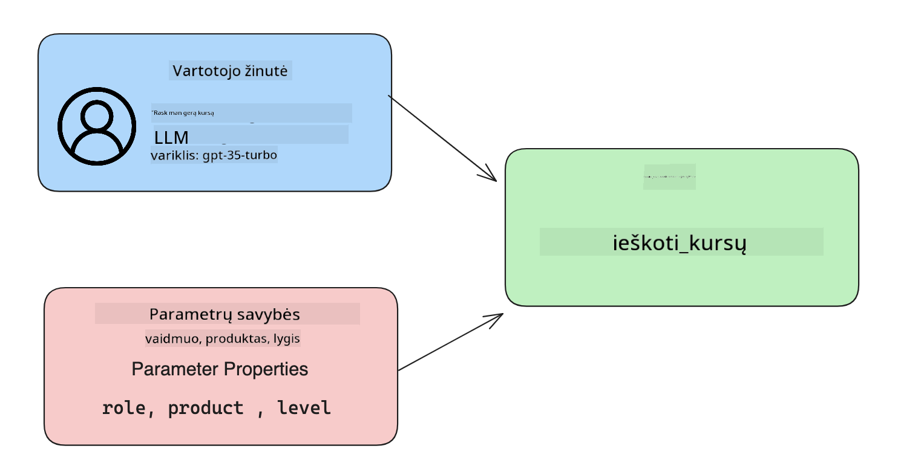

<!--
CO_OP_TRANSLATOR_METADATA:
{
  "original_hash": "f6f84f9ef2d066cd25850cab93580a50",
  "translation_date": "2025-10-18T02:23:37+00:00",
  "source_file": "11-integrating-with-function-calling/README.md",
  "language_code": "lt"
}
-->
# Integracija su funkcijų iškvietimu

[](https://youtu.be/DgUdCLX8qYQ?si=f1ouQU5HQx6F8Gl2)

Jūs jau nemažai išmokote ankstesnėse pamokose. Tačiau vis dar yra galimybių tobulėti. Kai kurie dalykai, kuriuos galime patobulinti, yra nuoseklesnis atsakymų formatas, kad būtų lengviau dirbti su atsakymais vėliau. Taip pat galbūt norėsime pridėti duomenų iš kitų šaltinių, kad dar labiau praturtintume savo programą.

Šiame skyriuje bus sprendžiamos minėtos problemos.

## Įvadas

Šioje pamokoje aptarsime:

- Kas yra funkcijų iškvietimas ir jo naudojimo atvejai.
- Funkcijos iškvietimo kūrimas naudojant Azure OpenAI.
- Kaip integruoti funkcijos iškvietimą į programą.

## Mokymosi tikslai

Pamokos pabaigoje galėsite:

- Paaiškinti funkcijų iškvietimo naudojimo tikslą.
- Nustatyti funkcijos iškvietimą naudojant Azure OpenAI paslaugą.
- Sukurti efektyvius funkcijų iškvietimus, pritaikytus jūsų programos poreikiams.

## Scenarijus: Tobuliname mūsų pokalbių robotą naudojant funkcijas

Šioje pamokoje norime sukurti funkciją mūsų švietimo startuoliui, kuri leistų vartotojams naudoti pokalbių robotą techninių kursų paieškai. Mes rekomenduosime kursus, kurie atitinka jų įgūdžių lygį, dabartinį vaidmenį ir dominančią technologiją.

Norėdami įgyvendinti šį scenarijų, naudosime:

- `Azure OpenAI`, kad sukurtume pokalbių patirtį vartotojui.
- `Microsoft Learn Catalog API`, kad padėtume vartotojams rasti kursus pagal jų užklausą.
- `Funkcijų iškvietimą`, kad vartotojo užklausą perduotume funkcijai, kuri atliks API užklausą.

Pradėkime nuo to, kodėl apskritai norėtume naudoti funkcijų iškvietimą:

## Kodėl funkcijų iškvietimas

Prieš funkcijų iškvietimą, atsakymai iš LLM buvo nestruktūrizuoti ir nenuoseklūs. Kūrėjai turėjo rašyti sudėtingą validavimo kodą, kad galėtų apdoroti kiekvieną atsakymo variaciją. Vartotojai negalėjo gauti atsakymų, tokių kaip „Koks yra dabartinis oras Stokholme?“. Taip yra todėl, kad modeliai buvo apriboti duomenimis, kuriais jie buvo apmokyti.

Funkcijų iškvietimas yra Azure OpenAI paslaugos funkcija, skirta įveikti šiuos apribojimus:

- **Nuoseklus atsakymų formatas**. Jei galime geriau kontroliuoti atsakymų formatą, galime lengviau integruoti atsakymus į kitus sistemas.
- **Išoriniai duomenys**. Galimybė naudoti duomenis iš kitų programos šaltinių pokalbių kontekste.

## Problemos iliustravimas per scenarijų

> Rekomenduojame naudoti [pridėtą užrašų knygelę](./python/aoai-assignment.ipynb?WT.mc_id=academic-105485-koreyst), jei norite vykdyti žemiau pateiktą scenarijų. Taip pat galite tiesiog perskaityti, nes mes stengiamės iliustruoti problemą, kurią galima išspręsti naudojant funkcijas.

Pažvelkime į pavyzdį, kuris iliustruoja atsakymų formato problemą:

Tarkime, norime sukurti studentų duomenų bazę, kad galėtume jiems rekomenduoti tinkamus kursus. Žemiau pateikiami du studentų aprašymai, kurie yra labai panašūs savo turiniu.

1. Sukurkime ryšį su mūsų Azure OpenAI resursu:

   ```python
   import os
   import json
   from openai import AzureOpenAI
   from dotenv import load_dotenv
   load_dotenv()

   client = AzureOpenAI(
   api_key=os.environ['AZURE_OPENAI_API_KEY'],  # this is also the default, it can be omitted
   api_version = "2023-07-01-preview"
   )

   deployment=os.environ['AZURE_OPENAI_DEPLOYMENT']
   ```

   Žemiau pateiktas Python kodas, skirtas sukonfigūruoti ryšį su Azure OpenAI, kur nustatome `api_type`, `api_base`, `api_version` ir `api_key`.

1. Sukurkime du studentų aprašymus, naudodami kintamuosius `student_1_description` ir `student_2_description`.

   ```python
   student_1_description="Emily Johnson is a sophomore majoring in computer science at Duke University. She has a 3.7 GPA. Emily is an active member of the university's Chess Club and Debate Team. She hopes to pursue a career in software engineering after graduating."

   student_2_description = "Michael Lee is a sophomore majoring in computer science at Stanford University. He has a 3.8 GPA. Michael is known for his programming skills and is an active member of the university's Robotics Club. He hopes to pursue a career in artificial intelligence after finishing his studies."
   ```

   Norime išsiųsti aukščiau pateiktus studentų aprašymus LLM, kad išanalizuotume duomenis. Šie duomenys vėliau gali būti naudojami mūsų programoje ir siunčiami į API arba saugomi duomenų bazėje.

1. Sukurkime du identiškus raginimus, kuriuose nurodome LLM, kokia informacija mus domina:

   ```python
   prompt1 = f'''
   Please extract the following information from the given text and return it as a JSON object:

   name
   major
   school
   grades
   club

   This is the body of text to extract the information from:
   {student_1_description}
   '''

   prompt2 = f'''
   Please extract the following information from the given text and return it as a JSON object:

   name
   major
   school
   grades
   club

   This is the body of text to extract the information from:
   {student_2_description}
   '''
   ```

   Aukščiau pateikti raginimai nurodo LLM išgauti informaciją ir grąžinti atsakymą JSON formatu.

1. Nustačius raginimus ir ryšį su Azure OpenAI, dabar išsiųsime raginimus LLM, naudodami `openai.ChatCompletion`. Raginimą saugome kintamajame `messages` ir priskiriame rolę `user`. Tai imituoja vartotojo žinutę, parašytą pokalbių robotui.

   ```python
   # response from prompt one
   openai_response1 = client.chat.completions.create(
   model=deployment,
   messages = [{'role': 'user', 'content': prompt1}]
   )
   openai_response1.choices[0].message.content

   # response from prompt two
   openai_response2 = client.chat.completions.create(
   model=deployment,
   messages = [{'role': 'user', 'content': prompt2}]
   )
   openai_response2.choices[0].message.content
   ```

Dabar galime išsiųsti abi užklausas LLM ir patikrinti gautą atsakymą, surasdami jį kaip `openai_response1['choices'][0]['message']['content']`.

1. Galiausiai galime konvertuoti atsakymą į JSON formatą, naudodami `json.loads`:

   ```python
   # Loading the response as a JSON object
   json_response1 = json.loads(openai_response1.choices[0].message.content)
   json_response1
   ```

   Atsakymas 1:

   ```json
   {
     "name": "Emily Johnson",
     "major": "computer science",
     "school": "Duke University",
     "grades": "3.7",
     "club": "Chess Club"
   }
   ```

   Atsakymas 2:

   ```json
   {
     "name": "Michael Lee",
     "major": "computer science",
     "school": "Stanford University",
     "grades": "3.8 GPA",
     "club": "Robotics Club"
   }
   ```

   Nors raginimai yra vienodi ir aprašymai panašūs, matome, kad `Grades` savybės reikšmės formatuojamos skirtingai, pavyzdžiui, kartais gauname formatą `3.7` arba `3.7 GPA`.

   Šis rezultatas atsiranda dėl to, kad LLM priima nestruktūrizuotus duomenis rašytinio raginimo forma ir taip pat grąžina nestruktūrizuotus duomenis. Mums reikia struktūrizuoto formato, kad žinotume, ko tikėtis saugant ar naudojant šiuos duomenis.

Taigi, kaip išspręsti formatavimo problemą? Naudodami funkcijų iškvietimą, galime užtikrinti, kad gautume struktūrizuotus duomenis. Naudojant funkcijų iškvietimą, LLM iš tikrųjų neįvykdo ir neįvykdo jokių funkcijų. Vietoj to, mes sukuriame struktūrą, kurios LLM laikosi savo atsakymuose. Tada naudojame tuos struktūrizuotus atsakymus, kad žinotume, kokią funkciją vykdyti mūsų programose.


Tada galime paimti tai, kas grąžinama iš funkcijos, ir išsiųsti tai atgal į LLM. Tada LLM atsakys natūralia kalba, kad atsakytų į vartotojo užklausą.

## Funkcijų iškvietimo naudojimo atvejai

Yra daug skirtingų naudojimo atvejų, kai funkcijų iškvietimas gali pagerinti jūsų programą, pavyzdžiui:

- **Išorinių įrankių iškvietimas**. Pokalbių robotai puikiai tinka atsakyti į vartotojų klausimus. Naudodami funkcijų iškvietimą, pokalbių robotai gali naudoti vartotojų žinutes tam tikroms užduotims atlikti. Pavyzdžiui, studentas gali paprašyti pokalbių roboto: „Išsiųskite el. laišką mano dėstytojui, kad man reikia daugiau pagalbos šiuo klausimu“. Tai gali atlikti funkcijos iškvietimą `send_email(to: string, body: string)`.

- **API ar duomenų bazės užklausų kūrimas**. Vartotojai gali rasti informaciją, naudodami natūralią kalbą, kuri paverčiama į suformatuotą užklausą ar API užklausą. Pavyzdžiui, mokytojas gali paprašyti: „Kas yra studentai, kurie atliko paskutinę užduotį“, ir tai gali iškviesti funkciją `get_completed(student_name: string, assignment: int, current_status: string)`.

- **Struktūrizuotų duomenų kūrimas**. Vartotojai gali paimti teksto bloką ar CSV ir naudoti LLM, kad išgautų svarbią informaciją iš jo. Pavyzdžiui, studentas gali konvertuoti Vikipedijos straipsnį apie taikos susitarimus, kad sukurtų AI mokymosi korteles. Tai galima padaryti naudojant funkciją `get_important_facts(agreement_name: string, date_signed: string, parties_involved: list)`.

## Pirmojo funkcijos iškvietimo kūrimas

Funkcijos iškvietimo kūrimo procesą sudaro 3 pagrindiniai žingsniai:

1. **Iškvietimas** Chat Completions API su funkcijų sąrašu ir vartotojo žinute.
2. **Atsakymo skaitymas** iš modelio, kad būtų atliktas veiksmas, pvz., funkcijos ar API užklausos vykdymas.
3. **Pakartotinis iškvietimas** Chat Completions API su funkcijos atsakymu, kad būtų sukurta atsakymo žinutė vartotojui.



### 1 žingsnis - žinučių kūrimas

Pirmasis žingsnis yra sukurti vartotojo žinutę. Tai galima dinamiškai priskirti, paimant teksto įvesties reikšmę, arba priskirti reikšmę čia. Jei tai jūsų pirmas kartas dirbant su Chat Completions API, turime apibrėžti žinutės `role` ir `content`.

`Role` gali būti `system` (taisyklių kūrimas), `assistant` (modelis) arba `user` (galutinis vartotojas). Funkcijų iškvietimui priskirsime `user` ir pateiksime pavyzdinį klausimą.

```python
messages= [ {"role": "user", "content": "Find me a good course for a beginner student to learn Azure."} ]
```

Priskirdami skirtingas roles, LLM aiškiai supranta, ar tai sistema, ar vartotojas, kas padeda sukurti pokalbio istoriją, kuria LLM gali remtis.

### 2 žingsnis - funkcijų kūrimas

Toliau apibrėšime funkciją ir jos parametrus. Čia naudosime tik vieną funkciją, pavadintą `search_courses`, tačiau galite sukurti kelias funkcijas.

> **Svarbu**: Funkcijos įtraukiamos į sistemos žinutę LLM ir bus įtrauktos į turimų tokenų kiekį.

Žemiau sukuriame funkcijas kaip elementų masyvą. Kiekvienas elementas yra funkcija ir turi savybes `name`, `description` ir `parameters`:

```python
functions = [
   {
      "name":"search_courses",
      "description":"Retrieves courses from the search index based on the parameters provided",
      "parameters":{
         "type":"object",
         "properties":{
            "role":{
               "type":"string",
               "description":"The role of the learner (i.e. developer, data scientist, student, etc.)"
            },
            "product":{
               "type":"string",
               "description":"The product that the lesson is covering (i.e. Azure, Power BI, etc.)"
            },
            "level":{
               "type":"string",
               "description":"The level of experience the learner has prior to taking the course (i.e. beginner, intermediate, advanced)"
            }
         },
         "required":[
            "role"
         ]
      }
   }
]
```

Paaiškinkime kiekvieną funkcijos instanciją išsamiau:

- `name` - Funkcijos pavadinimas, kurią norime iškviesti.
- `description` - Funkcijos veikimo aprašymas. Čia svarbu būti konkrečiam ir aiškiam.
- `parameters` - Reikšmių sąrašas ir formatas, kurį modelis turėtų pateikti savo atsakyme. Parameters masyvas susideda iš elementų, kurių kiekvienas turi šias savybes:
  1.  `type` - Savybių saugojimo duomenų tipas.
  1.  `properties` - Konkrečių reikšmių sąrašas, kurį modelis naudos savo atsakyme.
      1. `name` - Raktas yra savybės pavadinimas, kurį modelis naudos savo suformatuotame atsakyme, pavyzdžiui, `product`.
      1. `type` - Šios savybės duomenų tipas, pavyzdžiui, `string`.
      1. `description` - Konkrečios savybės aprašymas.

Taip pat yra neprivaloma savybė `required` - būtina savybė, kad funkcijos iškvietimas būtų užbaigtas.

### 3 žingsnis - Funkcijos iškvietimas

Apibrėžę funkciją, dabar turime ją įtraukti į Chat Completion API užklausą. Tai darome pridėdami `functions` prie užklausos. Šiuo atveju `functions=functions`.

Taip pat yra galimybė nustatyti `function_call` kaip `auto`. Tai reiškia, kad leisime LLM nuspręsti, kurią funkciją iškviesti pagal vartotojo žinutę, o ne priskirti ją patiems.

Žemiau pateiktas kodas, kuriame iškviečiame `ChatCompletion.create`, atkreipkite dėmesį, kaip nustatome `functions=functions` ir `function_call="auto"`, taip suteikdami LLM galimybę pasirinkti, kada iškviesti pateiktas funkcijas:

```python
response = client.chat.completions.create(model=deployment,
                                        messages=messages,
                                        functions=functions,
                                        function_call="auto")

print(response.choices[0].message)
```

Atsakymas, kuris grįžta, atrodo taip:

```json
{
  "role": "assistant",
  "function_call": {
    "name": "search_courses",
    "arguments": "{\n  \"role\": \"student\",\n  \"product\": \"Azure\",\n  \"level\": \"beginner\"\n}"
  }
}
```

Čia matome, kaip buvo iškviesta funkcija `search_courses` ir kokiais argumentais, kaip nurodyta `arguments` savybėje JSON atsakyme.

LLM sugebėjo rasti duomenis, atitinkančius funkcijos argumentus, išgauti juos iš `messages` parametro vertės pokalbio užklausos iškvietime. Žemiau pateikiama `messages` vertės priminimas:

```python
messages= [ {"role": "user", "content": "Find me a good course for a beginner student to learn Azure."} ]
```

Kaip matote, `student`, `Azure` ir `beginner` buvo išgauti iš `messages` ir nustatyti kaip funkcijos įvestis. Naudojant funkcijas tokiu būdu, tai puikus būdas išgauti informaciją iš raginimo, bet taip pat suteikti LLM struktūrą ir turėti pakartotinai naudojamą funkcionalumą.

Dabar turime pamatyti, kaip tai galime panaudoti savo programoje.

## Funkcijų iškvietimo integravimas į programą

Išbandę suformatuotą atsakymą iš LLM, dabar galime integruoti tai į savo programą.

### Srauto valdymas

Norėdami integruoti tai į savo programą, atlikime šiuos veiksmus:

1. Pirmiausia atlikime OpenAI paslaugų užklausą ir saugokime žinutę kintamajame `response_message`.

   ```python
   response_message = response.choices[0].message
   ```

1. Dabar apibrėžkime funkciją, kuri iškvies Microsoft Learn API, kad gautų kursų sąrašą:

   ```python
   import requests

   def search_courses(role, product, level):
     url = "https://learn.microsoft.com/api/catalog/"
     params = {
        "role": role,
        "product": product,
        "level": level
     }
     response = requests.get(url, params=params)
     modules = response.json()["modules"]
     results = []
     for module in modules[:5]:
        title = module["title"]
        url = module["url"]
        results.append({"title": title, "url": url})
     return str(results)
   ```

   Atkreipkite dėmesį, kaip dabar sukuriame tikrą Python funkciją, kuri atitinka funkcijų pavadinimus, pateiktus `functions` kintamajame. Taip pat atliekame tikras išorines API užklausas, kad gautume reikalingus duomenis. Šiuo atveju kreipiamės į Microsoft Learn API, kad ieškotume mokymo modulių.

Gerai, sukūrėme `functions` kintamuosius ir atitinkamą Python funkciją, kaip pasakyti LLM, kaip susieti šiuos du, kad būtų iškviesta mūsų Python funkcija?

1. Norėdami pamatyti, ar reikia iškviesti Python funkciją, turime pažvelgti į LLM atsakymą ir patikrinti, ar jame yra `function_call`, ir iškviesti nurodytą funkciją. Štai kaip galite atlikti minėtą patikrinimą žemiau:

   ```python
   # Check if the model wants to call a function
   if response_message.function_call.name:
    print("Recommended Function call:")
    print(response_message.function_call.name)
    print()

    # Call the function.
    function_name = response_message.function_call.name

    available_functions = {
            "search_courses": search_courses,
    }
    function_to_call = available_functions[function_name]

    function_args = json.loads(response_message.function_call.arguments)
    function_response = function_to_call(**function_args)

    print("Output of function call:")
    print(function_response)
    print(type(function_response))


    # Add the assistant response and function response to the messages
    messages.append( # adding assistant response to messages
        {
            "role": response_message.role,
            "function_call": {
                "name": function_name,
                "arguments": response_message.function_call.arguments,
            },
            "content": None
        }
    )
    messages.append( # adding function response to messages
        {
            "role": "function",
            "name": function_name,
            "content":function_response,
        }
    )
   ```

   Šios trys eilutės užtikrina, kad išgautume funkcijos pavadinimą, argumentus ir atliktume iškvietimą:

   ```python
   function_to_call = available_functions[function_name]

   function_args = json.loads(response_message.function_call.arguments)
   function_response = function_to_call(**function_args)
   ```

   Žemiau pateikiamas mūsų kodo vykdymo rezultatas:

   **Rezultatas**

   ```Recommended Function call:
   {
     "name": "search_courses",
     "arguments": "{\n  \"role\": \"student\",\n  \"product\": \"Azure\",\n  \"level\": \"beginner\"\n}"
   }

   Output of function call:
   [{'title': 'Describe concepts of cryptography', 'url': 'https://learn.microsoft.com/training/modules/describe-concepts-of-cryptography/?
   WT.mc_id=api_CatalogApi'}, {'title': 'Introduction to audio classification with TensorFlow', 'url': 'https://learn.microsoft.com/en-
   us/training/modules/intro-audio-classification-tensorflow/?WT.mc_id=api_CatalogApi'}, {'title': 'Design a Performant Data Model in Azure SQL
   Database with Azure Data Studio', 'url': 'https://learn.microsoft.com/training/modules/design-a-data-model-with-ads/?
   WT.mc_id=api_CatalogApi'}, {'title': 'Getting started with the Microsoft Cloud Adoption Framework for Azure', 'url':
   'https://learn.microsoft.com/training/modules/cloud-adoption-framework-getting-started/?WT.mc_id=api_CatalogApi'}, {'title': 'Set up the
   Rust development environment', 'url': 'https://learn.microsoft.com/training/modules/rust-set-up-environment/?WT.mc_id=api_CatalogApi'}]
   <class 'str'>
   ```

1. Dabar išsiųsime atnaujintą žinutę, `messages`, LLM, kad gautume natūralios kalbos atsakymą, o ne API JSON formatuotą atsakymą.

   ```python
   print("Messages in next request:")
   print(messages)
   print()

   second_response = client.chat.completions.create(
      messages=messages,
      model=deployment,
      function_call="auto",
      functions=functions,
      temperature=0
         )  # get a new response from GPT where it can see the function response


   print(second_response.choices[0].message)
   ```

   **Rezultatas**

   ```python
   {
     "role": "assistant",
     "content": "I found some good courses for beginner students to learn Azure:\n\n1. [Describe concepts of cryptography] (https://learn.microsoft.com/training/modules/describe-concepts-of-cryptography/?WT.mc_id=api_CatalogApi)\n2. [Introduction to audio classification with TensorFlow](https://learn.microsoft.com/training/modules/intro-audio-classification-tensorflow/?WT.mc_id=api_CatalogApi)\n3. [Design a Performant Data Model in Azure SQL Database with Azure Data Studio](https://learn.microsoft.com/training/modules/design-a-data-model-with-ads/?WT.mc_id=api_CatalogApi)\n4. [Getting started with the Microsoft Cloud Adoption Framework for Azure](https://learn.microsoft.com/training/modules/cloud-adoption-framework-getting-started/?WT.mc_id=api_CatalogApi)\n5. [Set up the Rust development environment](https://learn.microsoft.com/training/modules/rust-set-up-environment/?WT.mc_id=api_CatalogApi)\n\nYou can click on the links to access the courses."
   }

   ```

## Užduotis

Norėdami tęsti mokymąsi apie Azure OpenAI funkcijų iškvietimą, galite sukurti:

- Daugiau funkcijos parametrų, kurie galėtų padėti mokiniams rasti daugiau kursų.
- Sukurti kitą funkcijos iškvietimą, kuris paimtų daugiau informacijos iš
- Sukurkite klaidų tvarkymą, kai funkcijos arba API iškvietimas negrąžina tinkamų kursų

Patarimas: Peržiūrėkite [Learn API nuorodų dokumentaciją](https://learn.microsoft.com/training/support/catalog-api-developer-reference?WT.mc_id=academic-105485-koreyst) puslapį, kad sužinotumėte, kaip ir kur šie duomenys yra pasiekiami.

## Puikus darbas! Tęskite kelionę

Baigę šią pamoką, peržiūrėkite mūsų [Generatyvinio dirbtinio intelekto mokymosi kolekciją](https://aka.ms/genai-collection?WT.mc_id=academic-105485-koreyst), kad toliau gilintumėte savo žinias apie generatyvinį dirbtinį intelektą!

Eikite į 12 pamoką, kurioje aptarsime, kaip [kurti UX AI programoms](../12-designing-ux-for-ai-applications/README.md?WT.mc_id=academic-105485-koreyst)!

---

**Atsakomybės apribojimas**:  
Šis dokumentas buvo išverstas naudojant AI vertimo paslaugą [Co-op Translator](https://github.com/Azure/co-op-translator). Nors siekiame tikslumo, prašome atkreipti dėmesį, kad automatiniai vertimai gali turėti klaidų ar netikslumų. Originalus dokumentas jo gimtąja kalba turėtų būti laikomas autoritetingu šaltiniu. Kritinei informacijai rekomenduojama naudoti profesionalų žmogaus vertimą. Mes neprisiimame atsakomybės už nesusipratimus ar neteisingus interpretavimus, atsiradusius dėl šio vertimo naudojimo.